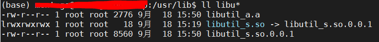
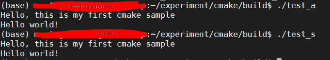

# 编译库和链接可执行文件

2020年12月25日

---


## 1. 说明

在实际开发的过程当中，我们会经常需要将部分程序编译成静态或动态库的形式，供其他应用程序调用而不是将所有文件一次编译为一个可执行文件。这篇笔记就记录使用cmake编译动态和静态库以及将库链接到可执行文件中的过程。

### 1.1 程序功能

总计三个文件：

- utils.cpp/utils.h：定义了一个简单的printmsg()函数供主函数调用，该函数会将传入的字符串打印出来。
- hello.cpp：主程序，调用printmsg()打印"Hello world"。

### 1.2 CMakeLists.txt说明

#### 1. 在build路径下编译

由于cmake下没有诸如"make clean"之类的命令，无法一次清除所有的生成文件，那么在编译时产生的各种编译文件会造成管理的麻烦。所以这里采用out-of-source方式，创建一个build目录，在build目录中编译。

```powershell
mkdir build
cd build
cmake ..
make
```

此时如果要清除上次编译的文件只要删除build目录或者在build目录下删除所有文件即可。

#### 2. 生成静态/动态库，并与可执行文件链接

```powershell
# shared lib
add_library(util_s SHARED utils.cpp)    # 生成动态库libutil_s.so
add_executable (test_s hello.cpp)       # 生成可执行文件test_s
target_link_libraries(test_s util_s)    # 链接可执行文件和动态库

# static lib
add_library(util_a STATIC utils.cpp)    # 生成静态库libutils_a.a
add_executable(test_a hello.cpp)        # 生成可执行文件test_a
target_link_libraries(test_a util_a)    # 链接可执行文件和动态库
```

库名称不需要写全，make时会自动根据当前系统补全前/后缀，如libutil_s.so/libutil_sa.s。

链接了静态库的可执行文件自不必说，它可以在任何路径下执行。但是对于链接动态库的test_s文件，在执行时载入动态库，根据strace的路径看到，虽然没有将当前路径添加到环境变量$LD_LIBRARY_PATH，但是它首先会从本地查找libutil_s.so文件，然后才会依次去环境变量的路径下查找。所以此时的test_s只能在编译出来的当前路径下或者libutil_s.so被拷贝到系统路径时执行。

#### 3. 动态库版本控制

```powershell
set_target_properties(util_s PROPERTIES VERSION ${PROJECT_VERSION})
```

使用该命令会在编译路径下生成一个libutil_s.so的软链接，对应后缀为版本号，比如我这里使用PROJECT_VERSION的变量为0.0.1，也是直接指定版本号。结果如下：

```
root@node01:~/t/build# ll
total 96
drwxr-xr-x 3 root root  4096 Dec 25 13:58 ./
drwxr-xr-x 3 root root  4096 Dec 25 13:57 ../
-rw-r--r-- 1 root root 13514 Dec 25 13:57 CMakeCache.txt
drwxr-xr-x 8 root root  4096 Dec 25 13:58 CMakeFiles/
-rw-r--r-- 1 root root  9015 Dec 25 13:57 Makefile
-rw-r--r-- 1 root root  3492 Dec 25 13:57 cmake_install.cmake
-rw-r--r-- 1 root root    97 Dec 25 13:58 install_manifest.txt
-rw-r--r-- 1 root root  2840 Dec 25 13:57 libutil_a.a
lrwxrwxrwx 1 root root    18 Dec 25 13:57 libutil_s.so -> libutil_s.so.0.0.1*
-rwxr-xr-x 1 root root  8720 Dec 25 13:57 libutil_s.so.0.0.1*
-rwxr-xr-x 1 root root 14288 Dec 25 13:57 test_a*
-rwxr-xr-x 1 root root 14032 Dec 25 13:57 test_s*
root@node01:~/t/build# 
```

#### 4. 安装库文件和头文件

如果在编译时能够将编译出的库文件和头文件拷贝到系统对应的环境变量路径下，可以供其他开发人员方便地使用，提高软件开发的效率。这里可以使用cmake下的install命令来指定路径。

```powershell
install(TARGETS util_a util_s
        LIBRARY DESTINATION lib
        ARCHIVE DESTINATION lib)

install(FILES utils.h DESTINATION include/utils)
```

编译时执行：

```powershell
$ cmake -DCMAKE_INSTALL_PREFIX=/usr ..
$ make
$ sudo make install
[sudo] password for montage:
[ 25%] Built target util_s
[ 50%] Built target util_a
[ 75%] Built target test_s
[100%] Built target test_a
Install the project...
-- Install configuration: ""
-- Installing: /usr/lib/libutil_a.a
-- Installing: /usr/lib/libutil_s.so.0.0.1
-- Up-to-date: /usr/lib/libutil_s.so
-- Up-to-date: /usr/include/utils/utils.h

```

此时库文件会自动拷贝到指定的/usr/lib，头文件拷贝到/usr/include下：



## 2. 代码示例

### 2.1 源文件代码

**utils.h**

```cpp
#ifndef __CMAKE_UTILS__
#define __CMAKE_UTILS__
#include <iostream>
#include <string>

void printmsg(std::string msg);

#endif
```

**utils.cpp**

```cpp
#include "utils.h"

void printmsg(std::string msg)
{
    std::cout << msg << std::endl;
}
```

**hello.cpp**

```cpp
#include <iostream>
#include <string>
#include "utils.h"

int main()
{
    std::cout << "Hello, this is my first cmake sample" << std::endl;
    printmsg("Hello world!");

    return 0;
}
```

### 2.2 CMakeLists.txt文件

```powershell
cmake_minimum_required (VERSION 3.0.0)
project (cmake_test VERSION 0.0.1)

# shared lib
add_library(util_s SHARED utils.cpp)
set_target_properties(util_s PROPERTIES VERSION ${PROJECT_VERSION})

add_executable (test_s hello.cpp)
target_link_libraries(test_s util_s)

# static lib
add_library(util_a STATIC utils.cpp)

add_executable(test_a hello.cpp)
target_link_libraries(test_a util_a)

install(TARGETS util_a util_s
        LIBRARY DESTINATION lib
        ARCHIVE DESTINATION lib)

install(FILES utils.h DESTINATION include/utils)
```

### 2.3 运行结果



## 3. 命令解析

### 3.1 add_library

使用指定的源文件将库添加到项目中。
add_library命令有多种命令格式.

用法1（Normal Libraries）

```powershell
add_library(<name> [STATIC | SHARED | MODULE]
            [EXCLUDE_FROM_ALL]
            [source1] [source2 ...])
```

使用source…指定的源文件来构建一个名为的库。默认情况下会在调用命令对应的目录中创建该库，可以通过ARCHIVE_OUTPUT_DIRECTORY, LIBRARY_OUTPUT_DIRECTORY, 和 RUNTIME_OUTPUT_DIRECTORY 属性来修改创建位置。

- name：库名称，注意是库的逻辑名称，实际输出时会根据平台加上对应的前后缀，如Linux平台下libname.so。
- STATIC/SHARED/MODULE：指定库的类型，如果没有显示指定，则根据变量BUILD_SHARED_LIBS来判断。
  - STATIC：静态库
  - SHATED：动态库
  - MODULE：不会链接到目标文件中，但可以使用dlopen之类的操作在运行时动态加载
- EXCLUDE_FROM_ALL：用于排除不必构建的包，可选。
- source1…：用于构建库的源文件

> 注：对于SHARED和MODULE，cmake会自动设置属性POSITION_INDEPENDENT_CODE 为ON。而SHEARED或STATIC可能会标记FRAMEWORK来构建macOS框架。
> 如果该库不导出任何symbols，那么它不能被声明为SHARED库。

用法2（Imported Libraries）

```powershell
add_library(<name> <SHARED|STATIC|MODULE|OBJECT|UNKNOWN> IMPORTED
            [GLOBAL])
```

从外部导入指定库。

- name：库名称
- SHARED|STATIC|MODULE|OBJECT|UNKNOWN：库类型，UNKNOWN库类型通常仅在查找模块的实现中使用。它允许使用导入的库的路径（通常使用find_library()命令找到），而不必知道它是什么类型的库。这在Windows中静态库和DLL的导入库都具有相同文件扩展名的Windows上尤其有用。
- IMPORTED：固定参数，表示导入库
- GLOBAL：扩展目标库的作用域，使得可以在项目的任意位置使用它。

> 注：对于从哪里导入库的问题，除了上述提到的find_library()命令外，更重要的是定义在属性IMPORTED_LOCATION和IMPORTED_OBJECTS 中指定的路径。

用法3（Object Libraries）

```powershell
add_library(<name> OBJECT <src>...)
```

创建一个对象库。对象库编译源文件，但不将其目标文件归档或链接到库中。不同于其他类型的库，对象库可以在使用诸如add_library和add_executalbe命令创建其他目标文件的时候作为参数或源文件添加进去，使用方式如：

```powershell
# objlib是对象库名称
add_library(... $<TARGET_OBJECTS:objlib> ...)
add_executable(... $<TARGET_OBJECTS:objlib> ...)
```

> 注：对象库可能只包含编译源，头文件和其他不会影响普通库链接的文件（例如.txt）。它们可能包含生成此类源的自定义命令，但不包含PRE_BUILD，PRE_LINK或POST_BUILD命令。

用法4（Alias Libraries）

```powershell
add_library(<name> ALIAS <target>)
```

创建一个别名目标（别名目标是可以在只读上下文中与二进制目标名称互换使用的名称），以便可用于在后续命令中引用。 不会作为生成目标出现在生成的构建系统中。 可能不是非全局导入的目标或ALIAS。 ALIAS目标可用作链接目标以及从中读取属性的目标。也可以使用常规if（TARGET）子命令测试它们的存在。 name不能用于修改target的属性，也就是说，它不能用作set_property（），set_target_properties（），target_link_libraries（）等的操作数。ALIAS目标可能无法安装或导出。

用法5（Interface Libraries）

```powershell
add_library(<name> INTERFACE [IMPORTED [GLOBAL]])
```

创建一个接口库。尽管接口库可能具有设置的属性，并且可以安装，导出和导入，但它不会直接创建构建输出。通常，使用以下命令在接口目标上填充INTERFACE_ *属性：

- set_property(),
- target_link_libraries(INTERFACE),
- target_link_options(INTERFACE),
- target_include_directories(INTERFACE),
- target_compile_options(INTERFACE),
- target_compile_definitions(INTERFACE),
- target_sources(INTERFACE)
  然后它就可以像其他库一样，用作 target_link_libraries() 的参数。

### 3.2 target_link_libraries

此命令有多种格式，这里只讲解最基本的格式。

用法

```powershell
target_link_libraries(<target> ... <item>... ...)
```

- target：要链接的目标文件，通常是可执行文件或库。

- item：被链接的文件，有以下几种情况：

   

  - 库名称：链接命令将会自动包含库的完整路径及其依赖；
  - 包含完整路径的库：链接命令通常保留库的完整路径，如果库发生变化（如删除或移动位置），则需要重新链接以更新依赖
  - 普通的库名：指已经存在于系统内的第三方库或标准库。链接命令会要求链接器搜索该库（例如foo变为-lfoo或foo.lib）。
  - 链接标志：以-开头但不是-l或-framework的项目名称被视为链接器标志。请注意，出于传递依赖关系的目的，此类标志将与任何其他库链接项一样对待，因此通常可以安全地将它们指定为不会传播到依赖项的私有链接项。
  - 生成器表达式：如包含一系列变量或库的list，链接命令会依次链接列表中的库。
  - 调试：优化或常规关键字后紧跟另一个。关键字之后的项目将仅用于相应的构建配置。

作用
将名为item的库链接到目标target文件中。其中target必须是通过add_library()或者add_executable()命令生成的库或可执行文件，且不能为别名。在CMP0079策略没有被设置为NEW时，target必须已经存在于当前的目录下。如果对同一个target多次重复调用此命令，那么对应的item会根据调用顺序依次追加到文件中。

### 3.3 install

这个命令为项目创建安装规则，在安装过程中按顺序执行在源目录中对此命令的调用指定的规则。如在示例中将库和头文件安装到指定的目录中去。
这个命令同样有多种命令格式，这里只分析示例中用到的两种。

用法1（Installing Targets）

```powershell
install(TARGETS targets... [EXPORT <export-name>]
        [[ARCHIVE|LIBRARY|RUNTIME|OBJECTS|FRAMEWORK|BUNDLE|
          PRIVATE_HEADER|PUBLIC_HEADER|RESOURCE]
         [DESTINATION <dir>]
         [PERMISSIONS permissions...]
         [CONFIGURATIONS [Debug|Release|...]]
         [COMPONENT <component>]
         [NAMELINK_COMPONENT <component>]
         [OPTIONAL] [EXCLUDE_FROM_ALL]
         [NAMELINK_ONLY|NAMELINK_SKIP]
        ] [...]
        [INCLUDES DESTINATION [<dir> ...]]
        )
```

指定目标文件的安装规则。

用法2（Installing Files）

```powershell
install(<FILES|PROGRAMS> files...
        TYPE <type> | DESTINATION <dir>
        [PERMISSIONS permissions...]
        [CONFIGURATIONS [Debug|Release|...]]
        [COMPONENT <component>]
        [RENAME <name>] [OPTIONAL] [EXCLUDE_FROM_ALL])
```

指定文件的安装规则

### 3.4 set_target_properties

通常目标（比如可执行文件或库）具有一些属性值，这些属性会影响该目标的构建方式。set_target_properties()命令就用于设置目标对应的属性。

用法

```powershell
set_target_properties(target1 target2 ...
                      PROPERTIES prop1 value1
                      prop2 value2 ...)
```

该命令的语法是列出要更改的所有目标，然后提供下一步要设置的值。您可以使用任何所需的prop值对，并稍后使用get_property（）或get_target_property（）命令将其提取。

- target1…：目标名称
- PROPERTIES：固定参数
- prop：属性名称，如示例中的VERSION
- value：要设置的属性值，如示例中的0.0.1