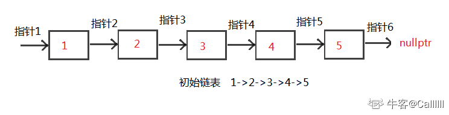
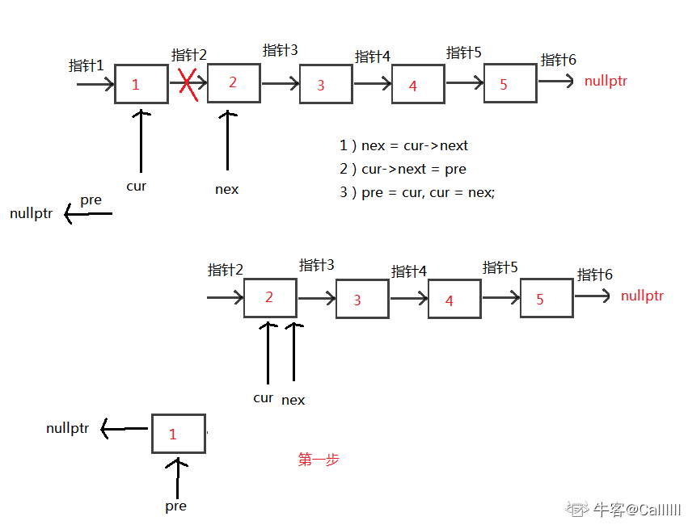
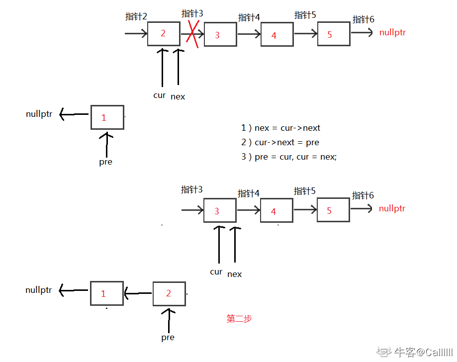
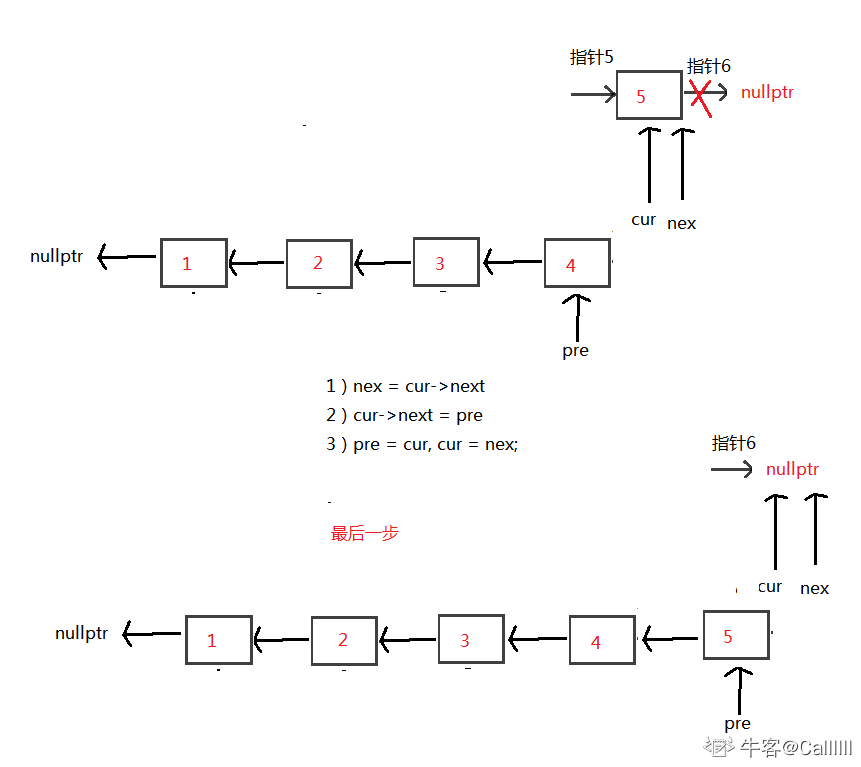

# 反转链表

2020年12月10日

---

题目：输入一个链表，反转链表后，输出新链表的表头

示例1

输入

```
{1,2,3}
```

返回值

```
{3,2,1}
```


## 方法一：构造链表

如果此类型的题出现在笔试中，如果内存要求不高，可以采用如下方法：
可以先用一个vector将单链表的指针都存起来，然后再构造链表。
此方法简单易懂，代码好些。

#### 代码：

```
class Solution {
public:
    ListNode* ReverseList(ListNode* pHead) {
        if (!pHead) return nullptr;
        vector<ListNode*> v;
        while (pHead) {
            v.push_back(pHead);
            pHead = pHead->next;
        }
        reverse(v.begin(), v.end()); // 反转vector，也可以逆向遍历
        ListNode *head = v[0];
        ListNode *cur = head;
        for (int i=1; i<v.size(); ++i) { // 构造链表
            cur->next = v[i]; // 当前节点的下一个指针指向下一个节点
            cur = cur->next; // 当前节点后移
        }
        cur->next = nullptr; // 切记最后一个节点的下一个指针指向nullptr
        return head;
    }
};


```

时间复杂度：O(n)
空间复杂度：O(n), 用了一个vector来存单链表

## 方法二：正规解法

但是面试的时候，上一种解法当然不行。此题想考察的是：如何调整链表指针，来达到反转链表的目的。
初始化：3个指针

1）pre指针指向已经反转好的链表的最后一个节点，最开始没有反转，所以指向nullptr

2）cur指针指向待反转链表的第一个节点，最开始第一个节点待反转，所以指向head

3）nex指针指向待反转链表的第二个节点，目的是保存链表，因为cur改变指向后，后面的链表则失效了，所以需要保存

接下来，循环执行以下三个操作

1）nex = cur->next, 保存作用

2）cur->next = pre 未反转链表的第一个节点的下个指针指向已反转链表的最后一个节点

3）pre = cur， cur = nex; 指针后移，操作下一个未反转链表的第一个节点

循环条件，当然是cur != nullptr

循环结束后，cur当然为nullptr，所以返回pre，即为反转后的头结点

这里以1->2->3->4->5 举例：













中间都是重复步骤，省略了。。。

------

### 代码

```
class Solution {
public:
    ListNode* ReverseList(ListNode* pHead) {
        ListNode *pre = nullptr;
        ListNode *cur = pHead;
        ListNode *nex = nullptr; // 这里可以指向nullptr，循环里面要重新指向
        while (cur) {
            nex = cur->next;
            cur->next = pre;
            pre = cur;
            cur = nex;
        }
        return pre;
    }
};
```

时间复杂度：O(n), 遍历一次链表
空间复杂度：O(1)