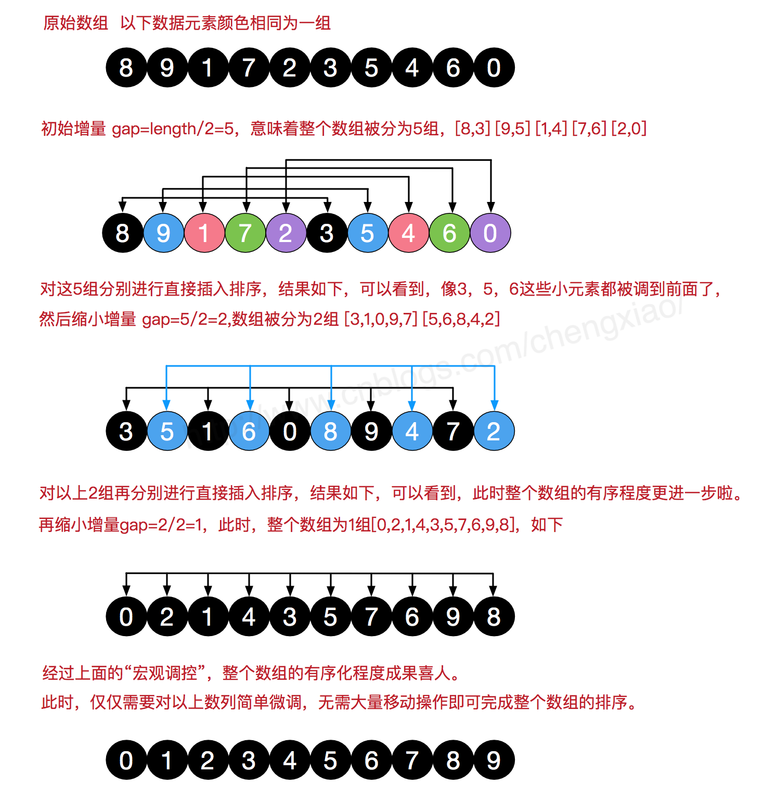

# 希尔排序

2020年12月11日

---


希尔排序是希尔（Donald Shell）于1959年提出的一种排序算法。希尔排序也是一种插入排序，它是简单插入排序经过改进之后的一个更高效的版本，也称为缩小增量排序，同时该算法是冲破O(n2）的第一批算法之一。本文会以图解的方式详细介绍希尔排序的基本思想及其代码实现。

## 基本思想

> 　　**希尔排序是把记录按下标的一定增量分组，对每组使用直接插入排序算法排序；随着增量逐渐减少，每组包含的关键词越来越多，当增量减至1时，整个文件恰被分成一组，算法便终止。**

　　简单插入排序很循规蹈矩，不管数组分布是怎么样的，依然一步一步的对元素进行比较，移动，插入，比如[5,4,3,2,1,0]这种倒序序列，数组末端的0要回到首位置很是费劲，比较和移动元素均需n-1次。而希尔排序在数组中采用跳跃式分组的策略，通过某个增量将数组元素划分为若干组，然后分组进行插入排序，随后逐步缩小增量，继续按组进行插入排序操作，直至增量为1。希尔排序通过这种策略使得整个数组在初始阶段达到从宏观上看基本有序，小的基本在前，大的基本在后。然后缩小增量，到增量为1时，其实多数情况下只需微调即可，不会涉及过多的数据移动。

　　我们来看下希尔排序的基本步骤，在此我们选择增量gap=length/2，缩小增量继续以gap = gap/2的方式，这种增量选择我们可以用一个序列来表示，{n/2,(n/2)/2...1}，称为**增量序列**。希尔排序的增量序列的选择与证明是个数学难题，我们选择的这个增量序列是比较常用的，也是希尔建议的增量，称为希尔增量，但其实这个增量序列不是最优的。此处我们做示例使用希尔增量。



## 代码实现

　　在希尔排序的理解时，我们倾向于对于每一个分组，逐组进行处理，但在代码实现中，我们可以不用这么按部就班地处理完一组再调转回来处理下一组（这样还得加个for循环去处理分组）比如[5,4,3,2,1,0] ，首次增量设gap=length/2=3,则为3组[5,2] [4,1] [3,0]，实现时不用循环按组处理，我们可以从第gap个元素开始，逐个跨组处理。同时，在插入数据时，可以采用元素交换法寻找最终位置，也可以采用数组元素移动法寻觅。希尔排序的代码比较简单，如下：


```
/***************************************************************************
 *  @file       main.cpp
 *  @author     MISAYAONE
 *  @date       27  March 2017
 *  @remark     27  March 2017 
 *  @theme      Shell Sort 
 ***************************************************************************/
 
#include <iostream>
#include <vector>
#include <time.h>
#include <Windows.h>
using namespace std;
 
void Shell_sort(int a[],size_t n)
{
	int i,j,k,group;
	for (group = n/2; group > 0; group /= 2)//增量序列为n/2,n/4....直到1
	{
		for (i = 0; i < group; ++i)
		{
			for (j = i+group; j < n; j += group)
			{
				//对每个分组进行插入排序
				if (a[j - group] > a[j])
				{
					int temp = a[j];
					k = j - group;
					while (k>=0 && a[k]>temp)
					{
						a[k+group] = a[k];
						k -= group;
					}
					a[k] = temp;
				}
			}
		}
	}
}
 
int main(int argc, char**argv)
{
	int a[10] = {1,51,6,2,8,2,564,1,65,6};
 
	Shell_sort(a,10);
	for (int i = 0; i < 10; ++i)
	{
		cout<<a[i]<<" ";
	}
	cin.get();
	return 0;
}


```

## 总结

　　本文介绍了希尔排序的基本思想及其代码实现，希尔排序中对于增量序列的选择十分重要，直接影响到希尔排序的性能。我们上面选择的增量序列{n/2,(n/2)/2...1}(希尔增量)，其最坏时间复杂度依然为O(n2)，一些经过优化的增量序列如Hibbard经过复杂证明可使得最坏时间复杂度为O(n3/2)。希尔排序的介绍到此为止，关于其他排序算法的介绍也会陆续更新，谢谢支持。

