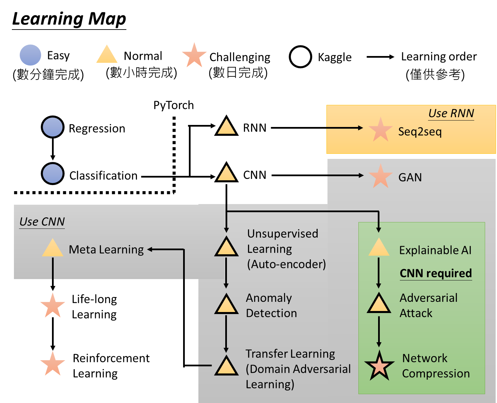

# 深度学习常用概念

#### TODO

- [深度学习应用](apply.md)

### 🍀[训练注意事项⚠️](note.md)

##### 1⃣️ 检查数据

##### 2⃣️训练模型 On Train DataSet， and select one

- [特征缩放--Feature Scaling for input data](featurescale.md)**【1.[输入预处理](../dataloader/README.md)】**
- Networks(Functions)**【2.[网络模型](../models/README.md)，前向传播】**
  - [Vanishing Gradient & Exploding Gradient](tidu.md)【如何解决梯度消失爆炸】
    1. 预训练加微调
    2. 权重[初始化](init.md)
    3. 梯度剪切、权重正则（针对梯度爆炸）
    4. 🍀New Activation Function(使用不同的激活函数)
    5. 使用[BN/LN/IN/GN/SN](bn.md) 
       - [BN](bn2.md)|[BN案例TensorFlow](bn3.md)
       - [LN](ln.md)【TODO】
    6. 使用残差结构
    7. 使用LSTM网络
- Loss function**【3.[损失函数](../loss/README.md) 】**
- 🍀Adaptive Learning Rate**【4.[优化方式](../optimizer/README.md)，反向传播】**

**Tips**

- [固定随机化种子](random.md)
- 评价标准（mAP……）
  - 🍀[mAP ](map.md)  ------>[code](https://github.com/FelixFu520/mAP)
  - 🍀[IOU](iou.md)
- 可视化（权重……）
  - 🍀[CAM](cam.md) ---->[code1](https://github.com/TD-4/Grad-CAM.pytorch)|[code2](https://github.com/FelixFu520/CAM)|[code3](https://github.com/FelixFu520/CAM-Cifar10) 
  - 🍀[DeepDream实现代码](https://github.com/FelixFu520/DeepDream)
  - 🍀[Netron](https://github.com/lutzroeder/netron)

##### 3⃣️测试模型 On Test  Dataset【解决[过拟合](overfitting.md)】

- [正则化](regularization.md)
- early stop
- 数据增强
- dropout
- ……

##### 4⃣️微调

##### 5⃣️压缩

