# Batch Normalization详解

2020年10月21日

---

## 1. 动机

在博文《**为什么要做特征归一化/标准化？** [博客园](https://www.cnblogs.com/shine-lee/p/11779514.html) | [csdn](https://blog.csdn.net/blogshinelee/article/details/102875044) | [blog](https://blog.shinelee.me/2019/10-22-为什么需要特征归一化or标准化？.html)》中，我们介绍了对输入进行Standardization后，梯度下降算法更容易选择到合适的（较大的）学习率，下降过程会更加稳定。

在博文《**网络权重初始化方法总结（下）：Lecun、Xavier与He Kaiming** [博客园](https://www.cnblogs.com/shine-lee/p/11908610.html) | [csdn](https://blog.csdn.net/firelx/article/details/103194358) | [blog](https://blog.shinelee.me/2019/11-11-网络权重初始化方法总结（下）：Lecun、Xavier与He Kaiming.html)》中，我们介绍了如何通过权重初始化让网络在训练之初保持激活层的输出（输入）为zero mean unit variance分布，以减轻梯度消失和梯度爆炸。

但在训练过程中，权重在不断更新，导致激活层输出(输入)的分布会一直变化，可能无法一直保持zero mean unit variance分布，还是有梯度消失和梯度爆炸的可能，直觉上感到，这可能是个问题。下面具体分析。

### 单层视角

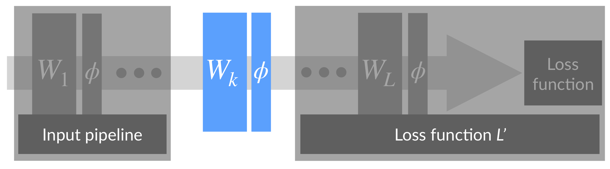

神经网络可以看成是上图形式，对于中间的某一层，其前面的层可以看成是对输入的处理，后面的层可以看成是损失函数。一次反向传播过程会同时更新所有层的权重`𝑊1,𝑊2,…,𝑊𝐿`，前面层权重的更新会改变当前层输入的分布，**而跟据反向传播的计算方式，我们知道，对𝑊𝑘的更新是在假定其输入不变的情况下进行的**。如果假定第𝑘层的输入节点只有2个，对第𝑘层的某个输出节点而言，相当于一个线性模型𝑦=𝑤1𝑥1+𝑤2𝑥2+𝑏，如下图所示，

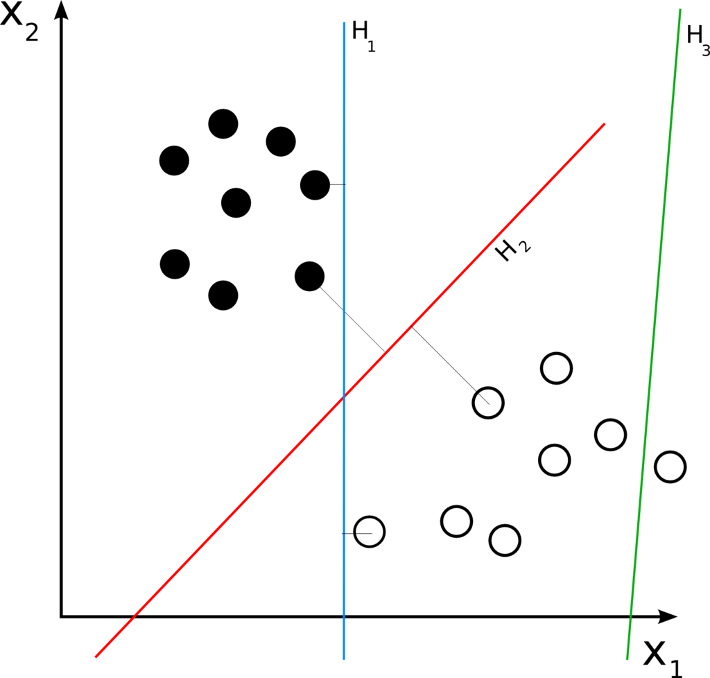

假定当前输入𝑥1和𝑥2的分布如图中圆点所示，本次更新的方向是将直线𝐻1更新成𝐻2，本以为切分得不错，但是当前面层的权重更新完毕，当前层输入的分布换成了另外一番样子，直线相对输入分布的位置可能变成了𝐻3，下一次更新又要根据新的分布重新调整。**直线调整了位置，输入分布又在发生变化，直线再调整位置，就像是直线和分布之间的“追逐游戏”。对于浅层模型，比如SVM，输入特征的分布是固定的，即使拆分成不同的batch，每个batch的统计特性也是相近的，因此只需调整直线位置来适应输入分布，显然要容易得多。而深层模型，每层输入的分布和权重在同时变化，训练相对困难。**

### 多层视角

上面是从网络中单拿出一层分析，下面看一下多层的情况。在反向传播过程中，每层权重的更新是在假定其他权重不变的情况下，向损失函数降低的方向调整自己。问题在于，在一次反向传播过程中，所有的权重会同时更新，导致层间配合“缺乏默契”，每层都在进行上节所说的“追逐游戏”，而且层数越多，相互配合越困难，文中把这个现象称之为 **Internal Covariate Shift**，示意图如下。为了避免过于震荡，学习率不得不设置得足够小，足够小就意味着学习缓慢。

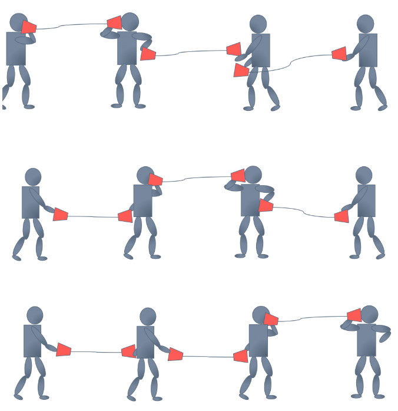

为此，希望对每层输入的分布有所控制，于是就有了**Batch Normalization**，其出发点是对每层的输入做Normalization，只有一个数据是谈不上Normalization的，所以是对一个batch的数据进行Normalization。

## 2. 什么是Batch Normalization

Batch Normalization，简称BatchNorm或BN，翻译为“批归一化”，是神经网络中一种特殊的层，如今已是各种流行网络的标配。**在原paper中，BN被建议插入在（每个）ReLU激活层前面**，如下所示，

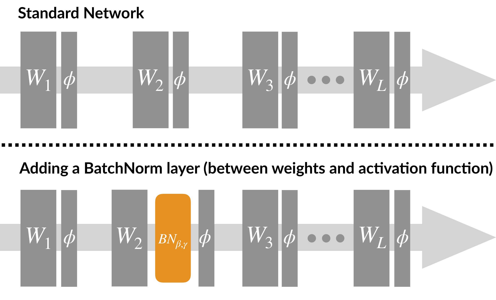

如果batch size为𝑚，则在前向传播过程中，网络中每个节点都有𝑚个输出，所谓的Batch Normalization，就是对该层每个节点的这𝑚个输出进行归一化再输出，具体计算方式如下，

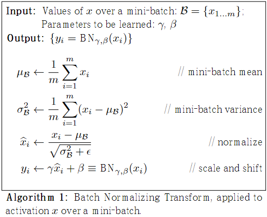

其操作可以分成2步，

1. **Standardization**：首先对𝑚个𝑥进行 Standardization，得到 zero mean unit variance的分布𝑥̂。
2. **scale and shift**：然后再对𝑥̂进行scale and shift，缩放并平移到新的分布𝑦，具有新的均值𝛽方差𝛾。

假设BN层有𝑑个输入节点，则𝑥可构成𝑑×𝑚大小的矩阵𝑋，BN层相当于通过**行操作**将其映射为另一个𝑑×𝑚大小的矩阵𝑌，如下所示，

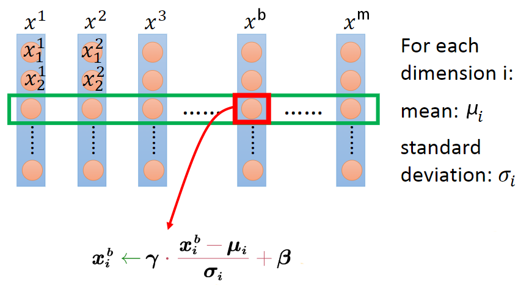

将2个过程写在一个公式里如下，

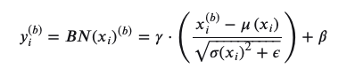

其中，$x_i^{(b)}$表示输入当前batch的b-th样本时该层i-th输入节点的值，𝑥𝑖为$𝑥_i^{(1)}, 𝑥^{(2)}_{𝑖}, x_i^{(m)}$构成的行向量，长度为batch size 𝑚，𝜇和𝜎为该行的均值和标准差，𝜖为防止除零引入的极小量（可忽略），𝛾和𝛽为该行的scale和shift参数，可知

- 𝜇和𝜎为当前行的统计量，不可学习。
- 𝛾和𝛽为待学习的scale和shift参数，用于控制𝑦𝑖的方差和均值。
- BN层中，𝑥𝑖和𝑥𝑗之间不存在信息交流(𝑖≠𝑗)

可见，**无论𝑥𝑖原本的均值和方差是多少，通过BatchNorm后其均值和方差分别变为待学习的𝛽和𝛾。**

## 3. Batch Normalization的反向传播

对于目前的神经网络计算框架，**一个层要想加入到网络中，要保证其是可微的，即可以求梯度**。BatchNorm的梯度该如何求取？

反向传播求梯度只需抓住一个关键点，如果一个变量对另一个变量有影响，那么他们之间就存在偏导数，找到直接相关的变量，再配合链式法则，公式就很容易写出了。

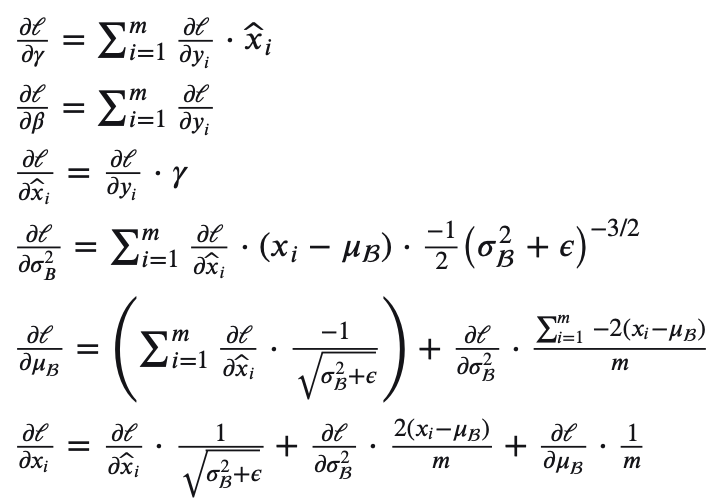

根据反向传播的顺序，首先求取损失ℓ对BN层输出𝑦𝑖的偏导$∂ℓ / ∂𝑦𝑖$，然后是对可学习参数的偏导∂ℓ / ∂𝛾和∂ℓ / ∂𝛽，用于对参数进行更新，想继续回传的话还需要求对输入 𝑥偏导，于是引出对变量𝜇、$𝜎^2$和𝑥̂的偏导，根据链式法则再求这些变量对𝑥的偏导。

在实际实现时，通常以矩阵或向量运算方式进行，比如逐元素相乘、沿某个axis求和、矩阵乘法等操作，具体可以参见[Understanding the backward pass through Batch Normalization Layer](https://kratzert.github.io/2016/02/12/understanding-the-gradient-flow-through-the-batch-normalization-layer.html)和[BatchNorm in Caffe](https://github.com/BVLC/caffe/blob/master/src/caffe/layers/batch_norm_layer.cpp#L169)。

## 4. Batch Normalization的预测阶段

在预测阶段，所有参数的取值是固定的，对BN层而言，意味着𝜇、𝜎、𝛾、𝛽都是固定值。

𝛾和𝛽比较好理解，随着训练结束，两者最终收敛，预测阶段使用训练结束时的值即可。

对于𝜇和𝜎，在训练阶段，它们为当前mini batch的统计量，随着输入batch的不同，𝜇和𝜎一直在变化。在预测阶段，输入数据可能只有1条，该使用哪个𝜇和𝜎，或者说，每个BN层的𝜇和𝜎该如何取值？**可以采用训练收敛最后几批mini batch的 𝜇和𝜎的期望，作为预测阶段的𝜇和𝜎，**如下所示，

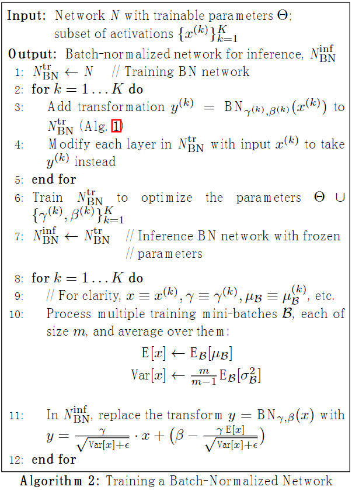

因为Standardization和scale and shift均为线性变换，在预测阶段所有参数均固定的情况下，参数可以合并成𝑦=𝑘𝑥+𝑏的形式，如上图中行号11所示。

## 5. Batch Normalization的作用

使用Batch Normalization，可以获得如下好处，

- **可以使用更大的学习率**，训练过程更加稳定，极大提高了训练速度。
- **可以将bias置为0**，因为Batch Normalization的Standardization过程会移除直流分量，所以不再需要bias。
- **对权重初始化不再敏感**，通常权重采样自0均值某方差的高斯分布，以往对高斯分布的方差设置十分重要，有了Batch Normalization后，对与同一个输出节点相连的权重进行放缩，其标准差𝜎也会放缩同样的倍数，相除抵消。
- **对权重的尺度不再敏感**，理由同上，尺度统一由𝛾参数控制，在训练中决定。
- **深层网络可以使用sigmoid和tanh了**，理由同上，BN抑制了梯度消失。
- **Batch Normalization具有某种正则作用，不需要太依赖dropout，减少过拟合**。

## 6. 几个问题

### 卷积层如何使用BatchNorm？

> For convolutional layers, we additionally want the normalization to obey the convolutional property – **so that different elements of the same feature map, at different locations, are normalized in the same way.** To achieve this, we jointly normalize all the activations in a mini-batch, over all locations.
>
> ...
>
> so for a mini-batch of size m and feature maps of size p × q, we use the effective mini-batch of size m′
>
> = |B| = m · pq. We learn a pair of parameters γ(k) and β(k) per feature map, rather than per activation.
>
> —— [Batch Normalization: Accelerating Deep Network Training by Reducing Internal Covariate Shift](https://arxiv.org/abs/1502.03167)

1个卷积核产生1个feature map，1个feature map有1对𝛾和𝛽参数，同一batch同channel的feature map共享同一对𝛾和𝛽参数，若卷积层有𝑛个卷积核，则有𝑛对𝛾和𝛽参数。

### 没有scale and shift过程可不可以？

BatchNorm有两个过程，Standardization和scale and shift，前者是机器学习常用的数据预处理技术，在浅层模型中，只需对数据进行Standardization即可，Batch Normalization可不可以只有Standardization呢？

答案是可以，但网络的表达能力会下降。

直觉上理解，**浅层模型中，只需要模型适应数据分布即可**。对深度神经网络，每层的输入分布和权重要相互协调，强制把分布限制在zero mean unit variance并不见得是最好的选择，加入参数𝛾和𝛽，对输入进行scale and shift，**有利于分布与权重的相互协调**，特别地，令𝛾=1,𝛽=0等价于只用Standardization，令𝛾=𝜎,𝛽=𝜇等价于没有BN层，scale and shift涵盖了这2种特殊情况，在训练过程中决定什么样的分布是适合的，所以使用scale and shift增强了网络的表达能力。

**表达能力更强，在实践中性能就会更好吗？并不见得，就像曾经参数越多不见得性能越好一样。**在[**caffenet-benchmark-batchnorm**](https://github.com/ducha-aiki/caffenet-benchmark/blob/master/batchnorm.md)中，作者实验发现没有scale and shift性能可能还更好一些，图见下一小节。

### BN层放在ReLU前面还是后面？

原**paper建议将BN层放置在ReLU前，因为ReLU激活函数的输出非负，不能近似为高斯分布。**

> The goal of Batch Normalization is to achieve a stable distribution of activation values throughout training, and in our experiments **we apply it before the nonlinearity since that is where matching the first and second moments is more likely to result in a stable distribution.**
>
> —— [Batch Normalization: Accelerating Deep Network Training by Reducing Internal Covariate Shift](https://arxiv.org/abs/1502.03167)

但是，在[**caffenet-benchmark-batchnorm**](https://github.com/ducha-aiki/caffenet-benchmark/blob/master/batchnorm.md)中，作者基于caffenet在ImageNet2012上做了如下对比实验，

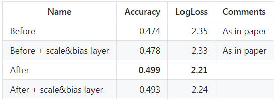

实验表明，放在前后的差异似乎不大，**甚至放在ReLU后还好一些。**

**放在ReLU后相当于直接对每层的输入进行归一化，如下图所示，这与浅层模型的Standardization是一致的。**

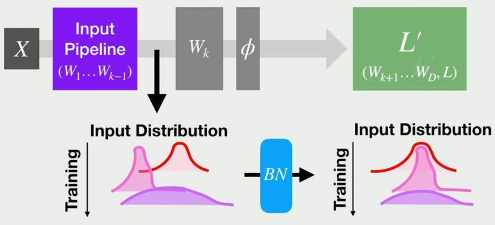

[**caffenet-benchmark-batchnorm**](https://github.com/ducha-aiki/caffenet-benchmark/blob/master/batchnorm.md)中，还有BN层与不同激活函数、不同初始化方法、dropout等排列组合的对比实验，可以看看。

所以，BN究竟应该放在激活的前面还是后面？以及，BN与其他变量，如激活函数、初始化方法、dropout等，如何组合才是最优？**可能只有直觉和经验性的指导意见，具体问题的具体答案可能还是得实验说了算（微笑）。**

### BN层为什么有效？

BN层的有效性已有目共睹，但为什么有效可能还需要进一步研究，这里有一些解释，

- **BN层让损失函数更平滑**。论文[**How Does Batch Normalization Help Optimization**](https://arxiv.org/abs/1805.11604)中，通过分析训练过程中每步梯度方向上步长变化引起的损失变化范围、梯度幅值的变化范围、光滑度的变化，认为添**加BN层后，损失函数的landscape(loss surface)变得更平滑，相比高低不平上下起伏的loss surface，平滑loss surface的梯度预测性更好，可以选取较大的步长。**如下图所示，

  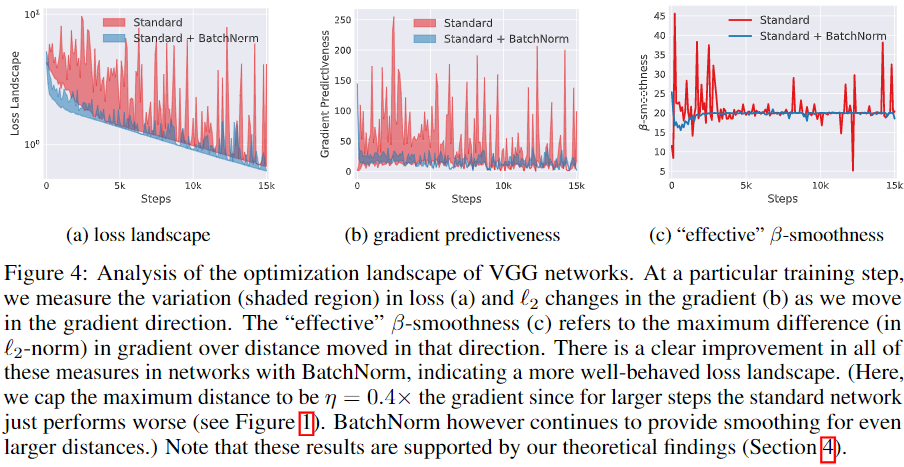

  

- **BN更有利于梯度下降**。论文[**An empirical analysis of the optimization of deep network loss surfaces**](https://arxiv.org/abs/1612.04010)中，绘制了VGG和NIN网络在有无BN层的情况下，loss surface的差异，包含初始点位置以及不同优化算法最终收敛到的local minima位置，如下图所示。**没有BN层的，其loss surface存在较大的高原，有BN层的则没有高原，而是山峰，因此更容易下降。**

  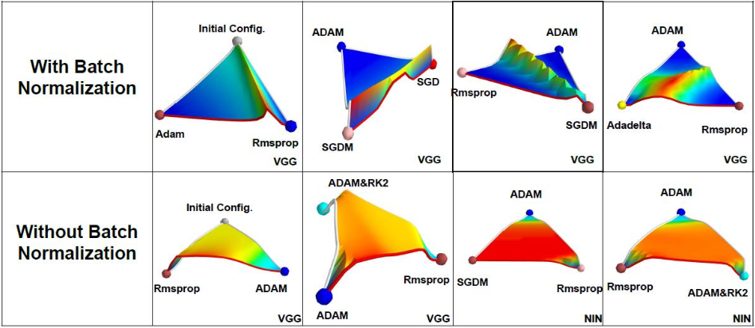

  

- 这里再提供一个直觉上的理解，没有BN层的情况下，网络没办法直接控制每层输入的分布，其分布前面层的权重共同决定，或者说分布的均值和方差“隐藏”在前面层的每个权重中，网络若想调整其分布，需要通过复杂的反向传播过程调整前面的每个权重实现，**BN层的存在相当于将分布的均值和方差从权重中剥离了出来，只需调整𝛾和𝛽两个参数就可以直接调整分布，让分布和权重的配合变得更加容易。**

这里多说一句，论文[**How Does Batch Normalization Help Optimization**](https://arxiv.org/abs/1805.11604)中对比了标准VGG以及加了BN层的VGG每层分布随训练过程的变化，发现两者并无明显差异，认为BatchNorm并没有改善 **Internal Covariate Shift**。**但这里有个问题是**，两者的训练都可以收敛，对于不能收敛或者训练过程十分震荡的模型呢，其分布变化是怎样的？我也不知道，没做过实验（微笑）。

## 参考

> https://www.cnblogs.com/shine-lee/p/11989612.html