# Batch Normalization原理与实战

2020年10月21日

----

 **前言**

本期专栏主要来从理论与实战视角对深度学习中的Batch Normalization的思路进行讲解、归纳和总结，并辅以代码让小伙伴儿们对Batch Normalization的作用有更加直观的了解。

本文主要分为两大部分。**第一部分是理论板块**，主要从背景、算法、效果等角度对Batch Normalization进行详解；**第二部分是实战板块**，主要以MNIST数据集作为整个代码测试的数据，通过比较加入Batch Normalization前后网络的性能来让大家对Batch Normalization的作用与效果有更加直观的感知。

------

## （一）理论板块

理论板块将从以下四个方面对Batch Normalization进行详解：

- 提出背景
- BN算法思想
- 测试阶段如何使用BN
- BN的优势

理论部分主要参考2015年Google的Sergey Ioffe与Christian Szegedy的论文内容，并辅以吴恩达Coursera课程与其它博主的资料。所有参考内容链接均见于文章最后参考链接部分。

### 1 提出背景

#### 1.1 炼丹的困扰

在深度学习中，由于问题的复杂性，我们往往会使用较深层数的网络进行训练，相信很多炼丹的朋友都对调参的困难有所体会，尤其是对深层神经网络的训练调参更是困难且复杂。在这个过程中，我们需要去尝试不同的学习率、初始化参数方法（例如Xavier初始化）等方式来帮助我们的模型加速收敛。深度神经网络之所以如此难训练，其中一个重要原因就是网络中层与层之间存在高度的关联性与耦合性。下图是一个多层的神经网络，层与层之间采用全连接的方式进行连接。

我们规定左侧为神经网络的底层，右侧为神经网络的上层。那么网络中层与层之间的关联性会导致如下的状况：随着训练的进行，网络中的参数也随着梯度下降在不停更新。一方面，当底层网络中参数发生微弱变化时，由于每一层中的线性变换与非线性激活映射，这些微弱变化随着网络层数的加深而被放大（类似蝴蝶效应）；另一方面，参数的变化导致每一层的输入分布会发生改变，进而上层的网络需要不停地去适应这些分布变化，使得我们的模型训练变得困难。上述这一现象叫做Internal Covariate Shift。

#### 1.2 什么是Internal Covariate Shift

Batch Normalization的原论文作者给了Internal Covariate Shift一个较规范的定义：在深层网络训练的过程中，由于网络中参数变化而引起内部结点数据分布发生变化的这一过程被称作Internal Covariate Shift。

这句话该怎么理解呢？我们同样以1.1中的图为例，我们定义每一层的线性变换为 ![[公式]](https://www.zhihu.com/equation?tex=Z%5E%7B%5Bl%5D%7D%3DW%5E%7B%5Bl%5D%7D%5Ctimes+input%2Bb%5E%7B%5Bl%5D%7D)，其中 ![[公式]](https://www.zhihu.com/equation?tex=l+) 代表层数；非线性变换为 ![[公式]](https://www.zhihu.com/equation?tex=A%5E%7B%5Bl%5D%7D%3Dg%5E%7B%5Bl%5D%7D%28Z%5E%7B%5Bl%5D%7D%29) ，其中 ![[公式]](https://www.zhihu.com/equation?tex=g%5E%7B%5Bl%5D%7D%28%5Ccdot%29) 为第 ![[公式]](https://www.zhihu.com/equation?tex=l)层的激活函数。

随着梯度下降的进行，每一层的参数 ![[公式]](https://www.zhihu.com/equation?tex=W%5E%7B%5Bl%5D%7D) 与 ![[公式]](https://www.zhihu.com/equation?tex=b%5E%7B%5Bl%5D%7D) 都会被更新，那么 ![[公式]](https://www.zhihu.com/equation?tex=Z%5E%7B%5Bl%5D%7D) 的分布也就发生了改变，进而 ![[公式]](https://www.zhihu.com/equation?tex=A%5E%7B%5Bl%5D%7D) 也同样出现分布的改变。而 ![[公式]](https://www.zhihu.com/equation?tex=A%5E%7B%5Bl%5D%7D) 作为第 ![[公式]](https://www.zhihu.com/equation?tex=l%2B1) 层的输入，意味着 ![[公式]](https://www.zhihu.com/equation?tex=l%2B1) 层就需要去不停适应这种数据分布的变化，这一过程就被叫做Internal Covariate Shift。

#### 1.3 Internal Covariate Shift会带来什么问题？

**（1）上层网络需要不停调整来适应输入数据分布的变化，导致网络学习速度的降低**

我们在上面提到了梯度下降的过程会让每一层的参数 ![[公式]](https://www.zhihu.com/equation?tex=W%5E%7B%5Bl%5D%7D) 和 ![[公式]](https://www.zhihu.com/equation?tex=b%5E%7B%5Bl%5D%7D) 发生变化，进而使得每一层的线性与非线性计算结果分布产生变化。后层网络就要不停地去适应这种分布变化，这个时候就会使得整个网络的学习速率过慢。

**（2）网络的训练过程容易陷入梯度饱和区，减缓网络收敛速度**

当我们在神经网络中采用饱和激活函数（saturated activation function）时，例如sigmoid，tanh激活函数，很容易使得模型训练陷入梯度饱和区（saturated regime）。随着模型训练的进行，我们的参数 ![[公式]](https://www.zhihu.com/equation?tex=W%5E%7B%5Bl%5D%7D) 会逐渐更新并变大，此时 ![[公式]](https://www.zhihu.com/equation?tex=Z%5E%7B%5Bl%5D%7D%3DW%5E%7B%5Bl%5D%7DA%5E%7B%5Bl-1%5D%7D%2Bb%5E%7B%5Bl%5D%7D) 就会随之变大，并且 ![[公式]](https://www.zhihu.com/equation?tex=Z%5E%7B%5Bl%5D%7D) 还受到更底层网络参数 ![[公式]](https://www.zhihu.com/equation?tex=W%5E%7B%5B1%5D%7D%2CW%5E%7B%5B2%5D%7D%2C%5Ccdots%2CW%5E%7B%5Bl-1%5D%7D) 的影响，随着网络层数的加深， ![[公式]](https://www.zhihu.com/equation?tex=Z%5E%7B%5Bl%5D%7D) 很容易陷入梯度饱和区，此时梯度会变得很小甚至接近于0，参数的更新速度就会减慢，进而就会放慢网络的收敛速度。

对于激活函数梯度饱和问题，有两种解决思路。第一种就是更为非饱和性激活函数，例如线性整流函数ReLU可以在一定程度上解决训练进入梯度饱和区的问题。另一种思路是，我们可以让激活函数的输入分布保持在一个稳定状态来尽可能避免它们陷入梯度饱和区，这也就是Normalization的思路。

#### 1.4 我们如何减缓Internal Covariate Shift？

要缓解ICS的问题，就要明白它产生的原因。ICS产生的原因是由于参数更新带来的网络中每一层输入值分布的改变，并且随着网络层数的加深而变得更加严重，因此我们可以通过固定每一层网络输入值的分布来对减缓ICS问题。

**（1）白化（Whitening）**

白化（Whitening）是机器学习里面常用的一种规范化数据分布的方法，主要是PCA白化与ZCA白化。白化是对输入数据分布进行变换，进而达到以下两个目的：

- **使得输入特征分布具有相同的均值与方差。**其中PCA白化保证了所有特征分布均值为0，方差为1；而ZCA白化则保证了所有特征分布均值为0，方差相同；
- **去除特征之间的相关性。**

通过白化操作，我们可以减缓ICS的问题，进而固定了每一层网络输入分布，加速网络训练过程的收敛（LeCun et al.,1998b；Wiesler&Ney,2011）。

**（2）Batch Normalization提出**

既然白化可以解决这个问题，为什么我们还要提出别的解决办法？当然是现有的方法具有一定的缺陷，白化主要有以下两个问题：

- **白化过程计算成本太高，**并且在每一轮训练中的每一层我们都需要做如此高成本计算的白化操作；
- **白化过程由于改变了网络每一层的分布**，因而改变了网络层中本身数据的表达能力。底层网络学习到的参数信息会被白化操作丢失掉。

既然有了上面两个问题，那我们的解决思路就很简单，一方面，我们提出的normalization方法要能够简化计算过程；另一方面又需要经过规范化处理后让数据尽可能保留原始的表达能力。于是就有了简化+改进版的白化——Batch Normalization。

### 2 Batch Normalization

#### 2.1 思路

既然白化计算过程比较复杂，那我们就简化一点，比如我们可以尝试单独对每个特征进行normalizaiton就可以了，让每个特征都有均值为0，方差为1的分布就OK。

另一个问题，既然白化操作减弱了网络中每一层输入数据表达能力，那我就再加个线性变换操作，让这些数据再能够尽可能恢复本身的表达能力就好了。

因此，基于上面两个解决问题的思路，作者提出了Batch Normalization，下一部分来具体讲解这个算法步骤。

#### 2.2 算法

在深度学习中，由于采用full batch的训练方式对内存要求较大，且每一轮训练时间过长；我们一般都会采用对数据做划分，用mini-batch对网络进行训练。因此，Batch Normalization也就在mini-batch的基础上进行计算。

##### 2.2.1 参数定义

我们依旧以下图这个神经网络为例。我们定义网络总共有 ![[公式]](https://www.zhihu.com/equation?tex=L) 层（不包含输入层）并定义如下符号：

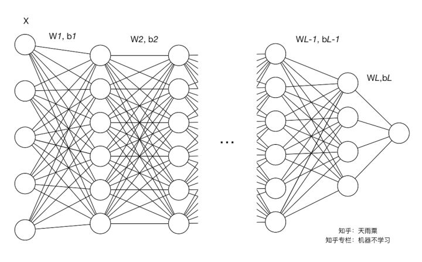

**参数相关：**

- ![[公式]](https://www.zhihu.com/equation?tex=l) ：网络中的层标号
- ![[公式]](https://www.zhihu.com/equation?tex=L) ：网络中的最后一层或总层数
- ![[公式]](https://www.zhihu.com/equation?tex=d_l) ：第 ![[公式]](https://www.zhihu.com/equation?tex=l) 层的维度，即神经元结点数
- ![[公式]](https://www.zhihu.com/equation?tex=W%5E%7B%5Bl%5D%7D) ：第 ![[公式]](https://www.zhihu.com/equation?tex=l) 层的权重矩阵， ![[公式]](https://www.zhihu.com/equation?tex=W%5E%7B%5Bl%5D%7D%5Cin+%5Cmathbb%7BR%7D%5E%7Bd_l%5Ctimes+d_%7Bl-1%7D%7D)
- ![[公式]](https://www.zhihu.com/equation?tex=b%5E%7B%5Bl%5D%7D) ：第 ![[公式]](https://www.zhihu.com/equation?tex=l) 层的偏置向量， ![[公式]](https://www.zhihu.com/equation?tex=b%5E%7B%5Bl%5D%7D%5Cin+%5Cmathbb%7BR%7D%5E%7Bd_l%5Ctimes+1%7D)
- ![[公式]](https://www.zhihu.com/equation?tex=Z%5E%7B%5Bl%5D%7D) ：第 ![[公式]](https://www.zhihu.com/equation?tex=l) 层的线性计算结果， ![[公式]](https://www.zhihu.com/equation?tex=Z%5E%7B%5Bl%5D%7D%3DW%5E%7B%5Bl%5D%7D%5Ctimes+input%2Bb%5E%7B%5Bl%5D%7D)
- ![[公式]](https://www.zhihu.com/equation?tex=g%5E%7B%5Bl%5D%7D%28%5Ccdot%29) ：第 ![[公式]](https://www.zhihu.com/equation?tex=l) 层的激活函数
- ![[公式]](https://www.zhihu.com/equation?tex=A%5E%7B%5Bl%5D%7D) ：第 ![[公式]](https://www.zhihu.com/equation?tex=l) 层的非线性激活结果， ![[公式]](https://www.zhihu.com/equation?tex=A%5E%7B%5Bl%5D%7D%3Dg%5E%7B%5Bl%5D%7D%28Z%5E%7B%5Bl%5D%7D%29)

**样本相关：**

- ![[公式]](https://www.zhihu.com/equation?tex=M) ：训练样本的数量
- ![[公式]](https://www.zhihu.com/equation?tex=N) ：训练样本的特征数
- ![[公式]](https://www.zhihu.com/equation?tex=X) ：训练样本集， ![[公式]](https://www.zhihu.com/equation?tex=X%3D%5C%7Bx%5E%7B%281%29%7D%2Cx%5E%7B%282%29%7D%2C%5Ccdots%2Cx%5E%7B%28M%29%7D%5C%7D%EF%BC%8CX%5Cin+%5Cmathbb%7BR%7D%5E%7BN%5Ctimes+M%7D) （注意这里 ![[公式]](https://www.zhihu.com/equation?tex=X) 的一列是一个样本）
- ![[公式]](https://www.zhihu.com/equation?tex=m) ：batch size，即每个batch中样本的数量
- ![[公式]](https://www.zhihu.com/equation?tex=%5Cchi%5E%7B%28i%29%7D) ：第 ![[公式]](https://www.zhihu.com/equation?tex=i) 个mini-batch的训练数据， ![[公式]](https://www.zhihu.com/equation?tex=X%3D+%5C%7B%5Cchi%5E%7B%281%29%7D%2C%5Cchi%5E%7B%282%29%7D%2C%5Ccdots%2C%5Cchi%5E%7B%28k%29%7D%5C%7D) ，其中 ![[公式]](https://www.zhihu.com/equation?tex=%5Cchi%5E%7B%28i%29%7D%5Cin+%5Cmathbb%7BR%7D%5E%7BN%5Ctimes+m%7D)

##### 2.2.2 算法步骤

介绍算法思路沿袭前面BN提出的思路来讲。第一点，对每个特征进行独立的normalization。我们考虑一个batch的训练，传入m个训练样本，并关注网络中的某一层，忽略上标 ![[公式]](https://www.zhihu.com/equation?tex=l) 。

![[公式]](https://www.zhihu.com/equation?tex=Z%5Cin+%5Cmathbb%7BR%7D%5E%7Bd_l%5Ctimes+m%7D)

我们关注当前层的第 ![[公式]](https://www.zhihu.com/equation?tex=j) 个维度，也就是第 ![[公式]](https://www.zhihu.com/equation?tex=j) 个神经元结点，则有 ![[公式]](https://www.zhihu.com/equation?tex=Z_j%5Cin+%5Cmathbb%7BR%7D%5E%7B1%5Ctimes+m%7D) 。我们当前维度进行规范化：

![[公式]](https://www.zhihu.com/equation?tex=%5Cmu_j%3D%5Cfrac%7B1%7D%7Bm%7D%5Csum_%7Bi%3D1%7D%5Em+Z_j%5E%7B%28i%29%7D)

![[公式]](https://www.zhihu.com/equation?tex=%5Csigma%5E2_j%3D%5Cfrac%7B1%7D%7Bm%7D%5Csum_%7Bi%3D1%7D%5Em%28Z_j%5E%7B%28i%29%7D-%5Cmu_j%29%5E2)

![[公式]](https://www.zhihu.com/equation?tex=%5Chat%7BZ%7D_j%3D%5Cfrac%7BZ_j-%5Cmu_j%7D%7B%5Csqrt%7B%5Csigma_j%5E2%2B%5Cepsilon%7D%7D)

> 其中 ![[公式]](https://www.zhihu.com/equation?tex=%5Cepsilon) 是为了防止方差为0产生无效计算。

下面我们再来结合个具体的例子来进行计算。下图我们只关注第 ![[公式]](https://www.zhihu.com/equation?tex=l) 层的计算结果，左边的矩阵是 ![[公式]](https://www.zhihu.com/equation?tex=Z%5E%7B%5Bl%5D%7D%3DW%5E%7B%5Bl%5D%7DA%5E%7B%5Bl-1%5D%7D%2Bb%5E%7B%5Bl%5D%7D) 线性计算结果，还未进行激活函数的非线性变换。此时每一列是一个样本，图中可以看到共有8列，代表当前训练样本的batch中共有8个样本，每一行代表当前 ![[公式]](https://www.zhihu.com/equation?tex=l) 层神经元的一个节点，可以看到当前 ![[公式]](https://www.zhihu.com/equation?tex=l) 层共有4个神经元结点，即第 ![[公式]](https://www.zhihu.com/equation?tex=l) 层维度为4。我们可以看到，每行的数据分布都不同。

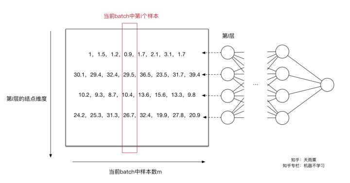

对于第一个神经元，我们求得 ![[公式]](https://www.zhihu.com/equation?tex=%5Cmu_1%3D1.65) ， ![[公式]](https://www.zhihu.com/equation?tex=%5Csigma%5E2_1%3D0.44) （其中 ![[公式]](https://www.zhihu.com/equation?tex=%5Cepsilon%3D10%5E%7B-8%7D) ），此时我们利用 ![[公式]](https://www.zhihu.com/equation?tex=%5Cmu_1%2C%5Csigma%5E2_1) 对第一行数据（第一个维度）进行normalization得到新的值 ![[公式]](https://www.zhihu.com/equation?tex=%5B-0.98%2C-0.23%2C-0.68%2C-1.13%2C0.08%2C0.68%2C2.19%2C0.08%5D) 。同理我们可以计算出其他输入维度归一化后的值。如下图：

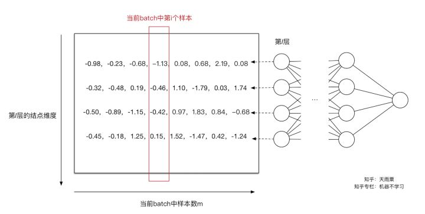

通过上面的变换，**我们解决了第一个问题，即用更加简化的方式来对数据进行规范化，使得第 ![[公式]](https://www.zhihu.com/equation?tex=l)层的输入每个特征的分布均值为0，方差为1。**

如同上面提到的，Normalization操作我们虽然缓解了ICS问题，让每一层网络的输入数据分布都变得稳定，但却导致了数据表达能力的缺失。也就是我们通过变换操作改变了原有数据的信息表达（representation ability of the network），使得底层网络学习到的参数信息丢失。另一方面，通过让每一层的输入分布均值为0，方差为1，会使得输入在经过sigmoid或tanh激活函数时，容易陷入非线性激活函数的线性区域。

因此，BN又引入了两个可学习（learnable）的参数 ![[公式]](https://www.zhihu.com/equation?tex=%5Cgamma) 与 ![[公式]](https://www.zhihu.com/equation?tex=%5Cbeta) 。这两个参数的引入是为了恢复数据本身的表达能力，对规范化后的数据进行线性变换，即 ![[公式]](https://www.zhihu.com/equation?tex=%5Ctilde%7BZ_j%7D%3D%5Cgamma_j+%5Chat%7BZ%7D_j%2B%5Cbeta_j) 。特别地，当 ![[公式]](https://www.zhihu.com/equation?tex=%5Cgamma%5E2%3D%5Csigma%5E2%2C%5Cbeta%3D%5Cmu) 时，可以实现等价变换（identity transform）并且保留了原始输入特征的分布信息。

**通过上面的步骤，我们就在一定程度上保证了输入数据的表达能力。**

以上就是整个Batch Normalization在模型训练中的算法和思路。

> 补充： 在进行normalization的过程中，由于我们的规范化操作会对减去均值，因此，偏置项 ![[公式]](https://www.zhihu.com/equation?tex=b) 可以被忽略掉或可以被置为0，即 ![[公式]](https://www.zhihu.com/equation?tex=BN%28Wu%2Bb%29%3DBN%28Wu%29)

##### 2.2.3 公式

对于神经网络中的第 ![[公式]](https://www.zhihu.com/equation?tex=l) 层，我们有：

![[公式]](https://www.zhihu.com/equation?tex=Z%5E%7B%5Bl%5D%7D%3DW%5E%7B%5Bl%5D%7DA%5E%7B%5Bl-1%5D%7D%2Bb%5E%7B%5Bl%5D%7D)

![[公式]](https://www.zhihu.com/equation?tex=%5Cmu%3D%5Cfrac%7B1%7D%7Bm%7D%5Csum_%7Bi%3D1%7D%5EmZ%5E%7B%5Bl%5D%28i%29%7D)

![[公式]](https://www.zhihu.com/equation?tex=%5Csigma%5E2%3D%5Cfrac%7B1%7D%7Bm%7D%5Csum_%7Bi%3D1%7D%5Em%28Z%5E%7B%5Bl%5D%28i%29%7D-%5Cmu%29%5E2)

![[公式]](https://www.zhihu.com/equation?tex=%5Ctilde%7BZ%7D%5E%7B%5Bl%5D%7D%3D%5Cgamma%5Ccdot%5Cfrac%7BZ%5E%7B%5Bl%5D%7D-%5Cmu%7D%7B%5Csqrt%7B%5Csigma%5E2%2B%5Cepsilon%7D%7D%2B%5Cbeta)

![[公式]](https://www.zhihu.com/equation?tex=A%5E%7B%5Bl%5D%7D%3Dg%5E%7B%5Bl%5D%7D%28%5Ctilde%7BZ%7D%5E%7B%5Bl%5D%7D%29)

### 3 测试阶段如何使用Batch Normalization？

我们知道BN在每一层计算的 ![[公式]](https://www.zhihu.com/equation?tex=%5Cmu) 与 ![[公式]](https://www.zhihu.com/equation?tex=%5Csigma%5E2) 都是基于当前batch中的训练数据，但是这就带来了一个问题：我们在预测阶段，有可能只需要预测一个样本或很少的样本，没有像训练样本中那么多的数据，此时 ![[公式]](https://www.zhihu.com/equation?tex=%5Cmu) 与 ![[公式]](https://www.zhihu.com/equation?tex=%5Csigma%5E2) 的计算一定是有偏估计，这个时候我们该如何进行计算呢？

利用BN训练好模型后，我们保留了每组mini-batch训练数据在网络中每一层的 ![[公式]](https://www.zhihu.com/equation?tex=%5Cmu_%7Bbatch%7D) 与 ![[公式]](https://www.zhihu.com/equation?tex=%5Csigma%5E2_%7Bbatch%7D)。此时我们使用整个样本的统计量来对Test数据进行归一化，具体来说使用均值与方差的无偏估计：

![[公式]](https://www.zhihu.com/equation?tex=%5Cmu_%7Btest%7D%3D%5Cmathbb%7BE%7D+%28%5Cmu_%7Bbatch%7D%29)

![[公式]](https://www.zhihu.com/equation?tex=%5Csigma%5E2_%7Btest%7D%3D%5Cfrac%7Bm%7D%7Bm-1%7D%5Cmathbb%7BE%7D%28%5Csigma%5E2_%7Bbatch%7D%29)

得到每个特征的均值与方差的无偏估计后，我们对test数据采用同样的normalization方法：

![[公式]](https://www.zhihu.com/equation?tex=BN%28X_%7Btest%7D%29%3D%5Cgamma%5Ccdot+%5Cfrac%7BX_%7Btest%7D-%5Cmu_%7Btest%7D%7D%7B%5Csqrt%7B%5Csigma%5E2_%7Btest%7D%2B%5Cepsilon%7D%7D%2B%5Cbeta)

另外，除了采用整体样本的无偏估计外。吴恩达在Coursera上的Deep Learning课程指出可以对train阶段每个batch计算的mean/variance采用指数加权平均来得到test阶段mean/variance的估计。

### 4 Batch Normalization的优势

Batch Normalization在实际工程中被证明了能够缓解神经网络难以训练的问题，BN具有的有事可以总结为以下三点：

**（1）BN使得网络中每层输入数据的分布相对稳定，加速模型学习速度**

BN通过规范化与线性变换使得每一层网络的输入数据的均值与方差都在一定范围内，使得后一层网络不必不断去适应底层网络中输入的变化，从而实现了网络中层与层之间的解耦，允许每一层进行独立学习，有利于提高整个神经网络的学习速度。

**（2）BN使得模型对网络中的参数不那么敏感，简化调参过程，使得网络学习更加稳定**

在神经网络中，我们经常会谨慎地采用一些权重初始化方法（例如Xavier）或者合适的学习率来保证网络稳定训练。

当学习率设置太高时，会使得参数更新步伐过大，容易出现震荡和不收敛。但是使用BN的网络将不会受到参数数值大小的影响。例如，我们对参数 ![[公式]](https://www.zhihu.com/equation?tex=W) 进行缩放得到 ![[公式]](https://www.zhihu.com/equation?tex=aW) 。对于缩放前的值 ![[公式]](https://www.zhihu.com/equation?tex=Wu) ，我们设其均值为 ![[公式]](https://www.zhihu.com/equation?tex=%5Cmu_1) ，方差为 ![[公式]](https://www.zhihu.com/equation?tex=%5Csigma%5E2_1) ；对于缩放值 ![[公式]](https://www.zhihu.com/equation?tex=aWu) ，设其均值为 ![[公式]](https://www.zhihu.com/equation?tex=%5Cmu_2) ，方差为 ![[公式]](https://www.zhihu.com/equation?tex=%5Csigma%5E2_2) ，则我们有：

![[公式]](https://www.zhihu.com/equation?tex=%5Cmu_2%3Da%5Cmu_1) ， ![[公式]](https://www.zhihu.com/equation?tex=%5Csigma%5E2_2%3Da%5E2%5Csigma%5E2_1)

我们忽略 ![[公式]](https://www.zhihu.com/equation?tex=%5Cepsilon) ，则有：

![[公式]](https://www.zhihu.com/equation?tex=BN%28aWu%29%3D%5Cgamma%5Ccdot%5Cfrac%7BaWu-%5Cmu_2%7D%7B%5Csqrt%7B%5Csigma%5E2_2%7D%7D%2B%5Cbeta%3D%5Cgamma%5Ccdot%5Cfrac%7BaWu-a%5Cmu_1%7D%7B%5Csqrt%7Ba%5E2%5Csigma%5E2_1%7D%7D%2B%5Cbeta%3D%5Cgamma%5Ccdot%5Cfrac%7BWu-%5Cmu_1%7D%7B%5Csqrt%7B%5Csigma%5E2_1%7D%7D%2B%5Cbeta%3DBN%28Wu%29)

![[公式]](https://www.zhihu.com/equation?tex=%5Cfrac%7B%5Cpartial%7BBN%28%28aW%29u%29%7D%7D%7B%5Cpartial%7Bu%7D%7D%3D%5Cgamma%5Ccdot%5Cfrac%7BaW%7D%7B%5Csqrt%7B%5Csigma%5E2_2%7D%7D%3D%5Cgamma%5Ccdot%5Cfrac%7BaW%7D%7B%5Csqrt%7Ba%5E2%5Csigma%5E2_1%7D%7D%3D%5Cfrac%7B%5Cpartial%7BBN%28Wu%29%7D%7D%7B%5Cpartial%7Bu%7D%7D)

![[公式]](https://www.zhihu.com/equation?tex=%5Cfrac%7B%5Cpartial%7BBN%28%28aW%29u%29%7D%7D%7B%5Cpartial%7B%28aW%29%7D%7D%3D%5Cgamma%5Ccdot%5Cfrac%7Bu%7D%7B%5Csqrt%7B%5Csigma%5E2_2%7D%7D%3D%5Cgamma%5Ccdot%5Cfrac%7Bu%7D%7Ba%5Csqrt%7B%5Csigma%5E2_1%7D%7D%3D%5Cfrac%7B1%7D%7Ba%7D%5Ccdot%5Cfrac%7B%5Cpartial%7BBN%28Wu%29%7D%7D%7B%5Cpartial%7BW%7D%7D)

> 注：公式中的 ![[公式]](https://www.zhihu.com/equation?tex=u) 是当前层的输入，也是前一层的输出；不是下标啊旁友们！

我们可以看到，经过BN操作以后，权重的缩放值会被“抹去”，因此保证了输入数据分布稳定在一定范围内。另外，权重的缩放并不会影响到对 ![[公式]](https://www.zhihu.com/equation?tex=u) 的梯度计算；并且当权重越大时，即 ![[公式]](https://www.zhihu.com/equation?tex=a) 越大， ![[公式]](https://www.zhihu.com/equation?tex=%5Cfrac%7B1%7D%7Ba%7D) 越小，意味着权重 ![[公式]](https://www.zhihu.com/equation?tex=W) 的梯度反而越小，这样BN就保证了梯度不会依赖于参数的scale，使得参数的更新处在更加稳定的状态。

因此，在使用Batch Normalization之后，抑制了参数微小变化随着网络层数加深被放大的问题，使得网络对参数大小的适应能力更强，此时我们可以设置较大的学习率而不用过于担心模型divergence的风险。

**（3）BN允许网络使用饱和性激活函数（例如sigmoid，tanh等），缓解梯度消失问题**

在不使用BN层的时候，由于网络的深度与复杂性，很容易使得底层网络变化累积到上层网络中，导致模型的训练很容易进入到激活函数的梯度饱和区；通过normalize操作可以让激活函数的输入数据落在梯度非饱和区，缓解梯度消失的问题；另外通过自适应学习 ![[公式]](https://www.zhihu.com/equation?tex=%5Cgamma) 与 ![[公式]](https://www.zhihu.com/equation?tex=%5Cbeta) 又让数据保留更多的原始信息。

**（4）BN具有一定的正则化效果**

在Batch Normalization中，由于我们使用mini-batch的均值与方差作为对整体训练样本均值与方差的估计，尽管每一个batch中的数据都是从总体样本中抽样得到，但不同mini-batch的均值与方差会有所不同，这就为网络的学习过程中增加了随机噪音，与Dropout通过关闭神经元给网络训练带来噪音类似，在一定程度上对模型起到了正则化的效果。

另外，原作者通过也证明了网络加入BN后，可以丢弃Dropout，模型也同样具有很好的泛化效果。

------

## （二）实战板块

经过了上面了理论学习，我们对BN有了理论上的认知。“Talk is cheap, show me the code”。接下来我们就通过实际的代码来对比加入BN前后的模型效果。实战部分使用MNIST数据集作为数据基础，并使用TensorFlow中的Batch Normalization结构来进行BN的实现。

数据准备：MNIST手写数据集

代码地址：我的[GitHub](https://github.com/TD-4/zhihu/tree/master/batch_normalization_discussion)

**注：TensorFlow版本为1.6.0**

实战板块主要分为两部分：

- 网络构建与辅助函数
- BN测试

### 1 网络构建与辅助函数

首先我们先定义一下神经网络的类，这个类里面主要包括了以下方法：

- build_network：前向计算
- fully_connected：全连接计算
- train：训练模型
- test：测试模型

#### 1.1 build_network

我们首先通过构造函数，把权重、激活函数以及是否使用BN这些变量传入，并生成一个training_accuracies来记录训练过程中的模型准确率变化。这里的initial_weights是一个list，list中每一个元素是一个矩阵（二维tuple），存储了每一层的权重矩阵。build_network实现了网络的构建，并调用了fully_connected函数（下面会提）进行计算。要注意的是，由于MNIST是多分类，在这里我们不需要对最后一层进行激活，保留计算的logits就好。

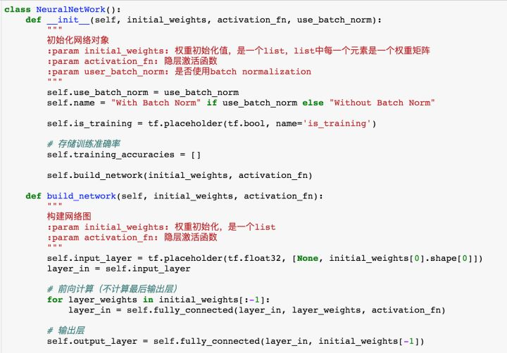

#### 1.2 fully_connected

这里的fully_connected主要用来每一层的线性与非线性计算。通过self.use_batch_norm来控制是否使用BN。

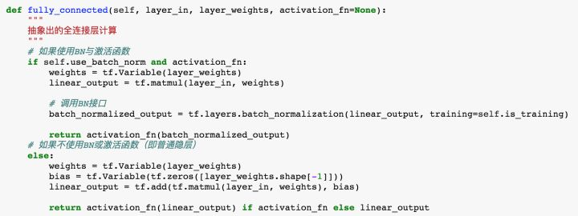

另外，值得注意的是，tf.layers.batch_normalization接口中training参数非常重要，官方文档中描述为：

> **`training`**: Either a Python boolean, or a TensorFlow boolean scalar tensor (e.g. a placeholder). Whether to return the output in training mode (normalized with statistics of the current batch) or in inference mode (normalized with moving statistics). **NOTE**: make sure to set this parameter correctly, or else your training/inference will not work properly.

当我们训练时，要设置为True，保证在训练过程中使用的是mini-batch的统计量进行normalization；在Inference阶段，使用False，也就是使用总体样本的无偏估计。

#### 1.3 train

train函数主要用来进行模型的训练。除了要定义label，loss以及optimizer以外，我们还需要注意，官方文档指出在使用BN时的事项：

> **Note:** when training, the moving_mean and moving_variance need to be updated. By default the update ops are placed in `tf.GraphKeys.UPDATE_OPS`, so they need to be added as a dependency to the `train_op`. 

因此当self.use_batch_norm为True时，要使用tf.control_dependencies保证模型正常训练。

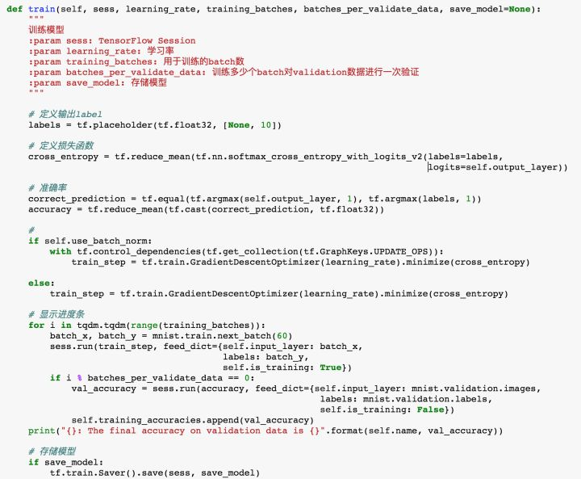

> 注意：在训练过程中batch_size选了60（mnist.train.next_batch(60)），这里是因为BN的原paper中用的60。( We trained the network for 50000 steps, with 60 examples per mini-batch.)

#### 1.4 test

test阶段与train类似，只是要设置self.is_training=False，保证Inference阶段BN的正确。

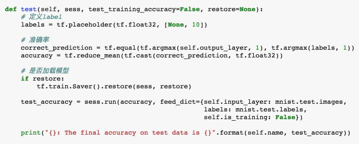

经过上面的步骤，我们的框架基本就搭好了，接下来我们再写一个辅助函数train_and_test以及plot绘图函数就可以开始对BN进行测试啦。train_and_test以及plot函数见GitHub代码中，这里不再赘述。

### 2 BN测试

在这里，我们构造一个4层神经网络，输入层结点数784，三个隐层均为128维，输出层10个结点，如下图所示：

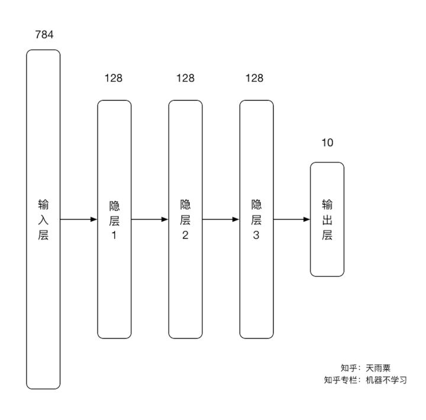

实验中，我们主要控制一下三个变量：

- 权重矩阵（较小初始化权重，标准差为0.05；较大初始化权重，标准差为10）
- 学习率（较小学习率：0.01；较大学习率：2）
- 隐层激活函数（relu，sigmoid）

#### 2.1 小权重，小学习率，ReLU

测试结果如下图：

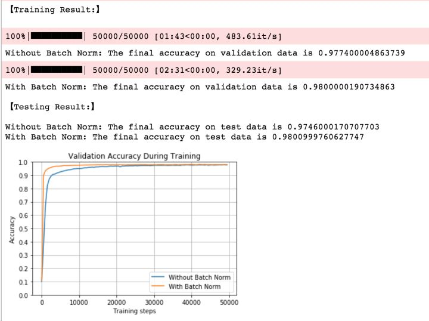

我们可以得到以下结论：

- 在训练与预测阶段，加入BN的模型准确率都稍高一点；
- 加入BN的网络收敛更快（黄线）
- 没有加入BN的网络训练速度更快（483.61it/s>329.23it/s），这是因为BN增加了神经网络中的计算量

为了更清楚地看到BN收敛速度更快，我们把减少Training batches，设置为3000，得到如下结果：

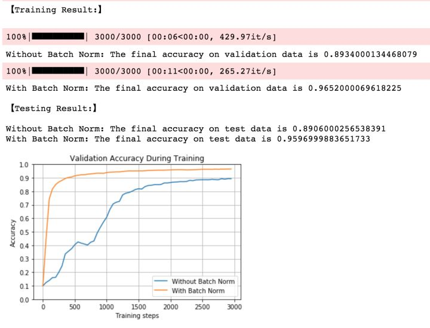

从上图中我们就可以清晰看到，加入BN的网络在第500个batch的时候已经能够在validation数据集上达到90%的准确率；而没有BN的网络的准确率还在不停波动，并且到第3000个batch的时候才达到90%的准确率。

#### 2.2 小权重，小学习率，Sigmoid

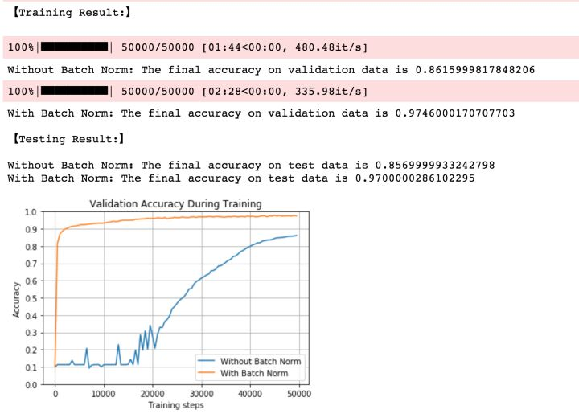

学习率与权重均没变，我们把隐层激活函数换为sigmoid。可以发现，BN收敛速度非常之快，而没有BN的网络前期在不断波动，直到第20000个train batch以后才开始进入平稳的训练状态。

#### 2.3 小权重，大学习率，ReLU

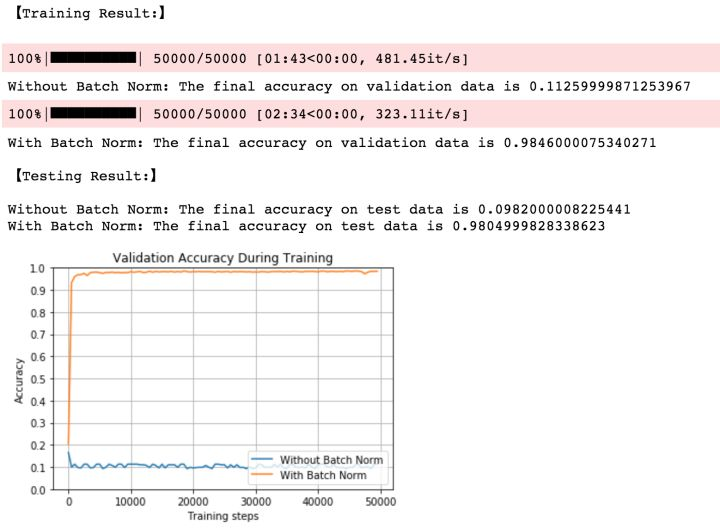

在本次实验中，我们使用了较大的学习率，较大的学习率意味着权重的更新跨度很大，而根据我们前面理论部分的介绍，BN不会受到权重scale的影响，因此其能够使模型保持在一个稳定的训练状态；而没有加入BN的网络则在一开始就由于学习率过大导致训练失败。

#### 2.4 小权重，大学习率，Sigmoid

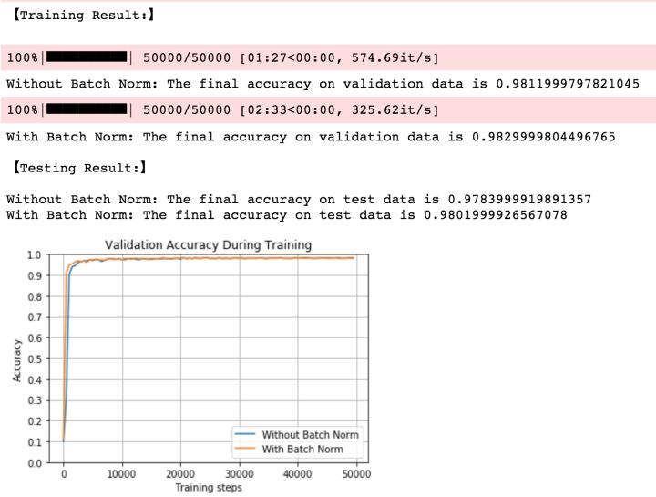

在保持较大学习率（learning rate=2）的情况下，当我们将激活函数换为sigmoid以后，两个模型都能够达到一个很好的效果，并且在test数据及上的准确率非常接近；但加入BN的网络要收敛地更快，同样的，我们来观察3000次batch的训练准确率。

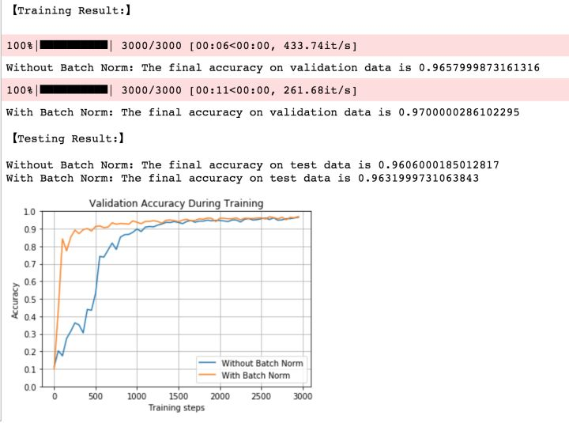

当我们把training batch限制到3000以后，可以发现加入BN后，尽管我们使用较大的学习率，其仍然能够在大约500个batch以后在validation上达到90%的准确率；但不加入BN的准确率前期在一直大幅度波动，到大约1000个batch以后才达到90%的准确率。

#### 2.5 大权重，小学习率，ReLU

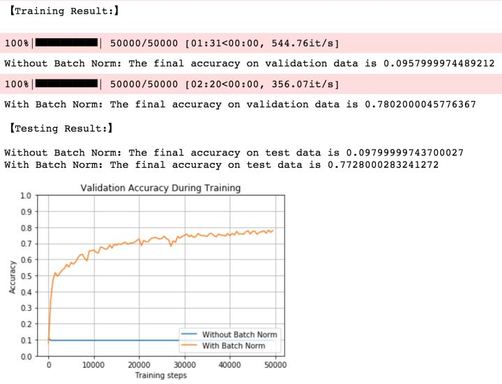

当我们使用较大权重时，不加入BN的网络在一开始就失效；而加入BN的网络能够克服如此bad的权重初始化，并达到接近80%的准确率。

#### 2.6 大权重，小学习率，Sigmoid

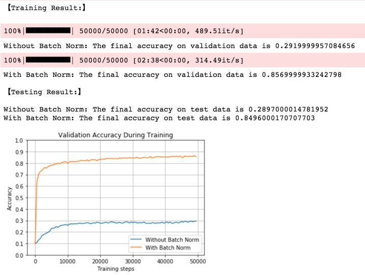

同样使用较大的权重初始化，当我们激活函数为sigmoid时，不加入BN的网络在一开始的准确率有所上升，但随着训练的进行网络逐渐失效，最终准确率仅有30%；而加入BN的网络依旧出色地克服如此bad的权重初始化，并达到接近85%的准确率。

#### 2.7 大权重，大学习率，ReLU

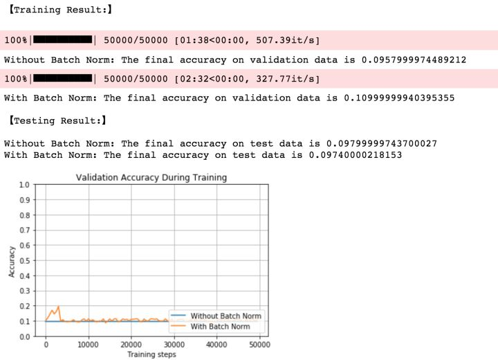

当权重与学习率都很大时，BN网络开始还会训练一段时间，但随后就直接停止训练；而没有BN的神经网络开始就失效。

#### 2.8 大权重，大学习率，Sigmoid

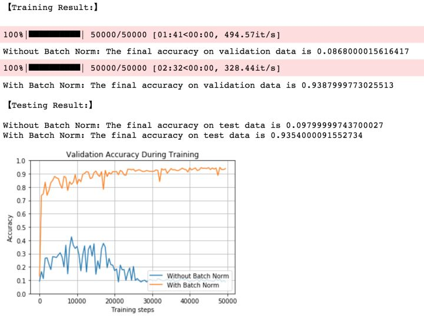

可以看到，加入BN对较大的权重与较大学习率都具有非常好的鲁棒性，最终模型能够达到93%的准确率；而未加入BN的网络则经过一段时间震荡后开始失效。

8个模型的准确率统计如下：

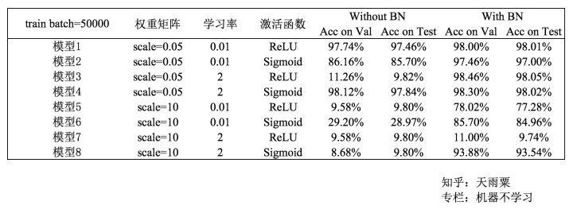

## 总结

至此，关于Batch Normalization的理论与实战部分就介绍道这里。**总的来说，BN通过将每一层网络的输入进行normalization，保证输入分布的均值与方差固定在一定范围内，减少了网络中的Internal Covariate Shift问题，并在一定程度上缓解了梯度消失，加速了模型收敛；并且BN使得网络对参数、激活函数更加具有鲁棒性，降低了神经网络模型训练和调参的复杂度；最后BN训练过程中由于使用mini-batch的mean/variance作为总体样本统计量估计，引入了随机噪声，在一定程度上对模型起到了正则化的效果。**

## **参考资料：**

> https://zhuanlan.zhihu.com/p/34879333