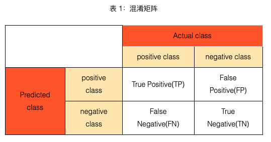
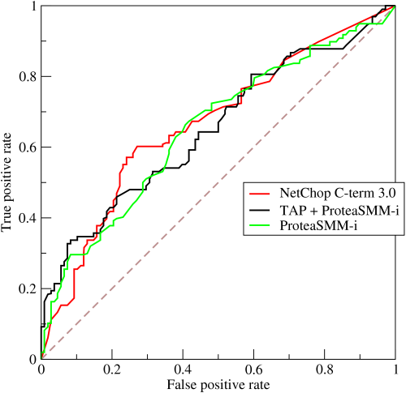

# 混淆矩阵

2020年7月30日

---

　　准确率、精确率（查准率）、召回率（查全率）、F1值、ROC曲线的AUC值，都可以作为评价一个机器学习模型好坏的指标（evaluation metrics），而这些评价指标直接或间接都与混淆矩阵有关，前四者可以从混淆矩阵中直接计算得到，AUC值则要通过ROC曲线进行计算，而ROC曲线的横纵坐标又和混淆矩阵联系密切，所以在了解这些评价指标之前，先知道什么是混淆矩阵很有必要，也方便记忆。

 

## 1. 混淆矩阵

　　混淆矩阵（**confusion matrix**）又称为可能性表格或是错误矩阵。它是一种特定的矩阵用来呈现算法性能的可视化效果，通常是监督学习（非监督学习，通常用匹配矩阵：**matching matrix**）。其每一列代表预测值，每一行代表的是实际的类别。这个名字来源于它可以非常容易的表明多个类别是否有混淆（也就是一个**class**被预测成另一个**class**）, 对于一个二分类问题，我们可以得到如表 1所示的的混淆矩阵（confusion matrix）：

表 1 所示的混淆矩阵中，行表示数据在模型上的预测类别（predicted class/predicted condition），列表示数据的真实类别（actual class/true condition）。在看混淆矩阵时，要分清样本的真实类别和预测类别，有些地方的行列表示可能和这里不一致。[在sklearn中，二分类问题下的混淆矩阵需要分别将表 1 中的predicted class和Actual class对调，将横纵坐标的positive class和negative class都分别对调，再重新计算混淆矩阵。](http://scikit-learn.org/stable/modules/generated/sklearn.metrics.confusion_matrix.html)

通过混淆矩阵，我们可以很直观地看清一个模型在各个类别（positive和negative）上分类的情况。

表 2：TP、FP、FN、TN

| TP   | 真实类别为positive，模型预测的类别也为positive               |
| ---- | ------------------------------------------------------------ |
| FP   | 预测为positive，但真实类别为negative，真实类别和预测类别不一致 |
| FN   | 预测为negative，但真实类别为positive，真实类别和预测类别不一致 |
| TN   | 真实类别为negative，模型预测的类别也为negative               |

　　TP、FP、TN、FN，第二个字母表示样本被预测的类别，第一个字母表示样本的预测类别与真实类别是否一致。

 

## 2.准确率

 　准确率（accuracy）计算公式如下所示：

$$
accuracy=\frac{𝑇𝑃+𝑇𝑁}{𝑇𝑃+𝑇𝑁+𝐹𝑃+𝐹𝑁}=\frac{𝑇𝑃+𝑇𝑁}{all\ data}
$$

准确率表示预测正确的样本（TP和TN）在所有样本（all data）中占的比例。

在数据集不平衡时，准确率将不能很好地表示模型的性能。可能会存在准确率很高，而少数类样本全分错的情况，此时应选择其它模型评价指标。

 

## 3.精确率（查准率）和召回率（查全率）

positive class的精确率（precision）计算公式如下：
$$
precision = \frac{TP}{TP+FP} = \frac{TP}{预测为Positive的样本}
$$

positive class的召回率（recall）计算公式如下：
$$
recall = \frac{TP}{TP+FN} = \frac{TP}{真实为Positive的样本}
$$

positive class的精确率表示在预测为positive的样本中真实类别为positive的样本所占比例；

positive class的召回率表示在真实为positive的样本中模型成功预测出的样本所占比例。　　　　

　　positive class的召回率只和真实为positive的样本相关，与真实为negative的样本无关；而精确率则受到两类样本的影响。

 

## 4. F1值和𝐹𝛽值

F1值的计算公式如下：
$$
F_1 = \frac{2}{\frac{1}{precision}+\frac{1}{recall}} = \frac{ 2 * precision * recall}{precision + recall}
$$

F1值就是精确率和召回率的调和平均值，F1值认为精确率和召回率一样重要。

Fβ值的计算公式如下：
$$
F_\beta = \frac{1 + \beta ^2 }{\frac{1}{precision}+ \frac{\beta^2}{recall}}=\frac{(1+\beta^2)*precision*recall}{\beta^2 * precision + recall}
$$

在β=1时，Fβ就是F1值，此时Fβ认为精确率和召回率一样重要；当β>1时，Fβ认为召回率更重要；当0<β<1时，Fβ认为精确率更重要。除了F1值之外，常用的还有F2和F0.5。

 

## 5.ROC曲线及其AUC值

AUC全称为Area Under Curve，表示一条曲线下面的面积，ROC曲线的AUC值可以用来对模型进行评价。ROC曲线如图 1 所示：

 

**

 图 1：ROC曲线

（注：图片摘自https://en.wikipedia.org/wiki/Receiver_operating_characteristic）

ROC曲线的纵坐标True Positive Rate（TPR）在数值上就等于positive class的recall，记作recall_𝑝𝑜𝑠𝑖𝑡𝑖𝑣𝑒，横坐标False Positive Rate（FPR）在数值上等于(1 - negative class的recall)，记作(1 - recall_𝑛𝑒𝑔𝑎𝑡𝑖𝑣𝑒)如下所示：
$$
TPR = \frac{TP}{TP+FN}=recall_{positive}
$$

$$
FPR = \frac{FP}{FP+TN}=\frac{FP + TN -TN}{FP + TN} = 1- \frac{TN}{FP+TN}=1-recall_{negative}
$$

通过对分类阈值θ（默认0.5）从大到小或者从小到大依次取值，我们可以得到很多组TPR和FPR的值，将其在图像中依次画出就可以得到一条ROC曲线，阈值𝜃θ取值范围为[0,1][0,1]。

ROC曲线在图像上越接近左上角(0,1)模型越好，即ROC曲线下面与横轴和直线FPR = 1围成的面积（AUC值）越大越好。直观上理解，纵坐标TPR就是recall_𝑝𝑜𝑠𝑖𝑡𝑖𝑣𝑒值，横坐标FPR就是(1 - recall_𝑛𝑒𝑔𝑎𝑡𝑖𝑣𝑒)，前者越大越好，后者整体越小越好，在图像上表示就是曲线越接近左上角(0,1)坐标越好。

图 １展示了３个模型的ROC曲线，要知道哪个模型更好，则需要计算每条曲线的AUC值，一般认为AUC值越大越好。AUC值由定义通过计算ROC曲线、横轴和直线FPR = 1三者围成的面积即可得到。

[» ](https://www.cnblogs.com/wuliytTaotao/p/9308944.html)下一篇： [机器学习中如何处理不平衡数据（imbalanced data）？](https://www.cnblogs.com/wuliytTaotao/p/9308944.html)

posted @ 2018-07-09 20:51 [wuliytTaotao](https://www.cnblogs.com/wuliytTaotao/) 阅读(6163) 评论(0) 