# 网络权重初始化方法总结

2020年8月2日

---

## 1. 前向传播与反向传播回顾

神经网络的训练过程可以简化成以下步骤，

1. 输入预处理（feature scaling等）
2. 定义网络模型，初始化网络weight和bias
3. 读入数据，前向传播，得到网络输出
4. 计算损失函数，得到当前损失
5. 反向传播，根据链式法则，逐层回传得到损失函数对当前参数的偏导，根据梯度下降算法对当前参数进行更新
6. 重复步骤3 4 5，直到损失不再减小，即收敛

一个简单的前向传播和反向传播的示意图如下，线性组合和非线性激活交替进行，线性组合层可以为全连接层或卷积层等，图片来自[链接](https://medium.com/usf-msds/deep-learning-best-practices-1-weight-initialization-14e5c0295b94)，

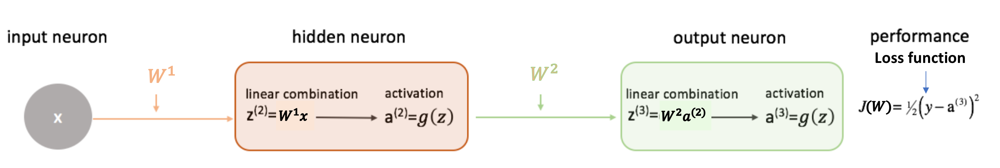

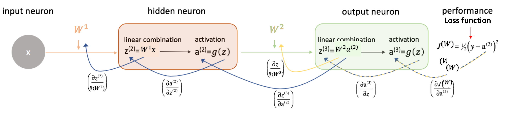

梯度下降算法的参数更新公式为，

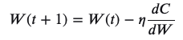

其中𝐶=𝐽(𝑊)为损失函数，即通过参数的偏导对参数进行更新。反向传播时，由链式法则，偏导反向回传，逐层计算损失函数对当前参数的偏导。对某个参数的偏导为一串因子的乘积，因子依次为损失函数对网络输出的偏导、激活函数的偏导、线性组合的偏导、激活函数的偏导、线性组合的偏导……如下面所示（来自[链接](https://stackoverflow.com/questions/53287032/multi-layer-neural-network-back-propagation-formula-using-stochastic-gradient-d)），这里，损失为二分之LMS，用𝐶表示，𝑧为线性组合的输出（激活层的输入），𝑎为激活层的输出（线性组合的输入），

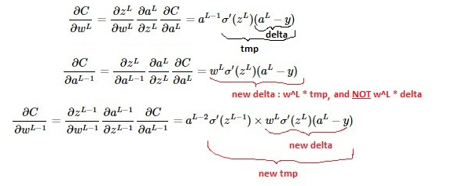

仔细观察上式，偏导为一串因子的乘积，因子中的每一项对乘积结果都有影响，有几点需要注意，回传时，

- 每个权重的偏导中含有一个共同的因子项，为**损失函数对网络输出的偏导**
- 每经过一个激活层，就有一个**激活函数偏导**作为因子项，如$\sigma'(z^L) = \frac{\partial {a^L}}{\partial{z^L}}$
- 对当前线性组合层的权重求偏导，含且只含一个**当前层的输入（前一层的输出）**作为因子项，如$𝑎^{𝐿−1}$
- 每经过一个线性组合层（全连接层or卷积层），就有一个**权重矩阵**作为因子项，如$𝑤^𝐿$

所以，激活函数的偏导、权重矩阵、当前层的输入（前一层的输出），这些项的取值均会对偏导数产生影响，偏导数为这些因子项共同作用的结果，特别地，

- 若激活函数偏导为0，则权重偏导为0；
- 若前一层的输出（当前层输入）为0，则当前层权重的偏导为0；
- 若后一层的权重$𝑤^𝐿$为0，则当前层权重的偏导$\frac{∂𝐶}{∂𝑤_{𝐿−1}}$为0；

直觉上，因子项连乘可能隐含潜在的问题：$0.25^{10}=0.00000095367431640625$,，2^10=1024。对于现在动辄几十、成百、上千层的网络，**这些因子项的取值范围极大地影响着权重偏导的结果：小了，经过连续相乘，结果可能接近于0，大了，结果可能超过数据类型的上界。**同时，网络的深度让这个问题指数级地放大了。

## 2. 梯度消失与梯度爆炸

**梯度为偏导数构成的向量。**

损失函数收敛至极小值时，梯度为0（接近0），损失函数不再下降。**我们不希望在抵达极小值前，梯度就为0了，也不希望下降过程过于震荡，甚至不收敛。**梯度消失与梯度爆炸分别对应这2种现象，

**梯度消失(vanishing gradients)**：指的是在训练过程中，梯度（偏导）过早接近于0的现象，导致（部分）参数一直不再更新，整体上表现得像损失函数收敛了，实际上网络尚未得到充分的训练。

**梯度爆炸（exploding gradients）**：指的是在训练过程中，梯度（偏导）过大甚至为NAN（not a number）的现象，导致损失剧烈震荡，甚至发散(divergence)。

由上一节的分析可知，在梯度（偏导）计算中，主要的影响因素来自**激活函数的偏导**、当前层的输入（前一层的输出）、以及**权重的数值**等，**这些因子连续相乘，带来的影响是指数级的**。训练阶段，**权重在不断调整**，每一层的输入输出也在不断变化，**梯度消失和梯度爆炸可能发生在训练的一开始、也可能发生在训练的过程中**。

因子项中当前层的输入仅出现一次，下面着重看一下激活函数和权重的影响。

### 2.1 激活函数的影响

以Sigmoid和Tanh为例，其函数与导数如下（来自[链接](https://www.jefkine.com/general/2018/05/21/2018-05-21-vanishing-and-exploding-gradient-problems/)），

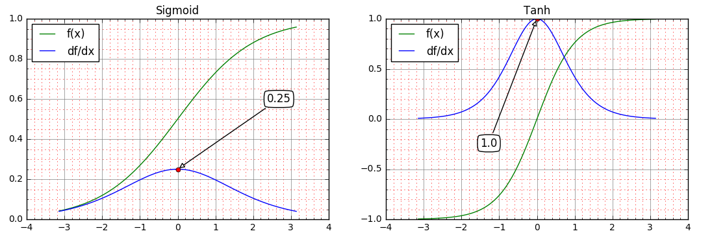

两者的导数均在原点处取得最大值，前者为0.25后者为1，在远离原点的正负方向上，两者导数均趋近于0，即存在饱和区。

- **原点附近**：从因子项连乘结果看，**Tanh比Sigmoid稍好**，其在原点附近的导数在1附近，**如果激活函数的输入均在0左右，偏导连续相乘不会很小也不会很大**。而sigmoid就会比较糟糕，其导数最大值为0.25，连续相乘会使梯度指数级减小，在反向传播时，对层数越多的网络，浅层的梯度消失现象越明显。
- **饱和区**：一旦陷入饱和区，两者的偏导都接近于0，导致权重的更新量很小，比如某些权重很大，导致相关的神经元一直陷在饱和区，更新量又接近于0，以致很难跳出或者要花费很长时间才能跳出饱和区。

所以，一个改善方向是选择更好的非线性激活函数，比如ReLU，相关激活函数如下图所示，

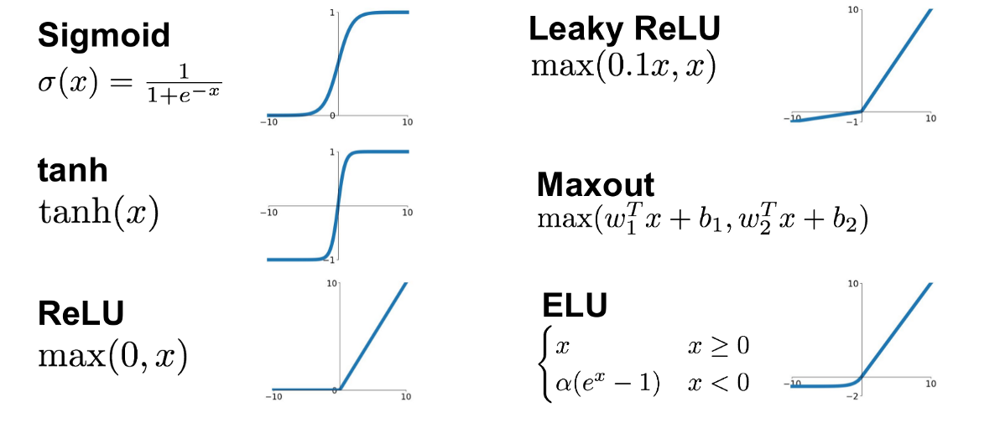

**ReLU只在负方向上存在饱和区，正方向上的导数均为1，因此相对更少地遭遇梯度消失，但梯度爆炸现象仍然存在。**

### 3.2 权重矩阵的影响

假设激活函数为线性，就像ReLU的正向部分，导数全为1。则一个简化版本的全连接神经网络如下图所示，

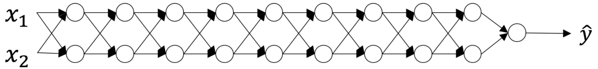

假设权重矩阵均为𝑊，**前向传播和反向传播过程均涉及𝑊（转置）的反复相乘**，t步相当于$W^t$，若𝑊有特征值分解$𝑊=𝑉 𝑑𝑖𝑎𝑔(𝜆) 𝑉^{−1}$，简单地，

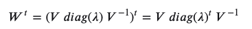

其中𝑑𝑖𝑎𝑔(𝜆)为特征值对角矩阵，如果特征值𝜆𝑖不在1附近，大于1经过𝑡次幂后会“爆炸”，小于1经过𝑡次幂后会“消失”。

如果网络初始化时，权重矩阵过小或过大，则在网络训练的初始阶段就可能遭遇梯度消失或梯度爆炸，表现为损失函数不下降或者过于震荡。

## 3. 不良初始化

至此，一些权重不良初始化导致的问题就不难解释了，

- **过小**，导致梯度消失

- **过大**，导致梯度爆炸

- **全常数初始化**，即所有权重𝑊都相同，则$𝑧^{(2)}= 𝑊 ^{1}𝑥$相同，导致后面每一层的输入和输出均相同，即𝑎和𝑧相同，回到反向传播的公式，每层的偏导相同，进一步导致每层的权重会向相同的方向同步更新，如果学习率只有一个，则每层更新后的权重仍然相同，每层的效果等价于一个神经元，这无疑极大限制了网络的能力。

  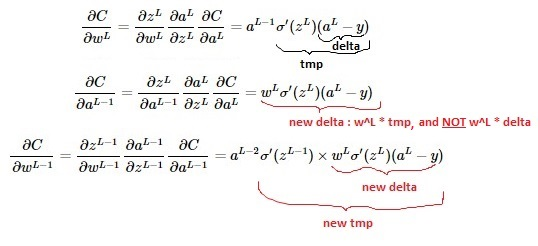

  

- 特别地，**全0初始化**，根据上式，如果激活函数𝑔(0)=0，如ReLU，则初始状态所有激活函数的输入𝑧和输出𝑎都为0，反向传播时所有的梯度为0，权重不会更新，一直保持为0；如果激活函数𝑔(0)≠0，则初始状态激活层的输入为0，但输出𝑎≠0，则权重会从最后一层开始逐层向前更新，改变全0的状态，但是每层权重的更新方向仍相同，同上。

这几种权重初始化方法对网络训练过程的影响，可在[Initializing neural networks](https://www.deeplearning.ai/ai-notes/initialization/)进行可视化实验，可观察权重、梯度和损失的变化，美中不足的是隐藏层的激活函数只有ReLU，不能更换为Sigmoid、Tanh等，如下所示，

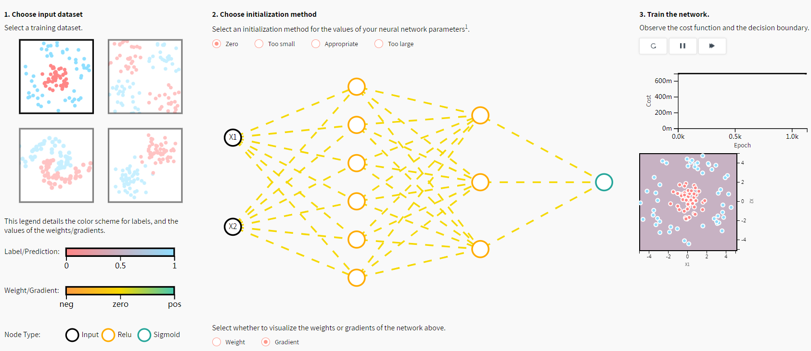

话说回来，所以我们需要好的网络初始化方法，以对反向传播过程中的梯度有所控制。对反向传播中梯度加以控制的方法，不止这里提到的激活函数和权重初始化，还有梯度截断（gradient clipping）、网络模型设计方面等方法，因为本文的重点在于权重初始化，对此按下不表。

那么，合适的网络初始化方法是什么呢？

## 4. 权重初始化最佳实践

由第3节可知，全0、常数、过大、过小的权重初始化都是不好的，那我们需要什么样的初始化？

- 因为对权重𝑤的大小和正负缺乏先验，所以应初始化**在0附近**，但不能为全0或常数，所以要有一定的**随机性**，即**数学期望𝐸(𝑤)=0；**
- **因为梯度消失和梯度爆炸，权重不易过大或过小，所以要对权重的方差Var(w)有所控制；**
- **深度神经网络的多层结构中，每个激活层的输出对后面的层而言都是输入，所以我们希望不同激活层输出的方差相同，即𝑉𝑎𝑟(𝑎[𝑙])=𝑉𝑎𝑟(𝑎[𝑙−1])，这也就意味不同激活层输入的方差相同，即$var(z^{[l]}=var(z^{l-1}))$**
- **如果忽略激活函数，前向传播和反向传播可以看成是权重矩阵（转置）的连续相乘。数值太大，前向时可能陷入饱和区，反向时可能梯度爆炸，数值太小，反向时可能梯度消失。所以初始化时，权重的数值范围（方差）应考虑到前向和后向两个过程；**

权重的随机初始化过程可以看成是从某个概率分布随机采样的过程，常用的分布有高斯分布、均匀分布等，对权重期望和方差的控制可转化为概率分布的参数控制，权重初始化问题也就变成了概率分布的参数设置问题。

在上节中，我们知道反向传播过程同时受到权重矩阵和激活函数的影响，那么，在激活函数不同以及每层超参数配置不同（输入输出数量）的情况下，权重初始化该做怎样的适配？这里，将各家的研究成果汇总如下，

**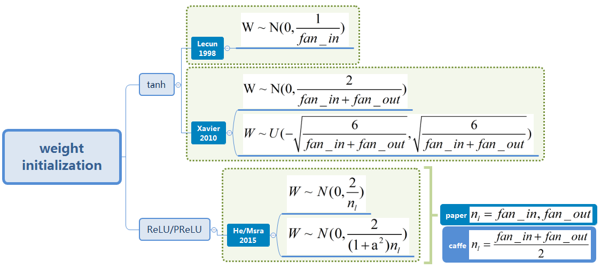**

其中，$fan_{in}$和$fan_{out}$分别为当前全连接层的输入和输出数量，更准确地说，1个输出神经元与$𝑓𝑎𝑛_{𝑖𝑛}$个输入神经元有连接(the number of connections feeding into the node)，1个输入神经元与$𝑓𝑎𝑛_{𝑜𝑢𝑡}$个输出神经元有连接(the number of connections flowing out of the node)，如下图所示（来自[链接](https://software.intel.com/zh-cn/articles/step-by-step-explaination-on-neural-network-backward-propagation-process)），

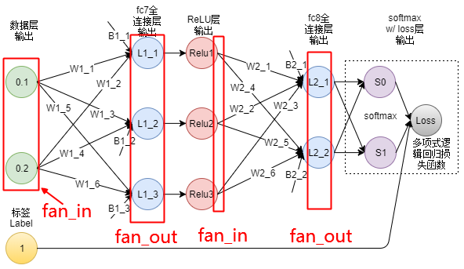

对于卷积层而言，其权重为𝑛个𝑐×ℎ×𝑤大小的卷积核，则一个输出神经元与𝑐×ℎ×𝑤个输入神经元有连接，即$𝑓𝑎𝑛_{𝑖𝑛}=𝑐×ℎ×𝑤$，一个输入神经元与𝑛×ℎ×𝑤个输出神经元有连接，即$𝑓𝑎𝑛_{𝑜𝑢𝑡}=𝑛×ℎ×𝑤$。

## 5. **期望与方差的相关性质**

接下来，首先回顾一下期望与方差计算的相关性质。

对于随机变量𝑋，其方差可通过下式计算,

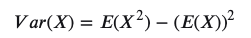

若两个随机变量X和Y，它们相互独立，则其协方差为0，𝐶𝑜𝑣(𝑋,𝑌)=0 进一步可得 𝐸(𝑋𝑌)=𝐸(𝑋)𝐸(𝑌)，推导如下，

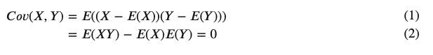

两个独立随机变量和的方差，

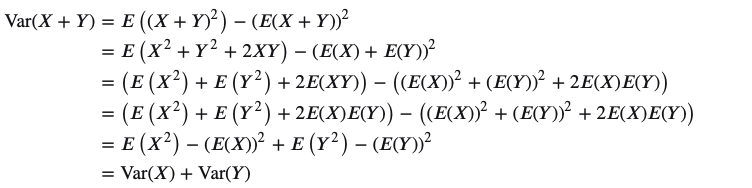

两个独立随机变量积的方差，

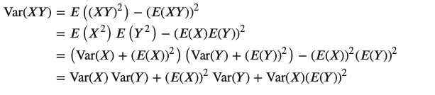

## 6. 全连接层方差分析

对线性组合层+非线性激活层，计算如下所示，其中$𝑧^{[𝑙−1]}_𝑖$为𝑙−1层第𝑖个激活函数的输入，$𝑎^{[𝑙−1]}_𝑖$为其输出，$𝑤^{[𝑙]}_{𝑖𝑗}$为第𝑙层第𝑖个输出神经元与第𝑗个输入神经元连接的权重，𝑏[𝑙]为偏置，计算方式如下

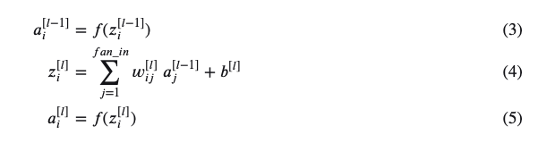

在初始化阶段，将每个权重以及每个输入视为随机变量，可做如下假设和推断，

- 网络输入的每个元素$𝑥_1,𝑥_2,…$为独立同分布；
- 每层的**权重随机初始化**，同层的权重$𝑤_{𝑖1},𝑤_{𝑖2},…$独立同分布，且期望𝐸(𝑤)=0；
- **每层的权重𝑤和输入𝑎随机初始化且相互独立**，所以两者之积构成的随机变量$𝑤_{𝑖1}𝑎_1,𝑤_{𝑖2}𝑎_2,…$亦相互独立，且同分布；
- 根据上面的计算公式，同层的$𝑧_1,𝑧_2,…$为**独立同分布**，同层的$𝑎_1,𝑎_2,…$也为**独立同分布**；

需要注意的是，上面独立同分布的假设仅在初始化阶段成立，当网络开始训练，根据反向传播公式，权重更新后不再相互独立。**在初始化阶段**，输入𝑎与输出𝑧方差间的关系如下，令𝑏=0，

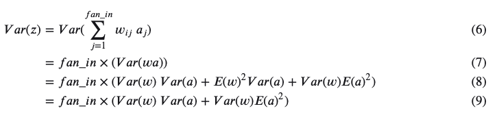

## 7. tanh下的初始化方法

**若激活函数为线性恒等映射**，即𝑓(𝑥)=𝑥，则𝑎=𝑧，自然𝐸(𝑎)=𝐸(𝑧)，𝑉𝑎𝑟(𝑎)=𝑉𝑎𝑟(𝑧)。因为网络输入的期望𝐸(𝑥)=0，每层权重的期望𝐸(𝑤)=0，在前面相互独立的假设下，根据公式𝐸(𝑋𝑌)=𝐸(𝑋)𝐸(𝑌)，可知𝐸(𝑎)=𝐸(𝑧)=∑𝐸(𝑤𝑎)=∑𝐸(𝑤)𝐸(𝑎)=0。由此可得，

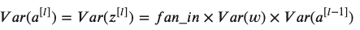

更进一步地，令$𝑛^{[𝑙]}$为第𝑙层的输出数量（$𝑓𝑎𝑛_{𝑜𝑢𝑡}$），则第𝑙层的输入数量（$fan_{in}$ ）即前一层的输出数量为$n^{[l-1]}$。第$L$层输出的方差为

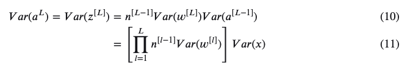

反向传播时，需要将上式中的$𝑛^{[𝑙−1]}$替换为$𝑛^{[𝑙]}$（即$𝑓𝑎𝑛_{𝑖𝑛}$替换为$𝑓𝑎𝑛_{𝑜𝑢𝑡}$），同时将𝑥替换为损失函数对网络输出的偏导。所以，经过𝑡层，前向传播和反向传播的方差，将分别放大或缩小

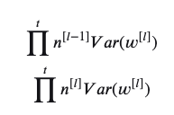

为了避免梯度消失和梯度爆炸，最好保持这个系数为1。

**需要注意的是，**上面的结论是在激活函数为恒等映射的条件下得出的，而tanh激活函数在0附近可近似为恒等映射，即𝑡𝑎𝑛ℎ(𝑥)≈𝑥。

### Lecun 1998

Lecun 1998年的paper [Efficient BackProp](http://yann.lecun.com/exdb/publis/pdf/lecun-98b.pdf) ，在输入Standardization以及采用tanh激活函数的情况下，令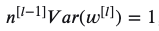，即在初始化阶段让前向传播过程每层方差保持不变，权重从如下高斯分布采样，其中第𝑙层的$𝑓𝑎𝑛_{𝑖𝑛}=𝑛^{[𝑙−1]}$，

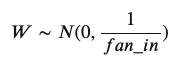

### Xavier 2010

在paper [Xavier-2010-Understanding the difficulty of training deep feedforward neural networks](http://proceedings.mlr.press/v9/glorot10a/glorot10a.pdf)中，Xavier和Bengio同时考虑了前向过程和反向过程，使用$𝑓𝑎𝑛_{𝑖𝑛}$和$𝑓𝑎𝑛_{𝑜𝑢𝑡}$的平均数对方差进行归一化，权重从如下高斯分布中采样，

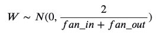

同时文章中还提及了从均匀分布中初始化的方法，因为均匀分布的方差与分布范围的关系为

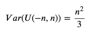

若令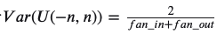，则有

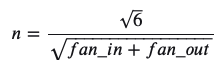

即权重也可从如下均匀分布中采样，

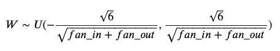

在使用不同激活函数的情况下，是否使用Xavier初始化方法对test error的影响如下所示，图例中带𝑁的表示使用Xavier初始化方法，Softsign一种为类tanh但是改善了饱和区的激活函数，图中可以明显看到tanh 和tanh N在test error上的差异。

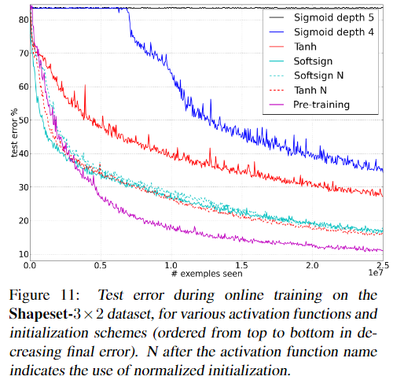

论文还有更多训练过程中的权重和梯度对比图示，这里不再贴出，具体可以参见论文。

## 8. ReLU/PReLU下的初始化方法

搬运一下上面的公式，

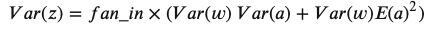

因为激活函数tanh在0附近可近似为恒等映射，所以在初始化阶段可以认为𝐸(𝑎)=0，但是对于ReLU激活函数，其输出均大于等于0，不存在负数，所以𝐸(𝑎)=0的假设不再成立。

但是，我们可以进一步推导得到，

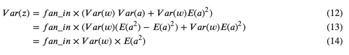

### He 2015 for ReLU

对于某个具体的层𝑙则有，

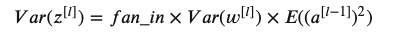

如果假定𝑤[𝑙−1]来自某个关于原点对称的分布，因为$𝐸(𝑤^{[𝑙−1]})=0$，且$𝑏^{[𝑙−1]}=0$，则可以认为$𝑧^{[𝑙−1]}$分布的期望为0，且关于原点0对称。

对于一个关于原点0对称的分布，经过ReLU后，仅保留大于0的部分，则有

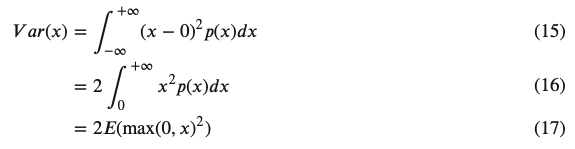

所以，上式可进一步得出，

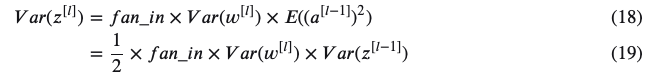

类似地，需要放缩系数为1，即

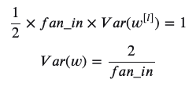

即从前向传播考虑，每层的权重初始化为

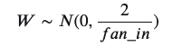

同理，从后向传播考虑，每层的权重初始化为

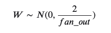

**文中提到，单独使用上面两个中的哪一个都可以**，因为当网络结构确定之后，两者对方差的放缩系数之比为常数，即每层扇入扇出之比的连乘，解释如下，

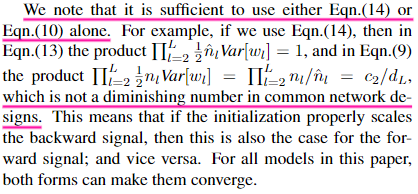

使用Xavier和He初始化，在激活函数为ReLU的情况下，test error下降对比如下，22层的网络，He的初始化下降更快，30层的网络，Xavier不下降，但是He正常下降。

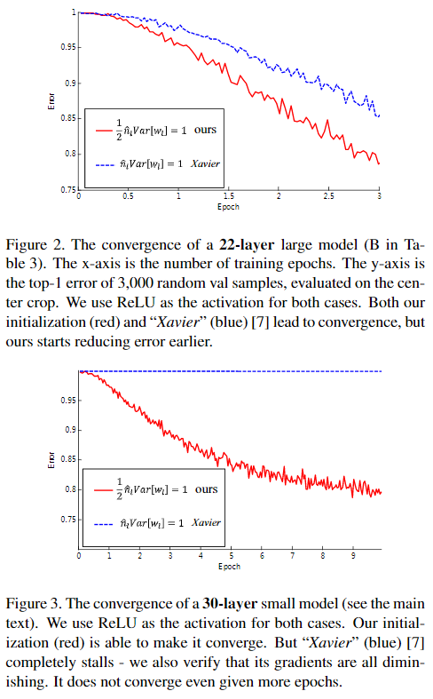

### He 2015 for PReLU

对于PReLU激活函数，负向部分为𝑓(𝑥)=𝑎𝑥，如下右所示，

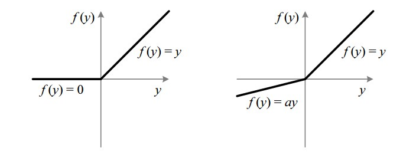

对于PReLU，求取$𝐸((𝑎^{[𝑙−1]})^2)$可对正向和负向部分分别积分，不难得出，

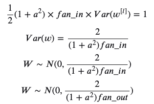

## 参考

> [原文地址](https://www.cnblogs.com/shine-lee/p/11809979.html)
>
> 