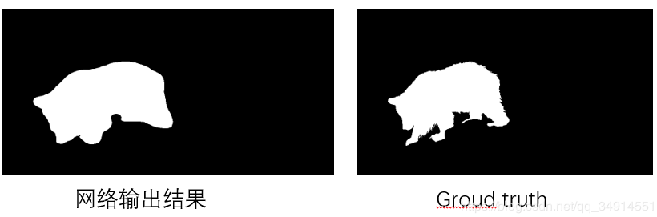
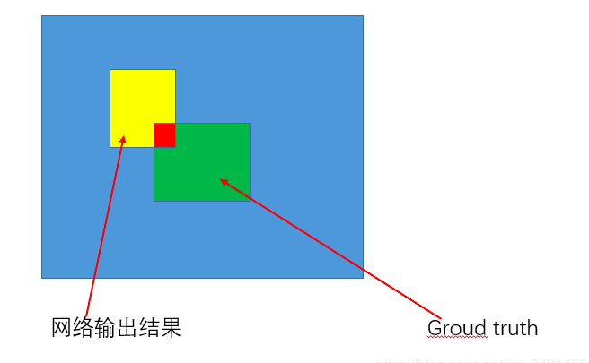
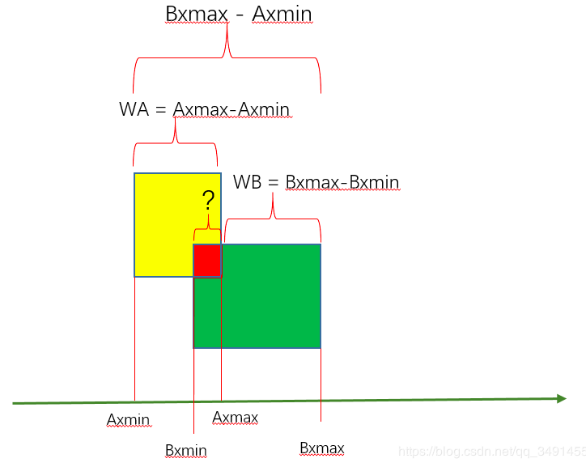
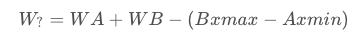
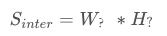
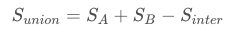

# IOU

2020年7月31日

[IOU-->GIOU-->DIOU-->CIOU](https://github.com/FelixFu520/README/blob/master/notes/models/yolov4.md#141-ciou_loss)

---

IOU，全称为intersection of union， 中文名“交并比”。这个概念理解起来不难，本文将从原理以及代码实践来解读IOU。

首先要说明的是，IOU在检测领域和分割领域都有应用，但这两个领域的IOU计算方式是不一样的。**所以本文就分为两个部分。分别讲解在分割和检测两个领域的IOU计算方式。**

## 1. 分割领域的IOU计算方式



**假设白色区域为1，黑色区域为0。**
根据IOU计算公式：
$$
iou = \frac{A \cap B}{A \cup B}
$$
假设网络输出为A，GT为B。
那么A交B非常好算。

```python
intersection = (A * B).sum()
```

A并B的计算方式，就是A的白色面积+B的白色面积， 减去A和B的交集。

```python
union = A.sum() + B.sum() - intersection
```

最终的IOU就是：

```python
IOU = intersection / union
```

### 1.1 对于多类的语义分割任务计算IOU

上面讲解的例子属于二类分割，语义分割所要处理的数据集往往都是很多类的。网络输出的map的shape是[Batchsize, N, H, W], N是数据集的类别。这个时候我们如何计算IOU呢。
假设label的shape是[Batchsize , H, W], 值的范围是[0-N-1]

```python
A = net(X) # A是网络输出，shape为[Batchsize, N, H, W]
A = np.argmax(A, axis=1)  # A的shape现在为 [Batchsize, H, W]，和Gt一致
A += 1
Gt += 1
intersection = A * (A == Gt)
area_inter, _ = np.histogram(intersection, bins= NUMCLASS, range=(1, NUMCLASS))
area_pred, _ = np.histogram(A, bins= NUMCLASS, range=(1, NUMCLASS))
area_label, _ = np.histogram(Gt, bins= NUMCLASS, range=(1, NUMCLASS))
area_union = area_pred + area_label - area_inter
iou = area_inter / area_union
miou = iou.mean()
```

做一下解释。np.histogram是统计直方图的函数，通过该函数，

- 我们得知交集中每一个类别的像素值数目是多少

> area_inter, _ = np.histogram(intersection, bins= NUMCLASS, range=(1, NUMCLASS))

- 得知预测结果的每一类别的像素值数目是多少

> area_pred, _ = np.histogram(A, bins= NUMCLASS, range=(1, NUMCLASS))

- 得知label中每一个类别的像素值数目是多少

> area_label, _ = np.histogram(Gt, bins= NUMCLASS, range=(1, NUMCLASS))

然后还是利用了**两个集合的并集等于两个集合相加减去公共的部分**

> area_union = area_pred + area_label - area_inter

这里得到了每一个类的IOU，Miou就是求均值，这就是最后两句代码的含义。

## 2. 检测任务中的IOU计算方式



依然是根据IOU的计算公式：
$$
iou=\frac{A∩B}{A∪B}
$$
假设A是预测，B是GT。
先求交集。



我这里仅分析如何获得X轴上的交集区域的宽。另一个维度的分析类似的。
问号所指的长度使我们想求的。




然后我们使用相同的分析方法，得到H?。交集区域的面积就是




知道了交集，并集就好求了。
**还是根据并集定理，A和B的并集是A和B的相加减去A和B的交集。**




代码实践：

```python
def iou(axmin,aymin,axmax,aymax, bxmin,bymin, bxmax, bymax):
    width = min(axmin,bxmin) + (axmax-axmin) + (bxmax-bxmin) - max(axmax,bxmax)
    height = min(aymin,bymin) + (aymax-aymin) + (bymax-bymin) - max(aymax,bymax)
    return max(width*height/(
        (ymax-ymin)*(xmax-xmin) + (aymax-aymin)*(axmax-axmin) - width*height
    ), 0)
```

最后结果的结果要和0比较，因为如果得到的IOU小于0，说明没有交集，iou为0.但是分子的面积仍然是非0数字，是负数。所以最后需要和0比较。


```python
# -*-coding:utf-8 -*- 
# 计算图像的（IOU）交并比

def Iou(box1,box2):
	xmin1, ymin1, xmax1, ymax1 = box1
	xmin2, ymin2, xmax2, ymax2 = box2
	# 求交集部分左上角的点
	xmin = max(xmin1,xmin2)
	ymin = max(ymin1,ymin2)
	# 求交集部分右下角的点
	xmax = min(xmax1,xmax2)
	ym=ax = min(ymax1,ymax2)
	# 计算输入的两个矩形的面积
	s1 = (xmax1-xmin1) * (ymax1 - ymin1)
	s2 = (xmax2-xmin2) * (ymax2 - ymin2)

	#计算总面积
	s = s1 + s2 
	# 计算交集
	inter_area = (xmax - xmin) * (ymax - ymin)

	iou = inter_area / (s - inter_area)
	return iou

if __name__ == '__main__':
	b1 = [1,1,3,3]
	b2 = [2,2,4,4]
	print(Iou(b1,b2))           # 0.14285714285714285
```


## 参考

> [原文](https://blog.csdn.net/qq_34914551/article/details/103009186)