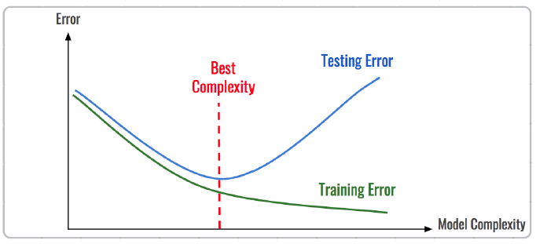
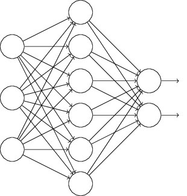
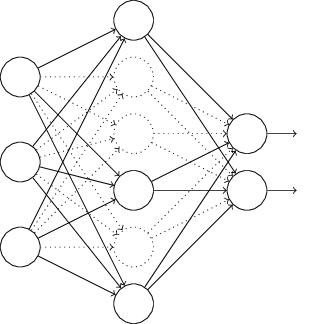
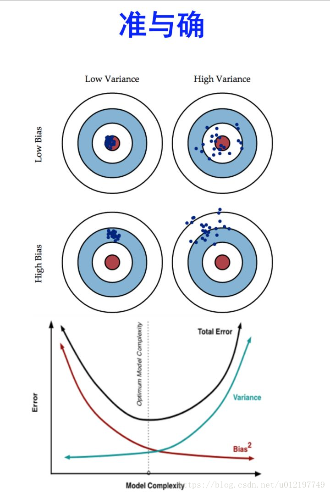
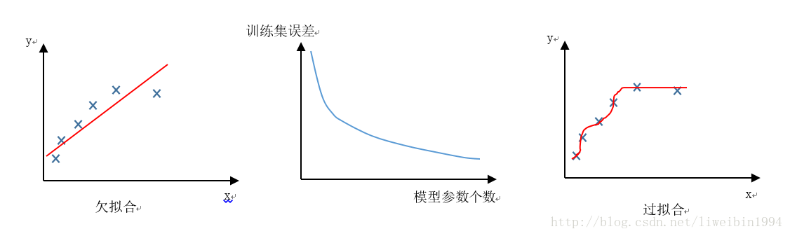
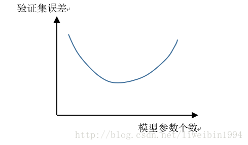
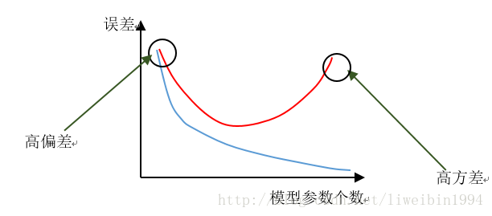
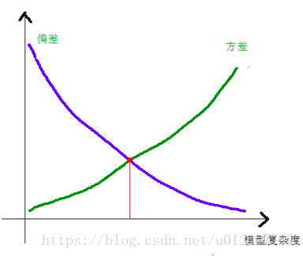
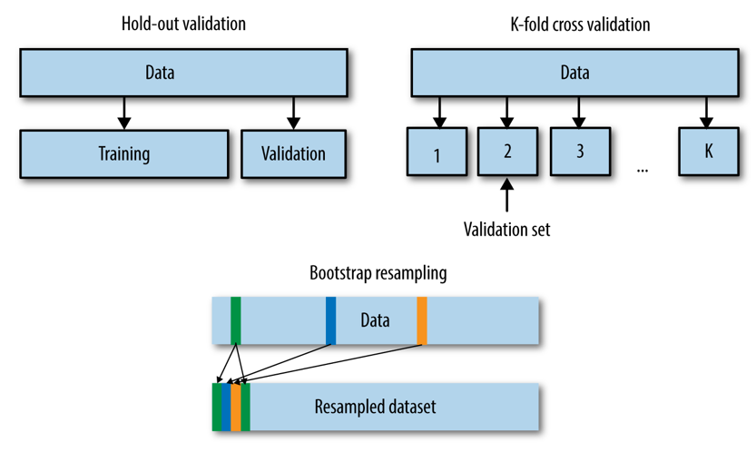

# 过拟合和欠拟合

2020年7月30日

---

在机器学习模型（特别是深度学习模型）的训练过程中，模型是非常容易过拟合的。深度学习模型在不断的训练过程中训练误差会逐渐降低，但测试误差的走势则不一定。在模型的训练过程中，模型只能利用训练数据来进行训练，并不能接触到测试集上的样本，故需要构建验证数据集对模型进行验证。    

**拟合（Fitting）**：就是说这个曲线能不能很好的描述某些样本，并且有比较好的泛化能力。

**过拟合（Overfitting）**：模型把数据学习的太彻底，以至于把噪声数据的特征也学习到了，这样就会导致在后期测试的时候不能够很好地识别数据，即不能正确的分类，模型泛化能力太差。

**欠拟合（UnderFitting）**：模型没有很好地捕捉到数据特征，不能够很好地拟合数据，或者是模型过于简单无法拟合或区分样本。

## 1. 过拟合

### 1.1 概念

过拟合就是训练时的结果很好，但是在预测时结果不好的情况。

### 1.2 产生过拟合的原因

- （1)  模型的复杂度太高。比如：网络太深，
- （2）过多的变量（特征）
- （3）训练数据非常少。

### 1.3 **防止过拟合方法**

避免过拟合的方法有很多：（1）尽量减少特征的数量、（2）early stopping、（3）数据集扩增、（4）dropout、（5）正则化包括L1、L2、（6）清洗数据。

> **避免过拟合(刻画太细，泛化太差)**
>
> 1、增大数据集合—–使用更多的数据，噪声点比重减少
>
> 2、减少数据特征—–减小数据维度，高维空间密度小
>
> 3、正则化方法—–即在对模型的目标函数（objective function）或代价函数（cost function）加上正则项交叉验证方法？？？？一脸茫然？-等我确定哈！

#### **1.3.1 尽量减少选取变量的数量。**

  =>可以人工检查每一项变量，并确定哪些变量更重要。然后保留那些更重要的特征变量。

  =>可以使用模型选择算法，通过该算法自动的选择使用哪些特征变量，舍弃哪些特征变量。

#### **1.3.2 正则化**

​     正则化会保留所有的特征变量，但是会减小特征变量的数量级。

​     这种方法非常有效，当我们有很多特征变量时，其中每一个特征变量都对预测产生了一些影响。每一个变量都有用，因此我们希望保留所有的变量，这个时候就可以使用正则化的方法。

​     正则化就是使用惩罚项，通过惩罚项，我们可以将一些参数的值变小。通常参数值越小，对应的函数也就越光滑，也就是更加简单的函数，因此不容易发生过拟合问题。

#### **1.3.3 early stopping**

#### **1.3.4 数据集扩增**（Data augmentation）

  “有时候不是因为算法好赢了，而是因为拥有更多的数据才赢了。”

​    不记得原话是哪位大牛说的了，hinton？从中可见训练数据有多么重要，特别是在深度学习方法中，更多的训练数据，意味着可以用更深的网络，训练出更好的模型。

​    既然这样，收集更多的数据不就行啦？如果能够收集更多可以用的数据，当然好。但是很多时候，收集更多的数据意味着需要耗费更多的人力物力，有弄过人工标注的同学就知道，效率特别低，简直是粗活。

所以，可以在原始数据上做些改动，得到更多的数据，以图片数据集举例，可以做各种变换，如：

- 将原始图片旋转一个小角度

- 添加随机噪声

- 一些有弹性的畸变（elastic distortions），论文《Best practices for convolutional neural networks applied to visual document analysis》对MNIST做了各种变种扩增。

- 截取（crop）原始图片的一部分。比如DeepID中，从一副人脸图中，截取出了100个小patch作为训练数据，极大地增加了数据集。感兴趣的可以看《Deep learning face representation from predicting 10,000 classes》.

  *更多数据意味着什么？*

用50000个MNIST的样本训练SVM得出的accuracy94.48%，用5000个MNIST的样本训练NN得出accuracy为93.24%，所以更多的数据可以使算法表现得更好。在机器学习中，算法本身并不能决出胜负，不能武断地说这些算法谁优谁劣，因为数据对算法性能的影响很大。

#### **1.3.5 dropout。**

​    Dropout则是通过修改神经网络本身来实现的，它是在训练网络时用的一种技巧（trike）。它的流程如下：

  假设我们要训练上图这个网络，在训练开始时，我们随机地“删除”一半的隐层单元，视它们为不存在，得到如下的网络：

保持输入输出层不变，按照BP算法更新上图神经网络中的权值（虚线连接的单元不更新，因为它们被“临时删除”了）。

以上就是一次迭代的过程，在第二次迭代中，也用同样的方法，只不过这次删除的那一半隐层单元，跟上一次删除掉的肯定是不一样的，因为我们每一次迭代都是“随机”地去删掉一半。第三次、第四次……都是这样，直至训练结束。

以上就是Dropout，它为什么有助于防止过拟合呢？可以简单地这样解释，运用了dropout的训练过程，相当于训练了很多个只有半数隐层单元的神经网络（后面简称为“半数网络”），每一个这样的半数网络，都可以给出一个分类结果，这些结果有的是正确的，有的是错误的。随着训练的进行，大部分半数网络都可以给出正确的分类结果，那么少数的错误分类结果就不会对最终结果造成大的影响。

#### 1.3.6 重新清洗数据。

   导致过拟合的一个原因也有可能是数据不纯导致的，如果出现了过拟合就需要我们重新清洗数据

## 2. 欠拟合

### **2.1 什么是欠拟合？**

   模型没有很好地捕捉到数据特征，不能够很好地拟合数据的情况，就是欠拟合。

### **2.2 为什么会产生欠拟合？**

- 因为模型不够复杂而无法捕捉数据基本关系，导致模型错误的表示数据。

> 比如：
>
> （1）如果对像是按照颜色和形状进行分类的，但是模型只能按照颜色来区分对象和将对象分类，因而一直会错误的分类对象。
>
> （2）我们的模型可能是多项式的形式，但是训练出来的模型却只能表示线性关系。

### **2.3 怎么解决欠拟合？**

#### 2.3.1**添加其他特征项**

有时候我们模型出现欠拟合的时候是因为特征项不够导致的，可以添加其他特征项来很好地解决。例如，“组合”、“泛化”、“相关性”三类特征是特征添加的重要手段，无论在什么场景，都可以照葫芦画瓢，总会得到意想不到的效果。除上面的特征之外，“上下文特征”、“平台特征”等等，都可以作为特征添加的首选项。

#### 2.3.2 **添加多项式特征**

这个在机器学习算法里面用的很普遍，例如将线性模型通过添加二次项或者三次项使模型泛化能力更强。例如上面的图片的例子。

#### 2.3.3 减少正则化参数

正则化的目的是用来防止过拟合的，但是现在模型出现了欠拟合，则需要减少正则化参数。

> **避免欠拟合(刻画不够)**
>
> 1、寻找更好的特征—–具有代表性的
>
> 2、用更多的特征—–增大输入向量的维度

## 3. 方差/偏差角度看过拟合/欠拟合

### **3.1 方差&偏差**

**什么是Bias(偏差)：**Bias反映的是模型在样本上的输出与真实值之间的误差，即模型本身的精准度，即算法本身的拟合能力

**什么是Variance(方差)：**Variance反映的是模型每一次输出结果与模型输出期望之间的误差，即模型的稳定性。反应预测的波动情况。

**方差和偏差的形象化表示？靶心和射击的结果。**

其中，bias表示的是偏差，描述的是模型和预测结果和真实结果的差距;

variance表示的是方差。

图中的**靶心**就是我们的真实值。

**离靶心的距离**反映了我们的偏差有多大。离靶心越近，偏差越小;离靶心越远，方差越大。

**点的聚集程度**反映了我们的方差有多大。越分散，方差越大。越聚拢，方差越小。

举个例子来理解：两个射击选手在射靶。甲射出的子弹很集中在某个区域，但是都偏离了靶心。我们说他的射击很稳定，但是不够准，准确性差。也就是说他的方差小（子弹很集中在某个区域），但是他的偏差大（子弹打中的地方距离靶心远）。相反，乙射出的子弹比较分散，但是有些很准，中了靶心。我们说他射击比较准，但是发挥不够稳定，稳定性差。 

所以，偏差是描述了准确性。方差是描述稳定性。

### 3.2 偏/方差与拟合的联系

**泛化能力：**是指一个模型应用到新样本的能力。这里的新样本是指没有出现在训练集中的数据。

**方差、偏差和过拟合、欠拟合之间的关系?偏差、方差与欠拟合、过拟合之间又有什么关系呢？**

- **过拟合会出现高方差问题**
- **欠拟合会出现高偏差问题**

如上图中的第二个坐标，随着模型参数的增加，训练集的误差会慢慢减少。从第一个坐标和最后一个坐标可以直观感受到这种效果。因为模型参数少的时候，模型不能很好地拟合训练集的数据，所以偏差就比较大。当模型参数足够多时，模型拟合的效果就非常好了。 
但是，当我们用验证集来验证时，却会有这样的情况： 

对于欠拟合的情况，我们很容易理解，模型本来拟合的就不好，验证集的误差大也是自然。但是，对于过拟合来说，训练集的效果是非常好的，但是验证集上的效果却并不好，这是因为随着参数越多，模型就越不通用，而是针对了某一种特定的情况，比较有偏见，所以当用验证集验证时，误差会很大。因为验证集中的有些数据可能很符合过拟合的那条曲线，也有可能很不符合，所以数据方差就大了。也就是，方差大的时候我们可以认为是因为过拟合了。相反，模型参数少的时候，模型比较粗糙，偏离正确的拟合比较远，所以是偏差大。 

(这个图的横坐标是模型复杂度，也就是说，横轴越大，模型越复杂。同时体现了随着模型参数个数的增加，模型的偏差逐渐降低，方差逐渐增大，当两者相等时，我们获得了期望的模型复杂度）

### **3.3 为什么提供更多的数据量并不能解决欠拟合问题？**

在这种模型复杂度不够的情况下，我们向模型提供的数据的量并不重要。因为模型根本没有办法表示其中的基本关系，因此我们需要更复杂的模型。

### **3.4 方差、偏差的应用场景？**

用于计算模型的好坏。具体是使用error公式。

**Error = Bias^2 + Variance+Noise**

- 什么是Bias(偏差)：Bias反映的是模型在样本上的输出与真实值之间的误差，即模型本身的精准度，即算法本身的拟合能力

- 什么是Variance(方差)：Variance反映的是模型每一次输出结果与模型输出期望之间的误差，即模型的稳定性。反应预测的波动情况。

- 什么是Noise(噪声)：这就简单了，就不是你想要的真正数据，你可以想象为来破坏你实验的元凶和造成你可能过拟合的原因之一，至于为什么是过拟合的原因，因为模型过度追求Low Bias会导致训练过度，对测试集判断表现优秀，导致噪声点也被拟合进去了

## **4. 如何判断模型的好坏？**

**交叉验证！！！**

​    判断模型的好和坏，就是衡量模型的（方差+偏差）和的最小值。因此主要的关注点就是平衡Bias和Variance。现在通用的衡量方法采用的是交叉验证的思想。交叉验证思想能够很好的处理方差大和偏差大这两大痛点，能够更好的评估模型好坏！

> 注意：交叉验证使用的仅仅是**训练集**！！根本没测试集什么事！很多博客都在误导！说白了，就是你需要用下交叉验证去试下你的算法是否精度够好，够稳定！你不能说你在某个数据集上表现好就可以，你做的模型是要放在整个数据集上来看的！毕竟泛化能力才是机器学习解决的核心

**数据集划分**

- 训练集（Train Set）：模型用于训练和调整模型参数。
- 验证集（Validation Set）：用来验证模型精度和调整模型超参数。
- 测试集（Test Set）：验证模型的泛化能力。

因为训练集和验证集是分开的，所以模型在验证集上面的精度在一定程度上可以反映模型的泛化能力。在划分验证集的时候，需要注意验证集的分布应该与测试集尽量保持一致，不然模型在验证集上的精度就失去了指导意义。

既然验证集这么重要，那么如何划分本地验证集呢。在一些比赛中，赛题方会给定验证集；如果赛题方没有给定验证集，那么参赛选手就需要从训练集中拆分一部分得到验证集。验证集的划分有如下几种方式：

- 留出法（Hold-Out） 直接将训练集划分成两部分，新的训练集和验证集。这种划分方式的优点是最为直接简单；缺点是只得到了一份验证集，有可能导致模型在验证集上过拟合。留出法应用场景是数据量比较大的情况。
- 交叉验证法（Cross Validation，CV） 将训练集划分成K份，将其中的K-1份作为训练集，剩余的1份作为验证集，循环K训练。这种划分方式是所有的训练集都是验证集，最终模型验证精度是K份平均得到。这种方式的优点是验证集精度比较可靠，训练K次可以得到K个有多样性差异的模型；CV验证的缺点是需要训练K次，不适合数据量很大的情况。
- 自助采样法（BootStrap） 通过有放回的采样方式得到新的训练集和验证集，每次的训练集和验证集都是有区别的。这种划分方式一般适用于数据量较小的情况。

这些划分方法是从数据划分方式的角度来讲的，在现有的数据比赛中一般采用留出法和交叉验证法。如果数据量比较大，留出法还是比较合适的。当然任何的验证集划分得到的验证集都是要保证训练集-验证集-测试集的分布一致，所以如果不管划分何种的划分方式都是需要注意的。(这里的分布一般指的是与标签相关的统计分布，如果标签是带有时序信息，则验证集和测试集的时间间隔应该保持一致。)

## 参考

> [原文地址](https://blog.csdn.net/u012197749/article/details/79766317?utm_medium=distribute.pc_relevant_t0.none-task-blog-BlogCommendFromMachineLearnPai2-1.nonecase&depth_1-utm_source=distribute.pc_relevant_t0.none-task-blog-BlogCommendFromMachineLearnPai2-1.nonecase)
>
> 