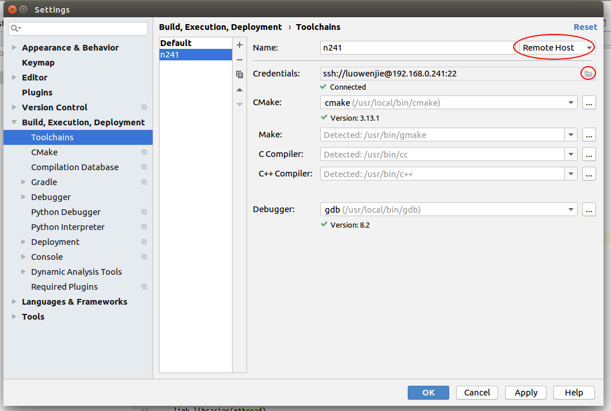
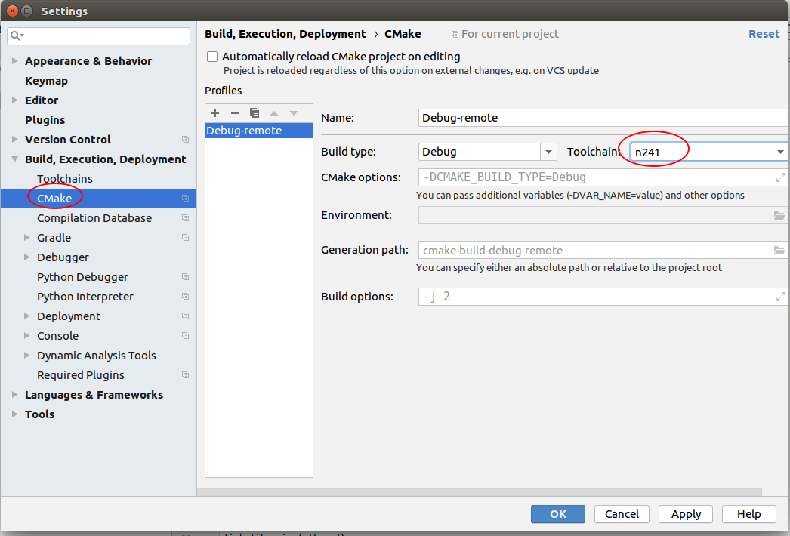
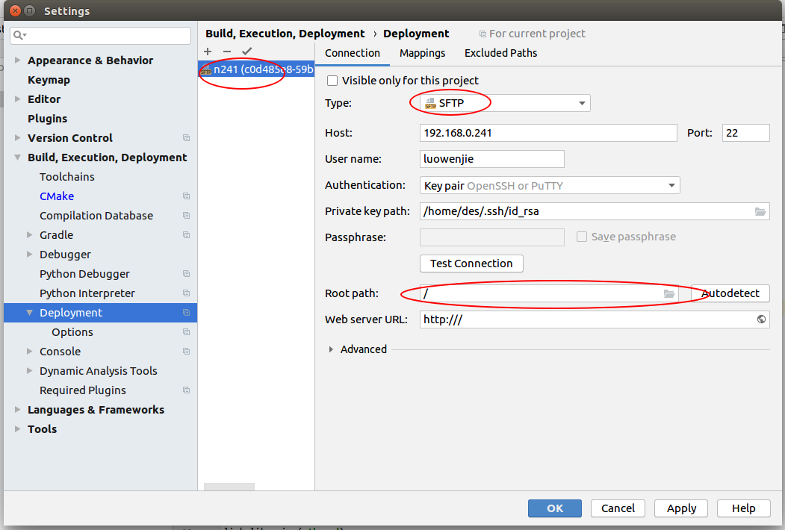
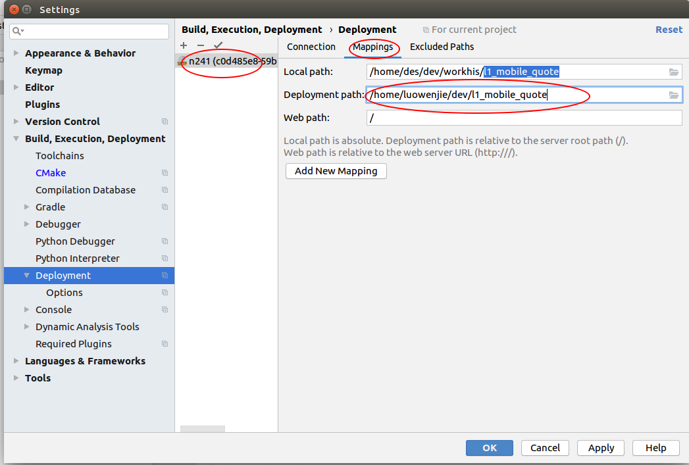
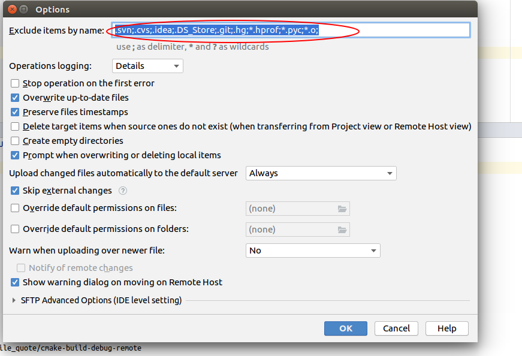
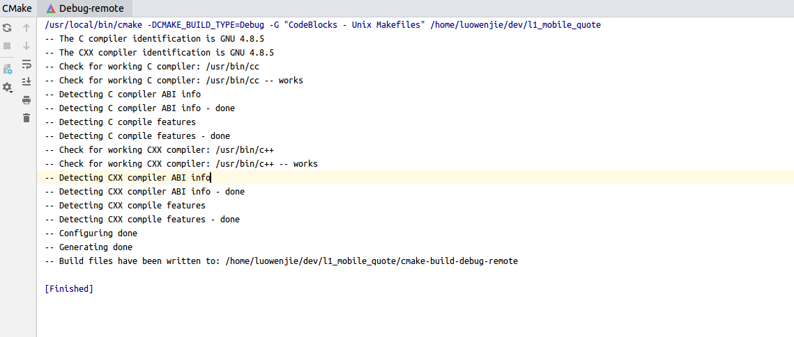
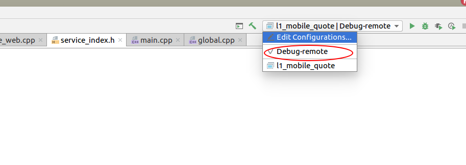

# CLion 远程编译调试

2020年11月20日

----

**为什么要使用远程编译**

普通的PC机器, 性能太渣, 随随便便编译一下就卡死了, 特别是调试程序的时候, 我们的程序动不动就30多个G的内存, 普通的PC机器根本扛不起来, 公司的高配机器有很好的性能, 放一台在内网做公共的开发机器, 能极大的提高效率.

## 1. 环境准备

本机安装CLion, 并准备好一个可以完整编译的项目(使用CLion能编译过去). 一台远程机器, 远程机器必须能编译过次项目.

## 2. 设置远程

### 工具链

file => settings => Build, Execution, Deployment => Toolchains

保证这个地方的配置都正确之后, 基本上可以了

### cmake

file => settings => Build, Execution, Deployment => CMake

这个地方cmake使用的toolchain是远程的

### Deployment

file => settings => Build, Execution, Deployment => Deployment

这个地方特别注意, 这个root path要改成/, 不要使用自动检测的

配置一下远程对应的目录, 下面还有配置对应的exclude目录, 随意配置

### exclude .txt

Tools => Deployment => Options

这个地方一定要删除 *.txt, 否者CMakeList.txt不会同步会有问题。

### CMake重新load

Tool => CMake => Reload CMake Project

看到这个地方基本上就不会有问题了

## 编译以及调试

当上面的步逐全部完成之后, 就可以出现编译选项了。 直接点击上面的编译和运行, 就不会有问题了.

