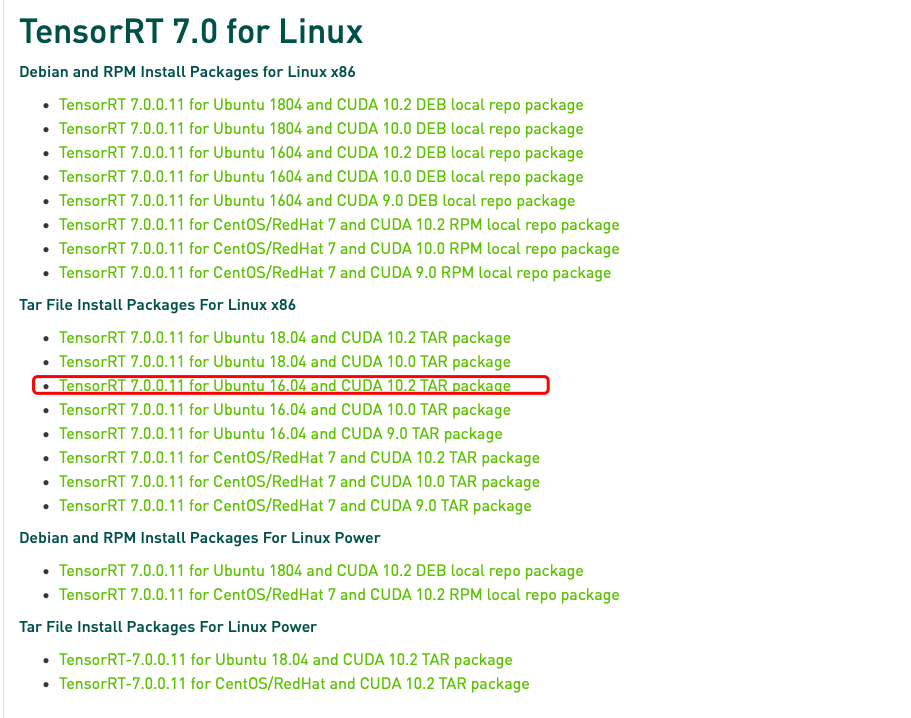
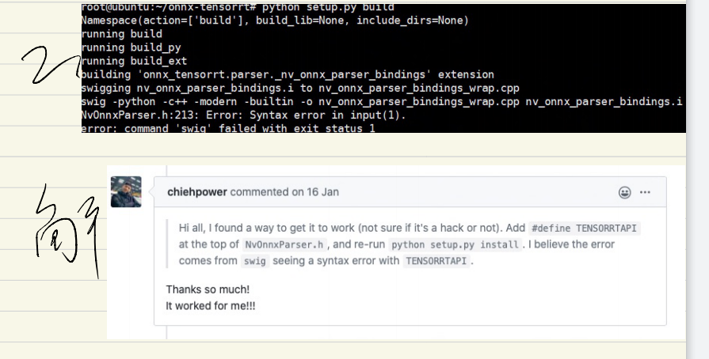
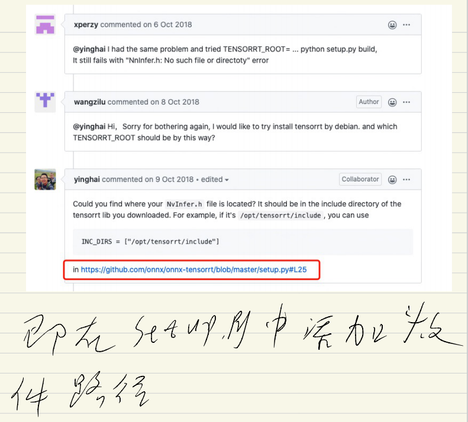
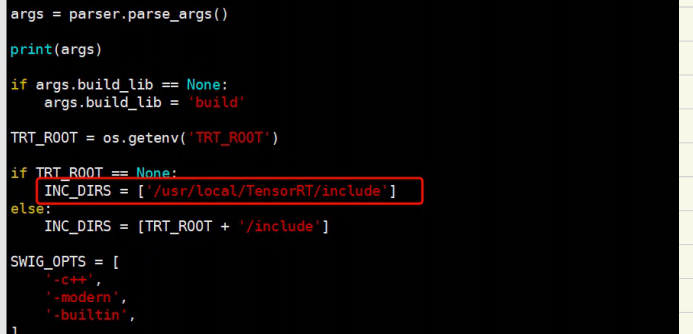

# TensorRT安装

2020年12月3日

---

## 1.准备工作

安装一下内容


| 安装顺序   | 名称                                | 版本                     |
| ---------- | :---------------------------------- | ------------------------ |
| 1          | Ubuntu                              | 16.04.6 LTS              |
| 2          | GPU Driver                          | 440.64                   |
| 3          | CUDA                                | 10.2                     |
| 4          | cuDNN                               | 7.6.5                    |
| 5          | Python  /  pip. /protobuf(optional) | 3.6     /    20.2.3/3.11 |
| 6          | Pytorch/torchvision                 | 1.2.0/0.4.0              |
| 7          | cmake升级                           | 3.14.4                   |
| 8          | TensorRT                            | 7.0                      |
| 9          | cmake                               | 3.14.4                   |
|            |                                     |                          |
|            |                                     |                          |
| 中途需要的 | pycuda                              | pycuda-2019.1.2          |
|            |                                     |                          |
|            |                                     |                          |


## cmake升级

#### 下载

https://cmake.org or https://github.com/Kitware/CMake/releases/tag/v3.14.4

```
#tar -zxvf file_name.tar.gz
#cd cmake-3.14.4/
#./configure
#make
#make install

#update-alternatives --install /usr/bin/cmake cmake /usr/local/bin/cmake 1 --force
update-alternatives: using /usr/local/bin/cmake to provide /usr/bin/cmake (cmake) in auto mode

# cmake --version
cmake version 3.14.4
CMake suite maintained and supported by Kitware (kitware.com/cmake).

```

## 安装protobuf

```
apt install libprotobuf-dev protobuf-compiler
```


## 安装TensorRT

### 下载

[官网](https://developer.nvidia.com/tensorrt)



### [安装](https://docs.nvidia.com/deeplearning/tensorrt/install-guide/index.html#installing-tar)

```
root@node01:~# tar -zxvf TensorRT-7.0.0.11.Ubuntu-16.04.x86_64-gnu.cuda-10.2.cudnn7.6.tar.gz
root@node01:~# mv TensorRT-7.0.0.11 /usr/local/
root@node01:~# cd /usr/local/TensorRT-7.0.0.11/
root@node01:/usr/local/TensorRT-7.0.0.11# ls
TensorRT-Release-Notes.pdf  data  graphsurgeon  lib     samples  uff
bin                         doc   include       python  targets


# Add the absolute path to the TensorRTlib directory to the environment variable LD_LIBRARY_PATH:
export LD_LIBRARY_PATH=$LD_LIBRARY_PATH:你存放TensorRT的路径/lib
eg.
export LD_LIBRARY_PATH=$LD_LIBRARY_PATH:/usr/local/TensorRT-7.0.0.11/lib
source ~/.bashrc 


#Install the Python TensorRT wheel file.
root@node01:/usr/local/TensorRT-7.0.0.11# cd python
root@node01:/usr/local/TensorRT-7.0.0.11/python# ls
tensorrt-7.0.0.11-cp27-none-linux_x86_64.whl
tensorrt-7.0.0.11-cp34-none-linux_x86_64.whl
tensorrt-7.0.0.11-cp35-none-linux_x86_64.whl
tensorrt-7.0.0.11-cp36-none-linux_x86_64.whl
tensorrt-7.0.0.11-cp37-none-linux_x86_64.whl
root@node01:/usr/local/TensorRT-7.0.0.11/python# pip install tensorrt-7.0.0.11-cp35-none-linux_x86_64.whl 
Processing ./tensorrt-7.0.0.11-cp35-none-linux_x86_64.whl
Installing collected packages: tensorrt
Successfully installed tensorrt-7.0.0.11


# Install the Python graphsurgeon wheel file.
root@node01:/usr/local/TensorRT-7.0.0.11/graphsurgeon# ls
graphsurgeon-0.4.1-py2.py3-none-any.whl
root@node01:/usr/local/TensorRT-7.0.0.11/graphsurgeon# pip install graphsurgeon-0.4.1-py2.py3-none-any.whl 
Processing ./graphsurgeon-0.4.1-py2.py3-none-any.whl
Installing collected packages: graphsurgeon
Successfully installed graphsurgeon-0.4.1


# 7.0版本不需要
# Install the Python onnx-graphsurgeon wheel file.
cd TensorRT-${version}/onnx_graphsurgeon
If using Python 2.7:
sudo pip2 install onnx_graphsurgeon-0.2.6-py2.py3-none-any.whl
If using Python 3.x:
sudo pip3 install onnx_graphsurgeon-0.2.6-py2.py3-none-any.whl


```

### 验证

```
Verify the installation:
	a. Ensure that the installed files are located in the correct directories. For example, run the tree -d command to check whether all supported installed files are in place in the lib, include, data, etc… directories.

	b. Build and run one of the shipped samples, for example, sampleMNIST in the installed directory. You should be able to compile and execute the sample without additional settings. For more information, see the “Hello World” For TensorRT (sampleMNIST).
	
	c. The Python samples are in the samples/python directory.
	

root@node01:/usr/local/TensorRT-7.0.0.11/samples# ls
Makefile         sampleDynamicReshape  sampleMLP           sampleNMT             sampleUffFasterRCNN   trtexec
Makefile.config  sampleFasterRCNN      sampleMNIST         sampleOnnxMNIST       sampleUffMNIST
common           sampleGoogleNet       sampleMNISTAPI      samplePlugin          sampleUffMaskRCNN
python           sampleINT8            sampleMovieLens     sampleReformatFreeIO  sampleUffPluginV2Ext
sampleCharRNN    sampleINT8API         sampleMovieLensMPS  sampleSSD             sampleUffSSD
root@node01:/usr/local/TensorRT-7.0.0.11/samples/python# ls
__pycache__                  engine_refit_mnist     introductory_parser_samples  uff_ssd
common.py                    fc_plugin_caffe_mnist  network_api_pytorch_mnist    yolov3_onnx
end_to_end_tensorflow_mnist  int8_caffe_mnist       uff_custom_plugin

pip install pycuda
pip install wget
pip install onnx==1.6


root@node01:~# pip2 list
Package           Version
----------------- -------
numpy             1.10.0
ofed-le-utils     1.0.3
onnx              1.6.0
pip               20.3
protobuf          3.14.0
setuptools        20.7.0
six               1.15.0
typing            3.7.4.3
typing-extensions 3.7.4.3
wget              3.2
wheel             0.29.0

root@node01:~# pip3 list
Package             Version
------------------- ----------------------
appdirs             1.4.4
cffi                1.14.3
chardet             2.3.0
cloudpickle         1.6.0
command-not-found   0.3
decorator           4.4.2
graphsurgeon        0.4.1
horovod             0.19.5
language-selector   0.1
Mako                1.1.3
MarkupSafe          1.1.1
numpy               1.18.5
onnx                1.6.0
Pillow              7.2.0
pip                 20.2.3
protobuf            3.14.0
psutil              5.7.2
pycparser           2.20
pycuda              2019.1.2
pycurl              7.43.0
pygobject           3.20.0
python-apt          1.1.0b1+ubuntu0.16.4.2
python-debian       0.1.27
python-systemd      231
pytools             2020.2
PyYAML              5.3.1
requests            2.9.1
setuptools          20.7.0
six                 1.10.0
ssh-import-id       5.5
tensorrt            7.0.0.11
termcolor           1.1.0
torch               1.2.0
torchvision         0.4.0
typing-extensions   3.7.4.3
ufw                 0.35
unattended-upgrades 0.1
urllib3             1.13.1
wget                3.2
wheel               0.29.0

验证开始
root@node01:/usr/local/TensorRT-7.0.0.11/samples/python/yolov3_onnx# python2 yolov3_to_onnx.py 
Downloading from https://raw.githubusercontent.com/pjreddie/darknet/f86901f6177dfc6116360a13cc06ab680e0c86b0/cfg/yolov3.cfg, this may take a while...
100% [............................................................] 8342 / 8342
Downloading from https://pjreddie.com/media/files/yolov3.weights, this may take a while...
100% [..................................................] 248007048 / 248007048
Layer of type yolo not supported, skipping ONNX node generation.
Layer of type yolo not supported, skipping ONNX node generation.
Layer of type yolo not supported, skipping ONNX node generation.
graph YOLOv3-608 (
  %000_net[FLOAT, 64x3x608x608]
) optional inputs with matching initializers (
  %001_convolutional_bn_scale[FLOAT, 32]
  %001_convolutional_bn_bias[FLOAT, 32]
  %001_convolutional_bn_mean[FLOAT, 32]
  %001_convolutional_bn_var[FLOAT, 32]
  %001_convolutional_conv_weights[FLOAT, 32x3x3x3]
  %002_convolutional_bn_scale[FLOAT, 64]
  %002_convolutional_bn_bias[FLOAT, 64]
  %002_convolutional_bn_mean[FLOAT, 64]
  %002_convolutional_bn_var[FLOAT, 64]
  %002_convolutional_conv_weights[FLOAT, 64x32x3x3]
  %003_convolutional_bn_scale[FLOAT, 32]
  %003_convolutional_bn_bias[FLOAT, 32]
  %003_convolutional_bn_mean[FLOAT, 32]
  %003_convolutional_bn_var[FLOAT, 32]
  %003_convolutional_conv_weights[FLOAT, 32x64x1x1]
  %004_convolutional_bn_scale[FLOAT, 64]
  %004_convolutional_bn_bias[FLOAT, 64]
  %004_convolutional_bn_mean[FLOAT, 64]
  %004_convolutional_bn_var[FLOAT, 64]
  %004_convolutional_conv_weights[FLOAT, 64x32x3x3]
  %006_convolutional_bn_scale[FLOAT, 128]
  %006_convolutional_bn_bias[FLOAT, 128]
  %006_convolutional_bn_mean[FLOAT, 128]
  %006_convolutional_bn_var[FLOAT, 128]
  %006_convolutional_conv_weights[FLOAT, 128x64x3x3]
  %007_convolutional_bn_scale[FLOAT, 64]
  %007_convolutional_bn_bias[FLOAT, 64]
  %007_convolutional_bn_mean[FLOAT, 64]
  %007_convolutional_bn_var[FLOAT, 64]
  %007_convolutional_conv_weights[FLOAT, 64x128x1x1]
  %008_convolutional_bn_scale[FLOAT, 128]
  %008_convolutional_bn_bias[FLOAT, 128]
  %008_convolutional_bn_mean[FLOAT, 128]
  %008_convolutional_bn_var[FLOAT, 128]
  %008_convolutional_conv_weights[FLOAT, 128x64x3x3]
  %010_convolutional_bn_scale[FLOAT, 64]
  %010_convolutional_bn_bias[FLOAT, 64]
  %010_convolutional_bn_mean[FLOAT, 64]
  %010_convolutional_bn_var[FLOAT, 64]
  %010_convolutional_conv_weights[FLOAT, 64x128x1x1]
  %011_convolutional_bn_scale[FLOAT, 128]
  %011_convolutional_bn_bias[FLOAT, 128]
  %011_convolutional_bn_mean[FLOAT, 128]
  %011_convolutional_bn_var[FLOAT, 128]
  %011_convolutional_conv_weights[FLOAT, 128x64x3x3]
  %013_convolutional_bn_scale[FLOAT, 256]
  %013_convolutional_bn_bias[FLOAT, 256]
  %013_convolutional_bn_mean[FLOAT, 256]
  %013_convolutional_bn_var[FLOAT, 256]
  %013_convolutional_conv_weights[FLOAT, 256x128x3x3]
  %014_convolutional_bn_scale[FLOAT, 128]
  %014_convolutional_bn_bias[FLOAT, 128]
  %014_convolutional_bn_mean[FLOAT, 128]
  %014_convolutional_bn_var[FLOAT, 128]
  %014_convolutional_conv_weights[FLOAT, 128x256x1x1]
  %015_convolutional_bn_scale[FLOAT, 256]
  %015_convolutional_bn_bias[FLOAT, 256]
  %015_convolutional_bn_mean[FLOAT, 256]
  %015_convolutional_bn_var[FLOAT, 256]
  %015_convolutional_conv_weights[FLOAT, 256x128x3x3]
  %017_convolutional_bn_scale[FLOAT, 128]
  %017_convolutional_bn_bias[FLOAT, 128]
  %017_convolutional_bn_mean[FLOAT, 128]
  %017_convolutional_bn_var[FLOAT, 128]
  %017_convolutional_conv_weights[FLOAT, 128x256x1x1]
  %018_convolutional_bn_scale[FLOAT, 256]
  %018_convolutional_bn_bias[FLOAT, 256]
  %018_convolutional_bn_mean[FLOAT, 256]
  %018_convolutional_bn_var[FLOAT, 256]
  %018_convolutional_conv_weights[FLOAT, 256x128x3x3]
  %020_convolutional_bn_scale[FLOAT, 128]
  %020_convolutional_bn_bias[FLOAT, 128]
  %020_convolutional_bn_mean[FLOAT, 128]
  %020_convolutional_bn_var[FLOAT, 128]
  %020_convolutional_conv_weights[FLOAT, 128x256x1x1]
  %021_convolutional_bn_scale[FLOAT, 256]
  %021_convolutional_bn_bias[FLOAT, 256]
  %021_convolutional_bn_mean[FLOAT, 256]
  %021_convolutional_bn_var[FLOAT, 256]
  %021_convolutional_conv_weights[FLOAT, 256x128x3x3]
  %023_convolutional_bn_scale[FLOAT, 128]
  %023_convolutional_bn_bias[FLOAT, 128]
  %023_convolutional_bn_mean[FLOAT, 128]
  %023_convolutional_bn_var[FLOAT, 128]
  %023_convolutional_conv_weights[FLOAT, 128x256x1x1]
  %024_convolutional_bn_scale[FLOAT, 256]
  %024_convolutional_bn_bias[FLOAT, 256]
  %024_convolutional_bn_mean[FLOAT, 256]
  %024_convolutional_bn_var[FLOAT, 256]
  %024_convolutional_conv_weights[FLOAT, 256x128x3x3]
  %026_convolutional_bn_scale[FLOAT, 128]
  %026_convolutional_bn_bias[FLOAT, 128]
  %026_convolutional_bn_mean[FLOAT, 128]
  %026_convolutional_bn_var[FLOAT, 128]
  %026_convolutional_conv_weights[FLOAT, 128x256x1x1]
  %027_convolutional_bn_scale[FLOAT, 256]
  %027_convolutional_bn_bias[FLOAT, 256]
  %027_convolutional_bn_mean[FLOAT, 256]
  %027_convolutional_bn_var[FLOAT, 256]
  %027_convolutional_conv_weights[FLOAT, 256x128x3x3]
  %029_convolutional_bn_scale[FLOAT, 128]
  %029_convolutional_bn_bias[FLOAT, 128]
  %029_convolutional_bn_mean[FLOAT, 128]
  %029_convolutional_bn_var[FLOAT, 128]
  %029_convolutional_conv_weights[FLOAT, 128x256x1x1]
  %030_convolutional_bn_scale[FLOAT, 256]
  %030_convolutional_bn_bias[FLOAT, 256]
  %030_convolutional_bn_mean[FLOAT, 256]
  %030_convolutional_bn_var[FLOAT, 256]
  %030_convolutional_conv_weights[FLOAT, 256x128x3x3]
  %032_convolutional_bn_scale[FLOAT, 128]
  %032_convolutional_bn_bias[FLOAT, 128]
  %032_convolutional_bn_mean[FLOAT, 128]
  %032_convolutional_bn_var[FLOAT, 128]
  %032_convolutional_conv_weights[FLOAT, 128x256x1x1]
  %033_convolutional_bn_scale[FLOAT, 256]
  %033_convolutional_bn_bias[FLOAT, 256]
  %033_convolutional_bn_mean[FLOAT, 256]
  %033_convolutional_bn_var[FLOAT, 256]
  %033_convolutional_conv_weights[FLOAT, 256x128x3x3]
  %035_convolutional_bn_scale[FLOAT, 128]
  %035_convolutional_bn_bias[FLOAT, 128]
  %035_convolutional_bn_mean[FLOAT, 128]
  %035_convolutional_bn_var[FLOAT, 128]
  %035_convolutional_conv_weights[FLOAT, 128x256x1x1]
  %036_convolutional_bn_scale[FLOAT, 256]
  %036_convolutional_bn_bias[FLOAT, 256]
  %036_convolutional_bn_mean[FLOAT, 256]
  %036_convolutional_bn_var[FLOAT, 256]
  %036_convolutional_conv_weights[FLOAT, 256x128x3x3]
  %038_convolutional_bn_scale[FLOAT, 512]
  %038_convolutional_bn_bias[FLOAT, 512]
  %038_convolutional_bn_mean[FLOAT, 512]
  %038_convolutional_bn_var[FLOAT, 512]
  %038_convolutional_conv_weights[FLOAT, 512x256x3x3]
  %039_convolutional_bn_scale[FLOAT, 256]
  %039_convolutional_bn_bias[FLOAT, 256]
  %039_convolutional_bn_mean[FLOAT, 256]
  %039_convolutional_bn_var[FLOAT, 256]
  %039_convolutional_conv_weights[FLOAT, 256x512x1x1]
  %040_convolutional_bn_scale[FLOAT, 512]
  %040_convolutional_bn_bias[FLOAT, 512]
  %040_convolutional_bn_mean[FLOAT, 512]
  %040_convolutional_bn_var[FLOAT, 512]
  %040_convolutional_conv_weights[FLOAT, 512x256x3x3]
  %042_convolutional_bn_scale[FLOAT, 256]
  %042_convolutional_bn_bias[FLOAT, 256]
  %042_convolutional_bn_mean[FLOAT, 256]
  %042_convolutional_bn_var[FLOAT, 256]
  %042_convolutional_conv_weights[FLOAT, 256x512x1x1]
  %043_convolutional_bn_scale[FLOAT, 512]
  %043_convolutional_bn_bias[FLOAT, 512]
  %043_convolutional_bn_mean[FLOAT, 512]
  %043_convolutional_bn_var[FLOAT, 512]
  %043_convolutional_conv_weights[FLOAT, 512x256x3x3]
  %045_convolutional_bn_scale[FLOAT, 256]
  %045_convolutional_bn_bias[FLOAT, 256]
  %045_convolutional_bn_mean[FLOAT, 256]
  %045_convolutional_bn_var[FLOAT, 256]
  %045_convolutional_conv_weights[FLOAT, 256x512x1x1]
  %046_convolutional_bn_scale[FLOAT, 512]
  %046_convolutional_bn_bias[FLOAT, 512]
  %046_convolutional_bn_mean[FLOAT, 512]
  %046_convolutional_bn_var[FLOAT, 512]
  %046_convolutional_conv_weights[FLOAT, 512x256x3x3]
  %048_convolutional_bn_scale[FLOAT, 256]
  %048_convolutional_bn_bias[FLOAT, 256]
  %048_convolutional_bn_mean[FLOAT, 256]
  %048_convolutional_bn_var[FLOAT, 256]
  %048_convolutional_conv_weights[FLOAT, 256x512x1x1]
  %049_convolutional_bn_scale[FLOAT, 512]
  %049_convolutional_bn_bias[FLOAT, 512]
  %049_convolutional_bn_mean[FLOAT, 512]
  %049_convolutional_bn_var[FLOAT, 512]
  %049_convolutional_conv_weights[FLOAT, 512x256x3x3]
  %051_convolutional_bn_scale[FLOAT, 256]
  %051_convolutional_bn_bias[FLOAT, 256]
  %051_convolutional_bn_mean[FLOAT, 256]
  %051_convolutional_bn_var[FLOAT, 256]
  %051_convolutional_conv_weights[FLOAT, 256x512x1x1]
  %052_convolutional_bn_scale[FLOAT, 512]
  %052_convolutional_bn_bias[FLOAT, 512]
  %052_convolutional_bn_mean[FLOAT, 512]
  %052_convolutional_bn_var[FLOAT, 512]
  %052_convolutional_conv_weights[FLOAT, 512x256x3x3]
  %054_convolutional_bn_scale[FLOAT, 256]
  %054_convolutional_bn_bias[FLOAT, 256]
  %054_convolutional_bn_mean[FLOAT, 256]
  %054_convolutional_bn_var[FLOAT, 256]
  %054_convolutional_conv_weights[FLOAT, 256x512x1x1]
  %055_convolutional_bn_scale[FLOAT, 512]
  %055_convolutional_bn_bias[FLOAT, 512]
  %055_convolutional_bn_mean[FLOAT, 512]
  %055_convolutional_bn_var[FLOAT, 512]
  %055_convolutional_conv_weights[FLOAT, 512x256x3x3]
  %057_convolutional_bn_scale[FLOAT, 256]
  %057_convolutional_bn_bias[FLOAT, 256]
  %057_convolutional_bn_mean[FLOAT, 256]
  %057_convolutional_bn_var[FLOAT, 256]
  %057_convolutional_conv_weights[FLOAT, 256x512x1x1]
  %058_convolutional_bn_scale[FLOAT, 512]
  %058_convolutional_bn_bias[FLOAT, 512]
  %058_convolutional_bn_mean[FLOAT, 512]
  %058_convolutional_bn_var[FLOAT, 512]
  %058_convolutional_conv_weights[FLOAT, 512x256x3x3]
  %060_convolutional_bn_scale[FLOAT, 256]
  %060_convolutional_bn_bias[FLOAT, 256]
  %060_convolutional_bn_mean[FLOAT, 256]
  %060_convolutional_bn_var[FLOAT, 256]
  %060_convolutional_conv_weights[FLOAT, 256x512x1x1]
  %061_convolutional_bn_scale[FLOAT, 512]
  %061_convolutional_bn_bias[FLOAT, 512]
  %061_convolutional_bn_mean[FLOAT, 512]
  %061_convolutional_bn_var[FLOAT, 512]
  %061_convolutional_conv_weights[FLOAT, 512x256x3x3]
  %063_convolutional_bn_scale[FLOAT, 1024]
  %063_convolutional_bn_bias[FLOAT, 1024]
  %063_convolutional_bn_mean[FLOAT, 1024]
  %063_convolutional_bn_var[FLOAT, 1024]
  %063_convolutional_conv_weights[FLOAT, 1024x512x3x3]
  %064_convolutional_bn_scale[FLOAT, 512]
  %064_convolutional_bn_bias[FLOAT, 512]
  %064_convolutional_bn_mean[FLOAT, 512]
  %064_convolutional_bn_var[FLOAT, 512]
  %064_convolutional_conv_weights[FLOAT, 512x1024x1x1]
  %065_convolutional_bn_scale[FLOAT, 1024]
  %065_convolutional_bn_bias[FLOAT, 1024]
  %065_convolutional_bn_mean[FLOAT, 1024]
  %065_convolutional_bn_var[FLOAT, 1024]
  %065_convolutional_conv_weights[FLOAT, 1024x512x3x3]
  %067_convolutional_bn_scale[FLOAT, 512]
  %067_convolutional_bn_bias[FLOAT, 512]
  %067_convolutional_bn_mean[FLOAT, 512]
  %067_convolutional_bn_var[FLOAT, 512]
  %067_convolutional_conv_weights[FLOAT, 512x1024x1x1]
  %068_convolutional_bn_scale[FLOAT, 1024]
  %068_convolutional_bn_bias[FLOAT, 1024]
  %068_convolutional_bn_mean[FLOAT, 1024]
  %068_convolutional_bn_var[FLOAT, 1024]
  %068_convolutional_conv_weights[FLOAT, 1024x512x3x3]
  %070_convolutional_bn_scale[FLOAT, 512]
  %070_convolutional_bn_bias[FLOAT, 512]
  %070_convolutional_bn_mean[FLOAT, 512]
  %070_convolutional_bn_var[FLOAT, 512]
  %070_convolutional_conv_weights[FLOAT, 512x1024x1x1]
  %071_convolutional_bn_scale[FLOAT, 1024]
  %071_convolutional_bn_bias[FLOAT, 1024]
  %071_convolutional_bn_mean[FLOAT, 1024]
  %071_convolutional_bn_var[FLOAT, 1024]
  %071_convolutional_conv_weights[FLOAT, 1024x512x3x3]
  %073_convolutional_bn_scale[FLOAT, 512]
  %073_convolutional_bn_bias[FLOAT, 512]
  %073_convolutional_bn_mean[FLOAT, 512]
  %073_convolutional_bn_var[FLOAT, 512]
  %073_convolutional_conv_weights[FLOAT, 512x1024x1x1]
  %074_convolutional_bn_scale[FLOAT, 1024]
  %074_convolutional_bn_bias[FLOAT, 1024]
  %074_convolutional_bn_mean[FLOAT, 1024]
  %074_convolutional_bn_var[FLOAT, 1024]
  %074_convolutional_conv_weights[FLOAT, 1024x512x3x3]
  %076_convolutional_bn_scale[FLOAT, 512]
  %076_convolutional_bn_bias[FLOAT, 512]
  %076_convolutional_bn_mean[FLOAT, 512]
  %076_convolutional_bn_var[FLOAT, 512]
  %076_convolutional_conv_weights[FLOAT, 512x1024x1x1]
  %077_convolutional_bn_scale[FLOAT, 1024]
  %077_convolutional_bn_bias[FLOAT, 1024]
  %077_convolutional_bn_mean[FLOAT, 1024]
  %077_convolutional_bn_var[FLOAT, 1024]
  %077_convolutional_conv_weights[FLOAT, 1024x512x3x3]
  %078_convolutional_bn_scale[FLOAT, 512]
  %078_convolutional_bn_bias[FLOAT, 512]
  %078_convolutional_bn_mean[FLOAT, 512]
  %078_convolutional_bn_var[FLOAT, 512]
  %078_convolutional_conv_weights[FLOAT, 512x1024x1x1]
  %079_convolutional_bn_scale[FLOAT, 1024]
  %079_convolutional_bn_bias[FLOAT, 1024]
  %079_convolutional_bn_mean[FLOAT, 1024]
  %079_convolutional_bn_var[FLOAT, 1024]
  %079_convolutional_conv_weights[FLOAT, 1024x512x3x3]
  %080_convolutional_bn_scale[FLOAT, 512]
  %080_convolutional_bn_bias[FLOAT, 512]
  %080_convolutional_bn_mean[FLOAT, 512]
  %080_convolutional_bn_var[FLOAT, 512]
  %080_convolutional_conv_weights[FLOAT, 512x1024x1x1]
  %081_convolutional_bn_scale[FLOAT, 1024]
  %081_convolutional_bn_bias[FLOAT, 1024]
  %081_convolutional_bn_mean[FLOAT, 1024]
  %081_convolutional_bn_var[FLOAT, 1024]
  %081_convolutional_conv_weights[FLOAT, 1024x512x3x3]
  %082_convolutional_conv_bias[FLOAT, 255]
  %082_convolutional_conv_weights[FLOAT, 255x1024x1x1]
  %085_convolutional_bn_scale[FLOAT, 256]
  %085_convolutional_bn_bias[FLOAT, 256]
  %085_convolutional_bn_mean[FLOAT, 256]
  %085_convolutional_bn_var[FLOAT, 256]
  %085_convolutional_conv_weights[FLOAT, 256x512x1x1]
  %086_upsample_scale[FLOAT, 4]
  %086_upsample_roi[FLOAT, 4]
  %088_convolutional_bn_scale[FLOAT, 256]
  %088_convolutional_bn_bias[FLOAT, 256]
  %088_convolutional_bn_mean[FLOAT, 256]
  %088_convolutional_bn_var[FLOAT, 256]
  %088_convolutional_conv_weights[FLOAT, 256x768x1x1]
  %089_convolutional_bn_scale[FLOAT, 512]
  %089_convolutional_bn_bias[FLOAT, 512]
  %089_convolutional_bn_mean[FLOAT, 512]
  %089_convolutional_bn_var[FLOAT, 512]
  %089_convolutional_conv_weights[FLOAT, 512x256x3x3]
  %090_convolutional_bn_scale[FLOAT, 256]
  %090_convolutional_bn_bias[FLOAT, 256]
  %090_convolutional_bn_mean[FLOAT, 256]
  %090_convolutional_bn_var[FLOAT, 256]
  %090_convolutional_conv_weights[FLOAT, 256x512x1x1]
  %091_convolutional_bn_scale[FLOAT, 512]
  %091_convolutional_bn_bias[FLOAT, 512]
  %091_convolutional_bn_mean[FLOAT, 512]
  %091_convolutional_bn_var[FLOAT, 512]
  %091_convolutional_conv_weights[FLOAT, 512x256x3x3]
  %092_convolutional_bn_scale[FLOAT, 256]
  %092_convolutional_bn_bias[FLOAT, 256]
  %092_convolutional_bn_mean[FLOAT, 256]
  %092_convolutional_bn_var[FLOAT, 256]
  %092_convolutional_conv_weights[FLOAT, 256x512x1x1]
  %093_convolutional_bn_scale[FLOAT, 512]
  %093_convolutional_bn_bias[FLOAT, 512]
  %093_convolutional_bn_mean[FLOAT, 512]
  %093_convolutional_bn_var[FLOAT, 512]
  %093_convolutional_conv_weights[FLOAT, 512x256x3x3]
  %094_convolutional_conv_bias[FLOAT, 255]
  %094_convolutional_conv_weights[FLOAT, 255x512x1x1]
  %097_convolutional_bn_scale[FLOAT, 128]
  %097_convolutional_bn_bias[FLOAT, 128]
  %097_convolutional_bn_mean[FLOAT, 128]
  %097_convolutional_bn_var[FLOAT, 128]
  %097_convolutional_conv_weights[FLOAT, 128x256x1x1]
  %098_upsample_scale[FLOAT, 4]
  %098_upsample_roi[FLOAT, 4]
  %100_convolutional_bn_scale[FLOAT, 128]
  %100_convolutional_bn_bias[FLOAT, 128]
  %100_convolutional_bn_mean[FLOAT, 128]
  %100_convolutional_bn_var[FLOAT, 128]
  %100_convolutional_conv_weights[FLOAT, 128x384x1x1]
  %101_convolutional_bn_scale[FLOAT, 256]
  %101_convolutional_bn_bias[FLOAT, 256]
  %101_convolutional_bn_mean[FLOAT, 256]
  %101_convolutional_bn_var[FLOAT, 256]
  %101_convolutional_conv_weights[FLOAT, 256x128x3x3]
  %102_convolutional_bn_scale[FLOAT, 128]
  %102_convolutional_bn_bias[FLOAT, 128]
  %102_convolutional_bn_mean[FLOAT, 128]
  %102_convolutional_bn_var[FLOAT, 128]
  %102_convolutional_conv_weights[FLOAT, 128x256x1x1]
  %103_convolutional_bn_scale[FLOAT, 256]
  %103_convolutional_bn_bias[FLOAT, 256]
  %103_convolutional_bn_mean[FLOAT, 256]
  %103_convolutional_bn_var[FLOAT, 256]
  %103_convolutional_conv_weights[FLOAT, 256x128x3x3]
  %104_convolutional_bn_scale[FLOAT, 128]
  %104_convolutional_bn_bias[FLOAT, 128]
  %104_convolutional_bn_mean[FLOAT, 128]
  %104_convolutional_bn_var[FLOAT, 128]
  %104_convolutional_conv_weights[FLOAT, 128x256x1x1]
  %105_convolutional_bn_scale[FLOAT, 256]
  %105_convolutional_bn_bias[FLOAT, 256]
  %105_convolutional_bn_mean[FLOAT, 256]
  %105_convolutional_bn_var[FLOAT, 256]
  %105_convolutional_conv_weights[FLOAT, 256x128x3x3]
  %106_convolutional_conv_bias[FLOAT, 255]
  %106_convolutional_conv_weights[FLOAT, 255x256x1x1]
) {
  %001_convolutional = Conv[auto_pad = u'SAME_LOWER', dilations = [1, 1], kernel_shape = [3, 3], strides = [1, 1]](%000_net, %001_convolutional_conv_weights)
  %001_convolutional_bn = BatchNormalization[epsilon = 9.99999974737875e-06, momentum = 0.990000009536743](%001_convolutional, %001_convolutional_bn_scale, %001_convolutional_bn_bias, %001_convolutional_bn_mean, %001_convolutional_bn_var)
  %001_convolutional_lrelu = LeakyRelu[alpha = 0.100000001490116](%001_convolutional_bn)
  %002_convolutional = Conv[auto_pad = u'SAME_LOWER', dilations = [1, 1], kernel_shape = [3, 3], strides = [2, 2]](%001_convolutional_lrelu, %002_convolutional_conv_weights)
  %002_convolutional_bn = BatchNormalization[epsilon = 9.99999974737875e-06, momentum = 0.990000009536743](%002_convolutional, %002_convolutional_bn_scale, %002_convolutional_bn_bias, %002_convolutional_bn_mean, %002_convolutional_bn_var)
  %002_convolutional_lrelu = LeakyRelu[alpha = 0.100000001490116](%002_convolutional_bn)
  %003_convolutional = Conv[auto_pad = u'SAME_LOWER', dilations = [1, 1], kernel_shape = [1, 1], strides = [1, 1]](%002_convolutional_lrelu, %003_convolutional_conv_weights)
  %003_convolutional_bn = BatchNormalization[epsilon = 9.99999974737875e-06, momentum = 0.990000009536743](%003_convolutional, %003_convolutional_bn_scale, %003_convolutional_bn_bias, %003_convolutional_bn_mean, %003_convolutional_bn_var)
  %003_convolutional_lrelu = LeakyRelu[alpha = 0.100000001490116](%003_convolutional_bn)
  %004_convolutional = Conv[auto_pad = u'SAME_LOWER', dilations = [1, 1], kernel_shape = [3, 3], strides = [1, 1]](%003_convolutional_lrelu, %004_convolutional_conv_weights)
  %004_convolutional_bn = BatchNormalization[epsilon = 9.99999974737875e-06, momentum = 0.990000009536743](%004_convolutional, %004_convolutional_bn_scale, %004_convolutional_bn_bias, %004_convolutional_bn_mean, %004_convolutional_bn_var)
  %004_convolutional_lrelu = LeakyRelu[alpha = 0.100000001490116](%004_convolutional_bn)
  %005_shortcut = Add(%004_convolutional_lrelu, %002_convolutional_lrelu)
  %006_convolutional = Conv[auto_pad = u'SAME_LOWER', dilations = [1, 1], kernel_shape = [3, 3], strides = [2, 2]](%005_shortcut, %006_convolutional_conv_weights)
  %006_convolutional_bn = BatchNormalization[epsilon = 9.99999974737875e-06, momentum = 0.990000009536743](%006_convolutional, %006_convolutional_bn_scale, %006_convolutional_bn_bias, %006_convolutional_bn_mean, %006_convolutional_bn_var)
  %006_convolutional_lrelu = LeakyRelu[alpha = 0.100000001490116](%006_convolutional_bn)
  %007_convolutional = Conv[auto_pad = u'SAME_LOWER', dilations = [1, 1], kernel_shape = [1, 1], strides = [1, 1]](%006_convolutional_lrelu, %007_convolutional_conv_weights)
  %007_convolutional_bn = BatchNormalization[epsilon = 9.99999974737875e-06, momentum = 0.990000009536743](%007_convolutional, %007_convolutional_bn_scale, %007_convolutional_bn_bias, %007_convolutional_bn_mean, %007_convolutional_bn_var)
  %007_convolutional_lrelu = LeakyRelu[alpha = 0.100000001490116](%007_convolutional_bn)
  %008_convolutional = Conv[auto_pad = u'SAME_LOWER', dilations = [1, 1], kernel_shape = [3, 3], strides = [1, 1]](%007_convolutional_lrelu, %008_convolutional_conv_weights)
  %008_convolutional_bn = BatchNormalization[epsilon = 9.99999974737875e-06, momentum = 0.990000009536743](%008_convolutional, %008_convolutional_bn_scale, %008_convolutional_bn_bias, %008_convolutional_bn_mean, %008_convolutional_bn_var)
  %008_convolutional_lrelu = LeakyRelu[alpha = 0.100000001490116](%008_convolutional_bn)
  %009_shortcut = Add(%008_convolutional_lrelu, %006_convolutional_lrelu)
  %010_convolutional = Conv[auto_pad = u'SAME_LOWER', dilations = [1, 1], kernel_shape = [1, 1], strides = [1, 1]](%009_shortcut, %010_convolutional_conv_weights)
  %010_convolutional_bn = BatchNormalization[epsilon = 9.99999974737875e-06, momentum = 0.990000009536743](%010_convolutional, %010_convolutional_bn_scale, %010_convolutional_bn_bias, %010_convolutional_bn_mean, %010_convolutional_bn_var)
  %010_convolutional_lrelu = LeakyRelu[alpha = 0.100000001490116](%010_convolutional_bn)
  %011_convolutional = Conv[auto_pad = u'SAME_LOWER', dilations = [1, 1], kernel_shape = [3, 3], strides = [1, 1]](%010_convolutional_lrelu, %011_convolutional_conv_weights)
  %011_convolutional_bn = BatchNormalization[epsilon = 9.99999974737875e-06, momentum = 0.990000009536743](%011_convolutional, %011_convolutional_bn_scale, %011_convolutional_bn_bias, %011_convolutional_bn_mean, %011_convolutional_bn_var)
  %011_convolutional_lrelu = LeakyRelu[alpha = 0.100000001490116](%011_convolutional_bn)
  %012_shortcut = Add(%011_convolutional_lrelu, %009_shortcut)
  %013_convolutional = Conv[auto_pad = u'SAME_LOWER', dilations = [1, 1], kernel_shape = [3, 3], strides = [2, 2]](%012_shortcut, %013_convolutional_conv_weights)
  %013_convolutional_bn = BatchNormalization[epsilon = 9.99999974737875e-06, momentum = 0.990000009536743](%013_convolutional, %013_convolutional_bn_scale, %013_convolutional_bn_bias, %013_convolutional_bn_mean, %013_convolutional_bn_var)
  %013_convolutional_lrelu = LeakyRelu[alpha = 0.100000001490116](%013_convolutional_bn)
  %014_convolutional = Conv[auto_pad = u'SAME_LOWER', dilations = [1, 1], kernel_shape = [1, 1], strides = [1, 1]](%013_convolutional_lrelu, %014_convolutional_conv_weights)
  %014_convolutional_bn = BatchNormalization[epsilon = 9.99999974737875e-06, momentum = 0.990000009536743](%014_convolutional, %014_convolutional_bn_scale, %014_convolutional_bn_bias, %014_convolutional_bn_mean, %014_convolutional_bn_var)
  %014_convolutional_lrelu = LeakyRelu[alpha = 0.100000001490116](%014_convolutional_bn)
  %015_convolutional = Conv[auto_pad = u'SAME_LOWER', dilations = [1, 1], kernel_shape = [3, 3], strides = [1, 1]](%014_convolutional_lrelu, %015_convolutional_conv_weights)
  %015_convolutional_bn = BatchNormalization[epsilon = 9.99999974737875e-06, momentum = 0.990000009536743](%015_convolutional, %015_convolutional_bn_scale, %015_convolutional_bn_bias, %015_convolutional_bn_mean, %015_convolutional_bn_var)
  %015_convolutional_lrelu = LeakyRelu[alpha = 0.100000001490116](%015_convolutional_bn)
  %016_shortcut = Add(%015_convolutional_lrelu, %013_convolutional_lrelu)
  %017_convolutional = Conv[auto_pad = u'SAME_LOWER', dilations = [1, 1], kernel_shape = [1, 1], strides = [1, 1]](%016_shortcut, %017_convolutional_conv_weights)
  %017_convolutional_bn = BatchNormalization[epsilon = 9.99999974737875e-06, momentum = 0.990000009536743](%017_convolutional, %017_convolutional_bn_scale, %017_convolutional_bn_bias, %017_convolutional_bn_mean, %017_convolutional_bn_var)
  %017_convolutional_lrelu = LeakyRelu[alpha = 0.100000001490116](%017_convolutional_bn)
  %018_convolutional = Conv[auto_pad = u'SAME_LOWER', dilations = [1, 1], kernel_shape = [3, 3], strides = [1, 1]](%017_convolutional_lrelu, %018_convolutional_conv_weights)
  %018_convolutional_bn = BatchNormalization[epsilon = 9.99999974737875e-06, momentum = 0.990000009536743](%018_convolutional, %018_convolutional_bn_scale, %018_convolutional_bn_bias, %018_convolutional_bn_mean, %018_convolutional_bn_var)
  %018_convolutional_lrelu = LeakyRelu[alpha = 0.100000001490116](%018_convolutional_bn)
  %019_shortcut = Add(%018_convolutional_lrelu, %016_shortcut)
  %020_convolutional = Conv[auto_pad = u'SAME_LOWER', dilations = [1, 1], kernel_shape = [1, 1], strides = [1, 1]](%019_shortcut, %020_convolutional_conv_weights)
  %020_convolutional_bn = BatchNormalization[epsilon = 9.99999974737875e-06, momentum = 0.990000009536743](%020_convolutional, %020_convolutional_bn_scale, %020_convolutional_bn_bias, %020_convolutional_bn_mean, %020_convolutional_bn_var)
  %020_convolutional_lrelu = LeakyRelu[alpha = 0.100000001490116](%020_convolutional_bn)
  %021_convolutional = Conv[auto_pad = u'SAME_LOWER', dilations = [1, 1], kernel_shape = [3, 3], strides = [1, 1]](%020_convolutional_lrelu, %021_convolutional_conv_weights)
  %021_convolutional_bn = BatchNormalization[epsilon = 9.99999974737875e-06, momentum = 0.990000009536743](%021_convolutional, %021_convolutional_bn_scale, %021_convolutional_bn_bias, %021_convolutional_bn_mean, %021_convolutional_bn_var)
  %021_convolutional_lrelu = LeakyRelu[alpha = 0.100000001490116](%021_convolutional_bn)
  %022_shortcut = Add(%021_convolutional_lrelu, %019_shortcut)
  %023_convolutional = Conv[auto_pad = u'SAME_LOWER', dilations = [1, 1], kernel_shape = [1, 1], strides = [1, 1]](%022_shortcut, %023_convolutional_conv_weights)
  %023_convolutional_bn = BatchNormalization[epsilon = 9.99999974737875e-06, momentum = 0.990000009536743](%023_convolutional, %023_convolutional_bn_scale, %023_convolutional_bn_bias, %023_convolutional_bn_mean, %023_convolutional_bn_var)
  %023_convolutional_lrelu = LeakyRelu[alpha = 0.100000001490116](%023_convolutional_bn)
  %024_convolutional = Conv[auto_pad = u'SAME_LOWER', dilations = [1, 1], kernel_shape = [3, 3], strides = [1, 1]](%023_convolutional_lrelu, %024_convolutional_conv_weights)
  %024_convolutional_bn = BatchNormalization[epsilon = 9.99999974737875e-06, momentum = 0.990000009536743](%024_convolutional, %024_convolutional_bn_scale, %024_convolutional_bn_bias, %024_convolutional_bn_mean, %024_convolutional_bn_var)
  %024_convolutional_lrelu = LeakyRelu[alpha = 0.100000001490116](%024_convolutional_bn)
  %025_shortcut = Add(%024_convolutional_lrelu, %022_shortcut)
  %026_convolutional = Conv[auto_pad = u'SAME_LOWER', dilations = [1, 1], kernel_shape = [1, 1], strides = [1, 1]](%025_shortcut, %026_convolutional_conv_weights)
  %026_convolutional_bn = BatchNormalization[epsilon = 9.99999974737875e-06, momentum = 0.990000009536743](%026_convolutional, %026_convolutional_bn_scale, %026_convolutional_bn_bias, %026_convolutional_bn_mean, %026_convolutional_bn_var)
  %026_convolutional_lrelu = LeakyRelu[alpha = 0.100000001490116](%026_convolutional_bn)
  %027_convolutional = Conv[auto_pad = u'SAME_LOWER', dilations = [1, 1], kernel_shape = [3, 3], strides = [1, 1]](%026_convolutional_lrelu, %027_convolutional_conv_weights)
  %027_convolutional_bn = BatchNormalization[epsilon = 9.99999974737875e-06, momentum = 0.990000009536743](%027_convolutional, %027_convolutional_bn_scale, %027_convolutional_bn_bias, %027_convolutional_bn_mean, %027_convolutional_bn_var)
  %027_convolutional_lrelu = LeakyRelu[alpha = 0.100000001490116](%027_convolutional_bn)
  %028_shortcut = Add(%027_convolutional_lrelu, %025_shortcut)
  %029_convolutional = Conv[auto_pad = u'SAME_LOWER', dilations = [1, 1], kernel_shape = [1, 1], strides = [1, 1]](%028_shortcut, %029_convolutional_conv_weights)
  %029_convolutional_bn = BatchNormalization[epsilon = 9.99999974737875e-06, momentum = 0.990000009536743](%029_convolutional, %029_convolutional_bn_scale, %029_convolutional_bn_bias, %029_convolutional_bn_mean, %029_convolutional_bn_var)
  %029_convolutional_lrelu = LeakyRelu[alpha = 0.100000001490116](%029_convolutional_bn)
  %030_convolutional = Conv[auto_pad = u'SAME_LOWER', dilations = [1, 1], kernel_shape = [3, 3], strides = [1, 1]](%029_convolutional_lrelu, %030_convolutional_conv_weights)
  %030_convolutional_bn = BatchNormalization[epsilon = 9.99999974737875e-06, momentum = 0.990000009536743](%030_convolutional, %030_convolutional_bn_scale, %030_convolutional_bn_bias, %030_convolutional_bn_mean, %030_convolutional_bn_var)
  %030_convolutional_lrelu = LeakyRelu[alpha = 0.100000001490116](%030_convolutional_bn)
  %031_shortcut = Add(%030_convolutional_lrelu, %028_shortcut)
  %032_convolutional = Conv[auto_pad = u'SAME_LOWER', dilations = [1, 1], kernel_shape = [1, 1], strides = [1, 1]](%031_shortcut, %032_convolutional_conv_weights)
  %032_convolutional_bn = BatchNormalization[epsilon = 9.99999974737875e-06, momentum = 0.990000009536743](%032_convolutional, %032_convolutional_bn_scale, %032_convolutional_bn_bias, %032_convolutional_bn_mean, %032_convolutional_bn_var)
  %032_convolutional_lrelu = LeakyRelu[alpha = 0.100000001490116](%032_convolutional_bn)
  %033_convolutional = Conv[auto_pad = u'SAME_LOWER', dilations = [1, 1], kernel_shape = [3, 3], strides = [1, 1]](%032_convolutional_lrelu, %033_convolutional_conv_weights)
  %033_convolutional_bn = BatchNormalization[epsilon = 9.99999974737875e-06, momentum = 0.990000009536743](%033_convolutional, %033_convolutional_bn_scale, %033_convolutional_bn_bias, %033_convolutional_bn_mean, %033_convolutional_bn_var)
  %033_convolutional_lrelu = LeakyRelu[alpha = 0.100000001490116](%033_convolutional_bn)
  %034_shortcut = Add(%033_convolutional_lrelu, %031_shortcut)
  %035_convolutional = Conv[auto_pad = u'SAME_LOWER', dilations = [1, 1], kernel_shape = [1, 1], strides = [1, 1]](%034_shortcut, %035_convolutional_conv_weights)
  %035_convolutional_bn = BatchNormalization[epsilon = 9.99999974737875e-06, momentum = 0.990000009536743](%035_convolutional, %035_convolutional_bn_scale, %035_convolutional_bn_bias, %035_convolutional_bn_mean, %035_convolutional_bn_var)
  %035_convolutional_lrelu = LeakyRelu[alpha = 0.100000001490116](%035_convolutional_bn)
  %036_convolutional = Conv[auto_pad = u'SAME_LOWER', dilations = [1, 1], kernel_shape = [3, 3], strides = [1, 1]](%035_convolutional_lrelu, %036_convolutional_conv_weights)
  %036_convolutional_bn = BatchNormalization[epsilon = 9.99999974737875e-06, momentum = 0.990000009536743](%036_convolutional, %036_convolutional_bn_scale, %036_convolutional_bn_bias, %036_convolutional_bn_mean, %036_convolutional_bn_var)
  %036_convolutional_lrelu = LeakyRelu[alpha = 0.100000001490116](%036_convolutional_bn)
  %037_shortcut = Add(%036_convolutional_lrelu, %034_shortcut)
  %038_convolutional = Conv[auto_pad = u'SAME_LOWER', dilations = [1, 1], kernel_shape = [3, 3], strides = [2, 2]](%037_shortcut, %038_convolutional_conv_weights)
  %038_convolutional_bn = BatchNormalization[epsilon = 9.99999974737875e-06, momentum = 0.990000009536743](%038_convolutional, %038_convolutional_bn_scale, %038_convolutional_bn_bias, %038_convolutional_bn_mean, %038_convolutional_bn_var)
  %038_convolutional_lrelu = LeakyRelu[alpha = 0.100000001490116](%038_convolutional_bn)
  %039_convolutional = Conv[auto_pad = u'SAME_LOWER', dilations = [1, 1], kernel_shape = [1, 1], strides = [1, 1]](%038_convolutional_lrelu, %039_convolutional_conv_weights)
  %039_convolutional_bn = BatchNormalization[epsilon = 9.99999974737875e-06, momentum = 0.990000009536743](%039_convolutional, %039_convolutional_bn_scale, %039_convolutional_bn_bias, %039_convolutional_bn_mean, %039_convolutional_bn_var)
  %039_convolutional_lrelu = LeakyRelu[alpha = 0.100000001490116](%039_convolutional_bn)
  %040_convolutional = Conv[auto_pad = u'SAME_LOWER', dilations = [1, 1], kernel_shape = [3, 3], strides = [1, 1]](%039_convolutional_lrelu, %040_convolutional_conv_weights)
  %040_convolutional_bn = BatchNormalization[epsilon = 9.99999974737875e-06, momentum = 0.990000009536743](%040_convolutional, %040_convolutional_bn_scale, %040_convolutional_bn_bias, %040_convolutional_bn_mean, %040_convolutional_bn_var)
  %040_convolutional_lrelu = LeakyRelu[alpha = 0.100000001490116](%040_convolutional_bn)
  %041_shortcut = Add(%040_convolutional_lrelu, %038_convolutional_lrelu)
  %042_convolutional = Conv[auto_pad = u'SAME_LOWER', dilations = [1, 1], kernel_shape = [1, 1], strides = [1, 1]](%041_shortcut, %042_convolutional_conv_weights)
  %042_convolutional_bn = BatchNormalization[epsilon = 9.99999974737875e-06, momentum = 0.990000009536743](%042_convolutional, %042_convolutional_bn_scale, %042_convolutional_bn_bias, %042_convolutional_bn_mean, %042_convolutional_bn_var)
  %042_convolutional_lrelu = LeakyRelu[alpha = 0.100000001490116](%042_convolutional_bn)
  %043_convolutional = Conv[auto_pad = u'SAME_LOWER', dilations = [1, 1], kernel_shape = [3, 3], strides = [1, 1]](%042_convolutional_lrelu, %043_convolutional_conv_weights)
  %043_convolutional_bn = BatchNormalization[epsilon = 9.99999974737875e-06, momentum = 0.990000009536743](%043_convolutional, %043_convolutional_bn_scale, %043_convolutional_bn_bias, %043_convolutional_bn_mean, %043_convolutional_bn_var)
  %043_convolutional_lrelu = LeakyRelu[alpha = 0.100000001490116](%043_convolutional_bn)
  %044_shortcut = Add(%043_convolutional_lrelu, %041_shortcut)
  %045_convolutional = Conv[auto_pad = u'SAME_LOWER', dilations = [1, 1], kernel_shape = [1, 1], strides = [1, 1]](%044_shortcut, %045_convolutional_conv_weights)
  %045_convolutional_bn = BatchNormalization[epsilon = 9.99999974737875e-06, momentum = 0.990000009536743](%045_convolutional, %045_convolutional_bn_scale, %045_convolutional_bn_bias, %045_convolutional_bn_mean, %045_convolutional_bn_var)
  %045_convolutional_lrelu = LeakyRelu[alpha = 0.100000001490116](%045_convolutional_bn)
  %046_convolutional = Conv[auto_pad = u'SAME_LOWER', dilations = [1, 1], kernel_shape = [3, 3], strides = [1, 1]](%045_convolutional_lrelu, %046_convolutional_conv_weights)
  %046_convolutional_bn = BatchNormalization[epsilon = 9.99999974737875e-06, momentum = 0.990000009536743](%046_convolutional, %046_convolutional_bn_scale, %046_convolutional_bn_bias, %046_convolutional_bn_mean, %046_convolutional_bn_var)
  %046_convolutional_lrelu = LeakyRelu[alpha = 0.100000001490116](%046_convolutional_bn)
  %047_shortcut = Add(%046_convolutional_lrelu, %044_shortcut)
  %048_convolutional = Conv[auto_pad = u'SAME_LOWER', dilations = [1, 1], kernel_shape = [1, 1], strides = [1, 1]](%047_shortcut, %048_convolutional_conv_weights)
  %048_convolutional_bn = BatchNormalization[epsilon = 9.99999974737875e-06, momentum = 0.990000009536743](%048_convolutional, %048_convolutional_bn_scale, %048_convolutional_bn_bias, %048_convolutional_bn_mean, %048_convolutional_bn_var)
  %048_convolutional_lrelu = LeakyRelu[alpha = 0.100000001490116](%048_convolutional_bn)
  %049_convolutional = Conv[auto_pad = u'SAME_LOWER', dilations = [1, 1], kernel_shape = [3, 3], strides = [1, 1]](%048_convolutional_lrelu, %049_convolutional_conv_weights)
  %049_convolutional_bn = BatchNormalization[epsilon = 9.99999974737875e-06, momentum = 0.990000009536743](%049_convolutional, %049_convolutional_bn_scale, %049_convolutional_bn_bias, %049_convolutional_bn_mean, %049_convolutional_bn_var)
  %049_convolutional_lrelu = LeakyRelu[alpha = 0.100000001490116](%049_convolutional_bn)
  %050_shortcut = Add(%049_convolutional_lrelu, %047_shortcut)
  %051_convolutional = Conv[auto_pad = u'SAME_LOWER', dilations = [1, 1], kernel_shape = [1, 1], strides = [1, 1]](%050_shortcut, %051_convolutional_conv_weights)
  %051_convolutional_bn = BatchNormalization[epsilon = 9.99999974737875e-06, momentum = 0.990000009536743](%051_convolutional, %051_convolutional_bn_scale, %051_convolutional_bn_bias, %051_convolutional_bn_mean, %051_convolutional_bn_var)
  %051_convolutional_lrelu = LeakyRelu[alpha = 0.100000001490116](%051_convolutional_bn)
  %052_convolutional = Conv[auto_pad = u'SAME_LOWER', dilations = [1, 1], kernel_shape = [3, 3], strides = [1, 1]](%051_convolutional_lrelu, %052_convolutional_conv_weights)
  %052_convolutional_bn = BatchNormalization[epsilon = 9.99999974737875e-06, momentum = 0.990000009536743](%052_convolutional, %052_convolutional_bn_scale, %052_convolutional_bn_bias, %052_convolutional_bn_mean, %052_convolutional_bn_var)
  %052_convolutional_lrelu = LeakyRelu[alpha = 0.100000001490116](%052_convolutional_bn)
  %053_shortcut = Add(%052_convolutional_lrelu, %050_shortcut)
  %054_convolutional = Conv[auto_pad = u'SAME_LOWER', dilations = [1, 1], kernel_shape = [1, 1], strides = [1, 1]](%053_shortcut, %054_convolutional_conv_weights)
  %054_convolutional_bn = BatchNormalization[epsilon = 9.99999974737875e-06, momentum = 0.990000009536743](%054_convolutional, %054_convolutional_bn_scale, %054_convolutional_bn_bias, %054_convolutional_bn_mean, %054_convolutional_bn_var)
  %054_convolutional_lrelu = LeakyRelu[alpha = 0.100000001490116](%054_convolutional_bn)
  %055_convolutional = Conv[auto_pad = u'SAME_LOWER', dilations = [1, 1], kernel_shape = [3, 3], strides = [1, 1]](%054_convolutional_lrelu, %055_convolutional_conv_weights)
  %055_convolutional_bn = BatchNormalization[epsilon = 9.99999974737875e-06, momentum = 0.990000009536743](%055_convolutional, %055_convolutional_bn_scale, %055_convolutional_bn_bias, %055_convolutional_bn_mean, %055_convolutional_bn_var)
  %055_convolutional_lrelu = LeakyRelu[alpha = 0.100000001490116](%055_convolutional_bn)
  %056_shortcut = Add(%055_convolutional_lrelu, %053_shortcut)
  %057_convolutional = Conv[auto_pad = u'SAME_LOWER', dilations = [1, 1], kernel_shape = [1, 1], strides = [1, 1]](%056_shortcut, %057_convolutional_conv_weights)
  %057_convolutional_bn = BatchNormalization[epsilon = 9.99999974737875e-06, momentum = 0.990000009536743](%057_convolutional, %057_convolutional_bn_scale, %057_convolutional_bn_bias, %057_convolutional_bn_mean, %057_convolutional_bn_var)
  %057_convolutional_lrelu = LeakyRelu[alpha = 0.100000001490116](%057_convolutional_bn)
  %058_convolutional = Conv[auto_pad = u'SAME_LOWER', dilations = [1, 1], kernel_shape = [3, 3], strides = [1, 1]](%057_convolutional_lrelu, %058_convolutional_conv_weights)
  %058_convolutional_bn = BatchNormalization[epsilon = 9.99999974737875e-06, momentum = 0.990000009536743](%058_convolutional, %058_convolutional_bn_scale, %058_convolutional_bn_bias, %058_convolutional_bn_mean, %058_convolutional_bn_var)
  %058_convolutional_lrelu = LeakyRelu[alpha = 0.100000001490116](%058_convolutional_bn)
  %059_shortcut = Add(%058_convolutional_lrelu, %056_shortcut)
  %060_convolutional = Conv[auto_pad = u'SAME_LOWER', dilations = [1, 1], kernel_shape = [1, 1], strides = [1, 1]](%059_shortcut, %060_convolutional_conv_weights)
  %060_convolutional_bn = BatchNormalization[epsilon = 9.99999974737875e-06, momentum = 0.990000009536743](%060_convolutional, %060_convolutional_bn_scale, %060_convolutional_bn_bias, %060_convolutional_bn_mean, %060_convolutional_bn_var)
  %060_convolutional_lrelu = LeakyRelu[alpha = 0.100000001490116](%060_convolutional_bn)
  %061_convolutional = Conv[auto_pad = u'SAME_LOWER', dilations = [1, 1], kernel_shape = [3, 3], strides = [1, 1]](%060_convolutional_lrelu, %061_convolutional_conv_weights)
  %061_convolutional_bn = BatchNormalization[epsilon = 9.99999974737875e-06, momentum = 0.990000009536743](%061_convolutional, %061_convolutional_bn_scale, %061_convolutional_bn_bias, %061_convolutional_bn_mean, %061_convolutional_bn_var)
  %061_convolutional_lrelu = LeakyRelu[alpha = 0.100000001490116](%061_convolutional_bn)
  %062_shortcut = Add(%061_convolutional_lrelu, %059_shortcut)
  %063_convolutional = Conv[auto_pad = u'SAME_LOWER', dilations = [1, 1], kernel_shape = [3, 3], strides = [2, 2]](%062_shortcut, %063_convolutional_conv_weights)
  %063_convolutional_bn = BatchNormalization[epsilon = 9.99999974737875e-06, momentum = 0.990000009536743](%063_convolutional, %063_convolutional_bn_scale, %063_convolutional_bn_bias, %063_convolutional_bn_mean, %063_convolutional_bn_var)
  %063_convolutional_lrelu = LeakyRelu[alpha = 0.100000001490116](%063_convolutional_bn)
  %064_convolutional = Conv[auto_pad = u'SAME_LOWER', dilations = [1, 1], kernel_shape = [1, 1], strides = [1, 1]](%063_convolutional_lrelu, %064_convolutional_conv_weights)
  %064_convolutional_bn = BatchNormalization[epsilon = 9.99999974737875e-06, momentum = 0.990000009536743](%064_convolutional, %064_convolutional_bn_scale, %064_convolutional_bn_bias, %064_convolutional_bn_mean, %064_convolutional_bn_var)
  %064_convolutional_lrelu = LeakyRelu[alpha = 0.100000001490116](%064_convolutional_bn)
  %065_convolutional = Conv[auto_pad = u'SAME_LOWER', dilations = [1, 1], kernel_shape = [3, 3], strides = [1, 1]](%064_convolutional_lrelu, %065_convolutional_conv_weights)
  %065_convolutional_bn = BatchNormalization[epsilon = 9.99999974737875e-06, momentum = 0.990000009536743](%065_convolutional, %065_convolutional_bn_scale, %065_convolutional_bn_bias, %065_convolutional_bn_mean, %065_convolutional_bn_var)
  %065_convolutional_lrelu = LeakyRelu[alpha = 0.100000001490116](%065_convolutional_bn)
  %066_shortcut = Add(%065_convolutional_lrelu, %063_convolutional_lrelu)
  %067_convolutional = Conv[auto_pad = u'SAME_LOWER', dilations = [1, 1], kernel_shape = [1, 1], strides = [1, 1]](%066_shortcut, %067_convolutional_conv_weights)
  %067_convolutional_bn = BatchNormalization[epsilon = 9.99999974737875e-06, momentum = 0.990000009536743](%067_convolutional, %067_convolutional_bn_scale, %067_convolutional_bn_bias, %067_convolutional_bn_mean, %067_convolutional_bn_var)
  %067_convolutional_lrelu = LeakyRelu[alpha = 0.100000001490116](%067_convolutional_bn)
  %068_convolutional = Conv[auto_pad = u'SAME_LOWER', dilations = [1, 1], kernel_shape = [3, 3], strides = [1, 1]](%067_convolutional_lrelu, %068_convolutional_conv_weights)
  %068_convolutional_bn = BatchNormalization[epsilon = 9.99999974737875e-06, momentum = 0.990000009536743](%068_convolutional, %068_convolutional_bn_scale, %068_convolutional_bn_bias, %068_convolutional_bn_mean, %068_convolutional_bn_var)
  %068_convolutional_lrelu = LeakyRelu[alpha = 0.100000001490116](%068_convolutional_bn)
  %069_shortcut = Add(%068_convolutional_lrelu, %066_shortcut)
  %070_convolutional = Conv[auto_pad = u'SAME_LOWER', dilations = [1, 1], kernel_shape = [1, 1], strides = [1, 1]](%069_shortcut, %070_convolutional_conv_weights)
  %070_convolutional_bn = BatchNormalization[epsilon = 9.99999974737875e-06, momentum = 0.990000009536743](%070_convolutional, %070_convolutional_bn_scale, %070_convolutional_bn_bias, %070_convolutional_bn_mean, %070_convolutional_bn_var)
  %070_convolutional_lrelu = LeakyRelu[alpha = 0.100000001490116](%070_convolutional_bn)
  %071_convolutional = Conv[auto_pad = u'SAME_LOWER', dilations = [1, 1], kernel_shape = [3, 3], strides = [1, 1]](%070_convolutional_lrelu, %071_convolutional_conv_weights)
  %071_convolutional_bn = BatchNormalization[epsilon = 9.99999974737875e-06, momentum = 0.990000009536743](%071_convolutional, %071_convolutional_bn_scale, %071_convolutional_bn_bias, %071_convolutional_bn_mean, %071_convolutional_bn_var)
  %071_convolutional_lrelu = LeakyRelu[alpha = 0.100000001490116](%071_convolutional_bn)
  %072_shortcut = Add(%071_convolutional_lrelu, %069_shortcut)
  %073_convolutional = Conv[auto_pad = u'SAME_LOWER', dilations = [1, 1], kernel_shape = [1, 1], strides = [1, 1]](%072_shortcut, %073_convolutional_conv_weights)
  %073_convolutional_bn = BatchNormalization[epsilon = 9.99999974737875e-06, momentum = 0.990000009536743](%073_convolutional, %073_convolutional_bn_scale, %073_convolutional_bn_bias, %073_convolutional_bn_mean, %073_convolutional_bn_var)
  %073_convolutional_lrelu = LeakyRelu[alpha = 0.100000001490116](%073_convolutional_bn)
  %074_convolutional = Conv[auto_pad = u'SAME_LOWER', dilations = [1, 1], kernel_shape = [3, 3], strides = [1, 1]](%073_convolutional_lrelu, %074_convolutional_conv_weights)
  %074_convolutional_bn = BatchNormalization[epsilon = 9.99999974737875e-06, momentum = 0.990000009536743](%074_convolutional, %074_convolutional_bn_scale, %074_convolutional_bn_bias, %074_convolutional_bn_mean, %074_convolutional_bn_var)
  %074_convolutional_lrelu = LeakyRelu[alpha = 0.100000001490116](%074_convolutional_bn)
  %075_shortcut = Add(%074_convolutional_lrelu, %072_shortcut)
  %076_convolutional = Conv[auto_pad = u'SAME_LOWER', dilations = [1, 1], kernel_shape = [1, 1], strides = [1, 1]](%075_shortcut, %076_convolutional_conv_weights)
  %076_convolutional_bn = BatchNormalization[epsilon = 9.99999974737875e-06, momentum = 0.990000009536743](%076_convolutional, %076_convolutional_bn_scale, %076_convolutional_bn_bias, %076_convolutional_bn_mean, %076_convolutional_bn_var)
  %076_convolutional_lrelu = LeakyRelu[alpha = 0.100000001490116](%076_convolutional_bn)
  %077_convolutional = Conv[auto_pad = u'SAME_LOWER', dilations = [1, 1], kernel_shape = [3, 3], strides = [1, 1]](%076_convolutional_lrelu, %077_convolutional_conv_weights)
  %077_convolutional_bn = BatchNormalization[epsilon = 9.99999974737875e-06, momentum = 0.990000009536743](%077_convolutional, %077_convolutional_bn_scale, %077_convolutional_bn_bias, %077_convolutional_bn_mean, %077_convolutional_bn_var)
  %077_convolutional_lrelu = LeakyRelu[alpha = 0.100000001490116](%077_convolutional_bn)
  %078_convolutional = Conv[auto_pad = u'SAME_LOWER', dilations = [1, 1], kernel_shape = [1, 1], strides = [1, 1]](%077_convolutional_lrelu, %078_convolutional_conv_weights)
  %078_convolutional_bn = BatchNormalization[epsilon = 9.99999974737875e-06, momentum = 0.990000009536743](%078_convolutional, %078_convolutional_bn_scale, %078_convolutional_bn_bias, %078_convolutional_bn_mean, %078_convolutional_bn_var)
  %078_convolutional_lrelu = LeakyRelu[alpha = 0.100000001490116](%078_convolutional_bn)
  %079_convolutional = Conv[auto_pad = u'SAME_LOWER', dilations = [1, 1], kernel_shape = [3, 3], strides = [1, 1]](%078_convolutional_lrelu, %079_convolutional_conv_weights)
  %079_convolutional_bn = BatchNormalization[epsilon = 9.99999974737875e-06, momentum = 0.990000009536743](%079_convolutional, %079_convolutional_bn_scale, %079_convolutional_bn_bias, %079_convolutional_bn_mean, %079_convolutional_bn_var)
  %079_convolutional_lrelu = LeakyRelu[alpha = 0.100000001490116](%079_convolutional_bn)
  %080_convolutional = Conv[auto_pad = u'SAME_LOWER', dilations = [1, 1], kernel_shape = [1, 1], strides = [1, 1]](%079_convolutional_lrelu, %080_convolutional_conv_weights)
  %080_convolutional_bn = BatchNormalization[epsilon = 9.99999974737875e-06, momentum = 0.990000009536743](%080_convolutional, %080_convolutional_bn_scale, %080_convolutional_bn_bias, %080_convolutional_bn_mean, %080_convolutional_bn_var)
  %080_convolutional_lrelu = LeakyRelu[alpha = 0.100000001490116](%080_convolutional_bn)
  %081_convolutional = Conv[auto_pad = u'SAME_LOWER', dilations = [1, 1], kernel_shape = [3, 3], strides = [1, 1]](%080_convolutional_lrelu, %081_convolutional_conv_weights)
  %081_convolutional_bn = BatchNormalization[epsilon = 9.99999974737875e-06, momentum = 0.990000009536743](%081_convolutional, %081_convolutional_bn_scale, %081_convolutional_bn_bias, %081_convolutional_bn_mean, %081_convolutional_bn_var)
  %081_convolutional_lrelu = LeakyRelu[alpha = 0.100000001490116](%081_convolutional_bn)
  %082_convolutional = Conv[auto_pad = u'SAME_LOWER', dilations = [1, 1], kernel_shape = [1, 1], strides = [1, 1]](%081_convolutional_lrelu, %082_convolutional_conv_weights, %082_convolutional_conv_bias)
  %085_convolutional = Conv[auto_pad = u'SAME_LOWER', dilations = [1, 1], kernel_shape = [1, 1], strides = [1, 1]](%080_convolutional_lrelu, %085_convolutional_conv_weights)
  %085_convolutional_bn = BatchNormalization[epsilon = 9.99999974737875e-06, momentum = 0.990000009536743](%085_convolutional, %085_convolutional_bn_scale, %085_convolutional_bn_bias, %085_convolutional_bn_mean, %085_convolutional_bn_var)
  %085_convolutional_lrelu = LeakyRelu[alpha = 0.100000001490116](%085_convolutional_bn)
  %086_upsample = Resize[coordinate_transformation_mode = u'asymmetric', mode = u'nearest', nearest_mode = u'floor'](%085_convolutional_lrelu, %086_upsample_roi, %086_upsample_scale)
  %087_route = Concat[axis = 1](%086_upsample, %062_shortcut)
  %088_convolutional = Conv[auto_pad = u'SAME_LOWER', dilations = [1, 1], kernel_shape = [1, 1], strides = [1, 1]](%087_route, %088_convolutional_conv_weights)
  %088_convolutional_bn = BatchNormalization[epsilon = 9.99999974737875e-06, momentum = 0.990000009536743](%088_convolutional, %088_convolutional_bn_scale, %088_convolutional_bn_bias, %088_convolutional_bn_mean, %088_convolutional_bn_var)
  %088_convolutional_lrelu = LeakyRelu[alpha = 0.100000001490116](%088_convolutional_bn)
  %089_convolutional = Conv[auto_pad = u'SAME_LOWER', dilations = [1, 1], kernel_shape = [3, 3], strides = [1, 1]](%088_convolutional_lrelu, %089_convolutional_conv_weights)
  %089_convolutional_bn = BatchNormalization[epsilon = 9.99999974737875e-06, momentum = 0.990000009536743](%089_convolutional, %089_convolutional_bn_scale, %089_convolutional_bn_bias, %089_convolutional_bn_mean, %089_convolutional_bn_var)
  %089_convolutional_lrelu = LeakyRelu[alpha = 0.100000001490116](%089_convolutional_bn)
  %090_convolutional = Conv[auto_pad = u'SAME_LOWER', dilations = [1, 1], kernel_shape = [1, 1], strides = [1, 1]](%089_convolutional_lrelu, %090_convolutional_conv_weights)
  %090_convolutional_bn = BatchNormalization[epsilon = 9.99999974737875e-06, momentum = 0.990000009536743](%090_convolutional, %090_convolutional_bn_scale, %090_convolutional_bn_bias, %090_convolutional_bn_mean, %090_convolutional_bn_var)
  %090_convolutional_lrelu = LeakyRelu[alpha = 0.100000001490116](%090_convolutional_bn)
  %091_convolutional = Conv[auto_pad = u'SAME_LOWER', dilations = [1, 1], kernel_shape = [3, 3], strides = [1, 1]](%090_convolutional_lrelu, %091_convolutional_conv_weights)
  %091_convolutional_bn = BatchNormalization[epsilon = 9.99999974737875e-06, momentum = 0.990000009536743](%091_convolutional, %091_convolutional_bn_scale, %091_convolutional_bn_bias, %091_convolutional_bn_mean, %091_convolutional_bn_var)
  %091_convolutional_lrelu = LeakyRelu[alpha = 0.100000001490116](%091_convolutional_bn)
  %092_convolutional = Conv[auto_pad = u'SAME_LOWER', dilations = [1, 1], kernel_shape = [1, 1], strides = [1, 1]](%091_convolutional_lrelu, %092_convolutional_conv_weights)
  %092_convolutional_bn = BatchNormalization[epsilon = 9.99999974737875e-06, momentum = 0.990000009536743](%092_convolutional, %092_convolutional_bn_scale, %092_convolutional_bn_bias, %092_convolutional_bn_mean, %092_convolutional_bn_var)
  %092_convolutional_lrelu = LeakyRelu[alpha = 0.100000001490116](%092_convolutional_bn)
  %093_convolutional = Conv[auto_pad = u'SAME_LOWER', dilations = [1, 1], kernel_shape = [3, 3], strides = [1, 1]](%092_convolutional_lrelu, %093_convolutional_conv_weights)
  %093_convolutional_bn = BatchNormalization[epsilon = 9.99999974737875e-06, momentum = 0.990000009536743](%093_convolutional, %093_convolutional_bn_scale, %093_convolutional_bn_bias, %093_convolutional_bn_mean, %093_convolutional_bn_var)
  %093_convolutional_lrelu = LeakyRelu[alpha = 0.100000001490116](%093_convolutional_bn)
  %094_convolutional = Conv[auto_pad = u'SAME_LOWER', dilations = [1, 1], kernel_shape = [1, 1], strides = [1, 1]](%093_convolutional_lrelu, %094_convolutional_conv_weights, %094_convolutional_conv_bias)
  %097_convolutional = Conv[auto_pad = u'SAME_LOWER', dilations = [1, 1], kernel_shape = [1, 1], strides = [1, 1]](%092_convolutional_lrelu, %097_convolutional_conv_weights)
  %097_convolutional_bn = BatchNormalization[epsilon = 9.99999974737875e-06, momentum = 0.990000009536743](%097_convolutional, %097_convolutional_bn_scale, %097_convolutional_bn_bias, %097_convolutional_bn_mean, %097_convolutional_bn_var)
  %097_convolutional_lrelu = LeakyRelu[alpha = 0.100000001490116](%097_convolutional_bn)
  %098_upsample = Resize[coordinate_transformation_mode = u'asymmetric', mode = u'nearest', nearest_mode = u'floor'](%097_convolutional_lrelu, %098_upsample_roi, %098_upsample_scale)
  %099_route = Concat[axis = 1](%098_upsample, %037_shortcut)
  %100_convolutional = Conv[auto_pad = u'SAME_LOWER', dilations = [1, 1], kernel_shape = [1, 1], strides = [1, 1]](%099_route, %100_convolutional_conv_weights)
  %100_convolutional_bn = BatchNormalization[epsilon = 9.99999974737875e-06, momentum = 0.990000009536743](%100_convolutional, %100_convolutional_bn_scale, %100_convolutional_bn_bias, %100_convolutional_bn_mean, %100_convolutional_bn_var)
  %100_convolutional_lrelu = LeakyRelu[alpha = 0.100000001490116](%100_convolutional_bn)
  %101_convolutional = Conv[auto_pad = u'SAME_LOWER', dilations = [1, 1], kernel_shape = [3, 3], strides = [1, 1]](%100_convolutional_lrelu, %101_convolutional_conv_weights)
  %101_convolutional_bn = BatchNormalization[epsilon = 9.99999974737875e-06, momentum = 0.990000009536743](%101_convolutional, %101_convolutional_bn_scale, %101_convolutional_bn_bias, %101_convolutional_bn_mean, %101_convolutional_bn_var)
  %101_convolutional_lrelu = LeakyRelu[alpha = 0.100000001490116](%101_convolutional_bn)
  %102_convolutional = Conv[auto_pad = u'SAME_LOWER', dilations = [1, 1], kernel_shape = [1, 1], strides = [1, 1]](%101_convolutional_lrelu, %102_convolutional_conv_weights)
  %102_convolutional_bn = BatchNormalization[epsilon = 9.99999974737875e-06, momentum = 0.990000009536743](%102_convolutional, %102_convolutional_bn_scale, %102_convolutional_bn_bias, %102_convolutional_bn_mean, %102_convolutional_bn_var)
  %102_convolutional_lrelu = LeakyRelu[alpha = 0.100000001490116](%102_convolutional_bn)
  %103_convolutional = Conv[auto_pad = u'SAME_LOWER', dilations = [1, 1], kernel_shape = [3, 3], strides = [1, 1]](%102_convolutional_lrelu, %103_convolutional_conv_weights)
  %103_convolutional_bn = BatchNormalization[epsilon = 9.99999974737875e-06, momentum = 0.990000009536743](%103_convolutional, %103_convolutional_bn_scale, %103_convolutional_bn_bias, %103_convolutional_bn_mean, %103_convolutional_bn_var)
  %103_convolutional_lrelu = LeakyRelu[alpha = 0.100000001490116](%103_convolutional_bn)
  %104_convolutional = Conv[auto_pad = u'SAME_LOWER', dilations = [1, 1], kernel_shape = [1, 1], strides = [1, 1]](%103_convolutional_lrelu, %104_convolutional_conv_weights)
  %104_convolutional_bn = BatchNormalization[epsilon = 9.99999974737875e-06, momentum = 0.990000009536743](%104_convolutional, %104_convolutional_bn_scale, %104_convolutional_bn_bias, %104_convolutional_bn_mean, %104_convolutional_bn_var)
  %104_convolutional_lrelu = LeakyRelu[alpha = 0.100000001490116](%104_convolutional_bn)
  %105_convolutional = Conv[auto_pad = u'SAME_LOWER', dilations = [1, 1], kernel_shape = [3, 3], strides = [1, 1]](%104_convolutional_lrelu, %105_convolutional_conv_weights)
  %105_convolutional_bn = BatchNormalization[epsilon = 9.99999974737875e-06, momentum = 0.990000009536743](%105_convolutional, %105_convolutional_bn_scale, %105_convolutional_bn_bias, %105_convolutional_bn_mean, %105_convolutional_bn_var)
  %105_convolutional_lrelu = LeakyRelu[alpha = 0.100000001490116](%105_convolutional_bn)
  %106_convolutional = Conv[auto_pad = u'SAME_LOWER', dilations = [1, 1], kernel_shape = [1, 1], strides = [1, 1]](%105_convolutional_lrelu, %106_convolutional_conv_weights, %106_convolutional_conv_bias)
  return %082_convolutional, %094_convolutional, %106_convolutional
}


root@node01:/usr/local/TensorRT-7.0.0.11/samples/python/yolov3_onnx# python3 onnx_to_tensorrt.py 
Loading ONNX file from path yolov3.onnx...
Beginning ONNX file parsing
Completed parsing of ONNX file
Building an engine from file yolov3.onnx; this may take a while...
Completed creating Engine
[TensorRT] WARNING: Current optimization profile is: 0. Please ensure there are no enqueued operations pending in this context prior to switching profiles
Running inference on image dog.jpg...
[[135.14841409 219.5988275  184.30207685 324.02646196]
 [ 98.30805598 135.72612629 499.71261624 299.25580321]
 [478.00607902  81.25701761 210.57784757  86.91504064]] [0.99854713 0.99880403 0.93829247] [16  1  7]
Saved image with bounding boxes of detected objects to dog_bboxes.png.
```

## 安装onnx-tensorrt

GitHub：https://github.com/onnx/onnx-tensorrt

```
root@node01:git clone --recurse-submodules https://github.com/onnx/onnx-tensorrt.git
root@node01:cd onnx-tensorrt
root@node01:~/onnx-tensorrt# mkdir build && cd build/

root@node01:~/onnx-tensorrt/build# cmake .. -DTENSORRT_ROOT=/usr/local/TensorRT-7.0.0.11/
-- The CXX compiler identification is GNU 5.4.0
-- The C compiler identification is GNU 5.4.0
-- Check for working CXX compiler: /usr/bin/c++
-- Check for working CXX compiler: /usr/bin/c++ -- works
-- Detecting CXX compiler ABI info
-- Detecting CXX compiler ABI info - done
-- Detecting CXX compile features
-- Detecting CXX compile features - done
-- Check for working C compiler: /usr/bin/cc
-- Check for working C compiler: /usr/bin/cc -- works
-- Detecting C compiler ABI info
-- Detecting C compiler ABI info - done
-- Detecting C compile features
-- Detecting C compile features - done
-- Found Protobuf: /usr/lib/x86_64-linux-gnu/libprotobuf.so;-lpthread (found version "2.6.1") 
-- Build type not set - defaulting to Release
Generated: /root/onnx-tensorrt/build/third_party/onnx/onnx/onnx_onnx2trt_onnx-ml.proto
Generated: /root/onnx-tensorrt/build/third_party/onnx/onnx/onnx-operators_onnx2trt_onnx-ml.proto
-- 
-- ******** Summary ********
--   CMake version         : 3.14.4
--   CMake command         : /usr/local/bin/cmake
--   System                : Linux
--   C++ compiler          : /usr/bin/c++
--   C++ compiler version  : 5.4.0
--   CXX flags             :  -Wall -Wno-deprecated-declarations -Wno-unused-function -Wnon-virtual-dtor
--   Build type            : Release
--   Compile definitions   : ONNX_NAMESPACE=onnx2trt_onnx
--   CMAKE_PREFIX_PATH     : 
--   CMAKE_INSTALL_PREFIX  : /usr/local
--   CMAKE_MODULE_PATH     : 
-- 
--   ONNX version          : 1.6.0
--   ONNX NAMESPACE        : onnx2trt_onnx
--   ONNX_BUILD_TESTS      : OFF
--   ONNX_BUILD_BENCHMARKS : OFF
--   ONNX_USE_LITE_PROTO   : OFF
--   ONNXIFI_DUMMY_BACKEND : OFF
--   ONNXIFI_ENABLE_EXT    : OFF
-- 
--   Protobuf compiler     : /usr/bin/protoc
--   Protobuf includes     : /usr/include
--   Protobuf libraries    : /usr/lib/x86_64-linux-gnu/libprotobuf.so;-lpthread
--   BUILD_ONNX_PYTHON     : OFF
-- Found TensorRT headers at /usr/local/TensorRT-7.0.0.11/include
-- Find TensorRT libs at /usr/local/TensorRT-7.0.0.11/lib/libnvinfer.so;/usr/local/TensorRT-7.0.0.11/lib/libnvinfer_plugin.so;/usr/local/TensorRT-7.0.0.11/lib/libmyelin.so
-- Found TENSORRT: /usr/local/TensorRT-7.0.0.11/include  
-- Configuring done
-- Generating done
-- Build files have been written to: /root/onnx-tensorrt/build


安装方法1
root@node01:~/onnx-tensorrt/build# make -j32
root@node01:~/onnx-tensorrt/build# make install
这种方法会报错，导致安装不上,所以换成下面的方法安装


安装方法2
root@75b2cf6356db:~/onnx-tensorrt# python3 setup.py build
running build
running build_py
creating build/lib
creating build/lib/onnx_tensorrt
copying onnx_tensorrt/__init__.py -> build/lib/onnx_tensorrt
copying onnx_tensorrt/config.py -> build/lib/onnx_tensorrt
copying onnx_tensorrt/tensorrt_engine.py -> build/lib/onnx_tensorrt
copying onnx_tensorrt/backend.py -> build/lib/onnx_tensorrt


root@75b2cf6356db:~/onnx-tensorrt# python3 setup.py install
running install
running bdist_egg
running egg_info
creating onnx_tensorrt.egg-info
writing onnx_tensorrt.egg-info/PKG-INFO
writing dependency_links to onnx_tensorrt.egg-info/dependency_links.txt
writing requirements to onnx_tensorrt.egg-info/requires.txt
writing top-level names to onnx_tensorrt.egg-info/top_level.txt
writing manifest file 'onnx_tensorrt.egg-info/SOURCES.txt'
reading manifest file 'onnx_tensorrt.egg-info/SOURCES.txt'
writing manifest file 'onnx_tensorrt.egg-info/SOURCES.txt'
installing library code to build/bdist.linux-x86_64/egg
running install_lib
running build_py
creating build/bdist.linux-x86_64
creating build/bdist.linux-x86_64/egg
creating build/bdist.linux-x86_64/egg/onnx_tensorrt
copying build/lib/onnx_tensorrt/__init__.py -> build/bdist.linux-x86_64/egg/onnx_tensorrt
copying build/lib/onnx_tensorrt/config.py -> build/bdist.linux-x86_64/egg/onnx_tensorrt
copying build/lib/onnx_tensorrt/tensorrt_engine.py -> build/bdist.linux-x86_64/egg/onnx_tensorrt
copying build/lib/onnx_tensorrt/backend.py -> build/bdist.linux-x86_64/egg/onnx_tensorrt
byte-compiling build/bdist.linux-x86_64/egg/onnx_tensorrt/__init__.py to __init__.cpython-36.pyc
byte-compiling build/bdist.linux-x86_64/egg/onnx_tensorrt/config.py to config.cpython-36.pyc
byte-compiling build/bdist.linux-x86_64/egg/onnx_tensorrt/tensorrt_engine.py to tensorrt_engine.cpython-36.pyc
byte-compiling build/bdist.linux-x86_64/egg/onnx_tensorrt/backend.py to backend.cpython-36.pyc
creating build/bdist.linux-x86_64/egg/EGG-INFO
copying onnx_tensorrt.egg-info/PKG-INFO -> build/bdist.linux-x86_64/egg/EGG-INFO
copying onnx_tensorrt.egg-info/SOURCES.txt -> build/bdist.linux-x86_64/egg/EGG-INFO
copying onnx_tensorrt.egg-info/dependency_links.txt -> build/bdist.linux-x86_64/egg/EGG-INFO
copying onnx_tensorrt.egg-info/requires.txt -> build/bdist.linux-x86_64/egg/EGG-INFO
copying onnx_tensorrt.egg-info/top_level.txt -> build/bdist.linux-x86_64/egg/EGG-INFO
copying onnx_tensorrt.egg-info/zip-safe -> build/bdist.linux-x86_64/egg/EGG-INFO
creating dist
creating 'dist/onnx_tensorrt-7.2.1.6.0-py3.6.egg' and adding 'build/bdist.linux-x86_64/egg' to it
removing 'build/bdist.linux-x86_64/egg' (and everything under it)
Processing onnx_tensorrt-7.2.1.6.0-py3.6.egg
Copying onnx_tensorrt-7.2.1.6.0-py3.6.egg to /usr/local/lib/python3.6/dist-packages
Adding onnx-tensorrt 7.2.1.6.0 to easy-install.pth file

Installed /usr/local/lib/python3.6/dist-packages/onnx_tensorrt-7.2.1.6.0-py3.6.egg
Processing dependencies for onnx-tensorrt==7.2.1.6.0
Searching for pycuda==2020.1
Best match: pycuda 2020.1
Adding pycuda 2020.1 to easy-install.pth file

Using /usr/local/lib/python3.6/dist-packages
Searching for onnx==1.6.0
Best match: onnx 1.6.0
Adding onnx 1.6.0 to easy-install.pth file
Installing backend-test-tools script to /usr/local/bin
Installing check-model script to /usr/local/bin
Installing check-node script to /usr/local/bin

Using /usr/local/lib/python3.6/dist-packages
Searching for numpy==1.19.4
Best match: numpy 1.19.4
Adding numpy 1.19.4 to easy-install.pth file
Installing f2py script to /usr/local/bin
Installing f2py3 script to /usr/local/bin
Installing f2py3.6 script to /usr/local/bin

Using /usr/local/lib/python3.6/dist-packages
Searching for appdirs==1.4.4
Best match: appdirs 1.4.4
Adding appdirs 1.4.4 to easy-install.pth file

Using /usr/local/lib/python3.6/dist-packages
Searching for pytools==2020.4.3
Best match: pytools 2020.4.3
Adding pytools 2020.4.3 to easy-install.pth file

Using /usr/local/lib/python3.6/dist-packages
Searching for Mako==1.1.3
Best match: Mako 1.1.3
Adding Mako 1.1.3 to easy-install.pth file
Installing mako-render script to /usr/local/bin

Using /usr/local/lib/python3.6/dist-packages
Searching for decorator==4.4.2
Best match: decorator 4.4.2
Adding decorator 4.4.2 to easy-install.pth file

Using /usr/local/lib/python3.6/dist-packages
Searching for six==1.11.0
Best match: six 1.11.0
Adding six 1.11.0 to easy-install.pth file

Using /usr/lib/python3/dist-packages
Searching for typing-extensions==3.7.4.3
Best match: typing-extensions 3.7.4.3
Adding typing-extensions 3.7.4.3 to easy-install.pth file

Using /usr/local/lib/python3.6/dist-packages
Searching for protobuf==3.14.0
Best match: protobuf 3.14.0
Adding protobuf 3.14.0 to easy-install.pth file

Using /usr/local/lib/python3.6/dist-packages
Searching for dataclasses==0.8
Best match: dataclasses 0.8
Adding dataclasses 0.8 to easy-install.pth file

Using /usr/local/lib/python3.6/dist-packages
Searching for MarkupSafe==1.1.1
Best match: MarkupSafe 1.1.1
Adding MarkupSafe 1.1.1 to easy-install.pth file

Using /usr/local/lib/python3.6/dist-packages
Finished processing dependencies for onnx-tensorrt==7.2.1.6.0


# 验证
import onnx_tensorrt.backend as backend
```

安装过程中可能出现的问题。

### 问题1








