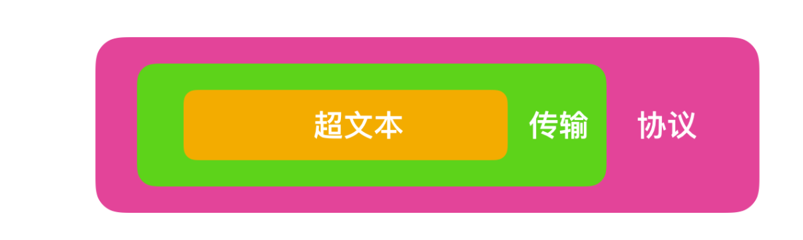
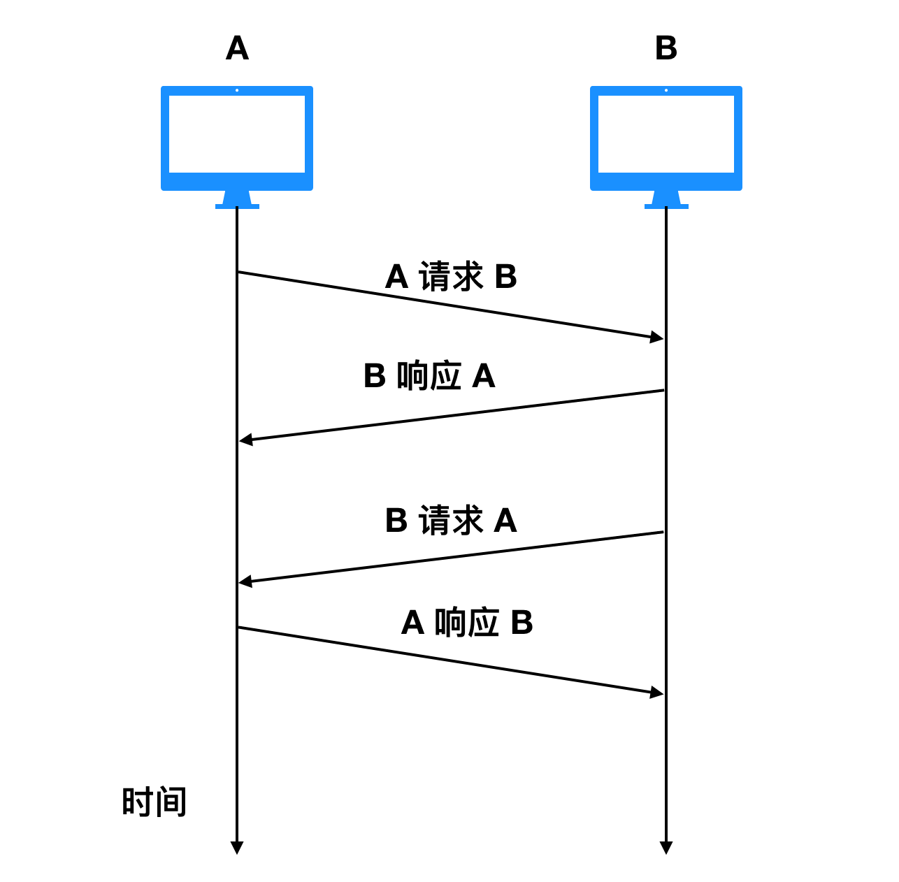
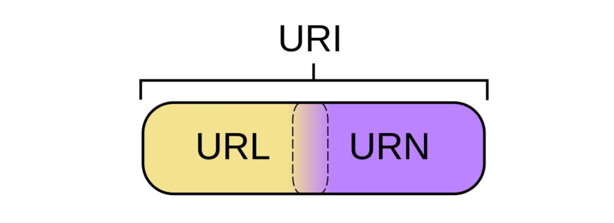
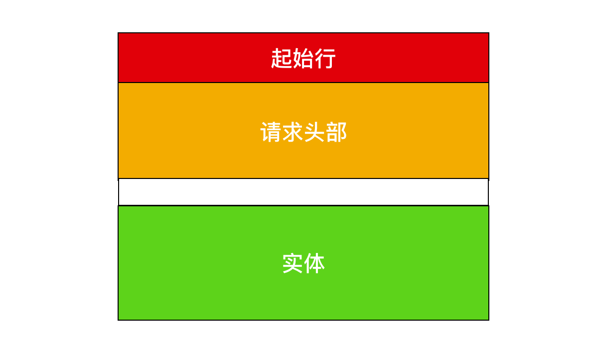
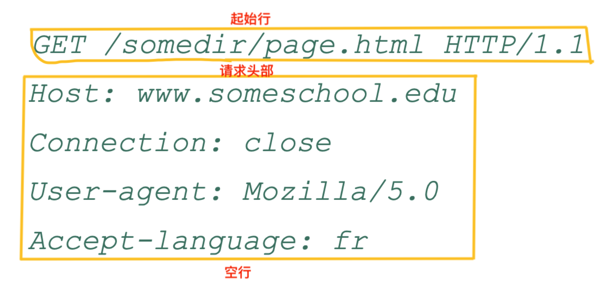
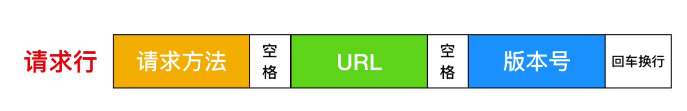
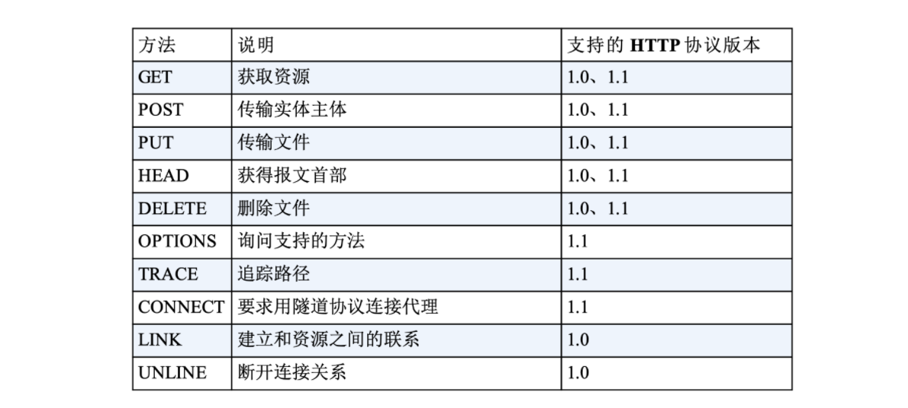
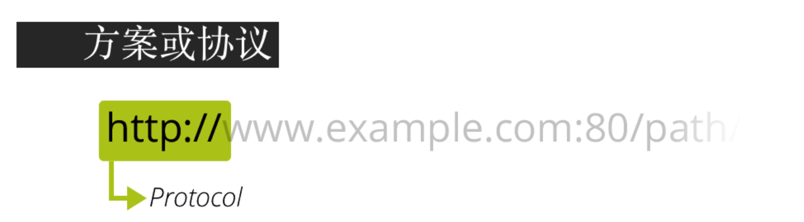

# 看完这篇HTTP，跟面试官扯皮就没问题了

2020年7月29日，所有内容均来自别人的博客，详细地址见最后。


我是一名程序员，我的主要编程语言是 Java，我更是一名 Web 开发人员，所以我必须要了解 HTTP，所以本篇文章就来带你从 HTTP 入门到进阶，看完让你有一种恍然大悟、醍醐灌顶的感觉。


最初在有网络之前，我们的电脑都是单机的，单机系统是孤立的，我还记得 05 年前那会儿家里有个电脑，想打电脑游戏还得两个人在一个电脑上玩儿，及其不方便。我就想为什么家里人不让上网，我的同学 xxx 家里有网，每次一提这个就落一通批评：xxx上xxx什xxxx么xxxx网xxxx看xxxx你xxxx考xxxx的xxxx那xxxx点xxxx分。虽然我家里没有上网，但是此时互联网已经在高速发展了，HTTP 就是高速发展的一个产物。

## 1. 认识 HTTP

首先你听的最多的应该就是 HTTP 是一种 `超文本传输协议(Hypertext Transfer Protocol)`，这你一定能说出来，但是这样还不够，假如你是大厂面试官，这不可能是他想要的最终结果，我们在面试的时候往往把自己知道的尽可能多的说出来，才有和面试官谈价钱的资本。那么什么是超文本传输协议？


超文本传输协议可以进行文字分割：**超文本（Hypertext）、传输（Transfer）、协议（Protocol）**，它们之间的关系如下





按照范围的大小 协议 > 传输 > 超文本。下面就分别对这三个名次做一个解释。

### 1.1 什么是超文本

在互联网早期的时候，我们输入的信息只能保存在本地，无法和其他电脑进行交互。我们保存的信息通常都以`文本`即简单字符的形式存在，文本是一种能够被计算机解析的有意义的二进制数据包。而随着互联网的高速发展，两台电脑之间能够进行数据的传输后，人们不满足只能在两台电脑之间传输文字，还想要传输图片、音频、视频，甚至点击文字或图片能够进行`超链接`的跳转，那么文本的语义就被扩大了，这种语义扩大后的文本就被称为`超文本(Hypertext)`。

### 1.2 什么是传输

那么我们上面说到，两台计算机之间会形成互联关系进行通信，我们存储的超文本会被解析成为二进制数据包，由传输载体（例如同轴电缆，电话线，光缆）负责把二进制数据包由计算机终端传输到另一个终端的过程（对终端的详细解释可以参考 [你说你懂互联网，那这些你知道么？](https://mp.weixin.qq.com/s?__biz=MzU2NDg0OTgyMA==&mid=2247484872&idx=1&sn=49e3e9d3f31ad39ad92f78921bc45ccf&chksm=fc45f83bcb32712d98e577ef3980be895e72432de9749ba3c56d6189268552a738a88103deeb&token=600677552&lang=zh_CN#rd)这篇文章）称为`传输(transfer)`。


通常我们把传输数据包的一方称为`请求方`，把接到二进制数据包的一方称为`应答方`。请求方和应答方可以进行互换，请求方也可以作为应答方接受数据，应答方也可以作为请求方请求数据，它们之间的关系如下





如图所示，A 和 B 是两个不同的端系统，它们之间可以作为信息交换的载体存在，刚开始的时候是 A 作为请求方请求与 B 交换信息，B 作为响应的一方提供信息；随着时间的推移，B 也可以作为请求方请求 A 交换信息，那么 A 也可以作为响应方响应 B 请求的信息。

### 1.3 什么是协议

协议这个名词不仅局限于互联网范畴，也体现在日常生活中，比如情侣双方约定好在哪个地点吃饭，这个约定也是一种`协议`，比如你应聘成功了，企业会和你签订劳动合同，这种双方的雇佣关系也是一种 `协议`。注意自己一个人对自己的约定不能成为协议，协议的前提条件必须是多人约定。   


那么网络协议是什么呢？   


网络协议就是网络中(包括互联网)传递、管理信息的一些规范。如同人与人之间相互交流是需要遵循一定的规矩一样，计算机之间的相互通信需要共同遵守一定的规则，这些规则就称为网络协议。


没有网络协议的互联网是混乱的，就和人类社会一样，人不能想怎么样就怎么样，你的行为约束是受到法律的约束的；那么互联网中的端系统也不能自己想发什么发什么，也是需要受到通信协议约束的。


那么我们就可以总结一下，什么是 HTTP？可以用下面这个经典的总结回答一下： **HTTP 是一个在计算机世界里专门在两点之间传输文字、图片、音频、视频等超文本数据的约定和规范**

## 2. 与 HTTP 有关的组件

随着网络世界演进，HTTP 协议已经几乎成为不可替代的一种协议，在了解了 HTTP 的基本组成后，下面再来带你进一步认识一下 HTTP 协议。

### 2.1 网络模型

网络是一个复杂的系统，不仅包括大量的应用程序、端系统、通信链路、分组交换机等，还有各种各样的协议组成，那么现在我们就来聊一下网络中的协议层次。


为了给网络协议的设计提供一个结构，网络设计者以`分层(layer)`的方式组织协议，每个协议属于层次模型之一。每一层都是向它的上一层提供`服务(service)`，即所谓的`服务模型(service model)`。每个分层中所有的协议称为 `协议栈(protocol stack)`。因特网的协议栈由五个部分组成：物理层、链路层、网络层、运输层和应用层。我们采用自上而下的方法研究其原理，也就是应用层 -> 物理层的方式。

##### 2.1.1 应用层

应用层是网络应用程序和网络协议存放的分层，因特网的应用层包括许多协议，例如我们学 web 离不开的 `HTTP`，电子邮件传送协议 `SMTP`、端系统文件上传协议 `FTP`、还有为我们进行域名解析的 `DNS` 协议。应用层协议分布在多个端系统上，一个端系统应用程序与另外一个端系统应用程序交换信息分组，我们把位于应用层的信息分组称为 `报文(message)`。

##### 2.1.2 运输层

因特网的运输层在应用程序断点之间传送应用程序报文，在这一层主要有两种传输协议 `TCP `和 `UDP`，利用这两者中的任何一个都能够传输报文，不过这两种协议有巨大的不同。


TCP 向它的应用程序提供了面向连接的服务，它能够控制并确认报文是否到达，并提供了拥塞机制来控制网络传输，因此当网络拥塞时，会抑制其传输速率。


UDP 协议向它的应用程序提供了无连接服务。它不具备可靠性的特征，没有流量控制，也没有拥塞控制。我们把运输层的分组称为 `报文段(segment)`


##### 2.1.3 网络层

因特网的网络层负责将称为 `数据报(datagram)` 的网络分层从一台主机移动到另一台主机。网络层一个非常重要的协议是 `IP` 协议，所有具有网络层的因特网组件都必须运行 IP 协议，IP 协议是一种网际协议，除了 IP 协议外，网络层还包括一些其他网际协议和路由选择协议，一般把网络层就称为 IP 层，由此可知 IP 协议的重要性。

##### 2.1.4 链路层

现在我们有应用程序通信的协议，有了给应用程序提供运输的协议，还有了用于约定发送位置的 IP 协议，那么如何才能真正的发送数据呢？为了将分组从一个节点（主机或路由器）运输到另一个节点，网络层必须依靠链路层提供服务。链路层的例子包括以太网、WiFi 和电缆接入的 `DOCSIS` 协议，因为数据从源目的地传送通常需要经过几条链路，一个数据包可能被沿途不同的链路层协议处理，我们把链路层的分组称为 `帧(frame)`

##### 2.1.5 物理层

虽然链路层的作用是将帧从一个端系统运输到另一个端系统，而物理层的作用是将帧中的一个个 `比特` 从一个节点运输到另一个节点，物理层的协议仍然使用链路层协议，这些协议与实际的物理传输介质有关，例如，以太网有很多物理层协议：关于双绞铜线、关于同轴电缆、关于光纤等等。

### 2.2 OSI 模型

我们上面讨论的计算网络协议模型不是唯一的 `协议栈`，ISO（国际标准化组织）提出来计算机网络应该按照7层来组织，那么7层网络协议栈与5层的区别在哪里？


OSI 要比上面的网络模型多了 `表示层` 和 `会话层`，其他层基本一致。表示层主要包括数据压缩和数据加密以及数据描述，数据描述使得应用程序不必担心计算机内部存储格式的问题，而会话层提供了数据交换的定界和同步功能，包括建立检查点和恢复方案。

### 2.3 浏览器

就如同各大邮箱使用电子邮件传送协议 `SMTP` 一样，浏览器是使用 HTTP 协议的主要载体，说到浏览器，你能想起来几种？是的，随着网景大战结束后，浏览器迅速发展，至今已经出现过的浏览器主要有


浏览器正式的名字叫做 `Web Broser`，顾名思义，就是检索、查看互联网上网页资源的应用程序，名字里的 Web，实际上指的就是 `World Wide Web`，也就是万维网。


我们在地址栏输入URL（即网址），浏览器会向DNS（域名服务器，后面会说）提供网址，由它来完成 URL 到 IP 地址的映射。然后将请求你的请求提交给具体的服务器，在由服务器返回我们要的结果（以HTML编码格式返回给浏览器），浏览器执行HTML编码，将结果显示在浏览器的正文。这就是一个浏览器发起请求和接受响应的过程。


### 2.4 CDN

CDN的全称是`Content Delivery Network`，即`内容分发网络`，它应用了 HTTP 协议里的缓存和代理技术，代替源站响应客户端的请求。CDN 是构建在现有网络基础之上的网络，它依靠部署在各地的边缘服务器，通过中心平台的负载均衡、内容分发、调度等功能模块，使用户`就近`获取所需内容，降低网络拥塞，提高用户访问响应速度和命中率。CDN的关键技术主要有`内容存储`和`分发技术`。


打比方说你要去亚马逊上买书，之前你只能通过购物网站购买后从美国发货过海关等重重关卡送到你的家里，现在在中国建立一个亚马逊分基地，你就不用通过美国进行邮寄，从中国就能把书尽快给你送到。

### 2.5 WAF

WAF 是一种 Web 应用程序防护系统（Web Application Firewall，简称 WAF），它是一种通过执行一系列针对HTTP / HTTPS的`安全策略`来专门为Web应用提供保护的一款产品，它是应用层面的`防火墙`，专门检测 HTTP 流量，是防护 Web 应用的安全技术。

WAF 通常位于 Web 服务器之前，可以阻止如 SQL 注入、跨站脚本等攻击，目前应用较多的一个开源项目是 ModSecurity，它能够完全集成进 Apache 或 Nginx。

### 2.6 WebService

WebService 是一种 Web 应用程序，**WebService是一种跨编程语言和跨操作系统平台的远程调用技术**。

Web Service 是一种由 W3C 定义的应用服务开发规范，使用 client-server 主从架构，通常使用 WSDL 定义服务接口，使用 HTTP 协议传输 XML 或 SOAP 消息，它是**一个基于 Web（HTTP）的服务架构技术**，既可以运行在内网，也可以在适当保护后运行在外网。

### 2.7 HTML

HTML 称为超文本标记语言，是一种标识性的语言。它包括一系列标签．通过这些标签可以将网络上的文档格式统一，使分散的 Internet 资源连接为一个逻辑整体。HTML 文本是由 HTML 命令组成的描述性文本，HTML 命令可以说明文字，图形、动画、声音、表格、链接等。

### 2.8 Web 页面构成

Web 页面（Web page）也叫做文档，是由一个个对象组成的。一个`对象(Objecy)` 只是一个文件，比如一个 HTML 文件、一个 JPEG 图形、一个 Java 小程序或一个视频片段，它们在网络中可以通过 `URL` 地址寻址。多数的 Web 页面含有一个 `HTML 基本文件` 以及几个引用对象。

举个例子，如果一个 Web 页面包含 HTML 文件和5个 JPEG 图形，那么这个 Web 页面就有6个对象：一个 HTML 文件和5个 JPEG 图形。HTML 基本文件通过 URL 地址引用页面中的其他对象。

## 3. 与 HTTP 有关的协议

在互联网中，任何协议都不会单独的完成信息交换，HTTP 也一样。虽然 HTTP 属于应用层的协议，但是它仍然需要其他层次协议的配合完成信息的交换，那么在完成一次 HTTP 请求和响应的过程中，需要哪些协议的配合呢？一起来看一下

### 3.1 TCP/IP

`TCP/IP` 协议你一定听过，TCP/IP 我们一般称之为`协议簇`，什么意思呢？就是 TCP/IP 协议簇中不仅仅只有 TCP 协议和 IP 协议，它是一系列网络通信协议的统称。而其中最核心的两个协议就是 TCP / IP 协议，其他的还有 UDP、ICMP、ARP 等等，共同构成了一个复杂但有层次的协议栈。


TCP 协议的全称是 `Transmission Control Protocol` 的缩写，意思是`传输控制协议`，HTTP 使用 TCP 作为通信协议，这是因为 TCP 是一种可靠的协议，而`可靠`能保证数据不丢失。


IP 协议的全称是 `Internet Protocol` 的缩写，它主要解决的是通信双方寻址的问题。IP 协议使用 `IP 地址` 来标识互联网上的每一台计算机，可以把 IP 地址想象成为你手机的电话号码，你要与他人通话必须先要知道他人的手机号码，计算机网络中信息交换必须先要知道对方的 IP 地址。（关于 TCP 和 IP 更多的讨论我们会在后面详解）

### 3.2 DNS

你有没有想过为什么你可以通过键入 `www.google.com` 就能够获取你想要的网站？我们上面说到，计算机网络中的每个端系统都有一个 IP 地址存在，而把 IP 地址转换为便于人类记忆的协议就是 `DNS 协议`。

DNS 的全称是`域名系统（Domain Name System，缩写：DNS）`，它作为将域名和 IP 地址相互映射的一个分布式数据库，能够使人更方便地访问互联网。

### 3.3 URI / URL 

我们上面提到，你可以通过输入 `www.google.com` 地址来访问谷歌的官网，那么这个地址有什么规定吗？我怎么输都可以？AAA.BBB.CCC 是不是也行？当然不是的，你输入的地址格式必须要满足 `URI` 的规范。

`URI`的全称是（Uniform Resource Identifier），中文名称是统一资源标识符，使用它就能够唯一地标记互联网上资源。

`URL`的全称是（Uniform Resource Locator），中文名称是统一资源定位符，也就是我们俗称的`网址`，它实际上是 URI 的一个子集。

URI 不仅包括 URL，还包括 URN（统一资源名称），它们之间的关系如下



### 3.4 HTTPS

HTTP 一般是明文传输，很容易被攻击者窃取重要信息，鉴于此，HTTPS 应运而生。HTTPS 的全称为 （Hyper Text Transfer Protocol over SecureSocket Layer），全称有点长，HTTPS 和 HTTP 有很大的不同在于 HTTPS 是以安全为目标的 HTTP 通道，在 HTTP 的基础上通过传输加密和身份认证保证了传输过程的安全性。HTTPS 在 HTTP 的基础上增加了 `SSL` 层，也就是说 **HTTPS = HTTP + SSL**。（这块我们后面也会详谈 HTTPS） 

## 4. HTTP 请求响应过程

你是不是很好奇，当你在浏览器中输入网址后，到底发生了什么事情？你想要的内容是如何展现出来的？让我们通过一个例子来探讨一下，我们假设访问的 URL 地址为 `http://www.someSchool.edu/someDepartment/home.index`，当我们输入网址并点击回车时，浏览器内部会进行如下操作

- DNS服务器会首先进行域名的映射，找到访问`www.someSchool.edu`所在的地址，然后HTTP 客户端进程在 80 端口发起一个到服务器 `www.someSchool.edu` 的 TCP 连接（80 端口是 HTTP 的默认端口）。在客户和服务器进程中都会有一个`套接字`与其相连。
- HTTP 客户端通过它的套接字向服务器发送一个 HTTP 请求报文。该报文中包含了路径 `someDepartment/home.index` 的资源，我们后面会详细讨论 HTTP 请求报文。
- HTTP 服务器通过它的套接字接受该报文，进行请求的解析工作，并从其`存储器(RAM 或磁盘)`中检索出对象 www.someSchool.edu/someDepartment/home.index，然后把检索出来的对象进行封装，封装到 HTTP 响应报文中，并通过套接字向客户进行发送。
- HTTP 服务器随即通知 TCP 断开 TCP 连接，实际上是需要等到客户接受完响应报文后才会断开 TCP 连接。
- HTTP 客户端接受完响应报文后，TCP 连接会关闭。HTTP 客户端从响应中提取出报文中是一个 HTML 响应文件，并检查该 HTML 文件，然后循环检查报文中其他内部对象。
- 检查完成后，HTTP 客户端会把对应的资源通过显示器呈现给用户。

至此，键入网址再按下回车的全过程就结束了。上述过程描述的是一种简单的`请求-响应`全过程，真实的请求-响应情况可能要比上面描述的过程复杂很多。

## 5. HTTP 请求特征

从上面整个过程中我们可以总结出 HTTP 进行分组传输是具有以下特征

- 支持客户-服务器模式
- 简单快速：客户向服务器请求服务时，只需传送请求方法和路径。请求方法常用的有 GET、HEAD、POST。每种方法规定了客户与服务器联系的类型不同。由于 HTTP 协议简单，使得 HTTP 服务器的程序规模小，因而通信速度很快。
- 灵活：HTTP 允许传输任意类型的数据对象。正在传输的类型由 Content-Type 加以标记。
- 无连接：无连接的含义是限制每次连接只处理一个请求。服务器处理完客户的请求，并收到客户的应答后，即断开连接。采用这种方式可以节省传输时间。
- 无状态：HTTP 协议是无状态协议。无状态是指协议对于事务处理没有记忆能力。缺少状态意味着如果后续处理需要前面的信息，则它必须重传，这样可能导致每次连接传送的数据量增大。另一方面，在服务器不需要先前信息时它的应答就较快。

## 6. 详解 HTTP 报文

我们上面描述了一下 HTTP 的请求响应过程，流程比较简单，但是凡事就怕认真，你这一认真，就能拓展出很多东西，比如 **HTTP 报文是什么样的，它的组成格式是什么？** 下面就来探讨一下

HTTP 协议主要由三大部分组成：

- `起始行（start line）`：描述请求或响应的基本信息；
- `头部字段（header）`：使用 key-value 形式更详细地说明报文；
- `消息正文（entity）`：实际传输的数据，它不一定是纯文本，可以是图片、视频等二进制数据。

其中起始行和头部字段并成为 `请求头` 或者 `响应头`，统称为 `Header`；消息正文也叫做实体，称为 `body`。HTTP 协议规定每次发送的报文必须要有 Header，但是可以没有 body，也就是说头信息是必须的，实体信息可以没有。而且在 header 和 body 之间必须要有一个空行（CRLF），如果用一幅图来表示一下的话，我觉得应该是下面这样



我们使用上面的那个例子来看一下 http 的请求报文



如图，这是 `http://www.someSchool.edu/someDepartment/home.index` 请求的请求头，通过观察这个 HTTP 报文我们就能够学到很多东西，首先，我们看到报文是用普通 `ASCII` 文本书写的，这样保证人能够可以看懂。然后，我们可以看到每一行和下一行之间都会有换行，而且最后一行（请求头部后）再加上一个回车换行符。

每个报文的起始行都是由三个字段组成：**方法、URL 字段和 HTTP 版本字段**。




### 6.1 HTTP 请求方法

HTTP 请求方法一般分为 8 种，它们分别是

- `GET 获取资源`，GET 方法用来请求访问已被 URI 识别的资源。指定的资源经服务器端解析后返回响应内容。也就是说，如果请求的资源是文本，那就保持原样返回；

- `POST 传输实体`，虽然 GET 方法也可以传输主体信息，但是便于区分，我们一般不用 GET 传输实体信息，反而使用 POST 传输实体信息，

- PUT 传输文件，PUT 方法用来传输文件。就像 FTP 协议的文件上传一样，要求在请求报文的主体中包含文件内容，然后保存到请求 URI 指定的位置。

  但是，鉴于 HTTP 的 PUT 方法自身不带验证机制，任何人都可以上传文件 , 存在安全性问题，因此一般的 W eb 网站不使用该方法。若配合 W eb 应用程序的验证机制，或架构设计采用`REST（REpresentational State Transfer，表征状态转移）`标准的同类 Web 网站，就可能会开放使用 PUT 方法。

- HEAD 获得响应首部，HEAD 方法和 GET 方法一样，只是不返回报文主体部分。用于确认 URI 的有效性及资源更新的日期时间等。

- DELETE 删除文件，DELETE 方法用来删除文件，是与 PUT 相反的方法。DELETE 方法按请求 URI 删除指定的资源。

- OPTIONS 询问支持的方法，OPTIONS 方法用来查询针对请求 URI 指定的资源支持的方法。

- TRACE 追踪路径，TRACE 方法是让 Web 服务器端将之前的请求通信环回给客户端的方法。

- CONNECT 要求用隧道协议连接代理，CONNECT 方法要求在与代理服务器通信时建立隧道，实现用隧道协议进行 TCP 通信。主要使用 `SSL（Secure Sockets Layer，安全套接层）`和 TLS`（Transport Layer Security，传输层安全）`协议把通信内容加 密后经网络隧道传输。

我们一般最常用的方法也就是 GET 方法和 POST 方法，其他方法暂时了解即可。下面是 HTTP1.0 和 HTTP1.1 支持的方法清单



### 6.2 HTTP 请求 URL

HTTP 协议使用 URI 定位互联网上的资源。正是因为 URI 的特定功能，在互联网上任意位置的资源都能访问到。URL 带有请求对象的标识符。在上面的例子中，浏览器正在请求对象 `/somedir/page.html` 的资源。

我们再通过一个完整的域名解析一下 URL

比如 `http://www.example.com:80/path/to/myfile.html?key1=value1&key2=value2#SomewhereInTheDocument` 这个 URL 比较繁琐了吧，你把这个 URL 搞懂了其他的 URL 也就不成问题了。

首先出场的是 `http`



`http://`告诉浏览器使用何种协议。对于大部分 Web 资源，通常使用 HTTP 协议或其安全版本，HTTPS 协议。另外，浏览器也知道如何处理其他协议。例如， `mailto:` 协议指示浏览器打开邮件客户端；`ftp:`协议指示浏览器处理文件传输。

第二个出场的是 `主机`   


`www.example.com` 既是一个域名，也代表管理该域名的机构。它指示了需要向网络上的哪一台主机发起请求。当然，也可以直接向主机的 [IP address](https://developer.mozilla.org/en-US/docs/Glossary/IP_address) 地址发起请求。但直接使用 IP 地址的场景并不常见。

第三个出场的是 `端口`


我们前面说到，两个主机之间要发起 TCP 连接需要两个条件，主机 + 端口。它表示用于访问 Web 服务器上资源的入口。如果访问的该 Web 服务器使用HTTP协议的标准端口（HTTP为80，HTTPS为443）授予对其资源的访问权限，则通常省略此部分。否则端口就是 URI 必须的部分。

上面是请求 URL 所必须包含的部分，下面就是 URL 具体请求资源路径

第四个出场的是 `路径`


`/path/to/myfile.html` 是 Web 服务器上资源的路径。以端口后面的第一个 `/` 开始，到 `?` 号之前结束，中间的 每一个`/`都代表了层级（上下级）关系。这个 URL 的请求资源是一个 html 页面。

紧跟着路径后面的是 `查询参数`


`?key1=value1&key2=value2` 是提供给 Web 服务器的额外参数。如果是 GET 请求，一般带有请求 URL 参数，如果是 POST 请求，则不会在路径后面直接加参数。这些参数是用 & 符号分隔的`键/值对`列表。key1 = value1 是第一对，key2 = value2 是第二对参数

紧跟着参数的是`锚点`


`#SomewhereInTheDocument` 是资源本身的某一部分的一个锚点。锚点代表资源内的一种“书签”，它给予浏览器显示位于该“加书签”点的内容的指示。 例如，在HTML文档上，浏览器将滚动到定义锚点的那个点上；在视频或音频文档上，浏览器将转到锚点代表的那个时间。值得注意的是 # 号后面的部分，也称为片段标识符，永远不会与请求一起发送到服务器。

### HTTP 版本

表示报文使用的 HTTP 协议版本。

### 请求头部

**这部分内容只是大致介绍一下，内容较多，后面会再以一篇文章详述**

在表述完了起始行之后我们再来看一下`请求头部`，现在我们向上找，找到`http://www.someSchool.edu/someDepartment/home.index`，来看一下它的请求头部

```http
Host: www.someschool.edu
Connection: close
User-agent: Mozilla/5.0
Accept-language: fr
```

这个请求头信息比较少，首先 Host 表示的是对象所在的主机。你也许认为这个 Host 是不需要的，因为 URL 不是已经指明了请求对象的路径了吗？这个首部行提供的信息是 `Web 代理高速缓存`所需要的。`Connection: close` 表示的是浏览器需要告诉服务器使用的是`非持久连接`。它要求服务器在发送完响应的对象后就关闭连接。`User-agent`: 这是请求头用来告诉 Web 服务器，浏览器使用的类型是 `Mozilla/5.0`，即 Firefox 浏览器。`Accept-language` 告诉 Web 服务器，浏览器想要得到对象的法语版本，前提是服务器需要支持法语类型，否则将会发送服务器的默认版本。下面我们针对主要的实体字段进行介绍（具体的可以参考 https://developer.mozilla.org/zh-CN/docs/Web/HTTP/Headers MDN 官网学习）

HTTP 的请求标头分为四种： `通用标头`、`请求标头`、`响应标头` 和 `实体标头`，依次来进行详解。

#### 通用标头

通用标头主要有三个，分别是 `Date`、`Cache-Control` 和 `Connection`

**Date**

Date 是一个通用标头，它可以出现在请求标头和响应标头中，它的基本表示如下

```http
Date: Wed, 21 Oct 2015 07:28:00 GMT 
```

表示的是格林威治标准时间，这个时间要比北京时间慢八个小时


**Cache-Control**

Cache-Control 是一个通用标头，他可以出现在请求标头和响应标头中，Cache-Control 的种类比较多，虽然说这是一个通用标头，但是又一些特性是请求标头具有的，有一些是响应标头才有的。主要大类有 `可缓存性`、`阈值性`、 `重新验证并重新加载` 和`其他特性`

可缓存性是唯一响应标头才具有的特性，我们会在响应标头中详述。

阈值性，这个我翻译可能不准确，它的原英文是 Expiration，我是根据它的值来翻译的，你看到这些值可能会觉得我翻译的有点道理

- `max-age`: 资源被认为仍然有效的最长时间，与 `Expires` 不同，这个请求是相对于 request标头的时间，而 Expires 是相对于响应标头。（请求标头）
- `s-maxage`: 重写了 max-age 和 Expires 请求头，仅仅适用于共享缓存，被私有缓存所忽略（这块不理解，看完响应头的 Cache-Control 再进行理解）（请求标头）
- `max-stale`：表示客户端将接受的最大响应时间，以秒为单位。（响应标头）
- `min-fresh`: 表示客户端希望响应在指定的最小时间内有效。（响应标头）

**Connection**

Connection 决定当前事务（一次三次握手和四次挥手）完成后，是否会关闭网络连接。Connection 有两种，一种是`持久性连接`，即一次事务完成后不关闭网络连接

```http
Connection: keep-alive
```

另一种是`非持久性连接`，即一次事务完成后关闭网络连接

```http
Connection: close
```

HTTP1.1 其他通用标头如下


#### 实体标头

## 参考

> [看完这篇HTTP，跟面试官扯皮就没问题了](https://www.cnblogs.com/cxuanBlog/p/12177976.html)


