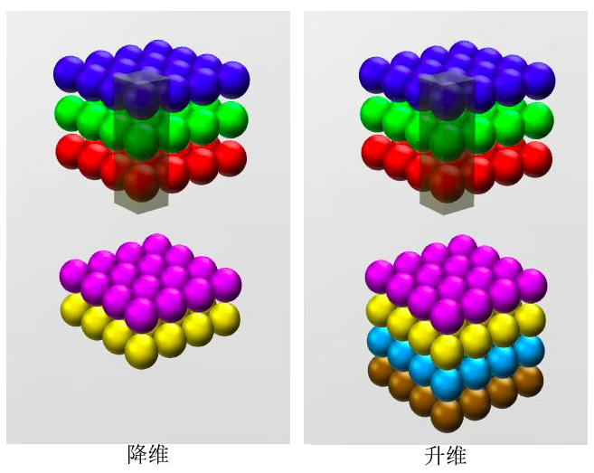

# 面试

2020年10月15日

-----

### 1、conv（1 * 1） 的作用

总体来说1×1卷积的作用可以总结为三点:

1）可以实现多个feature map 线性叠加实现特征组合;

2）实现输出维度升维或者降维;

3）起缓冲作用，防止梯度直接影响主干网络，更稳定。

### 1.1 **加入非线性**, 和信息整合

卷积层之后经过激励层，1*1的卷积在前一层的学习表示上添加了非线性激励（ non-linear activation ），提升网络的表达能力。

### 1.2 进行卷积核通道数的降维和升维，减少网络参数

比如，一张500 * 500且厚度depth为100 的图片在20个filter上做1\*1的卷积，那么结果的大小为500\*500\*20。

### 参考

> 1、https://zhuanlan.zhihu.com/p/27642620
>
> 2、https://www.zhihu.com/question/56024942