# 向量点乘（内积）和叉乘（外积、向量积）

2020年8月9日

---

向量是由n个实数组成的一个n行1列（n\* 1）或一个1行n列（1\*n）的有序数组；

## 1. 点乘

向量的点乘,也叫向量的内积、数量积，对两个向量执行点乘运算，就是对这两个向量对应位一一相乘之后求和的操作，**点乘的结果是一个标量**。

### 1.1 点乘公式

对于向量a和向量b：

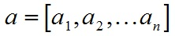

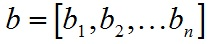

a和b的点积公式为：

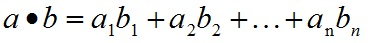

要求一维向量a和向量b的行列数相同。

### 1.2 点乘几何意义

点乘的几何意义是可以用来表征或计算两个向量之间的夹角，以及在b向量在a向量方向上的投影，有公式：

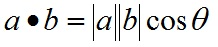

推导过程如下，首先看一下向量组成：

定义向量：

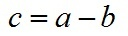

根据三角形余弦定理有：

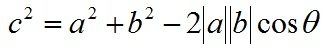

根据关系c=a-b（a、b、c均为向量）有：

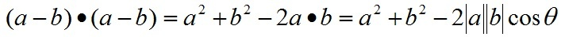

即：

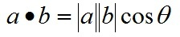

向量a，b的长度都是可以计算的已知量，从而有a和b间的夹角θ：

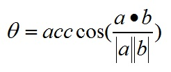

根据这个公式就可以计算向量a和向量b之间的夹角。从而就可以进一步判断这两个向量是否是同一方向，是否正交(也就是垂直)等方向关系，具体对应关系为：

   a·b>0   方向基本相同，夹角在0°到90°之间

   a·b=0   正交，相互垂直  

   a·b<0   方向基本相反，夹角在90°到180°之间 

## **2.叉乘公式**

两个向量的叉乘，又叫向量积、外积、叉积，叉乘的运算结果是一个向量而不是一个标量。并且两个向量的叉积与这两个向量组成的坐标平面垂直。

### 2.1 叉乘公式

对于向量a和向量b：

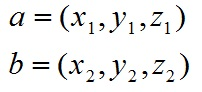

a和b的叉乘公式为：

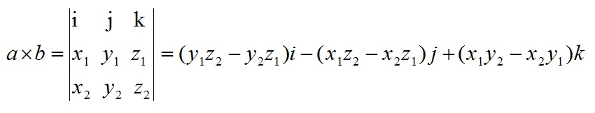

其中：

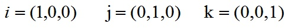

根据i、j、k间关系，有：

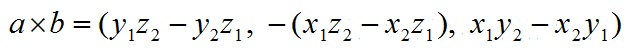

### **2.2 叉乘几何意义**

在三维几何中，向量a和向量b的叉乘结果是一个向量，更为熟知的叫法是法向量，该向量垂直于a和b向量构成的平面。

在3D图像学中，叉乘的概念非常有用，可以通过两个向量的叉乘，生成第三个垂直于a，b的法向量，从而构建X、Y、Z坐标系。如下图所示： 

在二维空间中，叉乘还有另外一个几何意义就是：aXb等于由向量a和向量b构成的平行四边形的面积。