# 卷积神经网络(CNN)反向传播算法
## 1. 回顾DNN的反向传播算法
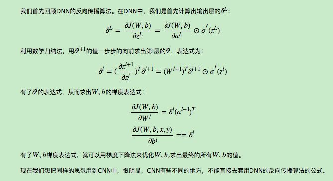   
## 2. CNN的反向传播算法思想
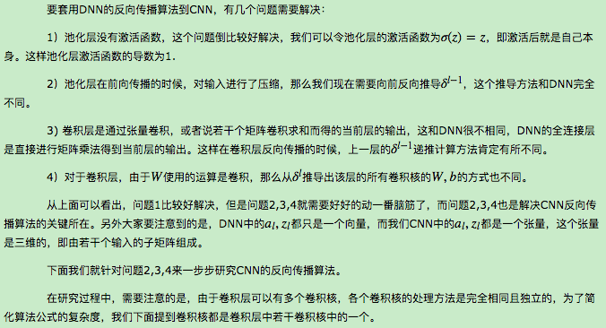   
## 3. 已知池化层的δ^l，推导上一隐藏层的δ^{l−1}
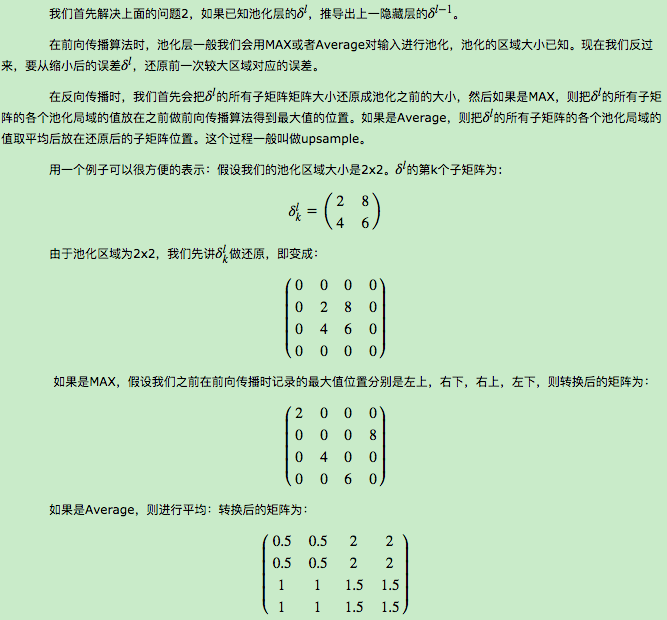   
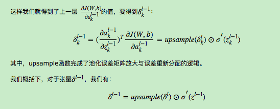   
## 4. 已知卷积层的δ^l，推导上一隐藏层的δ^{l−1}
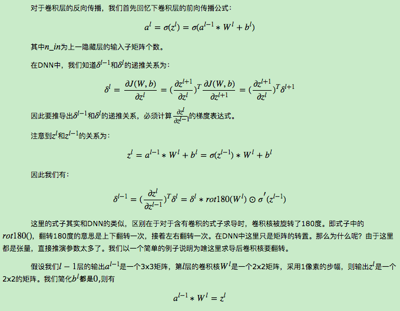  
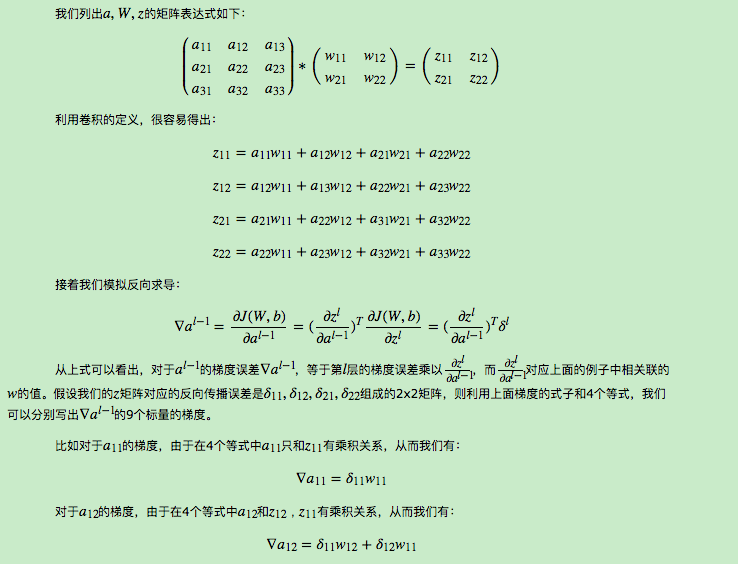   
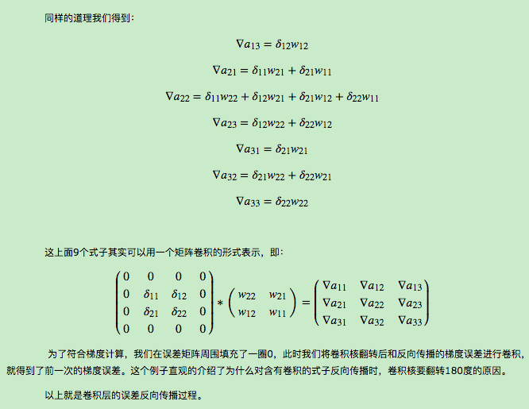   
## 5. 已知卷积层的δ^l，推导该层的W,b的梯度　
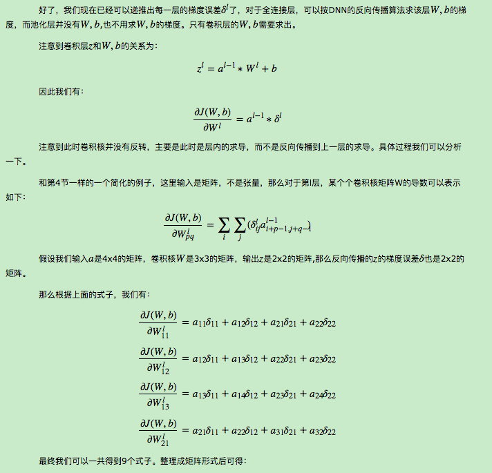   
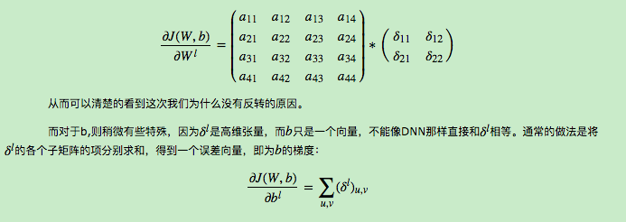   
## 6. CNN反向传播算法总结
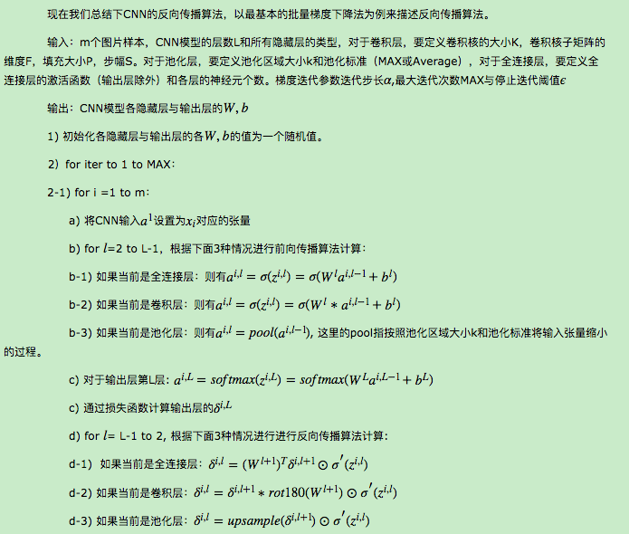   
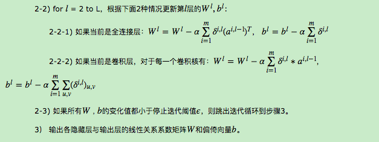   
## Reference
[1] https://www.cnblogs.com/pinard/p/6494810.html

