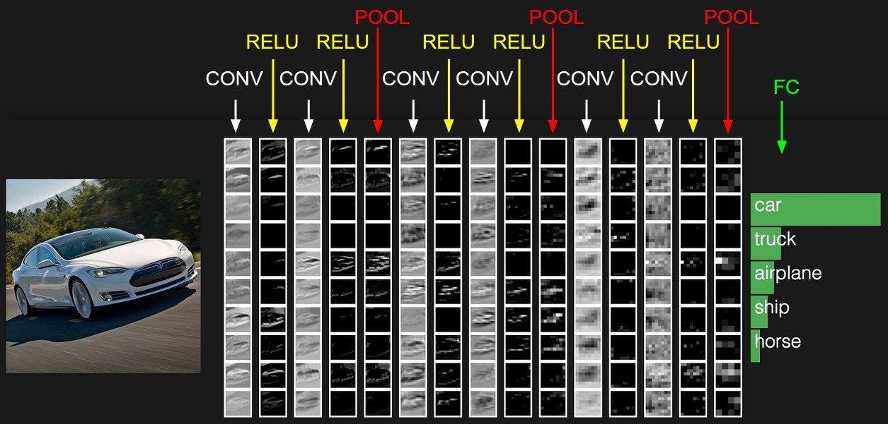
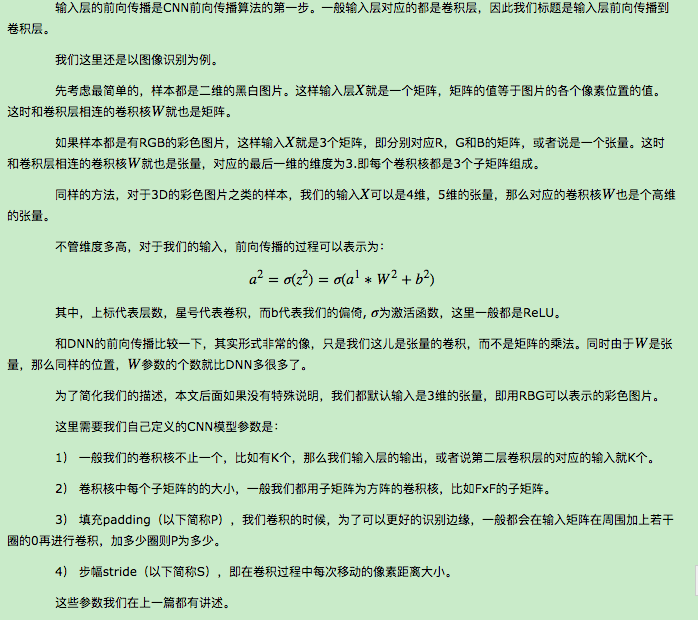
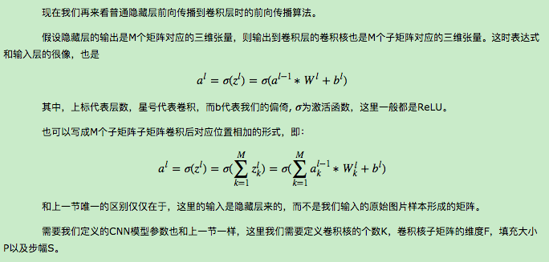
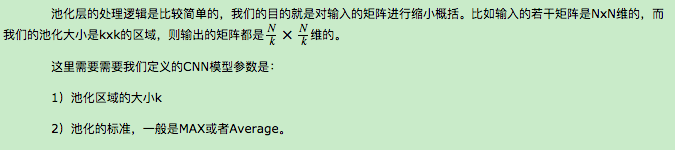
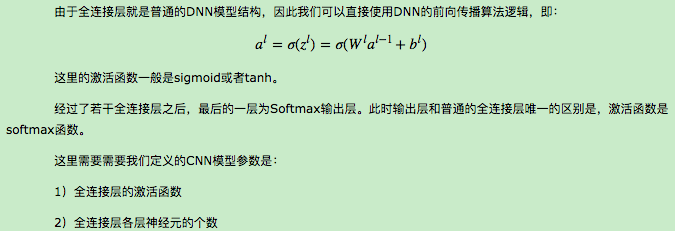
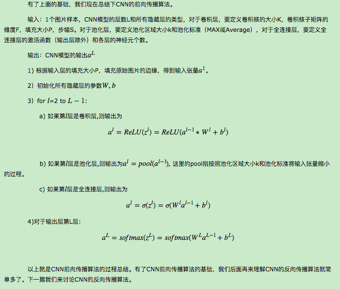

# 卷积神经网络(CNN)前向传播算法
## 1. 回顾CNN的结构
　　　　在上一篇里，我们已经讲到了CNN的结构，包括输出层，若干的卷积层+ReLU激活函数，若干的池化层，DNN全连接层，以及最后的用Softmax激活函数的输出层。这里我们用一个彩色的汽车样本的图像识别再从感官上回顾下CNN的结构。图中的CONV即为卷积层，POOL即为池化层，而FC即为DNN全连接层，包括了我们上面最后的用Softmax激活函数的输出层。   
   
从上图可以看出，要理顺CNN的前向传播算法，重点是输入层的前向传播，卷积层的前向传播以及池化层的前向传播。而DNN全连接层和用Softmax激活函数的输出层的前向传播算法我们在讲DNN时已经讲到了。    
## 2. CNN输入层前向传播到卷积层
   
## 3. 隐藏层前向传播到卷积层
   
## 4. 隐藏层前向传播到池化层
   
## 5. 隐藏层前向传播到全连接层
   
##  6. CNN前向传播算法小结
   

## Reference
[1] https://www.cnblogs.com/pinard/p/6489633.html
