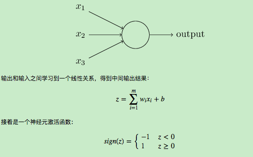
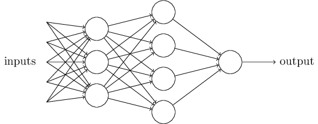
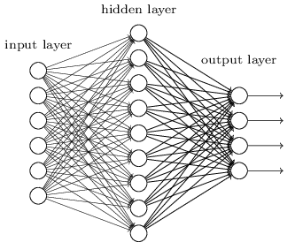
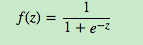
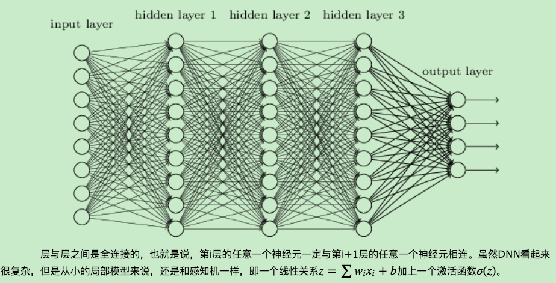
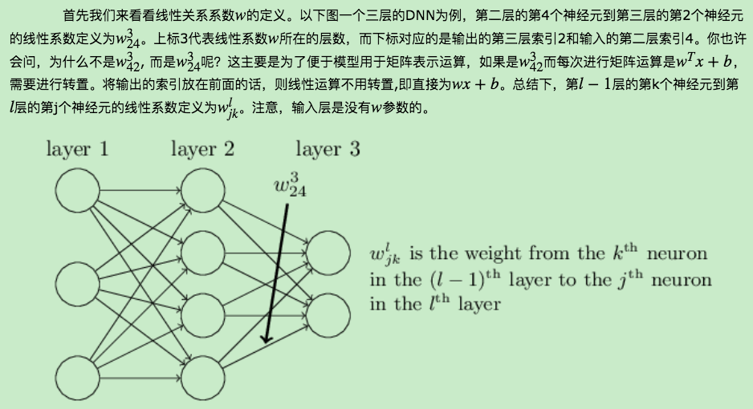
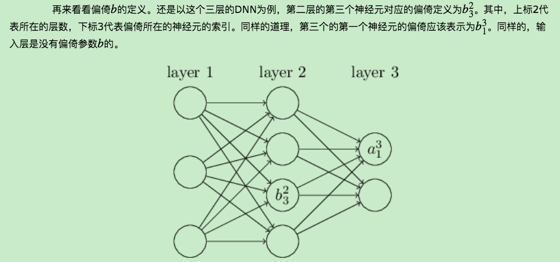
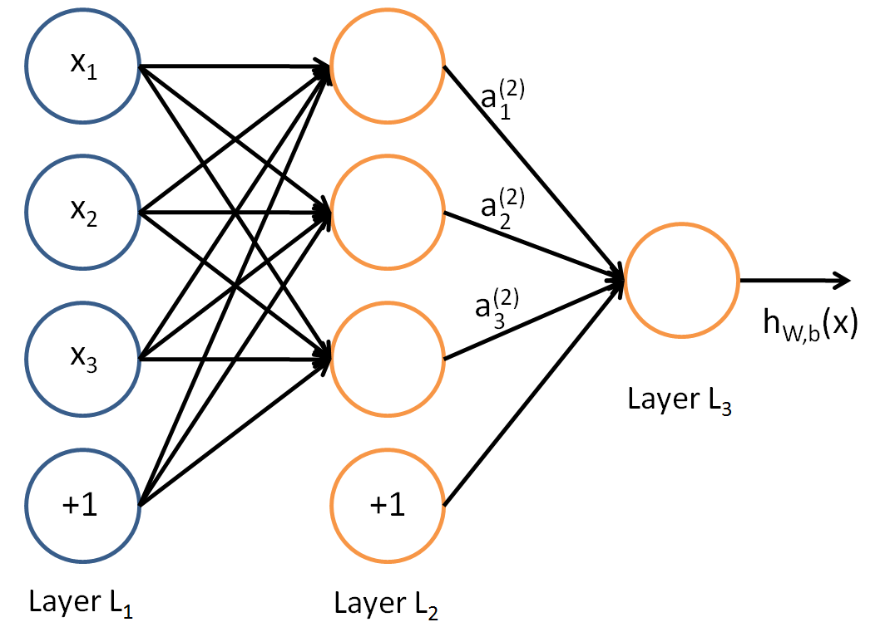
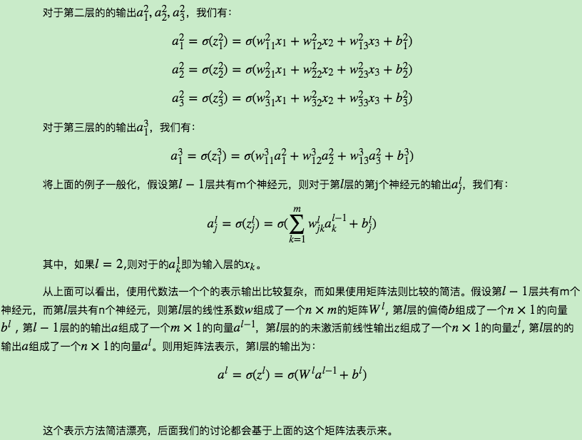
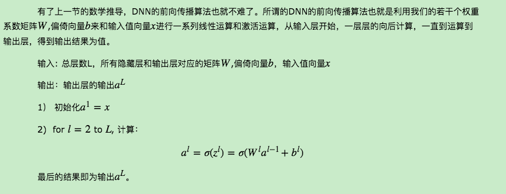

# 深度神经网络（DNN）模型与前向传播算法
　　　　深度神经网络（Deep Neural Networks， 以下简称DNN）是深度学习的基础，而要理解DNN，首先我们要理解DNN模型，下面我们就对DNN的模型与前向传播算法做一个总结。

## 1. 从感知机到神经网络
　　　　在感知机原理小结中，我们介绍过感知机的模型，它是一个有若干输入和一个输出的模型，如下图:   
   
从而得到我们想要的输出结果1或者-1。

　　这个模型只能用于二元分类，且无法学习比较复杂的非线性模型，因此在工业界无法使用。而神经网络则在感知机的模型上做了扩展，总结下主要有三点：

1）加入了隐藏层，隐藏层可以有多层，增强模型的表达能力，如下图实例，当然增加了这么多隐藏层模型的复杂度也增加了好多。   
   
2）输出层的神经元也可以不止一个输出，可以有多个输出，这样模型可以灵活的应用于分类回归，以及其他的机器学习领域比如降维和聚类等。多个神经元输出的输出层对应的一个实例如下图，输出层现在有4个神经元了。    
   
3） 对激活函数做扩展，感知机的激活函数是sign(z),虽然简单但是处理能力有限，因此神经网络中一般使用的其他的激活函数，比如我们在逻辑回归里面使用过的Sigmoid函数，即：    
   
还有后来出现的tanx, softmax,和ReLU等。通过使用不同的激活函数，神经网络的表达能力进一步增强。对于各种常用的激活函数，我们在后面再专门讲。   
## 2. DNN的基本结构
上一节我们了解了神经网络基于感知机的扩展，而DNN可以理解为有很多隐藏层的神经网络。这个很多其实也没有什么度量标准, 多层神经网络和深度神经网络DNN其实也是指的一个东西，当然，DNN有时也叫做多层感知机（Multi-Layer perceptron,MLP）, 名字实在是多。后面我们讲到的神经网络都默认为DNN。

从DNN按不同层的位置划分，DNN内部的神经网络层可以分为三类，输入层，隐藏层和输出层,如下图示例，一般来说第一层是输入层，最后一层是输出层，而中间的层数都是隐藏层。

   
由于DNN层数多，则我们的线性关系系数w和偏倚b的数量也就是很多了。具体的参数在DNN是如何定义的呢？   
   
   
## 3.DNN前向传播算法数学原理
在上一节，我们已经介绍了DNN各层线性关系系数w,偏倚b的定义。假设我们选择的激活函数是σ(z)，隐藏层和输出层的输出值为a，则对于下图的三层DNN,利用和感知机一样的思路，我们可以利用上一层的输出计算下一层的输出，也就是所谓的DNN前向传播算法。

  
   
## 4. DNN前向传播算法
   
## 5. DNN前向传播算法小结
　　　　单独看DNN前向传播算法，似乎没有什么大用处，而且这一大堆的矩阵W,偏倚向量b对应的参数怎么获得呢？怎么得到最优的矩阵W,偏倚向量b呢？这个我们在讲DNN的反向传播算法时再讲。而理解反向传播算法的前提就是理解DNN的模型与前向传播算法。这也是我们这一篇先讲的原因。
## Reference
[1] https://www.cnblogs.com/pinard/p/6418668.html   