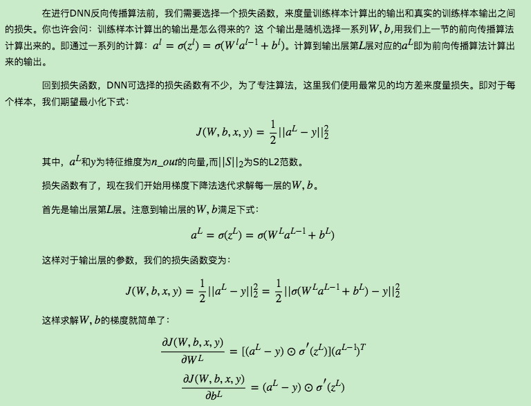
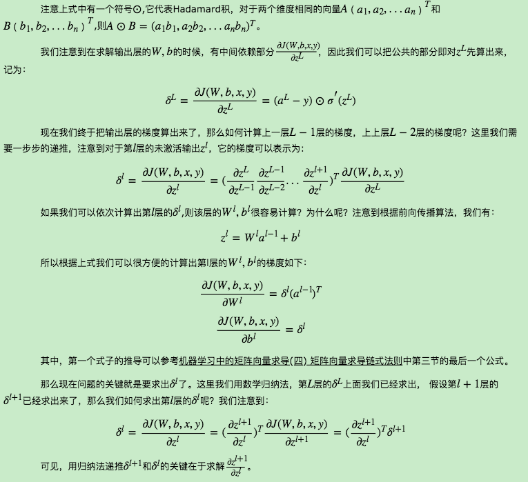
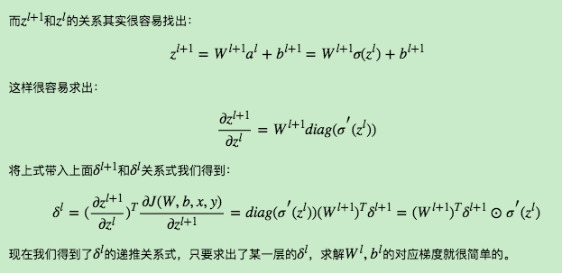
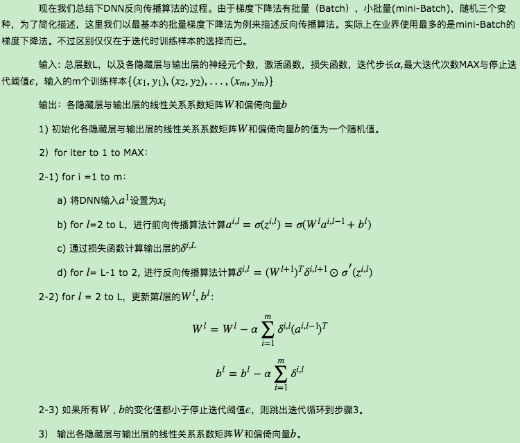

# 深度神经网络（DNN）反向传播算法(BP)
## 1. DNN反向传播算法要解决的问题
在了解DNN的反向传播算法前，我们先要知道DNN反向传播算法要解决的问题，也就是说，什么时候我们需要这个反向传播算法？　

回到我们监督学习的一般问题，假设我们有m个训练样本：{(x1,y1),(x2,y2),...,(xm,ym)},其中x为输入向量，特征维度为n_in,而y为输出向量，特征维度为n_out。我们需要利用这m个样本训练出一个模型，当有一个新的测试样本(xtest,?)来到时, 我们可以预测ytest向量的输出。　

如果我们采用DNN的模型，即我们使输入层有n_in个神经元，而输出层有n_out个神经元。再加上一些含有若干神经元的隐藏层。此时我们需要找到合适的所有隐藏层和输出层对应的线性系数矩阵W,偏倚向量b,让所有的训练样本输入计算出的输出尽可能的等于或很接近样本输出。怎么找到合适的参数呢？

如果大家对传统的机器学习的算法优化过程熟悉的话，这里就很容易联想到我们可以用一个合适的损失函数来度量训练样本的输出损失，接着对这个损失函数进行优化求最小化的极值，对应的一系列线性系数矩阵W,偏倚向量b即为我们的最终结果。在DNN中，损失函数优化极值求解的过程最常见的一般是通过梯度下降法来一步步迭代完成的，当然也可以是其他的迭代方法比如牛顿法与拟牛顿法。如果大家对梯度下降法不熟悉，建议先阅读我之前写的梯度下降（Gradient Descent）小结。

对DNN的损失函数用梯度下降法进行迭代优化求极小值的过程即为我们的反向传播算法。

## 2. DNN反向传播算法的基本思路
   
   
   
## 3. DNN反向传播算法过程
   
## 4. DNN反向传播算法小结
　　　　有了DNN反向传播算法，我们就可以很方便的用DNN的模型去解决第一节里面提到了各种监督学习的分类回归问题。当然DNN的参数众多，矩阵运算量也很大，直接使用会有各种各样的问题。有哪些问题以及如何尝试解决这些问题并优化DNN模型与算法，我们在下一篇讲。

## Reference 
[1] https://www.cnblogs.com/pinard/p/6422831.html