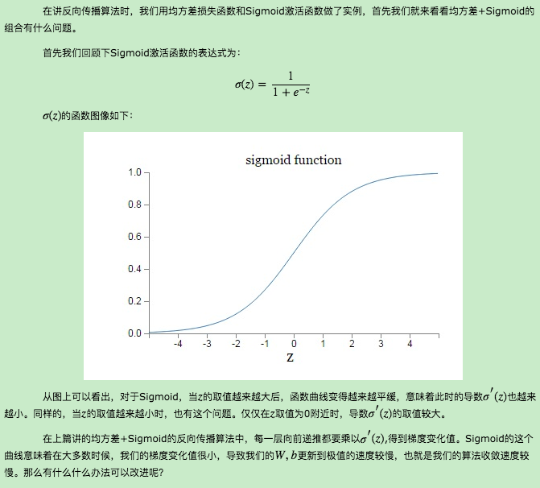
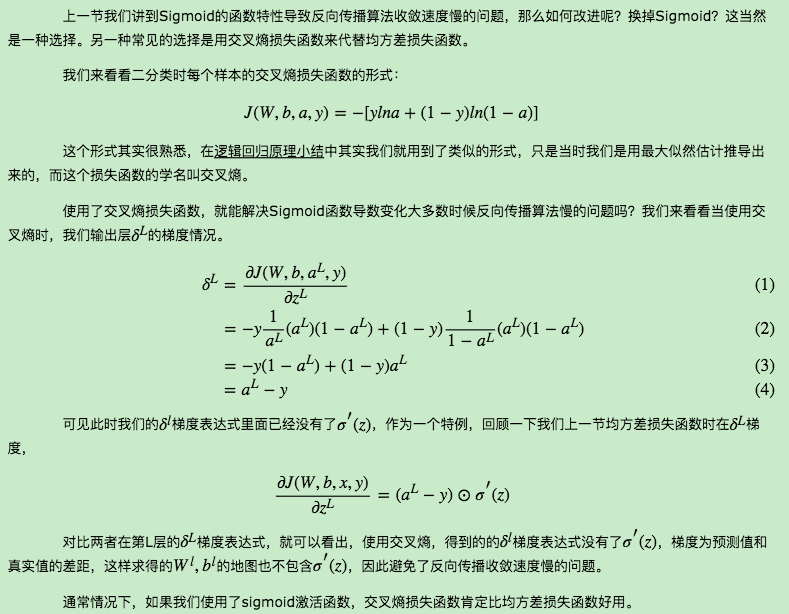
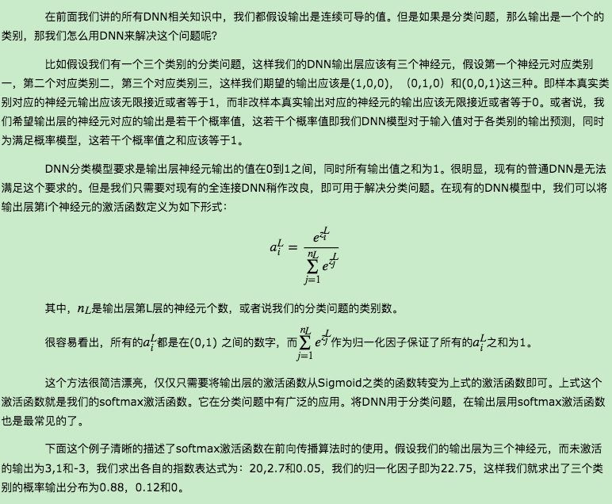
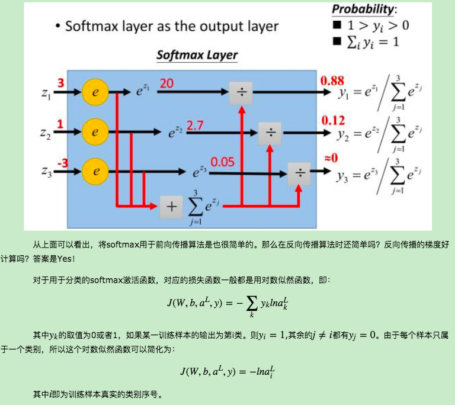
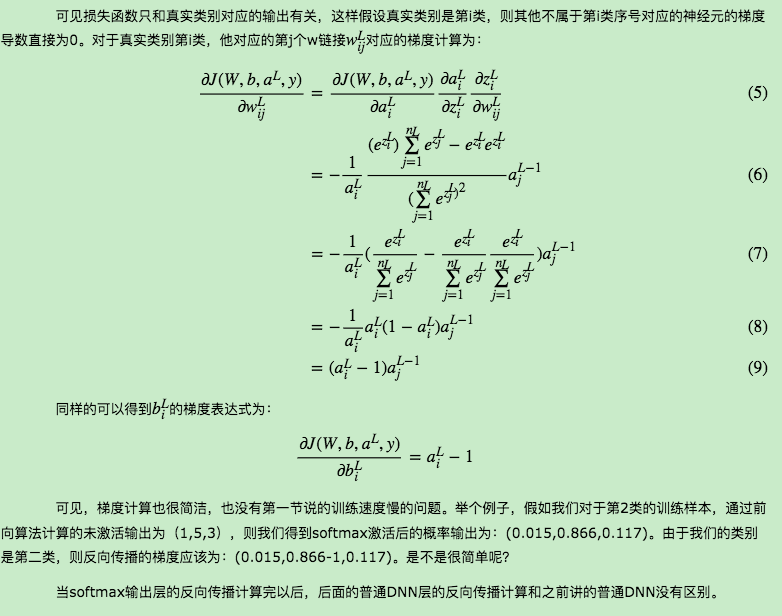
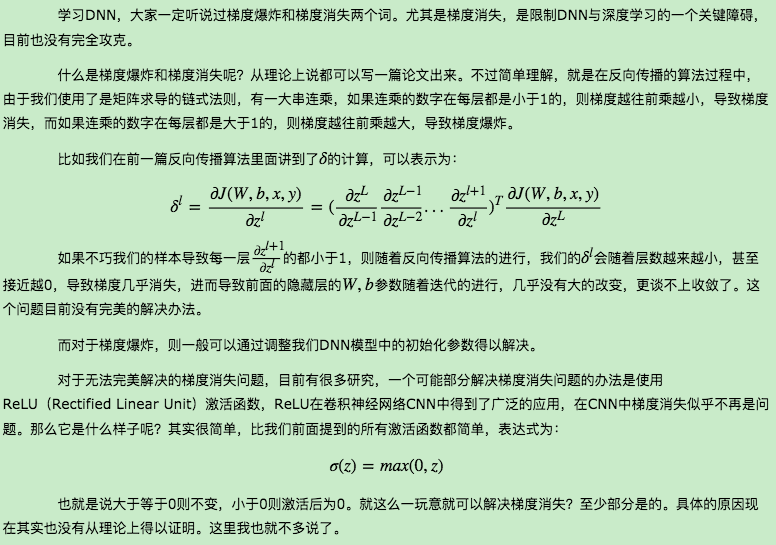
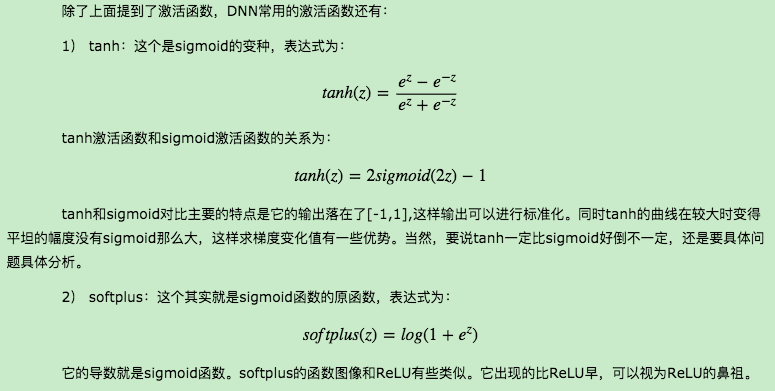
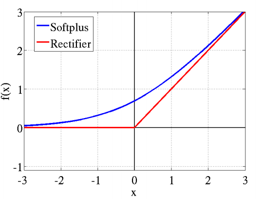
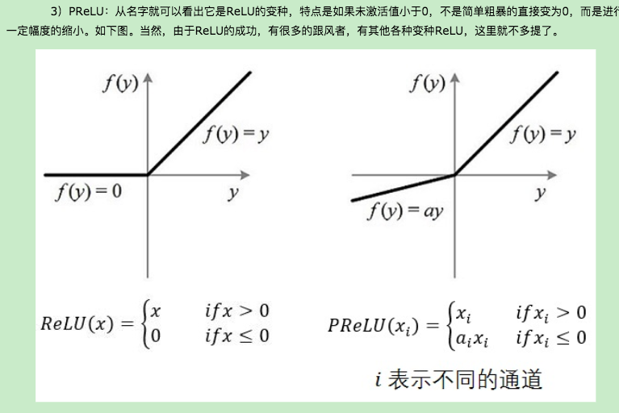

# 深度神经网络（DNN）损失函数和激活函数的选择
## 1. 均方差损失函数+Sigmoid激活函数的问题
   
## 2. 使用交叉熵损失函数+Sigmoid激活函数改进DNN算法收敛速度
   
## 3. 使用对数似然损失函数和softmax激活函数进行DNN分类输出
   
  
  
## 4. 梯度爆炸梯度消失与ReLU激活函数
   
## 5. DNN其他激活函数
   
   
   
## 6. DNN损失函数和激活函数小结
　　　　上面我们对DNN损失函数和激活函数做了详细的讨论，重要的点有：1）如果使用sigmoid激活函数，则交叉熵损失函数一般肯定比均方差损失函数好。2）如果是DNN用于分类，则一般在输出层使用softmax激活函数和对数似然损失函数。3）ReLU激活函数对梯度消失问题有一定程度的解决，尤其是在CNN模型中。

## Reference 
[1] https://www.cnblogs.com/pinard/p/6437495.html

