# 激活函数
在这个文章中，我们将会了解几种不同的激活函数，同时也会了解到哪个激活函数优于其他的激活函数，以及各个激活函数的优缺点。
## 零、简介
### 1. 什么是激活函数？
生物神经网络是人工神经网络的起源。然而，人工神经网络（ANNs）的工作机制与大脑的工作机制并不是十分的相似。不过在我们了解为什么把激活函数应用在人工神经网络中之前，了解一下激活函数与生物神经网络的关联依然是十分有用的。一个典型神经元的物理结构由细胞体、向其他神经元发送信息的轴突以及从其他神经元接受信号或信息的树突组成。   
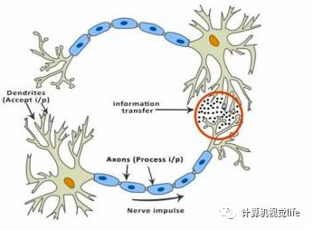   
*图一  生物神经网络*    
图一中，红色的圆圈表示两个神经元连接的区域。神经元通过树突从其他神经元中接受信号。树突的信号强度称为突触权值，用于与传入信号相乘。树突传出的信号在细胞体中累积，如果最后的信号强度超过了某个阈值，神经元就会允许轴突中的信息继续传递。否则，信号就会被阻止而得不到进一步的传播。激活函数决定了信号是否能够被通过。这个例子仅仅是个只有阈值这一个参数的简单的阶跃函数。现在，当我们学习了一些新东西（或者忘掉一些东西）时，阈值以及一些神经元的突触权重会发生改变。这在神经元中创造了新的连接从而使得大脑能学习到新的东西。让我们在人工神经元的基础上来再次理解相同的概念.

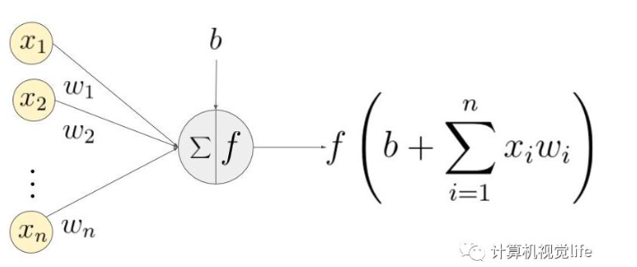   
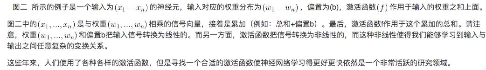   
### 2. 网络是怎么学习的？
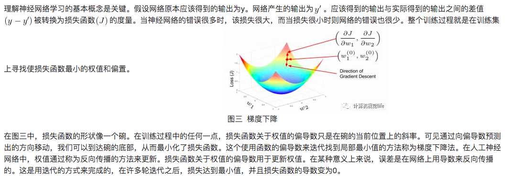
### 3.在一个人工神经网络中，我们为什么需要非线性激活函数？
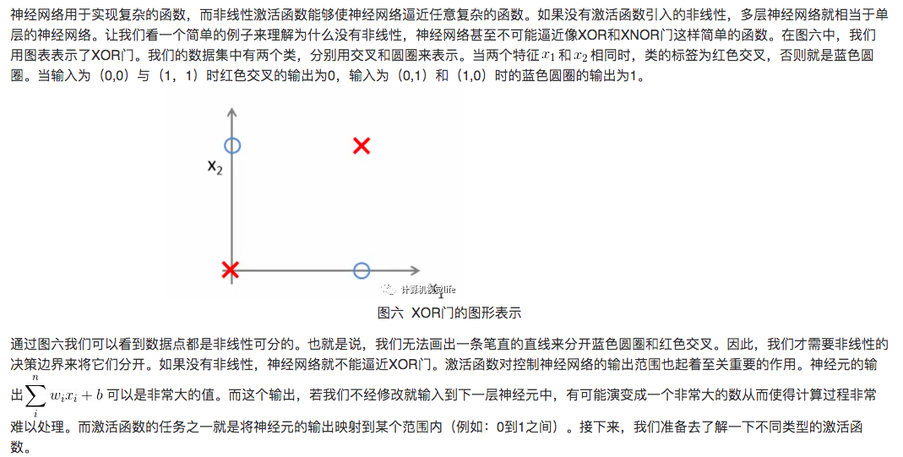   
## 一、线性激活函数
形式为的简单的线性函数。基本上，输入不经过任何修正就传递给输出。   
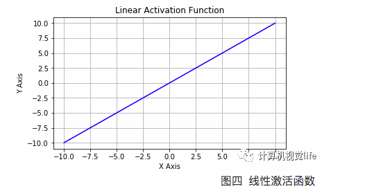   
## 二 、非线性激活函数
这些函数用于分离非线性可分的数据，并且是最常使用的激活函数。一个非线性等式决定了从输入到输出的映射。不同类型的非线性激活函数分别有sigmod, tanh, relu, lrelu, prelu, swish等等。本文接下来会详细的讨论这些激活函数。
### 1、Sigmoid激活函数
Sigmoid也被称为逻辑激活函数(Logistic Activation Function)。它将一个实数值压缩到0至1的范围内。当我们的最终目标是预测概率时，它可以被应用到输出层。它使很大的负数向0转变，很大的正数向1转变。在数学上表示为

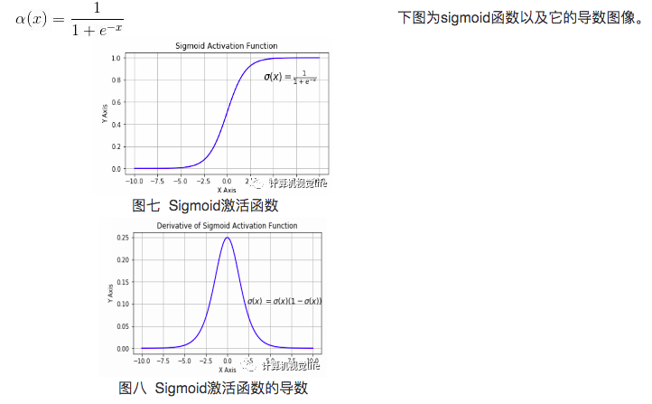   
* 梯度消失   
sigmoid函数在0和1附近是平坦的。也就是说，sigmoid的梯度在0和1附近为0。在通过sigmoid函数网络反向传播时，当神经元的输出近似于0和1时它的梯度接近于0。这些神经元被称为饱和神经元。因此，这些神经元的权值无法更新。不仅如此，与这些神经元相连接的神经元的权值也更新得非常缓慢。这个问题也被称为梯度消失。所以，想象如果有一个大型网络包含有许多处于饱和动态的sigmoid激活函数的神经元，那么网络将会无法进行反向传播。
* 不是零均值   
sigmoid的输出不是零均值的。
* 计算量太大   
指数函数与其它非线性激活函数相比计算量太大了。下一个要讨论的是解决了sigmoid中零均值问题的非线性激活函数。
### 2、Tanh激活函数
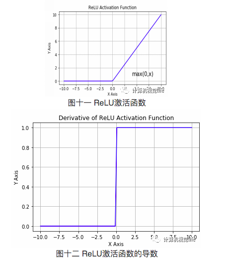   
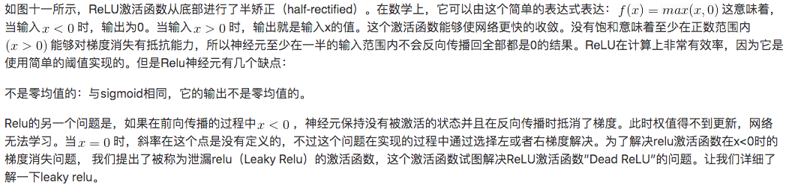   
### 3、泄漏ReLU激活函数(leaky relu)
  
### 4、参数ReLU激活函数(Parametric ReLU)
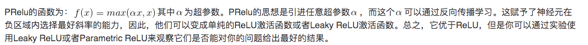   
### 5、SWISH激活函数
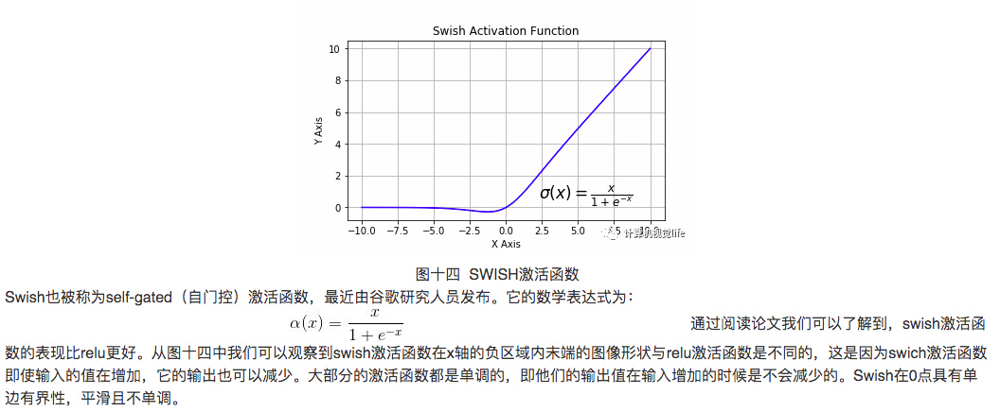   

### Reference
[1] https://tianchi.aliyun.com/forum/postDetail?postId=77585   
[2] https://en.wikipedia.org/wiki/Activation_function
