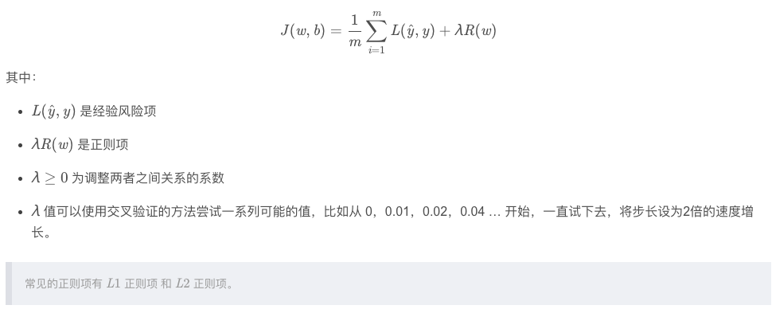
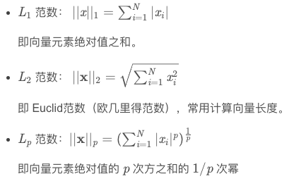
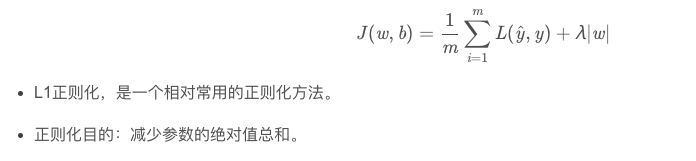
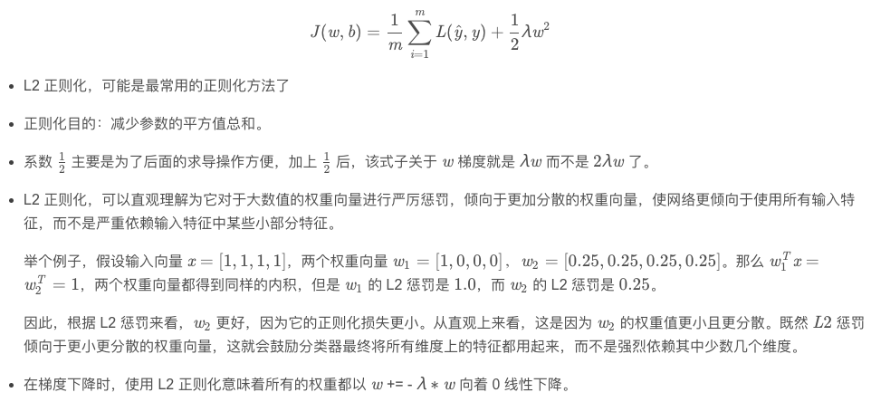
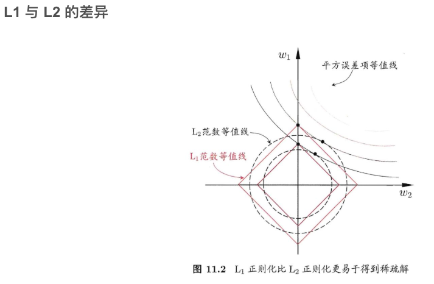
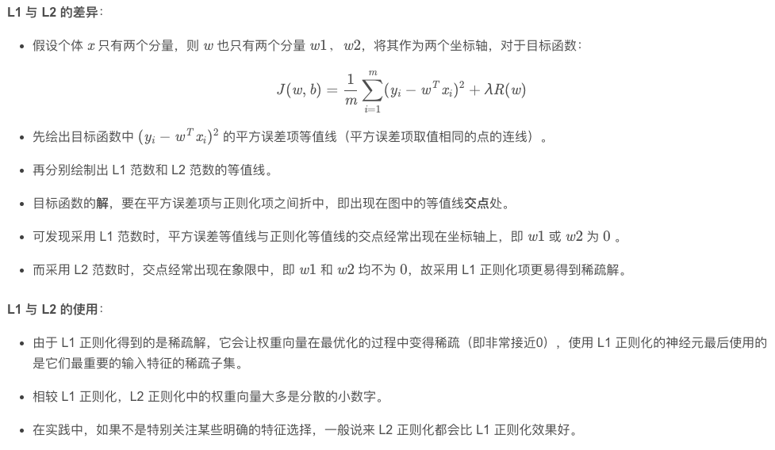
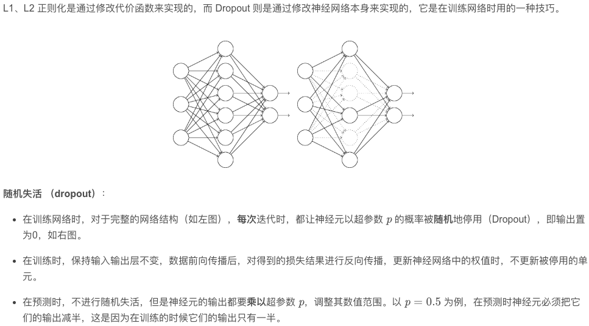
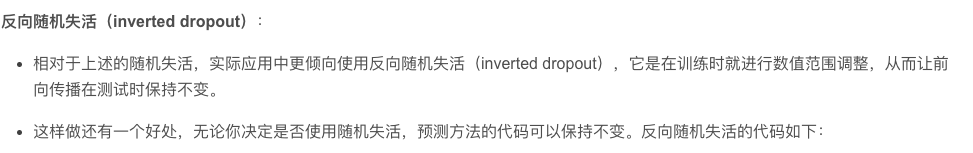
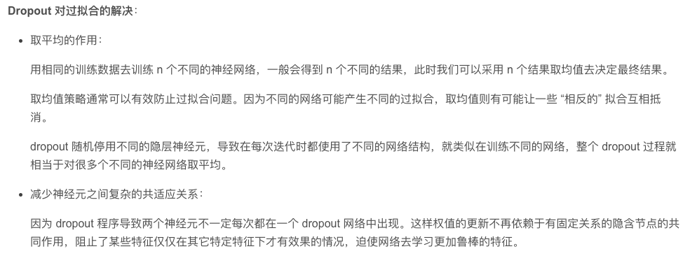

# 正则化
## 一、简介
### 1、什么是正则，为什么要正则

正则化是一种预防过拟合的方法，我们需要在损失里面加入正则项来作为惩罚，**限制模型的学习能力**。   

正则化技术是保证算法泛化能力的有效工具。  

机器学习深度学习中的正则化（regularization）可以理解为模型的复杂度。我们希望学习到复杂度小一些的模型，加入正则可以降低模型的复杂度。L1正则L2正则也是加入参数和的绝对值或者参数平方的和。这里有一个假设，这些参数的值越小，通常对应于约光滑的函数，也就是更加简单的函数，因此就不容易发生过拟合现象。在cost函数中加入正则项，为了减小cost，就得相应的减少正则项，也就是尽量得到较小的参数。
### 2、常用正则方法
此处所说的正则是表示，减少过拟合的所有方法。   
* (1)数据增强（Data Augmentation）    
数据增强是常用的方法，特别是当你的训练样布不够多时，通过翻转、随机裁剪等方法可以得到近似但又不一样的数据用于训练。   
* (2)预先停止（Early Stopping）   
预先停止是指当你的模型在训练集和验证集上表现差异很大的时候，及时停止训练。   
* (3)模型集合（Model Ensembles）  
通过训练多个模型，最后取平均预测输出的方法，通常能提升一些指标。但训练多个模型的代价就是花费的时间会很多。
* (4)归一化输入（Normalize Input）  
也是重要的一种方法，最简单的就是所有像素点的值除以255使所有像素点的值在[0,1]的区间中。在视觉任务中也会经常见到减去图像集的均值和除以方差，这样数据的均值和方差就为0，这个过程能够让模型更快的拟合。
* (5)权重初始化   
若选择了不合适的初始化参数，你很有可能会遇到梯度消失/爆炸（Vanishing / Exploding gradients）的问题。因此我们需要更合理的权重初始化方法。通常会选择ReLU+带方差的初始化。实际中比较常用的两种是"He Initialization / Xavier Initialization"。   
* (6)添加正则化项   
最基本的正则化方法，是在代价函数中添加惩罚项，对复杂度高的模型进行“惩罚”。正则化一般具有如下形式：    
   
* (7)范数 norm   
   
* (8) L1 正则 Lasso regularizer   
   
* (9) L2 正则 Ridge Regularizer / Weight Decay   
   
   
   
* (10) Dropout   
   
   
   

## Reference   
[1] https://blog.csdn.net/lk3030/article/details/84963331   
[2] 