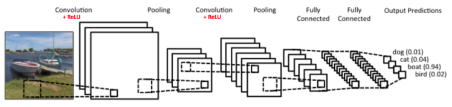
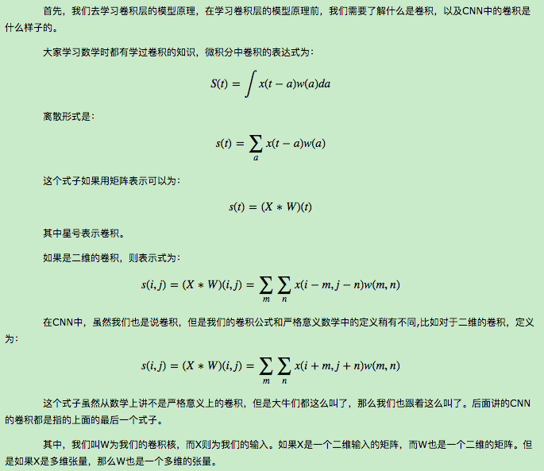
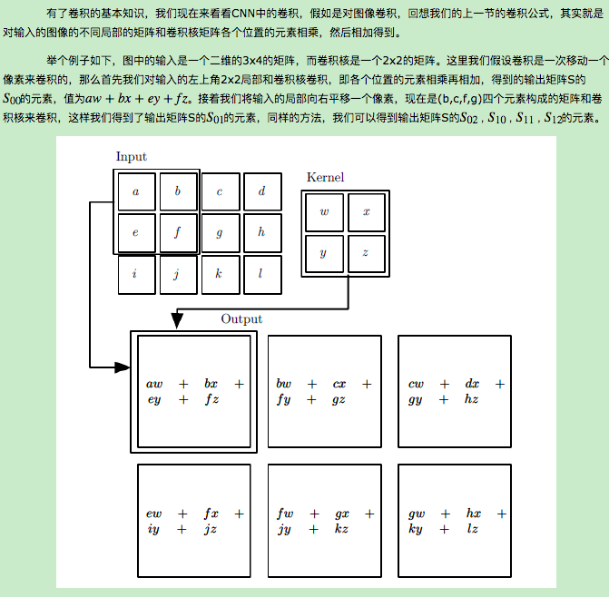
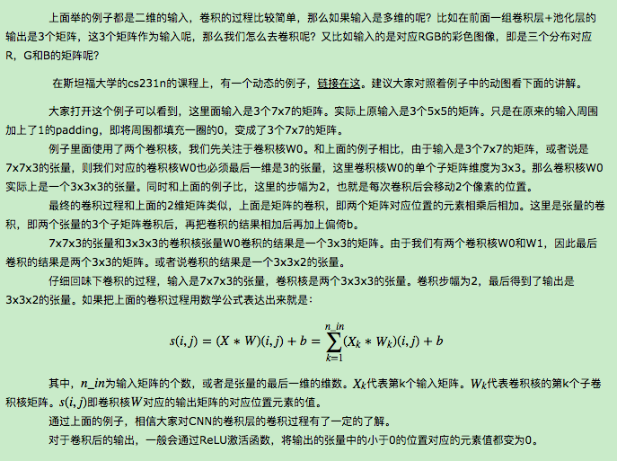
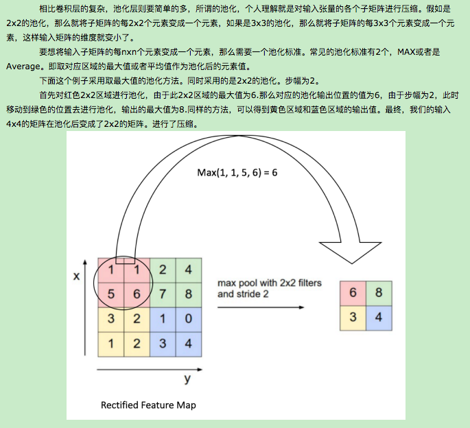

# 卷积神经网络(CNN)模型结构
在前面我们讲述了DNN的模型与前向反向传播算法。而在DNN大类中，卷积神经网络(Convolutional Neural Networks，以下简称CNN)是最为成功的DNN特例之一。CNN广泛的应用于图像识别，当然现在也应用于NLP等其他领域，本文我们就对CNN的模型结构做一个总结。

## 1. CNN的基本结构
　　　　首先我们来看看CNN的基本结构。一个常见的CNN例子如下图：
   
图中是一个图形识别的CNN模型。可以看出最左边的船的图像就是我们的输入层，计算机理解为输入若干个矩阵，这点和DNN基本相同。

　　　　接着是卷积层（Convolution Layer）,这个是CNN特有的，我们后面专门来讲。卷积层的激活函数使用的是ReLU。我们在DNN中介绍过ReLU的激活函数，它其实很简单，就是ReLU(x)=max(0,x)。在卷积层后面是池化层(Pooling layer)，这个也是CNN特有的，我们后面也会专门来讲。需要注意的是，池化层没有激活函数。

　　　　卷积层+池化层的组合可以在隐藏层出现很多次，上图中出现两次。而实际上这个次数是根据模型的需要而来的。当然我们也可以灵活使用使用卷积层+卷积层，或者卷积层+卷积层+池化层的组合，这些在构建模型的时候没有限制。但是最常见的CNN都是若干卷积层+池化层的组合，如上图中的CNN结构。

　　　　在若干卷积层+池化层后面是全连接层（Fully Connected Layer, 简称FC），全连接层其实就是我们前面讲的DNN结构，只是输出层使用了Softmax激活函数来做图像识别的分类，这点我们在DNN中也有讲述。

　　　　从上面CNN的模型描述可以看出，CNN相对于DNN，比较特殊的是卷积层和池化层，如果我们熟悉DNN，只要把卷积层和池化层的原理搞清楚了，那么搞清楚CNN就容易很多了。

## 2. 初识卷积
   
## 3. CNN中的卷积层
   
最终我们得到卷积输出的矩阵为一个2x3的矩阵S。

　　　　再举一个动态的卷积过程的例子如下：

　　　　我们有下面这个绿色的5x5输入矩阵，卷积核是一个下面这个黄色的3x3的矩阵。卷积的步幅是一个像素。则卷积的过程如下面的动图。卷积的结果是一个3x3的矩阵。

   
   
## 4. CNN中的池化层
   
## 5. CNN模型结构小结
　　　　理解了CNN模型中的卷积层和池化层，就基本理解了CNN的基本原理，后面再去理解CNN模型的前向传播算法和反向传播算法就容易了。下一篇我们就来讨论CNN模型的前向传播算法。

## Reference
[1] https://www.cnblogs.com/pinard/p/6483207.html
