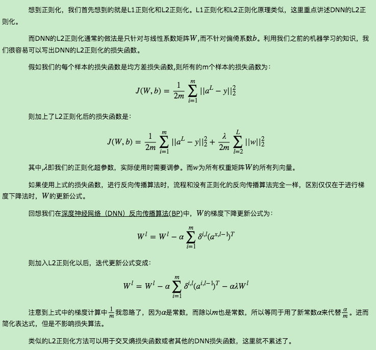
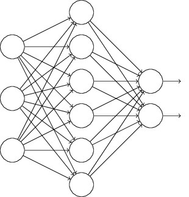
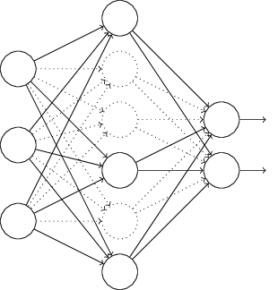
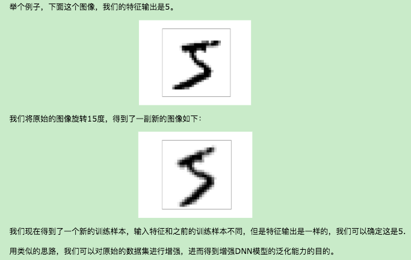

# 深度神经网络（DNN）的正则化
　　和普通的机器学习算法一样，DNN也会遇到过拟合的问题，需要考虑泛化，这里我们就对DNN的正则化方法做一个总结。

## 1. DNN的L1&L2正则化
   
## 2. DNN通过集成学习的思路正则化
　　　　除了常见的L1&L2正则化，DNN还可以通过集成学习的思路正则化。在集成学习原理小结中，我们讲到集成学习有Boosting和Bagging两种思路。而DNN可以用Bagging的思路来正则化。常用的机器学习Bagging算法中，随机森林是最流行的。它 通过随机采样构建若干个相互独立的弱决策树学习器，最后采用加权平均法或者投票法决定集成的输出。在DNN中，我们一样使用Bagging的思路。不过和随机森林不同的是，我们这里不是若干个决策树，而是若干个DNN的网络。

　　　　首先我们要对原始的m个训练样本进行有放回随机采样，构建N组m个样本的数据集，然后分别用这N组数据集去训练我们的DNN。即采用我们的前向传播算法和反向传播算法得到N个DNN模型的W,b参数组合，最后对N个DNN模型的输出用加权平均法或者投票法决定最终输出。

　　　　不过用集成学习Bagging的方法有一个问题，就是我们的DNN模型本来就比较复杂，参数很多。现在又变成了N个DNN模型，这样参数又增加了N倍，从而导致训练这样的网络要花更加多的时间和空间。因此一般N的个数不能太多，比如5-10个就可以了。
## 3. DNN通过dropout 正则化
　　　　这里我们再讲一种和Bagging类似但是又不同的正则化方法：Dropout。

　　　　所谓的Dropout指的是在用前向传播算法和反向传播算法训练DNN模型时，一批数据迭代时，随机的从全连接DNN网络中去掉一部分隐藏层的神经元。

　　　　比如我们本来的DNN模型对应的结构是这样的：

   
　在对训练集中的一批数据进行训练时，我们随机去掉一部分隐藏层的神经元，并用去掉隐藏层的神经元的网络来拟合我们的一批训练数据。如下图，去掉了一半的隐藏层神经元：

   
然后用这个去掉隐藏层的神经元的网络来进行一轮迭代，更新所有的W,b。这就是所谓的dropout。

　　　　当然，dropout并不意味着这些神经元永远的消失了。在下一批数据迭代前，我们会把DNN模型恢复成最初的全连接模型，然后再用随机的方法去掉部分隐藏层的神经元，接着去迭代更新W,b。当然，这次用随机的方法去掉部分隐藏层后的残缺DNN网络和上次的残缺DNN网络并不相同。

　　　　总结下dropout的方法： 每轮梯度下降迭代时，它需要将训练数据分成若干批，然后分批进行迭代，每批数据迭代时，需要将原始的DNN模型随机去掉部分隐藏层的神经元，用残缺的DNN模型来迭代更新W,b。每批数据迭代更新完毕后，要将残缺的DNN模型恢复成原始的DNN模型。

　　　　从上面的描述可以看出dropout和Bagging的正则化思路还是很不相同的。dropout模型中的W,b是一套，共享的。所有的残缺DNN迭代时，更新的是同一组W,b；而Bagging正则化时每个DNN模型有自己独有的一套W,b参数，相互之间是独立的。当然他们每次使用基于原始数据集得到的分批的数据集来训练模型，这点是类似的。

　　　　使用基于dropout的正则化比基于bagging的正则化简单，这显而易见，当然天下没有免费的午餐，由于dropout会将原始数据分批迭代，因此原始数据集最好较大，否则模型可能会欠拟合。   
## 4. DNN通过增强数据集正则化
　　　　增强模型泛化能力最好的办法是有更多更多的训练数据，但是在实际应用中，更多的训练数据往往很难得到。有时候我们不得不去自己想办法能无中生有，来增加训练数据集，进而得到让模型泛化能力更强的目的。

　　　　对于我们传统的机器学习分类回归方法，增强数据集还是很难的。你无中生有出一组特征输入，却很难知道对应的特征输出是什么。但是对于DNN擅长的领域，比如图像识别，语音识别等则是有办法的。以图像识别领域为例，对于原始的数据集中的图像，我们可以将原始图像稍微的平移或者旋转一点点，则得到了一个新的图像。虽然这是一个新的图像，即样本的特征是新的，但是我们知道对应的特征输出和之前未平移旋转的图像是一样的。

   
## 5. 其他DNN正则化方法
　　　　DNN的正则化的方法是很多的，还是持续的研究中。在Deep Learning这本书中，正则化是洋洋洒洒的一大章。里面提到的其他正则化方法有：Noise Robustness， Adversarial Training，Early Stopping等。如果大家对这些正则化方法感兴趣，可以去阅读Deep Learning这本书中的第七章。

## Reference
[1] https://www.cnblogs.com/pinard/p/6472666.html
  
