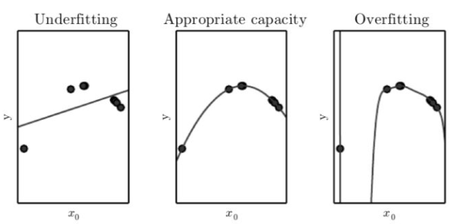
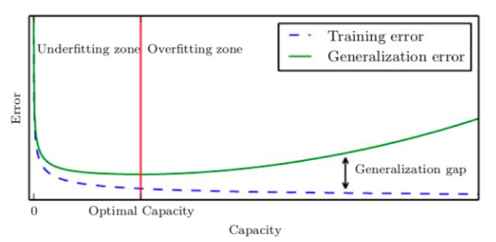
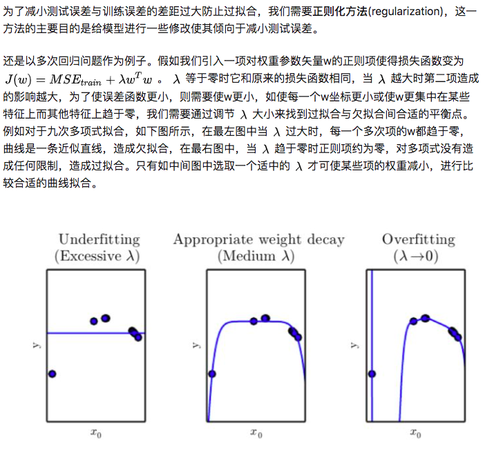
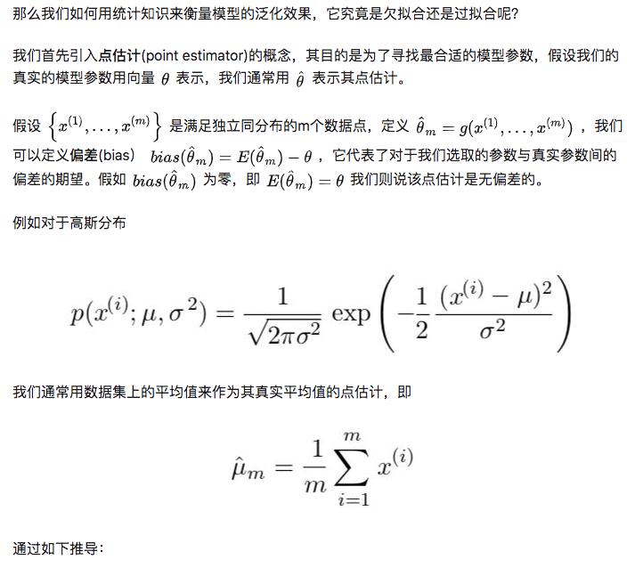
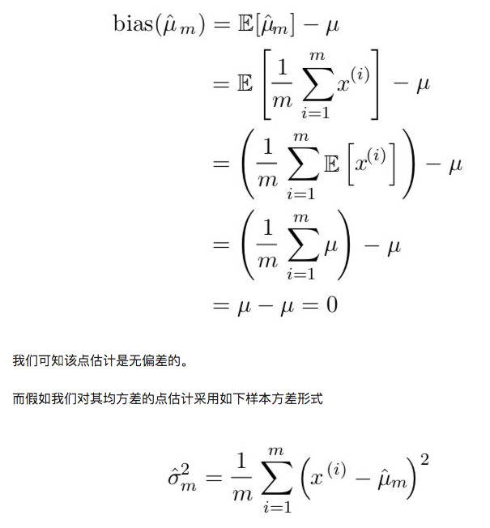
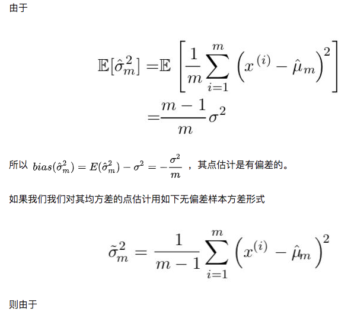
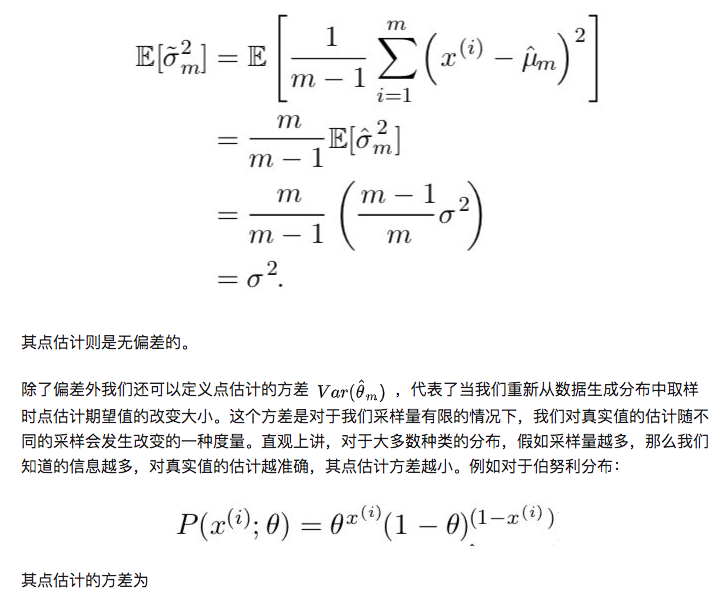
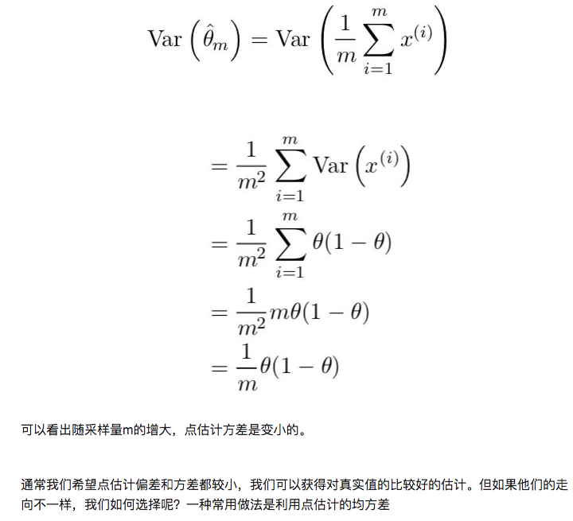
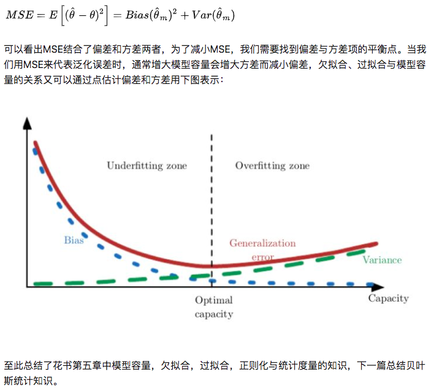

# 拟合问题
## 1、模型容量，欠拟合，过拟合
训练机器学习模型的目的不仅仅是可以描述已有的数据，而且是对未知的新数据也可以做出较好的推测，这种推广到新数据的能力称作泛化(generalization)。我们称在训练集上的误差为训练误差(training error)，而在新的数据上的误差的期望称为泛化误差(generalization error)或测试误差(test error)。通常我们用测试集上的数据对模型进行测试，将其结果近似为泛化误差。

为什么我们只观测了训练集却可以影响测试集上的效果呢？如果他们是完全随机的无关的分布我们是无法做出这样的推测的，我们通常需要做出对于训练集和测试集的采样过程的假设。训练集和测试集是由某种数据生成分布产生的，通常我们假设其满足独立同分布(independent and identically distributed, 简称i.i.d)，即每个数据是相互独立的，而训练集和测试集是又从同一个概率分布中取样出来的。

假设参数固定，那么我们的训练误差和测试误差就应相同。但是实际上，在机器学习模型中，我们的参数不是事先固定的，而是我们通过采样训练集选取了一个仅优化训练集的参数，然后再对测试集采样，所以测试误差常常会大于训练误差。

我们的机器学习模型因此有**两个主要目的**：
* 尽量减小训练误差。
* 尽量减小训练误差和测试误差间的间距。 

这两点对应着机器学习模型的两个挑战：欠拟合(underfitting)和过拟合(overfitting)。欠拟合就是指模型的训练误差过大，过拟合就是指训练误差和测试误差间距过大。

* 过拟合：  
更多的数据、正则化、更浅的网络；

* 欠拟合：  
更深更复杂的网络、训练更长的时间、不同的优化函数。

模型是欠拟合还是过拟合是由模型的容量(capacity)决定的。低容量由于对训练集描述不足造成欠拟合，高容量由于记忆过多训练集信息而不一定对于测试集适用导致过拟合。比如对于线性回归，它仅适合数据都在一条直线附近的情形，容量较小，为提高容量，我们可以引入多次项，比如二次项，可以描述二次曲线，容量较一次多项式要高。对如下图的数据点，一次式容量偏小造成欠拟合，二次式容量适中拟合较好，而九次式容量偏大造成过拟合。    
   

训练误差，测试误差和模型容量的关系可以由下图表示，在容量较小时我们处在欠拟合区，训练误差和测试误差均较大，随着容量增大，训练误差会逐渐减小，但测试误差与训练误差的间距也会逐渐加大，当模型容量超过最适容量后，测试误差不降反增，进入过拟合区：   
   

## 2、正则化方法
   
## 3、超参数与验证集
初学者可能对参数与超参数(hyperparameter)的区别不是很清晰。用多次项拟合例子来说，参数就是指其中每项的权重w的值，合适的w是通过机器学习得到的，而超参数是我们选取用几次多项式来描述，也可以看做模型容量超参数，另外还有正则项系数lamda取什么值，这些通常是人为设定的。有些超参数是无法用训练集习得的，例如模型容量超参数，如果仅对训练集来说总会选取更大的模型容量，使得训练误差减小，但会造成过拟合，同样的，对于正则项，仅对训练集学习会使得正则项为零而使训练误差更小，也造成过拟合。

为了解决这个问题，我们需要一个区别于训练集的验证集(validation set)。我们可以将训练集分成两部分，一部分对于固定的超参数得到合适的参数w，而另一部分作为验证集来测试该模型的泛化误差，然后对超参数进行适宜的调整。简单概括就是训练集是为了选取合适的参数，而验证集是为了选取合适的超参数。
## 4、衡量模型泛化的统计工具
   
   
   
   
   
   
### Reference
[1] https://zhuanlan.zhihu.com/p/39035752   

