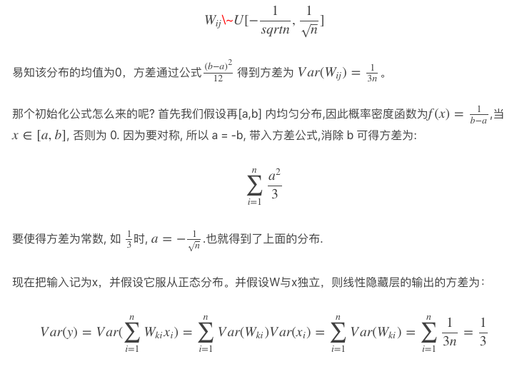
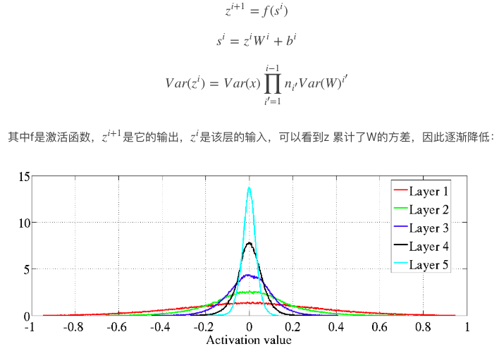
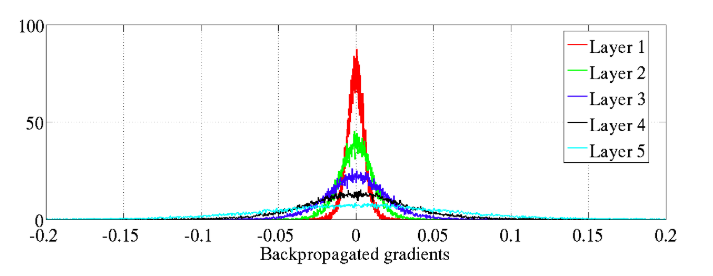
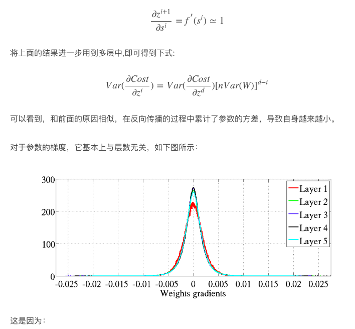
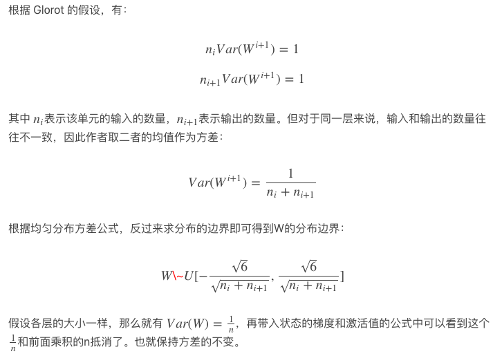
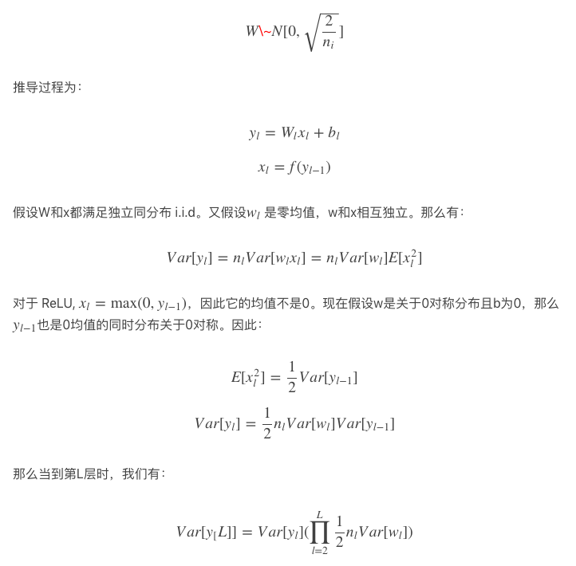
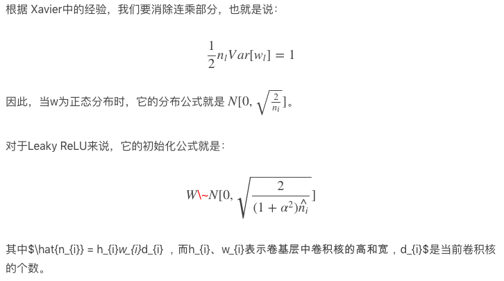

# 权重初始化
## 一、概览
那么为什么会有这么多初始化策略呢？深度学习算法的训练通常是迭代的，因此要求使用者给一些开始迭代的初始点，而有些深度模型会受到初始点的影响，使得算法遭遇数值困难，并完全失败。此外初始点可以决定学习收敛的多快，以及是否收敛到一个代价高或低的点，更何况代价相近的点也可能有极大的泛化差别。**不同的网络结构和激活函数需要适配不同的初始化方法**。目前常用的初始化方法包含随机均匀初始化、正态分布初始化、Xavier初始化、He初始化、预训练等。

一个好的初始化方法要求各层激活值不会出现饱和现象,同时各层得激活值不为0.    
## 二、随机初始化
随机初始化包含均匀随机初始化和正态随机初始化，在 tensorflow 中对应的代码为：

* 均匀随机  
tf.initializers.random_uniform(-0.1, 0.1)   
* 正态分布  
tf.initializaers.random_normal(0, 1)，均值为0，方差为1的正态分布。    
* 正态分布带截断   
tf.initializers.truncated_normal(0, 1)，生成均值为0，方差为1的正态分布，若产生随机数落到2σ外，则重新生成。


下面以均匀分布为例说明随机初始化的缺点。

均匀损及初始化即在一定范围内随机进行初始化,首先权重矩阵初始化公式为：   
   

因此标准初始化的隐层均值为0，方差为常量，和网络的层数无关，这意味着对于 sigmoid 来说，自变量落在有梯度的范围内。但是对于下一层来说情况就发生了变化，这是因为下一层的输入的均值经过sigmoid后不是0了，方差自然也跟着变了，好的性质没有了。输入输出的分布也不一致。

以 tanh做激活函数的神经网络为例，查看激活值状态、参数梯度的各层分布[xavier的论文](http://proceedings.mlr.press/v9/glorot10a/glorot10a.pdf)：

首先看激活值标准化以后的分布，如下图所示，激活值的方差是逐层递减的。这是因为
   
对于反向传播状态的梯度的方差是逐层增加的，换句话说是在反向传播过程中逐层递减的。如下图所示：   
   
因为：
```
% <![CDATA[
\begin{aligned}
\frac{\partial cost}{\partial z^{i}} & = \frac{\partial cost}{\partial s^{i+1}}\dot\frac{\partial s^{i+1}}{\partial z^{i+1}}\dot\frac{\partial z^{i+1}}{\partial s^{i}}
& = \frac{\partial cost}{\partial s^{i+1}}\dot w^{i+1}\dot \frac{\partial z^{i+1}}{\partial s^{i}}
\end{aligned} %]]>
```
   
```
% <![CDATA[
\begin{aligned}
\frac{\partial cost}{\partial w^{i}} &= \frac{\partial cost}{\partial s^{i}}\dot \frac{\partial s^{i}}{\partial w^{i}}
& = \frac{\partial cost}{\partial s^{i}}\dot z^{i}
\end{aligned} %]]>
```
   
## 三、Xavier 初始化
Xavier 作者 Glorot 认为，优秀的初始化应该使得各层的激活值和状态梯度的方差在传播过程中保持一致。   
为什么会是这样？根据论文[Batch Normalization: Accelerating Deep Network Training by Reducing Internal Covariate Shift](https://arxiv.org/abs/1502.03167)，它虽然是探讨BN的，但个人感觉很相近。论文里说，由于前一层的参数更新，所以这一层的输入（前一层的输出）的分布会发生变化，这种现象被称之为ICS。同样，这篇文章的观点认为BN work的真正原因，在与其将数据的分布都归一化到均值为0，方差为1的分布上去。因此，每一层的输入（上一层输出经过BN后）分布的稳定性都提高了，故而整体减小了网络的ICS。那么对于 Xavier 的情况也很类似，它保持在训练过程中各层的激活值和状态梯度的方差不变，也相当于减小了网络的ICS。

根据 Glorot 的假设，有：   
   
## 四、He 初始化
He 初始化的基本思想是，当使用Relu 作为激活函数时， Xavier 的效果不好，这是因为对于 Relu，在训练过程中会有一部分神经元处于关闭状态，导致分布变了。因此作者做出了改进   
   
  

### Reference
[1] http://pelhans.com/2019/04/12/deepdive_tensorflow-note4/   
