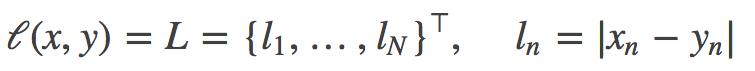
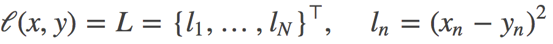

# 损失函数
我们所说的优化，即优化网络权值使得损失函数值变小。但是，损失函数值变小是否能代表模型的分类/回归精度变高呢？那么多种损失函数，应该如何选择呢？请来了解PyTorch中给出的十七种损失函数吧。

请运行配套代码，代码中有详细解释，有手动计算，这些都有助于理解损失函数原理。
本小节配套代码： [/Code/3_optimizer/3_1_lossFunction](https://github.com/fusimeng/PyTorch_Tutorial)
## 1、L1loss
class torch.nn.L1Loss(size_average=None, reduce=None)   

官方文档中仍有reduction='elementwise_mean’参数，但代码实现中已经删除该参数  

功能：
计算output和target之差的绝对值，可选返回同维度的tensor或者是一个标量。   

计算公式：
  

参数：   
reduce(bool)- 返回值是否为标量，默认为True   
size_average(bool)- 当reduce=True时有效。为True时，返回的loss为平均值；为False时，返回的各样本的loss之和。

实例：
[/Code/3_optimizer/3_1_lossFunction/1_L1Loss.py](https://github.com/fusimeng/PyTorch_Tutorial/blob/master/Code/3_optimizer/3_1_lossFunction/1_L1Loss.py)    

## 2、MSELoss
class torch.nn.MSELoss(size_average=None, reduce=None, reduction=‘elementwise_mean’)  

官方文档中仍有reduction='elementwise_mean’参数，但代码实现中已经删除该参数  

功能：
计算output和target之差的平方，可选返回同维度的tensor或者是一个标量。  

计算公式：
   

参数：
reduce(bool)- 返回值是否为标量，默认为True   
size_average(bool)- 当reduce=True时有效。为True时，返回的loss为平均值；为False时，返回的各样本的loss之和。

实例：
[/Code/3_optimizer/3_1_lossFunction/2_MSELoss.py](https://github.com/fusimeng/PyTorch_Tutorial/blob/master/Code/3_optimizer/3_1_lossFunction/2_MSELoss.py)   

## 3、CrossEntropyLoss
class torch.nn.CrossEntropyLoss(weight=None, size_average=None, ignore_index=-100, reduce=None, reduction=‘elementwise_mean’)  

功能：
将输入经过softmax激活函数之后，再计算其与target的交叉熵损失。即该方法将nn.LogSoftmax()和 nn.NLLLoss()进行了结合。严格意义上的交叉熵损失函数应该是nn.NLLLoss()。

补充：小谈交叉熵损失函数
交叉熵损失(cross-entropy Loss) 又称为对数似然损失(Log-likelihood Loss)、对数损失；二分类时还可称之为逻辑斯谛回归损失(Logistic Loss)。交叉熵损失函数表达式为 L = - sigama(y_i * log(x_i))。pytroch这里不是严格意义上的交叉熵损失函数，而是先将input经过softmax激活函数，将向量“归一化”成概率形式，然后再与target计算严格意义上交叉熵损失。
在多分类任务中，经常采用softmax激活函数+交叉熵损失函数，因为交叉熵描述了两个概率分布的差异，然而神经网络输出的是向量，并不是概率分布的形式。所以需要softmax激活函数将一个向量进行“归一化”成概率分布的形式，再采用交叉熵损失函数计算loss。
再回顾PyTorch的CrossEntropyLoss()，官方文档中提到时将nn.LogSoftmax()和 nn.NLLLoss()进行了结合，nn.LogSoftmax() 相当于激活函数 ， nn.NLLLoss()是损失函数，将其结合，完整的是否可以叫做softmax+交叉熵损失函数呢？

计算公式：

参数：
weight(Tensor)- 为每个类别的loss设置权值，常用于类别不均衡问题。weight必须是float类型的tensor，其长度要于类别C一致，即每一个类别都要设置有weight。带weight的计算公式：

size_average(bool)- 当reduce=True时有效。为True时，返回的loss为平均值；为False时，返回的各样本的loss之和。
reduce(bool)- 返回值是否为标量，默认为True
ignore_index(int)- 忽略某一类别，不计算其loss，其loss会为0，并且，在采用size_average时，不会计算那一类的loss，除的时候的分母也不会统计那一类的样本。
实例：
/Code/3_optimizer/3_1_lossFunction/3_CroosEntropyLoss.py
补充：
output不仅可以是向量，还可以是图片，即对图像进行像素点的分类，这个例子可以从NLLLoss()中看到，这在图像分割当中很有用。
————————————————
版权声明：本文为CSDN博主「TensorSense」的原创文章，遵循 CC 4.0 BY-SA 版权协议，转载请附上原文出处链接及本声明。
原文链接：https://blog.csdn.net/u011995719/article/details/85107524 
————————————————
版权声明：本文为CSDN博主「TensorSense」的原创文章，遵循 CC 4.0 BY-SA 版权协议，转载请附上原文出处链接及本声明。
原文链接：https://blog.csdn.net/u011995719/article/details/85107524

---
### 参考
[1] CSDN:https://blog.csdn.net/u011995719/article/details/85107524#1L1loss_9   
[2] GitHub:https://github.com/TingsongYu/PyTorch_Tutorial    

