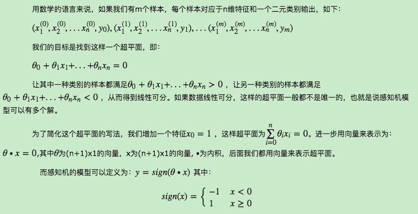
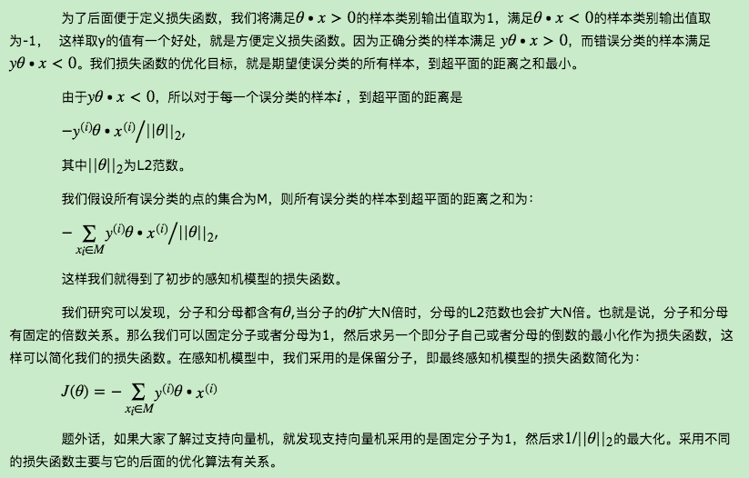
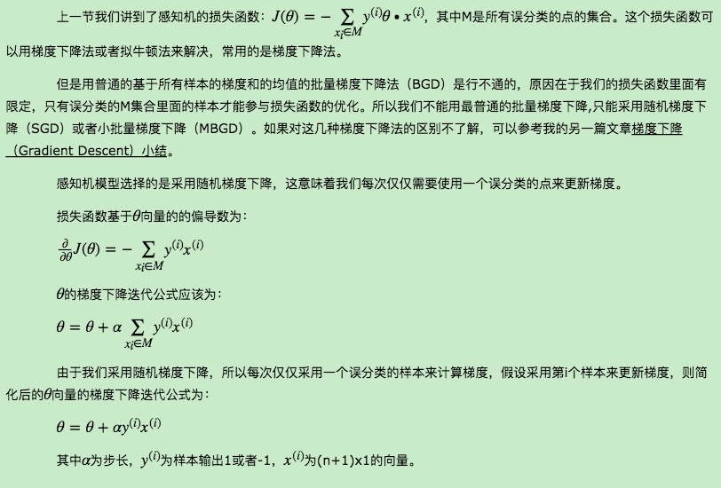
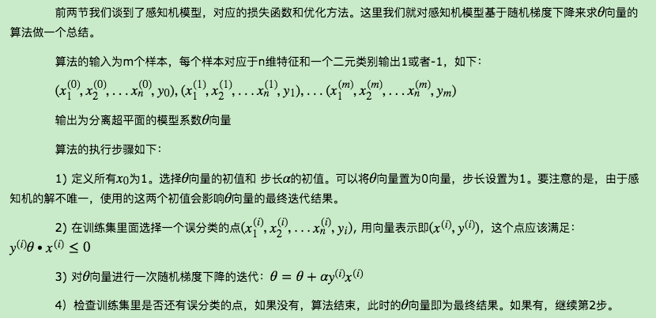
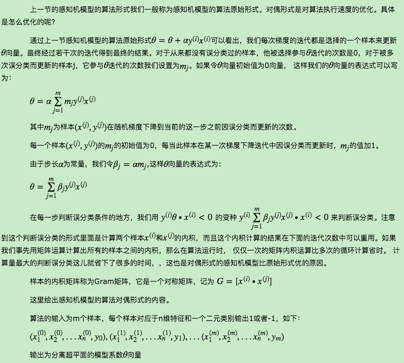
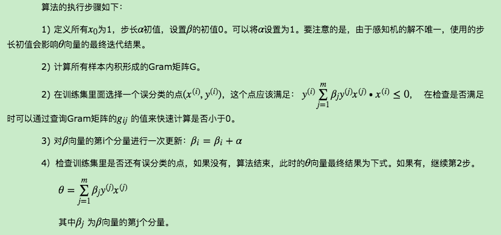

# 感知器
　　　　感知机可以说是最古老的分类方法之一了，在1957年就已经提出。今天看来它的分类模型在大多数时候泛化能力不强，但是它的原理却值得好好研究。因为研究透了感知机模型，学习支持向量机的话会降低不少难度。同时如果研究透了感知机模型，再学习神经网络，深度学习，也是一个很好的起点。这里对感知机的原理做一个小结。  
## 1. 感知机模型
　　　　感知机的思想很简单，比如我们在一个平台上有很多的男孩女孩，感知机的模型就是尝试找到一条直线，能够把所有的男孩和女孩隔离开。放到三维空间或者更高维的空间，感知机的模型就是尝试找到一个超平面，能够把所有的二元类别隔离开。当然你会问，如果我们找不到这么一条直线的话怎么办？找不到的话那就意味着类别线性不可分，也就意味着感知机模型不适合你的数据的分类。使用感知机一个最大的前提，就是数据是线性可分的。这严重限制了感知机的使用场景。它的分类竞争对手在面对不可分的情况时，比如支持向量机可以通过核技巧来让数据在高维可分，神经网络可以通过激活函数和增加隐藏层来让数据可分。
   
## 2. 感知机模型损失函数
  
## 3. 感知机模型损失函数的优化方法
   
## 4.感知机模型的算法
   
## 5.感知机模型的算法对偶形式
   
  
## 6. 小结
　　　　感知机算法是一个简单易懂的算法，自己编程实现也不太难。前面提到它是很多算法的鼻祖，比如支持向量机算法，神经网络与深度学习。因此虽然它现在已经不是一个在实践中广泛运用的算法，还是值得好好的去研究一下。感知机算法对偶形式为什么在实际运用中比原始形式快，也值得好好去体会。

## 原文
[1]  https://www.cnblogs.com/pinard/p/6042320.html   
