# 优化器
参考论文：[《An overview of gradient descent optimization algorithms∗》](../res/opt.pdf)    
    
卷积神经网络一般力求能够做到 end to end 的训练，end to end 训练也是目前深度学习的主流。训练中主要采用 Back Propagation 算法，而 BP 算法是我们早就学过的梯度下降算法的一种实现。因此，CNN 中的各种优化算法还是在梯度下降算法上面做手脚。在目前各种主流的深度学习工具中也都内置了各种常见的优化算法。然而，把优化算法封装到黑盒中直接使用不利于对于问题的理解和更准确地找到好的优化方向。这篇文章的主要目的是总结和比较深度学习中各种常用的优化算法。希望能对神经网络的优化起到一点点帮助，探究一下黑盒中的内容.

优化器的选择在深度学习训练中有着极其重要的作用，关系这训练能否快速收敛并取得较高的准确率和召回率。常用的优化器有梯度下降：GradientDescent，Momentum，自适应学习率算法：Adagrad，RMSProp，Adam


机器学习的主要任务之一就是通过训练，学习获得一组最优的参数，我们经常以成本函数来作为参数估计的函数。所以机器学习的任务也就是最小成本函数。
优化也是机器学习算法的非常重要的组成部分，基本上每一个机器学习算法都有一个优化算法

在机器学习、深度学习中使用的优化算法除了常见的梯度下降(GD)，还有BGD、SGD、MBGD、Momentum、NAG、Adagrad、Adadelta、RMSprop、Adam等几种优化器，都是什么呢，又该怎么选择呢？

在 [Sebastian Ruder](https://arxiv.org/pdf/1609.04747.pdf) 的这篇论文中给出了常用优化器的比较，今天来学习一下.   


本文将梳理：
```
每个算法的梯度更新规则和缺点
为了应对这个不足而提出的下一个算法
超参数的一般设定值
几种算法的效果比较
选择哪种算法
```

## 0.梯度下降法深入理解
以下为个人总结，如有错误之处，各位前辈请指出。

对于优化算法，优化的目标是网络模型中的参数θ（是一个集合，θ1、θ2、θ3 ......）目标函数为损失函数L = 1/N ∑ Li （每个样本损失函数的叠加求均值）。这个损失函数L变量就是θ，其中L中的参数是整个训练集，换句话说，目标函数（损失函数）是通过整个训练集来确定的，训练集全集不同，则损失函数的图像也不同。那么为何在mini-batch中如果遇到鞍点/局部最小值点就无法进行优化了呢？因为在这些点上，L对于θ的梯度为零，换句话说，对θ每个分量求偏导数，带入训练集全集，导数为零。对于SGD/MBGD而言，每次使用的损失函数只是通过这一个小批量的数据确定的，其函数图像与真实全集损失函数有所不同，所以其求解的梯度也含有一定的随机性，在鞍点或者局部最小值点的时候，震荡跳动，因为在此点处，如果是训练集全集带入即BGD，则优化会停止不动，如果是mini-batch或者SGD，每次找到的梯度都是不同的，就会发生震荡，来回跳动。

## 一、优化器算法简述
首先来看一下梯度下降最常见的三种变形 BGD，SGD，MBGD，这三种形式的区别就是取决于我们用多少数据来计算目标函数的梯度，这样的话自然就涉及到一个 trade－off，即参数更新的准确率和运行时间。   
梯度下降法是最基本的一类优化器，目前主要分为三种梯度下降法：

标准梯度下降法(GD, Gradient Descent)

随机梯度下降法(SGD, Stochastic Gradient Descent)

批量梯度下降法(BGD, Batch Gradient Descent)
### 0. GD
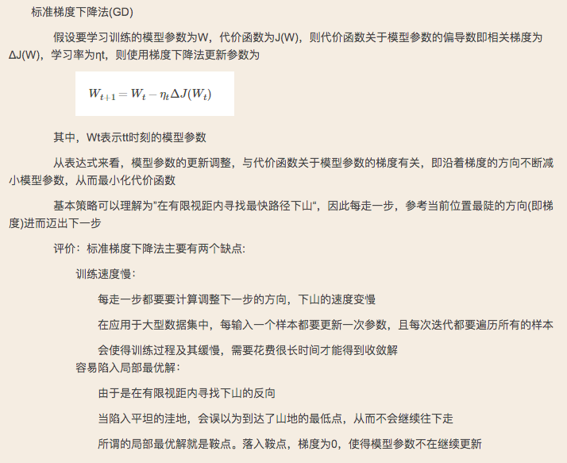      
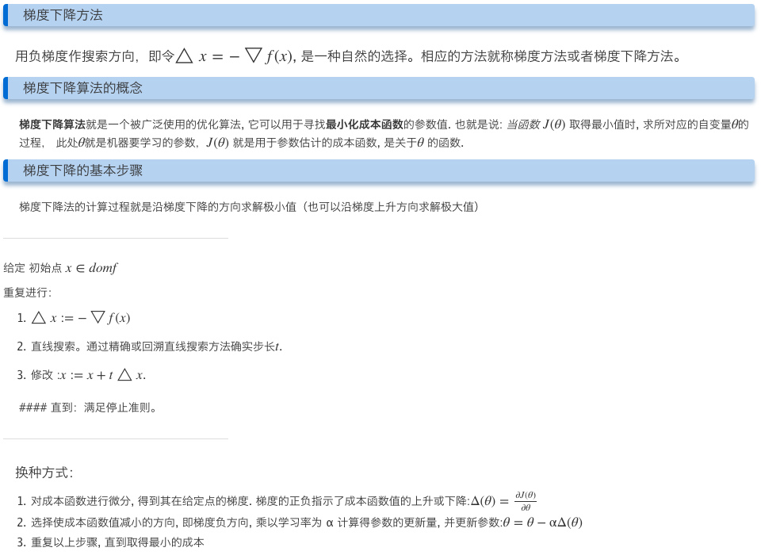   
###  1.Batch Gradient Descent （BGD）
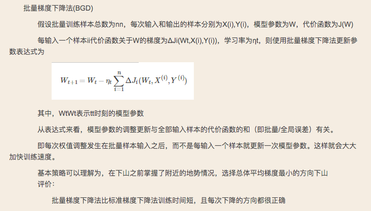 
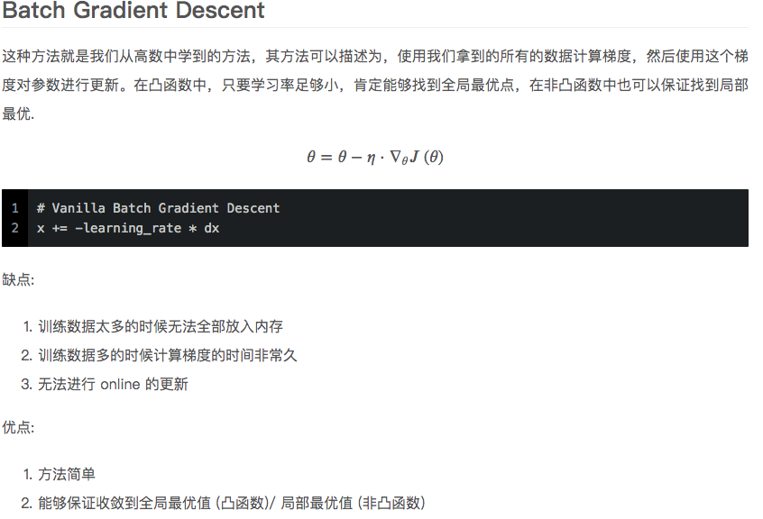   
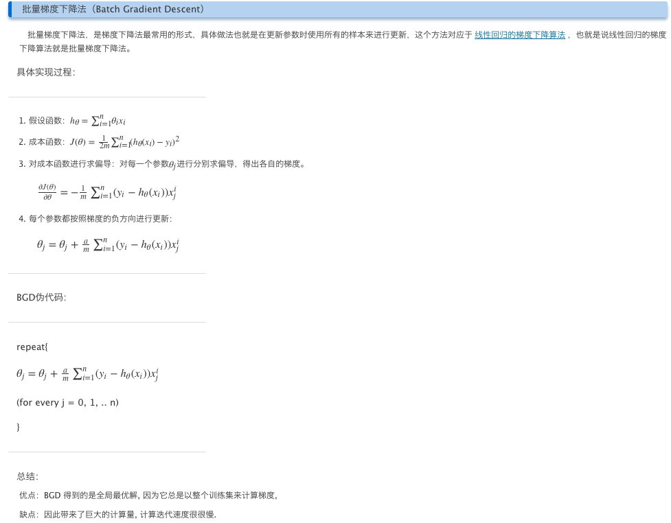   
梯度更新规则:   

BGD 采用整个训练集的数据来计算 cost function 对参数的梯度：   
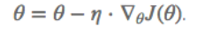   

Batch gradient descent 对于凸函数可以收敛到全局极小值，对于非凸函数可以收敛到局部极小值。   
### 2.Stochastic Gradient Descent (SGD)
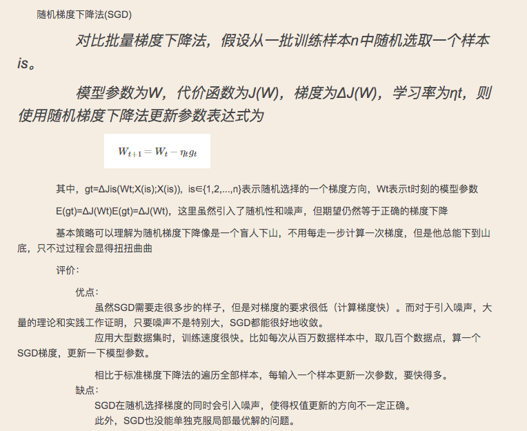   
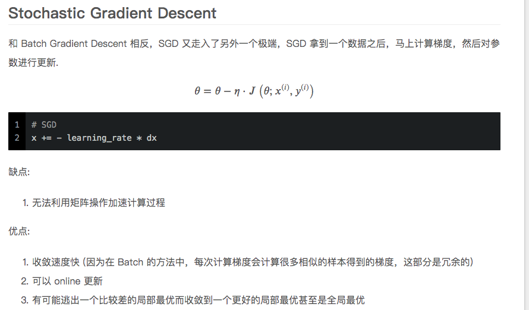   
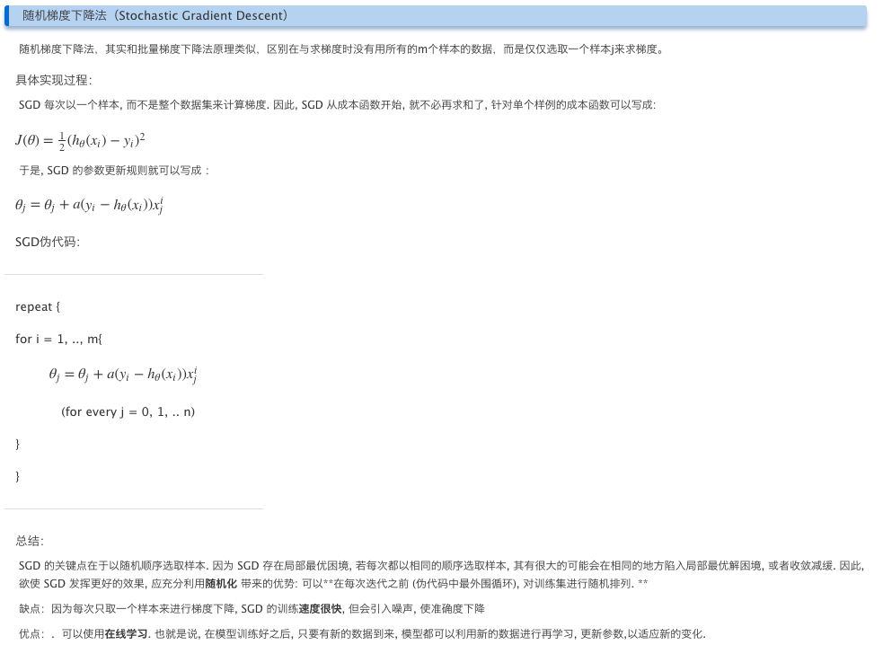   
梯度更新规则:

和 BGD 的一次用所有数据计算梯度相比，SGD 每次更新时对每个样本进行梯度更新，对于很大的数据集来说，可能会有相似的样本，这样 BGD 在计算梯度时会出现冗余，而 SGD 一次只进行一次更新，就没有冗余，而且比较快，并且可以新增样本。   
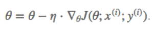   


随机梯度下降是通过每个样本来迭代更新一次，如果样本量很大的情况，那么可能只用其中部分的样本，就已经将theta迭代到最优解了，对比上面的批量梯度下降，迭代一次需要用到十几万训练样本，一次迭代不可能最优，如果迭代10次的话就需要遍历训练样本10次。缺点是SGD的噪音较BGD要多，使得SGD并不是每次迭代都向着整体最优化方向。所以虽然训练速度快，但是准确度下降，并不是全局最优。虽然包含一定的随机性，但是从期望上来看，它是等于正确的导数的。

缺点：

SGD 因为更新比较频繁，会造成 cost function 有严重的震荡。

BGD 可以收敛到局部极小值，当然 SGD 的震荡可能会跳到更好的局部极小值处。

当我们稍微减小 learning rate，SGD 和 BGD 的收敛性是一样的。

### 3.Mini-Batch Gradient Descent （MBGD）
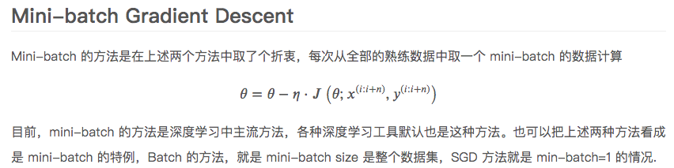   
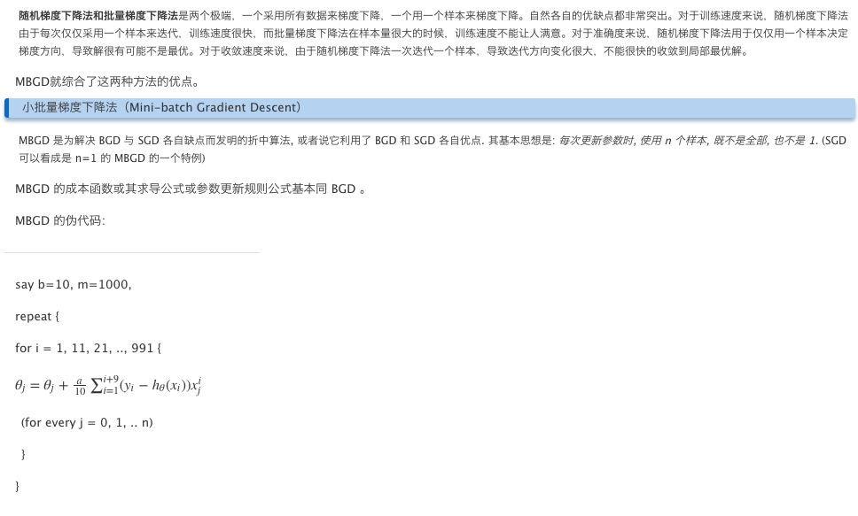   

梯度更新规则：

MBGD 每一次利用一小批样本，即 n 个样本进行计算，这样它可以降低参数更新时的方差，收敛更稳定，另一方面可以充分地利用深度学习库中高度优化的矩阵操作来进行更有效的梯度计算.   
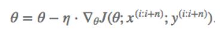   
超参数设定值:  n 一般取值在 50～256
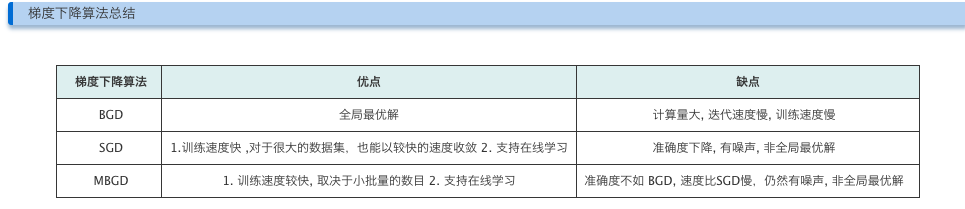
缺点：（两大缺点）

* 1.不过 Mini-batch gradient descent 不能保证很好的收敛性，learning rate 如果选择的太小，收敛速度会很慢，如果太大，loss function 就会在极小值处不停地震荡甚至偏离。（有一种措施是先设定大一点的学习率，当两次迭代之间的变化低于某个阈值后，就减小 learning rate，不过这个阈值的设定需要提前写好，这样的话就不能够适应数据集的特点。）对于非凸函数，还要避免陷于局部极小值处，或者鞍点处，因为鞍点周围的error是一样的，所有维度的梯度都接近于0，SGD 很容易被困在这里。（会在鞍点或者局部最小点震荡跳动，因为在此点处，如果是训练集全集带入即BGD，则优化会停止不动，如果是mini-batch或者SGD，每次找到的梯度都是不同的，就会发生震荡，来回跳动。）
* 2.SGD对所有参数更新时应用同样的 learning rate，如果我们的数据是稀疏的，我们更希望对出现频率低的特征进行大一点的更新。LR会随着更新的次数逐渐变小。    
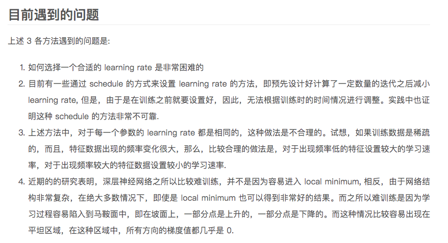

鞍点就是：一个光滑函数的鞍点邻域的曲线，曲面，或超曲面，都位于这点的切线的不同边。例如这个二维图形，像个马鞍：在x-轴方向往上曲，在y-轴方向往下曲，鞍点就是（0，0）。
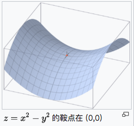    

为了应对上面的两点挑战就有了下面这些算法。   
## 二、[应对挑战 1］/动量优化法
### 4.Momentum
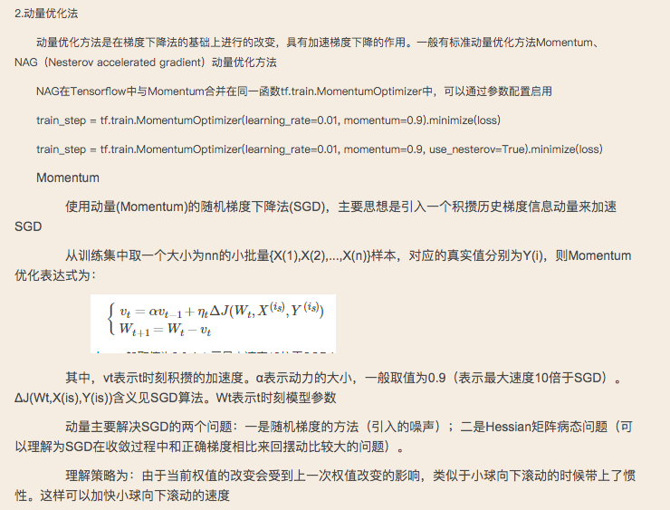   
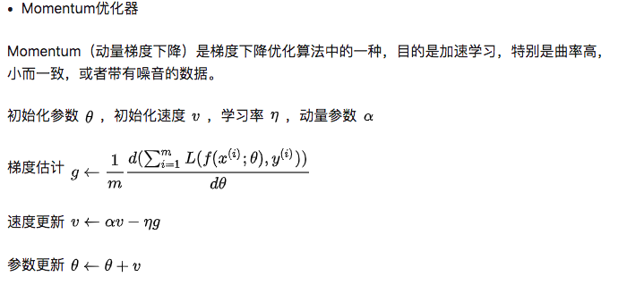   
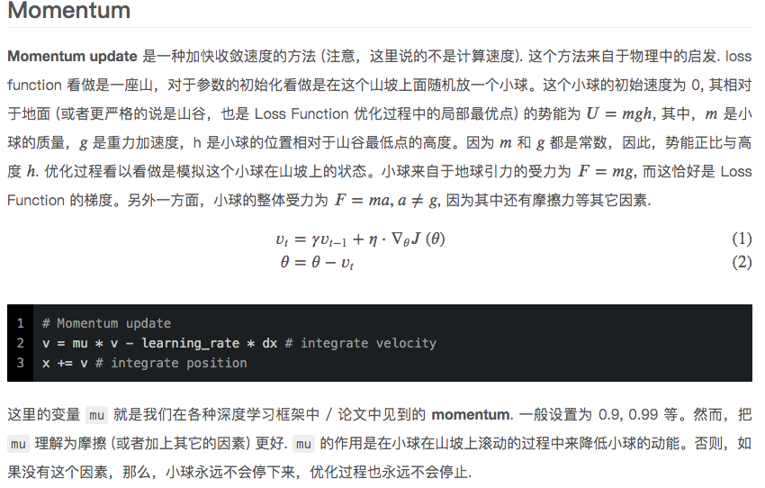   

SGD 在 ravines 的情况下容易被困住， ravines 就是曲面的一个方向比另一个方向更陡，这时 SGD 会发生震荡而迟迟不能接近极小值：    
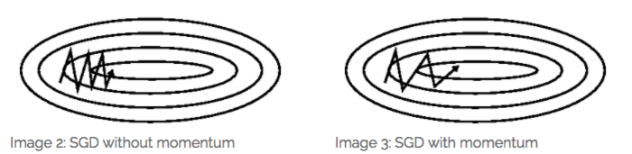   
梯度更新规则:

Momentum 通过加入 γv_t−1 ，可以加速 SGD， 并且抑制震荡   

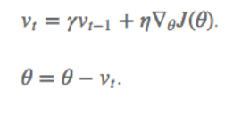   
当我们将一个小球从山上滚下来时，没有阻力的话，它的动量会越来越大，但是如果遇到了阻力，速度就会变小。
加入的这一项，可以使得梯度方向不变的维度上速度变快，梯度方向有所改变的维度上的更新速度变慢，这样就可以加快收敛并减小震荡。

超参数设定值:  一般 γ 取值 0.9 左右。

缺点：

这种情况相当于小球从山上滚下来时是在盲目地沿着坡滚，如果它能具备一些先知，例如快要上坡时，就知道需要减速了的话，适应性会更好。

### 5.Nesterov Accelerated Gradient
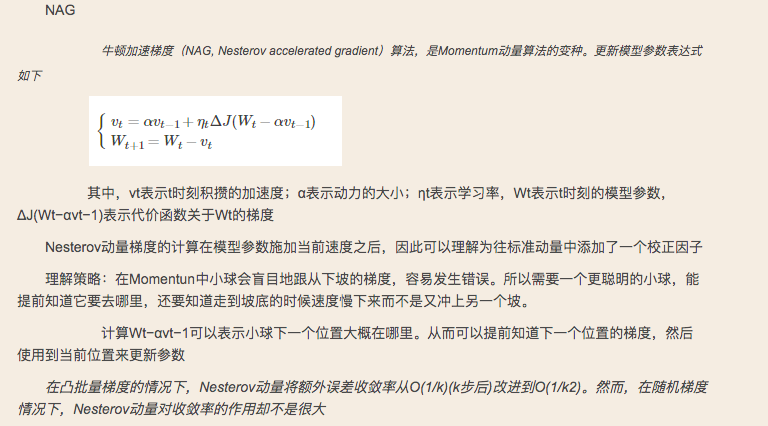   
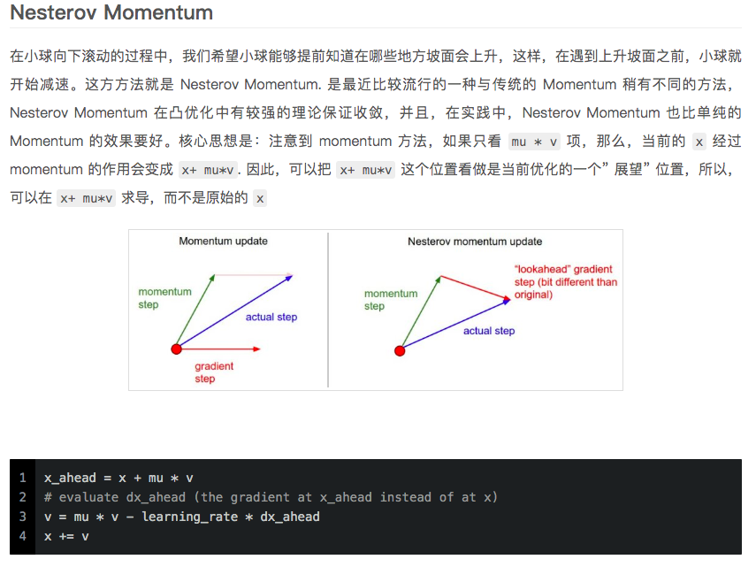   
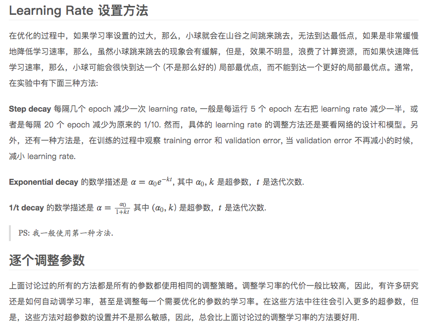   

梯度更新规则:

用 θ−γv_t−1 来近似当做参数下一步会变成的值，则在计算梯度时，不是在当前位置，而是未来的位置上    
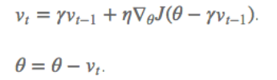   
超参数设定值:  一般 γ 仍取值 0.9 左右。

效果比较：   
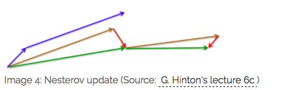    
蓝色是 Momentum 的过程，会先计算当前的梯度，然后在更新后的累积梯度后会有一个大的跳跃。
而 NAG 会先在前一步的累积梯度上(brown vector)有一个大的跳跃，然后衡量一下梯度做一下修正(red vector)，这种预期的更新可以避免我们走的太快。

NAG 可以使 RNN 在很多任务上有更好的表现。

目前为止，我们可以做到，在更新梯度时顺应 loss function 的梯度来调整速度，并且对 SGD 进行加速。

我们还希望可以根据参数的重要性而对不同的参数进行不同程度的更新。   
## 三、［应对挑战 2］/自适应学习率优化算法

### 6.Adagrad （Adaptive gradient algorithm）
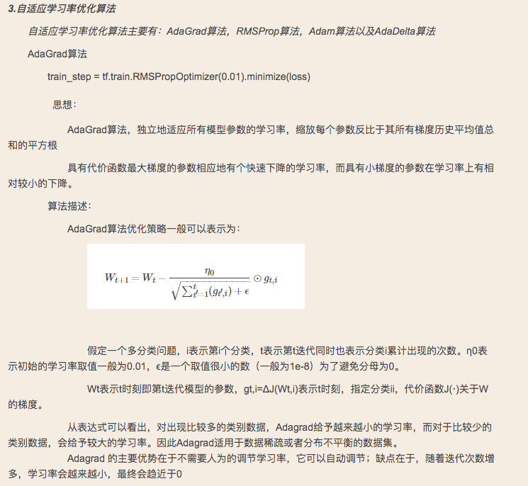   
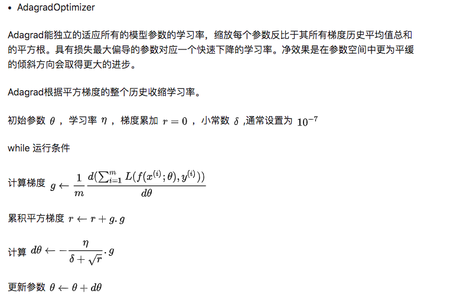   
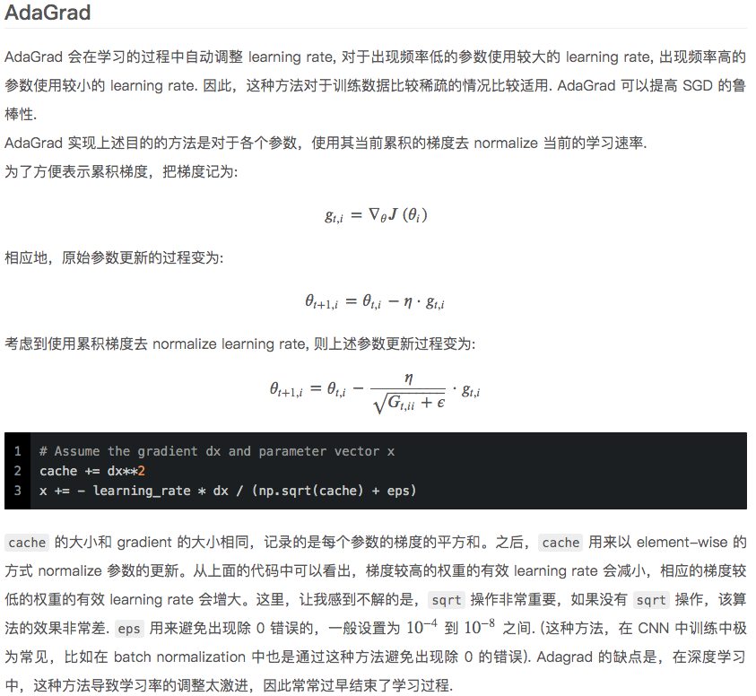   
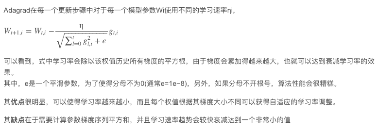   
这个算法就可以对低频的参数做较大的更新，对高频的做较小的更新，也因此，对于稀疏的数据它的表现很好，很好地提高了 SGD 的鲁棒性，例如识别 Youtube 视频里面的猫，训练 GloVe word embeddings，因为它们都是需要在低频的特征上有更大的更新。    


梯度更新规则:
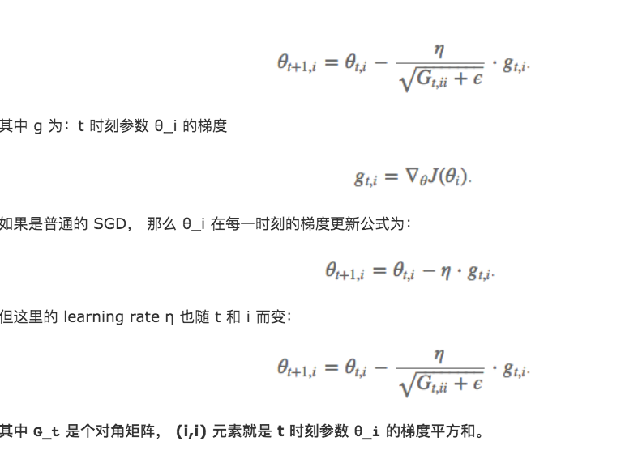   


Adagrad 的优点是减少了学习率的手动调节

超参数设定值：一般η选取0.01

缺点：

它的缺点是分母会不断积累，这样学习率就会收缩并最终会变得非常小。   
### 7.Adadelta
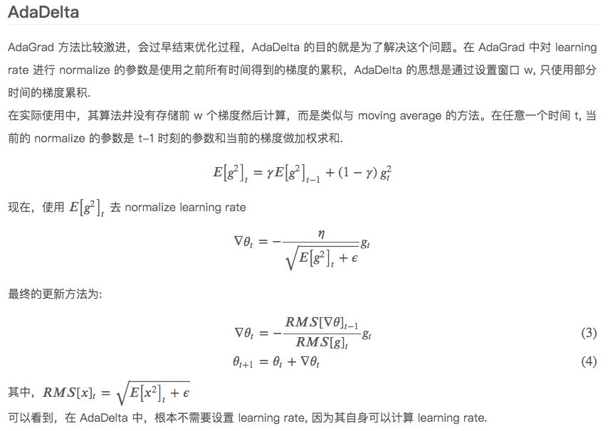   


这个算法是对 Adagrad 的改进，

和 Adagrad 相比，就是分母的 G 换成了过去的梯度平方的衰减平均值，指数衰减平均值   
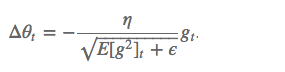   
这个分母相当于梯度的均方根 root mean squared (RMS)，在数据统计分析中，将所有值平方求和，求其均值，再开平方，就得到均方根值 ，所以可以用 RMS 简写：

   
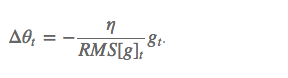   
其中 E 的计算公式如下，t 时刻的依赖于前一时刻的平均和当前的梯度：    
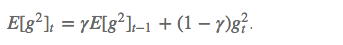   
梯度更新规则:

此外，还将学习率 η 换成了 RMS[Δθ]，这样的话，我们甚至都不需要提前设定学习率了：   
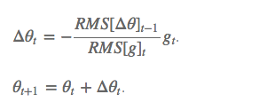   
超参数设定值:  γ 一般设定为 0.9    

### 8.7.RMSprop
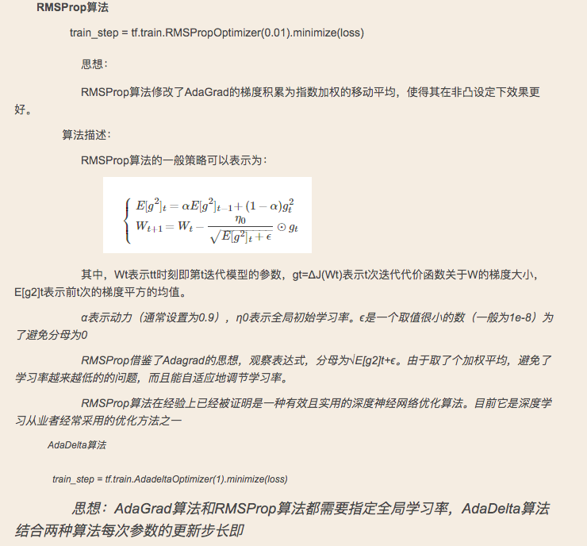  
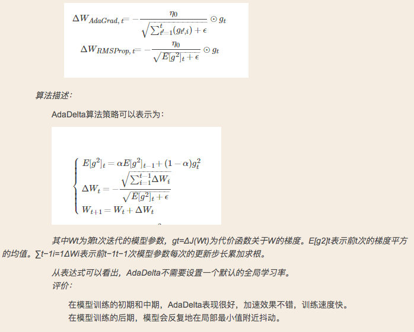  
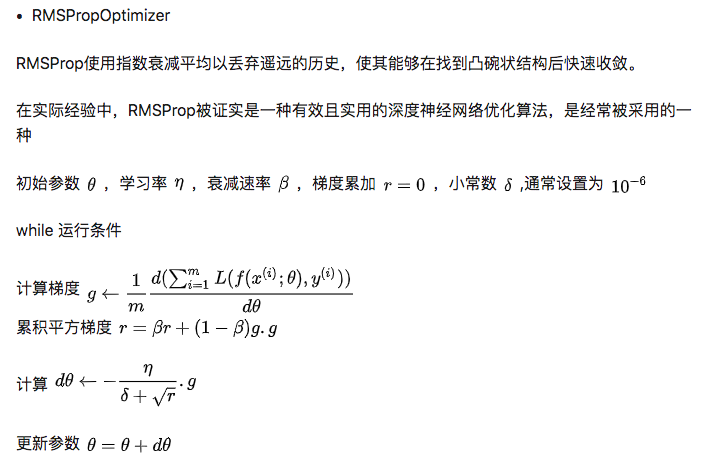   
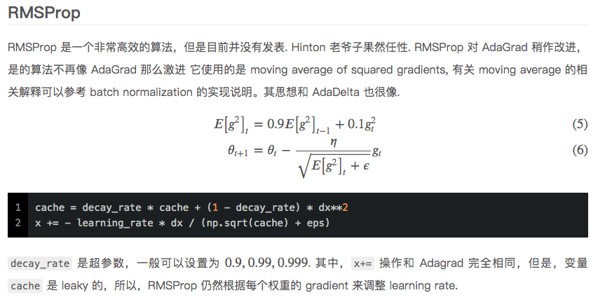   
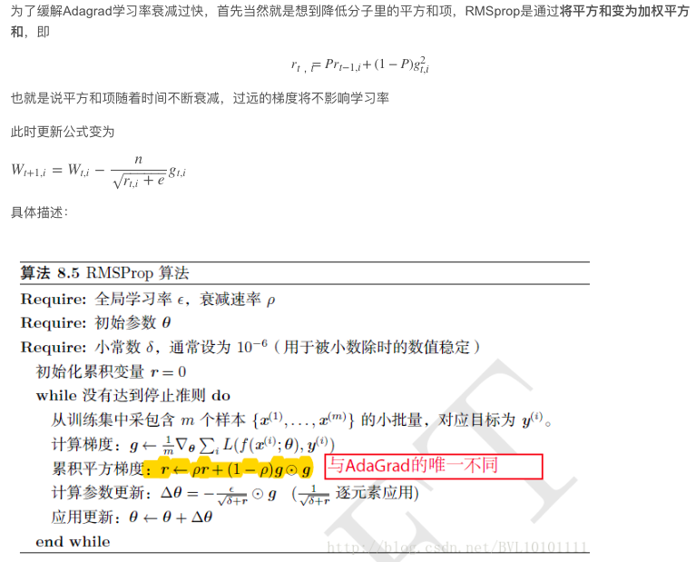   


RMSprop 是 Geoff Hinton 提出的一种自适应学习率方法。

RMSprop 和 Adadelta 都是为了解决 Adagrad 学习率急剧下降问题的，

梯度更新规则:

RMSprop 与 Adadelta 的第一种形式相同：（使用的是指数加权平均，旨在消除梯度下降中的摆动，与Momentum的效果一样，某一维度的导数比较大，则指数加权平均就大，某一维度的导数比较小，则其指数加权平均就小，这样就保证了各维度导数都在一个量级，进而减少了摆动。允许使用一个更大的学习率η）   
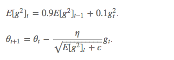   
超参数设定值:

Hinton 建议设定 γ 为 0.9, 学习率 η 为 0.001。

### 9.Adam：Adaptive Moment Estimation
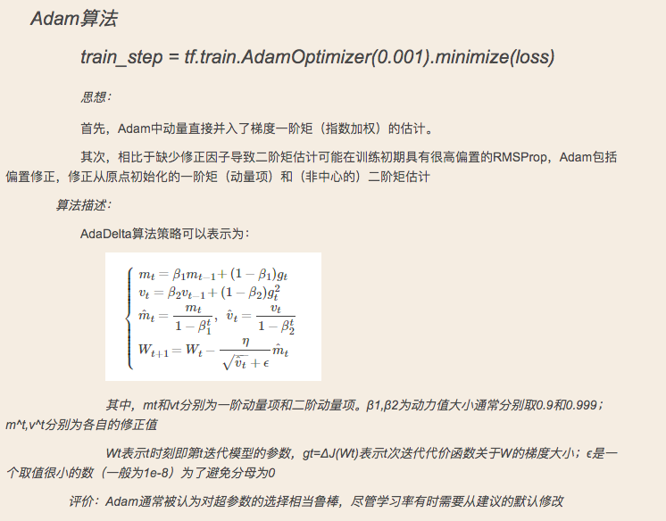  
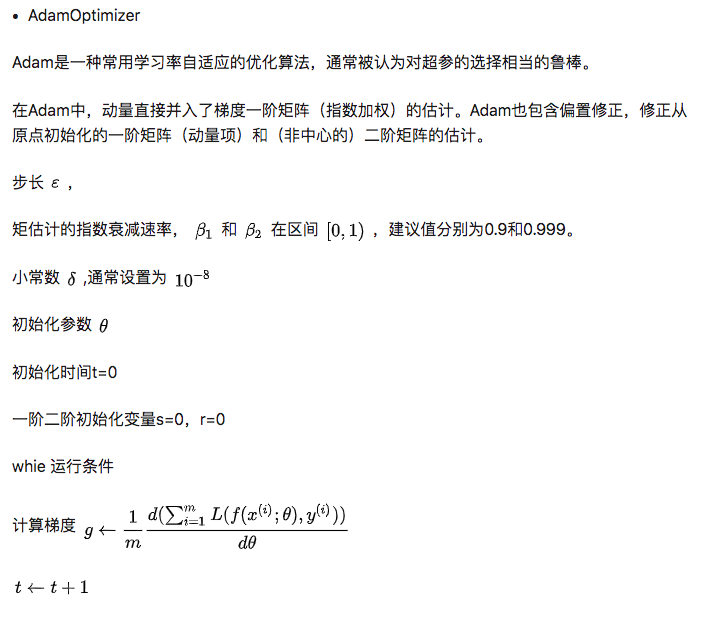   
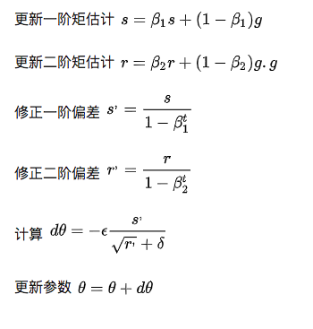   
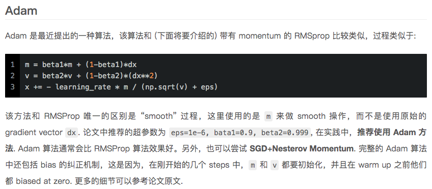
这个算法是另一种计算每个参数的自适应学习率的方法。相当于 RMSprop + Momentum

除了像 Adadelta 和 RMSprop 一样存储了过去梯度的平方 vt 的指数衰减平均值 ，也像 momentum 一样保持了过去梯度 mt 的指数衰减平均值：
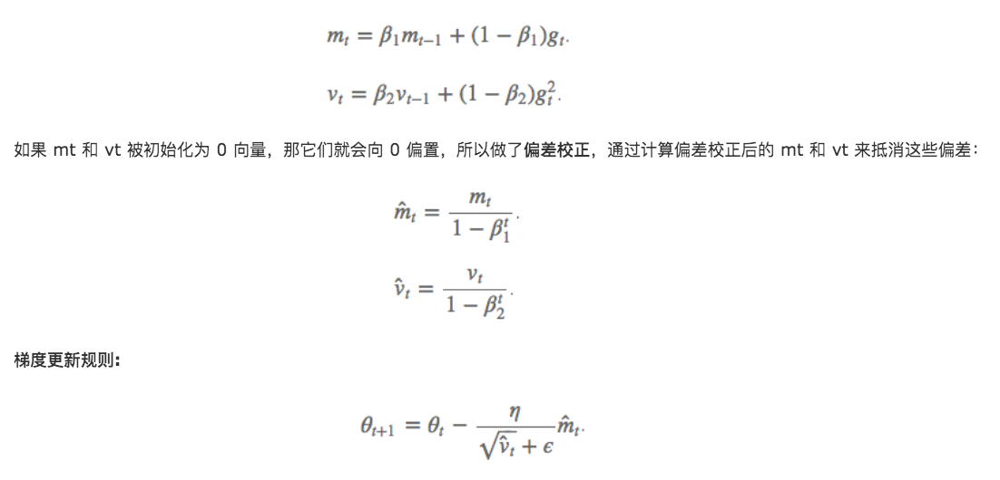   
超参数设定值:
建议 β1 ＝ 0.9，β2 ＝ 0.999，ϵ ＝ 10e−8

实践表明，Adam 比其他适应性学习方法效果要好。
## 四、效果比较
下面看一下几种算法在鞍点和等高线上的表现：
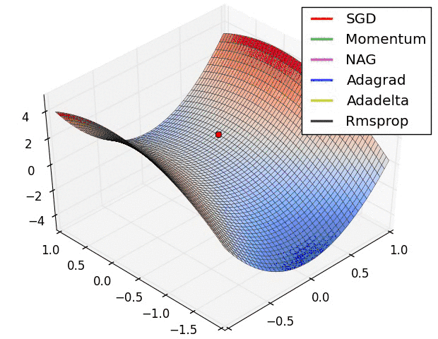  
**SGD optimization on saddle point**    
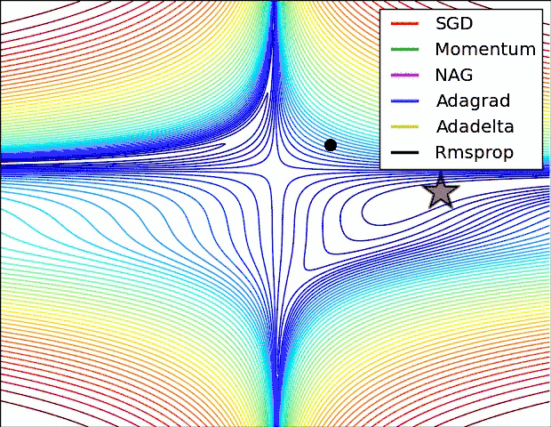   
**SGD optimization on loss surface contours**   
上面两种情况都可以看出，Adagrad, Adadelta, RMSprop 几乎很快就找到了正确的方向并前进，收敛速度也相当快，而其它方法要么很慢，要么走了很多弯路才找到。

由图可知自适应学习率方法即 Adagrad, Adadelta, RMSprop, Adam 在这种情景下会更合适而且收敛性更好。
## 五.如何选择优化算法
如果数据是稀疏的，就用自适用方法，即 Adagrad, Adadelta, RMSprop, Adam。

RMSprop, Adadelta, Adam 在很多情况下的效果是相似的。

Adam 就是在 RMSprop 的基础上加了 bias-correction 和 momentum，

随着梯度变的稀疏，Adam 比 RMSprop 效果会好。

整体来讲，Adam 是最好的选择。

很多论文里都会用 SGD，没有 momentum 等。SGD 虽然能达到极小值，但是比其它算法用的时间长，而且可能会被困在鞍点。

如果需要更快的收敛，或者是训练更深更复杂的神经网络，需要用一种自适应的算法。


### 选择建议
通过以上分析，理论上可以说，在数据比较稀疏的时候，adaptive 的方法能得到更好的效果，例如，adagrad, adadelta, rmsprop, adam 等。在数据稀疏的情况下，adam 方法也会比 rmsprop 方法收敛的结果要好一些，所以，通常在没有其它更好的理由的前框下，我会选用 adam 方法，可以比较快地得到一个预估结果。但是，在论文中，我们看到的大部分还是最原始的 mini-batch 的 SGD 方法。因为马鞍面的存在等问题，SGD 方法有时候较难收敛。另外，SGD 对于参数的初始化要求也比较高。所以，如果要是想快速收敛的话，建议使用 adam 这类 adaptive 的方法.


## 原文
[1]   https://www.cnblogs.com/guoyaohua/p/8542554.html   
[2]  https://www.cnblogs.com/bigcome/p/10084220.html   
[3]  https://zhuanlan.zhihu.com/p/36378660   
[4]  http://shuokay.com/2016/06/11/optimization/     
[5]  https://sevenold.github.io/2018/07/arithmetic-gradientDescent/   

