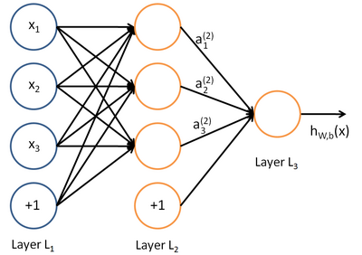
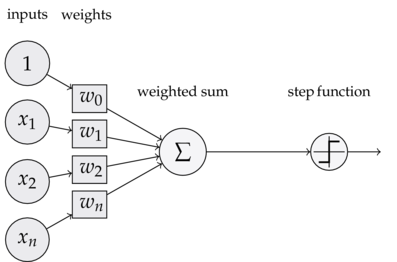
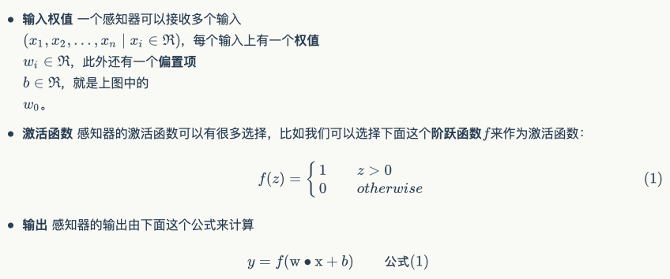
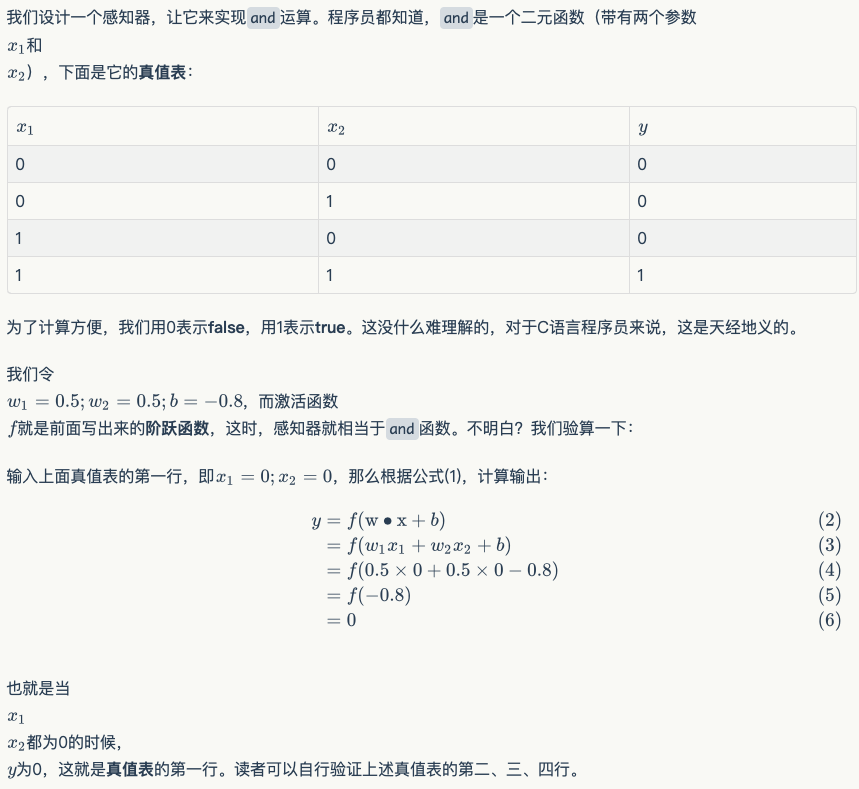
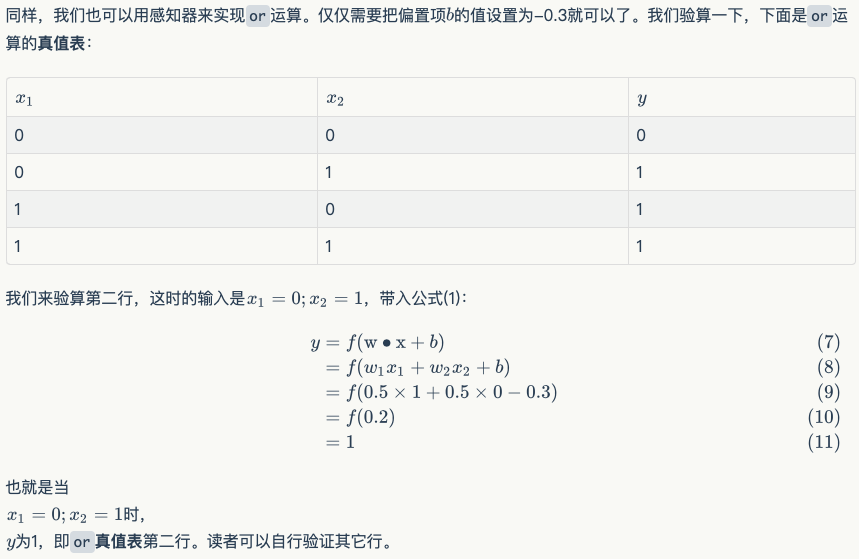
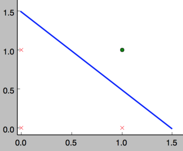
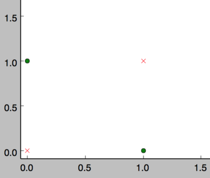
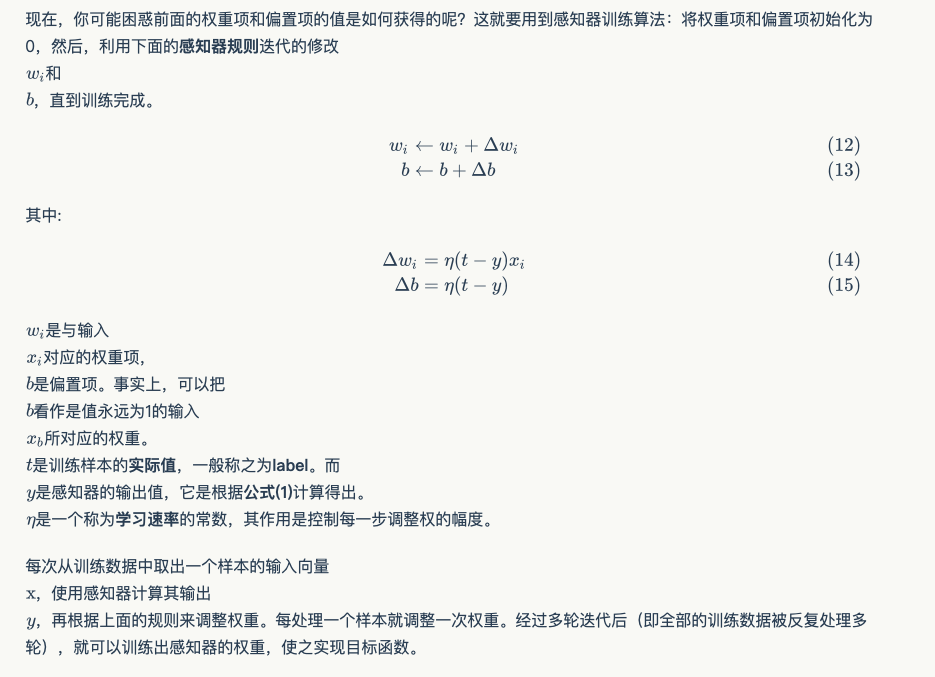
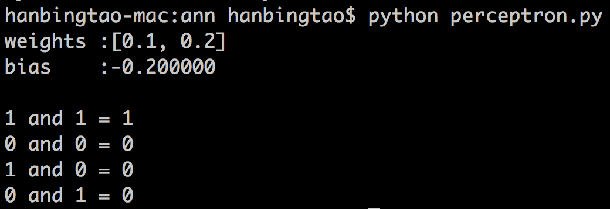

# 感知器

2020年10月30日

---

## 深度学习是啥

在人工智能领域，有一个方法叫机器学习。在机器学习这个方法里，有一类算法叫神经网络。神经网络如下图所示：



上图中每个圆圈都是一个神经元，每条线表示神经元之间的连接。我们可以看到，上面的神经元被分成了多层，层与层之间的神经元有连接，而层内之间的神经元没有连接。最左边的层叫做**输入层**，这层负责接收输入数据；最右边的层叫**输出层**，我们可以从这层获取神经网络输出数据。输入层和输出层之间的层叫做**隐藏层**。

隐藏层比较多（大于2）的神经网络叫做深度神经网络。而深度学习，就是使用深层架构（比如，深度神经网络）的机器学习方法。

那么深层网络和浅层网络相比有什么优势呢？简单来说深层网络能够表达力更强。事实上，一个仅有一个隐藏层的神经网络就能拟合任何一个函数，但是它需要很多很多的神经元。而深层网络用少得多的神经元就能拟合同样的函数。也就是为了拟合一个函数，要么使用一个浅而宽的网络，要么使用一个深而窄的网络。而后者往往更节约资源。

深层网络也有劣势，就是它不太容易训练。简单的说，你需要大量的数据，很多的技巧才能训练好一个深层网络。这是个手艺活。

## 感知器

看到这里，如果你还是一头雾水，那也是很正常的。为了理解神经网络，我们应该先理解神经网络的组成单元——**神经元**。神经元也叫做**感知器**。感知器算法在上个世纪50-70年代很流行，也成功解决了很多问题。并且，感知器算法也是非常简单的。

### 感知器的定义

下图是一个感知器：



可以看到，一个感知器有如下组成部分：



如果看完上面的公式一下子就晕了，不要紧，我们用一个简单的例子来帮助理解。


**例子：用感知器实现`and`函数**




**例子：用感知器实现`or`函数**



### 感知器还能做什么

事实上，感知器不仅仅能实现简单的布尔运算。它可以拟合任何的线性函数，任何**线性分类**或**线性回归**问题都可以用感知器来解决。前面的布尔运算可以看作是**二分类**问题，即给定一个输入，输出0（属于分类0）或1（属于分类1）。如下面所示，`and`运算是一个线性分类问题，即可以用一条直线把分类0（false，红叉表示）和分类1（true，绿点表示）分开。



然而，感知器却不能实现异或运算，如下图所示，异或运算不是线性的，你无法用一条直线把分类0和分类1分开。



### 感知器的训练



### 编程实战：实现感知器

[perceptron.py](https://github.com/FelixFu520/dl-by-hand/blob/master/perceptron.py)

对于程序员来说，没有什么比亲自动手实现学得更快了，而且，很多时候一行代码抵得上千言万语。接下来我们就将实现一个感知器。

下面是一些说明：

- 使用python语言。python在机器学习领域用的很广泛，而且，写python程序真的很轻松。
- 面向对象编程。面向对象是特别好的管理复杂度的工具，应对复杂问题时，用面向对象设计方法很容易将复杂问题拆解为多个简单问题，从而解救我们的大脑。
- 没有使用numpy。numpy实现了很多基础算法，对于实现机器学习算法来说是个必备的工具。但为了降低读者理解的难度，下面的代码只用到了基本的python（省去您去学习numpy的时间）。

下面是感知器类的实现，非常简单。去掉注释只有27行，而且还包括为了美观（每行不超过60个字符）而增加的很多换行。

```python
#!/usr/bin/env python
# -*- coding: UTF-8 -*-

from __future__ import print_function
from functools import reduce


class VectorOp(object):
    """
    实现向量计算操作
    """
    @staticmethod
    def dot(x, y):
        """
        计算两个向量x和y的内积
        """
        # 首先把x[x1,x2,x3...]和y[y1,y2,y3,...]按元素相乘
        # 变成[x1*y1, x2*y2, x3*y3]
        # 然后利用reduce求和
        return reduce(lambda a, b: a + b, VectorOp.element_multiply(x, y), 0.0)

    @staticmethod
    def element_multiply(x, y):
        """
        将两个向量x和y按元素相乘
        """
        # 首先把x[x1,x2,x3...]和y[y1,y2,y3,...]打包在一起
        # 变成[(x1,y1),(x2,y2),(x3,y3),...]
        # 然后利用map函数计算[x1*y1, x2*y2, x3*y3]
        return list(map(lambda x_y: x_y[0] * x_y[1], zip(x, y)))

    @staticmethod
    def element_add(x, y):
        """
        将两个向量x和y按元素相加
        """
        # 首先把x[x1,x2,x3...]和y[y1,y2,y3,...]打包在一起
        # 变成[(x1,y1),(x2,y2),(x3,y3),...]
        # 然后利用map函数计算[x1+y1, x2+y2, x3+y3]
        return list(map(lambda x_y: x_y[0] + x_y[1], zip(x, y)))

    @staticmethod
    def scala_multiply(v, s):
        """
        将向量v中的每个元素和标量s相乘
        """
        return map(lambda e: e * s, v)


class Perceptron(object):
    def __init__(self, input_num, activator):
        """
        初始化感知器，设置输入参数的个数，以及激活函数。
        激活函数的类型为double -> double
        """
        self.activator = activator
        # 权重向量初始化为0
        self.weights = [0.0] * input_num
        # 偏置项初始化为0
        self.bias = 0.0

    def __str__(self):
        """
        打印学习到的权重、偏置项
        """
        return 'weights\t:%s\nbias\t:%f\n' % (self.weights, self.bias)

    def predict(self, input_vec):
        """
        输入向量，输出感知器的计算结果
        """
        # 计算向量input_vec[x1,x2,x3...]和weights[w1,w2,w3,...]的内积
        # 然后加上bias
        return self.activator(
            VectorOp.dot(input_vec, self.weights) + self.bias)

    def train(self, input_vecs, labels, iteration, rate):
        """
        输入训练数据：一组向量、与每个向量对应的label；以及训练轮数、学习率
        """
        for i in range(iteration):
            self._one_iteration(input_vecs, labels, rate)

    def _one_iteration(self, input_vecs, labels, rate):
        """
        一次迭代，把所有的训练数据过一遍
        """
        # 把输入和输出打包在一起，成为样本的列表[(input_vec, label), ...]
        # 而每个训练样本是(input_vec, label)
        samples = zip(input_vecs, labels)
        # 对每个样本，按照感知器规则更新权重
        for (input_vec, label) in samples:
            # 计算感知器在当前权重下的输出
            output = self.predict(input_vec)
            # 更新权重
            self._update_weights(input_vec, output, label, rate)

    def _update_weights(self, input_vec, output, label, rate):
        """
        按照感知器规则更新权重
        """
        # 首先计算本次更新的delta
        # 然后把input_vec[x1,x2,x3,...]向量中的每个值乘上delta，得到每个权重更新
        # 最后再把权重更新按元素加到原先的weights[w1,w2,w3,...]上
        delta = label - output
        self.weights = VectorOp.element_add(
            self.weights, VectorOp.scala_multiply(input_vec, rate * delta))
        # 更新bias
        self.bias += rate * delta


```

接下来，我们利用这个感知器类去实现`and`函数。

```python
def f(x):
    """
    定义激活函数f
    """
    return 1 if x > 0 else 0


def get_training_dataset():
    """
    基于and真值表构建训练数据
    """
    # 构建训练数据
    # 输入向量列表
    input_vecs = [[1, 1], [0, 0], [1, 0], [0, 1]]
    # 期望的输出列表，注意要与输入一一对应
    # [1,1] -> 1, [0,0] -> 0, [1,0] -> 0, [0,1] -> 0
    labels = [1, 0, 0, 0]
    return input_vecs, labels


def train_and_perceptron():
    """
    使用and真值表训练感知器
    """
    # 创建感知器，输入参数个数为2（因为and是二元函数），激活函数为f
    p = Perceptron(2, f)
    # 训练，迭代10轮, 学习速率为0.1
    input_vecs, labels = get_training_dataset()
    p.train(input_vecs, labels, 10, 0.1)
    # 返回训练好的感知器
    return p


if __name__ == '__main__':
    # 训练and感知器
    and_perception = train_and_perceptron()
    # 打印训练获得的权重
    print(and_perception)
    # 测试
    print('1 and 1 = %d' % and_perception.predict([1, 1]))
    print('0 and 0 = %d' % and_perception.predict([0, 0]))
    print('1 and 0 = %d' % and_perception.predict([1, 0]))
    print('0 and 1 = %d' % and_perception.predict([0, 1]))
```

将上述程序保存为perceptron.py文件，通过命令行执行这个程序，其运行结果为：



神奇吧！感知器竟然完全实现了`and`函数。读者可以尝试一下利用感知器实现其它函数。

## 小结

终于看（写）到小结了...，大家都累了。对于零基础的你来说，走到这里应该已经很烧脑了吧。没关系，休息一下。值得高兴的是，你终于已经走出了深度学习入门的第一步，这是巨大的进步；坏消息是，这仅仅是最简单的部分，后面还有无数艰难险阻等着你。不过，你学的困难往往意味着别人学的也困难，掌握一门高门槛的技艺，进可糊口退可装逼，是很值得的。

下一篇文章，我们将讨论另外一种感知器：**线性单元**，并由此引出一种可能是最最重要的优化算法：**梯度下降**算法。