# 神经网络和反向传播算法

2020年10月30日

1、求网络前向输出

2、求每个节点的w的梯度

3、求 delta w的大小，并更新梯度

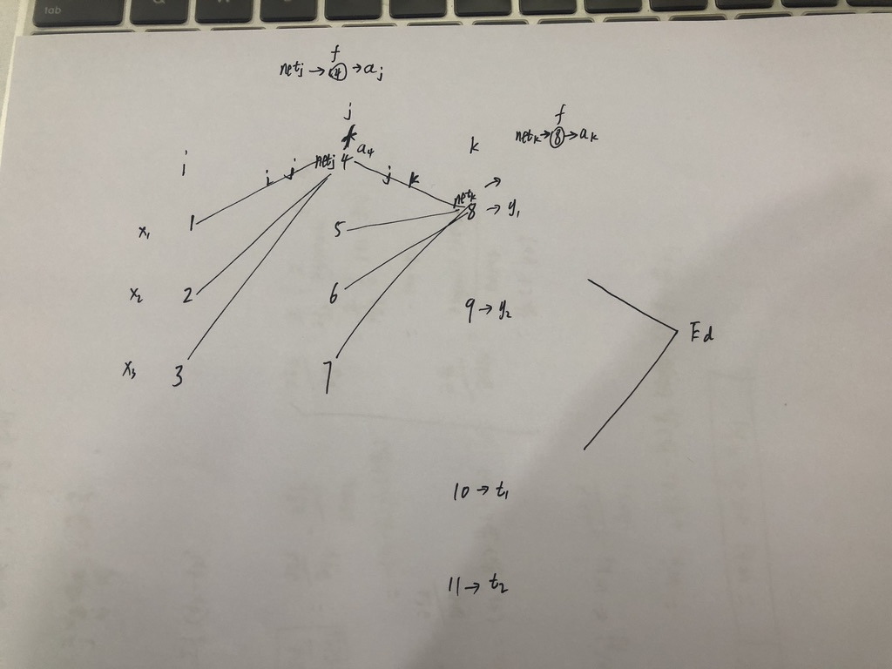

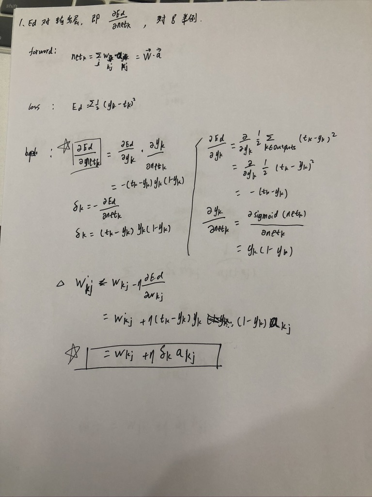

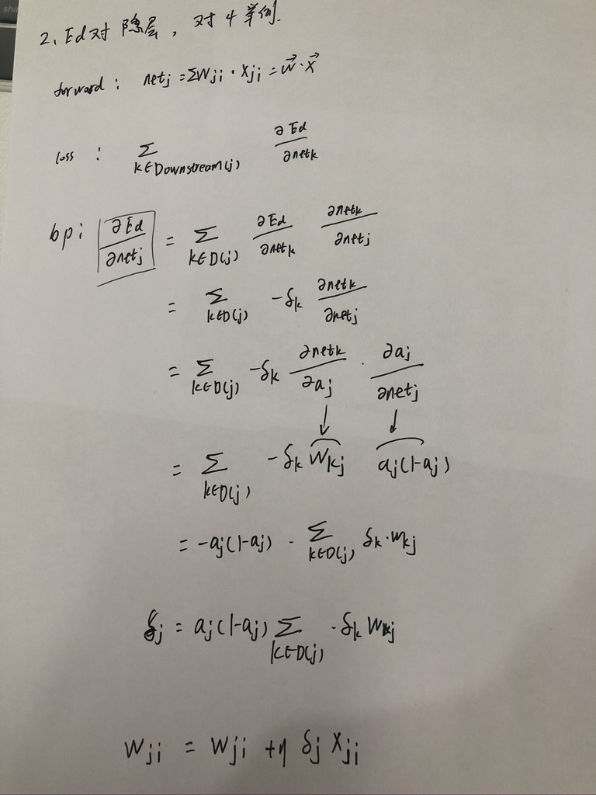

---

## 往期回顾

在上一篇文章中，我们已经掌握了机器学习的基本套路，对模型、目标函数、优化算法这些概念有了一定程度的理解，而且已经会训练单个的感知器或者线性单元了。在这篇文章中，我们将把这些单独的单元按照一定的规则相互连接在一起形成**神经网络**，从而奇迹般的获得了强大的学习能力。我们还将介绍这种网络的训练算法：**反向传播算法**。最后，我们依然用代码实现一个神经网络。如果您能坚持到本文的结尾，将会看到我们用自己实现的神经网络去识别手写数字。现在请做好准备，您即将双手触及到深度学习的大门。

## 神经元

神经元和感知器本质上是一样的，只不过我们说感知器的时候，它的激活函数是**阶跃函数**；而当我们说神经元时，激活函数往往选择为sigmoid函数或tanh函数。如下图所示：

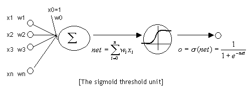

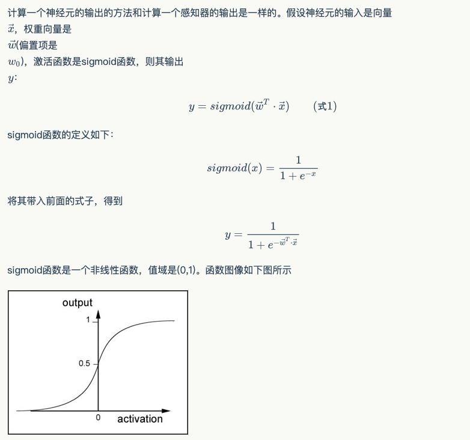

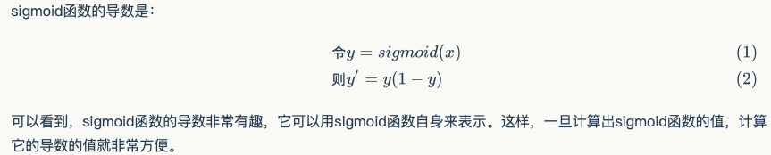

## 神经网络是啥

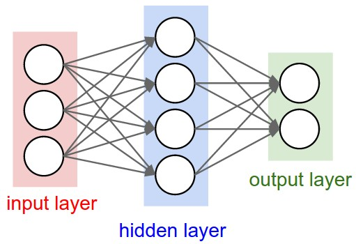

神经网络其实就是按照**一定规则**连接起来的多个**神经元**。上图展示了一个**全连接(full connected, FC)**神经网络，通过观察上面的图，我们可以发现它的规则包括：

- 神经元按照**层**来布局。最左边的层叫做**输入层**，负责接收输入数据；最右边的层叫**输出层**，我们可以从这层获取神经网络输出数据。输入层和输出层之间的层叫做**隐藏层**，因为它们对于外部来说是不可见的。
- 同一层的神经元之间没有连接。
- 第N层的每个神经元和第N-1层的**所有**神经元相连(这就是full connected的含义)，第N-1层神经元的输出就是第N层神经元的输入。
- 每个连接都有一个**权值**。

上面这些规则定义了全连接神经网络的结构。事实上还存在很多其它结构的神经网络，比如卷积神经网络(CNN)、循环神经网络(RNN)，他们都具有不同的连接规则。

## 计算神经网络的输出

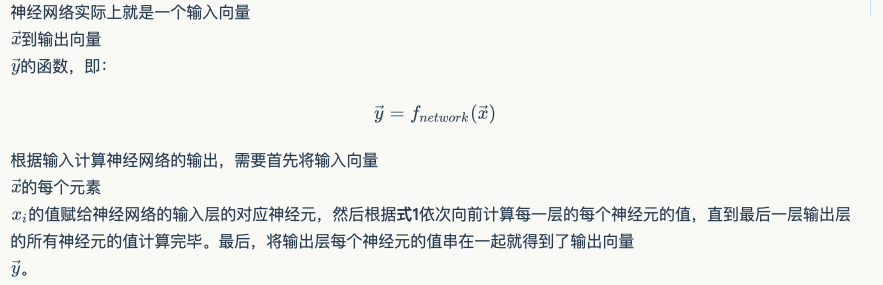

接下来举一个例子来说明这个过程，我们先给神经网络的每个单元写上编号。

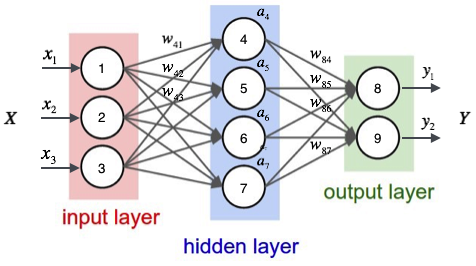

如上图，输入层有三个节点，我们将其依次编号为1、2、3；隐藏层的4个节点，编号依次为4、5、6、7；最后输出层的两个节点编号为8、9。因为我们这个神经网络是**全连接**网络，所以可以看到每个节点都和**上一层的所有节点**有连接。比如，我们可以看到隐藏层的节点4，它和输入层的三个节点1、2、3之间都有连接，其连接上的权重分别为。那么，我们怎样计算节点4的输出值呢？

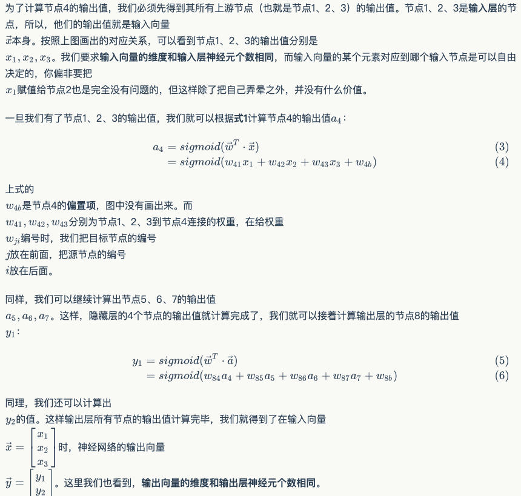

### 神经网络的矩阵表示

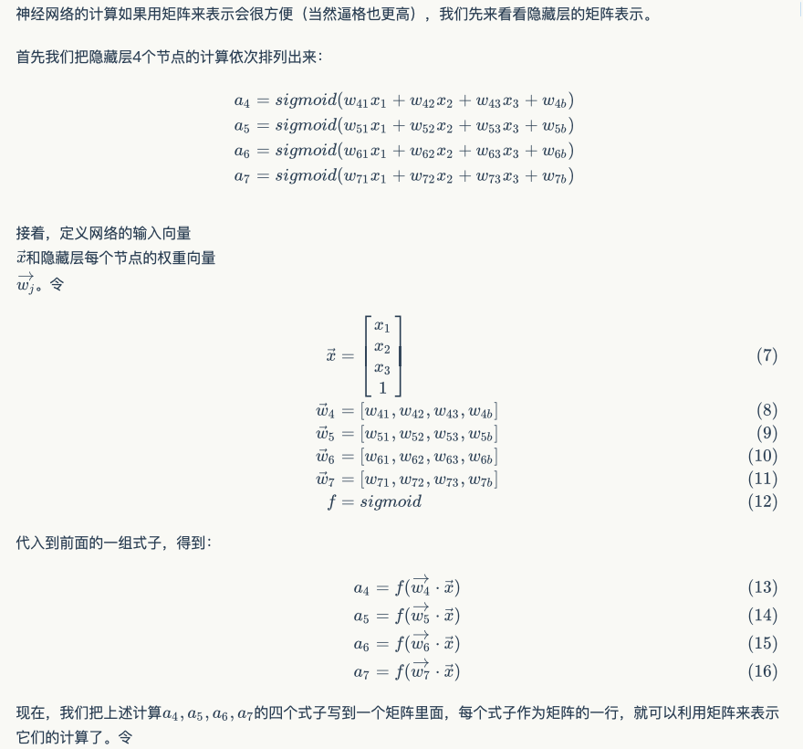

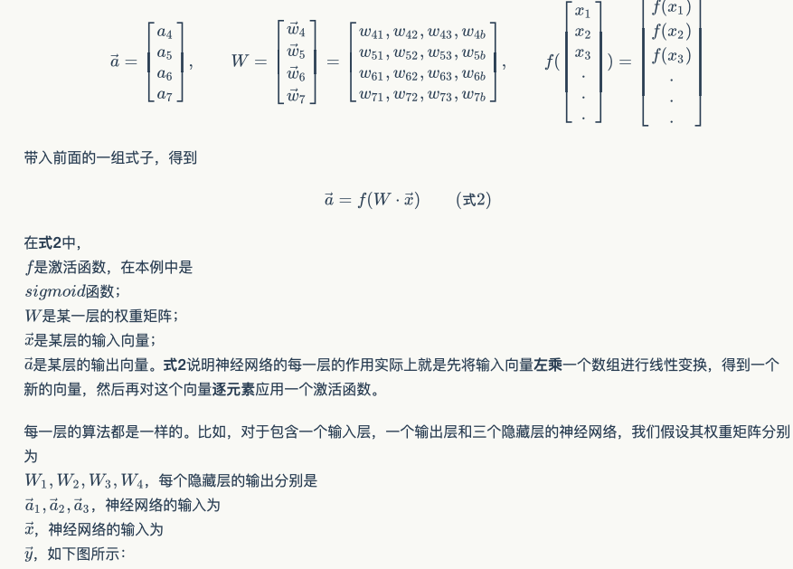


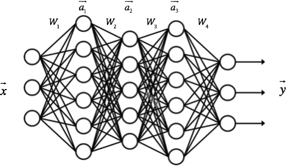

则每一层的输出向量的计算可以表示为：

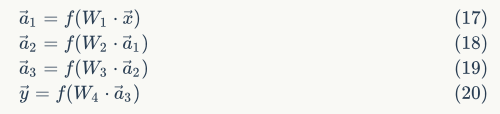

这就是神经网络输出值的计算方法。

## 神经网络的训练

现在，我们需要知道一个神经网络的每个连接上的权值是如何得到的。我们可以说神经网络是一个**模型**，那么这些权值就是模型的**参数**，也就是模型要学习的东西。然而，一个神经网络的连接方式、网络的层数、每层的节点数这些参数，则不是学习出来的，而是人为事先设置的。对于这些人为设置的参数，我们称之为**超参数(Hyper-Parameters)**。

接下来，我们将要介绍神经网络的训练算法：反向传播算法。

### 反向传播算法(Back Propagation)

我们首先直观的介绍反向传播算法，最后再来介绍这个算法的推导。当然读者也可以完全跳过推导部分，因为即使不知道如何推导，也不影响你写出来一个神经网络的训练代码。事实上，现在神经网络成熟的开源实现多如牛毛，除了练手之外，你可能都没有机会需要去写一个神经网络。

我们以**监督学习**为例来解释反向传播算法。在[零基础入门深度学习(2) - 线性单元和梯度下降](https://www.zybuluo.com/hanbingtao/note/448086)一文中我们介绍了什么是**监督学习**，如果忘记了可以再看一下。另外，我们设神经元的激活函数f为sigmoid函数(不同激活函数的计算公式不同，详情见[反向传播算法的推导](https://www.zybuluo.com/hanbingtao/note/476663#an1)一节)。


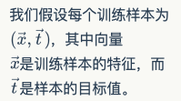


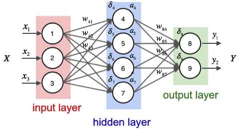

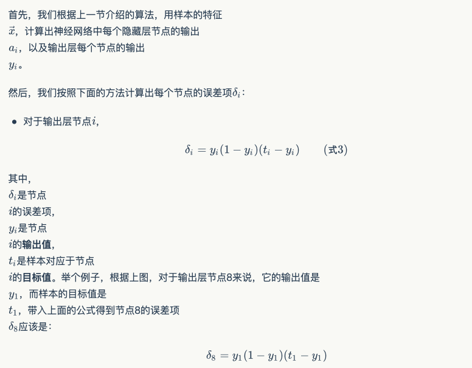

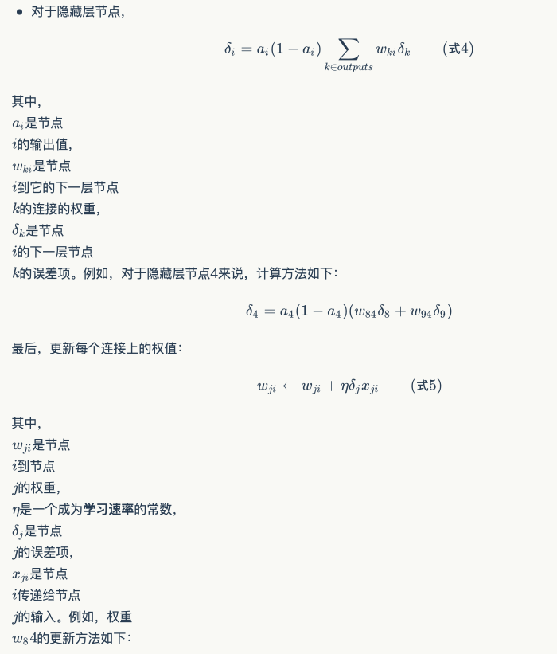

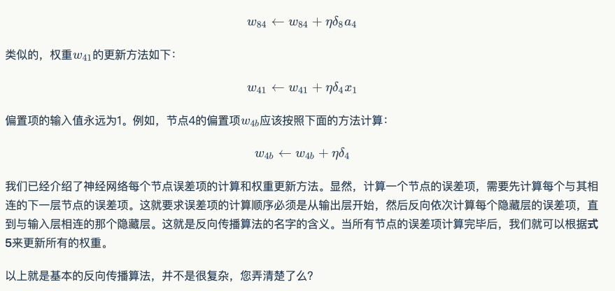


### 反向传播算法的推导

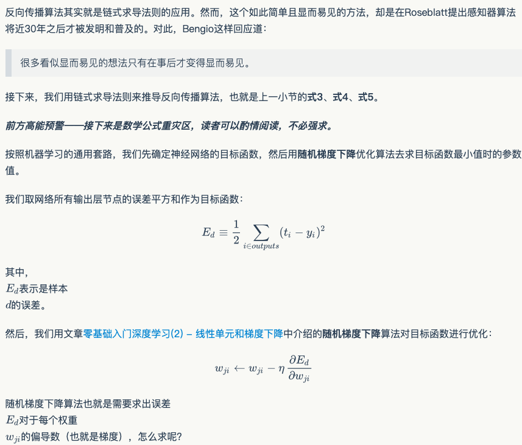

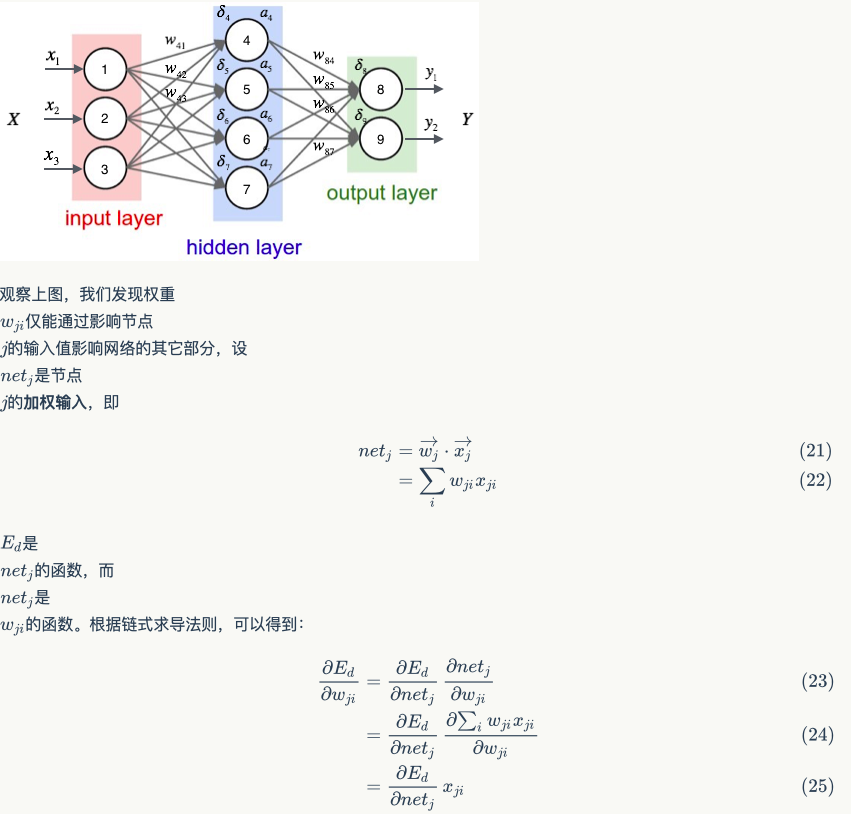

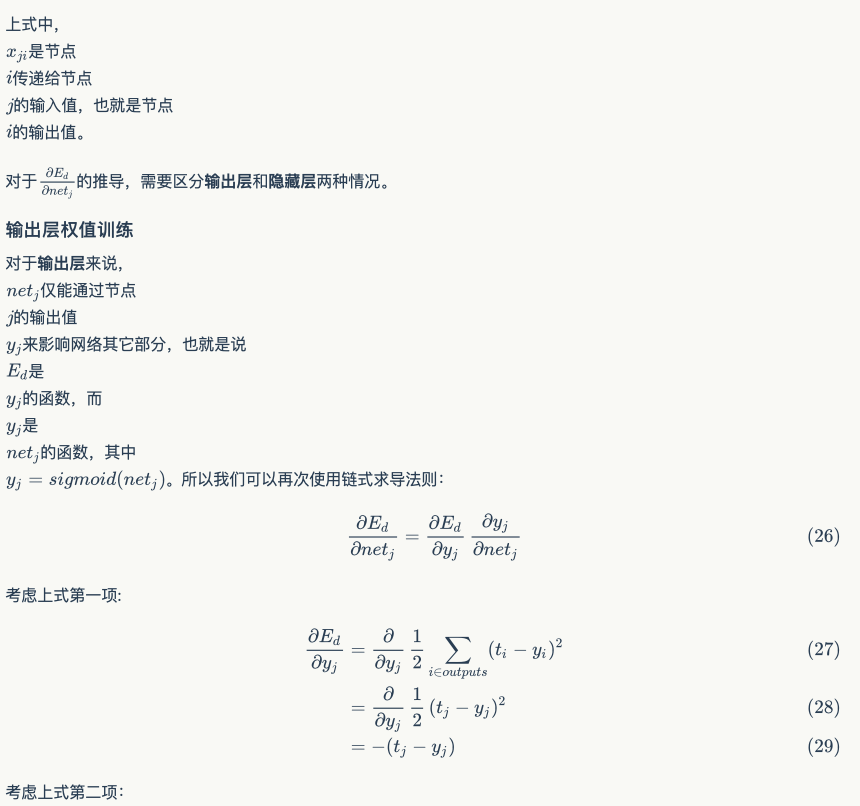

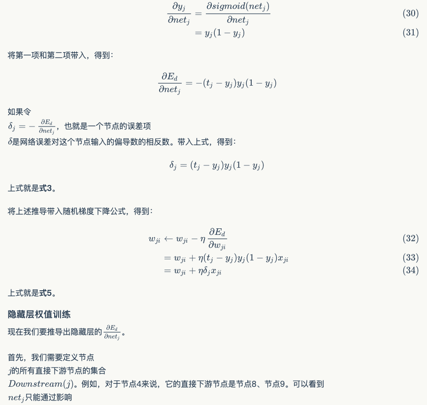

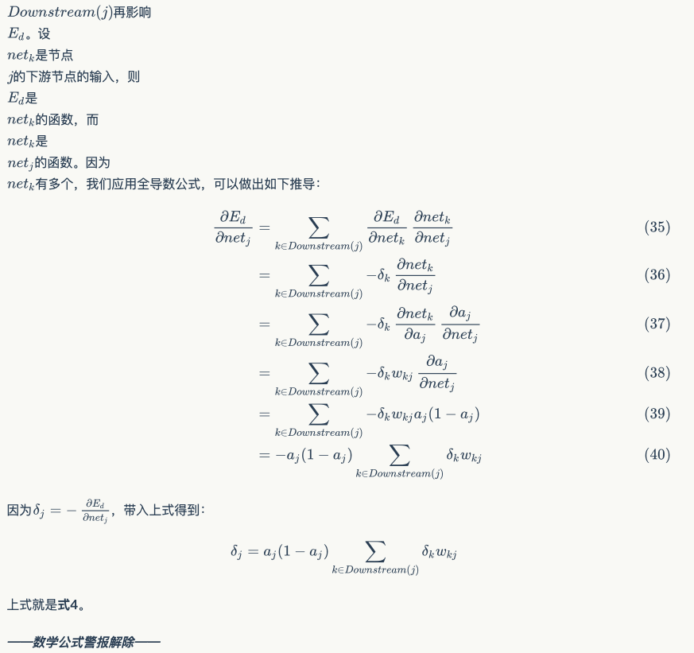

至此，我们已经推导出了反向传播算法。需要注意的是，我们刚刚推导出的训练规则是根据激活函数是sigmoid函数、平方和误差、全连接网络、随机梯度下降优化算法。如果激活函数不同、误差计算方式不同、网络连接结构不同、优化算法不同，则具体的训练规则也会不一样。但是无论怎样，训练规则的推导方式都是一样的，应用链式求导法则进行推导即可。

## 神经网络的实现

> 完整代码请参考GitHub: https://github.com/hanbt/learn_dl/blob/master/bp.py (python2.7)

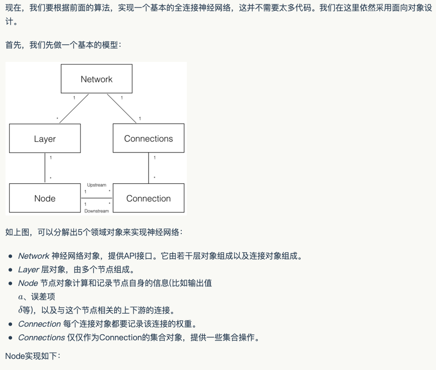

```python
# 节点类，负责记录和维护节点自身信息以及与这个节点相关的上下游连接，实现输出值和误差项的计算。
class Node(object):
    def __init__(self, layer_index, node_index):
        '''
        构造节点对象。
        layer_index: 节点所属的层的编号
        node_index: 节点的编号
        '''
        self.layer_index = layer_index
        self.node_index = node_index
        self.downstream = []
        self.upstream = []
        self.output = 0
        self.delta = 0
    def set_output(self, output):
        '''
        设置节点的输出值。如果节点属于输入层会用到这个函数。
        '''
        self.output = output
    def append_downstream_connection(self, conn):
        '''
        添加一个到下游节点的连接
        '''
        self.downstream.append(conn)
    def append_upstream_connection(self, conn):
        '''
        添加一个到上游节点的连接
        '''
        self.upstream.append(conn)
    def calc_output(self):
        '''
        根据式1计算节点的输出
        '''
        output = reduce(lambda ret, conn: ret + conn.upstream_node.output * conn.weight, self.upstream, 0)
        self.output = sigmoid(output)
    def calc_hidden_layer_delta(self):
        '''
        节点属于隐藏层时，根据式4计算delta
        '''
        downstream_delta = reduce(
            lambda ret, conn: ret + conn.downstream_node.delta * conn.weight,
            self.downstream, 0.0)
        self.delta = self.output * (1 - self.output) * downstream_delta
    def calc_output_layer_delta(self, label):
        '''
        节点属于输出层时，根据式3计算delta
        '''
        self.delta = self.output * (1 - self.output) * (label - self.output)
    def __str__(self):
        '''
        打印节点的信息
        '''
        node_str = '%u-%u: output: %f delta: %f' % (self.layer_index, self.node_index, self.output, self.delta)
        downstream_str = reduce(lambda ret, conn: ret + '\n\t' + str(conn), self.downstream, '')
        upstream_str = reduce(lambda ret, conn: ret + '\n\t' + str(conn), self.upstream, '')
        return node_str + '\n\tdownstream:' + downstream_str + '\n\tupstream:' + upstream_str 

```

ConstNode对象，为了实现一个输出恒为1的节点(计算偏置项时需要)

```python
class ConstNode(object):
    def __init__(self, layer_index, node_index):
        '''
        构造节点对象。
        layer_index: 节点所属的层的编号
        node_index: 节点的编号
        '''    
        self.layer_index = layer_index
        self.node_index = node_index
        self.downstream = []
        self.output = 1
    def append_downstream_connection(self, conn):
        '''
        添加一个到下游节点的连接
        '''       
        self.downstream.append(conn)
    def calc_hidden_layer_delta(self):
        '''
        节点属于隐藏层时，根据式4计算delta
        '''
        downstream_delta = reduce(
            lambda ret, conn: ret + conn.downstream_node.delta * conn.weight,
            self.downstream, 0.0)
        self.delta = self.output * (1 - self.output) * downstream_delta
    def __str__(self):
        '''
        打印节点的信息
        '''
        node_str = '%u-%u: output: 1' % (self.layer_index, self.node_index)
        downstream_str = reduce(lambda ret, conn: ret + '\n\t' + str(conn), self.downstream, '')
        return node_str + '\n\tdownstream:' + downstream_str
```

Layer对象，负责初始化一层。此外，作为Node的集合对象，提供对Node集合的操作。

```python
class Layer(object):
    def __init__(self, layer_index, node_count):
        '''
        初始化一层
        layer_index: 层编号
        node_count: 层所包含的节点个数
        '''
        self.layer_index = layer_index
        self.nodes = []
        for i in range(node_count):
            self.nodes.append(Node(layer_index, i))
        self.nodes.append(ConstNode(layer_index, node_count))
    def set_output(self, data):
        '''
        设置层的输出。当层是输入层时会用到。
        '''
        for i in range(len(data)):
            self.nodes[i].set_output(data[i])
    def calc_output(self):
        '''
        计算层的输出向量
        '''
        for node in self.nodes[:-1]:
            node.calc_output()
    def dump(self):
        '''
        打印层的信息
        '''
        for node in self.nodes:
            print node
```

Connection对象，主要职责是记录连接的权重，以及这个连接所关联的上下游节点。

```python
class Connection(object):
    def __init__(self, upstream_node, downstream_node):
        '''
        初始化连接，权重初始化为是一个很小的随机数
        upstream_node: 连接的上游节点
        downstream_node: 连接的下游节点
        '''
        self.upstream_node = upstream_node
        self.downstream_node = downstream_node
        self.weight = random.uniform(-0.1, 0.1)
        self.gradient = 0.0
    def calc_gradient(self):
        '''
        计算梯度
        '''
        self.gradient = self.downstream_node.delta * self.upstream_node.output
    def get_gradient(self):
        '''
        获取当前的梯度
        '''
        return self.gradient
    def update_weight(self, rate):
        '''
        根据梯度下降算法更新权重
        '''
        self.calc_gradient()
        self.weight += rate * self.gradient
    def __str__(self):
        '''
        打印连接信息
        '''
        return '(%u-%u) -> (%u-%u) = %f' % (
            self.upstream_node.layer_index, 
            self.upstream_node.node_index,
            self.downstream_node.layer_index, 
            self.downstream_node.node_index, 
            self.weight)
```

Connections对象，提供Connection集合操作。

```python
class Connections(object):
    def __init__(self):
        self.connections = []
    def add_connection(self, connection):
        self.connections.append(connection)
    def dump(self):
        for conn in self.connections:
            print conn
```

Network对象，提供API。

```python
class Network(object):
    def __init__(self, layers):
        '''
        初始化一个全连接神经网络
        layers: 二维数组，描述神经网络每层节点数
        '''
        self.connections = Connections()
        self.layers = []
        layer_count = len(layers)
        node_count = 0;
        for i in range(layer_count):
            self.layers.append(Layer(i, layers[i]))
        for layer in range(layer_count - 1):
            connections = [Connection(upstream_node, downstream_node) 
                           for upstream_node in self.layers[layer].nodes
                           for downstream_node in self.layers[layer + 1].nodes[:-1]]
            for conn in connections:
                self.connections.add_connection(conn)
                conn.downstream_node.append_upstream_connection(conn)
                conn.upstream_node.append_downstream_connection(conn)
    def train(self, labels, data_set, rate, iteration):
        '''
        训练神经网络
        labels: 数组，训练样本标签。每个元素是一个样本的标签。
        data_set: 二维数组，训练样本特征。每个元素是一个样本的特征。
        '''
        for i in range(iteration):
            for d in range(len(data_set)):
                self.train_one_sample(labels[d], data_set[d], rate)
    def train_one_sample(self, label, sample, rate):
        '''
        内部函数，用一个样本训练网络
        '''
        self.predict(sample)
        self.calc_delta(label)
        self.update_weight(rate)
    def calc_delta(self, label):
        '''
        内部函数，计算每个节点的delta
        '''
        output_nodes = self.layers[-1].nodes
        for i in range(len(label)):
            output_nodes[i].calc_output_layer_delta(label[i])
        for layer in self.layers[-2::-1]:
            for node in layer.nodes:
                node.calc_hidden_layer_delta()
    def update_weight(self, rate):
        '''
        内部函数，更新每个连接权重
        '''
        for layer in self.layers[:-1]:
            for node in layer.nodes:
                for conn in node.downstream:
                    conn.update_weight(rate)
    def calc_gradient(self):
        '''
        内部函数，计算每个连接的梯度
        '''
        for layer in self.layers[:-1]:
            for node in layer.nodes:
                for conn in node.downstream:
                    conn.calc_gradient()
    def get_gradient(self, label, sample):
        '''
        获得网络在一个样本下，每个连接上的梯度
        label: 样本标签
        sample: 样本输入
        '''
        self.predict(sample)
        self.calc_delta(label)
        self.calc_gradient()
    def predict(self, sample):
        '''
        根据输入的样本预测输出值
        sample: 数组，样本的特征，也就是网络的输入向量
        '''
        self.layers[0].set_output(sample)
        for i in range(1, len(self.layers)):
            self.layers[i].calc_output()
        return map(lambda node: node.output, self.layers[-1].nodes[:-1])
    def dump(self):
        '''
        打印网络信息
        '''
        for layer in self.layers:
            layer.dump()
```

至此，实现了一个基本的全连接神经网络。可以看到，同神经网络的强大学习能力相比，其实现还算是很容易的。

### 梯度检查

怎么保证自己写的神经网络没有BUG呢？事实上这是一个非常重要的问题。一方面，千辛万苦想到一个算法，结果效果不理想，那么是算法本身错了还是代码实现错了呢？定位这种问题肯定要花费大量的时间和精力。另一方面，由于神经网络的复杂性，我们几乎无法事先知道神经网络的输入和输出，因此类似TDD(测试驱动开发)这样的开发方法似乎也不可行。

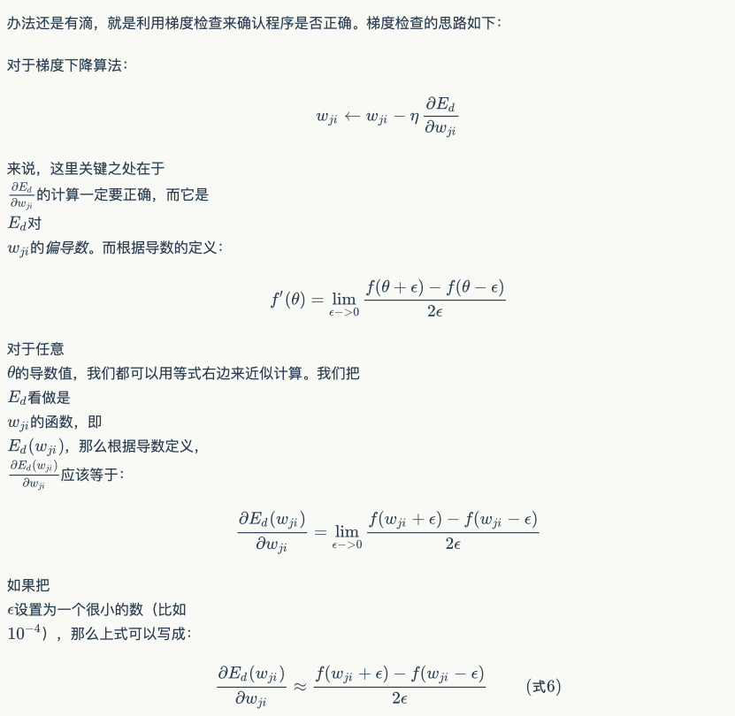


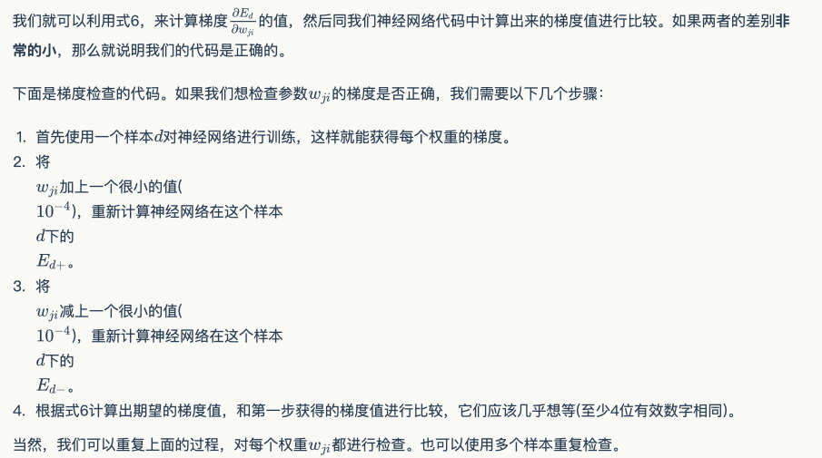


```python
def gradient_check(network, sample_feature, sample_label):
    '''
    梯度检查
    network: 神经网络对象
    sample_feature: 样本的特征
    sample_label: 样本的标签
    '''
    # 计算网络误差
    network_error = lambda vec1, vec2: \
            0.5 * reduce(lambda a, b: a + b, 
                      map(lambda v: (v[0] - v[1]) * (v[0] - v[1]),
                          zip(vec1, vec2)))
    # 获取网络在当前样本下每个连接的梯度
    network.get_gradient(sample_feature, sample_label)
    # 对每个权重做梯度检查    
    for conn in network.connections.connections: 
        # 获取指定连接的梯度
        actual_gradient = conn.get_gradient()
        # 增加一个很小的值，计算网络的误差
        epsilon = 0.0001
        conn.weight += epsilon
        error1 = network_error(network.predict(sample_feature), sample_label)
        # 减去一个很小的值，计算网络的误差
        conn.weight -= 2 * epsilon # 刚才加过了一次，因此这里需要减去2倍
        error2 = network_error(network.predict(sample_feature), sample_label)
        # 根据式6计算期望的梯度值
        expected_gradient = (error2 - error1) / (2 * epsilon)
        # 打印
        print 'expected gradient: \t%f\nactual gradient: \t%f' % (
            expected_gradient, actual_gradient)
```

至此，会推导、会实现、会抓BUG，你已经摸到深度学习的大门了。接下来还需要不断的实践，我们用刚刚写过的神经网络去识别手写数字。

## 神经网络实战——手写数字识别

针对这个任务，我们采用业界非常流行的MNIST数据集。MNIST大约有60000个手写字母的训练样本，我们使用它训练我们的神经网络，然后再用训练好的网络去识别手写数字。

手写数字识别是个比较简单的任务，数字只可能是0-9中的一个，这是个10分类问题。

### 超参数的确定

我们首先需要确定网络的层数和每层的节点数。关于第一个问题，实际上并没有什么理论化的方法，大家都是根据经验来拍，如果没有经验的话就随便拍一个。然后，你可以多试几个值，训练不同层数的神经网络，看看哪个效果最好就用哪个。嗯，现在你可能明白为什么说深度学习是个手艺活了，有些手艺很让人无语，而有些手艺还是很有技术含量的。

不过，有些基本道理我们还是明白的，我们知道网络层数越多越好，也知道层数越多训练难度越大。对于全连接网络，隐藏层最好不要超过三层。那么，我们可以先试试仅有一个隐藏层的神经网络效果怎么样。毕竟模型小的话，训练起来也快些(刚开始玩模型的时候，都希望快点看到结果)。

输入层节点数是确定的。因为MNIST数据集每个训练数据是28*28的图片，共784个像素，因此，输入层节点数应该是784，每个像素对应一个输入节点。

输出层节点数也是确定的。因为是10分类，我们可以用10个节点，每个节点对应一个分类。输出层10个节点中，输出最大值的那个节点对应的分类，就是模型的预测结果。

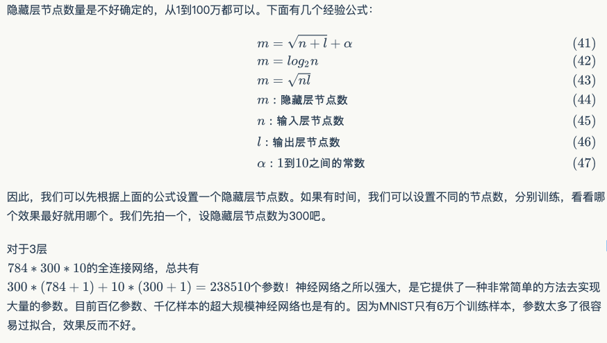

### 模型的训练和评估

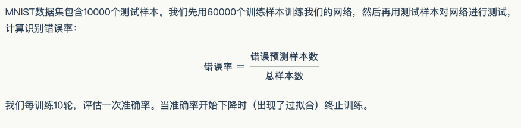

### 代码实现

首先，我们需要把MNIST数据集处理为神经网络能够接受的形式。MNIST训练集的文件格式可以参考官方网站，这里不在赘述。每个训练样本是一个28*28的图像，我们按照行优先，把它转化为一个784维的向量。每个标签是0-9的值，我们将其转换为一个10维的one-hot向量：如果标签值为，我们就把向量的第维（从0开始编号）设置为0.9，而其它维设置为0.1。例如，向量[0.1,0.1,0.9,0.1,0.1,0.1,0.1,0.1,0.1,0.1]表示值2。

下面是处理MNIST数据的代码：

```python
#!/usr/bin/env python
# -*- coding: UTF-8 -*-
import struct
from bp import *
from datetime import datetime
# 数据加载器基类
class Loader(object):
    def __init__(self, path, count):
        '''
        初始化加载器
        path: 数据文件路径
        count: 文件中的样本个数
        '''
        self.path = path
        self.count = count
    def get_file_content(self):
        '''
        读取文件内容
        '''
        f = open(self.path, 'rb')
        content = f.read()
        f.close()
        return content
    def to_int(self, byte):
        '''
        将unsigned byte字符转换为整数
        '''
        return struct.unpack('B', byte)[0]
# 图像数据加载器
class ImageLoader(Loader):
    def get_picture(self, content, index):
        '''
        内部函数，从文件中获取图像
        '''
        start = index * 28 * 28 + 16
        picture = []
        for i in range(28):
            picture.append([])
            for j in range(28):
                picture[i].append(
                    self.to_int(content[start + i * 28 + j]))
        return picture
    def get_one_sample(self, picture):
        '''
        内部函数，将图像转化为样本的输入向量
        '''
        sample = []
        for i in range(28):
            for j in range(28):
                sample.append(picture[i][j])
        return sample
    def load(self):
        '''
        加载数据文件，获得全部样本的输入向量
        '''
        content = self.get_file_content()
        data_set = []
        for index in range(self.count):
            data_set.append(
                self.get_one_sample(
                    self.get_picture(content, index)))
        return data_set
# 标签数据加载器
class LabelLoader(Loader):
    def load(self):
        '''
        加载数据文件，获得全部样本的标签向量
        '''
        content = self.get_file_content()
        labels = []
        for index in range(self.count):
            labels.append(self.norm(content[index + 8]))
        return labels
    def norm(self, label):
        '''
        内部函数，将一个值转换为10维标签向量
        '''
        label_vec = []
        label_value = self.to_int(label)
        for i in range(10):
            if i == label_value:
                label_vec.append(0.9)
            else:
                label_vec.append(0.1)
        return label_vec
def get_training_data_set():
    '''
    获得训练数据集
    '''
    image_loader = ImageLoader('train-images-idx3-ubyte', 60000)
    label_loader = LabelLoader('train-labels-idx1-ubyte', 60000)
    return image_loader.load(), label_loader.load()
def get_test_data_set():
    '''
    获得测试数据集
    '''
    image_loader = ImageLoader('t10k-images-idx3-ubyte', 10000)
    label_loader = LabelLoader('t10k-labels-idx1-ubyte', 10000)
    return image_loader.load(), label_loader.load()

```

网络的输出是一个10维向量，这个向量第n个(从0开始编号)元素的值最大，那么n就是网络的识别结果。下面是代码实现：

```python
def get_result(vec):
    max_value_index = 0
    max_value = 0
    for i in range(len(vec)):
        if vec[i] > max_value:
            max_value = vec[i]
            max_value_index = i
    return max_value_index
```

我们使用错误率来对网络进行评估，下面是代码实现：

```python
def evaluate(network, test_data_set, test_labels):
    error = 0
    total = len(test_data_set)
    for i in range(total):
        label = get_result(test_labels[i])
        predict = get_result(network.predict(test_data_set[i]))
        if label != predict:
            error += 1
    return float(error) / float(total)
```

最后实现我们的训练策略：每训练10轮，评估一次准确率，当准确率开始下降时终止训练。下面是代码实现：

```python
def train_and_evaluate():
    last_error_ratio = 1.0
    epoch = 0
    train_data_set, train_labels = get_training_data_set()
    test_data_set, test_labels = get_test_data_set()
    network = Network([784, 300, 10])
    while True:
        epoch += 1
        network.train(train_labels, train_data_set, 0.3, 1)
        print '%s epoch %d finished' % (now(), epoch)
        if epoch % 10 == 0:
            error_ratio = evaluate(network, test_data_set, test_labels)
            print '%s after epoch %d, error ratio is %f' % (now(), epoch, error_ratio)
            if error_ratio > last_error_ratio:
                break
            else:
                last_error_ratio = error_ratio
if __name__ == '__main__':
    train_and_evaluate()
```

在我的机器上测试了一下，1个epoch大约需要9000多秒，所以要对代码做很多的性能优化工作（比如用向量化编程）。训练要很久很久，可以把它上传到服务器上，在tmux的session里面去运行。为了防止异常终止导致前功尽弃，我们每训练10轮，就把获得参数值保存在磁盘上，以便后续可以恢复。(代码略)

## 向量化编程

> 完整代码请参考GitHub: https://github.com/hanbt/learn_dl/blob/master/fc.py (python2.7)

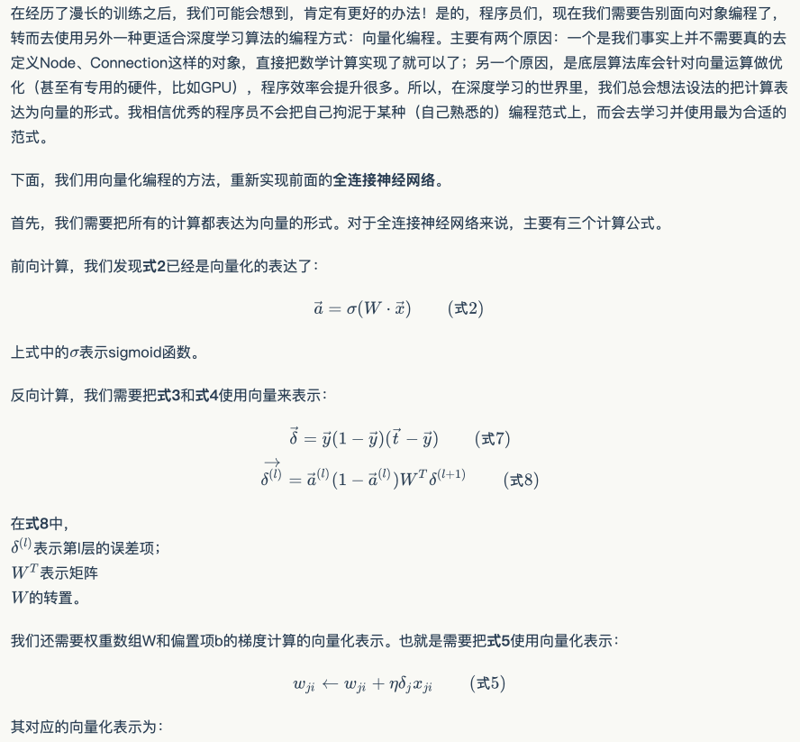

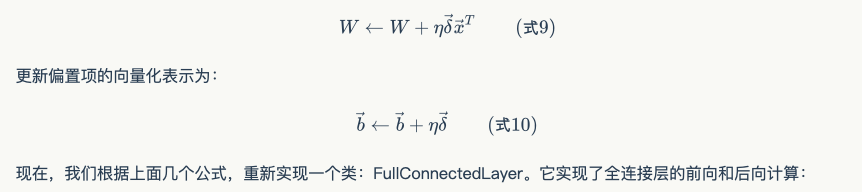

```python
# 全连接层实现类
class FullConnectedLayer(object):
    def __init__(self, input_size, output_size, 
                 activator):
        '''
        构造函数
        input_size: 本层输入向量的维度
        output_size: 本层输出向量的维度
        activator: 激活函数
        '''
        self.input_size = input_size
        self.output_size = output_size
        self.activator = activator
        # 权重数组W
        self.W = np.random.uniform(-0.1, 0.1,
            (output_size, input_size))
        # 偏置项b
        self.b = np.zeros((output_size, 1))
        # 输出向量
        self.output = np.zeros((output_size, 1))
    def forward(self, input_array):
        '''
        前向计算
        input_array: 输入向量，维度必须等于input_size
        '''
        # 式2
        self.input = input_array
        self.output = self.activator.forward(
            np.dot(self.W, input_array) + self.b)
    def backward(self, delta_array):
        '''
        反向计算W和b的梯度
        delta_array: 从上一层传递过来的误差项
        '''
        # 式8
        self.delta = self.activator.backward(self.input) * np.dot(
            self.W.T, delta_array)
        self.W_grad = np.dot(delta_array, self.input.T)
        self.b_grad = delta_array
    def update(self, learning_rate):
        '''
        使用梯度下降算法更新权重
        '''
        self.W += learning_rate * self.W_grad
        self.b += learning_rate * self.b_grad
```

上面这个类一举取代了原先的Layer、Node、Connection等类，不但代码更加容易理解，而且运行速度也快了几百倍。

现在，我们对Network类稍作修改，使之用到FullConnectedLayer：

```python
# Sigmoid激活函数类
class SigmoidActivator(object):
    def forward(self, weighted_input):
        return 1.0 / (1.0 + np.exp(-weighted_input))
    def backward(self, output):
        return output * (1 - output)
# 神经网络类
class Network(object):
    def __init__(self, layers):
        '''
        构造函数
        '''
        self.layers = []
        for i in range(len(layers) - 1):
            self.layers.append(
                FullConnectedLayer(
                    layers[i], layers[i+1],
                    SigmoidActivator()
                )
            )
    def predict(self, sample):
        '''
        使用神经网络实现预测
        sample: 输入样本
        '''
        output = sample
        for layer in self.layers:
            layer.forward(output)
            output = layer.output
        return output
    def train(self, labels, data_set, rate, epoch):
        '''
        训练函数
        labels: 样本标签
        data_set: 输入样本
        rate: 学习速率
        epoch: 训练轮数
        '''
        for i in range(epoch):
            for d in range(len(data_set)):
                self.train_one_sample(labels[d], 
                    data_set[d], rate)
    def train_one_sample(self, label, sample, rate):
        self.predict(sample)
        self.calc_gradient(label)
        self.update_weight(rate)
    def calc_gradient(self, label):
        delta = self.layers[-1].activator.backward(
            self.layers[-1].output
        ) * (label - self.layers[-1].output)
        for layer in self.layers[::-1]:
            layer.backward(delta)
            delta = layer.delta
        return delta
    def update_weight(self, rate):
        for layer in self.layers:
            layer.update(rate)
```

现在，Network类也清爽多了，用我们的新代码再次训练一下MNIST数据集吧。

## 小结

至此，你已经完成了又一次漫长的学习之旅。你现在应该已经明白了神经网络的基本原理，高兴的话，你甚至有能力去动手实现一个，并用它解决一些问题。如果感到困难也不要气馁，这篇文章是一个重要的分水岭，如果你完全弄明白了的话，在真正的『小白』和装腔作势的『大牛』面前吹吹牛是完全没有问题的。

作为深度学习入门的系列文章，本文也是上半场的结束。在这个半场，你掌握了机器学习、神经网络的**基本**概念，并且有能力去动手解决一些简单的问题（例如手写数字识别，如果用传统的观点来看，其实这些问题也不简单）。而且，一旦掌握基本概念，后面的学习就容易多了。

在下半场，我们讲介绍更多『深度』学习的内容，我们已经讲了神经网络(Neutrol Network)，但是并没有讲深度神经网络(Deep Neutrol Network)。Deep会带来更加强大的能力，同时也带来更多的问题。如果不理解这些问题和它们的解决方案，也不能说你入门了『深度』学习。

目前业界有很多开源的神经网络实现，它们的功能也要强大的多，因此你并不需要事必躬亲的去实现自己的神经网络。我们在上半场不断的从头发明轮子，是为了让你明白神经网络的基本原理，这样你就能非常迅速的掌握这些工具。在下半场的文章中，我们改变了策略：不会再去从头开始去实现，而是尽可能应用现有的工具。

下一篇文章，我们介绍不同结构的神经网络，比如鼎鼎大名的**卷积神经网络**，它在图像和语音领域已然创造了诸多奇迹，在自然语言处理领域的研究也如火如荼。某种意义上说，它的成功大大提升了人们对于深度学习的信心。


## 参考资料

> https://www.zybuluo.com/hanbingtao/note/476663#an1