#  线性单元和梯度下降

2020年10月30日

---

## 往期回顾

在上一篇文章中，我们已经学会了编写一个简单的感知器，并用它来实现一个线性分类器。你应该还记得用来训练感知器的『感知器规则』。然而，我们并没有关心这个规则是怎么得到的。本文通过介绍另外一种『感知器』，也就是『线性单元』，来说明关于机器学习一些基本的概念，比如模型、目标函数、优化算法等等。这些概念对于所有的机器学习算法来说都是通用的，掌握了这些概念，就掌握了机器学习的基本套路。

## 线性单元是啥

感知器有一个问题，当面对的数据集不是**线性可分**的时候，『感知器规则』可能无法收敛，这意味着我们永远也无法完成一个感知器的训练。为了解决这个问题，我们使用一个**可导**的**线性函数**来替代感知器的**阶跃函数**，这种感知器就叫做**线性单元**。线性单元在面对线性不可分的数据集时，会收敛到一个最佳的近似上。

为了简单起见，我们可以设置线性单元的激活函数f为

`f(x)=x`


这样的线性单元如下图所示

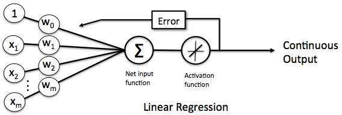

对比此前我们讲过的感知器


这样替换了激活函数之后，**线性单元**将返回一个**实数值**而不是**0,1分类**。因此线性单元用来解决**回归**问题而不是**分类**问题。

### 线性单元的模型

当我们说**模型**时，我们实际上在谈论根据输入预测输出的**算法**。比如，可以是一个人的工作年限，可以是他的月薪，我们可以用某种算法来根据一个人的工作年限来预测他的收入。比如：

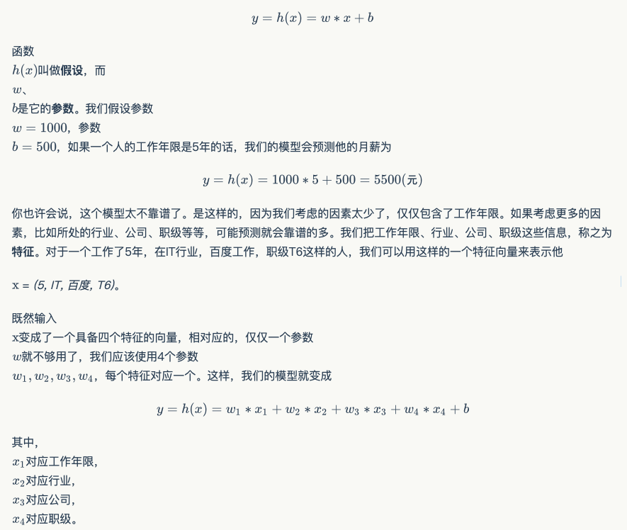

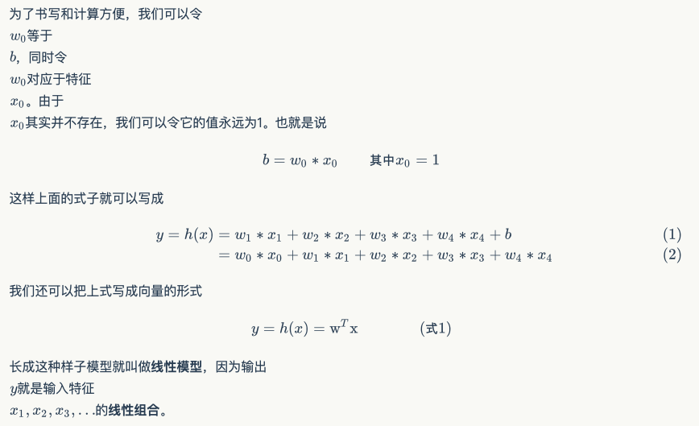

### 监督学习和无监督学习

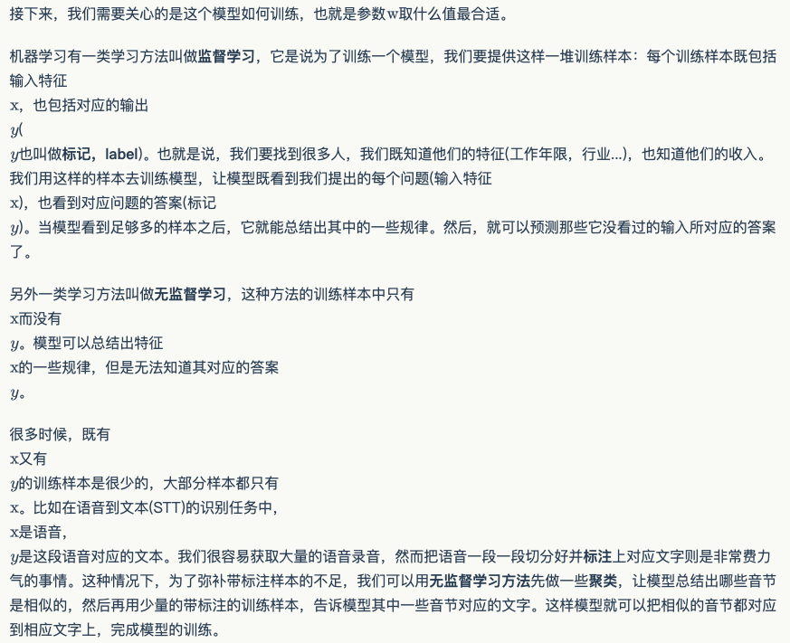

### 线性单元的目标函数

现在，让我们只考虑**监督学习**。

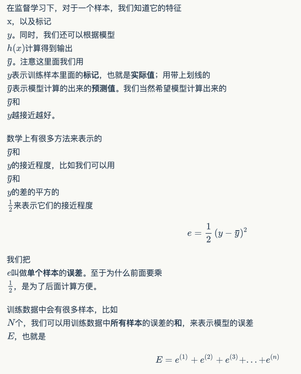

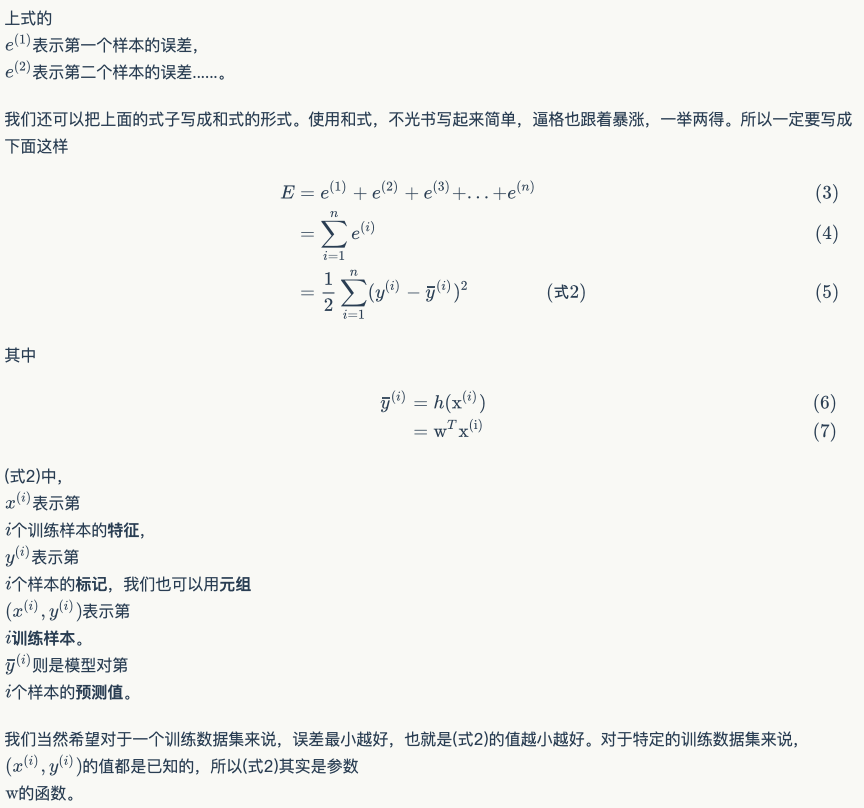

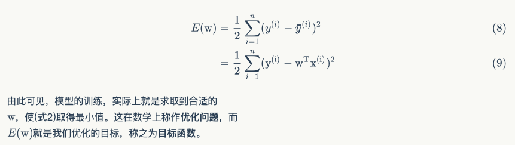

### 梯度下降优化算法

大学时我们学过怎样求函数的极值。函数的极值点，就是它的导数的那个点。因此我们可以通过解方程，求得函数的极值点。

不过对于计算机来说，它可不会解方程。但是它可以凭借强大的计算能力，一步一步的去把函数的极值点『试』出来。如下图所示：

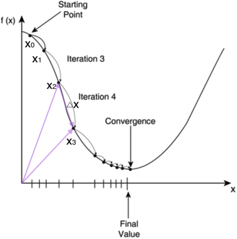

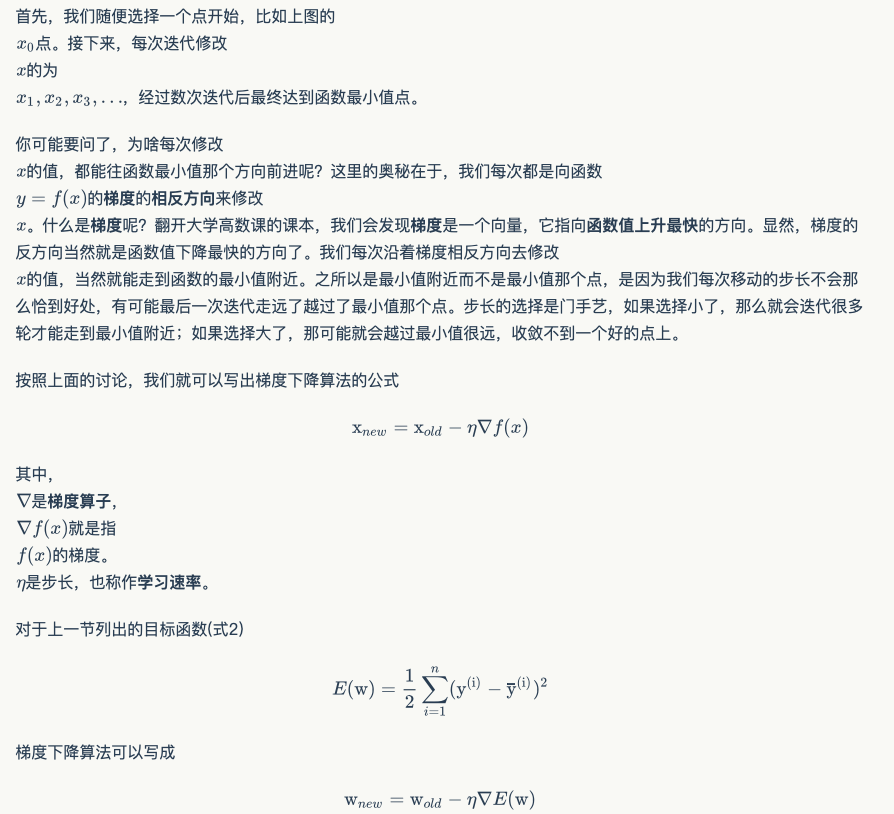

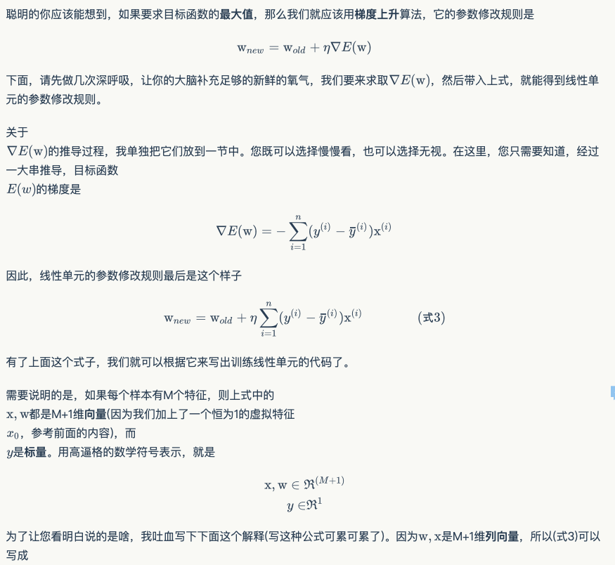

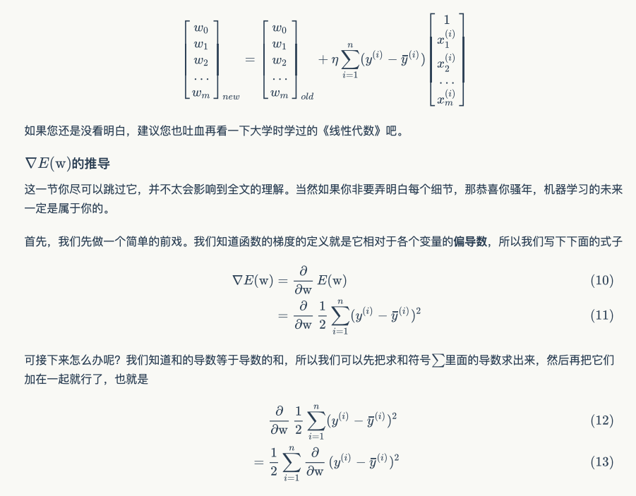

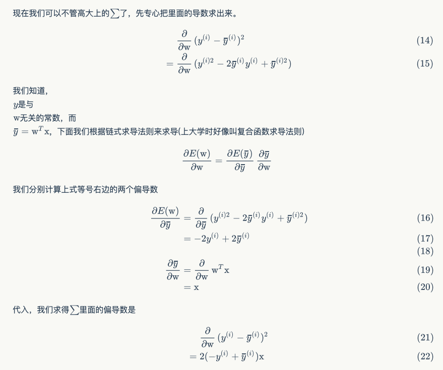

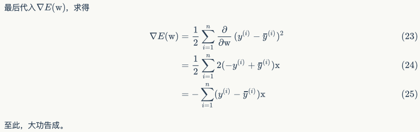

### 随机梯度下降算法(Stochastic Gradient Descent, SGD)

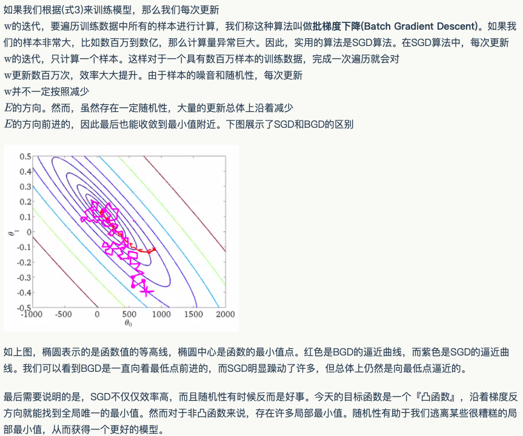

## 实现线性单元

[linear_unit](https://github.com/FelixFu520/dl-by-hand/blob/master/linear_unit.py)

接下来，让我们撸一把代码。

因为我们已经写了感知器的代码，因此我们先比较一下感知器模型和线性单元模型，看看哪些代码能够复用。

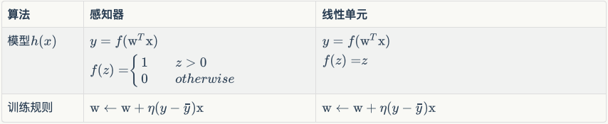

比较的结果令人震惊，原来除了激活函数f不同之外，两者的模型和训练规则是一样的(在上表中，线性单元的优化算法是SGD算法)。那么，我们只需要把感知器的激活函数进行替换即可。感知器的代码请参考上一篇文章[零基础入门深度学习(1) - 感知器](https://www.zybuluo.com/hanbingtao/note/433855)，这里就不再重复了。对于一个养成良好习惯的程序员来说，重复代码是不可忍受的。大家应该把代码保存在一个代码库中(比如git)。

```python
from perceptron import Perceptron
#定义激活函数f
f = lambda x: x
class LinearUnit(Perceptron):
    def __init__(self, input_num):
        '''初始化线性单元，设置输入参数的个数'''
        Perceptron.__init__(self, input_num, f)
```

通过继承Perceptron，我们仅用几行代码就实现了线性单元。这再次证明了面向对象编程范式的强大。

接下来，我们用简单的数据进行一下测试。

```python
def get_training_dataset():
    '''
    捏造5个人的收入数据
    '''
    # 构建训练数据
    # 输入向量列表，每一项是工作年限
    input_vecs = [[5], [3], [8], [1.4], [10.1]]
    # 期望的输出列表，月薪，注意要与输入一一对应
    labels = [5500, 2300, 7600, 1800, 11400]
    return input_vecs, labels    
def train_linear_unit():
    '''
    使用数据训练线性单元
    '''
    # 创建感知器，输入参数的特征数为1（工作年限）
    lu = LinearUnit(1)
    # 训练，迭代10轮, 学习速率为0.01
    input_vecs, labels = get_training_dataset()
    lu.train(input_vecs, labels, 10, 0.01)
    #返回训练好的线性单元
    return lu
if __name__ == '__main__': 
    '''训练线性单元'''
    linear_unit = train_linear_unit()
    # 打印训练获得的权重
    print linear_unit
    # 测试
    print 'Work 3.4 years, monthly salary = %.2f' % linear_unit.predict([3.4])
    print 'Work 15 years, monthly salary = %.2f' % linear_unit.predict([15])
    print 'Work 1.5 years, monthly salary = %.2f' % linear_unit.predict([1.5])
    print 'Work 6.3 years, monthly salary = %.2f' % linear_unit.predict([6.3])
```

程序运行结果如下图

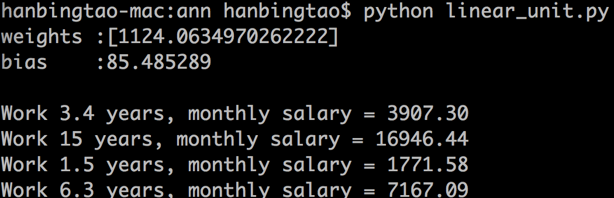

拟合的直线如下图

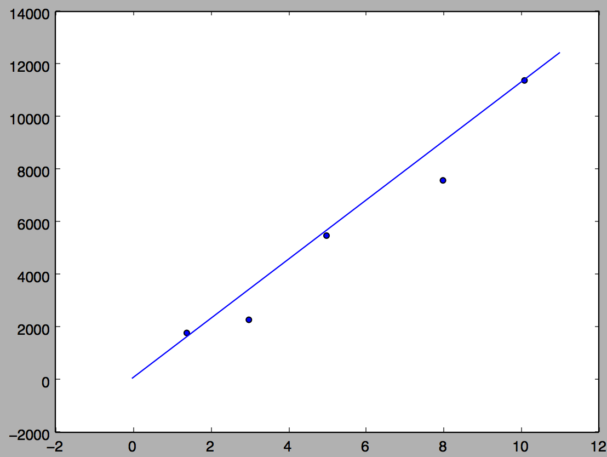

## 小结

事实上，一个机器学习算法其实只有两部分

- *模型* 从输入特征预测输入的那个函数
- *目标函数* 目标函数取最小(最大)值时所对应的参数值，就是模型的参数的**最优值**。很多时候我们只能获得目标函数的**局部最小(最大)值**，因此也只能得到模型参数的**局部最优值**。

因此，如果你想最简洁的介绍一个算法，列出这两个函数就行了。

接下来，你会用**优化算法**去求取目标函数的最小(最大)值。**[随机]梯度{下降|上升}**算法就是一个**优化算法**。针对同一个**目标函数**，不同的**优化算法**会推导出不同的**训练规则**。我们后面还会讲其它的优化算法。

其实在机器学习中，算法往往并不是关键，真正的关键之处在于选取特征。选取特征需要我们人类对问题的深刻理解，经验、以及思考。而**神经网络**算法的一个优势，就在于它能够自动学习到应该提取什么特征，从而使算法不再那么依赖人类，而这也是神经网络之所以吸引人的一个方面。

现在，经过漫长的烧脑，你已经具备了学习**神经网络**的必备知识。下一篇文章，我们将介绍本系列文章的主角：**神经网络**，以及用来训练神经网络的大名鼎鼎的算法：**反向传播**算法。至于现在，我们应该暂时忘记一切，尽情奖励自己一下吧。