# [LSTM模型与前向反向传播算法](https://www.cnblogs.com/pinard/p/6519110.html)

2020年12月2日

---

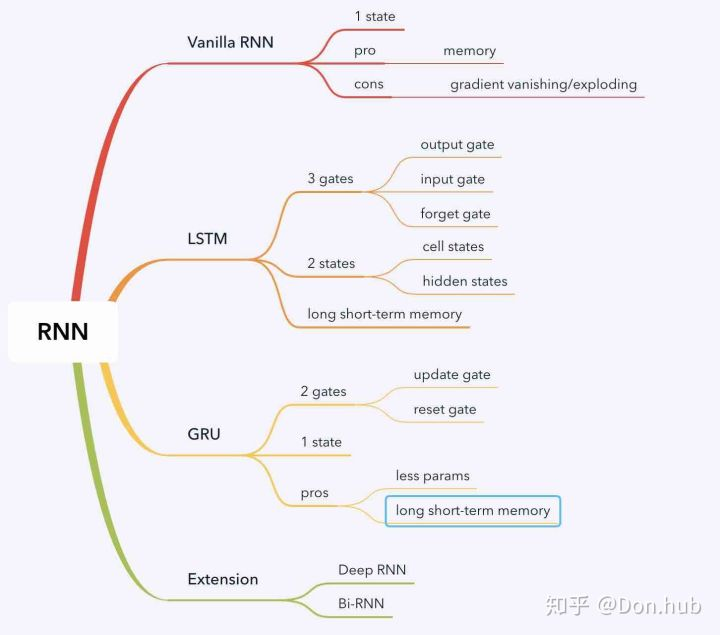

在[循环神经网络(RNN)模型与前向反向传播算法](http://www.cnblogs.com/pinard/p/6509630.html)中，我们总结了对RNN模型做了总结。由于RNN也有梯度消失的问题，因此很难处理长序列的数据，大牛们对RNN做了改进，得到了RNN的特例LSTM（Long Short-Term Memory），它可以避免常规RNN的梯度消失，因此在工业界得到了广泛的应用。下面我们就对LSTM模型做一个总结。

## 1. 从RNN到LSTM

LSTM的全称是Long Short Term Memory，顾名思义，它具有记忆长短期信息的能力的神经网络。LSTM首先在1997年由Hochreiter & Schmidhuber [1] 提出，由于深度学习在2012年的兴起，LSTM又经过了若干代大牛(Felix Gers, Fred Cummins, Santiago Fernandez, Justin Bayer, Daan Wierstra, Julian Togelius, Faustino Gomez, Matteo Gagliolo, and Alex Gloves)的发展，由此便形成了比较系统且完整的LSTM框架，并且在很多领域得到了广泛的应用。本文着重介绍深度学习时代的LSTM。

LSTM提出的动机是为了解决长期依赖问题。传统的RNN节点输出仅由权值，偏置以及激活函数决定。RNN是一个链式结构，每个时间片使用的是相同的参数。

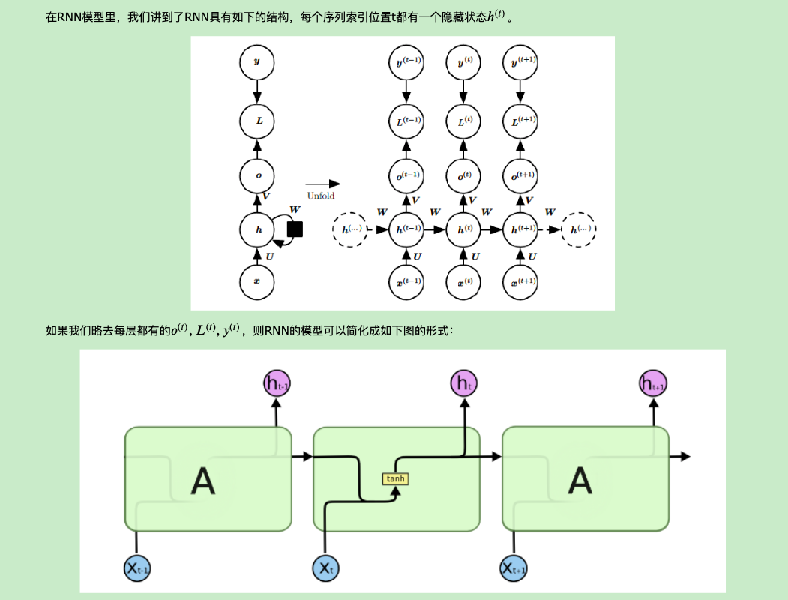

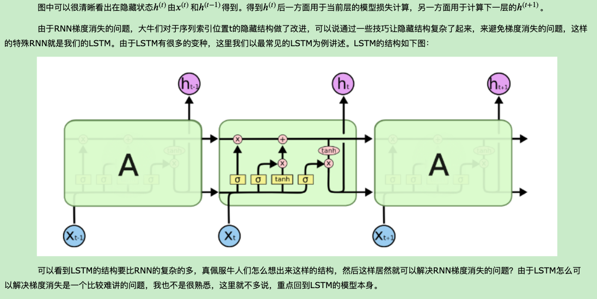

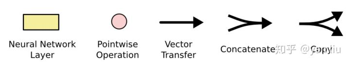

## 2. LSTM模型结构剖析

　　　　上面我们给出了LSTM的模型结构，下面我们就一点点的剖析LSTM模型在每个序列索引位置t时刻的内部结构。

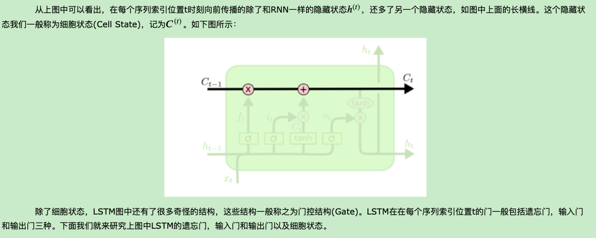

### 2.1 LSTM之遗忘门

　　　　遗忘门（forget gate）顾名思义，是控制是否遗忘的，在LSTM中即以一定的概率控制是否遗忘上一层的隐藏细胞状态。遗忘门子结构如下图所示：

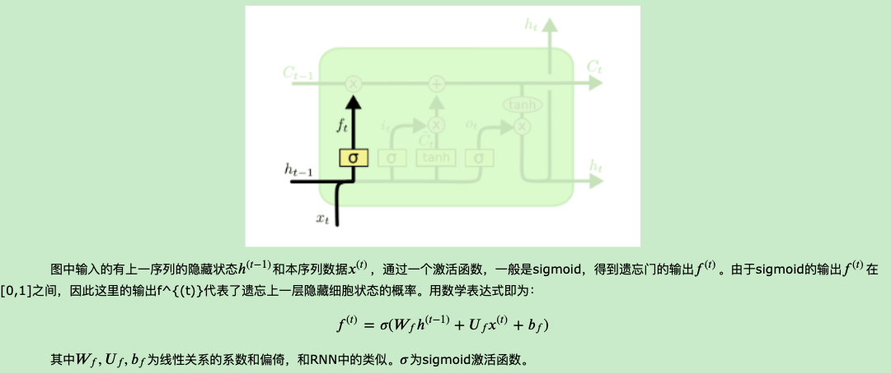

![[公式]](https://www.zhihu.com/equation?tex=C_t+%3D+f_t+%5Ctimes+C_%7Bt-1%7D+%2B+i_t+%5Ctimes+%5Ctilde%7BC%7D_t+%5Ctag%7B3%7D)

其中 ![[公式]](https://www.zhihu.com/equation?tex=f_t) 叫做遗忘门，表示 ![[公式]](https://www.zhihu.com/equation?tex=C_%7Bt-1%7D) 的哪些特征被用于计算 ![[公式]](https://www.zhihu.com/equation?tex=C_t) 。 ![[公式]](https://www.zhihu.com/equation?tex=f_t) 是一个向量，向量的每个元素均位于 ![[公式]](https://www.zhihu.com/equation?tex=%5B0%2C1%5D) 范围内。通常我们使用 ![[公式]](https://www.zhihu.com/equation?tex=sigmoid) 作为激活函数， ![[公式]](https://www.zhihu.com/equation?tex=sigmoid) 的输出是一个介于 ![[公式]](https://www.zhihu.com/equation?tex=%5B0%2C+1%5D) 区间内的值，但是当你观察一个训练好的LSTM时，你会发现门的值绝大多数都非常接近0或者1，其余的值少之又少。其中 ![[公式]](https://www.zhihu.com/equation?tex=%5Cotimes) 是LSTM最重要的门机制，表示 ![[公式]](https://www.zhihu.com/equation?tex=f_t) 和 ![[公式]](https://www.zhihu.com/equation?tex=C_%7Bt-1%7D) 之间的单位乘的关系。

### 2.2 LSTM之输入门

　　　　输入门（input gate）负责处理当前序列位置的输入，它的子结构如下图：

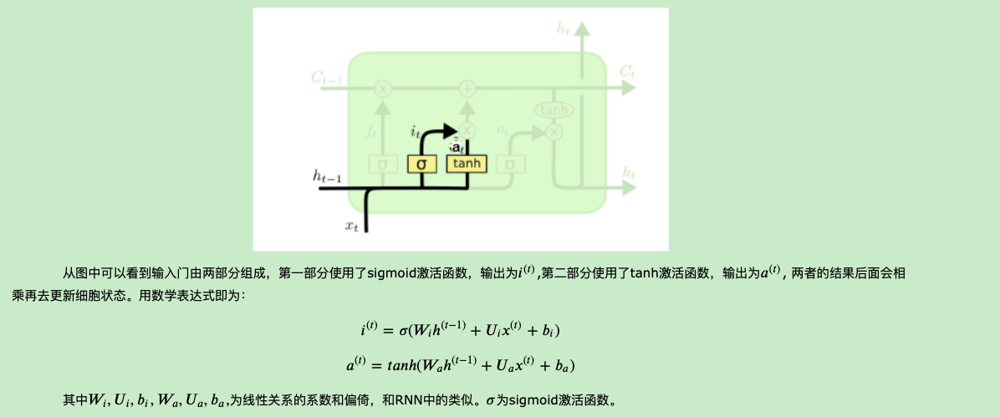

![[公式]](https://www.zhihu.com/equation?tex=%5Ctilde%7BC%7D_t) *表示单元状态更新值，由输入数据* ![[公式]](https://www.zhihu.com/equation?tex=x_t) *和隐节点* ![[公式]](https://www.zhihu.com/equation?tex=h_%7Bt-1%7D) 经由一个神经网络层得到，单元状态更新值的激活函数通常使用 ![[公式]](https://www.zhihu.com/equation?tex=tanh) 。 ![[公式]](https://www.zhihu.com/equation?tex=i_t) 叫做输入门，同 ![[公式]](https://www.zhihu.com/equation?tex=f_t) 一样也是一个元素介于 ![[公式]](https://www.zhihu.com/equation?tex=%5B0%2C+1%5D) 区间内的向量，同样由 ![[公式]](https://www.zhihu.com/equation?tex=x_t) 和 ![[公式]](https://www.zhihu.com/equation?tex=h_%7Bt-1%7D) 经由 ![[公式]](https://www.zhihu.com/equation?tex=sigmoid) 激活函数计算而成。

### 2.3 LSTM之细胞状态更新

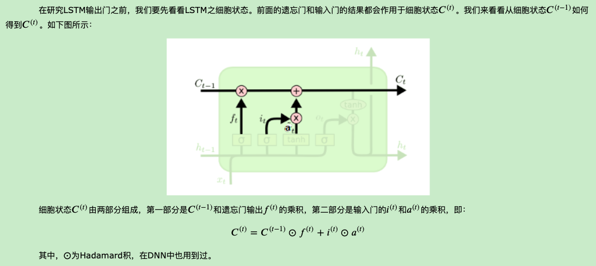

![[公式]](https://www.zhihu.com/equation?tex=i_t) 用于控制 ![[公式]](https://www.zhihu.com/equation?tex=%5Ctilde%7BC%7D_t) 的哪些特征用于更新 ![[公式]](https://www.zhihu.com/equation?tex=C_t)

### 2.4 LSTM之输出门

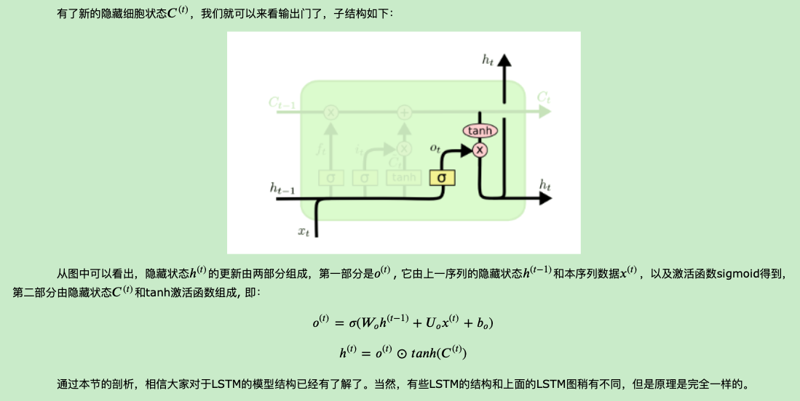

![[公式]](https://www.zhihu.com/equation?tex=h_t) 由输出门 ![[公式]](https://www.zhihu.com/equation?tex=o_t) 和单元状态 ![[公式]](https://www.zhihu.com/equation?tex=C_t) 得到，其中 ![[公式]](https://www.zhihu.com/equation?tex=o_t) 的计算方式和 ![[公式]](https://www.zhihu.com/equation?tex=f_t) 以及 ![[公式]](https://www.zhihu.com/equation?tex=i_t) 相同。在[3]的论文中指出，通过将 ![[公式]](https://www.zhihu.com/equation?tex=b_o) 的均值初始化为 ![[公式]](https://www.zhihu.com/equation?tex=1) ，可以使LSTM达到同GRU近似的效果。

## 3. LSTM前向传播算法

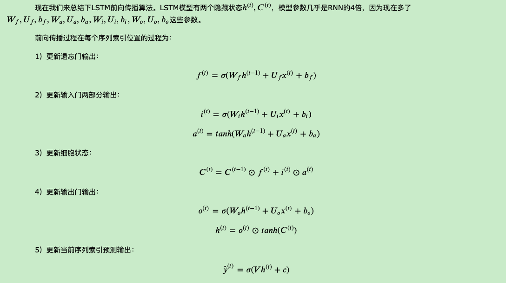

## 4.  LSTM反向传播算法推导关键点

　　　　有了LSTM前向传播算法，推导反向传播算法就很容易了， 思路和RNN的反向传播算法思路一致，也是通过梯度下降法迭代更新我们所有的参数，关键点在于计算所有参数基于损失函数的偏导数。

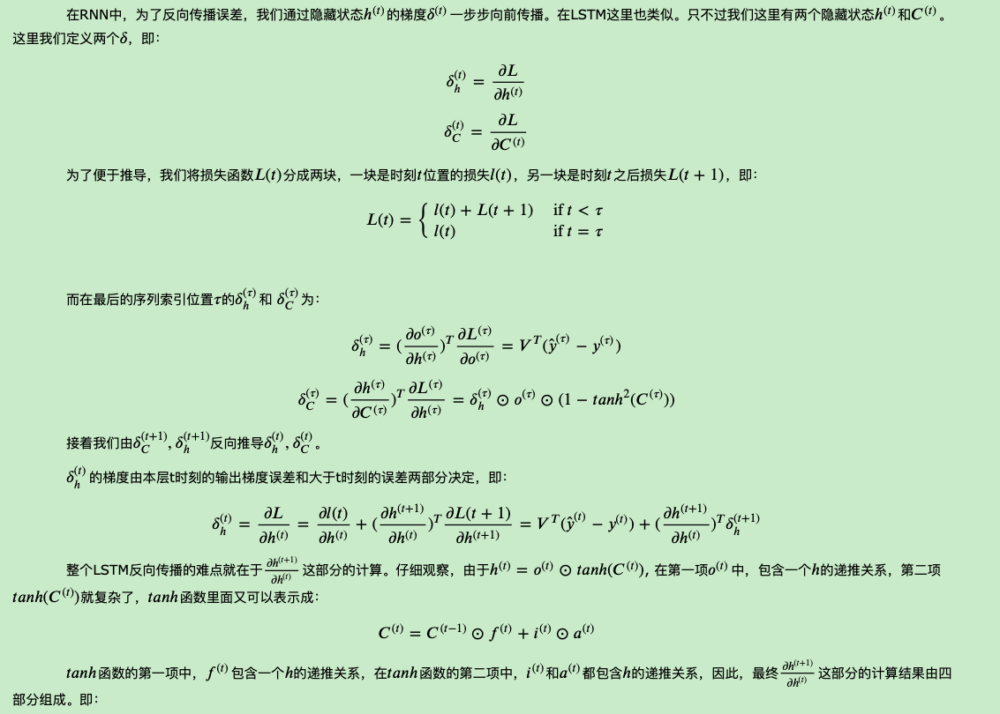

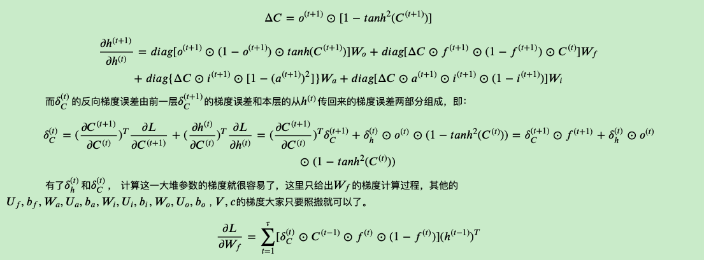

## 5.. LSTM小结

　　　　LSTM虽然结构复杂，但是只要理顺了里面的各个部分和之间的关系，进而理解前向反向传播算法是不难的。当然实际应用中LSTM的难点不在前向反向传播算法，这些有算法库帮你搞定，模型结构和一大堆参数的调参才是让人头痛的问题。不过，理解LSTM模型结构仍然是高效使用的前提。