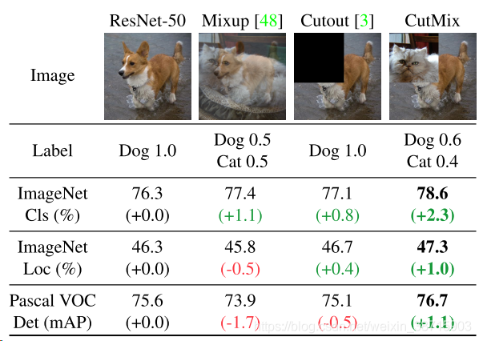
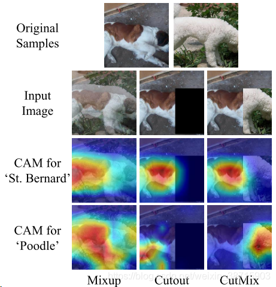
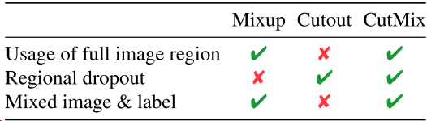
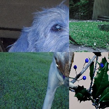
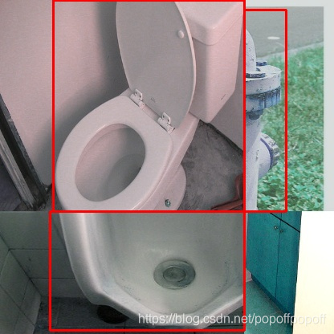

# mosaic 数据增强

2020年9月29日

---

Yolov4的mosaic 数据增强是参考CutMix数据增强，理论上类似，CutMix的理论可以参考这篇[CutMix](https://blog.csdn.net/weixin_38715903/article/details/103999227)，但是mosaic利用了四张图片，据论文其优点是丰富检测物体的背景，且在BN计算的时候一下子会计算四张图片的数据，使得mini-batch大小不需要很大，那么一个GPU就可以达到比较好的效果。

## 1 CutMix：数据增强

看论文的原因：学习mixup的时候发现的这篇论文，读读看！

论文地址：https://arxiv.org/abs/1905.04899v2

### 1.1 几种数据增强的区别:Mixup,Cutout,CutMix

- Mixup:将随机的两张样本按比例混合，分类的结果按比例分配；
- Cutout:随机的将样本中的部分区域cut掉，并且填充0像素值，分类的结果不变；
- CutMix:就是将一部分区域cut掉但不填充0像素而是随机填充训练集中的其他数据的区域像素值，分类结果按一定的比例分配



- 上述三种数据增强的区别：cutout和cutmix就是填充区域像素值的区别；mixup和cutmix是混合两种样本方式上的区别：mixup是将两张图按比例进行插值来混合样本，cutmix是采用cut部分区域再补丁的形式去混合图像，不会有图像混合后不自然的情形
- 优点：

1. 在训练过程中不会出现非信息像素，从而能够提高训练效率；
2. 保留了regional dropout的优势，能够关注目标的non-discriminative parts；
3. 通过要求模型从局部视图识别对象，对cut区域中添加其他样本的信息，能够进一步增强模型的定位能力；
4. 不会有图像混合后不自然的情形，能够提升模型分类的表现；
5. 训练和推理代价保持不变。

### 1.2 CutMix的原理【与代码一同食用更好消化】

和是两个不同的训练样本，和是对应的标签值，CutMix需要生成的是新的训练样本和对应标签：和，公式如下：

​                         

​                             

是为了dropd掉部分区域和进行填充的二进制掩码，是逐像素相乘，是所有元素都为1 的二进制掩码，与Mixup一样属于Beta分布：，令则服从（0，1）的均匀分布。

为了对二进制掩进行采样，首先要对剪裁区域的边界框进行采样，用来对样本和做裁剪区域的指示标定。在论文中对矩形掩码进行采样（长宽与样本大小成比例）。

剪裁区域的边界框采样公式如下：

​                        

​                         

保证剪裁区域的比例为，确定好裁剪区域之后，将制掩中的裁剪区域置0，其他区域置1。就完成了掩码的采样，然后将样本A中的剪裁区域移除，将样本B中的剪裁区域进行裁剪然后填充到样本A。

### 1.3 论文中的一些讨论内容

**1）.What does model learn with CutMix?** 

作者通过热力图，给出了结果。CutMix的操作使得模型能够从一幅图像上的局部视图上识别出两个目标，提高训练的效率。由图可以看出，Cutout能够使得模型专注于目标较难区分的区域（腹部），但是有一部分区域是没有任何信息的，会影响训练效率；Mixup的话会充分利用所有的像素信息，但是会引入一些非常不自然的伪像素信息。



同时作者也给出了一个信息利用的对比表格，CutMix能有效地改善数据增强的效果，准确的定位和分类



### 1.4 看看代码

[代码地址：https://github.com/clovaai/CutMix-PyTorch](https://github.com/clovaai/CutMix-PyTorch)

https://github.com/TD-4/CutMix-PyTorch

1).生成剪裁区域：

```python
"""train.py 279-295行"""
"""输入为：样本的size和生成的随机lamda值"""
def rand_bbox(size, lam):
    W = size[2]
    H = size[3]
    """1.论文里的公式2，求出B的rw,rh"""
    cut_rat = np.sqrt(1. - lam)
    cut_w = np.int(W * cut_rat)
    cut_h = np.int(H * cut_rat)
 
    # uniform
    """2.论文里的公式2，求出B的rx,ry（bbox的中心点）"""
    cx = np.random.randint(W)
    cy = np.random.randint(H)
    #限制坐标区域不超过样本大小
 
    bbx1 = np.clip(cx - cut_w // 2, 0, W)
    bby1 = np.clip(cy - cut_h // 2, 0, H)
    bbx2 = np.clip(cx + cut_w // 2, 0, W)
    bby2 = np.clip(cy + cut_h // 2, 0, H)
    """3.返回剪裁B区域的坐标值"""
    return bbx1, bby1, bbx2, bby2
```

2).整体流程：

```python
"""train.py 220-244行"""
for i, (input, target) in enumerate(train_loader):
    # measure data loading time
    data_time.update(time.time() - end)
 
    input = input.cuda()
    target = target.cuda()
    r = np.random.rand(1)
    if args.beta > 0 and r < args.cutmix_prob:
        # generate mixed sample
        """1.设定lamda的值，服从beta分布"""
        lam = np.random.beta(args.beta, args.beta)
        """2.找到两个随机样本"""
        rand_index = torch.randperm(input.size()[0]).cuda()
        target_a = target#一个batch
        target_b = target[rand_index] #batch中的某一张
        """3.生成剪裁区域B"""
        bbx1, bby1, bbx2, bby2 = rand_bbox(input.size(), lam)
        """4.将原有的样本A中的B区域，替换成样本B中的B区域"""
        input[:, :, bbx1:bbx2, bby1:bby2] = input[rand_index, :, bbx1:bbx2, bby1:bby2]
        # adjust lambda to exactly match pixel ratio
        """5.根据剪裁区域坐标框的值调整lam的值"""
        lam = 1 - ((bbx2 - bbx1) * (bby2 - bby1) / (input.size()[-1] * input.size()[-2]))
        # compute output
        """6.将生成的新的训练样本丢到模型中进行训练"""
        output = model(input)
        """7.按lamda值分配权重"""
        loss = criterion(output, target_a) * lam + criterion(output, target_b) * (1. - lam)
    else:
        # compute output
        output = model(input)
        loss = criterion(output, target)


```

差不多就这样。


## 2 CutMix 实现方法

伪代码：

```
for data, target in batches:
	w, h  = (data[0]).shape
	cut_x = random(0.2w, 0.8w)
	cut_y = random(0.2h, 0.8h)
	s1, s2, s3, s4 = area(block1) / wh, .....(分块所占比例)
	d1 = data[random_index][0, :(h-cut_y), 0:cut_x, :]
	d2 = data[random_index][1, (h-cut_y):, 0:cut_x, :]
	d3 = data[random_index][2, (h-cut_y):, cut_x:, :]
	d4 = data[random_index][3, :(h-cut_y), cut_x:, :]
	x = concat(d1, d2, d3, d4)
	y = target[random_index]*s1 + target[random_index]*s2 + target[random_index]*s3 + target[random_index]*s4
```

以上伪代码适用于分类的数据，检测的数据需要合并annotations,后面更新。

效果图：



对于用于检测的数据，首先对图片的处理和上面对分类数据处理一致，对于annotations需要对框的坐标在合成图中进行调整，超出边界的需要裁剪，效果图如下：




## 参考

> [Yolov4 mosaic 数据增强](https://blog.csdn.net/popoffpopoff/article/details/105795999)
>
> 