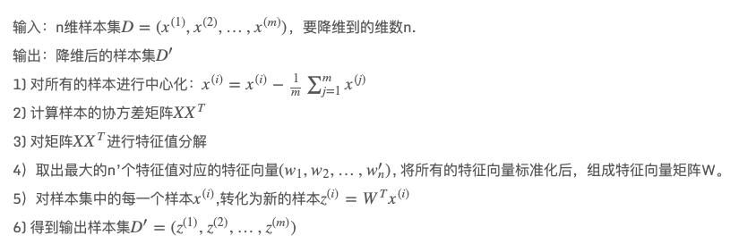
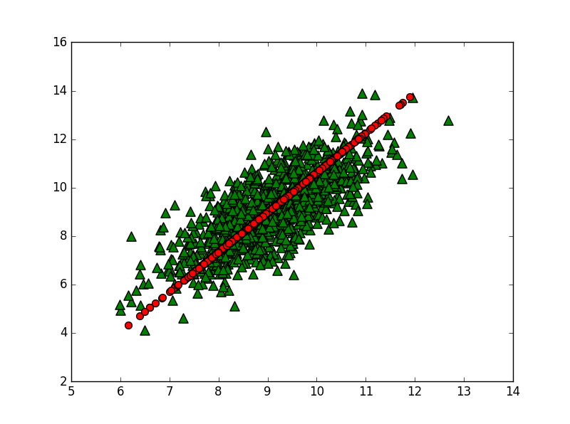
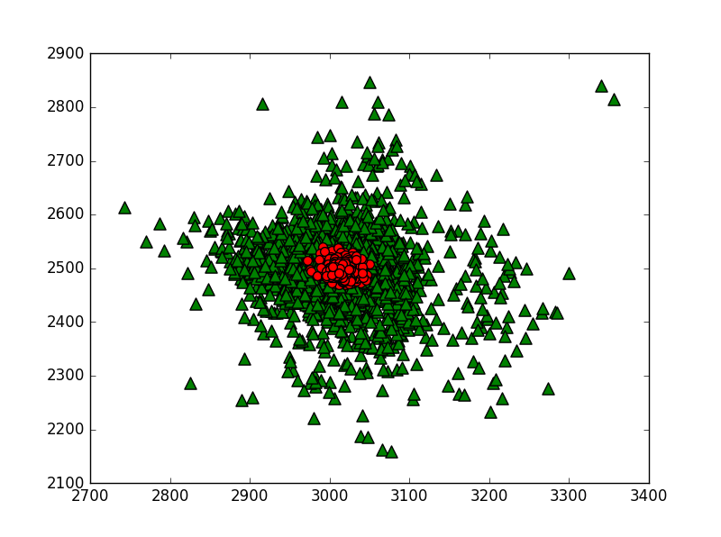

## 一步步教你轻松学主成分分析PCA降维算法

2021年1月14日

---

> 摘要：主成分分析（英语：Principal components analysis，PCA）是一种分析、简化数据集的技术。主成分分析经常用于减少数据集的维数，同时保持数据集中的对方差贡献最大的特征。常常应用在文本处理、人脸识别、图片识别、自然语言处理等领域。可以做在数据预处理阶段非常重要的一环，本文首先对基本概念进行介绍，然后给出PCA算法思想、流程、优缺点等等。最后通过一个综合案例去实现应用。（本文原创，转载必须注明出处.）


## 1. 数据降维

### 1.1 预备知识

- 均值
- 方差
- 标准差
- 协方差
- 正交矩阵

### 1.2 什么是降维

降维是对数据高维度特征的一种预处理方法。降维是将高维度的数据保留下最重要的一些特征，去除噪声和不重要的特征，从而实现提升数据处理速度的目的。在实际的生产和应用中，降维在一定的信息损失范围内，可以为我们节省大量的时间和成本。降维也成为了应用非常广泛的数据预处理方法。

我们正通过电视观看体育比赛，在电视的显示器上有一个足球。显示器大概包含了100万像素点，而球则可能是由较少的像素点组成，例如说一千个像素点。人们实时的将显示器上的百万像素转换成为一个三维图像，该图像就给出运动场上球的位置。在这个过程中，人们已经将百万像素点的数据，降至为三维。这个过程就称为降维(dimensionality reduction)

> 数据降维的目的：

- 使得数据集更容易使用
- 确保这些变量是相互独立的
- 降低很多算法的计算开销
- 去除噪音
- 使得结果易懂

> 适用范围:

- 在已标注与未标注的数据上都有降维技术。
- 本文主要关注未标注数据上的降维技术，将技术同样也可以应用于已标注的数据。

> 常见降维技术（PCA的应用目前最为广泛）

- 主成分分析就是找出一个最主要的特征，然后进行分析。例如： 考察一个人的智力情况，就直接看数学成绩就行(数学、语文、英语成绩)
- 因子分析(Factor Analysis),将多个实测变量转换为少数几个综合指标。它反映一种降维的思想，通过降维将相关性高的变量聚在一起,从而减少需要分析的变量的数量,而减少问题分析的复杂性.例如： 考察一个人的整体情况，就直接组合3样成绩(隐变量)，看平均成绩就行(存在：数学、语文、英语成绩),应用的领域包括社会科学、金融等。在因子分析中，
  - 假设观察数据的成分中有一些观察不到的隐变量(latent variable)。
  - 假设观察数据是这些隐变量和某些噪音的线性组合。
  - 那么隐变量的数据可能比观察数据的数目少，也就说通过找到隐变量就可以实现数据的降维。
- 独立成分分析(Independ Component Analysis, ICA)，ICA 认为观测信号是若干个独立信号的线性组合，ICA 要做的是一个解混过程。
  - 例如：我们去ktv唱歌，想辨别唱的是什么歌曲？ICA 是观察发现是原唱唱的一首歌【2个独立的声音（原唱／主唱）】。
  - ICA 是假设数据是从 N 个数据源混合组成的，这一点和因子分析有些类似，这些数据源之间在统计上是相互独立的，而在 PCA 中只假设数据是不 相关（线性关系）的。同因子分析一样，如果数据源的数目少于观察数据的数目，则可以实现降维过程。

## 2. PCA 概述

主成分分析(Principal Component Analysis, PCA)：通俗理解：就是找出一个最主要的特征，然后进行分析。

主成分分析（英语：Principal components analysis，PCA）是一种分析、简化数据集的技术。主成分分析经常用于减少数据集的维数，同时保持数据集中的对方差贡献最大的特征。这是通过保留低阶主成分，忽略高阶主成分做到的。这样低阶成分往往能够保留住数据的最重要方面。但是，这也不是一定的，要视具体应用而定。由于主成分分析依赖所给数据，所以数据的准确性对分析结果影响很大。

主成分分析由卡尔·皮尔逊于1901年发明，用于分析数据及建立数理模型。其方法主要是通过对协方差矩阵进行特征分解，以得出数据的主成分（即特征向量）与它们的权值（即特征值）。PCA是最简单的以特征量分析多元统计分布的方法。其结果可以理解为对原数据中的方差做出解释：哪一个方向上的数据值对方差的影响最大？换而言之，PCA提供了一种降低数据维度的有效办法；如果分析者在原数据中除掉最小的特征值所对应的成分，那么所得的低维度数据必定是最优化的（也即，这样降低维度必定是失去讯息最少的方法）。主成分分析在分析复杂数据时尤为有用，比如人脸识别。

PCA是最简单的以特征量分析多元统计分布的方法。通常情况下，这种运算可以被看作是揭露数据的内部结构，从而更好的解释数据的变量的方法。如果一个多元数据集能够在一个高维数据空间坐标系中被显现出来，那么PCA就能够提供一幅比较低维度的图像，这幅图像即为在讯息最多的点上原对象的一个‘投影’。这样就可以利用少量的主成分使得数据的维度降低了。PCA跟因子分析密切相关，并且已经有很多混合这两种分析的统计包。而真实要素分析则是假定底层结构，求得微小差异矩阵的特征向量。

> PCA 场景

例如： 考察一个人的智力情况，就直接看数学成绩就行(存在：数学、语文、英语成绩)

> PCA 思想

```
去除平均值
计算协方差矩阵
计算协方差矩阵的特征值和特征向量
将特征值排序
保留前N个最大的特征值对应的特征向量
将数据转换到上面得到的N个特征向量构建的新空间中（实现了特征压缩）
```

> PCA 原理

1. 找出第一个主成分的方向，也就是数据方差最大的方向。
2. 找出第二个主成分的方向，也就是数据方差次大的方向，并且该方向与第一个主成分方向正交(orthogonal 如果是二维空间就叫垂直)。
3. 通过这种方式计算出所有的主成分方向。
4. 通过数据集的协方差矩阵及其特征值分析，我们就可以得到这些主成分的值。
5. 一旦得到了协方差矩阵的特征值和特征向量，我们就可以保留最大的 N 个特征。这些特征向量也给出了 N 个最重要特征的真实结构，我们就可以通过将数据乘上这 N 个特征向量 从而将它转换到新的空间上。

> PCA 算法流程

下面我们看看具体的算法流程。



> PCA 优缺点

优点：降低数据的复杂性，识别最重要的多个特征。
缺点：不一定需要，且可能损失有用信息。
适用数据类型：数值型数据。

## 3. 实例理解

真实的训练数据总是存在各种各样的问题：

1. 比如拿到一个汽车的样本，里面既有以“千米/每小时”度量的最大速度特征，也有“英里/小时”的最大速度特征，显然这两个特征有一个多余。
2. 拿到一个数学系的本科生期末考试成绩单，里面有三列，一列是对数学的兴趣程度，一列是复习时间，还有一列是考试成绩。我们知道要学好数学，需要有浓厚的兴趣，所以第二项与第一项强相关，第三项和第二项也是强相关。那是不是可以合并第一项和第二项呢？
3. 拿到一个样本，特征非常多，而样例特别少，这样用回归去直接拟合非常困难，容易过度拟合。比如北京的房价：假设房子的特征是（大小、位置、朝向、是否学区房、建造年代、是否二手、层数、所在层数），搞了这么多特征，结果只有不到十个房子的样例。要拟合房子特征->房价的这么多特征，就会造成过度拟合。
4. 这个与第二个有点类似，假设在IR中我们建立的文档-词项矩阵中，有两个词项为“learn”和“study”，在传统的向量空间模型中，认为两者独立。然而从语义的角度来讲，两者是相似的，而且两者出现频率也类似，是不是可以合成为一个特征呢？
5. 在信号传输过程中，由于信道不是理想的，信道另一端收到的信号会有噪音扰动，那么怎么滤去这些噪音呢？

这时可以采用主成分分析（PCA）的方法来解决部分上述问题。PCA的思想是将n维特征映射到k维上（k<n），这k维是全新的正交特征。这k维特征称为主元，是重新构造出来的k维特征，而不是简单地从n维特征中去除其余n-k维特征。

## 4. PCA 算法实现

### 准备数据

收集数据：提供文本文件,文件名：testSet.txt.文本文件部分数据格式如下：

```
10.235186    11.321997
10.122339    11.810993
9.190236    8.904943
9.306371    9.847394
8.330131    8.340352
10.152785    10.123532
10.408540    10.821986
9.003615    10.039206
9.534872    10.096991
9.498181    10.825446
9.875271    9.233426
10.362276    9.376892
10.191204    11.250851
```

数据集处理代码实现如下

```
'''加载数据集'''
def loadDataSet(fileName, delim='\t'):
    fr = open(fileName)
    stringArr = [line.strip().split(delim) for line in fr.readlines()]
    datArr = [list(map(float, line)) for line in stringArr]
    #注意这里和python2的区别，需要在map函数外加一个list（），否则显示结果为 map at 0x3fed1d0
    return mat(datArr)
```

### PCA 数据降维

在等式 Av=λv 中，v 是特征向量， λ 是特征值。表示 如果特征向量 v 被某个矩阵 A 左乘，那么它就等于某个标量 λ 乘以 v.
幸运的是： Numpy 中有寻找特征向量和特征值的模块 linalg，它有 eig() 方法，该方法用于求解特征向量和特征值。具体代码实现如下：

- 方差：（一维）度量两个随机变量关系的统计量,数据离散程度，方差越小越稳定
- 协方差： （二维）度量各个维度偏离其均值的程度
- 协方差矩阵：（多维）度量各个维度偏离其均值的程度
  - 当 cov(X, Y)>0时，表明X与Y正相关(X越大，Y也越大；X越小Y，也越小。)
  - 当 cov(X, Y)<0时，表明X与Y负相关；
  - 当 cov(X, Y)=0时，表明X与Y不相关。

```
'''pca算法
    cov协方差=[(x1-x均值)*(y1-y均值)+(x2-x均值)*(y2-y均值)+...+(xn-x均值)*(yn-y均值)]/(n-1)
    Args:
        dataMat   原数据集矩阵
        topNfeat  应用的N个特征
    Returns:
        lowDDataMat  降维后数据集
        reconMat     新的数据集空间
'''
def pca(dataMat, topNfeat=9999999):
    # 计算每一列的均值
    meanVals = mean(dataMat, axis=0)
    # print('meanVals', meanVals)
    # 每个向量同时都减去均值
    meanRemoved = dataMat - meanVals
    # print('meanRemoved=', meanRemoved)
    # rowvar=0，传入的数据一行代表一个样本，若非0，传入的数据一列代表一个样本
    covMat = cov(meanRemoved, rowvar=0)
    # eigVals为特征值， eigVects为特征向量
    eigVals, eigVects = linalg.eig(mat(covMat))
    # print('eigVals=', eigVals)
    # print('eigVects=', eigVects)

    # 对特征值，进行从小到大的排序，返回从小到大的index序号
    # 特征值的逆序就可以得到topNfeat个最大的特征向量
    eigValInd = argsort(eigVals)
    # print('eigValInd1=', eigValInd)
    # -1表示倒序，返回topN的特征值[-1到-(topNfeat+1)不包括-(topNfeat+1)]
    eigValInd = eigValInd[:-(topNfeat+1):-1]
    # print('eigValInd2=', eigValInd)
    # 重组 eigVects 最大到最小
    redEigVects = eigVects[:, eigValInd]
    # print('redEigVects=', redEigVects.T)

    # 将数据转换到新空间
    # print( "---", shape(meanRemoved), shape(redEigVects))
    lowDDataMat = meanRemoved * redEigVects
    reconMat = (lowDDataMat * redEigVects.T) + meanVals
    # print('lowDDataMat=', lowDDataMat)
    # print('reconMat=', reconMat)
    return lowDDataMat, reconMat
```

\### 可视化结果分析 接下来我们查看降维后的数据与原始数据可视化效果，我们将原始数据采用绿色△表示，降维后的数据采用红色○表示。可视化代码如下：

```
'''降维后的数据和原始数据可视化'''
def show_picture(dataMat, reconMat):
    fig = plt.figure()
    ax = fig.add_subplot(111)
    ax.scatter(dataMat[:, 0].flatten().A[0], dataMat[:, 1].flatten().A[0], marker='^', s=90,c='green')
    ax.scatter(reconMat[:, 0].flatten().A[0], reconMat[:, 1].flatten().A[0], marker='o', s=50, c='red')
    plt.show()
```

调用代码：

```
    # 2 主成分分析降维特征向量设置
    lowDmat, reconMat = pca(dataMat, 1)
    print(shape(lowDmat))
    # 3 将降维后的数据和原始数据一起可视化
    show_picture(dataMat, reconMat)
```

运行结果显示：



## 5. PCA对半导体制造数据降维

### 项目概述

半导体是在一些极为先进的工厂中制造出来的。设备的生命早期有限，并且花费极其巨大。虽然通过早期测试和频繁测试来发现有瑕疵的产品，但仍有一些存在瑕疵的产品通过测试。如果我们通过机器学习技术用于发现瑕疵产品，那么它就会为制造商节省大量的资金。具体来讲，它拥有590个特征。我们看看能否对这些特征进行降维处理。对于数据的缺失值的问题，将缺失值NaN(Not a Number缩写)，全部用平均值来替代(如果用0来处理的策略就太差了)。收集数据：提供文本文件,文件名：secom.data.文本文件部分数据格式如下：

```
3030.93 2564 2187.7333 1411.1265 1.3602 100 97.6133 0.1242 1.5005 0.0162
-0.0034 0.9455 202.4396 0 7.9558 414.871 10.0433 0.968 192.3963 12.519 1.4026 
-5419 2916.5 -4043.75 751 0.8955 1.773 3.049 64.2333 2.0222 0.1632 3.5191 
83.3971 9.5126 50.617 64.2588 49.383 66.3141 86.9555 117.5132 61.29 4.515 70 
352.7173 10.1841 130.3691 723.3092 1.3072 141.2282 1 624.3145 218.3174 0 4.592
```

### 数据预处理

将数据集中NaN替换成平均值，代码实现如下：

```
'''将NaN替换成平均值函数'''
def replaceNanWithMean():
    datMat = loadDataSet('./secom.data', ' ')
    numFeat = shape(datMat)[1]
    for i in range(numFeat):
        # 对value不为NaN的求均值
        # .A 返回矩阵基于的数组
        meanVal = mean(datMat[nonzero(~isnan(datMat[:, i].A))[0], i])
        # 将value为NaN的值赋值为均值
        datMat[nonzero(isnan(datMat[:, i].A))[0],i] = meanVal
    return datMat
```

\### 分析数据 我们拿到数据进行数据预处理之后，再跑下程序，看看中间结果如果，分析数据代码如下：

```
'''分析数据'''
def analyse_data(dataMat):
    meanVals = mean(dataMat, axis=0)
    meanRemoved = dataMat-meanVals
    covMat = cov(meanRemoved, rowvar=0)
    eigvals, eigVects = linalg.eig(mat(covMat))
    eigValInd = argsort(eigvals)

    topNfeat = 20
    eigValInd = eigValInd[:-(topNfeat+1):-1]
    cov_all_score = float(sum(eigvals))
    sum_cov_score = 0
    for i in range(0, len(eigValInd)):
        line_cov_score = float(eigvals[eigValInd[i]])
        sum_cov_score += line_cov_score
        '''
        我们发现其中有超过20%的特征值都是0。
        这就意味着这些特征都是其他特征的副本，也就是说，它们可以通过其他特征来表示，而本身并没有提供额外的信息。

        最前面15个值的数量级大于10^5，实际上那以后的值都变得非常小。
        这就相当于告诉我们只有部分重要特征，重要特征的数目也很快就会下降。

        最后，我们可能会注意到有一些小的负值，他们主要源自数值误差应该四舍五入成0.
        '''
        print('主成分：%s, 方差占比：%s%%, 累积方差占比：%s%%' % (format(i+1, '2.0f'), format(line_cov_score/cov_all_score*100, '4.2f'), format(sum_cov_score/cov_all_score*100, '4.1f')))
```

去均值化的特征值结果显示如下：

```
[ 5.34151979e+07  2.17466719e+07  8.24837662e+06  2.07388086e+06
  1.31540439e+06  4.67693557e+05  2.90863555e+05  2.83668601e+05
  2.37155830e+05  2.08513836e+05  1.96098849e+05  1.86856549e+05
  1.52422354e+05  1.13215032e+05  1.08493848e+05  1.02849533e+05
  1.00166164e+05  8.33473762e+04  8.15850591e+04  7.76560524e+04
...
  0.00000000e+00  0.00000000e+00  0.00000000e+00  0.00000000e+00
  0.00000000e+00  0.00000000e+00  0.00000000e+00  0.00000000e+00
  0.00000000e+00  0.00000000e+00  0.00000000e+00  0.00000000e+00
  0.00000000e+00  0.00000000e+00  0.00000000e+00  0.00000000e+00
  0.00000000e+00  0.00000000e+00  0.00000000e+00  0.00000000e+00
  0.00000000e+00  0.00000000e+00  0.00000000e+00  0.00000000e+00
  0.00000000e+00  0.00000000e+00  0.00000000e+00  0.00000000e+00
  0.00000000e+00  0.00000000e+00  0.00000000e+00  0.00000000e+00
  0.00000000e+00  0.00000000e+00  0.00000000e+00  0.00000000e+00
]
```

数据分析结果如下：

```
主成分： 1, 方差占比：59.25%, 累积方差占比：59.3%
主成分： 2, 方差占比：24.12%, 累积方差占比：83.4%
主成分： 3, 方差占比：9.15%, 累积方差占比：92.5%
主成分： 4, 方差占比：2.30%, 累积方差占比：94.8%
主成分： 5, 方差占比：1.46%, 累积方差占比：96.3%
主成分： 6, 方差占比：0.52%, 累积方差占比：96.8%
主成分： 7, 方差占比：0.32%, 累积方差占比：97.1%
主成分： 8, 方差占比：0.31%, 累积方差占比：97.4%
主成分： 9, 方差占比：0.26%, 累积方差占比：97.7%
主成分：10, 方差占比：0.23%, 累积方差占比：97.9%
主成分：11, 方差占比：0.22%, 累积方差占比：98.2%
主成分：12, 方差占比：0.21%, 累积方差占比：98.4%
主成分：13, 方差占比：0.17%, 累积方差占比：98.5%
主成分：14, 方差占比：0.13%, 累积方差占比：98.7%
主成分：15, 方差占比：0.12%, 累积方差占比：98.8%
主成分：16, 方差占比：0.11%, 累积方差占比：98.9%
主成分：17, 方差占比：0.11%, 累积方差占比：99.0%
主成分：18, 方差占比：0.09%, 累积方差占比：99.1%
主成分：19, 方差占比：0.09%, 累积方差占比：99.2%
主成分：20, 方差占比：0.09%, 累积方差占比：99.3%
```

我们发现其中有超过20%的特征值都是0。这就意味着这些特征都是其他特征的副本，也就是说，它们可以通过其他特征来表示，而本身并没有提供额外的信息。最前面值的数量级大于10^5，实际上那以后的值都变得非常小。这就相当于告诉我们只有部分重要特征，重要特征的数目也很快就会下降。最后，我们可能会注意到有一些小的负值，他们主要源自数值误差应该四舍五入成0.

根据实验结果我们绘制半导体数据中前七个主要成分所占的方差百分比如下

| 主成分 | 方差百分比（%） | 累积方差百分比（%） |
| :----: | :-------------: | :-----------------: |
|   1    |      59.25      |        59.3         |
|   2    |      24.12      |        83.4         |
|   3    |      9.15       |        92.5         |
|   4    |      2.30       |        94.8         |
|   5    |      1.46       |        96.3         |
|   6    |      0.52       |        96.8         |
|   7    |      0.32       |        97.1         |
|   20   |      0.09       |        99.3         |

### PCA降维结果可视化

调用我们上文写的代码如下：

```
lowDmat, reconMat = pca(dataMat, 20)
print(shape(lowDmat))
show_picture(dataMat, reconMat)
```

运行结果如下：



## 参考文献

1. [主成分分析](https://yoyoyohamapi.gitbooks.io/mit-ml/content/特征降维/articles/PCA.html)
2. [中文维基百科](https://zh.wikipedia.org/wiki/主成分分析)
3. [GitHub](https://github.com/BaiNingchao/MachineLearning-1)
4. 图书：《机器学习实战》
5. [图书：《自然语言处理理论与实战》](https://baike.baidu.com/item/自然语言处理理论与实战)
6. [一篇深入剖析PCA的好文](https://www.cnblogs.com/hadoop2015/p/7419087.html)
7. [主成分分析原理总结](https://www.cnblogs.com/pinard/p/6239403.html)