# CNN 概论    
## 一、概述   
### 1、CNN概念  
在机器学习中，卷积神经网络CNN（Convolutional Neural Network）是一种前馈神经网络，它的人工神经元可以响应一部分覆盖范围内的周围单元，可以应用于**语音识别、图像处理和图像识别**等领域。
### 2、CNN引入意义 
在全连接神经网络中（下面左图），每相邻两层之间的每个神经元之间都是有边相连的。当输入层的特征维度变得很高时，这时全连接网络需要训练的参数就会增大很多，计算速度就会变得很慢。
而在卷积神经网络CNN中（下面右图），卷积层的神经元只与前一层的部分神经元节点相连，即它的神经元间的连接是非全连接的，且同一层中某些神经元之间的连接的权重w和偏移b是共享的，这样大量地减少了需要训练参数的数量。  
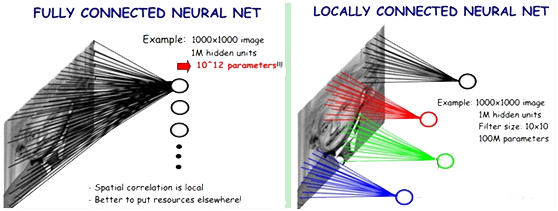    

### 3、CNN核心思想   
CNN模型限制参数了个数并挖掘了局部结构。主要用来识别位移、缩放及其他形式扭曲不变性的二维图形。**局部感受视野，权值共享以及时间或空间亚采样**这三种思想结合起来，获得了某种程度的位移、尺度、形变不变性。通过“卷积核”作为中介。同一个卷积核在所有图像内是共享的，图像通过卷积操作后仍然保留原先的位置关系。   
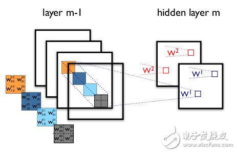   

### 4、CNN实质  
CNN在本质上是一种输入到输出的映射，它能够学习大量的输入与输出之间的映射关系，而不需要任何输入和输出之间的精确的数学表达式，只要用已知的模式对卷积网络加以训练，网络就具有输入输出对之间的映射能力。卷积网络执行的是有导师训练，所以其样本集是由形如：（输入向量，理想输出向量）的向量对构成的。所有这些向量对，都应该是来源于网络即将模拟的系统的实际“运行”结果。它们可以是从实际运行系统中采集来的。在开始训练前，所有的权都应该用一些不同的小随机数进行初始化。“小随机数”用来保证网络不会因权值过大而进入饱和状态而导致训练失败；“不同”用来保证网络可以正常地学习。
### 5、CNN基本结构
卷积神经网络CNN的结构一般包含下面几层：  
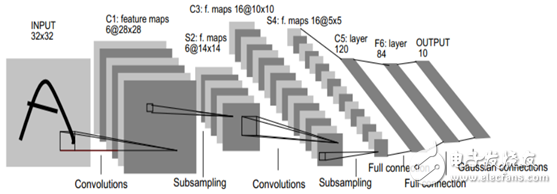  
1） 输入层：用于数据的输入。  
2） 卷积层：卷积层是卷积核在上一级输入层上通过逐一滑动窗口计算而得，卷积核中的每一个参数都相当于传统神经网络中的权值参数，与对应的局部像素相连接，将卷积核的各个参数与对应的局部像素值相乘之和，得到卷积层上的结果。一般地，使用卷积核进行特征提取和特征映射。   
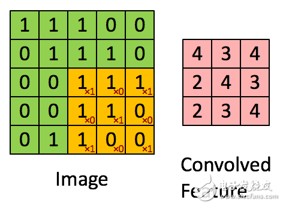   
**特征提取**：每个神经元的输入与前一层的局部接受域相连，并提取该局部的特征。一旦该局部特征被提取后，它与其它特征间的位置关系也随之确定下来；  
**特征映射**：网络的每个计算层由多个特征映射组成，每个特征映射是一个平面，平面上所有神经元的权值相等。特征映射结构采用影响函数核小的sigmoid函数作为卷积网络的激活函数，使得特征映射具有位移不变性。此外，由于一个映射面上的神经元共享权值，因而减少了网络自由参数的个数。  
卷积神经网络中的每一个卷积层都紧跟着一个用来求局部平均与二次提取的计算层，这种特有的两次特征提取结构减小了特征分辨率。   
3） 激励层：由于卷积也是一种线性运算，因此需要增加非线性映射。使用的激励函数一般为ReLu函数：f（x）＝max（x，0）。  
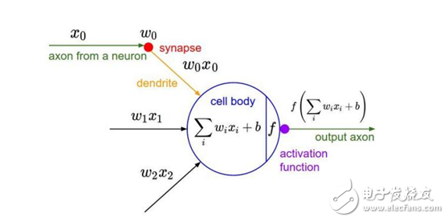   
4） 池化层：进行下采样，对特征图稀疏处理，减少数据运算量。通过卷积层获得了图像的特征之后，理论上可以直接使用这些特征训练分类器（如softmax），但这样做将面临巨大的计算量挑战，且容易产生过拟合现象。为了进一步降低网络训练参数及模型的过拟合程度，需要对卷积层进行池化／采样（Pooling）处理。池化／采样的方式通常有以下两种：a）Max－Pooling： 选择Pooling窗口中的最大值作为采样值；b）Mean－Pooling： 将Pooling窗口中的所有值相加取平均，以平均值作为采样值。  
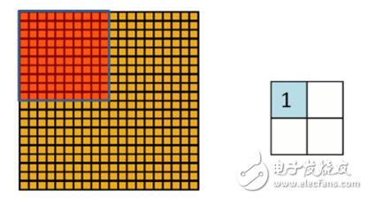  
5） 全连接层：CNN尾部进行重新拟合，减少特征信息的损失。  
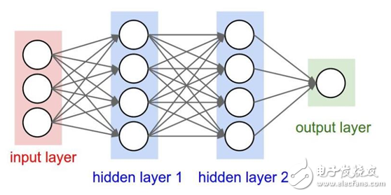   
6） 输出层：用于最后输出结果。  

### 6、CNN训练过程
* 1）向前传播阶段：  
a）从样本集中取一个样本（X，Yp），将X输入网络；
b）计算相应的实际输出Op。  
在本阶段，信息从输入层经过逐级的变换，传送到输出层。这个过程也是网络在完成训练后正常运行时执行的过程。在此过程中，网络执行的是计算，实际上就是输入与每层的权值矩阵相点乘，得到最后的输出结果：  
Op＝Fn（…（F2（F1（XpW（1））W（2））…）W（n））  
* 2）向后传播阶段：  
a）计算实际输出Op与相应的理想输出Yp的差；  
b）按极小化误差的方法反向传播调整权矩阵。  
### 7、CNN优点  
1） 输入图像和网络的拓扑结构能很好的吻合；  
2） 尽管使用较少参数，仍然有出色性能；  
3） 避免了显式的特征抽取，而隐式地从训练数据中进行学习；  
4） 特征提取和模式分类同时进行，并同时在训练中产生，网络可以并行学习；  
5） 权值共享减少网络的训练参数，降低了网络结构的复杂性，适用性更强；  
6） 无需手动选取特征，训练好权重，即得特征，分类效果好；  
7） 可以直接输入网络，避免了特征提取和分类过程中数据重建的复杂度。  
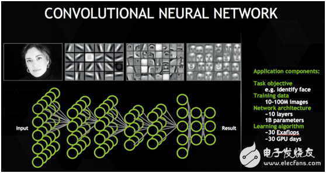  

### 8、CNN缺点
1） 需要调整参数；  
2） 需要大样本量，训练最好要GPU；  
3） 物理含义不明确，神经网络本身就是一种难以解释的 “黑箱模型”。   
### 9、CNN常用框架：  
1） [Caffe2](https://caffe2.ai/)：Facebook推出的深度学习框架；适用于CNN，RNN等多种神经网络；  
2）[mxnet](https://mxnet.apache.org/):AWS的深度学习框架；适用于CNN，RNN等多种神经网络；自身支持分布式；    
3） [TensorFlow](https://tensorflow.google.cn/)：Google的深度学习框架；TensorBoard可视化很方便；市场占有最大；   
### 10、CNN应用场景：
应用场景包括机器学习、语音识别、文档分析、语言检测和图像识别等领域。
特别强调的是：CNN在图像处理和图像识别领域取得了很大的成功，在国际标准的ImageNet数据集上，许多成功的模型都是基于CNN的。CNN相较于传统的图像处理算法的好处之一在于：避免了对图像复杂的前期预处理过程，可以直接输入原始图像。   
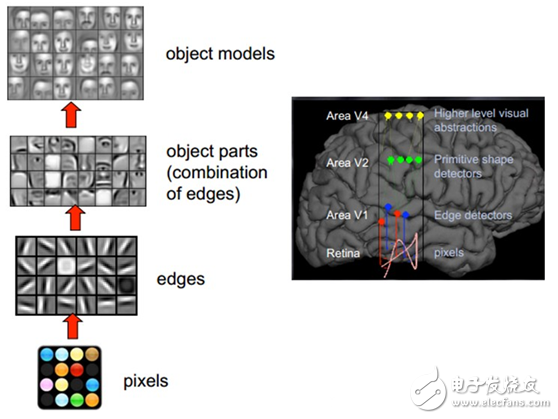   

### 11、结语  
卷积神经网络CNN是近年发展起来，并引起广泛重视的一种高效识别方法。卷积神经网络以其局部权值共享的特殊结构在模式识别方面有着独特的优越性，其布局更接近于实际的生物神经网络，权值共享降低了网络的复杂性，特别是多维输入向量的图像可以直接输入网络这一特点避免了特征提取和分类过程中数据重建的复杂度。CNN算法在人工智能之机器学习、语音识别、文档分析、语言检测和图像识别等领域等领域有着广泛应用。   
## 二、CNN结构演化  
20世纪60年代，Hubel和Wiesel在研究猫脑皮层中用于局部敏感和方向选择的神经元时发现其独特的网络结构可以有效地降低反馈神经网络的复杂性，继而提出了卷积神经网络CNN。   

1980年，K．Fukushima提出的新识别机是卷积神经网络的第一个实现网络。随后，更多的科研工作者对该网络进行了改进。其中，具有代表性的研究成果是Alexander和Taylor提出的“改进认知机”，该方法综合了各种改进方法的优点并避免了耗时的误差反向传播。   

AlexNet后神经网络如雨后春笋一般地出现，网络结构从纵向加深到横向增强卷积模块功能，网络功能从图片分类到实例分割，神经网络越来越复杂，越来越强大。   

20世纪60年代至今，CNN发展如下图。接下来，我会介绍图中所列的神经网络，并讲解其网络结构，GitHub参考代码、优缺点和适用领域。  

  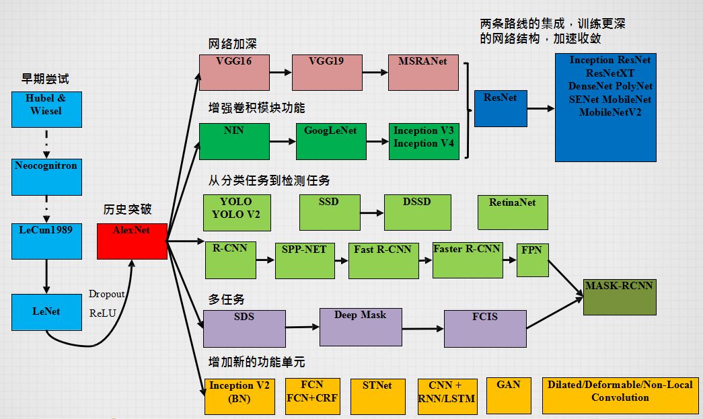   
### 1、CNN起源--Hubel和Wiesel对猫的大脑视觉皮层系统的研究  
参考论文：《Receptive fields, binocular interaction and functional architecture in the cat’s visual cortex》  

1962年，Hubel和Wiesel等通过对猫的大脑视觉皮层系统的研究，提出了**感受野的概念**，并进一步发现了视觉皮层通路中对于信息的分层处理机制，由此获得了诺贝尔生理学或医学奖。后人在研究局部敏感和方向选择的神经元时发现其独特的网络结构可以有效地降低反馈神经网络的复杂性，继而提出了卷积神经网络（Convolutional Neural Networks-简称CNN）。   
1.1感受野定义   
感受野（receptive field）被称作是CNN中最重要的概念之一。理解好感受野的本质我觉的有两个好处：理解卷积的本质；更好的理解CNN的整个架构。
先看八股式定义，感受野：在卷积神经网络CNN中，决定某一层输出结果中一个元素所对应的输入层的区域大小，被称作感受野receptive field。我们看这段定义非常简单，用数学的语言就是感受野是CNN中的某一层输出结果的一个元素对应输入层的一个映射。再通俗点的解释是，feature map上的一个点对应输入图上的区域。注意这里是输入图，不是原始图。   
看完定义后，我们在通俗地解释下感受野， 如下图所示，列举了一些感受野的实例。通过对5×5的输入图做一个核大小k=3×3,填充大小p=1×1,步长s=2×2的卷积运算C，我门能够得到一个大小为3×3的输出特征图（如图2.1绿色图所示）。对该3×3的特征图继续进行同样的卷积运算，我们将会得到大小为2×2的特征图（如图2.1橙色图所示）。每个维度的输出特征数可以通过图中公式计算得出。   
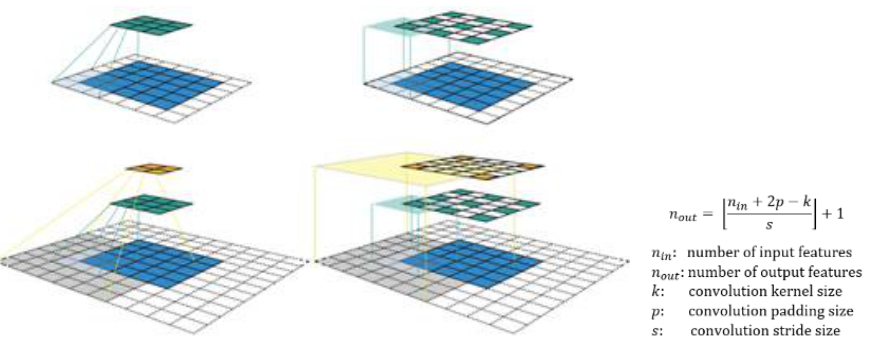   
*图2.1*   
2.1图中列出了两种可视化CNN特征图的方式。所有卷积运算均采用的核大小为k=3×3,填充大小为p=1×1,步长为s=2×2。把该卷积应用在一个5×5的输入图，从而得带3×3的绿色特征图，在绿色特征图上继续使用相同的卷积操作，将会得到2×2的橙色特征图。  
    
2.1图（左）代表了一种常见的CNN特征图可视化方法。在可视化的过程中，虽然可以通过查看特征图来了解其中包含了多少个特征，但是很难知道每个特征所对应的位置（感受野的中心位置）以及对应区域的大小（感受野的大小）。 2.1图（右）展示了固定尺寸的CNN特征图可视化，其中所有特征图的大小保持一致，并与输入图大小相同。每一个特征像素均被标记为感受野的中心。因为特征图中的所有特征均具有同样的大小，因此我们可以简单的在某一特征周围划定一个边框来表示其感受野的大小。由于特征图与输入图大小相同，因此我们并不需要将该边框映射到输入层。   
    
在图2.2所提供的另一个实例中，该卷积被应用于更大输入图（7×7）。对于固定尺寸的CNN特征图，我们可以分别通过3D（图2.2左）或者2D（图2.2右）的形式来表现。值得注意的是，图2.2中感受野的大小在第二个特征层中迅速扩大，中央特征的感受野几乎覆盖了整个输入图。这一点在改进deep CNN的设计中起到了至关重要的作用。   
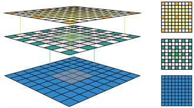  
*图2.2*   
1.2 感受野计算   
为了计算每一层的感受野，除了每个维度中的特征数n之外，我们还需要提供一些额外的信息。这些信息包括当前感受野的尺寸r，相邻两个特征间的距离（跳跃）j，以及左上角特征（第一个特征）起始的中心坐标。特别要注意的是，正如上文提到的固定大小的CNN特征图，特征的中心坐标即为其感受野的中心坐标。当应用核大小为k，填充大小为p以及步长为s的卷积运算时，输出层的属性可以通过以下公式计算：   
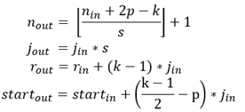   

公式一基于输入特征数量及卷积的属性计算输出特征数量，这与论文中所采用方法相同   
公式二计算输出特征图中的跳跃，其等于输入图中的跳跃乘以在应用卷积运算时跳过的输入特征数（即步长）。   
公式三计算输出特征图中感受野的大小，其等于由k个输入特征（k-1）* j_in所覆盖的面积加上有输入特征的感受野在边界处所覆盖的额外区域。   
公式四计算第一输出特征的感受野中心位置，其等于第一输入特征的中心位置加上从第一输入特征的位置到第一卷积的中心的距离（k- 1）/ 2 * j_in减去填充空间p * j_in。此处需注意，我们需要在两种情况下乘以输入特征图的跳转，以获得实际的距离/空间。   
在图2.3中，我们使用的坐标系中标定输入层第一个特征的中心为0.5。由于第一层是输入层，它始终具有以下属性：n =图像大小，r = 1，j = 1，start = 0.5。通过递归计算上述四个方程，我们可以算出CNN中所有特征图的感受野。图3通过一个实例来说明这些公式如何使用。   
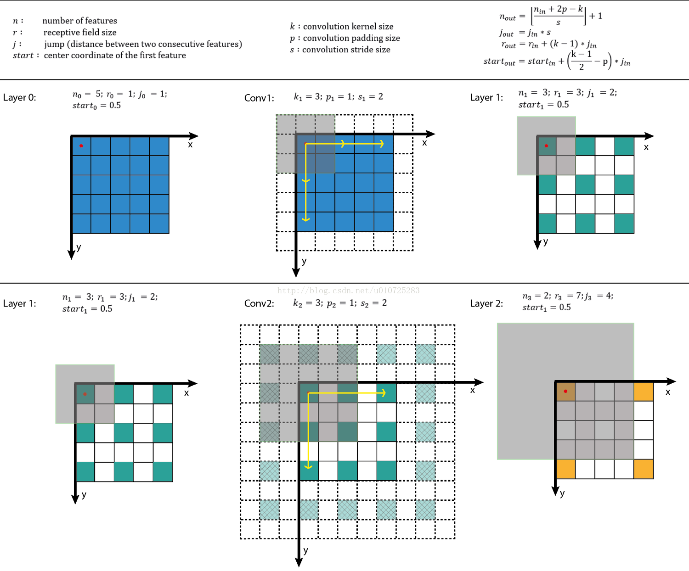   
*图2.3：将该感受野算法应用于图2.1实例的过程。第一行列出符号定义以及计算方程，而第二行和第三行展示了该算法在给定输入层信息的条件下计算输出层感受野的过程实例。*    

### 2、神经感知机(neocognitron)  
参考论文：《 A new algorithm for pattern recognition tolerant of deformations and shifts in position. Pattern Recognition》   
1980年，日本科学家福岛邦彦等基于感受野概念提出的神经感知机（Neocognitron），可以看作是卷积神经网络的第一次实现，被许多人认为是CNN的雏形，也是第一个基于神经元之间的局部连接性和层次结构组织的人工神经网络。神经认知机是将一个视觉模式分解成许多子模式，通过逐层阶梯式相连的特征平面对这些子模式特征进行处理，使得即使在目标对象产生微小畸变的情况下，模型也具有很好的识别能力。    
这部分内容不再详细介绍，因为直接理解CNN会更简单些。   
### 3、LeNet  
参考论文：  
《Handwritten digit recognition with a backpropogation network》       
《Gradient-Based Learning Applied to Document Recognition》   

LeNet-5出自论文Gradient-Based Learning Applied to Document Recognition，是一种用于手写体字符识别的非常高效的卷积神经网络。
接下来，将从卷积神经网络结构的基础说起，详细地讲解每个网络层。  
3.1网络结构   
LeNet一共有7层（不包括输入层），
输入层：输入图像的大小为32\*32，这要比mnist数据库中的最大字母（28\*28）还大。其作用是：图像较大，这样做的目的是希望潜在的明显特征，比如笔画断续，角点等能够出现在最高层特征监测子感受野的中心。   
其他层：C1，C3，C5为卷积层，S2，S4为降采样层，F6为全连接层，还有一个输出层。   
每一个层都有多个Feature Map（每个Feature Map中含有多个神经元），输入通过一种过滤器作用，提取输入的一种特征，得到一个不同的Feature Map。   
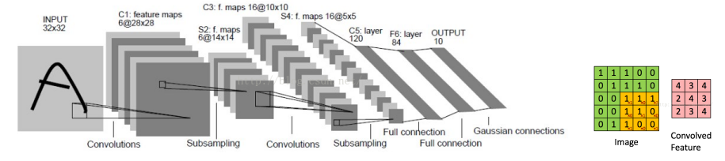     
各层详解：卷积运算的优点：通过卷积运算，可以使原信号特征增强，并且降低噪声。卷积对于二维图像中的效果就是：对于图像中的每个像素邻域求加权和得到该像素点的输出值。   
C1卷积层，由6个Feature Map组成。 每一个Feature Map中的每个神经元与输入中5\*5的区域相连（也就是Filter的大小），Feature Map的大小为28\*28， C1一共有156个参数，因为5\*5个参数加上一个bias，一共又有6个Filter，所以，一共有参数量（5\*5+1）\*6=156，一共有156\*（28*28） = 122304个连接。    
S2 下采样层（Pooling）的作用： 利用图像的局部相关性原理，对图像进行子抽样，可以减少数据处理量，同时又保留有用的信息。同样的，有6\*14\*14， 6个Feature Map。   
 池化层一般有两种方式：（1） Max_Pooling： 选择Pooling窗口中最大值最为采样值。（2） Mean_Pooling： 将Pooling窗口中的所有值相加取平均，然后以平均值最为采样值。    

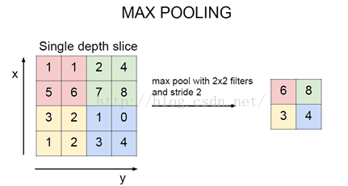   
 说明：   
    每个单元的2\*2的感受野，并不重叠，因此S2中每一个Feature Map的大小为C1中Feature Map中大小的1/4。行列各位1/2。所以，S2有12个可训练的参数和5880个连接。个人感觉，5880是这么来的，Filter的大小为：2\*2，一个偏差bias，6个Feature Map，则可训练参数个数为：（2\*2+1）\*6 = 30，连接数为：30\*（14\*14）= 5880 。12 参数则为： 6个2\*2的小方块，加上一个bias，为（1+1）\*6=12    
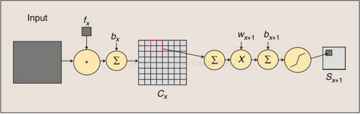   
上图说明了卷积过程子采样过程。卷积过程中，用一个可训练的过滤器fx去卷积一个输入图像，然后添加一个偏置bx ，得到卷积层Cx 。子采样过程就是：每个邻域4个像素变为一个像素，然后加上标量Wx 加权，最后再增加偏置bx+1 ，接着通过一个sigmoid激活函数，产生一个大概缩小了4倍的特征映射图Sx+1。   
C3卷积层，同样的，Filter大小认为5\*5，去卷积S2，得到的Feature Map为10\*10大小。每一个Feature Map中包含10\*10个神经元。C3层有16个不同的Filter，所以会得到16个不同的Feature Map。   
C3中的每一个Feature Map连接到S2的所有6个Feature Map或者是几个Feature Map。表示本层的Feature Map是上一层提取的Feature Map的不同组合。为什么不把S2的每一个Feature Map连接到S3的每一个Feature Map中？原因有2： 第一，不完全连接机制连接的数量保持在合理范围，第二，这样破坏了网络的对称性，由于不同的Feature Map有不同的输入，所以迫使他们抽取不同的特征（理想状态特征互补）。   
 如果C3的前6个Feature Map以S2中的3个相邻的Feature Map子集为输入，接下来的6个Feature Map以S2中相邻的4个Feature Map作为输入，接下来的3个以不相邻的4个Feature Map子集作为输入，最后一个将S2中所有的Feature Map作为输入的话，C3将会有1516个可训练参数和151600个连接。因为6\*（3\*25+1） + 6\*（4\*25+1） + 3\*（4\*25+1） + 1（6\*25+1） = 1516。连接数为：1516\*10\*10=151600。   
 S4层 Pooling层，由16个5*5的Feature Map组成，Feature Map中每个单元与C3中相应的Feature Map的2*2邻域相连。 S4有32个可训练的参数和2000个连接，同S2，（1+1）\*16=32. 连接数为： （2\*2+1） \* 16 \* 5\*5 = 2000
C5 卷积层，这一层有120个Feature Map,每个单元与S4层的全部的16个5\*5的邻域相连。 S4的Feature Map的大小也是5\*5，这一层的Filter大小也是5\*5，所以，C5的Feature Map的大小为1\*1。此时构成了S4与C5之间的全连接。但这里C5表示为卷积层而不是全连接层，是因为如果LeNet的输入变大，而其他保持不变，此时的Feature Map的大小就比1\*1要大。 C5有48120个可训练的链接： （5\*5\*16 +1） \*120 = 48120。   
F6 全连接层，有84个单元（之所以是84是因为输入层的设计），F6计算输入向量和权重向量之间的点积，再加上一个偏置，最后将其传递给sigmoid函数产生一个单元i的一个状态。一共有10164个可训练的连接，为：84\*（120+1）=10164。   
 输出层，输出层由欧式径向基函数（Euclidean Radial Basis Function）单元组成，每类一个单元，每个单元有84个输入。   
 也就是说： 每个输入RBF单元计算输入向量和参数向量之间的欧氏距离。输入离参数向量越远，RBF输出越大。一个RBF输出可以理解为衡量输入模式和RBF相关联的一个模型的匹配程度的惩罚项。给定一个输入模式，损失函数应该能使F6的配置和RBF参数向量（模式的期望分类）足够接近。    
 每一个单元的参数是人工选取并保持固定的。这些参数向量的成分被设计成-1或1。虽然这些参数可以以-1或1等概论方式任取，或者是构成一个纠错码，但是被设计成一个相应字符类的7\*12的格式化图片。       

​            
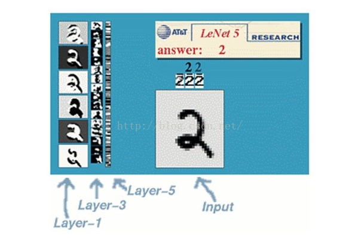  
RBF参数向量是F6层目标向量的角色。需要指出这些向量的成为为+1或者-1,正好在F6 Sigmoid函数的范围内，因此可以防止sigmoid函数饱和。+1和-1是sigmoid函数的最大弯曲点，这也使得F6单元运行在最大非线性范围内。   
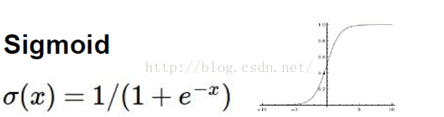   
 必须避免sigmoid函数饱和，否则会导致损失函数较慢收敛和病态问题。  
   卷积神经网络在本质上是一种输入到输出的映射，它能够学习大量的输入与输出之间的映射关系，而不需要任何输入与输出之间的精确的数学表达式，只要用已知的模式对卷积神经网络加以训练，网络就具有输入与输出之间的映射能力。卷积网络是有监督学习，所以它的样本集都形如：（输入向量，理想输出向量）之类的向量对构成。   
 LeNet需要训练的参数量总结如下：   
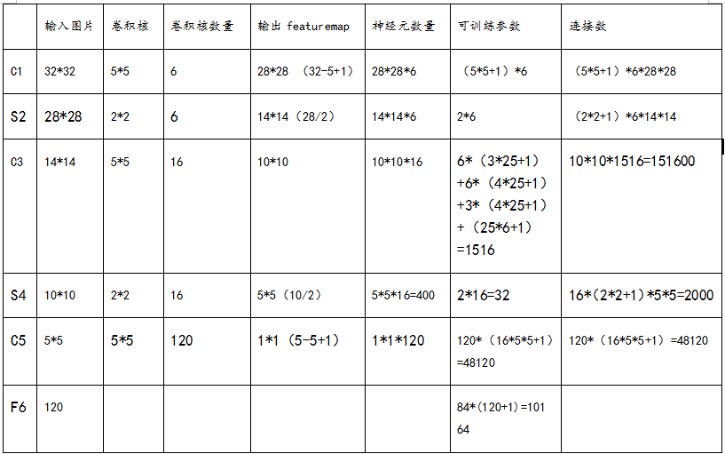    
