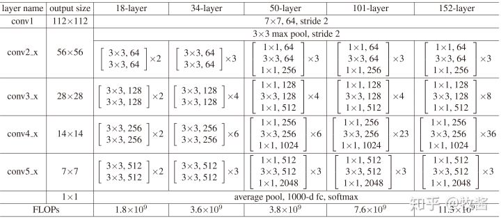
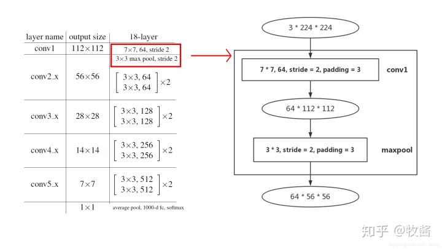
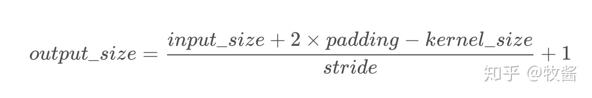
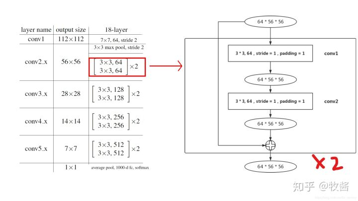
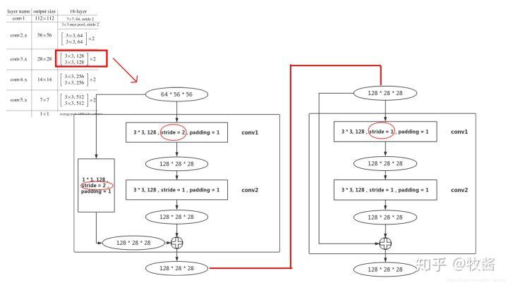
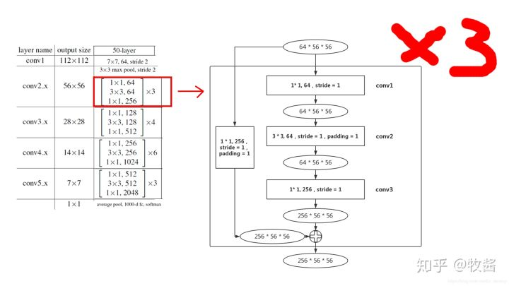
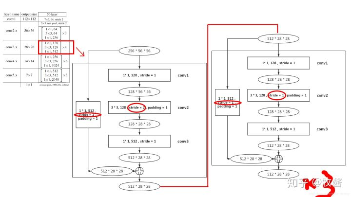

# ResNet

2020年8月7日

---

## 1. ResNet介绍

## 2. 网络结构

ResNet共有5种不同深度的结构，深度分别为18、34、50、101、152（各种网络的深度指的是“需要通过训练更新参数”的层数，如卷积层，全连接层等）。

其中，根据Block类型，可以将这五种ResNet分为两类：(1) 一种基于BasicBlock，浅层网络ResNet18, 34都由BasicBlock搭成；(2) 另一种基于Bottleneck，深层网络ResNet50, 101, 152乃至更深的网络，都由Bottleneck搭成。Block相当于积木，每个layer都由若干Block搭建而成，再由layer组成整个网络。每种ResNet都是4个layer（不算一开始的7×7 卷积层和3×3maxpooling层）。如图，conv2_x对应layer1，conv3_x对应layer2，conv4_x对应layer3，conv5_x对应layer4。方框中的“×2 ”、“×3 ”等指的是该layer由几个相同的结构组成。

下面借ResNet18和ResNet50两种结构分别介绍BasicBlock和Bottleneck。

### 2.1 Block前面的层

为了结构的完整性，我们有必要从网络最浅层开始讲起：

首先说明，为了便于理解，本文所有图只包含卷积层和pooling层，而BN层和ReLU层等均未画出。然后说明图中部分符号的含义：输入输出用椭圆形表示，中间是输入输出的尺寸：channel×height×width ；直角矩形框指的是卷积层或pooling层，如“3×3,64,stride=2,padding=3”指该卷积层kernel size为3×3 ，输出channel数为64，步长为2，padding为3。矩形框代表的层种类在方框右侧标注，如“conv1”。

这些都了解之后，图中所示结构就已经很清楚了，顺便提一句，卷积层的输出尺寸(单边)是这么计算的：

以conv1为例，input_size=224,padding=3,kernel_size=7,stride=2 。将它们带入公式，发现除不尽，所以前面的除法准确地说是求商。可以得出output_size=112 。下面的max pooling类似，求得output_size=56, 不再赘述。

### 2.2 ResNet18

#### 2.2.1 layer1

layer1的结构比较简单，没有downsample，各位看图即可理解。图中方框内便是BasicBlock的主要结构——两个3×3卷积层。每个layer都由若干Block组成，又因为layer1的两个block结构完全相同，所以图中以“×2”代替，各位理解就好。

#### 2.2.2 layer2

layer2和layer1就有所不同了，首先64×56×56 的输入进入第1个block的conv1，这个conv1的stride变为2，和layer1不同（图中红圈标注），这是为了降低输入尺寸，减少数据量，输出尺寸为128×28×28。

到第1个block的末尾处，需要在output加上residual，但是输入的尺寸为64×56×56，所以在输入和输出之间加一个 1×1 卷积层，stride=2（图中红圈标注），作用是使输入和输出尺寸统一，（顺带一提，这个部分就是PyTorch ResNet代码中的downsample）

由于已经降低了尺寸，第2个block的conv1的stride就设置为1。由于该block没有降低尺寸，residual和输出尺寸相同，所以也没有downsample部分。

#### 2.2.3 layer3-4

layer3和layer4结构和layer2相同，无非就是通道数变多，输出尺寸变小，就不再赘述。

ResNet18和34都是基于Basicblock，结构非常相似，差别只在于每个layer的block数。

### 2.3 ResNet50

#### 2.3.1 layer 1

和Basicblock不同的一点是，每一个Bottleneck都会在输入和输出之间加上一个卷积层，只不过在layer1中还没有downsample，这点和Basicblock是相同的。至于一定要加上卷积层的原因，就在于Bottleneck的conv3会将输入的通道数扩展成原来的4倍，导致输入一定和输出尺寸不同。

layer1的3个block结构完全相同，所以图中以“×3 ”代替。

#### 2.3.2 layer 2

尺寸为256×56×56 的输入进入layer2的第1个block后，首先要通过conv1将通道数降下来，之后conv2负责将尺寸降低（stride=2，图中从左向右数第2个红圈标注）。到输出处，由于尺寸发生变化，需要将输入downsample，同样是通过stride=2的1×1 卷积层实现。

之后的3个block（layer2有4个block）就不需要进行downsample了（无论是residual还是输入），如图从左向右数第3、4个红圈标注，stride均为1。因为这3个block结构均相同，所以图中用“×3”表示。

#### 2.3.3 layer3-4

layer3和layer4结构和layer2相同，无非就是通道数变多，输出尺寸变小，就不再赘述。

ResNet50、101和152都是基于Bottleneck，结构非常相似，差别只在于每个layer的block数。

## 参考

> [ResNet网络结构分析](https://zhuanlan.zhihu.com/p/79378841)
>
> 