# RNN

2020年12月2日

---

## 1. 为什么会出现RNN

在传统的深度神经网络模型中，我们的输入信息是没有顺序的，比如，NLP领域中，我们输入单词经常使用embedding，将词汇映射为词向量，然后输入到神经网络。但是这种输入方式会有一些问题，比如，"我 爱 你"和"你 爱 我"在传统的神经网络中不能很好的识别。在这种情况下，有人提出了将n-gram信息加入到输入层，比如fasttext，这样，在一定程度上解决了单词间的顺序问题，但是这种方法也有一些弊端，就是我们无法捕获长句子的单词依赖，比如一个句子n个单词，那么如果想要捕获全部的单词顺序信息，需要1+2+3....+n，所以这种方式会让embedding_lookup变得非常大。

那么，RNN就是专门解决这种无法捕获长距离的句子信息的模型。

## 2.RNN、LSTM，GRU单元

### 2.1 RNN模型

结构如图

1）x(t)代表在序列索引号t时训练样本的输入。同样的，x(t−1)和x(t+1)代表在序列索引号t−1和t+1时训练样本的输入。

2）h(t)代表在序列索引号t时模型的隐藏状态。h(t)由x(t)和h(t−1)共同决定。

3）o(t)代表在序列索引号t时模型的输出。o(t)只由模型当前的隐藏状态h(t)决定。

4）L(t)代表在序列索引号t时模型的损失函数。 注意指向L的方向，L是损失函数，所以两边都是指向L的

5）y(t)代表在序列索引号t时训练样本序列的真实输出。

6）U,W,V这三个矩阵是我们的模型的线性关系参数，它在整个RNN网络中是共享的，

7）b和c分别是隐藏层和输出层的偏置。δ是激活函数

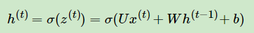这里的激活函数δ通常选择tanh（）

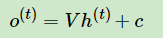

预测值 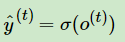

这里所有的U,W,V,b,c在序列的各个位置是共享的，所以反向传播时我们更新的是相同的参数，可以利用梯度下降法不断更新参数

当然，这里所说的参数共享是指对于每一个神经元的参数。对于不同的神经元的参数，之间是相互独立的。

 

可以看出在整个过程中只有隐藏层状态h在不断的从前向后传，不断的继承前面的信息。

那么，由于在不断循环的过程中，隐藏状态h会不断的和参数矩阵W相乘，那就必然会面临梯度消失和梯度爆炸的问题。梯度消失很容易理解，可以看做是越早的信息对当前的贡献越小。所以RNN无法记住很多信息。特别是时间距离较远的信息。

 

### 2.2 LSTM模型

梯度消失和梯度爆炸是困扰RNN模型训练的关键原因之一，产生梯度消失和梯度爆炸是由于RNN的权值矩阵循环相乘导致的，相同函数的多次组合会导致极端的非线性行为。梯度消失和梯度爆炸主要存在RNN中，因为RNN中每个时间片使用相同的权值矩阵。对于一个DNN，虽然也涉及多个矩阵的相乘，但是通过精心设计权值的比例可以避免梯度消失和梯度爆炸的问题 .

处理梯度爆炸可以采用梯度截断的方法。所谓梯度截断是指将梯度值超过阈值 ![[公式]](https://www.zhihu.com/equation?tex=%5Ctheta) 的梯度手动降到 ![[公式]](https://www.zhihu.com/equation?tex=%5Ctheta) 。虽然梯度截断会一定程度上改变梯度的方向，但梯度截断的方向依旧是朝向损失函数减小的方向。

对比梯度爆炸，梯度消失不能简单的通过类似梯度截断的阈值式方法来解决，因为长期依赖的现象也会产生很小的梯度。

为了解决梯度消失的问题，大佬们改进了RNN设计了LSTM模型结构

LSTM的全称是Long Short Term Memory，顾名思义，它具有记忆长短期信息的能力的神经网络。LSTM首先在1997年由Hochreiter & Schmidhuber [1] 提出，由于深度学习在2012年的兴起，LSTM又经过了若干代大牛(Felix Gers, Fred Cummins, Santiago Fernandez, Justin Bayer, Daan Wierstra, Julian Togelius, Faustino Gomez, Matteo Gagliolo, and Alex Gloves)的发展，由此便形成了比较系统且完整的LSTM框架，并且在很多领域得到了广泛的应用。本文着重介绍深度学习时代的LSTM。

原始RNN模型结构是这丫子：

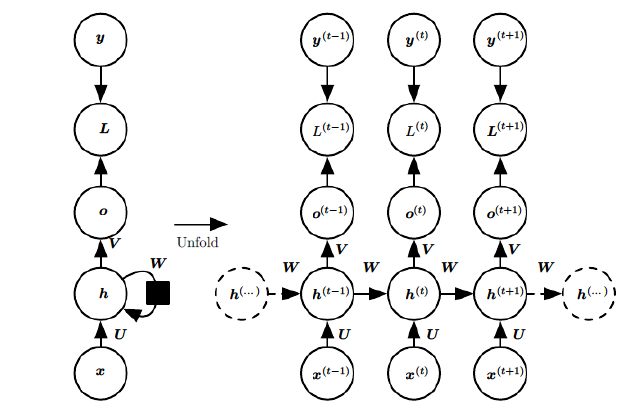

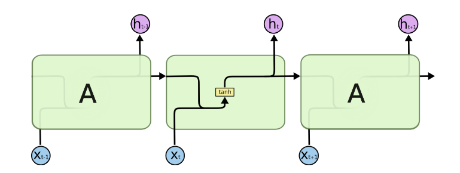

忽略掉上面的O,L,y，这两张图是不是一样？是的。激活函数选择tanh（）

改进之后的模型:

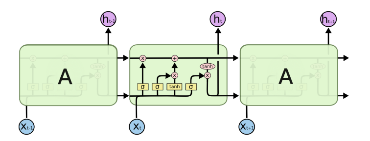

这里的关键区别就在于：引入了遗忘门，输入门，输出门和细胞状态。

还记得前面所说，RNN是不断传递隐藏层状态h，只是简单的乘上参数矩阵W，并没有进行选择。

所以这里的特点就在于，选择是否遗忘掉上一个时刻的隐藏层状态。

LSTM详细流程：[LSTM和BILSTM介绍](https://mp.csdn.net/console/editor/html/109958095)

 

### 总结

- CNN:输入是静态的，不随着时间而改变。用的方法是卷积。模型结构特点是：输入层---若干个（卷积层-激活函数---池化层）---全连接层-激活函数
- RNN：输入是时间连续的，方法是矩阵相乘。结构特点是不断循环传递上一时刻的隐藏层状态。模型结构：输入层---隐藏层---输出层。用损失函数L不断迭代更新参数。时间距离越远的信息，对当前时刻的贡献越小。
- LSTM：在RNN结构上做了改进，能够选择是否遗忘掉上一个时刻的隐藏层状态。能够避免梯度消失，能够更好地利用之前的信息。
- GRU除在语言模型的场景中表现均超过LSTM
- LSTM的输出门的偏置的均值初始化为1时，LSTM的性能接近GRU；
- 在LSTM中，门的重要性排序是遗忘门 > 输入门 > 输出门

## 3.RNN 结构详解

NLP里最常用、最传统的深度学习模型就是**循环神经网络 RNN**（Recurrent Neural Network）。这个模型的命名已经说明了数据处理方法，是按顺序按步骤读取的。与人类理解文字的道理差不多，看书都是一个字一个字，一句话一句话去理解的。

本文将介绍RNN及其一些重要的RNN变种模型：

- RNN
- Encoder-Decoder（ = Seq-to-Seq ）
- Attention Mechanism

### 3.1 RNN 多结构详解

**CNN vs RNN**

1. CNN 需要固定长度的输入、输出，RNN 的输入和输出可以是不定长且不等长的
2. CNN 只有 one-to-one 一种结构，而 RNN 有多种结构，如下图：

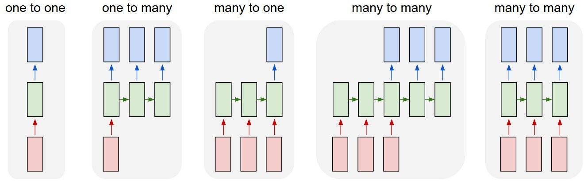

#### 1. one-to-one

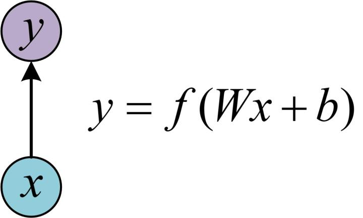

最基本的单层网络，输入是x，经过变换Wx+b和激活函数f得到输出y。

#### 2. one-to-n

输入不是序列而输出为序列的情况，只在序列开始进行输入计算：

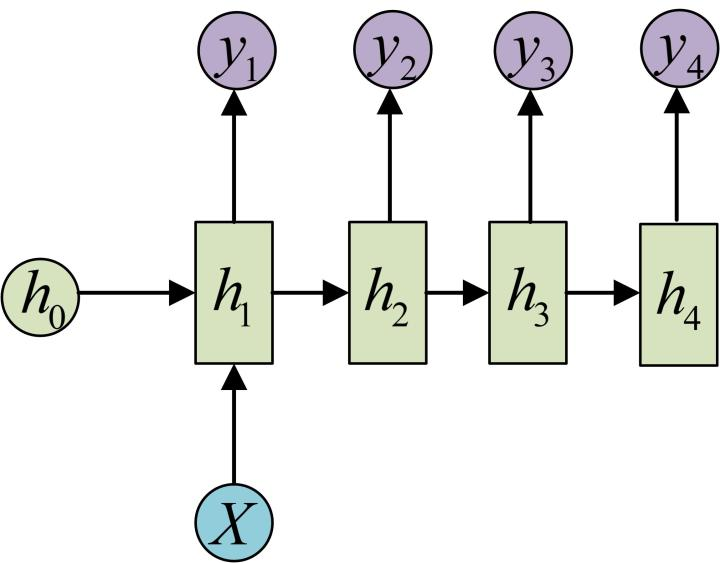

图示中记号的含义是：

- **圆圈或方块表示的是向量。**
- **一个箭头就表示对该向量做一次变换。如上图中h0和x分别有一个箭头连接，就表示对h0和x各做了一次变换。**

还有一种结构是把输入信息X作为每个阶段的输入：

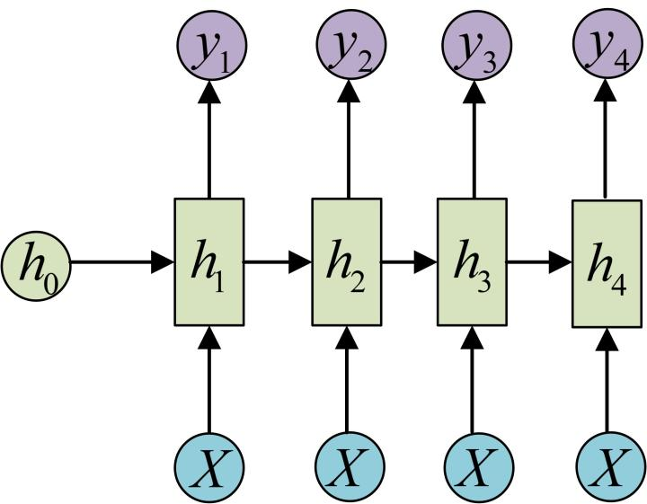

下图省略了一些X的圆圈，是一个等价表示：

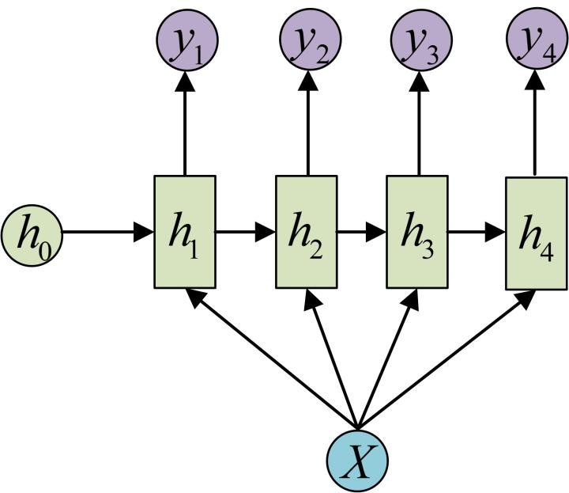

这种 one-to-n 的结构可以处理的问题有：

- 从图像生成文字（image caption），此时输入的X就是图像的特征，而输出的y序列就是一段句子，就像看图说话等
- 从类别生成语音或音乐等

#### 3. n-to-n

最经典的RNN结构，输入、输出都是等长的序列数据。

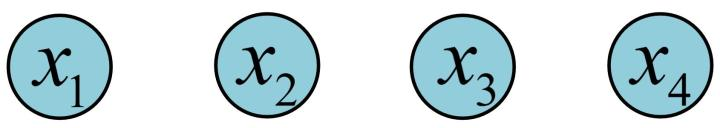

假设输入为X=(x1, x2, x3, x4)，每个x是一个单词的词向量。

为了建模序列问题，RNN引入了隐状态h（hidden state）的概念，h可以对序列形的数据提取特征，接着再转换为输出。先从h1的计算开始看：

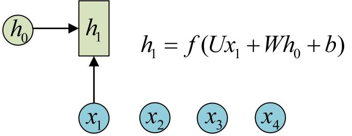

h2的计算和h1类似。要注意的是，在计算时，**每一步使用的参数U、W、b都是一样的，也就是说每个步骤的参数都是共享的，这是RNN的重要特点，一定要牢记。**

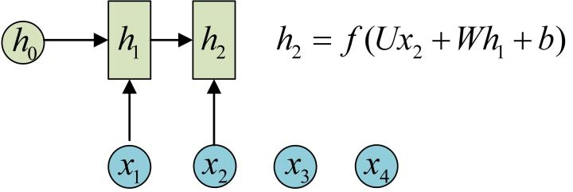

依次计算剩下来的（使用相同的参数U、W、b）：

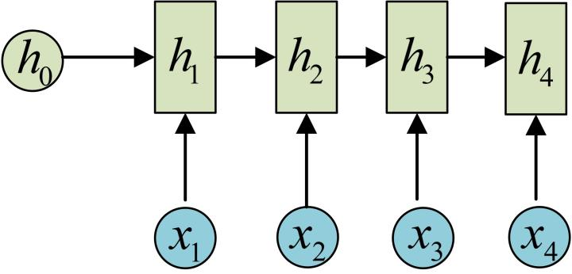

这里为了方便起见，只画出序列长度为4的情况，实际上，这个计算过程可以无限地持续下去。得到输出值的方法就是直接通过h进行计算：

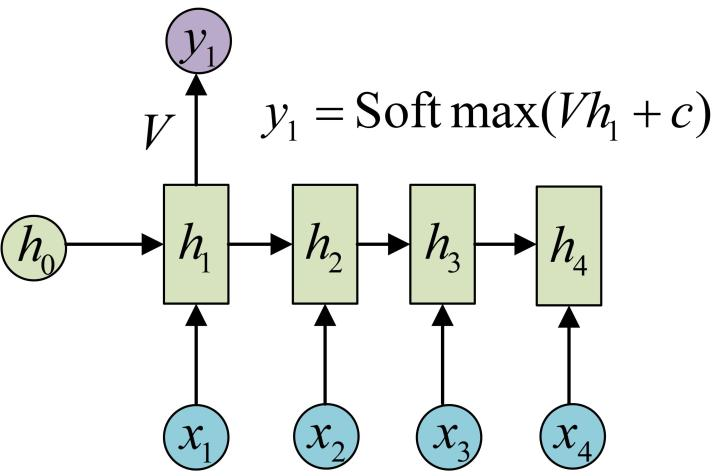

正如之前所说，**一个箭头就表示对对应的向量做一次类似于f(Wx+b)的变换，这里的这个箭头就表示对h1进行一次变换，得到输出y1。**

剩下的输出类似进行（使用和y1同样的参数V和c）：

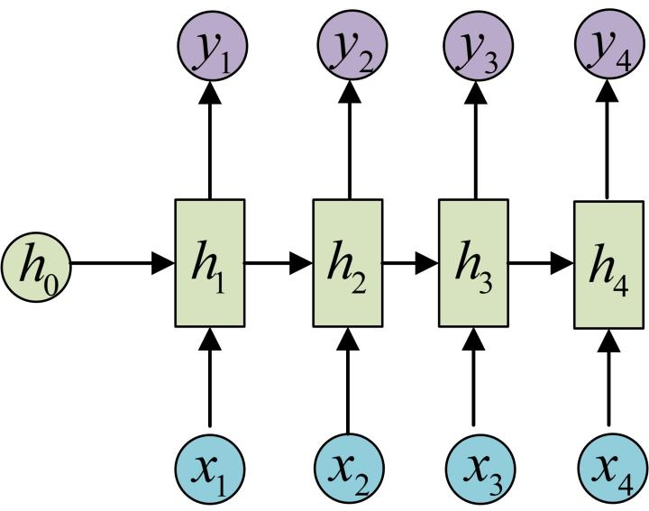

这就是最经典的RNN结构，它的输入是x1, x2, …..xn，输出为y1, y2, …yn，也就是说，**输入和输出序列必须要是等长的**。由于这个限制的存在，经典RNN的适用范围比较小，但也有一些问题适合用经典的RNN结构建模，如：

- 计算视频中每一帧的分类标签。因为要对每一帧进行计算，因此输入和输出序列等长。
- 输入为字符，输出为下一个字符的概率。这就是著名的Char RNN（详细介绍请参考：[The Unreasonable Effectiveness of Recurrent Neural Networks](https://link.zhihu.com/?target=http%3A//karpathy.github.io/2015/05/21/rnn-effectiveness/)，Char RNN可以用来生成文章，诗歌，甚至是代码，非常有意思）。

#### 4. n-to-one

要处理的问题输入是一个序列，输出是一个单独的值而不是序列，应该怎样建模呢？实际上，我们只在最后一个h上进行输出变换就可以了：

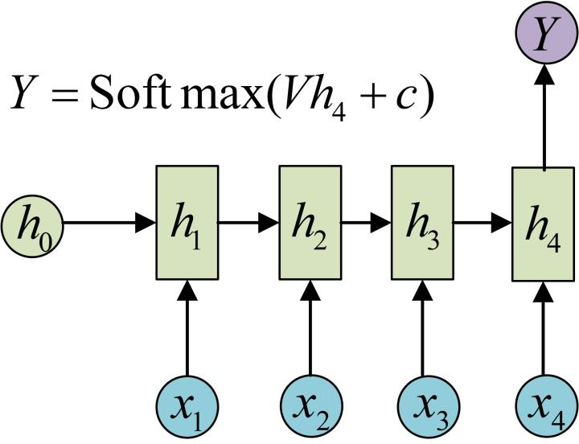

这种结构通常用来处理序列分类问题。如输入一段文字判别它所属的类别，输入一个句子判断其情感倾向，输入一段视频并判断它的类别等等。

### 3.2 Encoder-Decoder

#### **n-to-m**

还有一种是 **n-to-m**，输入、输出为不等长的序列。

这种结构是**Encoder-Decoder**，也叫Seq2Seq，是RNN的一个重要变种。原始的n-to-n的RNN要求序列等长，然而我们遇到的大部分问题序列都是不等长的，如机器翻译中，源语言和目标语言的句子往往并没有相同的长度。**为此，Encoder-Decoder结构先将输入数据编码成一个上下文语义向量c：**

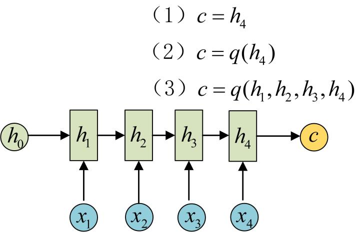

**语义向量c**可以有多种表达方式，最简单的方法就是把Encoder的最后一个隐状态赋值给c，还可以对最后的隐状态做一个变换得到c，也可以对所有的隐状态做变换。

**拿到c之后，就用另一个RNN网络对其进行解码**，这部分RNN网络被称为Decoder。Decoder的RNN可以与Encoder的一样，也可以不一样。具体做法就是将c当做之前的初始状态h0输入到Decoder中：

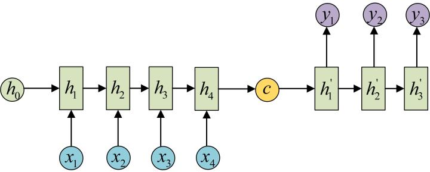

还有一种做法是将c当做每一步的输入：

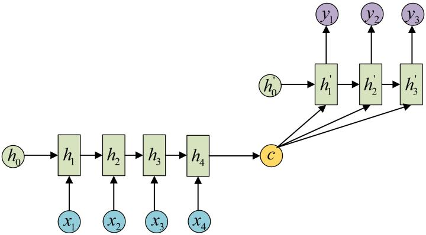

#### Encoder-Decoder 应用

由于这种Encoder-Decoder结构不限制输入和输出的序列长度，因此应用的范围非常广泛，比如：

- 机器翻译：Encoder-Decoder的最经典应用，事实上这结构就是在机器翻译领域最先提出的。
- 文本摘要：输入是一段文本序列，输出是这段文本序列的摘要序列。
- 阅读理解：将输入的文章和问题分别编码，再对其进行解码得到问题的答案。
- 语音识别：输入是语音信号序列，输出是文字序列。

#### Encoder-Decoder 框架

Encoder-Decoder 不是一个具体的模型，是一种框架。

- Encoder：将 input序列 →转成→ 固定长度的向量
- Decoder：将 固定长度的向量 →转成→ output序列
- Encoder 与 Decoder 可以彼此独立使用，实际上经常一起使用

因为最早出现的机器翻译领域，最早广泛使用的转码模型是RNN。其实模型可以是 CNN /RNN /BiRNN /LSTM /GRU /…

#### Encoder-Decoder 缺点

- 最大的局限性：编码和解码之间的唯一联系是固定长度的语义向量**c**
- 编码要把整个序列的信息压缩进一个固定长度的语义向量**c**
- 语义向量c无法完全表达整个序列的信息
- 先输入的内容携带的信息，会被后输入的信息稀释掉，或者被覆盖掉
- 输入序列越长，这样的现象越严重，这样使得在Decoder解码时一开始就没有获得足够的输入序列信息，解码效果会打折扣

因此，为了弥补基础的 Encoder-Decoder 的局限性，提出了attention机制。

### 3.3 Attention Mechanism

注意力机制（attention mechanism）是对基础Encoder-Decoder的改良。Attention机制通过在每个时间输入不同的c来解决问题，下图是带有Attention机制的Decoder：

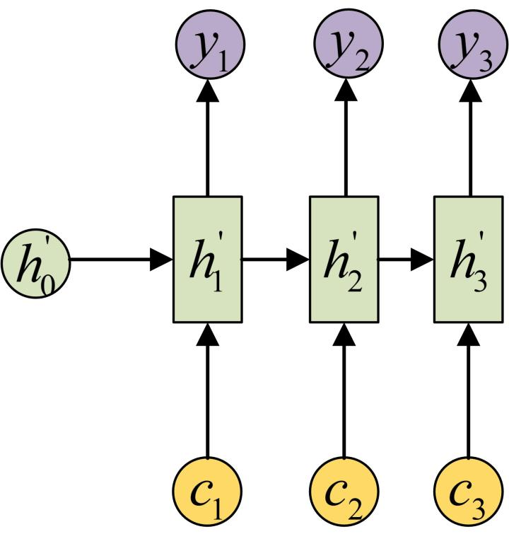

**每一个c会自动去选取与当前所要输出的y最合适的上下文信息。具体来说，我们用aij衡量Encoder中第j阶段的hj和解码时第i阶段的相关性，最终Decoder中第i阶段的输入的上下文信息 ci就来自于所有 hj 对 aij 的加权和。**

以机器翻译为例（将中文翻译成英文）：

输入的序列是“我爱中国”，因此，Encoder中的h1、h2、h3、h4就可以分别看做是“我”、“爱”、“中”、“国”所代表的信息。在翻译成英语时，第一个上下文c1应该和 “我” 这个字最相关，因此对应的 a11 就比较大，而相应的 a12、a13、a14 就比较小。c2应该和“爱”最相关，因此对应的 a22 就比较大。最后的c3和h3、h4最相关，因此 a33、a34 的值就比较大。

至此，关于Attention模型，只剩最后一个问题了，那就是：**这些权重 aij 是怎么来的？**

事实上，aij 同样是从模型中学出的，它实际和Decoder的第i-1阶段的隐状态、Encoder第j个阶段的隐状态有关。

同样还是拿上面的机器翻译举例， a1j 的计算（此时箭头就表示对h’和 hj 同时做变换）：

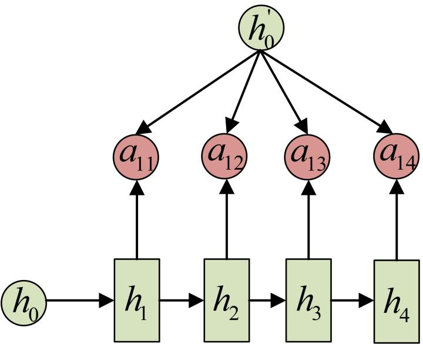

a2j 的计算：

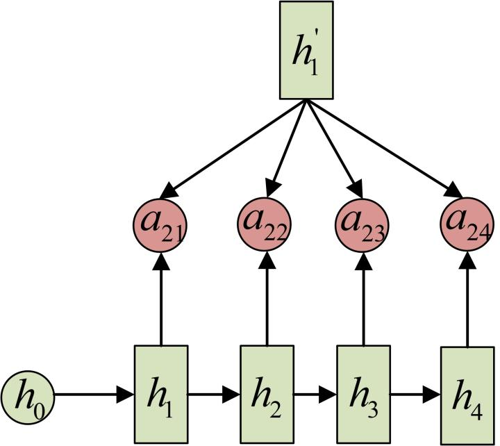

a3j 的计算：

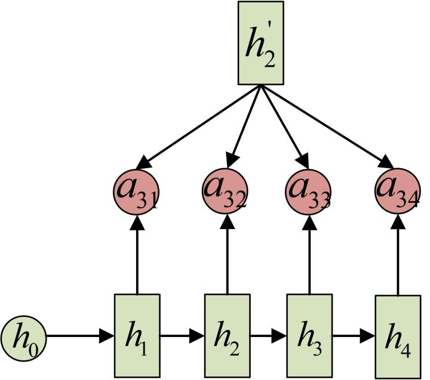

以上就是带有Attention的Encoder-Decoder模型计算的全过程。

#### **Attention 的优点：**

- 在机器翻译时，让生词不只是关注全局的语义向量c，增加了“注意力范围”。表示接下来输出的词要重点关注输入序列种的哪些部分。根据关注的区域来产生下一个输出。
- 不要求编码器将所有信息全输入在一个固定长度的向量中。
- 将输入编码成一个向量的序列，解码时，每一步选择性的从序列中挑一个子集进行处理。
- 在每一个输出时，能够充分利用输入携带的信息，每个语义向量Ci不一样，注意力焦点不一样。

#### **Attention 的缺点**

- 需要为每个输入输出组合分别计算attention。50个单词的输出输出序列需要计算2500个attention。
- attention在决定专注于某个方面之前需要遍历一遍记忆再决定下一个输出是以什么。

Attention的另一种替代方法是强化学习，来预测关注点的大概位置。但强化学习不能用反向传播算法端到端的训练。

#### **Attention可视化**

Attention的可视化是一件非常cool的事！😝下面推荐一些优秀的attention相关论文。

#### paper: [Attention Is All You Need](https://arxiv.org/pdf/1706.03762.pdf)

下图是句子的单词之间的attention联系，颜色深浅表示大小。

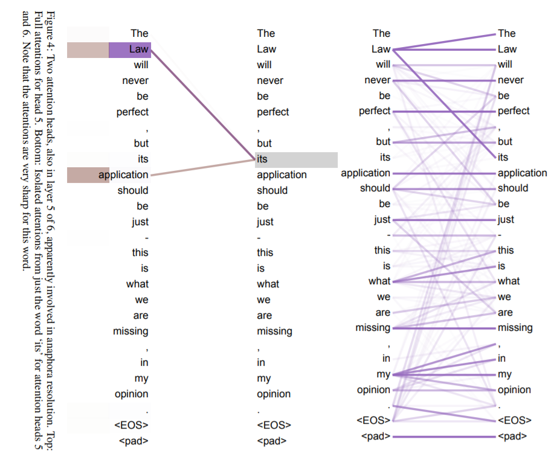

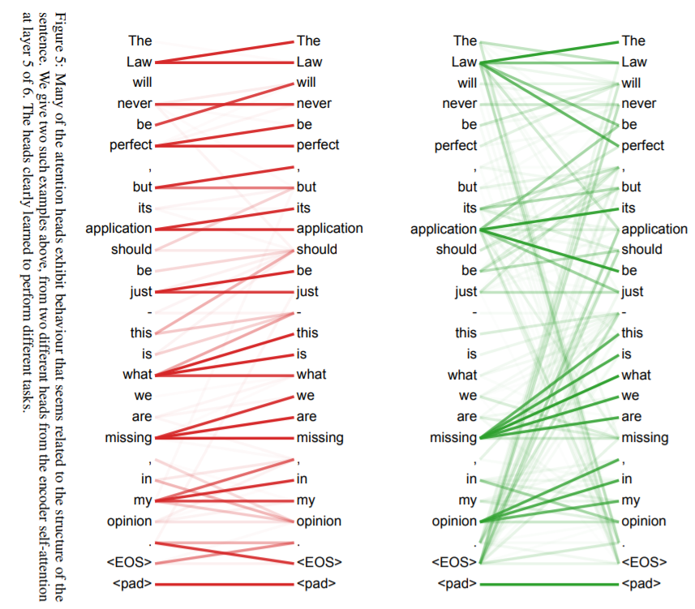

#### paper: [Show, Attend and Tell](https://arxiv.org/pdf/1502.03044v1.pdf)

注意每个句子的不同单词在图片中的attention标注：

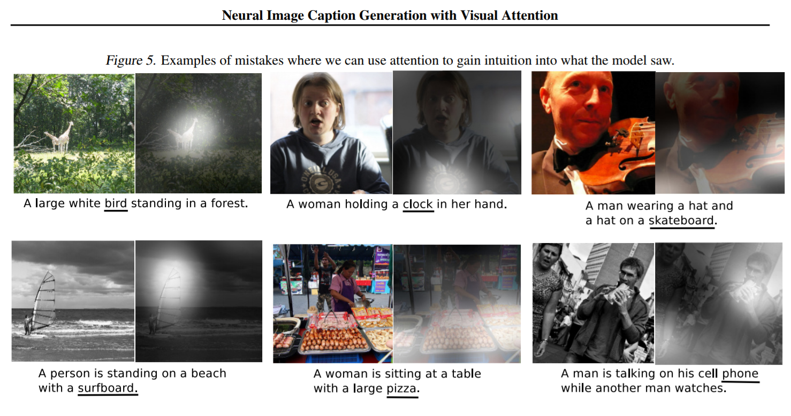

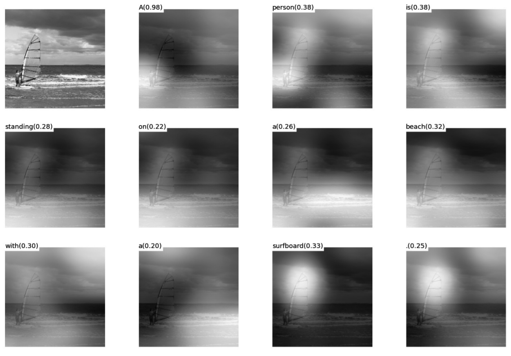

#### paper: [Convolutional Sequence to Sequence Learning](https://arxiv.org/pdf/1705.03122.pdf)

机器翻译中attention数值的可视化，一般是随着顺序强相关的。

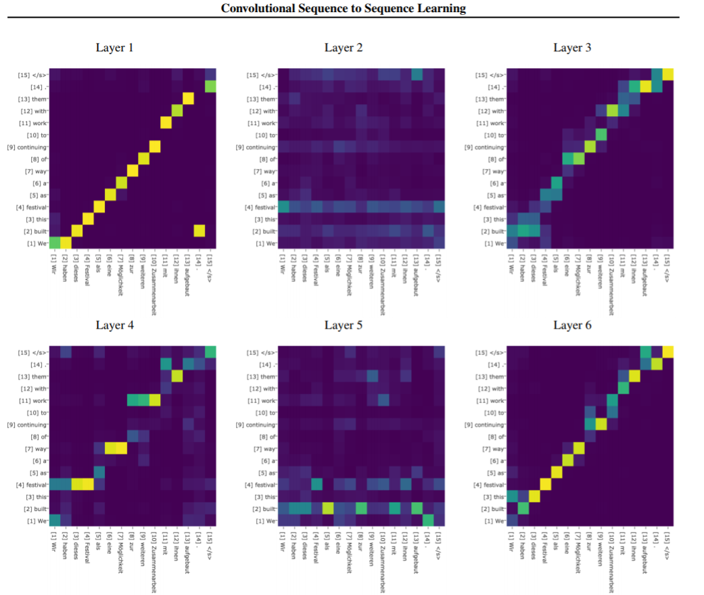

其它paper：

[Grammar as a Foreign Language]

[Teaching Machines to Read and Comprehend]

下面这张Attention热力图表达出了，当人在阅读的时候，注意力大多数放在了文字标题或者段落第一句话，还是蛮符合现实情况的。

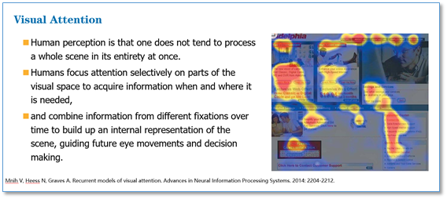

Attention Mechanism是很早的概念了，但随着2017年谷歌的一篇《Attention Is All You Need》被完全引爆。随后会写这篇论文的详细走读和过程推导😎，敬请期待~

## 参考

> https://zhuanlan.zhihu.com/p/42717426
>
> [完全图解RNN、RNN变体、Seq2Seq、Attention机制](https://zhuanlan.zhihu.com/p/28054589)
>
> https://www.jiqizhixin.com/articles/2018-12-14-4