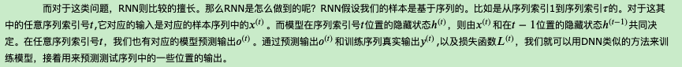
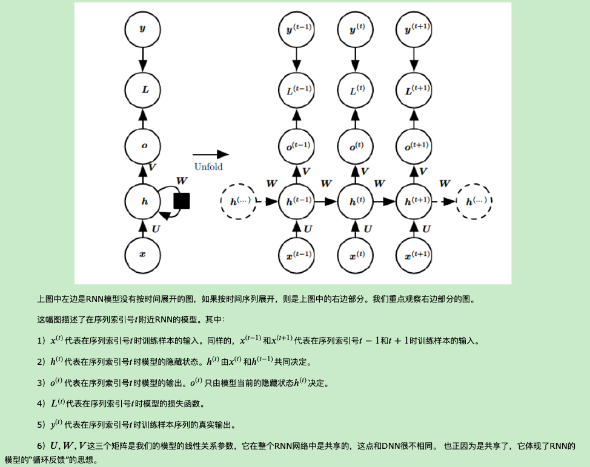
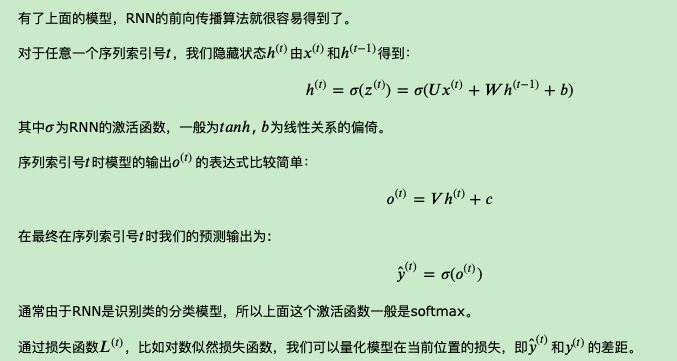
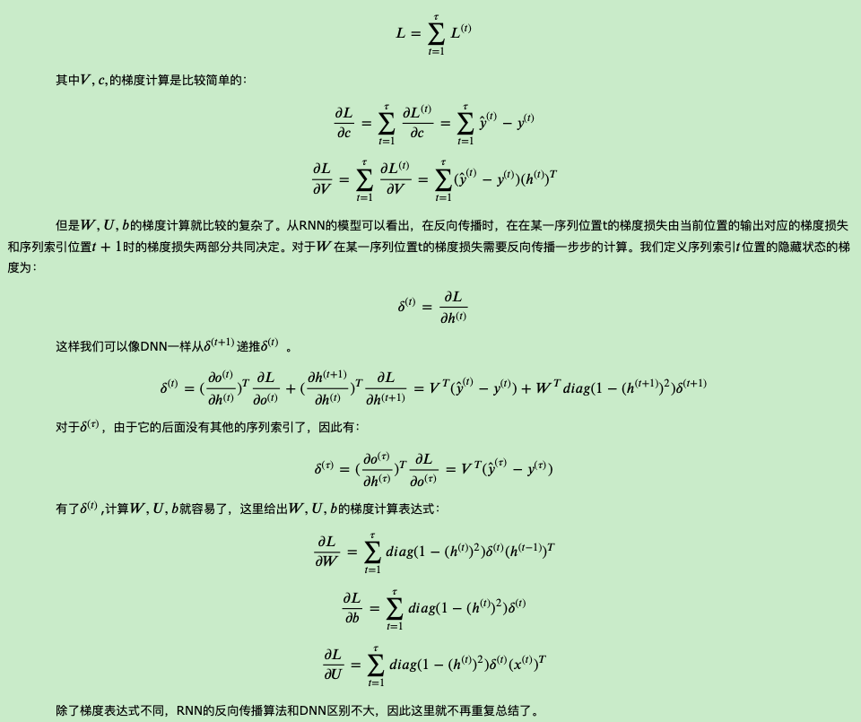

# [循环神经网络(RNN)模型与前向反向传播算法](https://www.cnblogs.com/pinard/p/6509630.html)

2020年12月2日

---

　　　　

在前面我们讲到了DNN，以及DNN的特例CNN的模型和前向反向传播算法，这些算法都是前向反馈的，模型的输出和模型本身没有关联关系。今天我们就讨论另一类输出和模型间有反馈的神经网络：循环神经网络(Recurrent Neural Networks ，以下简称RNN)，它广泛的用于自然语言处理中的语音识别，手写书别以及机器翻译等领域。

## 1. RNN概述

　　　　在前面讲到的DNN和CNN中，训练样本的输入和输出是比较的确定的。但是有一类问题DNN和CNN不好解决，就是训练样本输入是连续的序列,且序列的长短不一，比如基于时间的序列：一段段连续的语音，一段段连续的手写文字。这些序列比较长，且长度不一，比较难直接的拆分成一个个独立的样本来通过DNN/CNN进行训练。

## 2. RNN模型

　　　　RNN模型有比较多的变种，这里介绍最主流的RNN模型结构如下：

## 3. RNN前向传播算法

## 4. RNN反向传播算法推导

　　　　有了RNN前向传播算法的基础，就容易推导出RNN反向传播算法的流程了。RNN反向传播算法的思路和DNN是一样的，即通过梯度下降法一轮轮的迭代，得到合适的RNN模型参数𝑈,𝑊,𝑉,𝑏,𝑐U,W,V,b,c。由于我们是基于时间反向传播，所以RNN的反向传播有时也叫做BPTT(back-propagation through time)。当然这里的BPTT和DNN也有很大的不同点，即这里所有的𝑈,𝑊,𝑉,𝑏,𝑐U,W,V,b,c在序列的各个位置是共享的，反向传播时我们更新的是相同的参数。

　　　　为了简化描述，这里的损失函数我们为交叉熵损失函数，输出的激活函数为softmax函数，隐藏层的激活函数为tanh函数。

　　　　对于RNN，由于我们在序列的每个位置都有损失函数，因此最终的损失𝐿为：

## 5. RNN小结

　　　　上面总结了通用的RNN模型和前向反向传播算法。当然，有些RNN模型会有些不同，自然前向反向传播的公式会有些不一样，但是原理基本类似。

　　　　RNN虽然理论上可以很漂亮的解决序列数据的训练，但是它也像DNN一样有梯度消失时的问题，当序列很长的时候问题尤其严重。因此，上面的RNN模型一般不能直接用于应用领域。在语音识别，手写书别以及机器翻译等NLP领域实际应用比较广泛的是基于RNN模型的一个特例LSTM，下一篇我们就来讨论LSTM模型。