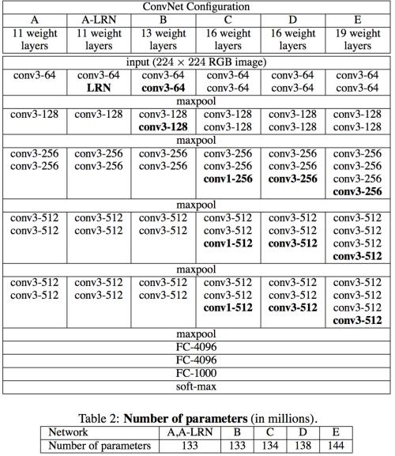
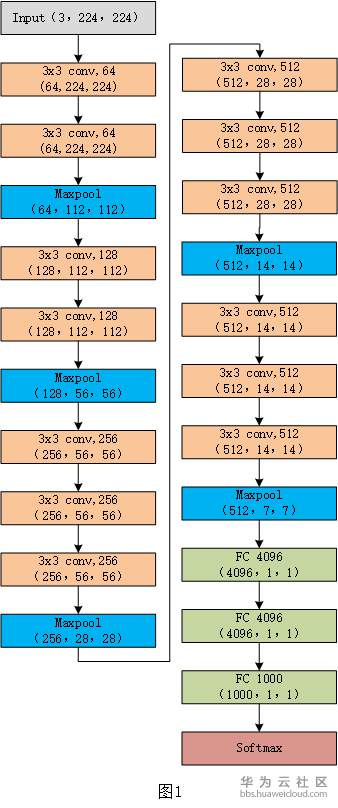
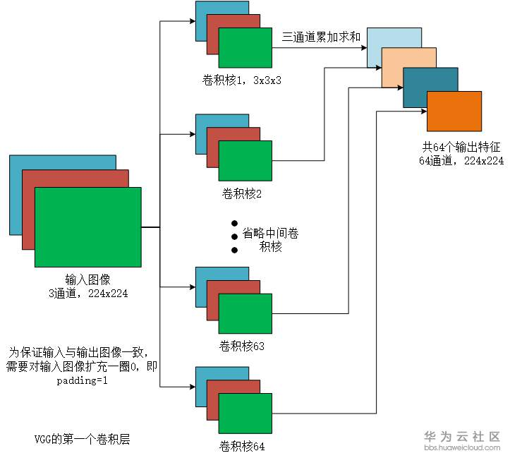
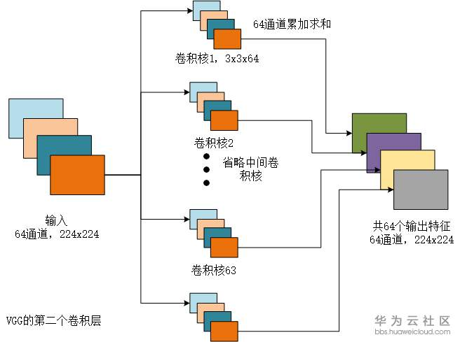
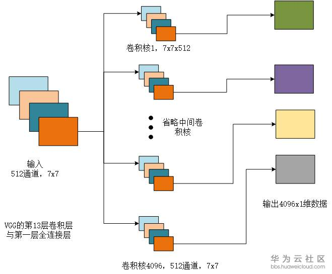
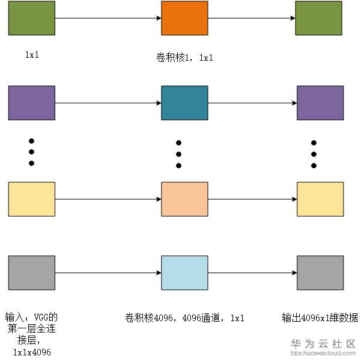
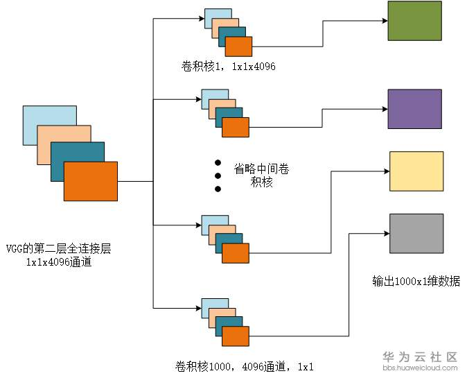

# VGG

2020年8月7日

---

## 1. VGG介绍

VGG的全称为Visual Geometry Group 即视觉几何组，故名思义，是由牛津大学工程科学系的视觉几何组提出的网络。该网络主要是以3x3的卷积核对输入图像进行卷积，并且步长为1，着重进行了卷积网络的深度设计，通过添加更多的卷积层来稳定的增加网络的深度，从而获得更加准确的卷积网络结构。
原文的链接如下：https://arxiv.org/pdf/1409.1556.pdf

## 2. VGG网络结构

以VGG16为例，对输入图像的变换，进行了详解。
VGG16的结构可以分为13层卷积层，3层全连接层，共16层，并没有将池化层放入16层的计数中。
具体结构由图1所示：

首先,输入为224x224的RGB图像，经过二层卷积，尺度从3x224x224变换到64x224x224，再经过一层池化层，进行降维，从64x224x224降到64x112x112，不改变数据的通道数量，尺寸降到112x112，同理各层都是卷积层增加通道数量，池化层进行降维操作。每层卷积过后，会经过relu非线性激活函数，进行非线性映射。图中每一层尺寸的变换已经列出来了，之前一直不太明白，卷积究竟是如何得到不同的通道数，接下来是具体的详解。

### 2.1 第一层

输入是RGB图像，通道数为3，尺寸为224x224。
根据图1所示，第一次卷积是以3x3的卷积，64个通道，卷积后加和，形成第二层卷积，因此输出为64个通道，224*224，如图2所示。

图2

这是经过第一次卷积核后输出的内容，输出的特征需要经过relu激活函数后，更快的收敛。本文主要讨论数据维度的变换，并不关心激活函数的影响，故之后省略激活函数。

### 2.2 第二层

输入为64x224x224的数据，因为通道数与卷积核的数量一致，因此有64个卷积核，这样输出也为64通道
为保证卷积运算，每个卷积核的通道数也是64个通道，大小为3x3，输出的数据为64x224x224，如图3所示。

图3

在vgg16中，池化层是不属于16层的内容里的，起到的作用为数据降维，减少计算量。
如第一层池化，就是将224x224的数据降到112x112

同理，接下来的数据变换都是相类似的操作，不再重复，可以参考图1，都有具体的列出。
那么，思考一下，在经过13层的卷积层，又是如何与全连接层进行联系的？

### 2.3 第一层全连接层

如图1所示，在经过13层与池化层后，此时的数据为512通道，7x7的数据格式，而第一层全连接层是4096个通道，1x1的数据，因此卷积核需要4096个，而输出为一维数据，因此卷积核的大小为7x7x512，得到一个1x1的数据，如图4所示。

图4

### 2.4 第二层全连接层

输入为4096x1的数据，经过4096个卷积核，每一个卷积核均为1x1。输出同样为4096x1维的数据，如图5所示。

图5

### 2.5 第三层全连接层

第三层的全连接层，输出为分类的类别，共有1000种类别。因此构造的卷积核为1000个，每个卷积核的大小为4096x1x1，如图6所示。

图6

### 2.6 小结

本文对VGG16的结构做了详细的说明，并将数据维度的变化，进行详细的图解。
1、需要注意的是，进过3x3的卷积，要使得图像输入与输出的维度不变，需要再周围加0，这也就是为什么padding=1的缘故。具体可以阅读卷积运算的文章。
2、理解结构，方便理解网络参数的规模。如表1为VGG16参数的规模。

输入数据 | 存储大小 | 权重大小
:-----: | :-----: | :-----:
INPUT | 224x224x3 = 150K | 0
CONV3-64 | 224x224x64 =3.2M | (3x3x3)x64 = 1728
CONV3-64 | 224x224x64 =3.2M | (3x3x64)x64 = 36864
MAXPOOL | 112x112x64 =800K | 0
CONV3-128 | 112x112x128 = 1.6M | (3x3x64)x128 = 73728
CONV3-128 | 112x112x128 = 1.6M | (3x3x128)x128 = 147456
MAXPOOL | 56x56x128 = 400k | 0
CONV3-256 | 56x56x256 = 800k| (3x3x128)x256 = 294912
CONV3-256 | 56x56x256 = 800k| (3x3x256)x256 = 589824
CONV3-256 | 56x56x256 = 800k| (3x3x256)x256 = 589824
MAXPOOL | 28x28x256 = 200k | 0
CONV3-512 | 28x28x512 = 400k| (3x3x256)x512 = 1179648
CONV3-512 | 28x28x512 = 400k| (3x3x512)x512 = 2359296
CONV3-512 | 28x28x512 = 400k| (3x3x512)x512 = 2359296
MAXPOOL | 14x14x512 = 100k| 0
CONV3-512 | 14x14x512 = 100k| (3x3x512)x512 = 2359296
CONV3-512 | 14x14x512 = 100k| (3x3x512)x512 = 2359296
CONV3-512 | 14x14x512 = 100k| (3x3x512)x512 = 2359296
MAXPOOL | 7x7x512 = 25k| 0
FC-1 | 1x1x4096 = 4096| 7x7x512x4096 = 102760448
FC-2 | 1x1x4096 = 4096| 4096x4096 = 16777216
FC-3 | 1x1x1000 = 1000| 4096x1000 = 4096000

