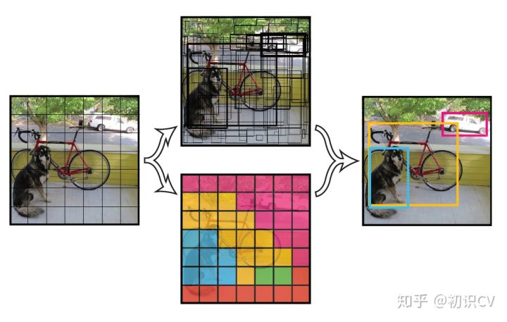
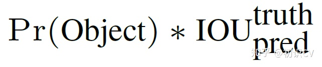
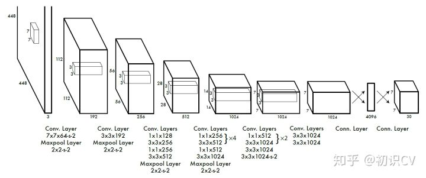
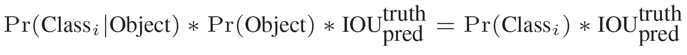
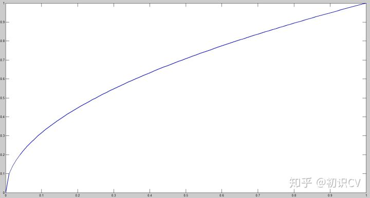
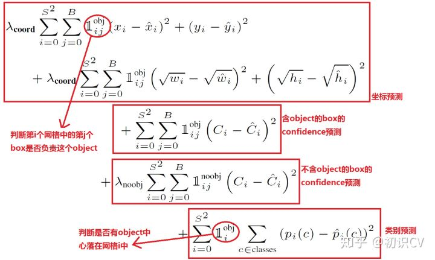

# YOLO系列

YOLOv1,YOLOv2,YOLOv3,YOLOv4,YOLOv5简介

2020年7月31日

---

> YOLO系列是基于深度学习的回归方法。
> RCNN， Fast-RCNN，Faster-RCNN是基于深度学习的分类方法。

**YOLO v.s Faster R-CNN**

1. 统一网络:YOLO没有显示求取region proposal的过程。Faster R-CNN中尽管RPN与fast rcnn共享卷积层，但是在模型训练过程中，需要反复训练RPN网络和fast rcnn网络.相对于R-CNN系列的"看两眼"(候选框提取与分类),YOLO只需要Look Once.
2. YOLO统一为一个回归问题，而R-CNN将检测结果分为两部分求解：物体类别（分类问题），物体位置即bounding box（回归问题）。

## 1. YOLO v1

**论文下载：**[http://arxiv.org/abs/1506.02640](https://link.zhihu.com/?target=http%3A//arxiv.org/abs/1506.02640)

**代码下载：**[https://github.com/pjreddie/darknet](https://link.zhihu.com/?target=https%3A//github.com/pjreddie/darknet)

**核心思想**：将整张图片作为网络的输入（类似于Faster-RCNN），直接在输出层对BBox的位置和类别进行回归。

### 1.1 实现方法

将一幅图像分成SxS个网格(grid cell)，如果某个object的中心 落在这个网格中，则这个网格就负责预测这个object。

每个网络需要预测B个BBox的位置信息和confidence（置信度）信息，一个BBox对应着四个位置信息和一个confidence信息。confidence代表了所预测的box中含有object的置信度和这个box预测的有多准两重信息：

其中如果有object落在一个grid cell里，第一项取1，否则取0。 第二项是预测的bounding box和实际的groundtruth之间的IoU值。

每个bounding box要预测(x, y, w, h)和confidence共5个值，每个网格还要预测一个类别信息，记为C类。则SxS个网格，每个网格要预测B个bounding box还要预测C个categories。输出就是S x S x (5*B+C)的一个tensor。（**注意：class信息是针对每个网格的，confidence信息是针对每个bounding box的。**）

举例说明: 在PASCAL VOC中，图像输入为448x448，取S=7，B=2，一共有20个类别(C=20)。则输出就是7x7x30的一个tensor。整个网络结构如下图所示：

在test的时候，每个网格预测的class信息和bounding box预测的confidence信息相乘，就得到每个bounding box的class-specific confidence score:

等式左边第一项就是每个网格预测的类别信息，第二三项就是每个bounding box预测的confidence。这个乘积即encode了预测的box属于某一类的概率，也有该box准确度的信息。

得到每个box的class-specific confidence score以后，设置阈值，滤掉得分低的boxes，对保留的boxes进行NMS处理，就得到最终的检测结果。

### 1.2 损失函数

在实现中，最主要的就是怎么设计损失函数，让这个**三个方面**（那三个方面？见损失函数公式）得到很好的平衡。作者简单粗暴的全部采用了**sum-squared error loss**来做这件事。

**这种做法存在以下几个问题：**

- 第一，8维的localization error和20维的classification error同等重要显然是不合理的；
- 第二，如果一个网格中没有object（一幅图中这种网格很多），那么就会将这些网格中的box的confidence push到0，相比于较少的有object的网格，这种做法是overpowering（压倒性的）的，这会导致网络不稳定甚至发散。

**解决办法：**

- 更重视8维的坐标预测，给这些损失前面赋予更大的loss weight。
- 对没有object的box的confidence loss，赋予小的loss weight。
- 有object的box的confidence loss和类别的loss的loss weight正常取1。

对不同大小的box预测中，相比于大box预测偏一点，小box预测偏一点肯定更不能被忍受的。而sum-square error loss中对同样的偏移loss是一样。

为了缓和这个问题，作者用了一个比较取巧的办法，就是将box的width和height取平方根代替原本的height和width。这个参考下面的图很容易理解，小box的横轴值较小，发生偏移时，反应到y轴上相比大box要大。（也是个近似逼近方式）

一个网格预测多个box，希望的是每个box predictor专门负责预测某个object。具体做法就是看当前预测的box与ground truth box中哪个IoU大，就负责哪个。这种做法称作box predictor的specialization。

最后整个的损失函数如下所示：

这个损失函数中：

- 只有当某个网格中有object的时候才对classification error进行惩罚。
- 只有当某个box predictor对某个ground truth box负责的时候，才会对box的coordinate error进行惩罚，而对哪个ground truth box负责就看其预测值和ground truth box的IoU是不是在那个cell的所有box中最大。

其他细节，例如使用激活函数使用leak RELU，模型用ImageNet预训练等等

### 1.3 缺点

- 由于输出层为全连接层，因此在检测时，YOLO训练模型只支持与训练图像相同的输入分辨率。
- 虽然每个格子可以预测B个bounding box，但是最终只选择只选择IOU最高的bounding box作为物体检测输出，即每个格子最多只预测出一个物体。当物体占画面比例较小，如图像中包含畜群或鸟群时，每个格子包含多个物体，但却只能检测出其中一个。这是YOLO方法的一个缺陷。
- YOLO loss函数中，大物体IOU误差和小物体IOU误差对网络训练中loss贡献值接近（虽然采用求平方根方式，但没有根本解决问题）。因此，对于小物体，小的IOU误差也会对网络优化过程造成很大的影响，从而降低了物体检测的定位准确性。

## 2. YOLOv2（YOLO9000）

**论文地址：**[https://arxiv.org/abs/1612.08242](https://link.zhihu.com/?target=https%3A//arxiv.org/abs/1612.08242)

YOLOv2相对v1版本，在继续保持处理速度的基础上，从预测**更准确（Better）**，**速度更快（Faster）**，**识别对象更多（Stronger）**这三个方面进行了改进。其中识别更多对象也就是扩展到能够检测9000种不同对象，称之为**YOLO9000**。

文章提出了一种新的**训练方法–联合训练算法**，这种算法可以把这两种的数据集混合到一起。使用一种分层的观点对物体进行分类，用巨量的**分类数据集数据来扩充检测数据集**，从而把两种不同的数据集混合起来。

联合训练算法的基本思路就是：同时在检测数据集和分类数据集上训练物体检测器（Object Detectors ），**用检测数据集的数据学习物体的准确位置，用分类数据集的数据来增加分类的类别量、提升健壮性。**

YOLO9000就是使用联合训练算法训练出来的，他拥有9000类的分类信息，这些分类信息学习自ImageNet分类数据集，而物体位置检测则学习自COCO检测数据集。

YOLOv2相比YOLOv1的改进策略

### 2.1 改进

#### 2.1.1 **Batch Normalization（批量归一化）**

mAP提升2.4%。

批归一化有助于解决反向传播过程中的梯度消失和梯度爆炸问题，降低对一些超参数（比如学习率、网络参数的大小范围、激活函数的选择）的敏感性，并且每个batch分别进行归一化的时候，起到了一定的正则化效果（YOLO2不再使用dropout），从而能够获得更好的收敛速度和收敛效果。

通常，一次训练会输入一批样本（batch）进入神经网络。批规一化在神经网络的每一层，在网络（线性变换）输出后和激活函数（非线性变换）之前增加一个批归一化层（BN），BN层进行如下变换：①对该批样本的各特征量（对于中间层来说，就是每一个神经元）分别进行归一化处理，分别使每个特征的数据分布变换为均值0，方差1。从而使得每一批训练样本在每一层都有类似的分布。这一变换不需要引入额外的参数。②对上一步的输出再做一次线性变换，假设上一步的输出为Z，则Z1=γZ + β。这里γ、β是可以训练的参数。增加这一变换是因为上一步骤中强制改变了特征数据的分布，可能影响了原有数据的信息表达能力。增加的线性变换使其有机会恢复其原本的信息。

#### **2.1.2 High resolution classifier（高分辨率图像分类器）**

mAP提升了3.7%。

图像分类的训练样本很多，而标注了边框的用于训练对象检测的样本相比而言就比较少了，因为标注边框的人工成本比较高。所以对象检测模型通常都先用图像分类样本训练卷积层，提取图像特征。但这引出的另一个问题是，图像分类样本的分辨率不是很高。所以YOLO v1使用ImageNet的图像分类样本采用 224*224 作为输入，来训练CNN卷积层。然后在训练对象检测时，检测用的图像样本采用更高分辨率的 448*448 的图像作为输入。但这样切换对模型性能有一定影响。

**所以YOLO2在采用 224\*224 图像进行分类模型预训练后，再采用 448\*448 的高分辨率样本对分类模型进行微调（10个epoch）**，使网络特征逐渐适应 448*448 的分辨率。然后再使用 448*448 的检测样本进行训练，缓解了分辨率突然切换造成的影响。

**Convolution with anchor boxes（使用先验框）**

召回率大幅提升到88%，同时mAP轻微下降了0.2。

YOLOV1包含有全连接层，从而能直接预测Bounding Boxes的坐标值。 Faster R-CNN的方法只用卷积层与Region Proposal Network来预测Anchor Box的偏移值与置信度，而不是直接预测坐标值。作者发现通过预测偏移量而不是坐标值能够简化问题，让神经网络学习起来更容易。

借鉴Faster RCNN的做法，**YOLO2也尝试采用先验框（anchor）。在每个grid预先设定一组不同大小和宽高比的边框，来覆盖整个图像的不同位置和多种尺度**，这些先验框作为预定义的候选区在神经网络中将检测其中是否存在对象，以及微调边框的位置。

之前YOLO1并没有采用先验框，并且每个grid只预测两个bounding box，整个图像98个。YOLO2如果每个grid采用9个先验框，总共有13*13*9=1521个先验框。所以最终YOLO去掉了全连接层，使用Anchor Boxes来预测 Bounding Boxes。作者去掉了网络中一个Pooling层，这让卷积层的输出能有更高的分辨率。收缩网络让其运行在416*416而不是448*448。

由于图片中的物体都倾向于出现在图片的中心位置，特别是那种比较大的物体，所以有一个单独位于物体中心的位置用于预测这些物体。YOLO的卷积层采用32这个值来下采样图片，所以通过选择416*416用作输入尺寸最终能输出一个13*13的Feature Map。 使用Anchor Box会让精确度稍微下降，但用了它能让YOLO能预测出大于一千个框，同时recall达到88%，mAP达到69.2%。

**Dimension clusters（聚类提取先验框的尺度信息）**

之前Anchor Box的尺寸是手动选择的，所以尺寸还有优化的余地。 YOLO2尝试统计出更符合样本中对象尺寸的先验框，这样就可以减少网络微调先验框到实际位置的难度。YOLO2的做法是对训练集中标注的边框进行K-mean聚类分析，以寻找尽可能匹配样本的边框尺寸。

如果我们用标准的欧式距离的k-means，尺寸大的框比小框产生更多的错误。因为我们的目的是提高IOU分数，这依赖于Box的大小，所以距离度量的使用：

centroid是聚类时被选作中心的边框，box就是其它边框，d就是两者间的“距离”。IOU越大，“距离”越近。YOLO2给出的聚类分析结果如下图所示：

通过分析实验结果（Figure 2），左图：在model复杂性与high recall之间权衡之后，选择聚类分类数K=5。右图：是聚类的中心，大多数是高瘦的Box。

Table1是说明用K-means选择Anchor Boxes时，当Cluster IOU选择值为5时，AVG IOU的值是61，这个值要比不用聚类的方法的60.9要高。选择值为9的时候，AVG IOU更有显著提高。总之就是说明用聚类的方法是有效果的。

## Direct location prediction（**约束预测边框的位置**）

借鉴于Faster RCNN的先验框方法，在训练的早期阶段，其位置预测容易不稳定。其位置预测公式为： ![[公式]](https://www.zhihu.com/equation?tex=%5C%5C+x%3D%28t_x%E2%88%97w_a%29%2Bx_a+%5C%5C+y%3D%28t_y%E2%88%97h_a%29%2By_a+)

其中， ![[公式]](https://www.zhihu.com/equation?tex=x%2Cy) 是预测边框的中心， ![[公式]](https://www.zhihu.com/equation?tex=x_a%2Cy_a) 是先验框（anchor）的中心点坐标， ![[公式]](https://www.zhihu.com/equation?tex=w_a%2Ch_a) 是先验框（anchor）的宽和高， ![[公式]](https://www.zhihu.com/equation?tex=t_x%2Ct_y) 是要学习的参数。 注意，YOLO论文中写的是 ![[公式]](https://www.zhihu.com/equation?tex=x%3D%28t_x%E2%88%97w_a%29-x_a)，根据Faster RCNN，应该是"+"。

由于 ![[公式]](https://www.zhihu.com/equation?tex=t_x%2Ct_y) 的取值没有任何约束，因此预测边框的中心可能出现在任何位置，训练早期阶段不容易稳定。YOLO调整了预测公式，将预测边框的中心约束在特定gird网格内。 ![[公式]](https://www.zhihu.com/equation?tex=%5C%5C+b_x%3D%CF%83%28t_x%29%2Bc_x++%5C%5C+b_y%3D%CF%83%28t_y%29%2Bc_y++%5C%5C+b_w%3Dp_we%5E%7Bt_w%7D++%5C%5C+b_h%3Dp_he%5E%7Bt_h%7D++%5C%5C+Pr%28object%29%E2%88%97IOU%28b%2Cobject%29%3D%CF%83%28t_o%29+)

其中， ![[公式]](https://www.zhihu.com/equation?tex=b_x%2Cb_y%2Cb_w%2Cb_h) 是预测边框的中心和宽高。 ![[公式]](https://www.zhihu.com/equation?tex=Pr%28object%29%E2%88%97IOU%28b%2Cobject%29) 是预测边框的置信度，YOLO1是直接预测置信度的值，这里对预测参数 ![[公式]](https://www.zhihu.com/equation?tex=t_o) 进行σ变换后作为置信度的值。 ![[公式]](https://www.zhihu.com/equation?tex=c_x%2Cc_y)是当前网格左上角到图像左上角的距离，要先将网格大小归一化，即令一个网格的宽=1，高=1。 ![[公式]](https://www.zhihu.com/equation?tex=p_w%2Cp_h) 是先验框的宽和高。 σ是sigmoid函数。 ![[公式]](https://www.zhihu.com/equation?tex=t_x%2Ct_y%2Ct_w%2Ct_h%2Ct_o) 是要学习的参数，分别用于预测边框的中心和宽高，以及置信度。

因为使用了限制让数值变得参数化，也让网络更容易学习、更稳定。

**Fine-Grained Features（passthrough层检测细粒度特征）**

passthrough层检测细粒度特征使mAP提升1。

对象检测面临的一个问题是图像中对象会有大有小，输入图像经过多层网络提取特征，最后输出的特征图中（比如YOLO2中输入416*416经过卷积网络下采样最后输出是13*13），较小的对象可能特征已经不明显甚至被忽略掉了。为了更好的检测出一些比较小的对象，最后输出的特征图需要保留一些更细节的信息。

YOLO2引入一种称为passthrough层的方法在特征图中保留一些细节信息。具体来说，就是在最后一个pooling之前，特征图的大小是26*26*512，将其1拆4，直接传递（passthrough）到pooling后（并且又经过一组卷积）的特征图，两者叠加到一起作为输出的特征图。

具体怎样1拆4，下面借用一副图看的很清楚。图中示例的是1个4*4拆成4个2*2。因为深度不变，所以没有画出来。

另外，根据YOLO2的代码，特征图先用1*1卷积从 26*26*512 降维到 26*26*64，再做1拆4并passthrough。下面图6有更详细的网络输入输出结构。

**Multi-ScaleTraining（多尺度图像训练）**

作者希望YOLO v2能健壮的运行于不同尺寸的图片之上，所以把这一想法用于训练model中。

区别于之前的补全图片的尺寸的方法，YOLO v2每迭代几次都会改变网络参数。每10个Batch，网络会随机地选择一个新的图片尺寸，由于使用了下采样参数是32，所以不同的尺寸大小也选择为32的倍数{320，352…..608}，最小320*320，最大608*608，网络会自动改变尺寸，并继续训练的过程。

这一政策让网络在不同的输入尺寸上都能达到一个很好的预测效果，同一网络能在不同分辨率上进行检测。当输入图片尺寸比较小的时候跑的比较快，输入图片尺寸比较大的时候精度高，所以你可以在YOLO v2的速度和精度上进行权衡。

Figure4，Table 3：在voc2007上的速度与精度

**hi-res detector（高分辨率图像的对象检测）**

图1表格中最后一行有个hi-res detector，使mAP提高了1.8。因为YOLO2调整网络结构后能够支持多种尺寸的输入图像。通常是使用416*416的输入图像，如果用较高分辨率的输入图像，比如544*544，则mAP可以达到78.6，有1.8的提升。

### Hierarchical classification（分层分类）

作者提出了一种在分类数据集和检测数据集上联合训练的机制。使用检测数据集的图片去学习检测相关的信息，例如bounding box 坐标预测，是否包含物体以及属于各个物体的概率。使用仅有类别标签的分类数据集图片去扩展可以检测的种类。

作者通过ImageNet训练分类、COCO和VOC数据集来训练检测，这是一个很有价值的思路，可以让我们达到比较优的效果。 通过将两个数据集混合训练，**如果遇到来自分类集的图片则只计算分类的Loss，遇到来自检测集的图片则计算完整的Loss。**

但是ImageNet对应分类有9000种，而COCO则只提供80种目标检测，作者使用multi-label模型，即假定一张图片可以有多个label，并且不要求label间独立。通过作者Paper里的图来说明，由于ImageNet的类别是从WordNet选取的，作者采用以下策略重建了一个树形结构（称为分层树）：

1. 遍历Imagenet的label，然后在WordNet中寻找该label到根节点(指向一个物理对象)的路径；
2. 如果路径直有一条，那么就将该路径直接加入到分层树结构中；
3. 否则，从剩余的路径中选择一条最短路径，加入到分层树。

这个分层树我们称之为 WordTree，作用就在于将两种数据集按照层级进行结合。

分类时的概率计算借用了决策树思想，**某个节点的概率值等于该节点到根节点的所有条件概率之积**。最终结果是一颗 WordTree （视觉名词组成的层次结构模型）。用WordTree执行分类时，预测每个节点的条件概率。如果想求得特定节点的绝对概率，只需要沿着路径做连续乘积。例如，如果想知道一张图片是不是“Norfolk terrier ”需要计算：

另外，为了验证这种方法作者在WordTree（用1000类别的ImageNet创建）上训练了Darknet-19模型。为了创建WordTree1k，作者天添加了很多中间节点，把标签由1000扩展到1369。训练过程中ground truth标签要顺着向根节点的路径传播。例如，如果一张图片被标记为“Norfolk terrier”，它也被标记为“dog” 和“mammal”等。为了计算条件概率，模型预测了一个包含1369个元素的向量，而且基于所有“同义词集”计算softmax，其中“同义词集”是同一概念的下位词。

softmax操作也同时应该采用分组操作，下图上半部分为ImageNet对应的原生Softmax，下半部分对应基于WordTree的Softmax：

通过上述方案构造WordTree，得到对应9418个分类，通过重采样保证Imagenet和COCO的样本数据比例为4:1。

## 参考

> [Yolo系列](https://zhuanlan.zhihu.com/p/136382095)
>
> [Yolo官网](https://github.com/pjreddie/darknet)
>
> 