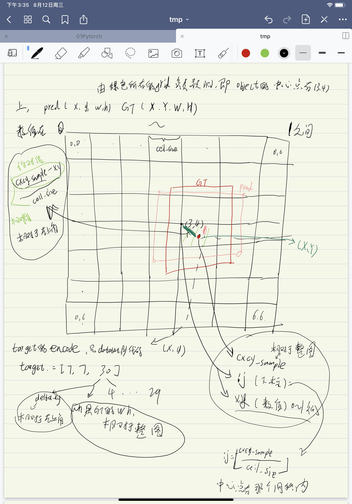
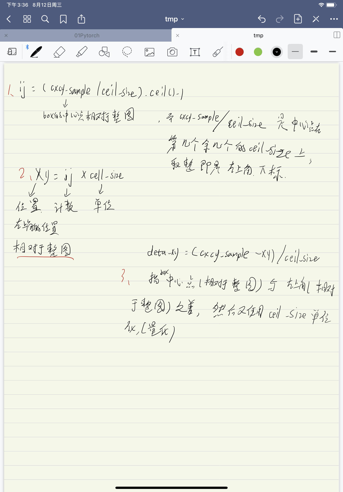
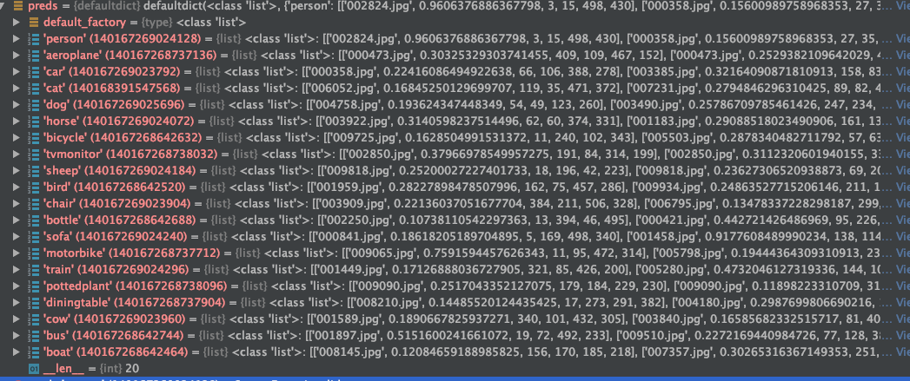
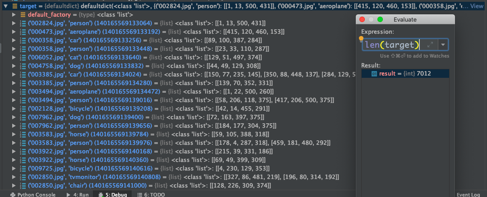
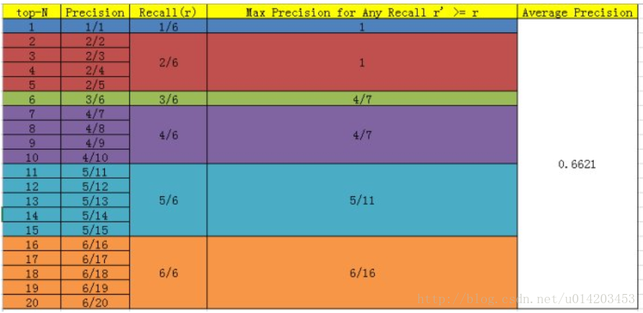

# Yolo v1代码

2020年8月12日

---

## 1. dataset.py

```python
    def encoder(self, boxes, labels):
        """
        boxes (tensor) [[x1,y1,x2,y2],[]]
        labels (tensor) [...]
        return 14x14x30
        """
        grid_num = 14
        target = torch.zeros((grid_num, grid_num, 30))	# torch.Size([14, 14, 30])
        cell_size = 1./grid_num			# 0.07142857142857142
        wh = boxes[:, 2:] - boxes[:, :2]    # 这张图片，有n=3个box，每个box的wh torch.Size([3, 2])
        cxcy = (boxes[:, 2:] + boxes[:, :2]) / 2    # n个box的中心xy  torch.Size([3, 2])
        for i in range(cxcy.size()[0]):
            cxcy_sample = cxcy[i]
            ij = (cxcy_sample/cell_size).ceil()-1  # 将cxcy_sample定位到cell（网格）中
            target[int(ij[1]), int(ij[0]), 4] = 1   # 将target中box设为1
            target[int(ij[1]), int(ij[0]), 9] = 1   # 将target中box设为1
            target[int(ij[1]), int(ij[0]), int(labels[i])+9] = 1    # 将target中class设为1
            xy = ij*cell_size  # 匹配到的网格的左上角相对坐标
            delta_xy = (cxcy_sample - xy)/cell_size
            target[int(ij[1]), int(ij[0]), 2:4] = wh[i]
            target[int(ij[1]), int(ij[0]), :2] = delta_xy
            target[int(ij[1]), int(ij[0]), 7:9] = wh[i]
            target[int(ij[1]), int(ij[0]), 5:7] = delta_xy
        return target
```

encoder是将标签文件中的boxes（boxes是一个图片的所有box，格式为[[x,y,w,h], ...]; lables为一个图片中所有object的labels）。

假设images.txt的第一行是

```
2007_008218.jpg 194 90 495 375 14 124 334 164 375 14 100 273 139 361 14
```

所以boxes的size是[3, 4], lables的size是[4]。


```
wh = boxes[:, 2:] - boxes[:, :2]    # 这张图片，有n=3个box，每个box的wh torch.Size([3, 2])```
```

tensor([[0.6020, 0.7600],
        [0.0800, 0.1093],
        [0.0780, 0.2347]])


```python
cxcy = (boxes[:, 2:] + boxes[:, :2]) / 2    # n个box的中心xy  torch.Size([3, 2])
```

tensor([[0.6890, 0.6200],
        [0.2880, 0.9453],
        [0.2390, 0.8453]])


```
cxcy_sample = cxcy[i]
```

tensor([0.6890, 0.6200])


```
ij = (cxcy_sample/cell_size).ceil()-1  # 将cxcy_sample定位到cell（网格）中
```

tensor([9., 8.])

box在行为9，列为8 的位置。


```
target[int(ij[1]), int(ij[0]), 4] = 1   # 将target中box设为1
target[int(ij[1]), int(ij[0]), 9] = 1   # 将target中box设为1
target[int(ij[1]), int(ij[0]), int(labels[i])+9] = 1    # 将target中class设为1
```

将target中对应box的confidence设置为1，


```
xy = ij*cell_size  # 匹配到的网格的左上角相对坐标
```

tensor([0.6429, 0.5714])


```
delta_xy = (cxcy_sample - xy)/cell_size
```

tensor([0.6460, 0.6800])

中心cxcy_sample到左上角xy的**相对**距离。


```
target[int(ij[1]), int(ij[0]), 2:4] = wh[i]
target[int(ij[1]), int(ij[0]), :2] = delta_xy
target[int(ij[1]), int(ij[0]), 7:9] = wh[i]
target[int(ij[1]), int(ij[0]), 5:7] = delta_xy
```

将一个box封装成target格式。

**没搞懂，为什么是int(ij[1]), int(ij[0])，而不是int(ij[0]), int(ij[1])**

总体结果如下：





## 2. resnet_yolo.py

```shell
----------------------------------------------------------------
        Layer (type)               Output Shape         Param #
================================================================
            Conv2d-1         [-1, 64, 209, 209]           9,408
       BatchNorm2d-2         [-1, 64, 209, 209]             128
              ReLU-3         [-1, 64, 209, 209]               0
         MaxPool2d-4         [-1, 64, 105, 105]               0
            Conv2d-5         [-1, 64, 105, 105]           4,096
       BatchNorm2d-6         [-1, 64, 105, 105]             128
              ReLU-7         [-1, 64, 105, 105]               0
            Conv2d-8         [-1, 64, 105, 105]          36,864
       BatchNorm2d-9         [-1, 64, 105, 105]             128
             ReLU-10         [-1, 64, 105, 105]               0
           Conv2d-11        [-1, 256, 105, 105]          16,384
      BatchNorm2d-12        [-1, 256, 105, 105]             512
           Conv2d-13        [-1, 256, 105, 105]          16,384
      BatchNorm2d-14        [-1, 256, 105, 105]             512
             ReLU-15        [-1, 256, 105, 105]               0
       Bottleneck-16        [-1, 256, 105, 105]               0
           Conv2d-17         [-1, 64, 105, 105]          16,384
      BatchNorm2d-18         [-1, 64, 105, 105]             128
             ReLU-19         [-1, 64, 105, 105]               0
           Conv2d-20         [-1, 64, 105, 105]          36,864
      BatchNorm2d-21         [-1, 64, 105, 105]             128
             ReLU-22         [-1, 64, 105, 105]               0
           Conv2d-23        [-1, 256, 105, 105]          16,384
      BatchNorm2d-24        [-1, 256, 105, 105]             512
             ReLU-25        [-1, 256, 105, 105]               0
       Bottleneck-26        [-1, 256, 105, 105]               0
           Conv2d-27         [-1, 64, 105, 105]          16,384
      BatchNorm2d-28         [-1, 64, 105, 105]             128
             ReLU-29         [-1, 64, 105, 105]               0
           Conv2d-30         [-1, 64, 105, 105]          36,864
      BatchNorm2d-31         [-1, 64, 105, 105]             128
             ReLU-32         [-1, 64, 105, 105]               0
           Conv2d-33        [-1, 256, 105, 105]          16,384
      BatchNorm2d-34        [-1, 256, 105, 105]             512
             ReLU-35        [-1, 256, 105, 105]               0
       Bottleneck-36        [-1, 256, 105, 105]               0
           Conv2d-37        [-1, 128, 105, 105]          32,768
      BatchNorm2d-38        [-1, 128, 105, 105]             256
             ReLU-39        [-1, 128, 105, 105]               0
           Conv2d-40          [-1, 128, 53, 53]         147,456
      BatchNorm2d-41          [-1, 128, 53, 53]             256
             ReLU-42          [-1, 128, 53, 53]               0
           Conv2d-43          [-1, 512, 53, 53]          65,536
      BatchNorm2d-44          [-1, 512, 53, 53]           1,024
           Conv2d-45          [-1, 512, 53, 53]         131,072
      BatchNorm2d-46          [-1, 512, 53, 53]           1,024
             ReLU-47          [-1, 512, 53, 53]               0
       Bottleneck-48          [-1, 512, 53, 53]               0
           Conv2d-49          [-1, 128, 53, 53]          65,536
      BatchNorm2d-50          [-1, 128, 53, 53]             256
             ReLU-51          [-1, 128, 53, 53]               0
           Conv2d-52          [-1, 128, 53, 53]         147,456
      BatchNorm2d-53          [-1, 128, 53, 53]             256
             ReLU-54          [-1, 128, 53, 53]               0
           Conv2d-55          [-1, 512, 53, 53]          65,536
      BatchNorm2d-56          [-1, 512, 53, 53]           1,024
             ReLU-57          [-1, 512, 53, 53]               0
       Bottleneck-58          [-1, 512, 53, 53]               0
           Conv2d-59          [-1, 128, 53, 53]          65,536
      BatchNorm2d-60          [-1, 128, 53, 53]             256
             ReLU-61          [-1, 128, 53, 53]               0
           Conv2d-62          [-1, 128, 53, 53]         147,456
      BatchNorm2d-63          [-1, 128, 53, 53]             256
             ReLU-64          [-1, 128, 53, 53]               0
           Conv2d-65          [-1, 512, 53, 53]          65,536
      BatchNorm2d-66          [-1, 512, 53, 53]           1,024
             ReLU-67          [-1, 512, 53, 53]               0
       Bottleneck-68          [-1, 512, 53, 53]               0
           Conv2d-69          [-1, 128, 53, 53]          65,536
      BatchNorm2d-70          [-1, 128, 53, 53]             256
             ReLU-71          [-1, 128, 53, 53]               0
           Conv2d-72          [-1, 128, 53, 53]         147,456
      BatchNorm2d-73          [-1, 128, 53, 53]             256
             ReLU-74          [-1, 128, 53, 53]               0
           Conv2d-75          [-1, 512, 53, 53]          65,536
      BatchNorm2d-76          [-1, 512, 53, 53]           1,024
             ReLU-77          [-1, 512, 53, 53]               0
       Bottleneck-78          [-1, 512, 53, 53]               0
           Conv2d-79          [-1, 256, 53, 53]         131,072
      BatchNorm2d-80          [-1, 256, 53, 53]             512
             ReLU-81          [-1, 256, 53, 53]               0
           Conv2d-82          [-1, 256, 27, 27]         589,824
      BatchNorm2d-83          [-1, 256, 27, 27]             512
             ReLU-84          [-1, 256, 27, 27]               0
           Conv2d-85         [-1, 1024, 27, 27]         262,144
      BatchNorm2d-86         [-1, 1024, 27, 27]           2,048
           Conv2d-87         [-1, 1024, 27, 27]         524,288
      BatchNorm2d-88         [-1, 1024, 27, 27]           2,048
             ReLU-89         [-1, 1024, 27, 27]               0
       Bottleneck-90         [-1, 1024, 27, 27]               0
           Conv2d-91          [-1, 256, 27, 27]         262,144
      BatchNorm2d-92          [-1, 256, 27, 27]             512
             ReLU-93          [-1, 256, 27, 27]               0
           Conv2d-94          [-1, 256, 27, 27]         589,824
      BatchNorm2d-95          [-1, 256, 27, 27]             512
             ReLU-96          [-1, 256, 27, 27]               0
           Conv2d-97         [-1, 1024, 27, 27]         262,144
      BatchNorm2d-98         [-1, 1024, 27, 27]           2,048
             ReLU-99         [-1, 1024, 27, 27]               0
      Bottleneck-100         [-1, 1024, 27, 27]               0
          Conv2d-101          [-1, 256, 27, 27]         262,144
     BatchNorm2d-102          [-1, 256, 27, 27]             512
            ReLU-103          [-1, 256, 27, 27]               0
          Conv2d-104          [-1, 256, 27, 27]         589,824
     BatchNorm2d-105          [-1, 256, 27, 27]             512
            ReLU-106          [-1, 256, 27, 27]               0
          Conv2d-107         [-1, 1024, 27, 27]         262,144
     BatchNorm2d-108         [-1, 1024, 27, 27]           2,048
            ReLU-109         [-1, 1024, 27, 27]               0
      Bottleneck-110         [-1, 1024, 27, 27]               0
          Conv2d-111          [-1, 256, 27, 27]         262,144
     BatchNorm2d-112          [-1, 256, 27, 27]             512
            ReLU-113          [-1, 256, 27, 27]               0
          Conv2d-114          [-1, 256, 27, 27]         589,824
     BatchNorm2d-115          [-1, 256, 27, 27]             512
            ReLU-116          [-1, 256, 27, 27]               0
          Conv2d-117         [-1, 1024, 27, 27]         262,144
     BatchNorm2d-118         [-1, 1024, 27, 27]           2,048
            ReLU-119         [-1, 1024, 27, 27]               0
      Bottleneck-120         [-1, 1024, 27, 27]               0
          Conv2d-121          [-1, 256, 27, 27]         262,144
     BatchNorm2d-122          [-1, 256, 27, 27]             512
            ReLU-123          [-1, 256, 27, 27]               0
          Conv2d-124          [-1, 256, 27, 27]         589,824
     BatchNorm2d-125          [-1, 256, 27, 27]             512
            ReLU-126          [-1, 256, 27, 27]               0
          Conv2d-127         [-1, 1024, 27, 27]         262,144
     BatchNorm2d-128         [-1, 1024, 27, 27]           2,048
            ReLU-129         [-1, 1024, 27, 27]               0
      Bottleneck-130         [-1, 1024, 27, 27]               0
          Conv2d-131          [-1, 256, 27, 27]         262,144
     BatchNorm2d-132          [-1, 256, 27, 27]             512
            ReLU-133          [-1, 256, 27, 27]               0
          Conv2d-134          [-1, 256, 27, 27]         589,824
     BatchNorm2d-135          [-1, 256, 27, 27]             512
            ReLU-136          [-1, 256, 27, 27]               0
          Conv2d-137         [-1, 1024, 27, 27]         262,144
     BatchNorm2d-138         [-1, 1024, 27, 27]           2,048
            ReLU-139         [-1, 1024, 27, 27]               0
      Bottleneck-140         [-1, 1024, 27, 27]               0
          Conv2d-141          [-1, 512, 27, 27]         524,288
     BatchNorm2d-142          [-1, 512, 27, 27]           1,024
            ReLU-143          [-1, 512, 27, 27]               0
          Conv2d-144          [-1, 512, 14, 14]       2,359,296
     BatchNorm2d-145          [-1, 512, 14, 14]           1,024
            ReLU-146          [-1, 512, 14, 14]               0
          Conv2d-147         [-1, 2048, 14, 14]       1,048,576
     BatchNorm2d-148         [-1, 2048, 14, 14]           4,096
          Conv2d-149         [-1, 2048, 14, 14]       2,097,152
     BatchNorm2d-150         [-1, 2048, 14, 14]           4,096
            ReLU-151         [-1, 2048, 14, 14]               0
      Bottleneck-152         [-1, 2048, 14, 14]               0
          Conv2d-153          [-1, 512, 14, 14]       1,048,576
     BatchNorm2d-154          [-1, 512, 14, 14]           1,024
            ReLU-155          [-1, 512, 14, 14]               0
          Conv2d-156          [-1, 512, 14, 14]       2,359,296
     BatchNorm2d-157          [-1, 512, 14, 14]           1,024
            ReLU-158          [-1, 512, 14, 14]               0
          Conv2d-159         [-1, 2048, 14, 14]       1,048,576
     BatchNorm2d-160         [-1, 2048, 14, 14]           4,096
            ReLU-161         [-1, 2048, 14, 14]               0
      Bottleneck-162         [-1, 2048, 14, 14]               0
          Conv2d-163          [-1, 512, 14, 14]       1,048,576
     BatchNorm2d-164          [-1, 512, 14, 14]           1,024
            ReLU-165          [-1, 512, 14, 14]               0
          Conv2d-166          [-1, 512, 14, 14]       2,359,296
     BatchNorm2d-167          [-1, 512, 14, 14]           1,024
            ReLU-168          [-1, 512, 14, 14]               0
          Conv2d-169         [-1, 2048, 14, 14]       1,048,576
     BatchNorm2d-170         [-1, 2048, 14, 14]           4,096
            ReLU-171         [-1, 2048, 14, 14]               0
      Bottleneck-172         [-1, 2048, 14, 14]               0
          Conv2d-173          [-1, 256, 14, 14]         524,288
     BatchNorm2d-174          [-1, 256, 14, 14]             512
          Conv2d-175          [-1, 256, 14, 14]         589,824
     BatchNorm2d-176          [-1, 256, 14, 14]             512
          Conv2d-177          [-1, 256, 14, 14]          65,536
     BatchNorm2d-178          [-1, 256, 14, 14]             512
          Conv2d-179          [-1, 256, 14, 14]         524,288
     BatchNorm2d-180          [-1, 256, 14, 14]             512
detnet_bottleneck-181          [-1, 256, 14, 14]               0
          Conv2d-182          [-1, 256, 14, 14]          65,536
     BatchNorm2d-183          [-1, 256, 14, 14]             512
          Conv2d-184          [-1, 256, 14, 14]         589,824
     BatchNorm2d-185          [-1, 256, 14, 14]             512
          Conv2d-186          [-1, 256, 14, 14]          65,536
     BatchNorm2d-187          [-1, 256, 14, 14]             512
detnet_bottleneck-188          [-1, 256, 14, 14]               0
          Conv2d-189          [-1, 256, 14, 14]          65,536
     BatchNorm2d-190          [-1, 256, 14, 14]             512
          Conv2d-191          [-1, 256, 14, 14]         589,824
     BatchNorm2d-192          [-1, 256, 14, 14]             512
          Conv2d-193          [-1, 256, 14, 14]          65,536
     BatchNorm2d-194          [-1, 256, 14, 14]             512
detnet_bottleneck-195          [-1, 256, 14, 14]               0
          Conv2d-196           [-1, 30, 14, 14]          69,120
     BatchNorm2d-197           [-1, 30, 14, 14]              60
================================================================
Total params: 26,728,060
Trainable params: 26,728,060
Non-trainable params: 0
----------------------------------------------------------------
Input size (MB): 2.00
Forward/backward pass size (MB): 1038.47
Params size (MB): 101.96
Estimated Total Size (MB): 1142.43
----------------------------------------------------------------
```


## 3. yoloLoss.py

### 3.1 内容筛选

```
def forward(self, pred_tensor, target_tensor):
				"""
        pred_tensor: (tensor) size(batchsize,S,S,Bx5+20=30) [x,y,w,h,c]
        torch.Size([24, 14, 14, 30])

        target_tensor: (tensor) size(batchsize,S,S,30)
        torch.Size([24, 14, 14, 30])
        """
```

pred_tensor:		torch.Size([24, 14, 14, 30])

 target_tensor: 	torch.Size([24, 14, 14, 30])   


```
N = pred_tensor.size()[0]

# 筛选有object和无object的bbox + confidence + classes——生成掩码
coo_mask = target_tensor[:, :, :, 4] > 0    # 有object， torch.Size([24, 14, 14])
noo_mask = target_tensor[:, :, :, 4] == 0    # 无object， torch.Size([24, 14, 14])
coo_mask = coo_mask.unsqueeze(-1).expand_as(target_tensor)  # torch.Size([24, 14, 14, 30])
noo_mask = noo_mask.unsqueeze(-1).expand_as(target_tensor)
```

N为batchsize个数，

coco_mask 有object的筛选掩码；torch.Size([24, 14, 14, 30])

noo_mask无object的掩码；torch.Size([24, 14, 14,30])


```
# 筛选有object和无object的bbox + confidence + classes——筛选有pred中object
coo_pred = pred_tensor[coo_mask].view(-1, 30)   # 有43个object， torch.Size([43, 30])
box_pred = coo_pred[:, :10].contiguous().view(-1, 5)  # torch.Size([86, 5]) box[x1,y1,w1,h1,c1]
class_pred = coo_pred[:, 10:]  # torch.Size([43, 20])
```

coo_pred：torch.Size([43, 30])

**box_pred**：torch.Size([86, 5])	预测box（有object）

**class_pred**：torch.Size([43, 20])	预测classes（有object）


```
# 筛选有object和无object的bbox + confidence + classes——筛选target中有object
coo_target = target_tensor[coo_mask].view(-1, 30)
box_target = coo_target[:, :10].contiguous().view(-1, 5)
class_target = coo_target[:, 10:]
```

coo_target：torch.Size([43, 30])

**box_target**：torch.Size([86, 5])	标签box（有object）

**class_target**：torch.Size([43, 20])	标签classes（有object）


> 总结
>
> coco_mask 有object的筛选掩码；torch.Size([24, 14, 14, 30])
>
> noo_mask无object的掩码；torch.Size([24, 14, 14,30])
>
> **box_pred**：torch.Size([86, 5])	预测box（有object）
>
> **class_pred**：torch.Size([43, 20])	预测classes（有object）
>
> **box_target**：torch.Size([86, 5])	标签box（有object）
>
> **class_target**：torch.Size([43, 20])	标签classes（有object）

### 3.2 计算noobject的confidence损失

```python
# compute not contain obj loss
noo_pred = pred_tensor[noo_mask].view(-1, 30)   # torch.Size([4661, 30])
noo_target = target_tensor[noo_mask].view(-1, 30)   # torch.Size([4661, 30])
noo_pred_mask = torch.cuda.ByteTensor(noo_pred.size()).bool()   # torch.Size([4661, 30])
noo_pred_mask.zero_()
noo_pred_mask[:, 4] = 1
noo_pred_mask[:, 9] = 1
noo_pred_c = noo_pred[noo_pred_mask]  # torch.Size([9322])  noo pred只需要计算 c 的损失 size[-1,2]
noo_target_c = noo_target[noo_pred_mask]    # torch.Size([9322])
# 第4个
nooobj_loss = F.mse_loss(noo_pred_c, noo_target_c, size_average=False)
```

**noo_pred**：torch.Size([4661, 30])	无object的pred 。24\*14\*14 = 4704.  4704-4661 = 43,即网络一共预测了4704个grid，其中有object的公43个，无object的4661个。

**noo_target**：torch.Size([4661, 30])。无object的target


`noo_pred_mask = torch.cuda.ByteTensor(noo_pred.size()).bool()   # torch.Size([4661, 30])`

`noo_pred_mask.zero_()`

`noo_pred_mask[:, 4] = 1`

`noo_pred_mask[:, 9] = 1`

noo_pred_mask ：筛选无object的所有box的confidence。  在 torch.Size([4661, 30])矩阵中，有4661\*2个为True

noo_pred_c：torch.Size([9322])

noo_target_c：torch.Size([9322])

**nooobj_loss** = F.mse_loss(noo_pred_c, noo_target_c, size_average=False)

图中第三个红框的内容。


### 3.3 从B个box中筛选IOU最大的

```python
# compute contain obj loss
coo_response_mask = torch.cuda.ByteTensor(box_target.size()).bool()  # box_target.size() = torch.Size([86, 5])
coo_response_mask.zero_()
coo_not_response_mask = torch.cuda.ByteTensor(box_target.size()).bool()
coo_not_response_mask.zero_()
box_target_iou = torch.zeros(box_target.size()).cuda()  # torch.Size([86, 5])
for i in range(0, box_target.size()[0], 2):  # choose the best iou box
    box1 = box_pred[i:i+2]  # box_pred torch.Size([86, 5])
    box1_xyxy = torch.FloatTensor(box1.size())  # torch.Size([2, 5])
    box1_xyxy[:, :2] = box1[:, :2]/14. - 0.5 * box1[:, 2:4]
    box1_xyxy[:, 2:4] = box1[:, :2]/14. + 0.5 * box1[:, 2:4]
    box2 = box_target[i].view(-1, 5)
    box2_xyxy = torch.FloatTensor(box2.size())
    box2_xyxy[:, :2] = box2[:, :2]/14. - 0.5*box2[:, 2:4]
    box2_xyxy[:, 2:4] = box2[:, :2]/14. + 0.5*box2[:, 2:4]
    iou = self.compute_iou(box1_xyxy[:, :4], box2_xyxy[:, :4])  # [2,1]
    max_iou, max_index = iou.max(0)
    max_index = max_index.data.cuda()
    
    coo_response_mask[i+max_index] = 1
    coo_not_response_mask[i+1-max_index] = 1

    #####
    # we want the confidence score to equal the
    # intersection over union (IOU) between the predicted box
    # and the ground truth
    #####
    box_target_iou[i+max_index, torch.LongTensor([4]).cuda()] = (max_iou).data.cuda()
box_target_iou = box_target_iou.cuda()  # torch.Size([92, 5])
```


```
coo_response_mask = torch.cuda.ByteTensor(box_target.size()).bool()
coo_response_mask.zero_()
```

**box_target**：torch.Size([86, 5])	标签box（有object）

coo_response_mask:torch.Size([86, 5])


```
coo_not_response_mask = torch.cuda.ByteTensor(box_target.size()).bool()
coo_not_response_mask.zero_()
```

coo_not_response_mask:torch.Size([86, 5])


```
box_target_iou = torch.zeros(box_target.size()).cuda()  # torch.Size([86, 5])
```

box_target_iou:torch.Size([86, 5])


> coco_mask 有object的筛选掩码；torch.Size([24, 14, 14, 30])
>
> noo_mask无object的掩码；torch.Size([24, 14, 14,30])
>
> **box_pred**：torch.Size([86, 5])	预测box（有object）
>
> **class_pred**：torch.Size([43, 20])	预测classes（有object）
>
> **box_target**：torch.Size([86, 5])	标签box（有object）
>
> **class_target**：torch.Size([43, 20])	标签classes（有object）


从86个含有object的box中筛选出与target的iou最大的

```
box1 = box_pred[i:i+2]  # box_pred torch.Size([86, 5])
box1_xyxy = torch.FloatTensor(box1.size())  # torch.Size([2, 5])
box1_xyxy[:, :2] = box1[:, :2]/14. - 0.5 * box1[:, 2:4]
box1_xyxy[:, 2:4] = box1[:, :2]/14. + 0.5 * box1[:, 2:4]
box2 = box_target[i].view(-1, 5)
box2_xyxy = torch.FloatTensor(box2.size())
box2_xyxy[:, :2] = box2[:, :2]/14. - 0.5*box2[:, 2:4]
box2_xyxy[:, 2:4] = box2[:, :2]/14. + 0.5*box2[:, 2:4]
```

box1: torch.Size([2, 5])      box1是一个grid的两个预测框，这个图片共有43个object，所以共有86box

计算pred的2个box和target的1个box的左上角和右下角坐标。

> Q：
>
> box1_xyxy[:,:2] = box1[:,:2]/14. -0.5*box1[:,2:4]
>
> What's that code mean? Why divide 14 and multiply 0.5？
> Thank you .
>
> A：
>
> box[:,:2] is the center of box, divide 14(grid num) to remap it to location relative to the whole image.
>
> box[:,2:4] is the width and height of object, multiply 0.5 to compute top-left corner and bottom-right corner.


**计算****IOU**

```
iou = self.compute_iou(box1_xyxy[:, :4], box2_xyxy[:, :4])  # [2,1]

def compute_iou(self, box1, box2):
        """Compute the intersection over union of two set of boxes, each box is [x1,y1,x2,y2].
        Args:
          box1: (tensor) bounding boxes, sized [N,4].
          box2: (tensor) bounding boxes, sized [M,4].
        Return:
          (tensor) iou, sized [N,M].
        """
        N = box1.size(0)	# 2
        M = box2.size(0)	# 1

        lt = torch.max(
            box1[:, :2].unsqueeze(1).expand(N, M, 2),  # [N,2] -> [N,1,2] -> [N,M,2]
            box2[:, :2].unsqueeze(0).expand(N, M, 2),  # [M,2] -> [1,M,2] -> [N,M,2]
        )

        rb = torch.min(
            box1[:, 2:].unsqueeze(1).expand(N, M, 2),  # [N,2] -> [N,1,2] -> [N,M,2]
            box2[:, 2:].unsqueeze(0).expand(N, M, 2),  # [M,2] -> [1,M,2] -> [N,M,2]
        )

        wh = rb - lt  # [N,M,2]
        wh[wh < 0] = 0  # clip at 0
        inter = wh[:, :, 0] * wh[:, :, 1]  # [N,M]

        area1 = (box1[:, 2]-box1[:, 0]) * (box1[:, 3]-box1[:, 1])  # [N,]
        area2 = (box2[:, 2]-box2[:, 0]) * (box2[:, 3]-box2[:, 1])  # [M,]
        area1 = area1.unsqueeze(1).expand_as(inter)  # [N,] -> [N,1] -> [N,M]
        area2 = area2.unsqueeze(0).expand_as(inter)  # [M,] -> [1,M] -> [N,M]

        iou = inter / (area1 + area2 - inter)
        return iou

```


```
 lt = torch.max(
            box1[:, :2].unsqueeze(1).expand(N, M, 2),  # [N,2] -> [N,1,2] -> [N,M,2]
            box2[:, :2].unsqueeze(0).expand(N, M, 2),  # [M,2] -> [1,M,2] -> [N,M,2]
        )
```

lt是取box1和box2右下角的最的大的box

lt：torch.Size([2, 1, 2])

tensor([[[-0.2430, -0.3314]],  [[-0.2075, -0.3314]]], grad_fn=<MaxBackward2>)


同理，rb是提取box1和box2的左上角的最大的box

rb：torch.Size([2, 1, 2])

tensor([[[0.3307, 0.4286]], [[0.3011, 0.4286]]], grad_fn=<MinBackward2>)


```
wh = rb - lt  # [N,M,2]
wh[wh < 0] = 0  # clip at 0
inter = wh[:, :, 0] * wh[:, :, 1]  # [N,M]
```

计算inter的值。


```
area1 = (box1[:, 2]-box1[:, 0]) * (box1[:, 3]-box1[:, 1])  # [N,]
area2 = (box2[:, 2]-box2[:, 0]) * (box2[:, 3]-box2[:, 1])  # [M,]
area1 = area1.unsqueeze(1).expand_as(inter)  # [N,] -> [N,1] -> [N,M]
area2 = area2.unsqueeze(0).expand_as(inter)  # [M,] -> [1,M] -> [N,M]

iou = inter / (area1 + area2 - inter)
```

计算iou

### 3.4 统计

```
max_iou, max_index = iou.max(0)
max_index = max_index.data.cuda()

coo_response_mask[i+max_index] = 1
coo_not_response_mask[i+1-max_index] = 1
box_target_iou[i+max_index, torch.LongTensor([4]).cuda()] = (max_iou).data.cuda()
```

max_iou：tensor([0.9410], grad_fn=<MaxBackward0>)

max_index：tensor([0])


coo_response_mask：contain object且iou最大的的mask，即在pred中筛选出含有object且iou大的掩码

coo_not_response_mask：contain object的，但是iou不是最大的mask，即在pred中筛选出含有object且iou小的掩码


> coo_response_mask:torch.Size([86, 5])。    # contain object且iou最大的的mask
>
> coo_no t_response_mask:torch.Size([86, 5])		# contain object但iou不是最大的mask
>
> box_target_iou:torch.Size([86, 5])	# box_target_iou = torch.zeros(box_target.size()).cuda()  

### 3.5 计算

```
# 1.response loss
box_pred_response = box_pred[coo_response_mask].view(-1, 5)  # torch.Size([46, 5])
box_target_response_iou = box_target_iou[coo_response_mask].view(-1, 5)  # torch.Size([46, 5])
box_target_response = box_target[coo_response_mask].view(-1, 5)  # torch.Size([46, 5])
# 第3个
contain_loss = F.mse_loss(box_pred_response[:, 4], box_target_response_iou[:, 4], size_average=False)

```

contain_loss：tensor(1.3045, device='cuda:0', grad_fn=<MseLossBackward>)

contain_loss是第二个红框中的内容。


```python
# 第1，2个
loc_loss = F.mse_loss(box_pred_response[:, :2], box_target_response[:, :2], size_average=False) + F.mse_loss(torch.sqrt(box_pred_response[:,2:4]),torch.sqrt(box_target_response[:,2:4]),size_average=False)

```

loc_loss是位置损失函数，也就是图中第1个红框中的内容。


> coo_response_mask:torch.Size([86, 5])。    # contain object且iou最大的的mask
>
> coo_no t_response_mask:torch.Size([86, 5])		# contain object但iou不是最大的mask
>
> box_target_iou:torch.Size([86, 5])	# box_target_iou = torch.zeros(box_target.size()).cuda()  

```python
# 2.not response loss
box_pred_not_response = box_pred[coo_not_response_mask].view(-1, 5)
box_target_not_response = box_target[coo_not_response_mask].view(-1, 5)
box_target_not_response[:, 4] = 0
# not_contain_loss = F.mse_loss(box_pred_response[:,4],box_target_response[:,4],size_average=False)

# I believe this bug is simply a typo
# 第3个
not_contain_loss = F.mse_loss(box_pred_not_response[:, 4], box_target_not_response[:, 4], size_average=False)

```

not_contain_loss:途中第三个红框中的内容


```python
# 3.class loss
# 第5个
class_loss = F.mse_loss(class_pred, class_target, size_average=False)
```


Class_loss:图中第4个红框中的内容。

## 4. predict.py


## 5. eval_voc.py

```python
voc_eval(preds, target, VOC_CLASSES=VOC_CLASSES)
```

preds[class_name].append([image_id, prob, x1, y1, x2, y2]).      

target[(image_id, class_name)].append([x1, y1, x2, y2]).   






```python
		aps = []
    for i, class_ in enumerate(VOC_CLASSES):
        pred = preds[class_]  # [[image_id,confidence,x1,y1,x2,y2],...]
        if len(pred) == 0:  # 如果这个类别一个都没有检测到的异常情况
            ap = -1
            print('---class {} ap {}---'.format(class_, ap))
            aps += [ap]
            break
        # print(pred)
```

pred表示class，所预测的所有object


```python
image_ids = [x[0] for x in pred]
confidence = np.array([float(x[1]) for x in pred])
BB = np.array([x[2:] for x in pred])
```

images_ids表示本类中所有预测object的images_ids

confidence表示本类中所有预测到的object的confidence

BB表示本类中所预测到的所有的object的BB


```
sorted_ind = np.argsort(-confidence)
sorted_scores = np.sort(-confidence)
BB = BB[sorted_ind, :]
image_ids = [image_ids[x] for x in sorted_ind]
```

Sorted_ind: 本类中预测到所有object，按照置信度排序的下标，

sorted_scores：本类中预测到所有object，按照置信度排序的pred预测分数

Images_ids: 本类中预测到所有object，按照置信度排序的图片名称

BB：本类中预测到所有object，按照置信度排序的object的bbox

> preds[class_name].append([image_id, prob, x1, y1, x2, y2]).      
>
> target[(image_id, class_name)].append([x1, y1, x2, y2]).   


```python
npos = 0.   # 正样本总数
for (key1, key2) in target:
    if key2 == class_:
        npos += len(target[(key1,key2)])  # 统计这个类别的正样本，在这里统计才不会遗漏
```

npos表示这个class的所有图片中的所有object的个数，可以理解为（Postive= TP + FN）真实为Positive的样本数。


```python
nd = len(image_ids)
tp = np.zeros(nd)
fp = np.zeros(nd)
```

nd表示pred所有object个数

tp表示pred所有object中tp的占位符

fp表示pred所有object中fp的占位符


```python
  for d, image_id in enumerate(image_ids):
            bb = BB[d]  # 预测框
            if (image_id, class_) in target:
                BBGT = target[(image_id, class_)]  # [[],]
                for bbgt in BBGT:
                    # compute overlaps
                    # intersection
                    ixmin = np.maximum(bbgt[0], bb[0])
                    iymin = np.maximum(bbgt[1], bb[1])
                    ixmax = np.minimum(bbgt[2], bb[2])
                    iymax = np.minimum(bbgt[3], bb[3])
                    。。。
                    
             else:
              	fp[d] = 1
```

Images_ids: 本类中预测到所有object，按照置信度排序的图片名称。

如果（image_id，class）在target中，说明预测对了，需要判断iou，然后统计预测个数，

如果（image_id，class）不在target中，说明预测错了，fp+=1


```python
BBGT = target[(image_id, class_)]  # [[],]
for bbgt in BBGT:
    # compute overlaps
    # intersection
    ixmin = np.maximum(bbgt[0], bb[0])
    iymin = np.maximum(bbgt[1], bb[1])
    ixmax = np.minimum(bbgt[2], bb[2])
    iymax = np.minimum(bbgt[3], bb[3])
    iw = np.maximum(ixmax - ixmin + 1., 0.)
    ih = np.maximum(iymax - iymin + 1., 0.)
    inters = iw * ih
    。。。
fp[d] = 1-tp[d]
```

BBGT是本类，本图中含有的所有object。

for循环是判断BBGT中是否和预测的IOU大于阈值。如果有大于IOU的tp[pred中所有object的长度] = 1.

fp[d] = 1 - tp[d]的意思是，当在for循环中找到IOU大于阈值的bb，则 fp[d] = 1 - tp[d] = 1-1 =0，当在for循环中找不到IOU大于阈值的bb，则说明检测错误，需要fp[d]=1-tp[d]=1-0 =1. 注意⚠️，这部分不要和else里面的弄混。


```python
fp = np.cumsum(fp)
tp = np.cumsum(tp)
rec = tp/float(npos)
prec = tp/np.maximum(tp + fp, np.finfo(np.float64).eps)
# print(rec,prec)
```

fp：ndarry，size是888，也就是

```
[ 0.  0.  0.  0.  0.  0.  0.  0.  0.  0.  0.  0.  0.  1.  1.  1.  1.  1.

    2.  2.  3.  3.  3.  3.  3.  3.  3.  3.  3.  4.  4.  4.  5.  5.  5.  5.
    3.  6.  6.  6.  6.  6.  6.  6.  6.  6.  6.  6.  6.  7.  7.  7.  7.  7.
    4.  7.  7.  7.  7.  7.  8.  8.  8. 

...]
```


tp：ndarry,size是888

```
[ 1.  2.  3.  4.  5.  6.  7.  8.  9. 10. 11. 12. 13. 13. 14. 15. 16. 17.

  17. 18. 18. 19. 20. 21. 22. 23. 24. 25. 26. 26. 27. 28. 28. 29. 30. 31.
  18. 32. 33. 34. 35. 36. 37. 38. 39. 40. 41. 42. 43. 43. 44. 45. 46. 47.
  19. 49. 50. 51. 52. 53. 53. 54. 55. 
  ...
  ]
```


rec:ndarry,  size是（888，）

```python
[0.00350877 0.00701754 0.01052632 0.01403509 0.01754386 0.02105263
 0.0245614  0.02807018 0.03157895 0.03508772 0.03859649 0.04210526
 0.04561404 0.04561404 0.04912281 0.05263158 0.05614035 0.05964912
 0.05964912 0.06315789 0.06315789 0.06666667 0.07017544...]
```


prec:ndarry,  size是（888，）

```
[1.         1.         1.         1.         1.         1.
 1.         1.         1.         1.         1.         1.
 1.         0.92857143 0.93333333 0.9375     0.94117647 0.94444444
 0.89473684 0.9        0.85714286 0.86363636 0.86956522 0.875
 0.88    ...]
 
```




```
def voc_ap(rec, prec, use_07_metric=False):
    if use_07_metric:
        # 11 point metric
        ap = 0.
        for t in np.arange(0., 1.1, 0.1):
            if np.sum(rec >= t) == 0:	# 没有满足条件的rec，则prec为0
                p = 0
            else:
                p = np.max(prec[rec >= t])
            ap = ap + p/11.
```

rec是查全率，size为888，其数值是累积的

prec是查准率，size是888，其数值是累积的


 p = np.max(prec[rec >= t])

其中，rec>t用来筛选rec中大于t的所有选项，np.max(prec[rec >= t])表示筛选满足rec>t时，最大的prec。


```python
 # correct ap caculation
  mrec = np.concatenate(([0.], rec, [1.]))
  mpre = np.concatenate(([0.], prec, [0.]))

  for i in range(mpre.size - 1, 0, -1):
    mpre[i-1] = np.maximum(mpre[i-1], mpre[i])

    i = np.where(mrec[1:] != mrec[:-1])[0]

    ap = np.sum((mrec[i + 1] - mrec[i]) * mpre[i + 1])
```

mrec：ndarry size=890，

```
[0.         0.00350877 0.00701754 0.01052632 0.01403509 0.01754386
 0.02105263 0.0245614  0.02807018 0.03157895 0.03508772 0.03859649
 0.04210526 0.04561404 0.04561404 0.04912281 0.05263158 0.05614035
 0.05964912 0.05964912 0.06315789 0.06315789 0.06666667 0.07017544
 0.07368421 0.07719298 0.08070175 0.08421053 0.0877193  0.09122807
 0.09122807 0.09473684 0.09824561 0.09824561 0.10175439 0.10526316
 0.10877193 0.10877193 0.1122807  0.11578947 0.11929825 0.12280702
 0.12631579 0.12982456 0.13333333 0.13684211 0.14035088 0.14385965
 0.14736842 0.15087719 0.15087719 0.15438596 0.15789474 0.16140351
 0.16491228 0.16842105 0.17192982 0.1754386  0.17894737 0.18245614
 0.18596491 0.18596491 0.18947368 0.19298246 0.19298246 0.19649123
 0.2        0.20350877 0.20701754 0.21052632 0.21403509 0.21754386
 0.21754386 0.22105263 0.2245614  0.22807018 0.23157895 0.23508772
 0.23859649 0.24210526 0.24561404 0.24912281 0.25263158 0.25614035
 0.25964912 0.26315789 0.26666667 0.27017544 0.27368421 0.2771...]
```


mpre:ndarry, size=890

```
[0.         1.         1.         1.         1.         1.
 1.         1.         1.         1.         1.         1.
 1.         1.         0.92857143 0.93333333 0.9375     0.94117647
 0.94444444 0.89473684 0.9        0.85714286 0.86363636 0.86956522
 0.875      0.88       0.88461538 0.88888889 0.89285714 0.89655172
 0.86666667 0.87096774 0.875      0.84848485 0.85294118 0.85714286
 0.86111111 0.83783784 0.84210526 0.84615385 0.85       0.85365854
 0.85714286 0.86046512 0.86363636 0.86666667 0.86956522 0.87234043
 0.875      0.87755102 0.86       0.8627451  0.86538462 0.86792453
 0.87037037 0.87272727 0.875      0.87719298 0.87931034 0.88135593
 0.88333333 0.86885246 0.87096774 0.87301587 0.859375   0.86153846
 0.86363636 0.86567164 0.86764706 0.86956522 0.87142857 0.87323944
 0.86111111 0.8630137  0.86486486 0.86666667 0.86842105 0.87012987
 0.87179487 0.87341772 0.875      0.87654321 0.87804878 0.87951807
 0.88095238 0.88235294 0.88372093 0.88505747 0.88636364 0.88764045
 0.88888889...]
```

