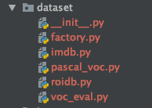
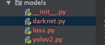

# Yolo V2代码解读

2020年8月13日

----

## 1. dataset库



### 1.1  文件概述

可有看到datasets目录下主要有三个文件，分别是

```shell
factory.py
imdb.py
pascal_voc.py
roidb.py
voc_eval.py
```

- factory.py 学过设计模式的应该知道这是个工厂类，用类生成imdb类并且返回数据库共网络训练和测试使用
- imdb.py 这里是数据库读写类的基类，分装了许多db的操作，但是具体的一些文件读写需要继承继续读写
- pascal_voc.py Ross在这里用pascal_voc.py这个类来操作

#### 1.2 读取文件函数分析（pascal_voc.py）

接下来我来介绍一下pasca_voc.py这个文件，（PS：如果更改数据集的话我们主要是基于这个文件进行修改），里面有几个重要的函数需要修改

- def **init**(self, image_set, year, devkit_path=None)
  这个是初始化函数，它对应着的是pascal_voc的数据集访问格式，其实我们将其接口修改的更简单一点
- def image_path_at(self, i)
  根据第i个图像样本返回其对应的path，其调用了image_path_from_index(self, index)作为其具体实现
- def image_path_from_index(self, index)
  实现了 image_path的具体功能
- def _load_image_set_index(self)
  加载了样本的list文件
- def _get_default_path(self)
  获得数据集地址
- def gt_roidb(self)
  读取并返回ground_truth的db
- def selective_search_roidb
  读取并返回ROI的db
- def _load_selective_search_roidb(self, gt_roidb)
  加载预选框的文件
- def selective_search_IJCV_roidb(self)
  在这里调用读取Ground_truth和ROI db并将db合并
- def _load_selective_search_IJCV_roidb(self, gt_roidb)
  这里是专门读取作者在IJCV上用的dataset
- def _load_pascal_annotation(self, index)
  这个函数是读取gt的具体实现
- def _write_voc_results_file(self, all_boxes)
  voc的检测结果写入到文件
- def _do_matlab_eval(self, comp_id, output_dir='output')
  根据matlab的evluation接口来做结果的分析
- def evaluate_detections
  其调用了_do_matlab_eval
- def competition_mode
  设置competitoin_mode，加了一些噪点

## 2. models库




## 参考

> [Fast RCNN训练自己的数据集](https://www.cnblogs.com/louyihang-loves-baiyan/p/4903231.html)