# YoloV4

2020年09月22日

----

> Yolov4论文名：《Yolov4: Optimal Speed and Accuracy of Object Detection》
>
> Yolov4论文地址：arxiv.org/pdf/2004.1093

## 1 网络结构

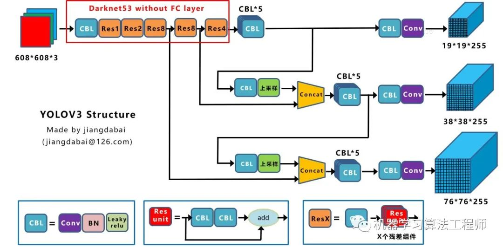


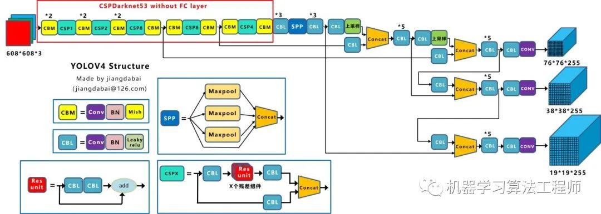


Yolov4的结构图和Yolov3相比，因为多了CSP结构，PAN结构，如果单纯看可视化流程图，会觉得很绕，不过在绘制出上面的图形后，会觉得豁然开朗，其实整体架构和Yolov3是相同的，不过使用各种新的算法思想对各个子结构都进行了改进。


先整理下Yolov4的**五个基本组件**：

1. CBM：Yolov4网络结构中的最小组件，由Conv+Bn+Mish激活函数三者组成。
2. CBL：由Conv+Bn+Leaky_relu激活函数三者组成。
3. Res unit：借鉴Resnet网络中的残差结构，让网络可以构建的更深。
4. CSPX：借鉴CSPNet网络结构，由三个卷积层和X个Res unint模块Concate组成。
5. SPP：采用1×1，5×5，9×9，13×13的最大池化的方式，进行多尺度融合。

其他基础操作：

1. Concat：张量拼接，维度会扩充，和Yolov3中的解释一样，对应于cfg文件中的route操作。
2. add：张量相加，不会扩充维度，对应于cfg文件中的shortcut操作。


Backbone中卷积层的数量：

和Yolov3一样，再来数一下Backbone里面的卷积层数量。

每个CSPX中包含3+2*X个卷积层，因此整个主干网络Backbone中一共包含

```
2+（3+2*1）+2+（3+2*2）+2+（3+2*8）+2+（3+2*8）+2+（3+2*4）+1=72
```

这里大白有些疑惑，按照Yolov3设计的传统，这么多卷积层，主干网络不应该叫CSPDaeknet73吗？？？？


Yolov4本质上和Yolov3相差不大，可能有些人会觉得失望。

但我觉得算法创新分为三种方式：

1. 第一种：面目一新的创新，比如Yolov1、Faster-RCNN、Centernet等，开创出新的算法领域，不过这种也是最难的
2. 第二种：守正出奇的创新，比如将图像金字塔改进为特征金字塔
3. 第三种：各种先进算法集成的创新，比如不同领域发表的最新论文的tricks，集成到自己的算法中，却发现有出乎意料的改进


Yolov4既有第二种也有第三种创新，组合尝试了大量深度学习领域最新论文的20多项研究成果，而且不得不佩服的是作者Alexey在github代码库维护的频繁程度。

目前Yolov4代码的star数量已经1万多，据我所了解，目前超过这个数量的，目标检测领域只有Facebook的Detectron(v1-v2)、和Yolo(v1-v3)官方代码库（已停止更新）。

所以Yolov4中的各种创新方式，大白觉得还是很值得仔细研究的。

为了便于分析，将Yolov4的整体结构拆分成四大板块：

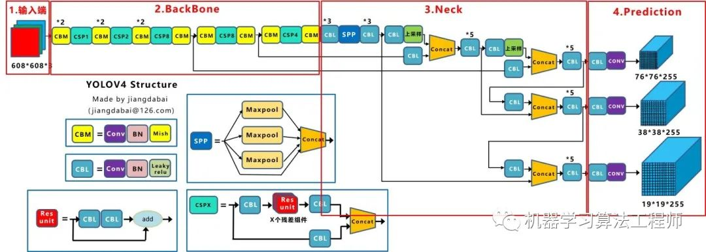

大白主要从以上4个部分对YoloV4的创新之处进行讲解，让大家一目了然。

1. 输入端：这里指的创新主要是训练时对输入端的改进，主要包括Mosaic数据增强、cmBN、SAT自对抗训练
2. BackBone主干网络：将各种新的方式结合起来，包括：CSPDarknet53、Mish激活函数、Dropblock
3. Neck：目标检测网络在BackBone和最后的输出层之间往往会插入一些层，比如Yolov4中的SPP模块、FPN+PAN结构
4. Prediction：输出层的锚框机制和Yolov3相同，主要改进的是训练时的损失函数CIOU_Loss，以及预测框筛选的nms变为DIOU_nms


总体来说，Yolov4对Yolov3的各个部分都进行了改进优化，下面丢上作者的算法对比图。

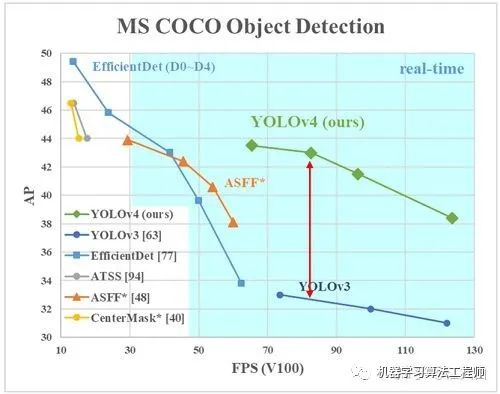

仅对比Yolov3和Yolov4，在COCO数据集上，同样的FPS等于83左右时，Yolov4的AP是43，而Yolov3是33，直接上涨了10个百分点。

不得不服，当然可能针对具体不同的数据集效果也不一样，但总体来说，改进效果是很优秀的，下面大白对Yolov4的各个创新点继续进行深挖。

### 1.1 输入端创新

考虑到很多同学GPU显卡数量并不是很多，Yolov4对训练时的输入端进行改进，使得训练在单张GPU上也能有不错的成绩。比如数据增强Mosaic、cmBN、SAT自对抗训练。

但感觉cmBN和SAT影响并不是很大，所以这里主要讲解Mosaic数据增强。

#### 1.1.1 Mosaic数据增强

Yolov4中使用的Mosaic是参考2019年底提出的CutMix数据增强的方式，但CutMix只使用了两张图片进行拼接，而Mosaic数据增强则采用了4张图片，随机缩放、随机裁剪、随机排布的方式进行拼接。

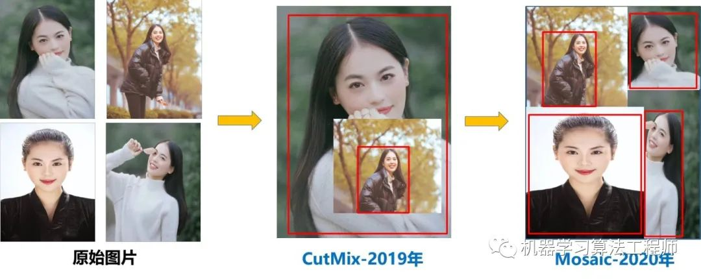

这里首先要了解为什么要进行Mosaic数据增强呢？

在平时项目训练时，小目标的AP一般比中目标和大目标低很多。而Coco数据集中也包含大量的小目标，但比较麻烦的是小目标的分布并不均匀。

首先看下小、中、大目标的定义：
2019年发布的论文《Augmentation for small object detection》对此进行了区分：

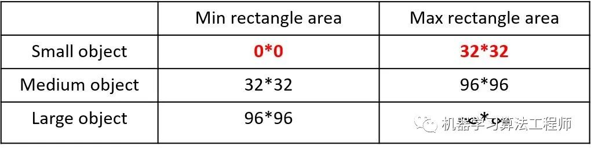

可以看到小目标的定义是目标框的长宽0×0~32×32之间的物体。


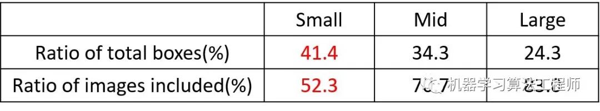

但在整体的数据集中，小、中、大目标的占比并不均衡。
如上表所示，Coco数据集中小目标占比达到41.4%，数量比中目标和大目标都要多。

但在所有的训练集图片中，只有52.3%的图片有小目标，而中目标和大目标的分布相对来说更加均匀一些。

针对这种状况，Yolov4的作者采用了Mosaic数据增强的方式。

主要有几个优点：

1. 丰富数据集：随机使用4张图片，随机缩放，再随机分布进行拼接，大大丰富了检测数据集，特别是随机缩放增加了很多小目标，让网络的鲁棒性更好。
2. 减少GPU：可能会有人说，随机缩放，普通的数据增强也可以做，但作者考虑到很多人可能只有一个GPU，因此Mosaic增强训练时，可以直接计算4张图片的数据，使得Mini-batch大小并不需要很大，一个GPU就可以达到比较好的效果。

此外，发现另一研究者的训练方式也值得借鉴，采用的数据增强和Mosaic比较类似，也是使用4张图片（不是随机分布），但训练计算loss时，采用“缺啥补啥”的思路：

如果上一个iteration中，小物体产生的loss不足（比如小于某一个阈值），则下一个iteration就用拼接图；否则就用正常图片训练，也很有意思。

参考链接：https://www.zhihu.com/question/390191723?rf=390194081

### 1.2 BackBone创新


#### 1.2.1 CSPDarknet53

CSPDarknet53是在Yolov3主干网络Darknet53的基础上，借鉴2019年CSPNet的经验，产生的Backbone结构，其中包含了5个CSP模块。

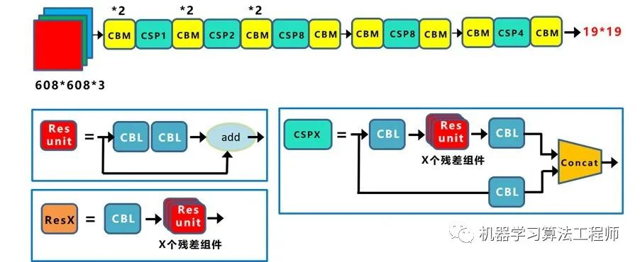

这里因为CSP模块比较长，不放到本处，大家也可以点击Yolov4的netron网络结构图，对比查看，一目了然。

每个CSP模块前面的卷积核的大小都是3*3，因此可以起到下采样的作用。

因为Backbone有5个CSP模块，输入图像是608*608，所以特征图变化的规律是：608->304->152->76->38->19

经过5次CSP模块后得到19*19大小的特征图。

而且作者只在Backbone中采用了Mish激活函数，网络后面仍然采用Leaky_relu激活函数。

我们再看看下作者为啥要参考2019年的CSPNet，采用CSP模块？

CSPNet论文地址：arxiv.org/pdf/1911.1192

CSPNet全称是Cross Stage Paritial Network，主要从网络结构设计的角度解决推理中从计算量很大的问题。

CSPNet的作者认为**推理计算过高**的问题是由于网络优化中的梯度信息重复导致的。

因此采用CSP模块先将基础层的特征映射划分为两部分，然后通过跨阶段层次结构将它们合并，在减少了计算量的同时可以保证准确率。

因此Yolov4在主干网络Backbone采用CSPDarknet53网络结构，主要有三个方面的优点：

优点一：增强CNN的学习能力，使得在轻量化的同时保持准确性。

优点二：降低计算瓶颈

优点三：降低内存成本

#### 1.2.2 Mish激活函数

Mish激活函数是2019年下半年提出的激活函数

论文地址：arxiv.org/abs/1908.0868

和Leaky_relu激活函数的图形对比如下：

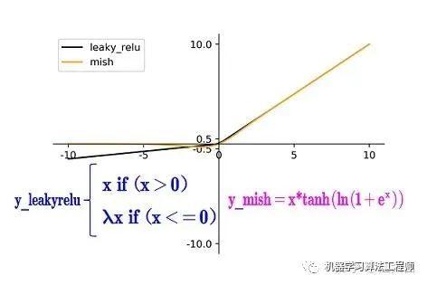

Yolov4的Backbone中都使用了Mish激活函数，而后面的网络则还是使用leaky_relu函数。

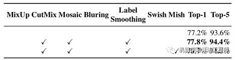

Yolov4作者实验测试时，使用CSPDarknet53网络在ImageNet数据集上做图像分类任务，发现使用了Mish激活函数的TOP-1和TOP-5的精度比没有使用时都略高一些。

因此在设计Yolov4目标检测任务时，主干网络Backbone还是使用Mish激活函数。

#### 1.2.3 Dropblock

Yolov4中使用的Dropblock，其实和常见网络中的Dropout功能类似，也是缓解过拟合的一种正则化方式。

Dropblock在2018年提出，论文地址：arxiv.org/pdf/1810.1289

传统的Dropout很简单，一句话就可以说的清：随机删除减少神经元的数量，使网络变得更简单。

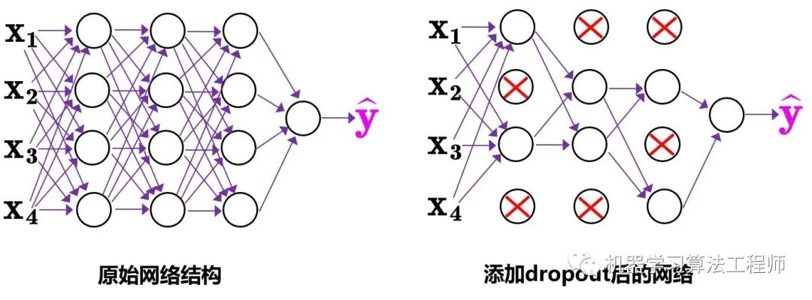

而Dropblock和Dropout相似，比如下图：

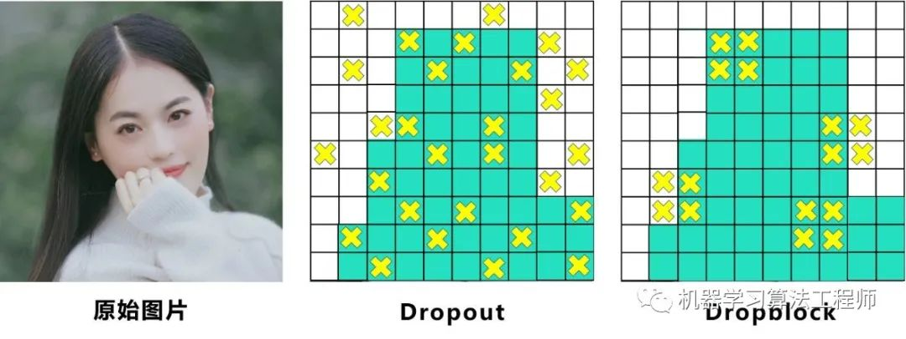

中间Dropout的方式会随机的删减丢弃一些信息，但Dropblock的研究者认为，卷积层对于这种随机丢弃并不敏感，因为卷积层通常是三层连用：卷积+激活+池化层，池化层本身就是对相邻单元起作用。而且即使随机丢弃，卷积层仍然可以从相邻的激活单元学习到相同的信息。

因此，在全连接层上效果很好的Dropout在卷积层上效果并不好。

所以右图Dropblock的研究者则干脆整个局部区域进行删减丢弃。

这种方式其实是借鉴2017年的cutout数据增强的方式，cutout是将输入图像的部分区域清零，而Dropblock则是将Cutout应用到每一个特征图。而且并不是用固定的归零比率，而是在训练时以一个小的比率开始，随着训练过程线性的增加这个比率。

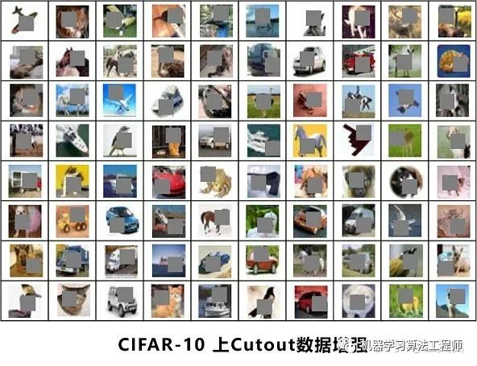

Dropblock的研究者与Cutout进行对比验证时，发现有几个特点：

优点一：Dropblock的效果优于Cutout

优点二：Cutout只能作用于输入层，而Dropblock则是将Cutout应用到网络中的每一个特征图上

优点三：Dropblock可以定制各种组合，在训练的不同阶段可以修改删减的概率，从空间层面和时间层面，和Cutout相比都有更精细的改进。

Yolov4中直接采用了更优的Dropblock，对网络的正则化过程进行了全面的升级改进。

### 1.3 Neck创新

在目标检测领域，为了更好的提取融合特征，通常在Backbone和输出层，会插入一些层，这个部分称为Neck。相当于目标检测网络的颈部，也是非常关键的。

Yolov4的Neck结构主要采用了SPP模块、FPN+PAN的方式。


#### 1.3.1 SPP模块

SPP模块，其实在Yolov3中已经存在了，在Yolov4的C++代码文件夹中有一个Yolov3_spp版本，但有的同学估计从来没有使用过，在Yolov4中，SPP模块仍然是在Backbone主干网络之后：

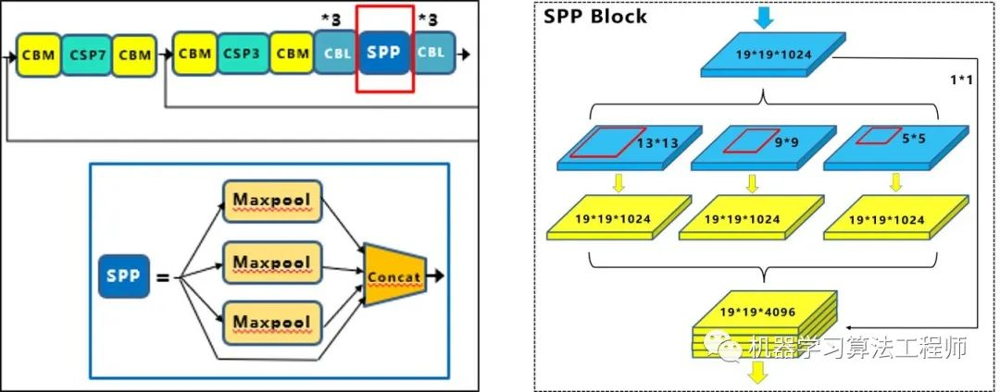

作者在SPP模块中，使用k={1*1,5*5,9*9,13*13}的最大池化的方式，再将不同尺度的特征图进行Concat操作。

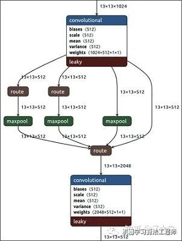

在《DC-SPP-Yolo》文章：

也对Yolo目标检测的SPP模块进行了对比测试。

和Yolov4作者的研究相同，采用SPP模块的方式，比单纯的使用k*k最大池化的方式，更有效的增加主干特征的接收范围，显著的分离了最重要的上下文特征。

Yolov4的作者在使用608*608大小的图像进行测试时发现，在COCO目标检测任务中，以0.5%的额外计算代价将AP50增加了2.7%，因此Yolov4中也采用了SPP模块。

#### 1.3.2 FPN+PAN

PAN结构比较有意思，看了网上Yolov4关于这个部分的讲解，大多都是讲的比较笼统的，而PAN是借鉴图像分割领域PANet的创新点，有些同学可能不是很清楚。

下面大白将这个部分拆解开来，看下Yolov4中是如何设计的。

Yolov3结构：

我们先来看下Yolov3中Neck的FPN结构

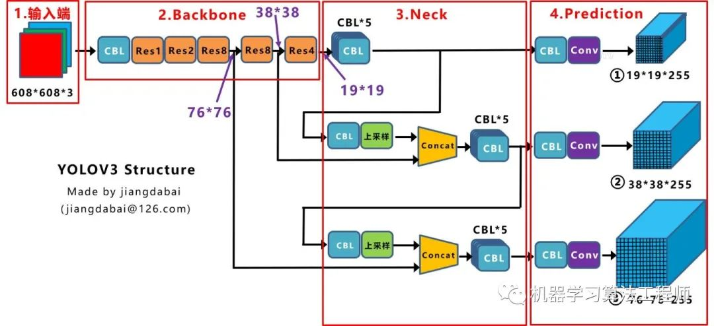

可以看到经过几次下采样，三个紫色箭头指向的地方，输出分别是`76*76、38*38、19*19`。

以及最后的Prediction中用于预测的三个特征图①`19*19*255`、②`38*38*255`、③`76*76*255`。

我们将Neck部分用立体图画出来，更直观的看下两部分之间是如何通过FPN结构融合的。

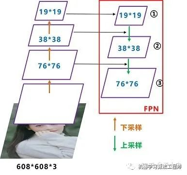

如图所示，FPN是自顶向下的，将高层的特征信息通过上采样的方式进行传递融合，得到进行预测的特征图。

Yolov4结构：

而Yolov4中Neck这部分除了使用FPN外，还在此基础上使用了PAN结构：

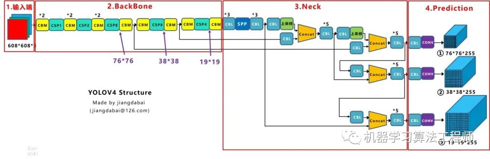

前面CSPDarknet53中讲到，每个CSP模块前面的卷积核都是3*3大小，相当于下采样操作。

因此可以看到三个紫色箭头处的特征图是`76*76、38*38、19*19`。

以及最后Prediction中用于预测的三个特征图：`①76*76*255，②38*38*255，③19*19*255`。

我们也看下Neck部分的立体图像，看下两部分是如何通过FPN+PAN结构进行融合的。

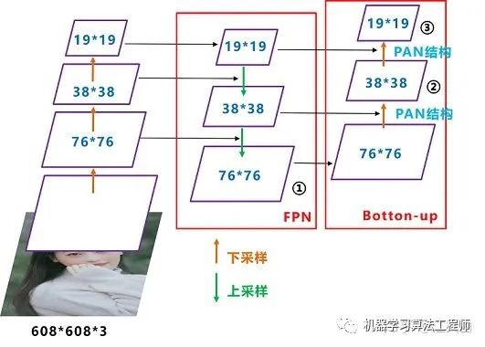

和Yolov3的FPN层不同，Yolov4在FPN层的后面还添加了一个自底向上的特征金字塔。

其中包含两个PAN结构。

这样结合操作，FPN层自顶向下传达强语义特征，而特征金字塔则自底向上传达强定位特征，两两联手，从不同的主干层对不同的检测层进行参数聚合,这样的操作确实很皮。

FPN+PAN借鉴的是18年CVPR的PANet，当时主要应用于图像分割领域，但Alexey将其拆分应用到Yolov4中，进一步提高特征提取的能力。

不过这里需要注意几点：

注意一：

Yolov3的FPN层输出的三个大小不一的特征图①②③直接进行预测

但Yolov4的FPN层，只使用最后的一个76*76特征图①，而经过两次PAN结构，输出预测的特征图②和③。

这里的不同也体现在cfg文件中，这一点有很多同学之前不太明白，

比如Yolov3.cfg最后的三个Yolo层，

第一个Yolo层是最小的特征图19*19，mask=6,7,8，对应最大的anchor box。

第二个Yolo层是中等的特征图38*38，mask=3,4,5，对应中等的anchor box。

第三个Yolo层是最大的特征图76*76，mask=0,1,2，对应最小的anchor box。

而Yolov4.cfg则恰恰相反

第一个Yolo层是最大的特征图76*76，mask=0,1,2，对应最小的anchor box。

第二个Yolo层是中等的特征图38*38，mask=3,4,5，对应中等的anchor box。

第三个Yolo层是最小的特征图19*19，mask=6,7,8，对应最大的anchor box。

注意点二：

原本的PANet网络的PAN结构中，两个特征图结合是采用shortcut操作，而Yolov4中则采用concat（route）操作，特征图融合后的尺寸发生了变化。

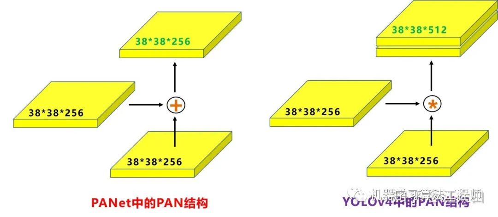

这里也可以对应Yolov4的netron网络图查看，很有意思。

### 1.4 Prediction创新

#### 1.4.1 CIOU_Loss

目标检测任务的损失函数一般由Classificition Loss（分类损失函数）和Bounding Box Regeression Loss（回归损失函数）两部分构成。

Bounding Box Regeression的Loss近些年的发展过程是：Smooth L1 Loss-> IoU Loss（2016）-> GIoU Loss（2019）-> DIoU Loss（2020）->CIoU Loss（2020）

我们从最常用的IOU_Loss开始，进行对比拆解分析，看下Yolov4为啥要选择CIOU_Loss。

##### a.IOU_Loss

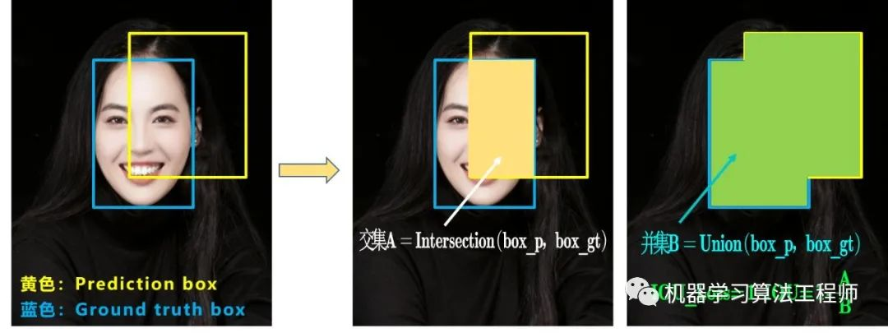

可以看到IOU的loss其实很简单，主要是交集/并集，但其实也存在两个问题。


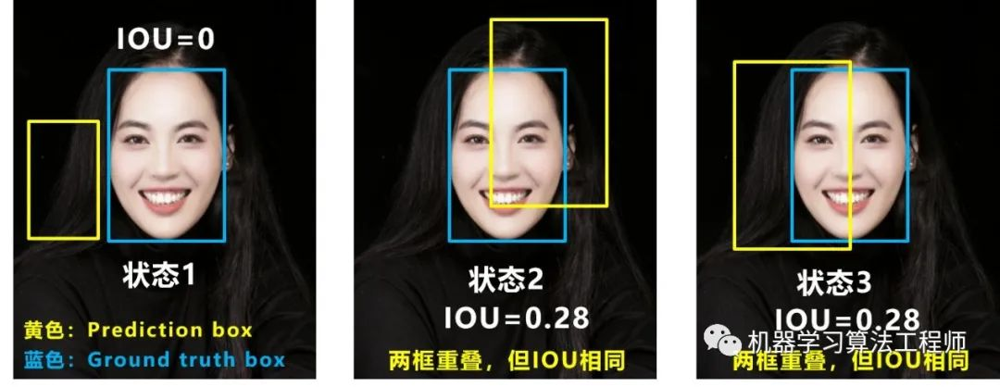

问题1：即状态1的情况，当预测框和目标框不想交时，IOU=0，无法反应两个框距离的远近，此时损失函数不可导，IOU_Loss无法优化两个框不相交的情况。

问题2：即状态2和状态3的情况，当两个预测框大小相同，两个IOU也相同，IOU_Loss无法区分两者相交情况的不同。

因此2019年出现了GIOU来进行改进。


##### b.GIOU_Loss


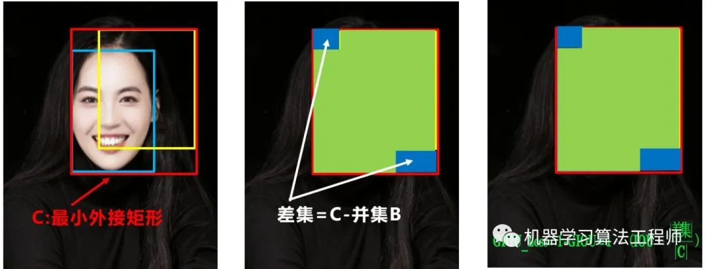

可以看到右图

GIOU_中，增加了相交尺度的衡量方式，缓解了单纯IOU时的尴尬。

但为什么仅仅说缓解呢？

因为还存在一种不足：

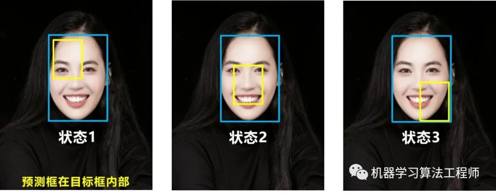

问题：状态1、2、3都是预测框在目标框内部且预测框大小一致的情况，这时预测框和目标框的差集都是相同的，因此这三种状态的GIOU值也都是相同的，这时GIOU退化成了IOU，无法区分相对位置关系。
基于这个问题，2020年的AAAI又提出了DIOU_Loss。

##### c.DIOU_Loss

好的目标框回归函数应该考虑三个重要几何因素：重叠面积、中心点距离，长宽比。

针对IOU和GIOU存在的问题，作者从两个方面进行考虑

一：如何最小化预测框和目标框之间的归一化距离？

二：如何在预测框和目标框重叠时，回归的更准确？

针对第一个问题，提出了DIOU_Loss（Distance_IOU_Loss）

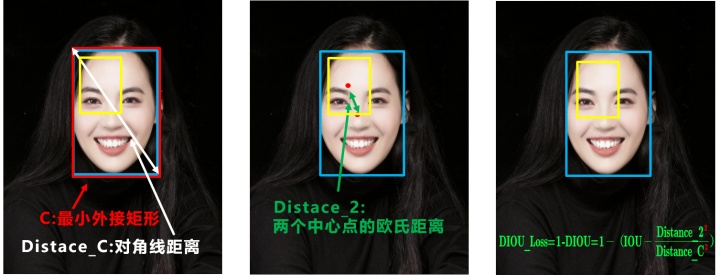

DIOU_Loss考虑了重叠面积和中心点距离，当目标框包裹预测框的时候，直接度量2个框的距离，因此DIOU_Loss收敛的更快。

但就像前面好的目标框回归函数所说的，没有考虑到长宽比。

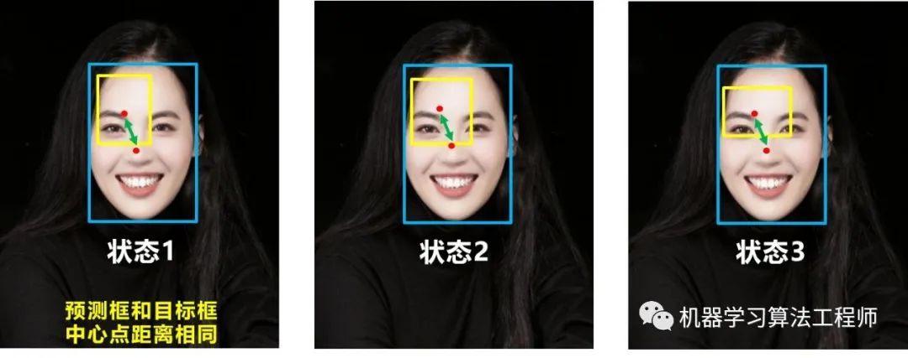

比如上面三种情况，目标框包裹预测框，本来DIOU_Loss可以起作用。

但预测框的中心点的位置都是一样的，因此按照DIOU_Loss的计算公式，三者的值都是相同的。

针对这个问题，又提出了CIOU_Loss，不对不说，科学总是在解决问题中，不断进步！！

##### d.CIOU_Loss

CIOU_Loss和DIOU_Loss前面的公式都是一样的，不过在此基础上还增加了一个影响因子，将预测框和目标框的长宽比都考虑了进去。

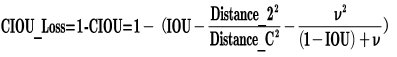

其中v是衡量长宽比一致性的参数，我们也可以定义为：

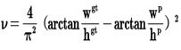

这样CIOU_Loss就将目标框回归函数应该考虑三个重要几何因素：重叠面积、中心点距离，长宽比全都考虑进去了。

再来综合的看下各个Loss函数的不同点：

IOU_Loss：主要考虑检测框和目标框重叠面积。

GIOU_Loss：在IOU的基础上，解决边界框不重合时的问题。

DIOU_Loss：在IOU和GIOU的基础上，考虑边界框中心点距离的信息。

CIOU_Loss：在DIOU的基础上，考虑边界框宽高比的尺度信息。

Yolov4中采用了CIOU_Loss的回归方式，使得预测框回归的速度和精度更高一些。

#### 1.4.2 DIOU_nms

Nms主要用于预测框的筛选，常用的目标检测算法中，一般采用普通的nms的方式，Yolov4则借鉴上面D/CIOU loss的论文：arxiv.org/pdf/1911.0828

将其中计算IOU的部分替换成DIOU的方式：

再来看下实际的案例

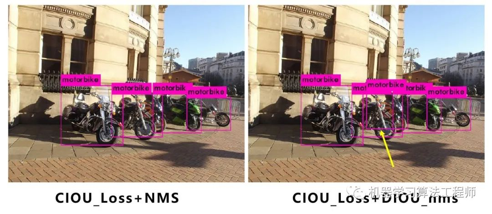

在上图重叠的摩托车检测中，中间的摩托车因为考虑边界框中心点的位置信息，也可以回归出来。

因此在重叠目标的检测中，DIOU_nms的效果优于传统的nms。

总体来说，YOLOv4的论文称的上良心之作，将近几年关于深度学习领域最新研究的tricks移植到Yolov4中做验证测试，将Yolov3的精度提高了不少。

虽然没有全新的创新，但很多改进之处都值得借鉴，借用Yolov4作者的总结。

Yolov4 主要带来了 3 点新贡献：

（1）提出了一种高效而强大的目标检测模型，使用 1080Ti 或 2080Ti 就能训练出超快、准确的目标检测器。

（2）在检测器训练过程中，验证了最先进的一些研究成果对目标检测器的影响。

（3）改进了 SOTA 方法，使其更有效、更适合单 GPU 训练。

## 2 损失函数


## 3 详解各种trick

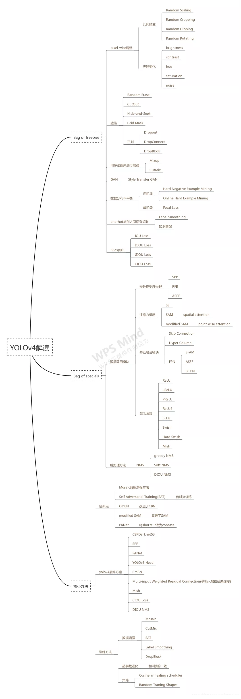

前段时间大名鼎鼎的yolov4终于面世了，可是看过以后确实大失所望。不是说yolov4不好，只不过没有什么革命性的创新，相当于作者尝试了计算机视觉领域的各种花里胡哨的trick，然后给了一个最佳方案的trick组合。而且，这些东西对于实际的工业生产并没有什么用。。。。也就是落地基本不可能。

下面来仔细看一下文章中提到的各种trick。

[论文地址](https://arxiv.org/abs/2004.10934)
[github](https://github.com/AlexeyAB/darknet)


## 3 推理


## 参考

> 1 [Yolov3 & Yolov4](https://mp.weixin.qq.com/s/uzj7X89zKHBk6PI46xrRiw)

- PPT

  

  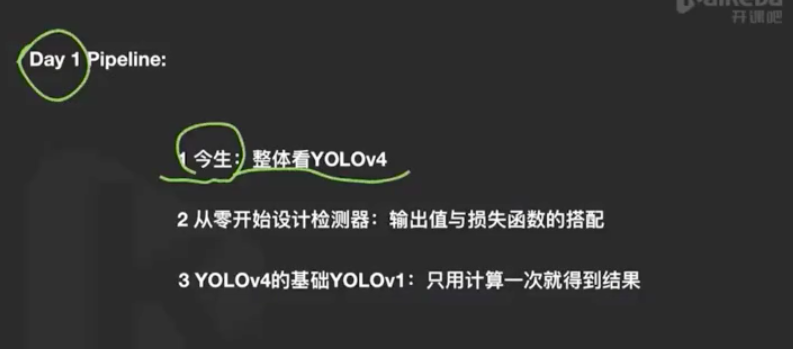

  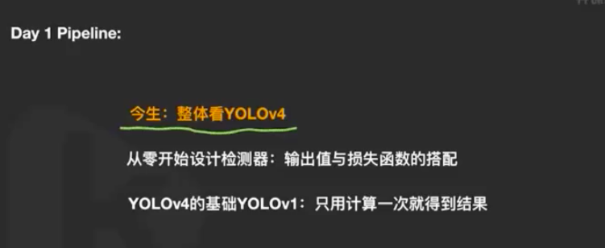

  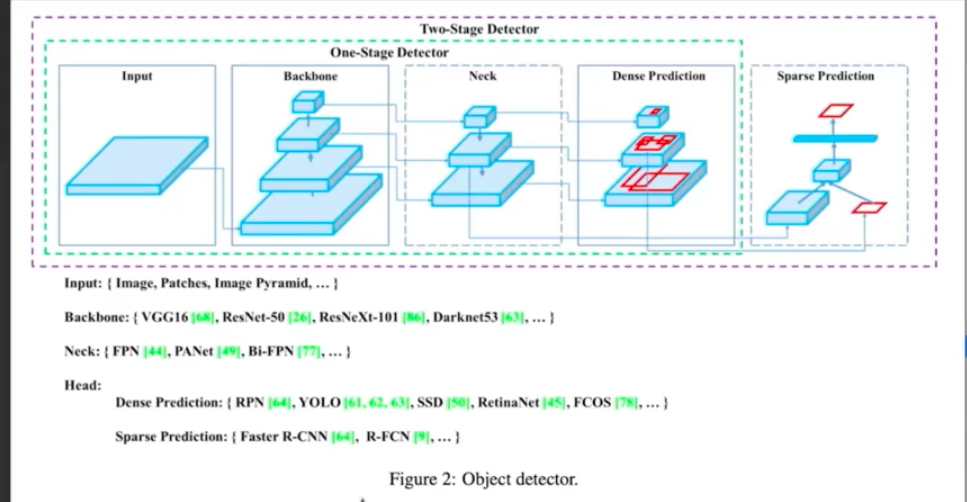

  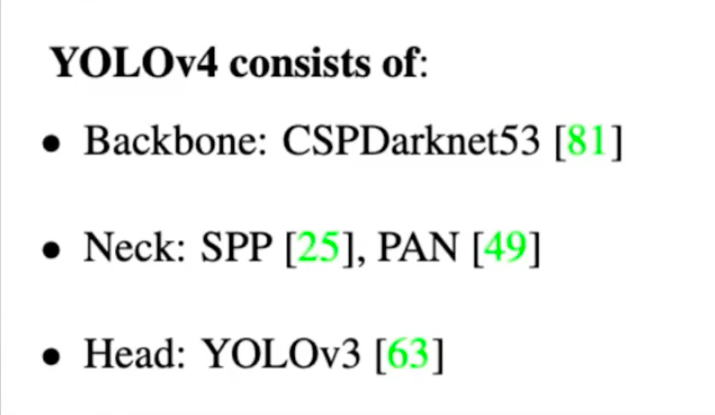

  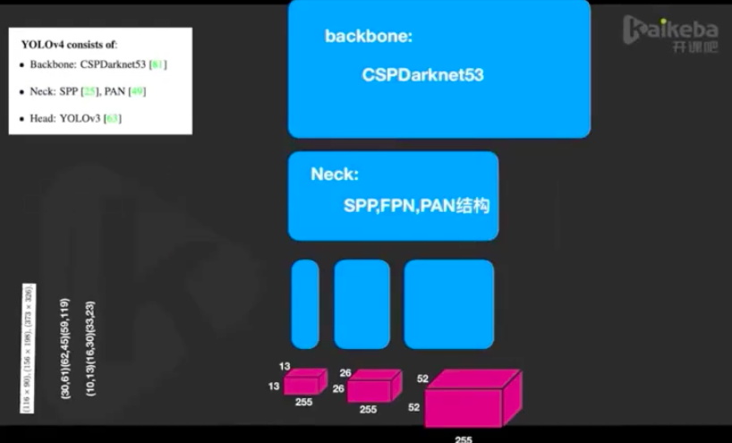

  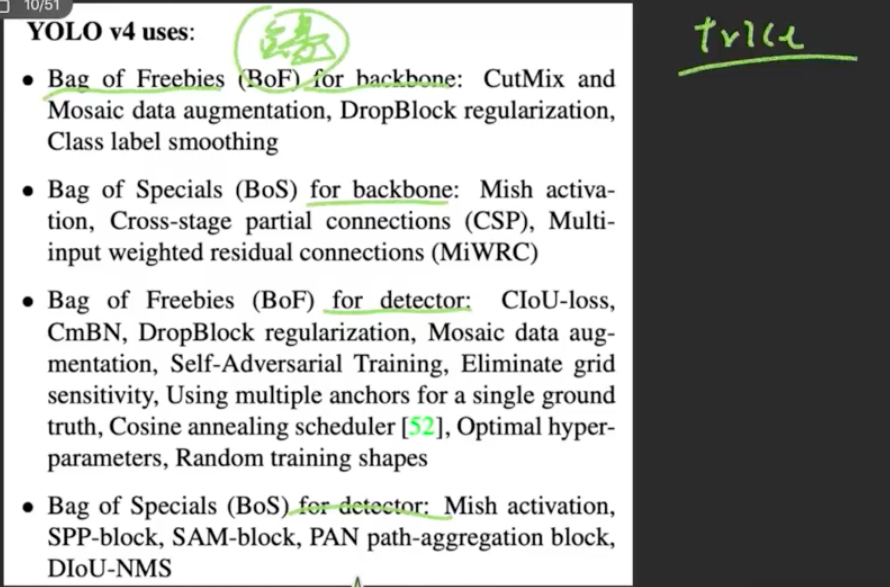

  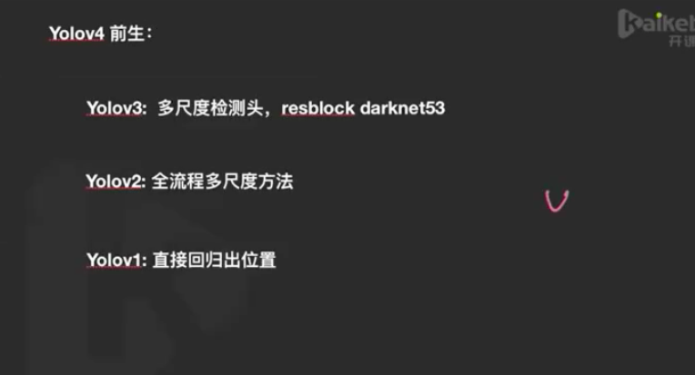

  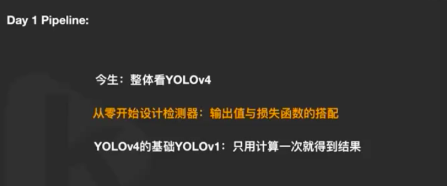

  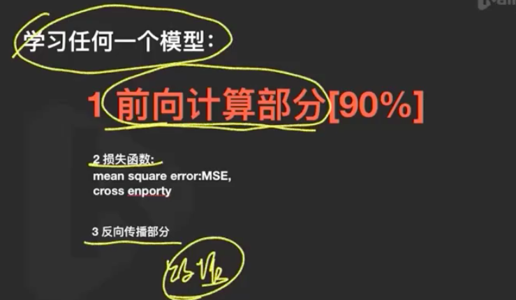

  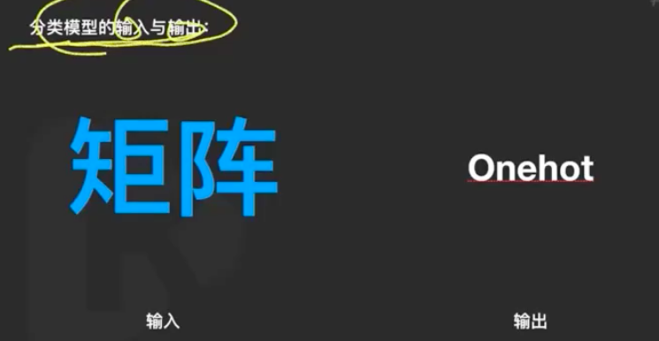

  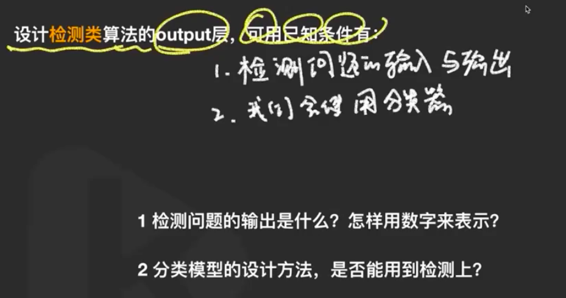

  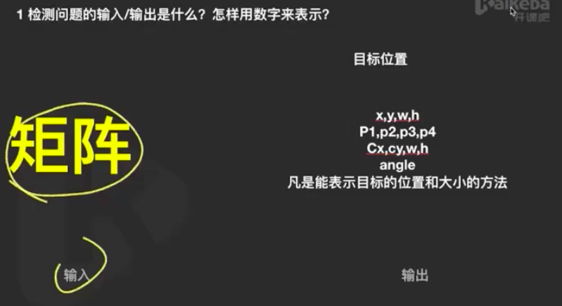

  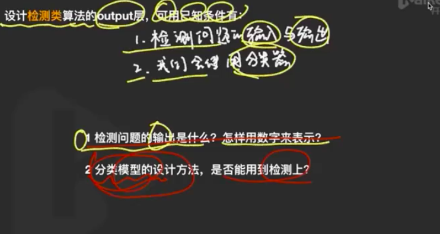

  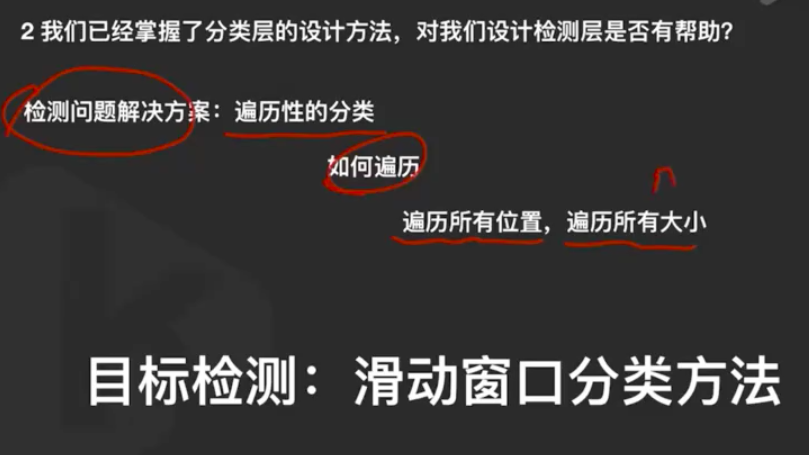

  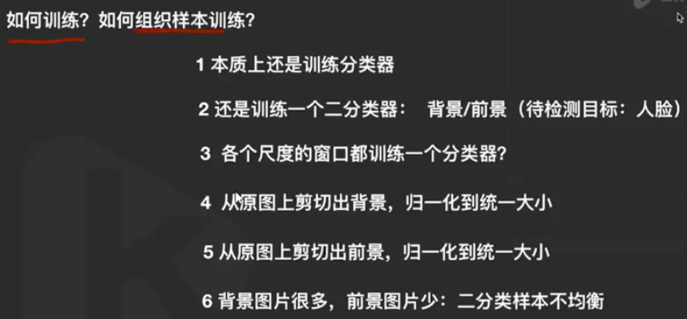

  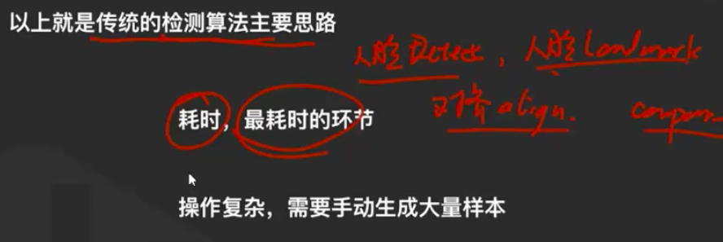

  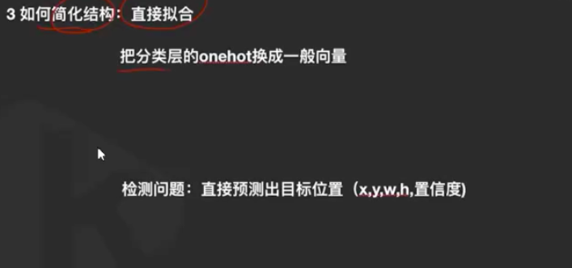

  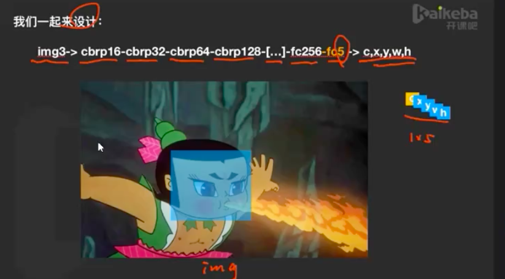

  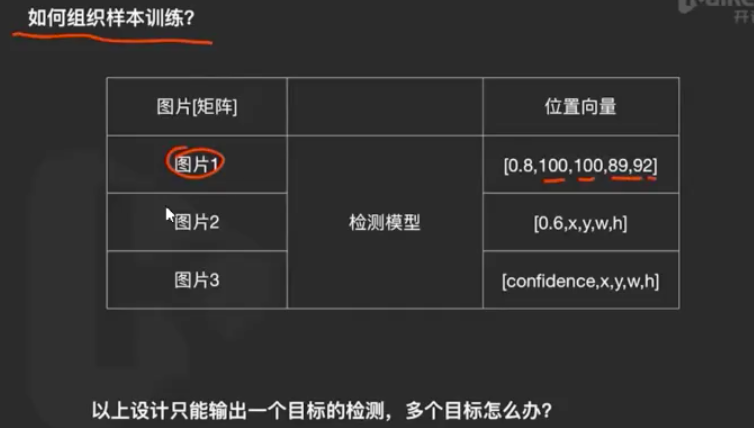

  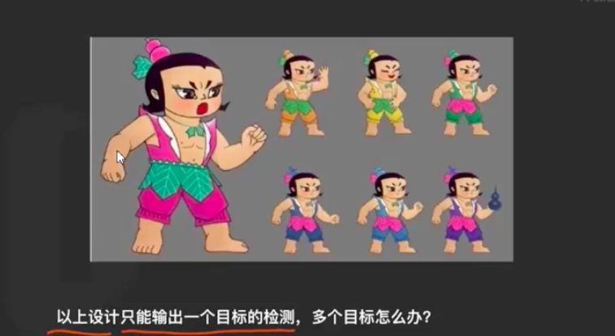

  

  

  

  

  

  

  

  

  

  

  

  

  

  

  

  

  

  

  

  

  

  

  

  

  

  

  

  

  

  

  

  

  

  

  

  

  

  

  

  

  

  

  

  

  

  

  

  

  

  

  

  

  

  

  

  