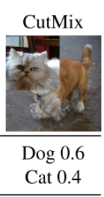
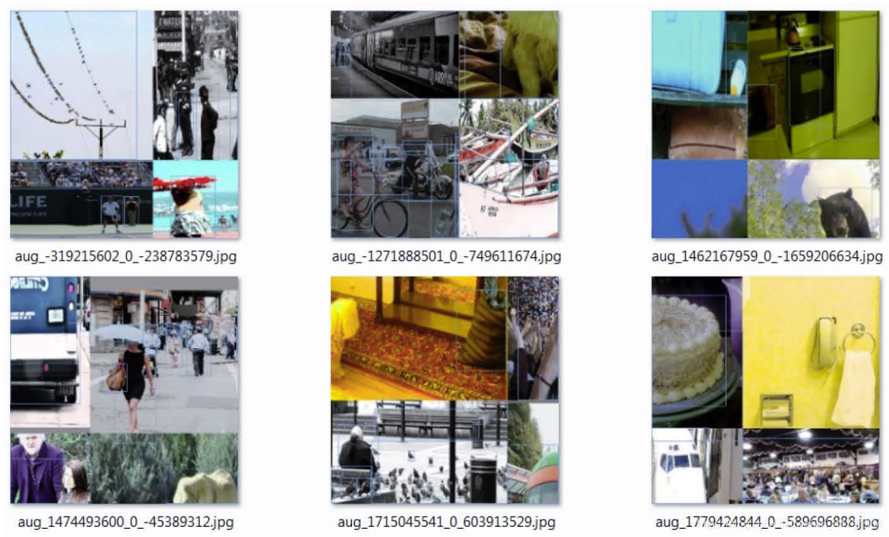
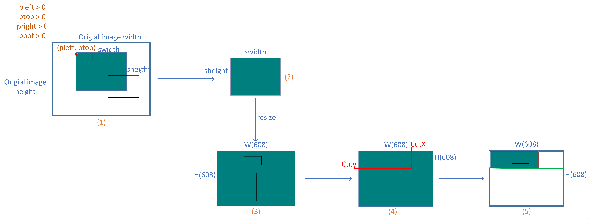

# Yolov4代码解读

2020年10月19日

----

## 1. dataset.py（mosica解读）

### 什么是Mosaic数据增强方法

Yolov4的mosaic数据增强参考了CutMix数据增强方式，理论上具有一定的相似性！
**CutMix数据增强方式利用两张图片进行拼接。**



但是mosaic利用了四张图片，**根据论文所说其拥有一个巨大的优点是丰富检测物体的背景！且在BN计算的时候一下子会计算四张图片的数据！**
就像下图这样：




### **实现思路**

1、每次读取四张图片。


2、分别对四张图片进行翻转、缩放、色域变化等，并且按照四个方向位置摆好。


3、进行图片的组合和框的组合


### 代码

以下是根据[pytorch YOLOV4](https://github.com/Tianxiaomo/pytorch-YOLOv4)的代码对Mosaic数据增强进行的整理。



**图1**

部分代码展示：

```python
oh, ow, oc = img.shape    # img为读取的图片数据      
# self.cfg.jitter为cfg文件中的参数，默认给的是0.2                                              
dh, dw, dc = np.array(np.array([oh, ow, oc]) * self.cfg.jitter, dtype=np.int)  
# 首先生成一些随机偏移的坐标，分别代表左右上下                                    
pleft = random.randint(-dw, dw)   
pright = random.randint(-dw, dw)  
ptop = random.randint(-dh, dh)    
pbot = random.randint(-dh, dh) 
# 裁剪部分的长和宽
swidth = ow - pleft - pright
sheight = oh - ptop - pbot     
```

整个Mosaic过程如图一所示，图一展示的是pleft,pright,ptop,pbot都大于0时的情况，首先在原图上找到以(pleft,pright)为左上角，swidth，sheight为宽和长的矩形，然后取这个矩形和原图的交集(也就是深绿色的部分)。

注意：图1中(2)这里不是直接取的交集出来，而是先创建一个宽为swidth，长为sheight的矩形，再将矩形赋值为原图RGB三个通道的均值，然后再将上面说的交集部分根据计算的坐标放在这个矩形上面，只不过图一是基于pleft,pright,ptop,pbot都大于0时的情况，所以正好放在(0, 0)坐标上。具体可以参考一以下代码。

```python
# new_src_rect也就是上面说的交集的坐标(x1, y1, x2, y2)
 new_src_rect = rect_intersection(src_rect, img_rect)                                                                                                                        
 dst_rect = [max(0, -pleft), max(0, -ptop), max(0, -pleft) + new_src_rect[2] - new_src_rect[0], 
             max(0, -ptop) + new_src_rect[3] - new_src_rect[1]]  
                                            
cropped = np.zeros([sheight, swidth, 3])                                   
cropped[:, :, ] = np.mean(img, axis=(0, 1))                                
# 这里就是将交集部分放在矩形上                                                      
cropped[dst_rect[1]:dst_rect[3], dst_rect[0]:dst_rect[2]] = \              
    img[new_src_rect[1]:new_src_rect[3], new_src_rect[0]:new_src_rect[2]]  

```

然后对图片进行resize，resize为网络输入所需要的分辨率，默认情况下就是608x608大小。然后根据计算的左上坐标，以及随机得到的宽CutX，长Cuty，裁剪一部分区域作为一张新图的左上部分。图1中(4)红框表示裁剪的区域，注意：图1中(4)左上角的(0, 0)坐标是因为pleft,pright大于0，根据计算所得。计算裁剪坐标的过程可参照以下代码。

```python
# 根据网络的输入大小随机计算的cut_x、cut_y，min_offset为预设参数，默认为0.2
# cfg.w，cfg.h为网络的输入大小，默认为608
 cut_x = random.randint(int(self.cfg.w * min_offset), int(self.cfg.w * (1 - min_offset)))
 cut_y = random.randint(int(self.cfg.h * min_offset), int(self.cfg.h * (1 - min_offset)))
# 裁剪坐标的计算过程                                                                                 
left_shift = int(min(cut_x, max(0, (-int(pleft) * self.cfg.w / swidth))))                         
top_shift = int(min(cut_y, max(0, (-int(ptop) * self.cfg.h / sheight))))                          
                                                                                                  
right_shift = int(min((self.cfg.w - cut_x), max(0, (-int(pright) * self.cfg.w / swidth))))        
bot_shift = int(min(self.cfg.h - cut_y, max(0, (-int(pbot) * self.cfg.h / sheight))))               
# 这里的ai参数为图一中的(3), out_img初始化的新图
# 该函数的功能就是图1中(3)到(5)的过程，分别将裁剪的图片粘贴到新图的左上，右上，左下，右下
# 循环4次，每循环一次粘贴一次，每次根据给的参数i粘贴到哪个部分                                       
out_img, out_bbox = blend_truth_mosaic(out_img, ai, truth.copy(), self.cfg.w, self.cfg.h, cut_x,  
                                       cut_y, i, left_shift, right_shift, top_shift, bot_shift)   
```

以下是blend_truth_mosaic函数细节：

```python
def blend_truth_mosaic(out_img, img, bboxes, w, h, cut_x, cut_y, i_mixup,                                        
                       left_shift, right_shift, top_shift, bot_shift):                                           
    left_shift = min(left_shift, w - cut_x)                                                                      
    top_shift = min(top_shift, h - cut_y)                                                                        
    right_shift = min(right_shift, cut_x)                                                                        
    bot_shift = min(bot_shift, cut_y)                                                                            
                                                                                                                 
    if i_mixup == 0:                                                                                             
        bboxes = filter_truth(bboxes, left_shift, top_shift, cut_x, cut_y, 0, 0)                                 
        out_img[:cut_y, :cut_x] = img[top_shift:top_shift + cut_y, left_shift:left_shift + cut_x]                
    if i_mixup == 1:                                                                                             
        bboxes = filter_truth(bboxes, cut_x - right_shift, top_shift, w - cut_x, cut_y, cut_x, 0)                
        out_img[:cut_y, cut_x:] = img[top_shift:top_shift + cut_y, cut_x - right_shift:w - right_shift]          
    if i_mixup == 2:                                                                                             
        bboxes = filter_truth(bboxes, left_shift, cut_y - bot_shift, cut_x, h - cut_y, 0, cut_y)                 
        out_img[cut_y:, :cut_x] = img[cut_y - bot_shift:h - bot_shift, left_shift:left_shift + cut_x]            
    if i_mixup == 3:                                                                                             
        bboxes = filter_truth(bboxes, cut_x - right_shift, cut_y - bot_shift, w - cut_x, h - cut_y, cut_x, cut_y)
        out_img[cut_y:, cut_x:] = img[cut_y - bot_shift:h - bot_shift, cut_x - right_shift:w - right_shift]      
                                                                                                                 
    return out_img, bboxes                                                                                       

```

最后说明一下对于标签框的处理，图1中可以看到，当进行裁剪的时候，如果裁剪了样本当中的标签框的部分区域，则将其舍弃，保留裁剪之后还完整的标签框。

下图为pleft,pright,ptop,pbot都小于0的裁剪情况：


**图2**

由于时间关系，我只画了比较容易画的两种情况图，也只做了粘贴左上角的部分，但其实也都是一个道理。
本文只做了Mosaic的裁剪部分详解，当然个人觉得比较关键的也是这个部分，其实当中还有一些其他增强操作，例如随机翻转，模糊，HSV增强等等，这个暂时还没有做，后续会进行更新。
最后，这是我根据[pytorch YOLOV4](https://github.com/Tianxiaomo/pytorch-YOLOv4)的代码，自己的理解，如果有错，欢迎指正，谢谢。

### 参考

> https://blog.csdn.net/weixin_44791964/article/details/105996954
>
> https://blog.csdn.net/Q1u1NG/article/details/106388904
>

## 2. config配置

```
"""
{
    'use_darknet_cfg': True, 		# 选择那种模型构建方式
    'cfgfile': '/root/yolov4/cfg/yolov4.cfg', 	# yolov4的配置
    'batch': 128, 							# batch
    'subdivisions': 16, 				# 子集
    'width': 608, 
    'height': 608, 
    'channels': 3, 
    'momentum': 0.949, 
    'decay': 0.0005, 
    'angle': 0, 
    'saturation': 1.5, 
    'exposure': 1.5, 
    'hue': 0.1, 
    'learning_rate': 0.00261, 
    'burn_in': 1000, 
    'max_batches': 500500, 
    'steps': [400000, 450000], 
    'policy': [400000, 450000], 
    'scales': [0.1, 0.1], 
    'letter_box': 0, 
    'jitter': 0.2, 
    'classes': 80, 
    'track': 0, 
    'w': 608, 
    'h': 608, 
    'flip': 1, 
    'blur': 0, 
    'gaussian': 0, 
    'boxes': 60, 
    'TRAIN_EPOCHS': 300, 
    'train_label': '/root/yolov4/data/train.txt', 
    'val_label': '/root/yolov4/data/val.txt', 
    'TRAIN_OPTIMIZER': 'adam', 
    'cutmix': 0, 
    'mosaic': 1, 
    'mixup': 3, 
    'checkpoints': '/root/yolov4/checkpoints', 
    'TRAIN_TENSORBOARD_DIR': '/root/yolov4/log', 
    'iou_type': 'iou', 
    'keep_checkpoint_max': 10
}
"""
```

## 3. Darknet2pytorch.py

### Self.blocks

models类

```
[
{'type': 'net', 'batch': '64', 'subdivisions': '8', 'width': '608', 'height': '608', 'channels': '3', 'momentum': '0.949', 'decay': '0.0005', 'angle': '0', 'saturation': '1.5', 'exposure': '1.5', 'hue': '.1', 'learning_rate': '0.0013', 'burn_in': '1000', 'max_batches': '500500', 'policy': 'steps', 'steps': '400000,450000', 'scales': '.1,.1', 'mosaic': '1'}, 

{'type': 'convolutional', 'batch_normalize': '1', 'filters': '32', 'size': '3', 'stride': '1', 'pad': '1', 'activation': 'mish'}, 
{'type': 'convolutional', 'batch_normalize': '1', 'filters': '64', 'size': '3', 'stride': '2', 'pad': '1', 'activation': 'mish'}, 
{'type': 'convolutional', 'batch_normalize': '1', 'filters': '64', 'size': '1', 'stride': '1', 'pad': '1', 'activation': 'mish'}, 
{'type': 'route', 'layers': '-2'}, 
{'type': 'convolutional', 'batch_normalize': '1', 'filters': '64', 'size': '1', 'stride': '1', 'pad': '1', 'activation': 'mish'}, 
{'type': 'convolutional', 'batch_normalize': '1', 'filters': '32', 'size': '1', 'stride': '1', 'pad': '1', 'activation': 'mish'}, 
{'type': 'convolutional', 'batch_normalize': '1', 'filters': '64', 'size': '3', 'stride': '1', 'pad': '1', 'activation': 'mish'}, 
{'type': 'shortcut', 'from': '-3', 'activation': 'linear'}, 
{'type': 'convolutional', 'batch_normalize': '1', 'filters': '64', 'size': '1', 'stride': '1', 'pad': '1', 'activation': 'mish'}, 
{'type': 'route', 'layers': '-1,-7'}, 
{'type': 'convolutional', 'batch_normalize': '1', 'filters': '64', 'size': '1', 'stride': '1', 'pad': '1', 'activation': 'mish'}, 
{'type': 'convolutional', 'batch_normalize': '1', 'filters': '128', 'size': '3', 'stride': '2', 'pad': '1', 'activation': 'mish'}, 
{'type': 'convolutional', 'batch_normalize': '1', 'filters': '64', 'size': '1', 'stride': '1', 'pad': '1', 'activation': 'mish'}, 
{'type': 'route', 'layers': '-2'}, 
{'type': 'convolutional', 'batch_normalize': '1', 'filters': '64', 'size': '1', 'stride': '1', 'pad': '1', 'activation': 'mish'}, 
{'type': 'convolutional', 'batch_normalize': '1', 'filters': '64', 'size': '1', 'stride': '1', 'pad': '1', 'activation': 'mish'}, 
{'type': 'convolutional', 'batch_normalize': '1', 'filters': '64', 'size': '3', 'stride': '1', 'pad': '1', 'activation': 'mish'}, 
{'type': 'shortcut', 'from': '-3', 'activation': 'linear'}, 
{'type': 'convolutional', 'batch_normalize': '1', 'filters': '64', 'size': '1', 'stride': '1', 'pad': '1', 'activation': 'mish'}, 
{'type': 'convolutional', 'batch_normalize': '1', 'filters': '64', 'size': '3', 'stride': '1', 'pad': '1', 'activation': 'mish'}, 
{'type': 'shortcut', 'from': '-3', 'activation': 'linear'}, 
{'type': 'convolutional', 'batch_normalize': '1', 'filters': '64', 'size': '1', 'stride': '1', 'pad': '1', 'activation': 'mish'}, 
{'type': 'route', 'layers': '-1,-10'}, 
{'type': 'convolutional', 'batch_normalize': '1', 'filters': '128', 'size': '1', 'stride': '1', 'pad': '1', 'activation': 'mish'}, 
{'type': 'convolutional', 'batch_normalize': '1', 'filters': '256', 'size': '3', 'stride': '2', 'pad': '1', 'activation': 'mish'}, 
{'type': 'convolutional', 'batch_normalize': '1', 'filters': '128', 'size': '1', 'stride': '1', 'pad': '1', 'activation': 'mish'}, 
{'type': 'route', 'layers': '-2'}, 
{'type': 'convolutional', 'batch_normalize': '1', 'filters': '128', 'size': '1', 'stride': '1', 'pad': '1', 'activation': 'mish'}, 
{'type': 'convolutional', 'batch_normalize': '1', 'filters': '128', 'size': '1', 'stride': '1', 'pad': '1', 'activation': 'mish'}, 
{'type': 'convolutional', 'batch_normalize': '1', 'filters': '128', 'size': '3', 'stride': '1', 'pad': '1', 'activation': 'mish'}, 
{'type': 'shortcut', 'from': '-3', 'activation': 'linear'}, 
{'type': 'convolutional', 'batch_normalize': '1', 'filters': '128', 'size': '1', 'stride': '1', 'pad': '1', 'activation': 'mish'}, 
{'type': 'convolutional', 'batch_normalize': '1', 'filters': '128', 'size': '3', 'stride': '1', 'pad': '1', 'activation': 'mish'}, 
{'type': 'shortcut', 'from': '-3', 'activation': 'linear'}, 
{'type': 'convolutional', 'batch_normalize': '1', 'filters': '128', 'size': '1', 'stride': '1', 'pad': '1', 'activation': 'mish'}, 
{'type': 'convolutional', 'batch_normalize': '1', 'filters': '128', 'size': '3', 'stride': '1', 'pad': '1', 'activation': 'mish'}, 
{'type': 'shortcut', 'from': '-3', 'activation': 'linear'}, 
{'type': 'convolutional', 'batch_normalize': '1', 'filters': '128', 'size': '1', 'stride': '1', 'pad': '1', 'activation': 'mish'}, 
{'type': 'convolutional', 'batch_normalize': '1', 'filters': '128', 'size': '3', 'stride': '1', 'pad': '1', 'activation': 'mish'}, 
{'type': 'shortcut', 'from': '-3', 'activation': 'linear'}, 
{'type': 'convolutional', 'batch_normalize': '1', 'filters': '128', 'size': '1', 'stride': '1', 'pad': '1', 'activation': 'mish'}, 
{'type': 'convolutional', 'batch_normalize': '1', 'filters': '128', 'size': '3', 'stride': '1', 'pad': '1', 'activation': 'mish'}, 
{'type': 'shortcut', 'from': '-3', 'activation': 'linear'}, 
{'type': 'convolutional', 'batch_normalize': '1', 'filters': '128', 'size': '1', 'stride': '1', 'pad': '1', 'activation': 'mish'}, 
{'type': 'convolutional', 'batch_normalize': '1', 'filters': '128', 'size': '3', 'stride': '1', 'pad': '1', 'activation': 'mish'}, 
{'type': 'shortcut', 'from': '-3', 'activation': 'linear'}, 
{'type': 'convolutional', 'batch_normalize': '1', 'filters': '128', 'size': '1', 'stride': '1', 'pad': '1', 'activation': 'mish'}, 
{'type': 'convolutional', 'batch_normalize': '1', 'filters': '128', 'size': '3', 'stride': '1', 'pad': '1', 'activation': 'mish'}, 
{'type': 'shortcut', 'from': '-3', 'activation': 'linear'}, 
{'type': 'convolutional', 'batch_normalize': '1', 'filters': '128', 'size': '1', 'stride': '1', 'pad': '1', 'activation': 'mish'}, 
{'type': 'convolutional', 'batch_normalize': '1', 'filters': '128', 'size': '3', 'stride': '1', 'pad': '1', 'activation': 'mish'}, 
{'type': 'shortcut', 'from': '-3', 'activation': 'linear'}, 
{'type': 'convolutional', 'batch_normalize': '1', 'filters': '128', 'size': '1', 'stride': '1', 'pad': '1', 'activation': 'mish'}, 
{'type': 'route', 'layers': '-1,-28'}, 
{'type': 'convolutional', 'batch_normalize': '1', 'filters': '256', 'size': '1', 'stride': '1', 'pad': '1', 'activation': 'mish'}, 
{'type': 'convolutional', 'batch_normalize': '1', 'filters': '512', 'size': '3', 'stride': '2', 'pad': '1', 'activation': 'mish'}, 
{'type': 'convolutional', 'batch_normalize': '1', 'filters': '256', 'size': '1', 'stride': '1', 'pad': '1', 'activation': 'mish'}, 
{'type': 'route', 'layers': '-2'}, 
{'type': 'convolutional', 'batch_normalize': '1', 'filters': '256', 'size': '1', 'stride': '1', 'pad': '1', 'activation': 'mish'}, 
{'type': 'convolutional', 'batch_normalize': '1', 'filters': '256', 'size': '1', 'stride': '1', 'pad': '1', 'activation': 'mish'}, 
{'type': 'convolutional', 'batch_normalize': '1', 'filters': '256', 'size': '3', 'stride': '1', 'pad': '1', 'activation': 'mish'}, 
{'type': 'shortcut', 'from': '-3', 'activation': 'linear'}, 
{'type': 'convolutional', 'batch_normalize': '1', 'filters': '256', 'size': '1', 'stride': '1', 'pad': '1', 'activation': 'mish'}, 
{'type': 'convolutional', 'batch_normalize': '1', 'filters': '256', 'size': '3', 'stride': '1', 'pad': '1', 'activation': 'mish'}, 
{'type': 'shortcut', 'from': '-3', 'activation': 'linear'}, 
{'type': 'convolutional', 'batch_normalize': '1', 'filters': '256', 'size': '1', 'stride': '1', 'pad': '1', 'activation': 'mish'}, 
{'type': 'convolutional', 'batch_normalize': '1', 'filters': '256', 'size': '3', 'stride': '1', 'pad': '1', 'activation': 'mish'}, 
{'type': 'shortcut', 'from': '-3', 'activation': 'linear'}, 
{'type': 'convolutional', 'batch_normalize': '1', 'filters': '256', 'size': '1', 'stride': '1', 'pad': '1', 'activation': 'mish'}, 
{'type': 'convolutional', 'batch_normalize': '1', 'filters': '256', 'size': '3', 'stride': '1', 'pad': '1', 'activation': 'mish'}, 
{'type': 'shortcut', 'from': '-3', 'activation': 'linear'}, 
{'type': 'convolutional', 'batch_normalize': '1', 'filters': '256', 'size': '1', 'stride': '1', 'pad': '1', 'activation': 'mish'}, 
{'type': 'convolutional', 'batch_normalize': '1', 'filters': '256', 'size': '3', 'stride': '1', 'pad': '1', 'activation': 'mish'}, 
{'type': 'shortcut', 'from': '-3', 'activation': 'linear'}, 
{'type': 'convolutional', 'batch_normalize': '1', 'filters': '256', 'size': '1', 'stride': '1', 'pad': '1', 'activation': 'mish'}, 
{'type': 'convolutional', 'batch_normalize': '1', 'filters': '256', 'size': '3', 'stride': '1', 'pad': '1', 'activation': 'mish'}, 
{'type': 'shortcut', 'from': '-3', 'activation': 'linear'}, 
{'type': 'convolutional', 'batch_normalize': '1', 'filters': '256', 'size': '1', 'stride': '1', 'pad': '1', 'activation': 'mish'}, 
{'type': 'convolutional', 'batch_normalize': '1', 'filters': '256', 'size': '3', 'stride': '1', 'pad': '1', 'activation': 'mish'}, 
{'type': 'shortcut', 'from': '-3', 'activation': 'linear'}, 
{'type': 'convolutional', 'batch_normalize': '1', 'filters': '256', 'size': '1', 'stride': '1', 'pad': '1', 'activation': 'mish'}, 
{'type': 'convolutional', 'batch_normalize': '1', 'filters': '256', 'size': '3', 'stride': '1', 'pad': '1', 'activation': 'mish'}, 
{'type': 'shortcut', 'from': '-3', 'activation': 'linear'}, 
{'type': 'convolutional', 'batch_normalize': '1', 'filters': '256', 'size': '1', 'stride': '1', 'pad': '1', 'activation': 'mish'}, 
{'type': 'route', 'layers': '-1,-28'}, 
{'type': 'convolutional', 'batch_normalize': '1', 'filters': '512', 'size': '1', 'stride': '1', 'pad': '1', 'activation': 'mish'}, 
{'type': 'convolutional', 'batch_normalize': '1', 'filters': '1024', 'size': '3', 'stride': '2', 'pad': '1', 'activation': 'mish'}, 
{'type': 'convolutional', 'batch_normalize': '1', 'filters': '512', 'size': '1', 'stride': '1', 'pad': '1', 'activation': 'mish'}, 
{'type': 'route', 'layers': '-2'}, 
{'type': 'convolutional', 'batch_normalize': '1', 'filters': '512', 'size': '1', 'stride': '1', 'pad': '1', 'activation': 'mish'}, 
{'type': 'convolutional', 'batch_normalize': '1', 'filters': '512', 'size': '1', 'stride': '1', 'pad': '1', 'activation': 'mish'}, 
{'type': 'convolutional', 'batch_normalize': '1', 'filters': '512', 'size': '3', 'stride': '1', 'pad': '1', 'activation': 'mish'}, 
{'type': 'shortcut', 'from': '-3', 'activation': 'linear'}, 
{'type': 'convolutional', 'batch_normalize': '1', 'filters': '512', 'size': '1', 'stride': '1', 'pad': '1', 'activation': 'mish'}, 
{'type': 'convolutional', 'batch_normalize': '1', 'filters': '512', 'size': '3', 'stride': '1', 'pad': '1', 'activation': 'mish'}, 
{'type': 'shortcut', 'from': '-3', 'activation': 'linear'}, 
{'type': 'convolutional', 'batch_normalize': '1', 'filters': '512', 'size': '1', 'stride': '1', 'pad': '1', 'activation': 'mish'}, 
{'type': 'convolutional', 'batch_normalize': '1', 'filters': '512', 'size': '3', 'stride': '1', 'pad': '1', 'activation': 'mish'}, 
{'type': 'shortcut', 'from': '-3', 'activation': 'linear'...
```

### self.models

models类

```
ModuleList(
  (0): Sequential(
    (conv1): Conv2d(3, 32, kernel_size=(3, 3), stride=(1, 1), padding=(1, 1), bias=False)
    (bn1): BatchNorm2d(32, eps=1e-05, momentum=0.1, affine=True, track_running_stats=True)
    (mish1): Mish()
  )
  (1): Sequential(
    (conv2): Conv2d(32, 64, kernel_size=(3, 3), stride=(2, 2), padding=(1, 1), bias=False)
    (bn2): BatchNorm2d(64, eps=1e-05, momentum=0.1, affine=True, track_running_stats=True)
    (mish2): Mish()
  )
  (2): Sequential(
    (conv3): Conv2d(64, 64, kernel_size=(1, 1), stride=(1, 1), bias=False)
    (bn3): BatchNorm2d(64, eps=1e-05, momentum=0.1, affine=True, track_running_stats=True)
    (mish3): Mish()
  )
  (3): EmptyModule()
  (4): Sequential(
    (conv4): Conv2d(64, 64, kernel_size=(1, 1), stride=(1, 1), bias=False)
    (bn4): BatchNorm2d(64, eps=1e-05, momentum=0.1, affine=True, track_running_stats=True)
    (mish4): Mish()
  )
  (5): Sequential(
    (conv5): Conv2d(64, 32, kernel_size=(1, 1), stride=(1, 1), bias=False)
    (bn5): BatchNorm2d(32, eps=1e-05, momentum=0.1, affine=True, track_running_stats=True)
    (mish5): Mish()
  )
  (6): Sequential(
    (conv6): Conv2d(32, 64, kernel_size=(3, 3), stride=(1, 1), padding=(1, 1), bias=False)
    (bn6): BatchNorm2d(64, eps=1e-05, momentum=0.1, affine=True, track_running_stats=True)
    (mish6): Mish()
  )
  (7): EmptyModule()
  (8): Sequential(
    (conv7): Conv2d(64, 64, kernel_size=(1, 1), stride=(1, 1), bias=False)
    (bn7): BatchNorm2d(64, eps=1e-05, momentum=0.1, affine=True, track_running_stats=True)
    (mish7): Mish()
  )
  (9): EmptyModule()
  (10): Sequential(
    (conv8): Conv2d(128, 64, kernel_size=(1, 1), stride=(1, 1), bias=False)
    (bn8): BatchNorm2d(64, eps=1e-05, momentum=0.1, affine=True, track_running_stats=True)
    (mish8): Mish()
  )
  (11): Sequential(
    (conv9): Conv2d(64, 128, kernel_size=(3, 3), stride=(2, 2), padding=(1, 1), bias=False)
    (bn9): BatchNorm2d(128, eps=1e-05, momentum=0.1, affine=True, track_running_stats=True)
    (mish9): Mish()
  )
  (12): Sequential(
    (conv10): Conv2d(128, 64, kernel_size=(1, 1), stride=(1, 1), bias=False)
    (bn10): BatchNorm2d(64, eps=1e-05, momentum=0.1, affine=True, track_running_stats=True)
    (mish10): Mish()
  )
  (13): EmptyModule()
  (14): Sequential(
    (conv11): Conv2d(128, 64, kernel_size=(1, 1), stride=(1, 1), bias=False)
    (bn11): BatchNorm2d(64, eps=1e-05, momentum=0.1, affine=True, track_running_stats=True)
    (mish11): Mish()
  )
  (15): Sequential(
    (conv12): Conv2d(64, 64, kernel_size=(1, 1), stride=(1, 1), bias=False)
    (bn12): BatchNorm2d(64, eps=1e-05, momentum=0.1, affine=True, track_running_stats=True)
    (mish12): Mish()
  )
  (16): Sequential(
    (conv13): Conv2d(64, 64, kernel_size=(3, 3), stride=(1, 1), padding=(1, 1), bias=False)
    (bn13): BatchNorm2d(64, eps=1e-05, momentum=0.1, affine=True, track_running_stats=True)
    (mish13): Mish()
  )
  (17): EmptyModule()
  (18): Sequential(
    (conv14): Conv2d(64, 64, kernel_size=(1, 1), stride=(1, 1), bias=False)
    (bn14): BatchNorm2d(64, eps=1e-05, momentum=0.1, affine=True, track_running_stats=True)
    (mish14): Mish()
  )
  (19): Sequential(
    (conv15): Conv2d(64, 64, kernel_size=(3, 3), stride=(1, 1), padding=(1, 1), bias=False)
    (bn15): BatchNorm2d(64, eps=1e-05, momentum=0.1, affine=True, track_running_stats=True)
    (mish15): Mish()
  )
  (20): EmptyModule()
  (21): Sequential(
    (conv16): Conv2d(64, 64, kernel_size=(1, 1), stride=(1, 1), bias=False)
    (bn16): BatchNorm2d(64, eps=1e-05, momentum=0.1, affine=True, track_running_stats=True)
    (mish16): Mish()
  )
  (22): EmptyModule()
  (23): Sequential(
    (conv17): Conv2d(128, 128, kernel_size=(1, 1), stride=(1, 1), bias=False)
    (bn17): BatchNorm2d(128, eps=1e-05, momentum=0.1, affine=True, track_running_stats=True)
    (mish17): Mish()
  )
  (24): Sequential(
    (conv18): Conv2d(128, 256, kernel_size=(3, 3), stride=(2, 2), padding=(1, 1), bias=False)
    (bn18): BatchNorm2d(256, eps=1e-05, momentum=0.1, affine=True, track_running_stats=True)
    (mish18): Mish()
  )
  (25): Sequential(
    (conv19): Conv2d(256, 128, kernel_size=(1, 1), stride=(1, 1), bias=False)
    (bn19): BatchNorm2d(128, eps=1e-05, momentum=0.1, affine=True, track_running_stats=True)
    (mish19): Mish()
  )
  (26): EmptyModule()
  (27): Sequential(
    (conv20): Conv2d(256, 128, kernel_size=(1, 1), stride=(1, 1), bias=False)
    (bn20): BatchNorm2d(128, eps=1e-05, momentum=0.1, affine=True, track_running_stats=True)
    (mish20): Mish()
  )
  (28): Sequential(
    (conv21): Conv2d(128, 128, kernel_size=(1, 1), stride=(1, 1), bias=False)
    (bn21): BatchNorm2d(128, eps=1e-05, momentum=0.1, affine=True, track_running_stats=True)
    (mish21): Mish()
  )
  (29): Sequential(
    (conv22): Conv2d(128, 128, kernel_size=(3, 3), stride=(1, 1), padding=(1, 1), bias=False)
    (bn22): BatchNorm2d(128, eps=1e-05, momentum=0.1, affine=True, track_running_stats=True)
    (mish22): Mish()
  )
  (30): EmptyModule()
  (31): Sequential(
    (conv23): Conv2d(128, 128, kernel_size=(1, 1), stride=(1, 1), bias=False)
    (bn23): BatchNorm2d(128, eps=1e-05, momentum=0.1, affine=True, track_running_stats=True)
    (mish23): Mish()
  )
  (32): Sequential(
    (conv24): Conv2d(128, 128, kernel_size=(3, 3), stride=(1, 1), padding=(1, 1), bias=False)
    (bn24): BatchNorm2d(128, eps=1e-05, momentum=0.1, affine=True, track_running_stats=True)
    (mish24): Mish()
  )
  (33): EmptyModule()
  (34): Sequential(
    (conv25): Conv2d(128, 128, kernel_size=(1, 1), stride=(1, 1), bias=False)
    (bn25): BatchNorm2d(128, eps=1e-05, momentum=0.1, affine=True, track_running_stats=True)
    (mish25): Mish()
  )
  (35): Sequential(
    (conv26): Conv2d(128, 128, kernel_size=(3, 3), stride=(1, 1), padding=(1, 1), bias=False)
    (bn26): BatchNorm2d(128, eps=1e-05, momentum=0.1, affine=True, track_running_stats=True)
    (mish26): Mish()
  )
  (36): EmptyModule()
  (37): Sequential(
    (conv27): Conv2d(128, 128, kernel_size=(1, 1), stride=(1, 1), bias=False)
    (bn27): BatchNorm2d(128, eps=1e-05, momentum=0.1, affine=True, track_running_stats=True)
    (mish27): Mish()
  )
  (38): Sequential(
    (conv28): Conv2d(128, 128, kernel_size=(3, 3), stride=(1, 1), padding=(1, 1), bias=False)
    (bn28): BatchNorm2d(128, eps=1e-05, momentum=0.1, affine=True, track_running_stats=True)
    (mish28): Mish()
  )
  (39): EmptyModule()
  (40): Sequential(
    (conv29): Conv2d(128, 128, kernel_size=(1, 1), stride=(1, 1), bias=False)
    (bn29): BatchNorm2d(128, eps=1e-05, momentum=0.1, affine=True, track_running_stats=True)
    (mish29): Mish()
  )
  (41): Sequential(
    (conv30): Conv2d(128, 128, kernel_size=(3, 3), stride=(1, 1), padding=(1, 1), bias=False)
    (bn30): BatchNorm2d(128, eps=1e-05, momentum=0.1, affine=True, track_running_stats=True)
    (mish30): Mish()
  )
  (42): EmptyModule()
  (43): Sequential(
    (conv31): Conv2d(128, 128, kernel_size=(1, 1), stride=(1, 1), bias=False)
    (bn31): BatchNorm2d(128, eps=1e-05, momentum=0.1, affine=True, track_running_stats=True)
    (mish31): Mish()
  )
  (44): Sequential(
    (conv32): Conv2d(128, 128, kernel_size=(3, 3), stride=(1, 1), padding=(1, 1), bias=False)
    (bn32): BatchNorm2d(128, eps=1e-05, momentum=0.1, affine=True, track_running_stats=True)
    (mish32): Mish()
  )
  (45): EmptyModule()
  (46): Sequential(
    (conv33): Conv2d(128, 128, kernel_size=(1, 1), stride=(1, 1), bias=False)
    (bn33): BatchNorm2d(128, eps=1e-05, momentum=0.1, affine=True, track_running_stats=True)
    (mish33): Mish()
  )
  (47): Sequential(
    (conv34): Conv2d(128, 128, kernel_size=(3, 3), stride=(1, 1), padding=(1, 1), bias=False)
    (bn34): BatchNorm2d(128, eps=1e-05, momentum=0.1, affine=True, track_running_stats=True)
    (mish34): Mish()
  )
  (48): EmptyModule()
  (49): Sequential(
    (conv35): Conv2d(128, 128, kernel_size=(1, 1), stride=(1, 1), bias=False)
    (bn35): BatchNorm2d(128, eps=1e-05, momentum=0.1, affine=True, track_running_stats=True)
    (mish35): Mish()
  )
  (50): Sequential(
    (conv36): Conv2d(128, 128, kernel_size=(3, 3), stride=(1, 1), padding=(1, 1), bias=False)
    (bn36): BatchNorm2d(128, eps=1e-05, momentum=0.1, affine=True, track_running_stats=True)
    (mish36): Mish()
  )
  (51): EmptyModule()
  (52): Sequential(
    (conv37): Conv2d(128, 128, kernel_size=(1, 1), stride=(1, 1), bias=False)
    (bn37): BatchNorm2d(128, eps=1e-05, momentum=0.1, affine=True, track_running_stats=True)
    (mish37): Mish()
  )
  (53): EmptyModule()
  (54): Sequential(
    (conv38): Conv2d(256, 256, kernel_size=(1, 1), stride=(1, 1), bias=False)
    (bn38): BatchNorm2d(256, eps=1e-05, momentum=0.1, affine=True, track_running_stats=True)
    (mish38): Mish()
  )
  (55): Sequential(
    (conv39): Conv2d(256, 512, kernel_size=(3, 3), stride=(2, 2), padding=(1, 1), bias=False)
    (bn39): BatchNorm2d(512, eps=1e-05, momentum=0.1, affine=True, track_running_stats=True)
    (mish39): Mish()
  )
  (56): Sequential(
    (conv40): Conv2d(512, 256, kernel_size=(1, 1), stride=(1, 1), bias=False)
    (bn40): BatchNorm2d(256, eps=1e-05, momentum=0.1, affine=True, track_running_stats=True)
    (mish40): Mish()
  )
  (57): EmptyModule()
  (58): Sequential(
    (conv41): Conv2d(512, 256, kernel_size=(1, 1), stride=(1, 1), bias=False)
    (bn41): BatchNorm2d(256, eps=1e-05, momentum=0.1, affine=True, track_running_stats=True)
    (mish41): Mish()
  )
  (59): Sequential(
    (conv42): Conv2d(256, 256, kernel_size=(1, 1), stride=(1, 1), bias=False)
    (bn42): BatchNorm2d(256, eps=1e-05, momentum=0.1, affine=True, track_running_stats=True)
    (mish42): Mish()
  )
  (60): Sequential(
    (conv43): Conv2d(256, 256, kernel_size=(3, 3), stride=(1, 1), padding=(1, 1), bias=False)
    (bn43): BatchNorm2d(256, eps=1e-05, momentum=0.1, affine=True, track_running_stats=True)
    (mish43): Mish()
  )
  (61): EmptyModule()
  (62): Sequential(
    (conv44): Conv2d(256, 256, kernel_size=(1, 1), stride=(1, 1), bias=False)
    (bn44): BatchNorm2d(256, eps=1e-05, momentum=0.1, affine=True, track_running_stats=True)
    (mish44): Mish()
  )
  (63): Sequential(
    (conv45): Conv2d(256, 256, kernel_size=(3, 3), stride=(1, 1), padding=(1, 1), bias=False)
    (bn45): BatchNorm2d(256, eps=1e-05, momentum=0.1, affine=True, track_running_stats=True)
    (mish45): Mish()
  )
  (64): EmptyModule()
  (65): Sequential(
    (conv46): Conv2d(256, 256, kernel_size=(1, 1), stride=(1, 1), bias=False)
    (bn46): BatchNorm2d(256, eps=1e-05, momentum=0.1, affine=True, track_running_stats=True)
    (mish46): Mish()
  )
  (66): Sequential(
    (conv47): Conv2d(256, 256, kernel_size=(3, 3), stride=(1, 1), padding=(1, 1), bias=False)
    (bn47): BatchNorm2d(256, eps=1e-05, momentum=0.1, affine=True, track_running_stats=True)
    (mish47): Mish()
  )
  (67): EmptyModule()
  (68): Sequential(
    (conv48): Conv2d(256, 256, kernel_size=(1, 1), stride=(1, 1), bias=False)
    (bn48): BatchNorm2d(256, eps=1e-05, momentum=0.1, affine=True, track_running_stats=True)
    (mish48): Mish()
  )
  (69): Sequential(
    (conv49): Conv2d(256, 256, kernel_size=(3, 3), stride=(1, 1), padding=(1, 1), bias=False)
    (bn49): BatchNorm2d(256, eps=1e-05, momentum=0.1, affine=True, track_running_stats=True)
    (mish49): Mish()
  )
  (70): EmptyModule()
  (71): Sequential(
    (conv50): Conv2d(256, 256, kernel_size=(1, 1), stride=(1, 1), bias=False)
    (bn50): BatchNorm2d(256, eps=1e-05, momentum=0.1, affine=True, track_running_stats=True)
    (mish50): Mish()
  )
  (72): Sequential(
    (conv51): Conv2d(256, 256, kernel_size=(3, 3), stride=(1, 1), padding=(1, 1), bias=False)
    (bn51): BatchNorm2d(256, eps=1e-05, momentum=0.1, affine=True, track_running_stats=True)
    (mish51): Mish()
  )
  (73): EmptyModule()
  (74): Sequential(
    (conv52): Conv2d(256, 256, kernel_size=(1, 1), stride=(1, 1), bias=False)
    (bn52): BatchNorm2d(256, eps=1e-05, momentum=0.1, affine=True, track_running_stats=True)
    (mish52): Mish()
  )
  (75): Sequential(
    (conv53): Conv2d(256, 256, kernel_size=(3, 3), stride=(1, 1), padding=(1, 1), bias=False)
    (bn53): BatchNorm2d(256, eps=1e-05, momentum=0.1, affine=True, track_running_stats=True)
    (mish53): Mish()
  )
  (76): EmptyModule()
  (77): Sequential(
    (conv54): Conv2d(256, 256, kernel_size=(1, 1), stride=(1, 1), bias=False)
    (bn54): BatchNorm2d(256, eps=1e-05, momentum=0.1, affine=True, track_running_stats=True)
    (mish54): Mish()
  )
  (78): Sequential(
    (conv55): Conv2d(256, 256, kernel_size=(3, 3), stride=(1, 1), padding=(1, 1), bias=False)
    (bn55): BatchNorm2d(256, eps=1e-05, momentum=0.1, affine=True, track_running_stats=True)
    (mish55): Mish()
  )
  (79): EmptyModule()
  (80): Sequential(
    (conv56): Conv2d(256, 256, kernel_size=(1, 1), stride=(1, 1), bias=False)
    (bn56): BatchNorm2d(256, eps=1e-05, momentum=0.1, affine=True, track_running_stats=True)
    (mish56): Mish()
  )
  (81): Sequential(
    (conv57): Conv2d(256, 256, kernel_size=(3, 3), stride=(1, 1), padding=(1, 1), bias=False)
    (bn57): BatchNorm2d(256, eps=1e-05, momentum=0.1, affine=True, track_running_stats=True)
    (mish57): Mish()
  )
  (82): EmptyModule()
  (83): Sequential(
    (conv58): Conv2d(256, 256, kernel_size=(1, 1), stride=(1, 1), bias=False)
    (bn58): BatchNorm2d(256, eps=1e-05, momentum=0.1, affine=True, track_running_stats=True)
    (mish58): Mish()
  )
  (84): EmptyModule()
  (85): Sequential(
    (conv59): Conv2d(512, 512, kernel_size=(1, 1), stride=(1, 1), bias=False)
    (bn59): BatchNorm2d(512, eps=1e-05, momentum=0.1, affine=True, track_running_stats=True)
    (mish59): Mish()
  )
  (86): Sequential(
    (conv60): Conv2d(512, 1024, kernel_size=(3, 3), stride=(2, 2), padding=(1, 1), bias=False)
    (bn60): BatchNorm2d(1024, eps=1e-05, momentum=0.1, affine=True, track_running_stats=True)
    (mish60): Mish()
  )
  (87): Sequential(
    (conv61): Conv2d(1024, 512, kernel_size=(1, 1), stride=(1, 1), bias=False)
    (bn61): BatchNorm2d(512, eps=1e-05, momentum=0.1, affine=True, track_running_stats=True)
    (mish61): Mish()
  )
  (88): EmptyModule()
  (89): Sequential(
    (conv62): Conv2d(1024, 512, kernel_size=(1, 1), stride=(1, 1), bias=False)
    (bn62): BatchNorm2d(512, eps=1e-05, momentum=0.1, affine=True, track_running_stats=True)
    (mish62): Mish()
  )
  (90): Sequential(
    (conv63): Conv2d(512, 512, kernel_size=(1, 1), stride=(1, 1), bias=False)
    (bn63): BatchNorm2d(512, eps=1e-05, momentum=0.1, affine=True, track_running_stats=True)
    (mish63): Mish()
  )
  (91): Sequential(
    (conv64): Conv2d(512, 512, kernel_size=(3, 3), stride=(1, 1), padding=(1, 1), bias=False)
    (bn64): BatchNorm2d(512, eps=1e-05, momentum=0.1, affine=True, track_running_stats=True)
    (mish64): Mish()
  )
  (92): EmptyModule()
  (93): Sequential(
    (conv65): Conv2d(512, 512, kernel_size=(1, 1), stride=(1, 1), bias=False)
    (bn65): BatchNorm2d(512, eps=1e-05, momentum=0.1, affine=True, track_running_stats=True)
    (mish65): Mish()
  )
  (94): Sequential(
    (conv66): Conv2d(512, 512, kernel_size=(3, 3), stride=(1, 1), padding=(1, 1), bias=False)
    (bn66): BatchNorm2d(512, eps=1e-05, momentum=0.1, affine=True, track_running_stats=True)
    (mish66): Mish()
  )
  (95): EmptyModule()
  (96): Sequential(
    (conv67): Conv2d(512, 512, kernel_size=(1, 1), stride=(1, 1), bias=False)
    (bn67): BatchNorm2d(512, eps=1e-05, momentum=0.1, affine=True, track_running_stats=True)
    (mish67): Mish()
  )
  (97): Sequential(
    (conv68): Conv2d(512, 512, kernel_size=(3, 3), stride=(1, 1), padding=(1, 1), bias=False)
    (bn68): BatchNorm2d(512, eps=1e-05, momentum=0.1, affine=True, track_running_stats=True)
    (mish68): Mish()
  )
  (98): EmptyModule()
  (99): Sequential(
    (conv69): Conv2d(512, 512, kernel_size=(1, 1), stride=(1, 1), bias=False)
    (bn69): BatchNorm2d(512, eps=1e-05, momentum=0.1, affine=True, track_running_stats=True)
    (mish69): Mish()
  )
  (100): Sequential(
    (conv70): Conv2d(512, 512, kernel_size=(3, 3), stride=(1, 1), padding=(1, 1), bias=False)
    (bn70): BatchNorm2d(512, eps=1e-05, momentum=0.1, affine=True, track_running_stats=True)
    (mish70): Mish()
  )
  (101): EmptyModule()
  (102): Sequential(
    (conv71): Conv2d(512, 512, kernel_size=(1, 1), stride=(1, 1), bias=False)
    (bn71): BatchNorm2d(512, eps=1e-05, momentum=0.1, affine=True, track_running_stats=True)
    (mish71): Mish()
  )
  (103): EmptyModule()
  (104): Sequential(
    (conv72): Conv2d(1024, 1024, kernel_size=(1, 1), stride=(1, 1), bias=False)
    (bn72): BatchNorm2d(1024, eps=1e-05, momentum=0.1, affine=True, track_running_stats=True)
    (mish72): Mish()
  )
  (105): Sequential(
    (conv73): Conv2d(1024, 512, kernel_size=(1, 1), stride=(1, 1), bias=False)
    (bn73): BatchNorm2d(512, eps=1e-05, momentum=0.1, affine=True, track_running_stats=True)
    (leaky73): LeakyReLU(negative_slope=0.1, inplace=True)
  )
  (106): Sequential(
    (conv74): Conv2d(512, 1024, kernel_size=(3, 3), stride=(1, 1), padding=(1, 1), bias=False)
    (bn74): BatchNorm2d(1024, eps=1e-05, momentum=0.1, affine=True, track_running_stats=True)
    (leaky74): LeakyReLU(negative_slope=0.1, inplace=True)
  )
  (107): Sequential(
    (conv75): Conv2d(1024, 512, kernel_size=(1, 1), stride=(1, 1), bias=False)
    (bn75): BatchNorm2d(512, eps=1e-05, momentum=0.1, affine=True, track_running_stats=True)
    (leaky75): LeakyReLU(negative_slope=0.1, inplace=True)
  )
  (108): MaxPool2d(kernel_size=5, stride=1, padding=2, dilation=1, ceil_mode=False)
  (109): EmptyModule()
  (110): MaxPool2d(kernel_size=9, stride=1, padding=4, dilation=1, ceil_mode=False)
  (111): EmptyModule()
  (112): MaxPool2d(kernel_size=13, stride=1, padding=6, dilation=1, ceil_mode=False)
  (113): EmptyModule()
  (114): Sequential(
    (conv76): Conv2d(2048, 512, kernel_size=(1, 1), stride=(1, 1), bias=False)
    (bn76): BatchNorm2d(512, eps=1e-05, momentum=0.1, affine=True, track_running_stats=True)
    (leaky76): LeakyReLU(negative_slope=0.1, inplace=True)
  )
  (115): Sequential(
    (conv77): Conv2d(512, 1024, kernel_size=(3, 3), stride=(1, 1), padding=(1, 1), bias=False)
    (bn77): BatchNorm2d(1024, eps=1e-05, momentum=0.1, affine=True, track_running_stats=True)
    (leaky77): LeakyReLU(negative_slope=0.1, inplace=True)
  )
  (116): Sequential(
    (conv78): Conv2d(1024, 512, kernel_size=(1, 1), stride=(1, 1), bias=False)
    (bn78): BatchNorm2d(512, eps=1e-05, momentum=0.1, affine=True, track_running_stats=True)
    (leaky78): LeakyReLU(negative_slope=0.1, inplace=True)
  )
  (117): Sequential(
    (conv79): Conv2d(512, 256, kernel_size=(1, 1), stride=(1, 1), bias=False)
    (bn79): BatchNorm2d(256, eps=1e-05, momentum=0.1, affine=True, track_running_stats=True)
    (leaky79): LeakyReLU(negative_slope=0.1, inplace=True)
  )
  (118): Upsample_expand()
  (119): EmptyModule()
  (120): Sequential(
    (conv80): Conv2d(512, 256, kernel_size=(1, 1), stride=(1, 1), bias=False)
    (bn80): BatchNorm2d(256, eps=1e-05, momentum=0.1, affine=True, track_running_stats=True)
    (leaky80): LeakyReLU(negative_slope=0.1, inplace=True)
  )
  (121): EmptyModule()
  (122): Sequential(
    (conv81): Conv2d(512, 256, kernel_size=(1, 1), stride=(1, 1), bias=False)
    (bn81): BatchNorm2d(256, eps=1e-05, momentum=0.1, affine=True, track_running_stats=True)
    (leaky81): LeakyReLU(negative_slope=0.1, inplace=True)
  )
  (123): Sequential(
    (conv82): Conv2d(256, 512, kernel_size=(3, 3), stride=(1, 1), padding=(1, 1), bias=False)
    (bn82): BatchNorm2d(512, eps=1e-05, momentum=0.1, affine=True, track_running_stats=True)
    (leaky82): LeakyReLU(negative_slope=0.1, inplace=True)
  )
  (124): Sequential(
    (conv83): Conv2d(512, 256, kernel_size=(1, 1), stride=(1, 1), bias=False)
    (bn83): BatchNorm2d(256, eps=1e-05, momentum=0.1, affine=True, track_running_stats=True)
    (leaky83): LeakyReLU(negative_slope=0.1, inplace=True)
  )
  (125): Sequential(
    (conv84): Conv2d(256, 512, kernel_size=(3, 3), stride=(1, 1), padding=(1, 1), bias=False)
    (bn84): BatchNorm2d(512, eps=1e-05, momentum=0.1, affine=True, track_running_stats=True)
    (leaky84): LeakyReLU(negative_slope=0.1, inplace=True)
  )
  (126): Sequential(
    (conv85): Conv2d(512, 256, kernel_size=(1, 1), stride=(1, 1), bias=False)
    (bn85): BatchNorm2d(256, eps=1e-05, momentum=0.1, affine=True, track_running_stats=True)
    (leaky85): LeakyReLU(negative_slope=0.1, inplace=True)
  )
  (127): Sequential(
    (conv86): Conv2d(256, 128, kernel_size=(1, 1), stride=(1, 1), bias=False)
    (bn86): BatchNorm2d(128, eps=1e-05, momentum=0.1, affine=True, track_running_stats=True)
    (leaky86): LeakyReLU(negative_slope=0.1, inplace=True)
  )
  (128): Upsample_expand()
  (129): EmptyModule()
  (130): Sequential(
    (conv87): Conv2d(256, 128, kernel_size=(1, 1), stride=(1, 1), bias=False)
    (bn87): BatchNorm2d(128, eps=1e-05, momentum=0.1, affine=True, track_running_stats=True)
    (leaky87): LeakyReLU(negative_slope=0.1, inplace=True)
  )
  (131): EmptyModule()
  (132): Sequential(
    (conv88): Conv2d(256, 128, kernel_size=(1, 1), stride=(1, 1), bias=False)
    (bn88): BatchNorm2d(128, eps=1e-05, momentum=0.1, affine=True, track_running_stats=True)
    (leaky88): LeakyReLU(negative_slope=0.1, inplace=True)
  )
  (133): Sequential(
    (conv89): Conv2d(128, 256, kernel_size=(3, 3), stride=(1, 1), padding=(1, 1), bias=False)
    (bn89): BatchNorm2d(256, eps=1e-05, momentum=0.1, affine=True, track_running_stats=True)
    (leaky89): LeakyReLU(negative_slope=0.1, inplace=True)
  )
  (134): Sequential(
    (conv90): Conv2d(256, 128, kernel_size=(1, 1), stride=(1, 1), bias=False)
    (bn90): BatchNorm2d(128, eps=1e-05, momentum=0.1, affine=True, track_running_stats=True)
    (leaky90): LeakyReLU(negative_slope=0.1, inplace=True)
  )
  (135): Sequential(
    (conv91): Conv2d(128, 256, kernel_size=(3, 3), stride=(1, 1), padding=(1, 1), bias=False)
    (bn91): BatchNorm2d(256, eps=1e-05, momentum=0.1, affine=True, track_running_stats=True)
    (leaky91): LeakyReLU(negative_slope=0.1, inplace=True)
  )
  (136): Sequential(
    (conv92): Conv2d(256, 128, kernel_size=(1, 1), stride=(1, 1), bias=False)
    (bn92): BatchNorm2d(128, eps=1e-05, momentum=0.1, affine=True, track_running_stats=True)
    (leaky92): LeakyReLU(negative_slope=0.1, inplace=True)
  )
  (137): Sequential(
    (conv93): Conv2d(128, 256, kernel_size=(3, 3), stride=(1, 1), padding=(1, 1), bias=False)
    (bn93): BatchNorm2d(256, eps=1e-05, momentum=0.1, affine=True, track_running_stats=True)
    (leaky93): LeakyReLU(negative_slope=0.1, inplace=True)
  )
  (138): Sequential(
    (conv94): Conv2d(256, 255, kernel_size=(1, 1), stride=(1, 1))
  )
  (139): YoloLayer()
  (140): EmptyModule()
  (141): Sequential(
    (conv95): Conv2d(128, 256, kernel_size=(3, 3), stride=(2, 2), padding=(1, 1), bias=False)
    (bn95): BatchNorm2d(256, eps=1e-05, momentum=0.1, affine=True, track_running_stats=True)
    (leaky95): LeakyReLU(negative_slope=0.1, inplace=True)
  )
  (142): EmptyModule()
  (143): Sequential(
    (conv96): Conv2d(512, 256, kernel_size=(1, 1), stride=(1, 1), bias=False)
    (bn96): BatchNorm2d(256, eps=1e-05, momentum=0.1, affine=True, track_running_stats=True)
    (leaky96): LeakyReLU(negative_slope=0.1, inplace=True)
  )
  (144): Sequential(
    (conv97): Conv2d(256, 512, kernel_size=(3, 3), stride=(1, 1), padding=(1, 1), bias=False)
    (bn97): BatchNorm2d(512, eps=1e-05, momentum=0.1, affine=True, track_running_stats=True)
    (leaky97): LeakyReLU(negative_slope=0.1, inplace=True)
  )
  (145): Sequential(
    (conv98): Conv2d(512, 256, kernel_size=(1, 1), stride=(1, 1), bias=False)
    (bn98): BatchNorm2d(256, eps=1e-05, momentum=0.1, affine=True, track_running_stats=True)
    (leaky98): LeakyReLU(negative_slope=0.1, inplace=True)
  )
  (146): Sequential(
    (conv99): Conv2d(256, 512, kernel_size=(3, 3), stride=(1, 1), padding=(1, 1), bias=False)
    (bn99): BatchNorm2d(512, eps=1e-05, momentum=0.1, affine=True, track_running_stats=True)
    (leaky99): LeakyReLU(negative_slope=0.1, inplace=True)
  )
  (147): Sequential(
    (conv100): Conv2d(512, 256, kernel_size=(1, 1), stride=(1, 1), bias=False)
    (bn100): BatchNorm2d(256, eps=1e-05, momentum=0.1, affine=True, track_running_stats=True)
    (leaky100): LeakyReLU(negative_slope=0.1, inplace=True)
  )
  (148): Sequential(
    (conv101): Conv2d(256, 512, kernel_size=(3, 3), stride=(1, 1), padding=(1, 1), bias=False)
    (bn101): BatchNorm2d(512, eps=1e-05, momentum=0.1, affine=True, track_running_stats=True)
    (leaky101): LeakyReLU(negative_slope=0.1, inplace=True)
  )
  (149): Sequential(
    (conv102): Conv2d(512, 255, kernel_size=(1, 1), stride=(1, 1))
  )
  (150): YoloLayer()
  (151): EmptyModule()
  (152): Sequential(
    (conv103): Conv2d(256, 512, kernel_size=(3, 3), stride=(2, 2), padding=(1, 1), bias=False)
    (bn103): BatchNorm2d(512, eps=1e-05, momentum=0.1, affine=True, track_running_stats=True)
    (leaky103): LeakyReLU(negative_slope=0.1, inplace=True)
  )
  (153): EmptyModule()
  (154): Sequential(
    (conv104): Conv2d(1024, 512, kernel_size=(1, 1), stride=(1, 1), bias=False)
    (bn104): BatchNorm2d(512, eps=1e-05, momentum=0.1, affine=True, track_running_stats=True)
    (leaky104): LeakyReLU(negative_slope=0.1, inplace=True)
  )
  (155): Sequential(
    (conv105): Conv2d(512, 1024, kernel_size=(3, 3), stride=(1, 1), padding=(1, 1), bias=False)
    (bn105): BatchNorm2d(1024, eps=1e-05, momentum=0.1, affine=True, track_running_stats=True)
    (leaky105): LeakyReLU(negative_slope=0.1, inplace=True)
  )
  (156): Sequential(
    (conv106): Conv2d(1024, 512, kernel_size=(1, 1), stride=(1, 1), bias=False)
    (bn106): BatchNorm2d(512, eps=1e-05, momentum=0.1, affine=True, track_running_stats=True)
    (leaky106): LeakyReLU(negative_slope=0.1, inplace=True)
  )
  (157): Sequential(
    (conv107): Conv2d(512, 1024, kernel_size=(3, 3), stride=(1, 1), padding=(1, 1), bias=False)
    (bn107): BatchNorm2d(1024, eps=1e-05, momentum=0.1, affine=True, track_running_stats=True)
    (leaky107): LeakyReLU(negative_slope=0.1, inplace=True)
  )
  (158): Sequential(
    (conv108): Conv2d(1024, 512, kernel_size=(1, 1), stride=(1, 1), bias=False)
    (bn108): BatchNorm2d(512, eps=1e-05, momentum=0.1, affine=True, track_running_stats=True)
    (leaky108): LeakyReLU(negative_slope=0.1, inplace=True)
  )
  (159): Sequential(
    (conv109): Conv2d(512, 1024, kernel_size=(3, 3), stride=(1, 1), padding=(1, 1), bias=False)
    (bn109): BatchNorm2d(1024, eps=1e-05, momentum=0.1, affine=True, track_running_stats=True)
    (leaky109): LeakyReLU(negative_slope=0.1, inplace=True)
  )
  (160): Sequential(
    (conv110): Conv2d(1024, 255, kernel_size=(1, 1), stride=(1, 1))
  )
  (161): YoloLayer()
)
```

### outboxes

models类

List size = 3

torch.Size([8, 255, 76, 76])

torch.Size([8, 255, 38, 38])

torch.Size([8, 255, 19, 19])

```
[tensor([[[[ 1.0089e-01,  1.5415e-02, -1.5704e-01,  ...,  1.7459e-01,
            1.2485e-01, -1.2282e-01],
          [-1.2722e-01, -8.2639e-02, -5.3129e-01,  ...,  4.5025e-01,
            1.9946e-01,  1.1702e-01],
          [-2.6240e-02, -1.5940e-01, -2.3961e-01,  ..., -1.9761e-01,
           -1.4711e-01, -1.6685e-01],
          ...,
          [-4.5133e-01, -3.2087e-01, -2.6348e-01,  ..., -2.4583e-01,
           -3.1656e-01, -2.7911e-01],
          [ 8.9670e-03, -4.0659e-01, -8.8574e-02,  ...,  4.5590e-02,
           -2.4423e-01, -1.4049e-01],
          [-1.2239e-01, -3.4920e-01,  1.1370e-01,  ..., -1.4944e-01,
            7.2194e-03,  1.3933e-01]],

         [[-1.8884e-01, -2.5917e-01, -2.0251e-01,  ..., -5.7858e-01,
           -4.1474e-01, -3.4497e-01],
          [ 4.0615e-02, -2.5411e-02, -2.0545e-01,  ..., -5.5026e-01,
           -7.6358e-01, -2.7550e-01],
          [-5.1988e-01, -4.7179e-01, -6.0486e-02,  ..., -5.0613e-01,
           -6.5332e-01,  1.1053e-02],
          ...,
          [-1.2343e-01, -2.6749e-01,  3.2057e-01,  ...,  2.2658e-02,
           -2.6749e-01, -3.4937e-02],
          [-7.2085e-02,  2.2611e-01, -2.6711e-01,  ..., -5.0620e-01,
           -2.6789e-01, -1.0463e-01],
          [-1.9490e-01,  7.2001e-02,  1.2035e-01,  ..., -6.6161e-02,
           -1.3623e-01, -7.8995e-02]],

         [[-3.7404e-02, -1.5446e-01, -4.8684e-01,  ..., -2.3980e-01,
            2.0754e-01, -2.8571e-01],
          [-2.0444e-01, -5.1240e-02, -4.5400e-01,  ...,  3.5120e-01,
            2.2033e-01, -3.5940e-01],
          [ 2.1697e-01, -2.2283e-02, -4.0306e-01,  ...,  1.4688e-01,
           -2.3195e-01, -3.7898e-03],
          ...,
          [ 3.2759e-02, -3.1946e-01, -7.5698e-03,  ..., -3.5227e-01,
            6.4438e-02, -9.9068e-02],
          [-1.7405e-01, -4.0391e-01, -2.5182e-01,  ..., -1.7588e-01,
           -5.7940e-02, -1.5774e-01],
          [ 1.3127e-02, -1.2548e-01,  1.4122e-01,  ..., -1.8903e-01,
           -5.9456e-02, -2.4929e-01]],

         ...,

         [[ 2.3794e-01, -1.7677e-02,  2.3664e-01,  ...,  8.2288e-02,
            1.4706e-01,  8.7236e-01],
          [ 7.7682e-02,  5.4219e-01,  5.2163e-01,  ..., -5.2403e-02,
           -3.8861e-01,  3.9389e-01],
          [ 2.9394e-01,  5.7773e-01,  2.7046e-01,  ...,  4.6148e-01,
            5.9079e-01,  4.3273e-01],
          ...,
          [ 4.4961e-01,  4.6950e-01,  7.6004e-02,  ...,  8.6296e-01,
            4.8244e-01,  3.0553e-01],
          [ 3.1889e-01,  2.8455e-01,  5.7187e-01,  ...,  5.6976e-01,
            3.3761e-01,  4.8256e-01],
          [ 1.0655e-01,  3.6062e-01,  3.3114e-01,  ...,  3.5637e-01,
            3.1130e-01,  3.8878e-01]],

         [[ 5.1876e-01,  1.3097e-01, -2.2868e-01,  ..., -1.3146e-01,
           -8.4422e-02, -1.9965e-01],
          [ 9.7148e-02,  2.6429e-01, -1.0054e-02,  ..., -2.5413e-01,
           -3.6122e-01,  3.0689e-02],
          [ 2.7368e-01, -8.5508e-01, -3.1448e-01,  ..., -4.4850e-01,
           -8.5192e-02,  2.3917e-01],
          ...,
          [ 1.7085e-01,  3.0705e-01,  3.1114e-01,  ..., -4.3069e-02,
            1.7779e-01,  1.4734e-01],
          [ 1.2982e-01,  2.6232e-01,  4.6034e-01,  ..., -6.9623e-03,
           -8.3026e-02,  5.2318e-02],
          [ 1.6120e-01,  4.0410e-02, -6.4953e-03,  ...,  8.8594e-02,
           -3.0303e-03,  1.7766e-01]],

         [[ 7.3963e-02,  2.0625e-01, -3.8062e-02,  ...,  2.7239e-01,
            3.9275e-01, -2.2758e-01],
          [ 2.0071e-01,  8.3045e-02,  3.9841e-01,  ...,  3.3246e-01,
           -1.7524e-01, -2.2703e-01],
          [ 5.7187e-01,  4.3718e-01,  2.1346e-01,  ...,  2.9449e-02,
            9.7502e-02,  5.5189e-02],
          ...,
          [ 1.7962e-01,  3.2265e-01,  1.3913e-01,  ...,  2.6930e-01,
            2.0835e-01,  1.9024e-01],
          [ 3.1926e-01,  1.6710e-01,  1.7216e-02,  ...,  9.5894e-02,
           -1.2921e-01,  7.7528e-02],
          [ 1.6679e-01,  3.8572e-01,  8.7874e-02,  ...,  4.1644e-02,
            7.2866e-02,  9.9837e-02]]],


        [[[-8.2296e-02,  1.5981e-01,  3.1900e-01,  ..., -2.0234e-01,
            1.4606e-01,  1.2399e-01],
          [-3.0011e-02, -1.6489e-01,  5.1630e-02,  ..., -4.7704e-01,
           -2.8847e-01, -3.7781e-01],
          [-2.2012e-01, -4.8021e-01, -4.7005e-01,  ...,  8.0892e-02,
            6.1387e-02, -2.5280e-02],
          ...,
          [ 6.4755e-02, -1.7640e-02, -1.3041e-01,  ...,  2.1563e-02,
           -1.5627e-01, -3.6624e-01],
          [ 3.0743e-01,  3.2718e-02, -1.3048e-01,  ..., -1.4286e-01,
           -2.4155e-01, -1.6499e-01],
          [ 1.6419e-01, -3.5515e-02,  2.3242e-01,  ...,  7.0824e-02,
            5.8405e-02,  1.0334e-01]],

         [[-2.2819e-01, -6.6516e-02, -1.3855e-01,  ..., -1.0516e-01,
           -1.7339e-01, -3.1506e-01],
          [-1.3073e-01,  2.3794e-01,  2.6485e-01,  ..., -2.6731e-02,
            7.2773e-02, -1.8403e-01],
          [-2.8825e-01,  3.0539e-01, -1.7632e-01,  ..., -1.7436e-01,
           -5.8872e-02,  5.9977e-02],
          ...,
          [-7.5942e-03,  1.6868e-01,  7.3340e-02,  ...,  1.9513e-01,
           -1.0147e-02,  3.4391e-01],
          [ 1.9783e-01,  2.9435e-01, -1.0461e-01,  ..., -1.6442e-02,
           -1.9177e-01, -2.1305e-01],
          [ 3.3284e-02,  1.3534e-01,  1.1206e-01,  ...,  7.2539e-02,
           -2.2895e-01, -1.2603e-01]],

         [[-2.4300e-01, -6.4507e-01, -2.9340e-01,  ..., -2.9327e-01,
           -1.4991e-01, -4.0825e-01],
          [-2.6669e-01, -4.8699e-01, -2.3171e-01,  ..., -3.7257e-02,
           -1.9775e-01, -1.4228e-01],
          [ 1.4626e-01, -2.8050e-01, -3.7827e-01,  ..., -2.4275e-01,
           -4.5238e-01, -3.9011e-01],
          ...,
          [-8.7615e-02, -3.8022e-01, -4.7587e-01,  ..., -4.8664e-01,
           -4.0121e-01, -4.3756e-01],
          [-6.3536e-02, -2.0576e-01, -5.1744e-01,  ..., -4.6922e-01,
           -3.2652e-01, -4.8780e-01],
          [-1.2144e-01, -2.0037e-01, -4.0373e-01,  ..., -8.2000e-03,
           -1.1464e-01,  1.5353e-01]],

         ...,

         [[ 1.7609e-01,  9.6038e-02,  3.6828e-01,  ..., -2.0594e-01,
           -9.4013e-02,  1.3148e-01],
          [ 4.0380e-01,  2.8608e-01,  1.4538e-01,  ...,  4.0155e-02,
           -2.3192e-01,  2.6885e-01],
          [ 4.3191e-01,  1.9795e-01,  3.2397e-01,  ...,  3.2417e-01,
            4.1695e-03,  2.6793e-01],
          ...,
          [ 1.7453e-01,  4.8208e-01,  1.8084e-02,  ...,  9.3940e-02,
            1.2290e-01,  5.9681e-01],
          [ 3.0046e-01,  2.8570e-01,  3.6073e-01,  ...,  3.8329e-01,
            3.5037e-01,  6.5148e-01],
          [ 9.4931e-02,  9.1426e-02,  6.8286e-01,  ...,  3.1786e-01,
            3.9795e-01,  4.3123e-01]],

         [[ 8.3259e-02,  3.7907e-01,  4.4511e-01,  ...,  1.6201e-01,
            5.0051e-02,  1.5256e-01],
          [ 9.0745e-02,  1.8416e-01,  2.3655e-01,  ...,  1.4799e-01,
           -1.0800e-01,  4.8029e-02],
          [ 1.5287e-01,  8.7488e-02,  4.6648e-01,  ...,  1.7064e-01,
           -1.0906e-01,  1.5551e-01],
          ...,
          [ 1.9933e-01, -1.4352e-01, -3.0340e-02,  ...,  1.9806e-01,
            5.8602e-02,  2.0534e-01],
          [ 1.7474e-01,  3.2811e-01,  2.7541e-01,  ...,  1.3386e-01,
            3.0013e-01,  3.8697e-01],
          [ 1.0597e-01,  1.2869e-01,  3.7086e-02,  ...,  4.6544e-03,
            4.5502e-02,  2.7180e-01]],

         [[ 2.1749e-01,  2.0955e-01,  8.9106e-02,  ..., -1.9458e-01,
           -2.8501e-01,  1.2728e-01],
          [ 1.5435e-01,  2.9321e-01,  1.0153e-02,  ...,  2.6862e-02,
           -1.5153e-01, -3.0283e-01],
          [-2.2433e-01, -8.0832e-02,  4.8136e-01,  ...,  6.1596e-02,
           -7.3565e-02,  2.0648e-01],
          ...,
          [-1.6616e-01, -3.2191e-01, -1.6233e-01,  ...,  2.2518e-02,
           -2.5372e-01, -9.1599e-02],
          [-2.3570e-01, -2.2357e-01, -7.6413e-03,  ..., -1.6580e-02,
           -3.0922e-02, -1.3298e-04],
          [-9.7782e-03, -1.2038e-01,  1.7844e-01,  ..., -8.2670e-02,
            1.0471e-01,  7.9636e-02]]],


        [[[ 1.6988e-01, -2.7531e-01,  2.0752e-01,  ...,  1.3815e-01,
            5.8841e-02,  2.8936e-01],
          [ 3.3888e-01, -6.9408e-01, -4.4597e-01,  ..., -3.7586e-01,
            3.3260e-02, -9.4344e-03],
          [-4.7802e-02, -2.5832e-01,  1.3155e-01,  ..., -2.9507e-01,
            3.5607e-02, -1.4745e-01],
          ...,
          [ 9.9670e-02, -6.1250e-01, -1.2969e-01,  ..., -3.6334e-01,
            2.7903e-01,  8.9187e-02],
          [ 3.3829e-01,  7.1913e-02,  9.5852e-02,  ...,  5.8985e-02,
            2.9253e-01, -1.3825e-01],
          [-4.3370e-02, -2.6737e-01,  5.0857e-02,  ...,  3.0587e-02,
            3.1743e-01,  3.7534e-01]],

         [[-1.1977e-01, -9.2412e-02,  6.8574e-02,  ..., -6.4938e-02,
           -3.5679e-01,  1.4256e-03],
          [-1.3711e-01,  2.2138e-01, -2.0047e-02,  ..., -4.1075e-01,
           -4.5284e-02,  4.3324e-03],
          [ 5.6663e-02,  3.6012e-01,  3.1007e-01,  ..., -1.4510e-01,
            5.1555e-01,  3.2880e-02],
          ...,
          [-1.5811e-01,  1.1997e-01,  9.4815e-04,  ..., -6.4194e-01,
           -5.0008e-01, -5.5038e-02],
          [ 2.1074e-02,  1.6951e-01,  4.0427e-01,  ..., -2.8821e-01,
           -4.7000e-01,  1.0261e-01],
          [ 5.6493e-02,  2.5991e-01, -2.7142e-01,  ..., -2.6285e-03,
           -2.5041e-01, -8.1878e-02]],

         [[-2.2888e-01, -7.4023e-01, -3.6437e-01,  ..., -2.2873e-01,
           -4.6341e-01, -2.0119e-01],
          [-3.1810e-01, -1.6907e-01,  4.4018e-02,  ..., -4.2894e-01,
           -5.8731e-01, -1.2346e-01],
          [ 3.1263e-02, -3.9289e-01, -1.0696e-01,  ...,  6.3723e-02,
           -3.9787e-01, -3.9905e-01],
          ...,
          [ 1.7524e-01, -6.2676e-01, -5.4340e-01,  ..., -2.9902e-01,
           -9.6608e-02, -1.2969e-01],
          [-2.8582e-01, -5.1741e-01, -6.0359e-01,  ..., -1.1702e-01,
            9.8575e-02, -2.5631e-01],
          [-8.0753e-02, -1.9635e-01,  1.8650e-02,  ..., -2.9322e-01,
            1.6119e-01, -1.4137e-01]],

         ...,

         [[ 5.0422e-01, -1.4186e-01, -8.2489e-02,  ...,  9.7925e-02,
            2.0911e-01,  1.9440e-01],
          [ 3.8667e-01, -3.2641e-01, -3.6300e-01,  ...,  9.5198e-02,
            2.2213e-01,  3.8581e-01],
          [ 2.5167e-01,  2.7028e-02, -1.2933e-01,  ...,  5.1784e-01,
            5.5829e-01,  5.9114e-01],
          ...,
          [ 3.2160e-01,  1.5465e-01,  8.6350e-02,  ...,  3.0734e-01,
            4.7400e-01,  5.6740e-01],
          [ 4.0303e-01,  8.7096e-02,  5.1920e-01,  ...,  5.7617e-01,
            7.1446e-01,  4.1152e-01],
          [ 4.1833e-01,  1.0757e-01,  3.9894e-01,  ...,  2.7930e-01,
            3.6880e-01,  4.8521e-01]],

         [[-2.8684e-02,  1.5705e-01,  2.5888e-01,  ...,  8.4037e-02,
            2.5563e-01,  2.1725e-01],
          [-1.1418e-01,  4.4080e-01, -8.7619e-02,  ...,  1.0077e-01,
            3.2736e-01,  2.3730e-01],
          [ 1.9446e-01,  2.5595e-01, -1.4971e-01,  ..., -3.4160e-01,
            1.2914e-01,  2.0608e-01],
          ...,
          [ 5.6230e-01, -2.5008e-01, -2.1396e-01,  ..., -2.6436e-01,
           -2.5412e-01,  8.7752e-02],
          [ 3.0814e-01, -6.3393e-02,  2.3211e-01,  ..., -2.7468e-01,
            8.8227e-02,  1.8993e-01],
          [ 2.3646e-01,  2.2313e-01,  1.8931e-02,  ..., -3.8065e-01,
            1.5998e-01,  3.6095e-01]],

         [[ 2.0703e-01, -2.9595e-01,  1.5110e-01,  ..., -1.6022e-01,
           -1.9410e-03,  7.5199e-02],
          [ 6.9730e-02, -2.6439e-01, -2.5565e-01,  ...,  5.3024e-02,
           -1.4098e-01, -7.6432e-02],
          [-1.9931e-01, -7.1915e-02,  2.5320e-01,  ..., -3.6191e-01,
           -5.0697e-01,  1.0821e-01],
          ...,
          [-4.3290e-01, -1.9545e-01,  1.3817e-01,  ..., -2.9655e-01,
            1.1401e-02, -2.1780e-01],
          [-2.6838e-01, -5.1778e-01, -2.6045e-02,  ..., -1.0677e-01,
           -2.2388e-01, -2.6537e-01],
          [-2.9070e-02,  1.1701e-01,  1.6052e-01,  ...,  4.5511e-01,
           -6.8386e-02, -1.2240e-01]]],


        ...,


        [[[-2.8081e-01, -1.5373e-01,  1.9715e-01,  ..., -1.3239e-01,
            2.6061e-01,  1.6151e-01],
          [-1.2717e-01, -4.9336e-01, -1.5111e-01,  ..., -3.8450e-01,
           -2.0711e-01, -3.5613e-01],
          [-1.8468e-01, -1.0842e-01,  8.6360e-02,  ..., -4.3799e-01,
            1.4231e-01, -1.7190e-01],
          ...,
          [-1.8473e-01, -1.4440e-01, -5.0060e-03,  ..., -4.0772e-01,
            1.5776e-01,  5.0834e-02],
          [-1.1900e-01, -1.4937e-01,  4.7347e-02,  ..., -6.7397e-01,
           -2.9471e-01,  5.8370e-03],
          [ 1.3932e-02,  3.4871e-02,  6.7977e-03,  ...,  2.2974e-01,
           -7.8176e-02,  1.4011e-01]],

         [[-1.6654e-01, -4.0094e-01, -1.0000e-01,  ...,  1.0715e-01,
           -2.7924e-01, -2.4126e-01],
          [-1.7482e-01,  9.6574e-03,  1.6699e-01,  ..., -1.0631e-01,
           -3.3791e-01, -4.8149e-03],
          [-2.7196e-01,  1.7392e-01,  9.7338e-02,  ...,  1.0685e-02,
           -2.4853e-01, -8.2031e-03],
          ...,
          [-7.9016e-02,  1.9221e-02, -1.9828e-02,  ..., -2.8324e-01,
           -8.0188e-01, -1.4599e-01],
          [-2.1255e-01, -3.5838e-01, -1.0603e-01,  ..., -8.3864e-02,
            1.0944e-02, -1.1163e-01],
          [-1.2692e-01, -1.9467e-02, -3.1671e-02,  ..., -4.1438e-01,
           -4.3966e-01, -5.0229e-02]],

         [[-1.4079e-01, -2.6744e-01, -2.5798e-01,  ..., -2.2796e-01,
           -3.0751e-01, -3.8325e-01],
          [ 1.4864e-01, -3.1109e-01, -4.0866e-01,  ...,  2.7441e-01,
           -3.1759e-01, -5.3182e-02],
          [-1.6881e-01, -6.3957e-01, -3.8409e-01,  ...,  2.6775e-01,
            1.2930e-01, -1.7172e-01],
          ...,
          [-1.7811e-01, -4.0979e-01, -5.1901e-01,  ..., -1.0188e-01,
           -4.0604e-01, -1.4939e-01],
          [-2.0172e-01, -2.5556e-01, -3.0302e-01,  ..., -3.6576e-01,
           -1.8956e-01, -4.5356e-01],
          [ 7.3270e-02, -2.1613e-01, -1.4036e-01,  ..., -4.6161e-01,
            1.6751e-02, -1.9535e-01]],

         ...,

         [[ 7.7570e-02,  1.2682e-01,  1.3180e-03,  ..., -7.3742e-02,
            2.7728e-01,  1.5765e-01],
          [ 2.1385e-01,  2.1857e-01,  4.7368e-01,  ...,  5.9392e-01,
            4.7445e-01,  2.6717e-01],
          [ 2.6331e-01,  5.0143e-02,  4.0223e-01,  ...,  5.0458e-01,
            2.0205e-01,  2.0167e-01],
          ...,
          [ 9.4357e-02,  1.0873e-01,  2.7948e-01,  ...,  2.6483e-01,
            6.5986e-02,  5.9791e-01],
          [ 3.1533e-01,  3.3587e-01,  2.3154e-01,  ...,  7.0004e-01,
            2.4524e-01,  8.2700e-01],
          [ 1.1057e-01,  2.0563e-01,  1.5071e-01,  ...,  5.1786e-01,
            3.3470e-01,  4.1287e-01]],

         [[ 1.6503e-02,  1.9075e-01,  2.2034e-02,  ..., -1.7023e-01,
            6.3744e-02,  2.5667e-03],
          [ 1.1994e-01,  1.1688e-01,  1.6409e-02,  ...,  1.4008e-01,
            7.4141e-03,  7.2876e-02],
          [ 7.2668e-02, -2.4999e-01,  2.2551e-01,  ..., -1.0527e-02,
            3.0212e-01, -4.4712e-02],
          ...,
          [ 5.0403e-02,  2.2191e-02, -8.2625e-02,  ...,  3.0534e-01,
           -4.9265e-04,  1.6221e-01],
          [ 1.3236e-01,  3.3922e-01,  5.3063e-02,  ...,  2.4716e-01,
            1.6610e-01,  1.6835e-01],
          [ 5.0193e-02,  1.9718e-01,  6.3422e-03,  ...,  8.8602e-02,
            1.6827e-01,  2.2427e-01]],

         [[ 9.0896e-02,  1.1612e-01,  1.3431e-02,  ..., -6.4982e-02,
           -2.0359e-02,  5.8942e-03],
          [ 4.5910e-02,  1.2283e-01, -9.4593e-02,  ..., -1.2233e-01,
            1.8608e-01, -1.7621e-01],
          [ 9.6212e-02,  1.1806e-01,  3.8346e-01,  ..., -1.5218e-02,
            1.9911e-01,  4.1385e-03],
          ...,
          [ 1.7833e-01, -9.3068e-02, -1.8868e-01,  ..., -8.6407e-02,
           -3.1862e-02, -2.1944e-01],
          [ 7.5092e-02,  1.1081e-01, -6.2678e-02,  ...,  3.2112e-01,
            1.4056e-02,  1.8051e-01],
          [ 1.8538e-01,  2.1255e-01,  2.0750e-02,  ...,  6.5871e-02,
           -2.0930e-01,  1.5621e-01]]],


        [[[-2.1159e-01, -1.1401e-01, -5.0654e-02,  ...,  2.8880e-01,
            1.0787e-01, -2.8584e-02],
          [ 2.1903e-01, -3.0837e-01, -2.1534e-01,  ...,  4.4947e-02,
            7.0407e-02,  4.4313e-02],
          [-2.9465e-01, -8.8712e-02, -2.9660e-01,  ..., -3.2766e-01,
           -2.0728e-01, -1.6923e-01],
          ...,
          [-1.4972e-01, -2.8859e-01, -2.9017e-01,  ..., -1.6538e-01,
           -9.2859e-02,  4.4340e-02],
          [ 4.1478e-02, -4.2668e-01, -1.4439e-01,  ..., -1.4887e-01,
            1.5496e-01, -2.1386e-01],
          [ 2.2555e-02, -7.3862e-03,  4.9862e-02,  ...,  2.4640e-01,
            4.5252e-02,  3.0039e-01]],

         [[-2.2611e-01, -2.0607e-01,  7.7049e-02,  ..., -1.7551e-01,
           -2.8085e-01, -2.5323e-01],
          [ 2.0843e-01,  1.8925e-01,  2.0073e-01,  ..., -1.0916e-01,
           -7.0214e-01, -1.4081e-01],
          [-2.8727e-01,  9.7324e-02, -1.3974e-01,  ..., -6.8092e-01,
           -1.5413e-01, -9.1311e-02],
          ...,
          [-5.3841e-02,  2.9498e-01, -1.7639e-02,  ..., -9.1619e-02,
           -3.6974e-01, -2.5363e-01],
          [-1.8036e-01, -6.1293e-02, -1.6787e-01,  ...,  7.7792e-02,
           -1.3618e-01, -2.2784e-01],
          [-1.4553e-01, -3.6568e-03, -4.2078e-01,  ..., -1.8378e-01,
           -1.8246e-01,  4.6050e-02]],

         [[-6.7746e-02, -2.7411e-01, -2.2268e-01,  ..., -8.7959e-02,
            4.3042e-03, -2.7462e-01],
          [-3.0880e-01, -4.5425e-01, -1.6505e-01,  ..., -1.6976e-01,
           -4.9537e-01, -1.9090e-01],
          [-1.1039e-02, -2.3905e-01, -3.2307e-01,  ..., -1.4243e-01,
            4.5798e-02, -4.5526e-01],
          ...,
          [-1.9633e-01, -2.6014e-01,  1.8646e-01,  ..., -2.3320e-01,
           -1.6075e-01, -1.4111e-01],
          [-1.0376e-01, -4.3255e-01, -2.3243e-02,  ..., -5.0208e-01,
           -1.7646e-01, -2.4083e-01],
          [-1.2709e-01, -2.0798e-02, -9.4183e-03,  ..., -3.0857e-01,
           -1.8049e-01, -3.2036e-02]],

         ...,

         [[ 1.7380e-01,  5.1869e-01, -5.2407e-03,  ...,  1.9180e-01,
           -1.7015e-02,  4.3344e-01],
          [ 1.8040e-01, -1.5055e-01, -1.0684e-01,  ...,  4.8090e-01,
            4.5753e-01,  4.4142e-01],
          [ 2.1379e-01,  7.5527e-02, -9.2910e-02,  ...,  3.8808e-01,
            3.1319e-01,  4.4297e-01],
          ...,
          [ 4.8676e-01,  2.3077e-01,  1.5107e-01,  ...,  6.5284e-01,
            5.0238e-01,  7.0041e-01],
          [ 1.0279e-01,  4.4854e-02,  1.8799e-01,  ...,  5.5721e-01,
            4.8199e-01,  4.3417e-01],
          [ 1.2097e-01,  1.1931e-01,  3.1379e-01,  ...,  3.3979e-01,
            4.4038e-01,  3.7962e-01]],

         [[ 4.6973e-02,  3.1849e-01,  6.9704e-02,  ...,  2.1651e-01,
            1.4883e-01,  1.9802e-01],
          [ 1.4643e-01,  2.6316e-01,  2.0238e-01,  ...,  4.8243e-02,
            3.2454e-01, -4.8018e-02],
          [ 3.5860e-01,  1.4340e-01,  2.7546e-01,  ...,  5.9198e-02,
            3.9564e-01, -1.3876e-02],
          ...,
          [ 2.9046e-01,  3.1030e-01,  1.9289e-01,  ...,  2.0856e-01,
            3.6074e-01,  3.9412e-01],
          [ 2.9984e-01,  2.1104e-01,  3.5381e-01,  ..., -9.0251e-02,
            1.7517e-01,  3.3148e-01],
          [ 2.1932e-01,  2.3138e-01, -1.4516e-01,  ..., -1.0068e-02,
            5.7496e-01,  3.9911e-01]],

         [[ 3.1410e-02,  8.7635e-02,  1.5920e-01,  ..., -8.3905e-02,
            3.6564e-02, -2.8937e-01],
          [ 2.3954e-01, -1.8481e-01,  7.9401e-02,  ...,  1.4853e-02,
            1.4069e-01,  2.0395e-01],
          [ 2.7491e-01, -1.1795e-02,  3.7572e-02,  ...,  1.0834e-01,
           -2.2259e-01, -2.2353e-01],
          ...,
          [ 4.6694e-01,  1.2472e-02,  7.2960e-02,  ...,  6.1749e-02,
           -1.5594e-01, -7.3592e-02],
          [ 5.2409e-02,  1.1926e-02, -6.7868e-02,  ...,  1.2153e-01,
            4.1496e-02, -3.0854e-01],
          [ 3.0789e-01,  1.7470e-01,  2.3902e-01,  ...,  1.2732e-02,
            2.1109e-02, -1.3645e-02]]],


        [[[ 5.4741e-03, -2.8438e-01,  1.9065e-01,  ...,  3.5086e-01,
            3.2615e-01,  3.2141e-01],
          [ 9.5825e-02, -3.9014e-02, -3.9608e-01,  ..., -2.2484e-01,
           -3.0706e-01, -7.7251e-02],
          [ 1.6149e-01, -1.7559e-01, -2.7620e-01,  ..., -7.7219e-02,
           -3.0554e-01,  5.2569e-02],
          ...,
          [-7.5666e-02, -4.3761e-01, -1.9703e-03,  ...,  1.2854e-01,
           -7.3175e-03, -8.6343e-02],
          [-8.3877e-02,  1.3755e-01,  1.0879e-01,  ...,  2.7348e-01,
           -3.0292e-01, -8.6913e-02],
          [-8.3488e-02,  2.4077e-01,  4.7940e-01,  ..., -3.7329e-02,
            1.7554e-01,  1.2905e-01]],

         [[-8.1440e-02, -2.2068e-01,  3.3349e-02,  ..., -8.4470e-02,
           -1.9405e-01, -2.7811e-01],
          [ 1.8921e-01,  3.6889e-01,  1.8220e-01,  ...,  9.8611e-02,
           -3.2078e-02, -1.6022e-01],
          [-1.5107e-01,  2.9534e-01, -1.0852e-01,  ..., -5.9870e-01,
           -5.1845e-01, -2.8713e-01],
          ...,
          [-1.1162e-01, -4.3083e-01, -1.1730e-01,  ..., -1.8881e-01,
            1.3273e-01, -3.0680e-01],
          [ 5.2868e-02, -3.4065e-01, -7.6630e-02,  ..., -2.3571e-01,
           -8.9435e-02, -3.1457e-01],
          [-2.4788e-01,  6.8266e-02,  2.8099e-02,  ..., -3.4388e-01,
           -3.7546e-01, -7.9701e-03]],

         [[ 4.8099e-02, -2.0184e-01, -7.3382e-02,  ..., -6.3498e-02,
           -2.2606e-01, -3.0772e-01],
          [ 1.0511e-01, -1.6329e-01,  1.3367e-02,  ..., -7.7816e-02,
           -3.2601e-01, -1.7673e-01],
          [-1.6390e-01, -8.1629e-02, -3.0616e-01,  ..., -4.1327e-01,
           -2.9289e-01, -2.6703e-01],
          ...,
          [-1.4686e-01, -2.6216e-01, -3.8147e-01,  ..., -6.2495e-01,
           -5.1289e-02, -3.9786e-01],
          [-1.6120e-01, -3.8923e-01, -5.5371e-01,  ..., -3.8611e-01,
           -4.1119e-01, -3.9544e-01],
          [-3.0723e-02, -4.1336e-01, -2.6360e-01,  ...,  9.7214e-03,
            1.1133e-01,  3.7896e-02]],

         ...,

         [[ 1.0601e-01, -1.3269e-01,  3.1763e-02,  ...,  1.3595e-01,
            3.1259e-02,  4.5617e-01],
          [ 6.3634e-03,  1.1503e-01,  3.4177e-01,  ...,  1.0063e-02,
           -3.0499e-01,  6.9158e-02],
          [ 2.9847e-01,  7.6214e-01,  2.2505e-01,  ...,  4.4111e-01,
            4.7703e-02, -5.8020e-03],
          ...,
          [ 2.1927e-01,  4.4034e-01,  5.4753e-01,  ...,  3.3182e-01,
            6.1503e-01,  5.2794e-01],
          [ 3.1151e-01,  5.4743e-01,  9.7184e-02,  ...,  4.4136e-01,
            8.1193e-01,  5.4171e-01],
          [ 6.1821e-01,  5.6233e-01,  6.5324e-02,  ...,  4.8184e-01,
            7.7537e-01,  5.3742e-01]],

         [[-9.1426e-02,  2.0484e-02,  9.1749e-02,  ..., -1.4725e-01,
           -3.4192e-02, -9.3102e-02],
          [ 2.1645e-01,  1.5656e-01,  4.2218e-01,  ..., -2.6489e-01,
           -2.8265e-01, -3.2077e-01],
          [ 1.8075e-01,  9.3229e-02, -6.6744e-02,  ...,  1.2636e-01,
            2.2502e-01,  3.8648e-02],
          ...,
          [ 3.3499e-01,  4.8950e-01,  6.1147e-02,  ...,  3.2721e-01,
           -4.5790e-01, -1.0963e-01],
          [ 3.7806e-01,  6.5318e-01,  7.8031e-01,  ...,  4.7509e-01,
           -1.2146e-01,  2.6448e-02],
          [ 3.2654e-01,  2.8436e-01,  1.8373e-01,  ...,  1.7387e-01,
            1.9443e-01,  1.0861e-01]],

         [[ 1.6955e-01, -1.4385e-01, -1.8718e-01,  ..., -4.5368e-02,
           -9.4286e-02,  1.2389e-01],
          [-7.8887e-02, -2.5479e-01, -1.3311e-01,  ..., -3.7527e-01,
            8.5955e-02, -7.1144e-02],
          [ 3.3291e-01, -1.4687e-01, -4.6796e-02,  ..., -6.3446e-02,
           -1.8334e-01,  1.2146e-01],
          ...,
          [-1.5149e-01,  3.1074e-01,  4.9483e-01,  ..., -3.3075e-02,
            1.3215e-01,  7.8013e-02],
          [-3.3933e-01, -3.0149e-01,  8.7808e-02,  ...,  2.5490e-01,
            1.4485e-01,  2.6723e-01],
          [ 1.2170e-01,  1.0482e-01,  3.7590e-02,  ...,  8.1896e-02,
            5.0604e-01,  1.8914e-01]]]], device='cuda:0',
       grad_fn=<AddBackward0>), tensor([[[[-2.3093e-01,  6.1614e-02,  3.5368e-01,  ...,  1.5378e-01,
           -2.8133e-01, -3.9670e-02],
          [ 3.6737e-01, -3.9597e-01, -7.5728e-02,  ..., -2.1075e-01,
           -2.7396e-01, -1.4071e-01],
          [-3.9608e-01, -1.0173e-01, -3.2589e-01,  ...,  4.7679e-01,
            5.3917e-02, -4.0930e-02],
          ...,
          [-9.2669e-02, -8.7935e-02, -2.2487e-01,  ..., -9.7997e-02,
            2.8587e-02, -3.7315e-01],
          [-1.1841e-01, -2.1698e-01, -7.6587e-02,  ..., -5.8486e-02,
            1.4545e-03, -1.5841e-01],
          [-4.9417e-03, -3.8356e-01,  1.4854e-01,  ..., -1.8438e-01,
            3.0230e-02,  6.8395e-03]],

         [[ 2.6092e-01, -3.1310e-01, -2.3406e-01,  ..., -3.6416e-01,
           -1.3722e-03,  6.2599e-02],
          [-3.7015e-01,  2.0676e-01, -2.8037e-01,  ..., -4.0016e-02,
            2.2605e-01,  1.4054e-01],
          [-1.0672e-01,  4.9918e-01,  6.9448e-01,  ..., -7.6599e-02,
           -1.6897e-01,  2.2272e-01],
          ...,
          [-1.4063e-01,  5.5772e-02,  4.4948e-02,  ..., -1.8939e-02,
            1.0662e-01,  1.0341e-01],
          [-1.0345e-01, -1.1727e-01,  4.2647e-03,  ..., -3.7517e-02,
           -7.2316e-02, -1.5479e-01],
          [ 1.8712e-01,  3.0091e-01,  1.0656e-01,  ...,  4.5305e-02,
            4.5986e-02,  1.1032e-01]],

         [[ 6.3728e-02, -2.5270e-01,  1.5395e-01,  ...,  4.5656e-03,
            8.9045e-02,  3.9163e-01],
          [ 2.8152e-01,  7.5268e-01, -3.9709e-01,  ...,  2.9639e-01,
            9.0466e-02,  1.8139e-01],
          [ 1.9454e-01,  2.3220e-01, -3.2685e-01,  ...,  4.3124e-01,
           -1.6716e-01, -2.9034e-01],
          ...,
          [ 1.5476e-01,  2.9112e-01,  4.9903e-01,  ..., -2.7168e-01,
            2.0771e-01, -4.3009e-02],
          [ 3.0977e-01,  4.6115e-01,  7.4892e-02,  ...,  8.1905e-01,
            4.0901e-01,  3.2681e-02],
          [ 4.0461e-01,  7.0058e-02,  2.7241e-01,  ...,  2.1800e-01,
            1.1643e-01,  2.0684e-01]],

         ...,

         [[ 3.8145e-01,  8.6029e-02,  3.1383e-02,  ...,  1.7928e-01,
            6.4855e-02,  4.5401e-02],
          [-2.0026e-01, -2.4007e-01, -3.5694e-01,  ...,  1.2420e-01,
           -1.0946e-02, -2.5247e-03],
          [-1.1666e-01,  3.7510e-01, -1.4787e-01,  ..., -1.9489e-01,
            2.1228e-01,  3.6125e-01],
          ...,
          [ 2.3225e-01,  1.5485e-01, -6.9419e-02,  ...,  1.3993e-01,
            2.1235e-01,  1.0471e-01],
          [ 2.4145e-01,  1.1013e-01,  2.3363e-01,  ...,  1.6925e-01,
            7.1338e-02, -1.4932e-01],
          [ 9.1995e-02,  1.4004e-01,  9.3284e-02,  ..., -1.1391e-01,
           -1.0507e-01,  1.4041e-01]],

         [[-3.9982e-01, -4.4046e-01, -2.9891e-01,  ...,  1.6992e-01,
           -3.5338e-01, -3.7195e-01],
          [-1.5821e-01, -2.0694e-01,  5.2864e-02,  ...,  4.3149e-01,
           -2.8194e-01, -5.1985e-01],
          [-5.7187e-01, -6.9867e-03, -8.0757e-01,  ..., -1.0607e+00,
           -3.9982e-01, -3.0028e-01],
          ...,
          [-1.8366e-01, -2.7661e-02,  3.2355e-02,  ..., -5.2937e-01,
           -4.7199e-01, -5.2642e-01],
          [-5.1833e-01, -6.2791e-01, -4.5760e-01,  ..., -5.6254e-01,
           -4.4066e-01,  9.4376e-03],
          [-3.1284e-01, -4.7422e-01, -2.5215e-01,  ..., -1.9763e-01,
           -5.9240e-01,  4.7114e-02]],

         [[ 9.5502e-02, -5.6598e-02, -4.1210e-01,  ..., -1.3031e-02,
           -1.9350e-01, -1.7586e-01],
          [ 3.6491e-01,  1.4394e-01,  1.1028e-01,  ...,  9.6556e-02,
            1.0104e-01, -2.5284e-01],
          [-2.8598e-02, -1.7004e-01, -2.3080e-01,  ..., -1.0373e+00,
           -3.5526e-01, -2.7207e-01],
          ...,
          [ 2.5693e-01, -1.8682e-01, -7.6347e-02,  ..., -3.0731e-01,
           -3.3357e-01, -3.5881e-01],
          [ 3.3865e-01,  4.3985e-02,  9.9417e-02,  ...,  5.6547e-02,
           -1.3568e-01,  2.0799e-01],
          [-1.8509e-02, -1.0845e-01,  1.0430e-01,  ...,  1.5915e-01,
           -1.1844e-01, -2.0192e-02]]],


        [[[-2.4046e-01, -2.1723e-01,  4.2511e-02,  ...,  1.5474e-01,
           -2.1062e-02, -7.4906e-02],
          [-3.5099e-01, -2.4238e-01, -5.3549e-01,  ..., -8.1844e-02,
           -3.1090e-01, -3.9424e-01],
          [-2.3989e-02,  6.8660e-02, -3.9237e-01,  ...,  7.4811e-02,
           -1.0101e-02, -2.5643e-01],
          ...,
          [-3.6885e-01,  5.1984e-02,  2.3349e-01,  ...,  2.3055e-01,
            2.9929e-01, -1.8177e-01],
          [-3.4829e-01, -3.6398e-01,  1.9872e-01,  ...,  6.3383e-02,
            3.9891e-01, -1.2365e-01],
          [-1.6040e-01, -1.1633e-01, -1.5077e-03,  ..., -1.8475e-02,
            7.5276e-02, -1.8561e-01]],

         [[-2.0159e-01,  1.5590e-01, -4.6251e-02,  ..., -1.5817e-01,
            1.0940e-01, -1.1451e-02],
          [-6.4329e-02, -1.0634e-01,  2.9099e-01,  ...,  1.2432e-01,
            4.6255e-01,  2.7277e-01],
          [-7.1245e-03,  1.7921e-01,  3.1818e-01,  ...,  3.4814e-01,
            2.1798e-01,  2.3961e-02],
          ...,
          [-2.9312e-02,  1.8491e-01,  1.4081e-01,  ...,  4.3928e-02,
            1.1101e-01,  1.6613e-01],
          [-7.8981e-02,  2.2741e-01, -2.4833e-04,  ...,  2.3601e-01,
            1.7956e-01,  9.3229e-02],
          [-2.2073e-02,  2.4611e-01,  1.3236e-01,  ...,  1.8801e-01,
            2.6720e-01,  2.6906e-01]],

         [[ 4.2401e-01,  2.1278e-01,  4.0090e-02,  ...,  2.2541e-01,
            2.5414e-01,  2.1408e-02],
          [ 2.3166e-01,  1.2573e-02,  4.3594e-01,  ...,  3.4513e-01,
            6.2492e-01,  1.7363e-01],
          [ 3.3222e-01,  1.8768e-01,  2.0882e-01,  ..., -2.9782e-01,
           -2.6497e-02, -2.1973e-01],
          ...,
          [ 3.0168e-01,  1.4654e-01,  1.1489e-03,  ..., -7.3196e-02,
            3.0997e-01,  4.8633e-02],
          [-7.7019e-02,  2.5494e-01, -5.3841e-01,  ..., -2.5749e-01,
            2.0603e-01,  7.4802e-02],
          [ 2.6623e-01, -1.6722e-01, -2.4159e-01,  ...,  3.4520e-01,
            2.8345e-01, -1.6793e-03]],

         ...,

         [[ 2.1403e-01,  1.8905e-01,  2.0537e-01,  ...,  4.0488e-02,
            1.2187e-01,  2.1529e-01],
          [ 2.1310e-01, -8.2192e-02, -8.0233e-02,  ..., -6.4741e-02,
           -8.5593e-02,  4.8805e-02],
          [ 1.8474e-01,  1.4522e-01,  2.3480e-03,  ...,  1.9654e-01,
            2.0977e-02, -2.8347e-02],
          ...,
          [-2.2079e-02,  2.2872e-01, -7.4018e-03,  ...,  2.1367e-02,
           -1.2345e-01, -7.1411e-02],
          [-3.5019e-02,  3.5258e-01, -4.6280e-02,  ...,  2.1386e-02,
            1.0254e-01,  2.6061e-01],
          [ 4.3782e-02,  1.0827e-01,  3.9634e-02,  ...,  2.4866e-01,
            1.1917e-01,  2.1455e-01]],

         [[-3.6214e-01, -4.4460e-01, -2.4290e-01,  ..., -4.0770e-01,
           -3.4216e-01, -2.6435e-01],
          [ 6.1150e-03, -5.4763e-02, -1.7959e-01,  ..., -3.6530e-01,
           -2.4907e-01, -2.8223e-01],
          [-1.9054e-01, -2.1968e-01,  2.7130e-01,  ..., -7.5420e-02,
           -4.5396e-01,  1.6535e-01],
          ...,
          [-5.7984e-02, -2.1686e-01, -1.4067e-01,  ..., -3.6587e-01,
           -4.1670e-01, -6.4483e-02],
          [-3.9711e-02, -3.7168e-01,  7.9353e-02,  ...,  7.0507e-02,
           -9.5605e-02, -3.0831e-01],
          [-3.6968e-01, -5.6221e-01, -4.2993e-01,  ..., -2.3456e-01,
           -3.5364e-01, -2.4055e-01]],

         [[ 2.0289e-01, -2.5278e-01, -2.6842e-02,  ...,  4.9945e-01,
            3.7178e-01,  7.7248e-02],
          [ 3.2258e-01,  2.0158e-02,  1.2717e-01,  ...,  2.9237e-01,
            2.3679e-01,  1.8510e-01],
          [ 3.5375e-01, -3.5167e-01,  4.7675e-01,  ..., -6.5904e-02,
            3.2253e-01,  2.3000e-01],
          ...,
          [ 2.9551e-01, -3.6482e-01,  5.5646e-01,  ...,  2.1270e-02,
           -2.9740e-02,  1.0603e-01],
          [ 1.8962e-01,  5.6763e-02,  8.0310e-02,  ..., -1.2649e-01,
            1.3859e-02, -2.1294e-01],
          [ 1.4195e-01,  3.1556e-01, -8.6062e-02,  ..., -1.8616e-01,
           -4.9685e-02, -3.6895e-02]]],


        [[[ 7.9940e-02, -1.6937e-02,  8.4032e-02,  ...,  2.8250e-01,
           -1.9273e-01, -1.9635e-01],
          [-2.5194e-01, -6.2037e-03, -7.4789e-02,  ...,  3.0840e-01,
           -2.4922e-01, -3.4758e-02],
          [ 6.9461e-02, -6.5813e-02,  1.2318e-01,  ..., -2.1051e-01,
            8.6921e-02,  9.5499e-02],
          ...,
          [-1.1528e-02,  6.7662e-02, -1.0103e-02,  ..., -2.2833e-01,
           -2.8166e-01, -1.2172e-01],
          [ 4.9238e-02, -3.5062e-01,  1.3130e-01,  ..., -1.0707e-01,
            6.4238e-02, -1.9206e-01],
          [-3.2742e-02, -1.1435e-01,  1.1663e-01,  ..., -1.4412e-01,
            7.7368e-02, -2.0778e-03]],

         [[-1.2807e-01, -1.8108e-01, -2.5655e-01,  ...,  2.3749e-01,
            2.6785e-01, -1.3828e-01],
          [-1.6421e-01, -4.0462e-02, -1.4477e-02,  ...,  9.5704e-02,
            2.6573e-01,  2.9701e-01],
          [-3.0706e-01,  2.5569e-01, -3.0612e-01,  ..., -1.9212e-01,
            3.1007e-01, -4.5845e-02],
          ...,
          [-1.8065e-01,  3.6793e-01,  1.4556e-01,  ..., -1.1098e-02,
            3.7889e-01,  8.9159e-03],
          [-4.5487e-01,  4.4126e-02,  3.3619e-01,  ...,  1.0716e-01,
            2.4450e-02, -2.3846e-02],
          [-2.4223e-02, -4.8554e-02,  6.8627e-02,  ...,  1.4086e-01,
            4.5613e-01,  7.1035e-02]],

         [[ 2.1827e-01,  2.9196e-02,  2.1588e-01,  ...,  1.3279e-01,
            4.1068e-01,  1.6626e-01],
          [ 7.2690e-02,  2.6774e-01,  6.7251e-02,  ...,  7.8897e-01,
            3.2745e-01,  1.4266e-01],
          [ 4.4544e-01,  1.4487e-01, -1.0966e-01,  ...,  3.5766e-02,
            9.4696e-02,  4.7504e-01],
          ...,
          [ 4.7109e-01,  2.4966e-01, -6.9407e-02,  ...,  5.3597e-01,
            4.4863e-02,  5.1043e-02],
          [ 5.1177e-01,  8.5742e-01, -2.2078e-01,  ...,  2.8581e-01,
            3.7246e-01,  4.0166e-02],
          [ 4.2219e-01,  1.9219e-01,  3.7550e-01,  ...,  2.6682e-01,
            4.2875e-01,  1.1777e-01]],

         ...,

         [[-6.6416e-03,  1.4999e-01,  2.4560e-01,  ...,  1.8878e-01,
           -2.9944e-02,  1.8271e-01],
          [ 3.1491e-02, -3.2015e-02,  1.8975e-01,  ..., -3.5397e-01,
            1.1213e-01,  1.0108e-01],
          [ 4.5388e-01,  1.1685e-01,  3.6611e-01,  ...,  1.1312e-01,
            3.4487e-02, -1.8327e-01],
          ...,
          [ 2.4275e-01,  2.4790e-01, -2.9580e-02,  ...,  8.0846e-02,
            7.1737e-02,  3.0715e-01],
          [ 3.8144e-01, -1.4136e-01,  1.9730e-01,  ...,  6.2566e-02,
            4.1130e-01,  3.3511e-01],
          [ 1.2551e-01,  2.4526e-01,  3.0592e-01,  ...,  8.3570e-02,
            1.6346e-01,  1.7361e-01]],

         [[-3.6987e-01, -2.0722e-01, -1.9759e-01,  ..., -2.6867e-01,
           -2.2155e-01, -1.9247e-01],
          [-7.6857e-02, -1.6491e-01,  2.4933e-01,  ...,  1.1578e-01,
            5.7799e-02, -5.0915e-01],
          [-4.5823e-01, -2.2065e-01, -1.9671e-02,  ..., -5.7477e-01,
           -3.1191e-01, -1.1194e-01],
          ...,
          [-2.7027e-01, -1.0549e-01, -1.1884e-01,  ..., -3.1596e-01,
           -2.9532e-01, -2.8278e-01],
          [-2.4598e-01, -1.7256e-01, -1.9747e-01,  ..., -1.9876e-01,
           -4.3302e-01, -4.4308e-02],
          [-3.2215e-01, -5.2016e-01, -5.0292e-01,  ..., -4.9710e-01,
           -4.7953e-01, -2.7775e-01]],

         [[ 1.6389e-01, -3.3505e-01,  8.1068e-02,  ..., -1.0971e-01,
            1.7989e-02, -1.3280e-01],
          [ 2.2396e-01, -2.5195e-01,  3.0658e-02,  ...,  3.7569e-01,
            5.9149e-02,  2.4850e-01],
          [-3.3391e-02, -1.5956e-01,  3.1056e-01,  ..., -2.0169e-01,
           -3.9959e-01, -2.2184e-01],
          ...,
          [ 4.3253e-01, -3.2622e-01,  8.4124e-04,  ...,  9.1875e-02,
            1.2609e-01, -1.7207e-01],
          [-5.1863e-02, -1.0682e-01, -9.9945e-02,  ...,  2.0616e-01,
            4.2313e-02, -9.1403e-02],
          [ 1.0045e-01, -4.2123e-01, -7.1486e-02,  ..., -2.2929e-01,
           -1.5973e-01, -2.1225e-01]]],


        ...,


        [[[-7.4669e-02,  1.1499e-02, -1.0518e-01,  ...,  4.6997e-02,
            4.9599e-02, -5.4589e-02],
          [ 1.2544e-01, -1.5232e-01, -1.0554e-01,  ..., -2.1538e-01,
           -2.3734e-01, -1.5199e-01],
          [-6.1328e-02, -3.0899e-01,  1.7204e-01,  ...,  5.4624e-02,
           -3.2914e-01, -2.6438e-02],
          ...,
          [ 9.5757e-02, -6.3723e-02, -7.5846e-02,  ...,  7.9336e-03,
            1.6756e-01, -2.5131e-01],
          [ 1.3589e-01, -3.3795e-01, -1.3406e-01,  ...,  2.5386e-01,
            2.2186e-02, -6.8953e-02],
          [ 5.7949e-02, -1.6466e-01, -1.4681e-02,  ..., -2.1087e-01,
            1.7699e-02,  2.0739e-01]],

         [[-5.8101e-02,  2.1869e-02,  1.5880e-01,  ..., -7.0982e-02,
           -2.4975e-01,  5.8081e-02],
          [-3.6621e-01, -6.1793e-02, -1.9790e-02,  ..., -4.9882e-03,
            2.9968e-01,  3.1222e-01],
          [-1.5348e-02,  1.2765e-02, -7.1001e-02,  ..., -6.1889e-02,
            1.5396e-01,  3.6992e-02],
          ...,
          [ 2.5742e-01, -2.5380e-03,  1.6276e-01,  ..., -8.4460e-02,
           -1.3181e-01,  3.7107e-02],
          [-1.4092e-01, -1.2874e-01, -9.1365e-02,  ...,  2.3870e-01,
           -1.6789e-01, -1.5718e-01],
          [ 3.3675e-02, -4.5444e-02,  6.6886e-02,  ...,  5.1786e-01,
            4.9432e-02,  1.2793e-02]],

         [[ 1.3963e-01,  4.9429e-01,  3.2909e-01,  ..., -7.7872e-02,
            8.2636e-02,  1.3180e-01],
          [ 3.7575e-01,  5.9129e-01,  4.1174e-01,  ...,  4.1274e-01,
            2.3207e-01,  5.1448e-02],
          [ 4.2930e-01,  5.7510e-01,  2.3751e-01,  ...,  3.6856e-02,
            2.4756e-01,  2.2381e-01],
          ...,
          [ 3.0455e-01,  1.3153e-01,  4.3279e-01,  ...,  1.7515e-01,
            4.0895e-01, -3.3472e-01],
          [ 3.3876e-01,  3.1148e-01,  5.4877e-01,  ...,  4.4590e-01,
            4.8346e-02, -1.1339e-01],
          [ 3.2166e-01, -1.3676e-01,  3.0684e-01,  ...,  4.5052e-01,
            1.7928e-01,  4.1105e-02]],

         ...,

         [[ 2.4875e-01,  3.6107e-02,  4.3200e-02,  ...,  5.0874e-02,
            8.1055e-02,  1.2432e-01],
          [ 5.6486e-02,  7.1604e-02,  1.5309e-01,  ..., -3.1957e-01,
            8.2998e-03, -1.2528e-02],
          [ 6.2476e-02, -7.8154e-02, -7.1240e-03,  ...,  2.6525e-01,
            1.7433e-02, -2.6306e-01],
          ...,
          [-1.1040e-01, -7.8648e-02, -2.9883e-02,  ...,  4.4327e-01,
           -1.7855e-01,  6.9066e-02],
          [ 3.0316e-01,  1.0934e-01, -1.5450e-02,  ..., -9.0206e-02,
           -2.9406e-01, -9.8416e-02],
          [ 4.8680e-02,  2.0362e-02,  1.6194e-01,  ...,  3.5325e-01,
           -4.3206e-02,  4.5463e-01]],

         [[-2.4758e-01, -3.0309e-01, -2.4506e-01,  ..., -5.1761e-01,
           -3.9018e-01, -2.2443e-01],
          [-7.7334e-02, -4.7012e-02, -3.6929e-01,  ..., -6.0952e-02,
            3.9468e-03, -2.4735e-01],
          [-2.6882e-02,  1.5598e-01, -1.0894e-01,  ...,  5.5735e-02,
           -4.0040e-01, -8.5769e-02],
          ...,
          [-5.3837e-01, -2.8772e-01,  4.6965e-01,  ..., -1.1916e+00,
           -5.5229e-01, -7.3845e-02],
          [-2.6620e-01, -4.0521e-01, -1.0092e-02,  ..., -2.5980e-01,
           -2.6308e-01, -4.8159e-01],
          [-2.1075e-01, -2.6949e-01, -2.6350e-01,  ..., -3.0037e-01,
           -5.7653e-01, -1.7089e-01]],

         [[ 2.9432e-01, -6.4082e-02, -1.9794e-02,  ...,  2.3075e-02,
           -1.4180e-01, -3.3362e-02],
          [ 7.8519e-01,  4.0333e-01,  4.4599e-01,  ...,  2.1166e-01,
            1.0825e-01,  2.5698e-01],
          [ 3.7356e-01,  3.9609e-02,  1.1071e-01,  ...,  1.4773e-02,
           -3.6524e-01, -9.1278e-03],
          ...,
          [ 4.1412e-01, -2.3546e-01, -1.1869e-01,  ...,  5.5517e-02,
           -1.9773e-01,  3.2593e-01],
          [ 4.4617e-01, -2.0921e-01, -2.9054e-02,  ..., -1.7617e-01,
            1.3245e-01,  3.8842e-03],
          [ 2.4451e-01, -2.5468e-01, -1.7672e-01,  ..., -3.5669e-01,
           -1.1637e-01, -1.0001e-01]]],


        [[[ 5.4749e-02,  1.8804e-02, -2.2705e-02,  ...,  2.8020e-01,
            1.4566e-02, -2.9012e-02],
          [-1.2277e-01, -3.1400e-01, -4.9292e-01,  ...,  1.3975e-01,
           -2.1933e-01,  1.0479e-01],
          [-2.7545e-01, -4.6897e-02, -3.7375e-03,  ...,  1.1999e-02,
           -6.6686e-02, -9.8250e-02],
          ...,
          [-2.0543e-01, -2.0150e-01,  6.6357e-02,  ..., -9.5442e-02,
            2.5129e-01, -1.3359e-01],
          [-2.0147e-01,  3.2477e-01,  1.5276e-01,  ..., -6.9869e-02,
            7.7146e-02, -1.4796e-01],
          [-1.0931e-01, -1.5898e-01, -2.2108e-02,  ..., -1.1837e-01,
            1.3391e-03, -1.2337e-01]],

         [[-7.8163e-02, -8.5887e-02, -1.8575e-01,  ..., -2.2552e-01,
           -3.2147e-02, -2.6588e-01],
          [-1.8331e-01,  1.2677e-02, -1.2869e-03,  ..., -4.5140e-02,
            1.2689e-01, -1.3099e-01],
          [-4.3474e-01, -2.5237e-01, -2.3276e-01,  ...,  4.5081e-01,
           -4.5544e-02,  1.8565e-01],
          ...,
          [-2.0755e-02,  5.9407e-02,  1.3742e-01,  ..., -2.8712e-02,
           -1.4005e-01, -1.5110e-02],
          [-1.7651e-01, -3.4027e-02, -2.1995e-02,  ...,  3.9091e-02,
            5.9074e-02,  1.0996e-01],
          [ 8.7758e-02,  1.1349e-01,  3.8893e-01,  ..., -5.0288e-02,
            2.2242e-01,  7.9090e-02]],

         [[ 1.7732e-01,  1.5492e-01,  3.3903e-01,  ...,  6.0116e-02,
            1.0776e-01,  2.1076e-01],
          [ 2.7432e-01,  3.8549e-01,  3.7290e-01,  ...,  4.4346e-02,
            5.7396e-01,  1.4918e-01],
          [ 1.8369e-01,  2.7769e-01,  2.3621e-01,  ...,  1.4604e-01,
            5.2031e-02,  5.1964e-03],
          ...,
          [ 1.1811e-01,  1.8632e-01,  4.3354e-01,  ...,  1.6389e-03,
            4.4694e-01, -2.3544e-01],
          [ 3.8239e-01,  1.9236e-01,  3.5226e-01,  ...,  1.4219e-01,
            2.2961e-01,  2.6079e-01],
          [ 4.5217e-01,  1.2762e-01, -1.4011e-02,  ...,  1.7855e-01,
            5.6397e-02,  2.3894e-01]],

         ...,

         [[ 2.1420e-01,  1.0502e-01,  1.8890e-01,  ...,  8.4506e-02,
            2.2702e-01,  6.8751e-02],
          [-1.5866e-02, -2.1803e-01, -3.2580e-01,  ...,  2.3873e-01,
            4.4062e-02,  9.1050e-02],
          [ 6.3978e-02,  3.1014e-01,  9.9395e-02,  ...,  1.7634e-01,
           -2.8518e-01, -6.0777e-02],
          ...,
          [ 1.6925e-02, -2.5649e-01, -2.8395e-02,  ..., -2.8892e-03,
           -2.2203e-01,  2.2895e-01],
          [ 2.6052e-01,  2.3916e-01,  4.3789e-01,  ...,  9.0385e-02,
           -4.5575e-03,  2.9528e-01],
          [ 1.2149e-01, -9.7905e-02,  2.7538e-01,  ...,  1.3521e-02,
            1.0436e-01, -2.0872e-02]],

         [[-6.1067e-01, -1.5769e-01, -4.0510e-01,  ...,  1.3558e-02,
           -2.7327e-01, -1.0565e-01],
          [-1.5782e-02, -1.8963e-01,  9.6847e-02,  ..., -2.1890e-01,
           -1.5238e-01, -4.3339e-01],
          [-1.3615e-01,  1.2313e-01,  1.0492e-01,  ..., -3.0475e-02,
            8.8690e-02, -1.6341e-01],
          ...,
          [-2.7702e-01,  1.9674e-02, -1.2362e-01,  ..., -3.0328e-01,
           -3.2331e-01, -1.2841e-01],
          [-2.6908e-01, -3.8339e-05, -6.1406e-02,  ..., -4.6610e-01,
           -3.3336e-01, -1.9119e-01],
          [-3.2959e-01, -2.3021e-01, -3.0188e-01,  ..., -6.4689e-01,
           -4.9303e-01, -2.2009e-01]],

         [[ 2.1811e-01, -1.8328e-01,  6.0592e-02,  ...,  7.3434e-02,
           -1.7476e-01, -1.4555e-01],
          [ 5.7408e-01,  1.2116e-01,  3.7661e-01,  ...,  1.0827e-01,
            2.5724e-01,  1.7582e-01],
          [ 1.7404e-01, -2.4511e-01,  2.0291e-01,  ..., -1.7125e-01,
            7.6638e-02, -9.4838e-02],
          ...,
          [ 3.9013e-01,  5.1977e-02,  1.3604e-01,  ..., -1.4607e-01,
           -1.0737e-01, -1.5744e-01],
          [ 1.8154e-01, -7.8229e-02,  2.0180e-01,  ..., -7.3312e-02,
           -4.6008e-01, -2.1865e-01],
          [ 2.1629e-01,  5.4339e-02,  1.4828e-01,  ..., -4.2618e-01,
           -1.0542e-01, -2.9021e-01]]],


        [[[-4.0556e-02, -3.1874e-01, -4.0522e-02,  ...,  1.4387e-01,
            2.1776e-01, -5.3052e-02],
          [-1.6333e-01, -4.6334e-01,  1.5537e-01,  ..., -1.7170e-01,
           -2.4806e-01, -1.9937e-01],
          [-9.4883e-02, -2.2570e-01,  2.1899e-01,  ..., -2.1994e-01,
           -5.8339e-02, -1.8798e-01],
          ...,
          [-1.5876e-01, -2.3218e-01,  3.0555e-01,  ...,  5.6186e-01,
           -1.3670e-01,  6.0010e-02],
          [-6.4864e-02, -5.2909e-02, -1.9307e-01,  ...,  1.6206e-02,
            2.9028e-02, -2.3949e-01],
          [-1.0335e-01,  1.3556e-01, -3.7437e-01,  ..., -1.5407e-01,
            3.3521e-02, -1.5949e-01]],

         [[-4.2790e-01, -1.9602e-01,  3.1498e-02,  ..., -3.8257e-02,
           -9.4747e-02, -9.4126e-02],
          [-7.7403e-02, -2.1528e-01,  3.2135e-01,  ...,  2.2804e-01,
            3.7665e-01, -6.2588e-02],
          [-3.7490e-01,  2.0582e-01,  1.4410e-01,  ..., -2.5176e-01,
            1.7446e-02, -1.0628e-01],
          ...,
          [-1.6752e-01,  6.8988e-02,  9.3060e-02,  ..., -2.3104e-01,
           -4.5180e-01,  2.0017e-01],
          [-1.4213e-01,  1.5002e-01, -3.0668e-01,  ..., -2.1119e-01,
           -1.9033e-01, -1.5679e-02],
          [ 2.4488e-02,  2.5876e-01,  3.1305e-01,  ...,  8.5881e-02,
            5.7556e-02,  2.8180e-02]],

         [[ 1.8127e-01,  3.5786e-01,  1.9248e-01,  ...,  3.3206e-01,
            8.2960e-02, -1.6287e-01],
          [ 5.4586e-01,  3.2065e-01,  7.8176e-01,  ..., -6.0058e-02,
            4.8371e-01, -3.8885e-01],
          [ 8.3444e-02, -1.4423e-01,  5.0249e-02,  ...,  5.8411e-01,
            6.6764e-01, -7.9364e-03],
          ...,
          [ 3.4694e-01,  2.4367e-01,  9.5667e-02,  ..., -9.0451e-03,
           -1.5279e-01, -2.1826e-01],
          [ 4.1778e-01, -8.2584e-02,  3.5437e-01,  ..., -1.9534e-01,
           -4.1430e-02,  1.8026e-01],
          [ 5.2591e-01,  6.2155e-01,  3.3452e-01,  ...,  4.6494e-01,
            3.2270e-01,  2.6475e-02]],

         ...,

         [[ 2.4900e-01, -6.1831e-02,  1.5210e-01,  ...,  1.1541e-01,
           -1.3890e-01, -3.5294e-02],
          [-3.7847e-02,  3.9734e-01,  1.9990e-01,  ..., -5.9113e-02,
           -6.5105e-02, -2.7281e-01],
          [ 1.1523e-01,  7.4048e-02,  2.3357e-01,  ...,  3.4165e-01,
            1.0838e-01, -1.8855e-01],
          ...,
          [ 7.8834e-02, -4.1113e-01, -9.1995e-02,  ...,  5.4801e-01,
            2.7024e-01,  1.2861e-01],
          [ 8.5144e-02, -1.0549e-01,  8.9163e-03,  ...,  1.7926e-02,
           -2.7631e-02,  3.2971e-01],
          [ 1.7694e-01, -3.3422e-03,  3.4184e-02,  ..., -1.4895e-01,
            6.9605e-02,  3.1381e-01]],

         [[-2.3736e-01, -2.9141e-01, -3.5094e-01,  ..., -1.5051e-01,
           -3.1188e-01, -2.0768e-01],
          [-1.1341e-01, -5.0764e-02, -6.8137e-01,  ..., -4.7978e-02,
            1.2345e-01, -2.8977e-01],
          [-1.9949e-01, -2.5041e-01, -1.5963e-01,  ..., -2.1597e-01,
           -4.2792e-01, -2.8654e-01],
          ...,
          [-2.1605e-01, -9.2598e-03, -3.1888e-01,  ..., -4.3582e-01,
           -2.0299e-01, -1.5832e-01],
          [ 2.1158e-02, -2.0256e-02,  2.5293e-01,  ..., -8.5678e-02,
           -3.7994e-01, -2.4652e-01],
          [-2.7207e-01, -4.9495e-01,  8.5280e-03,  ..., -6.3056e-01,
           -3.3776e-01, -1.7893e-01]],

         [[ 1.1457e-01, -3.4030e-01,  9.9769e-02,  ..., -3.5018e-01,
           -1.0925e-01, -1.8889e-02],
          [ 2.8254e-01,  4.0878e-01, -5.1671e-02,  ...,  1.3688e-01,
            4.4920e-01, -6.5543e-02],
          [ 3.9403e-01, -4.9529e-01, -1.1892e-01,  ..., -7.1530e-03,
            2.0981e-01, -7.3006e-02],
          ...,
          [ 4.1725e-02, -1.7294e-01, -1.1070e-01,  ..., -6.2815e-01,
            9.4221e-03, -4.4586e-02],
          [-1.5974e-01, -2.4477e-01,  1.3560e-01,  ..., -3.0844e-01,
           -7.9206e-02,  1.5279e-01],
          [-2.7283e-02, -7.4708e-02,  7.3517e-02,  ...,  1.9266e-01,
           -2.3128e-01, -1.6363e-01]]]], device='cuda:0',
       grad_fn=<AddBackward0>), tensor([[[[-2.0323e-01,  4.1336e-01, -3.1218e-02,  ...,  2.7873e-01,
            3.4334e-01,  1.0560e-01],
          [ 1.1415e-01,  3.2516e-02,  4.6761e-01,  ...,  3.7285e-01,
            5.2988e-01,  1.5823e-01],
          [ 1.6338e-01,  3.6792e-02, -7.7390e-02,  ...,  1.3389e-02,
            2.4387e-01,  5.5101e-01],
          ...,
          [ 3.3799e-01,  3.2619e-01,  9.6154e-02,  ..., -3.1802e-01,
            1.1459e-01, -5.0863e-01],
          [ 4.1201e-01, -2.1877e-01, -7.7252e-02,  ..., -2.5500e-01,
           -4.3481e-01, -4.6251e-02],
          [ 1.8816e-02, -2.1861e-01,  2.4170e-02,  ..., -6.6545e-02,
            2.8367e-02, -1.1506e-01]],

         [[ 1.6507e-01,  9.2913e-02, -4.9854e-01,  ..., -2.4664e-01,
           -3.2139e-01,  1.0224e-01],
          [-9.8860e-03, -1.1659e+00, -2.3022e-02,  ..., -6.1475e-01,
           -8.6514e-01, -1.1720e-01],
          [-1.9109e-01,  9.9295e-02, -8.6665e-02,  ..., -1.8083e-01,
           -5.2898e-01, -7.2518e-01],
          ...,
          [ 2.5116e-01, -4.8596e-02, -4.2319e-02,  ..., -1.1699e-01,
           -2.0162e-02, -2.6834e-01],
          [ 2.3373e-01,  1.1869e-01, -1.1977e-01,  ..., -3.9576e-01,
           -5.6032e-01, -7.1158e-02],
          [ 1.7351e-02, -2.6945e-01,  3.8771e-01,  ...,  1.7628e-01,
           -7.0372e-02, -5.1216e-03]],

         [[ 3.3691e-01,  6.2970e-01, -4.6044e-02,  ...,  4.9631e-01,
            8.5808e-01,  4.2641e-01],
          [ 7.8000e-01,  2.8704e-01,  3.6114e-01,  ...,  7.1180e-01,
            9.2042e-01,  2.6259e-01],
          [ 6.5574e-01,  1.1237e+00,  3.6695e-01,  ..., -1.2403e-01,
            4.1299e-01,  4.8225e-01],
          ...,
          [ 5.6043e-01,  3.9962e-01,  3.1041e-01,  ..., -1.1770e-01,
            5.3052e-01,  2.6328e-01],
          [ 4.6081e-01,  6.4005e-01,  5.3490e-01,  ...,  3.9963e-01,
            5.2889e-01,  2.8203e-01],
          [ 1.0698e-01,  1.0641e-01,  1.0053e-02,  ..., -1.3082e-01,
           -3.0533e-02,  1.0753e-01]],

         ...,

         [[-2.3664e-01, -2.0031e-01, -1.6017e-01,  ..., -1.7705e-01,
           -3.2733e-01, -7.6342e-03],
          [ 1.3491e-01, -1.6732e-01, -3.1978e-01,  ..., -8.7102e-01,
           -1.1316e-01,  1.1923e-01],
          [-3.3028e-01, -7.7784e-01, -4.7319e-01,  ..., -1.1737e+00,
            6.2456e-02, -5.0215e-01],
          ...,
          [-2.8171e-01, -2.4940e-01,  2.9450e-02,  ..., -2.2230e-01,
           -3.0933e-01, -9.3907e-02],
          [-2.0170e-01,  1.2661e-01, -2.7520e-01,  ..., -5.2699e-01,
           -1.6005e-01,  1.0193e-01],
          [-3.9415e-02, -1.0734e-02, -1.5874e-01,  ...,  1.7100e-01,
            1.6602e-01, -4.3913e-03]],

         [[ 1.0198e-01, -3.7707e-01, -4.7604e-01,  ..., -5.1800e-01,
           -7.8016e-01, -4.3268e-01],
          [ 8.5670e-02, -2.8612e-01,  2.5794e-01,  ...,  3.3100e-01,
           -1.7462e-01, -6.3462e-01],
          [ 4.9897e-01, -4.4319e-01, -2.7846e-01,  ..., -1.8630e-01,
            3.0712e-01, -1.3814e-01],
          ...,
          [-5.0175e-02,  2.2185e-01, -1.8469e-01,  ...,  2.0591e-01,
           -3.0841e-01, -2.1120e-01],
          [-3.0483e-01,  1.5588e-01,  2.7704e-03,  ..., -1.7222e-01,
           -2.9238e-01, -5.2236e-01],
          [ 4.4806e-02,  7.9141e-02, -9.0495e-02,  ..., -1.7493e-01,
           -1.5583e-01, -2.6106e-01]],

         [[ 1.7388e-01, -1.0894e-01, -2.9926e-01,  ..., -4.5475e-01,
            2.5846e-01, -3.2215e-01],
          [-2.5037e-01, -2.1522e-01,  1.7570e-01,  ..., -3.9001e-01,
            6.7282e-01,  9.6606e-02],
          [-5.3741e-01,  1.6410e-01, -4.6913e-01,  ...,  1.2306e-01,
            2.2993e-01, -5.6487e-01],
          ...,
          [-8.4277e-02, -2.1762e-01, -7.6276e-02,  ..., -2.3159e-01,
            2.2206e-01,  2.8042e-01],
          [ 9.0753e-02, -4.0158e-01, -2.0050e-01,  ...,  1.2254e-01,
            2.8045e-01, -3.9780e-02],
          [ 8.0022e-02, -1.3920e-01, -7.3600e-02,  ...,  2.0383e-02,
            2.3630e-01,  9.9703e-03]]],


        [[[ 1.8813e-01,  2.3570e-01,  2.5758e-01,  ..., -5.4392e-02,
           -5.5599e-02,  1.5442e-02],
          [-1.2261e-01, -4.8283e-01, -1.0070e-01,  ..., -1.8982e-01,
           -1.9186e-01, -6.5055e-01],
          [ 1.4054e-02, -6.4312e-01, -4.7681e-01,  ..., -7.5451e-02,
            9.9074e-02, -3.5358e-01],
          ...,
          [-1.0779e-01, -2.4212e-03, -9.1259e-02,  ..., -4.2008e-01,
            7.9680e-02, -1.3172e-01],
          [ 2.0772e-01, -3.2045e-01,  2.0002e-01,  ..., -7.0065e-01,
           -8.3769e-03, -2.8818e-01],
          [ 1.9712e-01, -2.2184e-01,  1.6375e-01,  ..., -5.0395e-01,
            5.2875e-02, -1.9629e-01]],

         [[-1.0654e-01,  9.9256e-02, -2.6683e-01,  ..., -1.3197e-01,
           -7.4205e-02, -2.4103e-01],
          [-9.2431e-02, -4.4095e-01, -2.8718e-01,  ..., -2.8900e-01,
           -1.3467e-01, -2.7302e-02],
          [-2.4687e-01, -4.1976e-01, -7.1612e-03,  ..., -7.9608e-02,
           -1.7227e-01,  1.5135e-01],
          ...,
          [ 4.4537e-02, -9.7729e-01, -5.8194e-01,  ...,  5.7836e-03,
           -4.2632e-01, -2.3719e-01],
          [-3.5707e-01, -6.3635e-02,  2.1670e-02,  ...,  1.0731e-01,
            4.5176e-01, -8.5046e-02],
          [-6.1609e-02, -1.2364e-01,  5.7269e-02,  ..., -1.5815e-01,
           -1.8156e-01, -3.4542e-01]],

         [[ 2.0124e-01,  4.7273e-02,  1.7055e-02,  ...,  1.7920e-01,
            2.7542e-01,  1.3317e-01],
          [ 1.7287e-01, -3.5616e-02,  5.1345e-01,  ...,  2.3133e-01,
            1.7283e-01, -1.1489e-01],
          [ 2.9390e-01,  4.6549e-01,  7.9048e-01,  ...,  2.5699e-01,
            4.3154e-01,  1.1513e-01],
          ...,
          [ 2.5003e-01,  7.5765e-01,  2.7961e-01,  ...,  8.0118e-01,
            8.1695e-01,  1.6870e-01],
          [ 5.7128e-01,  5.1460e-01,  6.3802e-01,  ...,  5.7889e-01,
            1.6700e-01,  1.4900e-01],
          [ 8.9164e-03, -2.1317e-01,  1.8518e-01,  ..., -1.1515e-01,
            6.2183e-02,  2.4386e-01]],

         ...,

         [[ 4.2638e-02, -1.7768e-01,  2.8515e-01,  ..., -1.3187e-01,
           -1.1843e-01, -1.9627e-02],
          [-1.2959e-01, -2.2943e-02,  6.2170e-02,  ...,  1.9814e-01,
           -1.3564e-01, -4.3853e-02],
          [ 3.6172e-02, -1.4633e-01,  5.3829e-02,  ..., -1.5274e-01,
            5.8618e-02, -2.0533e-01],
          ...,
          [-5.6534e-01, -1.3661e+00, -3.8726e-01,  ..., -2.4321e-01,
           -5.4398e-01, -1.1444e-01],
          [-4.7326e-02, -8.8223e-01, -5.0571e-01,  ..., -5.6065e-01,
           -6.8159e-01, -1.3250e-02],
          [ 1.7646e-03,  1.3935e-01, -3.7820e-01,  ..., -1.9019e-01,
           -5.1082e-01,  3.3515e-02]],

         [[-3.8637e-01, -1.7109e-01, -2.7268e-01,  ..., -2.4314e-01,
           -2.0632e-01, -8.0774e-02],
          [-2.5450e-01, -1.5659e-01, -2.0492e-01,  ...,  5.2783e-02,
           -4.4867e-01, -8.0997e-02],
          [ 1.6526e-02, -4.6693e-01,  7.5622e-02,  ...,  1.4097e-01,
           -2.0816e-01, -1.0671e-01],
          ...,
          [-4.8817e-01, -3.1118e-01, -2.0390e-01,  ...,  3.0498e-01,
           -3.8851e-01, -1.5315e-01],
          [-6.3751e-01, -3.3444e-01, -1.7733e-01,  ...,  3.4885e-03,
           -1.8280e-01, -1.2852e-01],
          [-2.5860e-01, -2.7056e-01, -1.3639e-02,  ..., -3.7589e-01,
            3.1665e-01, -1.9394e-01]],

         [[ 2.0026e-02, -1.9445e-01, -1.9226e-01,  ...,  7.4945e-02,
           -6.3402e-02,  2.9684e-02],
          [-2.4321e-01, -3.0242e-02,  1.6261e-02,  ...,  1.1741e-01,
            9.7595e-02, -3.1835e-02],
          [ 1.7321e-01,  1.0100e-01, -8.6168e-02,  ..., -2.4054e-01,
           -8.1966e-03, -4.3488e-02],
          ...,
          [-6.6584e-02, -1.7634e-01, -4.4163e-01,  ..., -2.5827e-02,
            1.8154e-01, -4.8501e-01],
          [ 6.1681e-01,  5.7676e-01, -1.2462e-01,  ..., -1.8610e-02,
            4.6061e-01,  1.1739e-01],
          [ 2.8269e-01,  1.1866e-01,  4.3117e-01,  ...,  1.8448e-01,
            5.9168e-01,  1.6895e-01]]],


        [[[ 1.8844e-01, -5.4962e-02,  3.1385e-01,  ..., -9.0096e-02,
           -1.5742e-01,  1.7890e-01],
          [-2.5568e-01, -3.2074e-01, -3.0339e-01,  ...,  1.3229e-01,
           -1.2144e-01, -2.4334e-01],
          [ 3.0602e-01,  2.2760e-02,  3.3614e-02,  ..., -3.7833e-01,
           -3.1307e-01,  8.7474e-02],
          ...,
          [ 3.0931e-01, -1.0144e-01, -2.0417e-01,  ..., -1.4526e-01,
           -8.8575e-02,  1.1789e-02],
          [-1.0187e-01,  2.8514e-01,  2.8278e-01,  ..., -4.0519e-01,
           -2.1735e-01, -3.0469e-02],
          [-2.9483e-02,  6.7729e-02, -2.5548e-01,  ..., -1.3885e-01,
           -4.6418e-02, -1.3100e-01]],

         [[ 5.0863e-02, -3.2836e-01,  5.3083e-02,  ...,  5.1669e-02,
            5.6787e-02,  4.9438e-02],
          [ 4.6412e-01, -1.3518e-01,  5.8231e-02,  ..., -4.1998e-01,
           -5.4251e-02, -1.2124e-01],
          [ 1.1702e-01, -2.8261e-01, -3.4782e-01,  ..., -2.5179e-01,
           -2.3524e-01, -2.1917e-02],
          ...,
          [ 6.5859e-02, -1.8845e-01, -5.3861e-01,  ...,  7.7076e-03,
           -1.0723e-01,  2.0334e-01],
          [ 1.5938e-01,  1.6854e-01,  2.8253e-02,  ..., -3.3092e-01,
            1.2418e-01, -2.8894e-02],
          [ 6.1515e-02,  1.6924e-02,  8.7360e-02,  ..., -2.1206e-01,
            1.6710e-02, -1.8823e-02]],

         [[ 2.2193e-01,  3.0410e-01,  2.1995e-01,  ...,  3.9229e-01,
            2.6456e-01,  1.9127e-01],
          [ 2.0420e-01,  1.7394e-01,  2.4840e-01,  ...,  4.4431e-01,
            4.3253e-01,  6.5372e-02],
          [ 1.5113e-01,  4.6401e-01,  2.9611e-01,  ...,  3.9448e-01,
            4.7905e-01,  5.4780e-01],
          ...,
          [ 4.8686e-02,  2.2194e-01,  2.6889e-01,  ...,  6.3164e-02,
            4.5794e-01,  5.0024e-02],
          [ 1.1349e-01,  5.0871e-01,  6.0795e-01,  ...,  1.4761e-01,
           -5.0826e-02,  2.6662e-01],
          [ 2.9235e-01,  3.2892e-01,  1.3732e-02,  ...,  1.2622e-01,
            5.2363e-02,  2.4095e-02]],

         ...,

         [[ 1.1503e-02, -7.5486e-02, -2.6982e-02,  ..., -9.5307e-02,
           -8.6037e-02, -6.3927e-02],
          [ 1.1034e-01,  2.0921e-01,  1.8016e-01,  ..., -2.0086e-01,
           -1.9080e-01,  6.7115e-02],
          [ 1.1505e-01, -3.3285e-01, -6.3657e-01,  ..., -3.3290e-01,
            1.3128e-01, -1.4239e-01],
          ...,
          [ 7.0775e-02, -5.5971e-01, -1.0982e-01,  ..., -1.8790e-01,
           -4.6259e-02,  3.8213e-02],
          [ 4.1845e-02, -2.1966e-03, -1.2902e-01,  ..., -8.3739e-02,
           -2.7317e-01, -1.6998e-02],
          [-3.7075e-02, -8.4998e-02, -2.4976e-01,  ..., -3.5323e-03,
           -1.1566e-01, -1.0961e-01]],

         [[-3.7866e-01, -1.1015e-01, -5.3191e-02,  ..., -3.9684e-01,
           -3.0665e-01, -1.6518e-01],
          [-3.8727e-01,  2.6305e-01,  1.0223e-01,  ...,  5.0025e-01,
           -3.0622e-01,  1.4502e-03],
          [-3.0943e-02,  3.2306e-01,  4.7965e-03,  ...,  3.4998e-02,
           -1.3180e-01,  2.8398e-01],
          ...,
          [-2.3358e-01,  8.2107e-02,  2.9526e-02,  ..., -1.7681e-01,
           -6.2548e-01,  9.0546e-02],
          [-3.7566e-01,  2.1277e-01, -7.8552e-02,  ...,  7.9481e-03,
           -1.0698e-01,  2.2749e-01],
          [-2.2926e-02, -2.0542e-02,  7.7006e-02,  ..., -8.0270e-02,
           -1.1806e-02,  3.0777e-02]],

         [[-6.6394e-02,  6.1129e-03, -1.0556e-01,  ..., -1.3519e-01,
            1.2951e-01, -3.3032e-01],
          [-6.6455e-02, -5.4849e-01,  1.0467e-01,  ..., -1.4158e-01,
            7.3519e-02, -1.2077e-01],
          [ 1.0536e-01, -2.7595e-01,  4.6727e-02,  ...,  1.0038e-01,
            2.0190e-01,  1.0815e-01],
          ...,
          [-1.4674e-01, -2.7925e-01, -3.2471e-01,  ...,  7.4810e-02,
           -2.8289e-01,  1.7563e-01],
          [ 5.1401e-03, -2.2930e-01, -5.5330e-01,  ...,  9.7025e-02,
            6.2945e-02, -1.0611e-01],
          [-4.0121e-02,  1.3224e-01, -1.9627e-01,  ...,  1.8542e-01,
            1.5731e-01,  2.1009e-01]]],


        ...,


        [[[ 3.0621e-01, -2.5920e-02,  2.7170e-01,  ..., -8.4209e-03,
            1.4381e-01,  1.8690e-02],
          [-3.5221e-03,  6.5325e-02,  4.7353e-02,  ..., -1.8978e-01,
           -3.4005e-01, -2.6042e-01],
          [ 2.5735e-01,  2.4960e-01,  2.2146e-01,  ..., -3.0968e-01,
           -5.3232e-02,  2.6647e-01],
          ...,
          [-1.2370e-01,  1.1801e-01,  4.7549e-02,  ..., -3.5479e-01,
           -2.9560e-01,  9.6252e-02],
          [-1.8850e-02, -7.8220e-02, -1.3212e-02,  ..., -1.4303e-01,
           -9.0957e-02, -3.8069e-01],
          [-2.8214e-01,  2.4921e-01,  1.5357e-01,  ..., -2.3271e-01,
           -8.2482e-02,  2.1328e-01]],

         [[-3.0925e-01, -1.7911e-02, -5.2712e-01,  ..., -1.8518e-01,
            1.3852e-01, -9.8466e-02],
          [-3.0700e-02, -6.2481e-01,  1.3855e-01,  ..., -1.5320e-01,
           -8.3340e-02, -6.8594e-03],
          [-5.2527e-02, -5.0422e-02, -1.4880e-01,  ..., -3.0629e-01,
           -7.6557e-02, -7.6891e-02],
          ...,
          [-2.1524e-01, -2.1880e-01, -1.4113e-01,  ...,  8.8978e-02,
           -2.9388e-01, -6.3045e-01],
          [ 1.7594e-01,  5.6986e-02, -3.2612e-01,  ...,  7.4493e-02,
           -1.0531e-01, -4.0944e-01],
          [-7.9426e-02, -1.0512e-01,  1.3736e-03,  ..., -2.7042e-01,
           -3.7955e-02, -5.7111e-01]],

         [[ 2.0877e-01,  1.1943e-01,  2.8606e-02,  ...,  3.6479e-01,
            2.2702e-01,  2.5470e-01],
          [ 2.5679e-01,  3.2969e-01,  3.3516e-01,  ...,  1.4672e-01,
            5.1440e-01, -1.2219e-02],
          [ 2.4155e-01,  4.6135e-01,  3.6967e-01,  ...,  8.4220e-01,
            5.4285e-01,  2.2453e-01],
          ...,
          [ 2.6852e-01,  4.4910e-01,  7.6741e-01,  ...,  2.3825e-01,
            3.7605e-01,  4.9662e-03],
          [ 2.6511e-01,  6.8648e-01,  9.5439e-01,  ...,  6.8621e-01,
            5.6000e-01, -1.9722e-02],
          [-1.1905e-02,  1.2019e-01,  1.1547e-01,  ..., -2.9029e-01,
           -1.8846e-01, -1.0775e-01]],

         ...,

         [[ 5.7142e-02, -2.1206e-01,  2.0564e-01,  ...,  5.2291e-02,
            9.7411e-02, -2.7794e-02],
          [ 2.0040e-01, -1.7966e-01, -2.6002e-01,  ..., -2.3694e-01,
            5.6145e-03,  9.8066e-03],
          [-5.2308e-02, -2.5183e-01, -2.6731e-03,  ..., -4.2328e-01,
           -1.2546e-01,  6.6725e-02],
          ...,
          [-1.2593e-02,  2.8652e-01,  1.6146e-01,  ..., -1.3522e-01,
           -5.6818e-02,  2.8378e-01],
          [ 2.5733e-01, -1.0329e-01,  4.9949e-03,  ..., -5.9130e-01,
           -2.9551e-01, -1.9202e-01],
          [ 1.1062e-02, -1.5791e-01, -1.8929e-01,  ..., -9.7048e-02,
           -3.4691e-01,  4.3439e-02]],

         [[-5.3300e-01, -1.2870e-01, -1.2515e-01,  ..., -4.0955e-01,
           -2.0227e-01,  1.3666e-01],
          [-5.5752e-01, -1.6816e-01,  1.1536e-02,  ..., -2.1757e-01,
           -1.3239e-01, -1.3627e-01],
          [-3.2890e-01, -1.4525e-01,  2.4979e-01,  ..., -5.4869e-01,
            4.1563e-01,  2.5888e-01],
          ...,
          [-3.9250e-01,  8.1226e-02, -4.0546e-01,  ...,  4.3638e-01,
           -1.2543e-01, -1.5831e-01],
          [-3.8661e-01,  1.4777e-02,  8.6662e-02,  ..., -2.7937e-01,
            2.3252e-01, -1.0350e-01],
          [-9.4656e-02, -3.4733e-01,  6.5455e-02,  ...,  1.7534e-01,
           -1.0251e-01,  1.4368e-01]],

         [[ 8.4454e-02, -9.7910e-02, -2.9895e-01,  ..., -2.5205e-01,
           -2.8223e-02, -2.4728e-01],
          [ 1.1351e-01,  6.1895e-02, -5.0278e-02,  ..., -6.1759e-03,
           -2.9506e-01, -3.9564e-02],
          [-1.2656e-01, -3.6789e-02, -3.6521e-01,  ...,  2.1553e-01,
            4.3469e-02,  4.1251e-01],
          ...,
          [-5.8240e-03,  3.6402e-02, -2.1938e-01,  ...,  2.7642e-01,
            4.2498e-01, -7.4765e-02],
          [ 2.4056e-01, -1.4736e-01, -5.3629e-02,  ..., -1.2242e-01,
            4.7185e-01, -2.3559e-01],
          [ 1.0023e-01,  1.9925e-02,  9.4771e-02,  ..., -6.6800e-03,
            3.4256e-01, -1.0659e-01]]],


        [[[ 1.1109e-01,  2.3823e-01,  6.2591e-01,  ..., -3.3633e-02,
            2.0590e-01, -3.9708e-02],
          [ 1.4906e-01,  2.0875e-01, -3.8217e-01,  ..., -1.1478e-01,
            1.0116e-01, -3.8277e-01],
          [ 2.0899e-01,  2.5090e-02,  4.6454e-01,  ..., -2.5991e-01,
           -2.7285e-01, -1.1991e-01],
          ...,
          [ 2.7041e-01, -8.3628e-02, -2.3479e-01,  ..., -5.0996e-01,
           -3.6891e-01, -3.5838e-01],
          [ 1.4939e-01, -1.7291e-01,  1.9599e-02,  ..., -2.1760e-01,
            8.2013e-02, -6.6882e-02],
          [ 4.7162e-02, -3.0719e-01, -7.0339e-02,  ..., -2.4316e-01,
           -2.3341e-01,  5.0939e-03]],

         [[-2.6127e-01, -3.4739e-01, -4.7062e-01,  ...,  4.4179e-02,
            6.1770e-02, -1.7478e-01],
          [ 2.2080e-02, -2.5252e-01, -3.0078e-01,  ..., -3.9134e-02,
            2.4669e-01, -5.7902e-02],
          [ 1.1093e-03,  1.1207e-01, -1.8948e-01,  ..., -4.1385e-01,
            6.1604e-02,  7.2295e-03],
          ...,
          [ 1.3928e-01, -4.6061e-01, -8.7637e-02,  ...,  1.0388e-01,
            1.1278e-01,  4.5056e-02],
          [ 2.1978e-01,  2.4638e-01, -1.1398e-01,  ..., -2.5150e-01,
           -1.5357e-01, -3.8171e-02],
          [ 8.8923e-02, -1.9605e-02,  3.3937e-01,  ..., -4.1355e-01,
           -1.2579e-02, -8.2322e-02]],

         [[ 3.1200e-01,  3.5427e-01, -1.2610e-01,  ...,  1.6209e-01,
            3.7479e-01,  1.2524e-01],
          [ 2.9436e-02,  6.6546e-01,  3.1317e-01,  ...,  6.4545e-01,
            4.8517e-01,  2.7474e-01],
          [ 1.1255e-01,  6.7819e-01,  3.4218e-01,  ...,  7.5908e-01,
            4.2292e-02, -5.4386e-02],
          ...,
          [ 1.0375e-01,  2.9360e-01,  5.7161e-01,  ...,  5.8686e-01,
            7.2209e-01, -2.6308e-02],
          [ 5.0070e-01,  2.9998e-01,  9.2444e-01,  ...,  4.0287e-01,
            2.8196e-01, -3.2443e-02],
          [ 2.4372e-01,  5.9003e-02,  2.9363e-02,  ...,  4.7219e-02,
            3.2986e-01,  9.0804e-02]],

         ...,

         [[-5.4184e-02, -1.9779e-01,  4.7274e-02,  ..., -7.1562e-02,
           -8.9087e-02,  1.6101e-01],
          [-8.2866e-02, -6.8132e-02, -1.4122e-01,  ...,  3.3470e-01,
           -3.9724e-01,  2.8278e-02],
          [-1.0720e-01, -3.3052e-01, -4.0375e-03,  ...,  3.5452e-01,
           -1.9744e-01,  1.7719e-01],
          ...,
          [ 2.4370e-02,  2.9457e-01, -1.0409e-01,  ..., -4.0057e-01,
            5.0553e-02, -2.4302e-01],
          [ 3.9544e-02, -4.4365e-02, -5.1736e-01,  ..., -4.5653e-01,
           -1.5401e-01, -9.2558e-02],
          [-1.8567e-01, -2.3237e-01, -2.1656e-01,  ..., -2.6685e-02,
            2.5068e-01, -1.3051e-01]],

         [[-4.2687e-01, -2.4493e-01, -1.1184e-01,  ...,  8.4797e-02,
           -6.4969e-01, -6.3463e-02],
          [-4.4551e-01, -3.6964e-01, -2.0684e-01,  ..., -2.5161e-01,
           -6.2150e-01,  1.0414e-01],
          [-1.1574e-01,  5.4395e-02,  1.7747e-01,  ...,  1.3780e-01,
           -1.6235e-01, -1.0165e-01],
          ...,
          [ 1.1411e-01,  4.2039e-02,  6.4747e-02,  ..., -9.8438e-02,
           -1.3178e-02,  7.0950e-02],
          [ 1.1109e-01,  6.7123e-03,  1.8367e-01,  ...,  2.1919e-01,
           -2.0974e-01, -1.4333e-01],
          [-1.4273e-01, -7.5731e-02, -2.5578e-01,  ..., -1.0839e-01,
           -1.5008e-01, -2.1711e-01]],

         [[-3.2894e-02, -1.4543e-02, -1.3300e-01,  ...,  1.8153e-01,
           -1.1952e-02, -3.3063e-01],
          [-2.1114e-02, -1.0523e-01, -7.7602e-02,  ..., -3.6291e-01,
            3.8572e-02,  1.8964e-01],
          [-6.9717e-02,  1.5365e-02,  5.7359e-02,  ...,  3.5850e-02,
           -3.5367e-02, -1.9512e-01],
          ...,
          [-6.1170e-02, -1.2439e-01, -4.8026e-01,  ...,  3.4510e-01,
            2.4757e-03, -2.5399e-01],
          [-2.1686e-01, -2.2034e-01, -3.8263e-01,  ...,  1.0202e-01,
           -7.9833e-02,  1.3146e-01],
          [ 3.8196e-02,  2.7538e-01,  3.3223e-01,  ...,  2.2256e-01,
            5.0224e-01,  8.1860e-02]]],


        [[[-1.1522e-01, -1.1673e-01, -2.7481e-03,  ..., -3.9256e-01,
            2.1350e-01, -3.3451e-02],
          [ 1.1407e-01, -2.1837e-01, -2.7373e-01,  ..., -1.8702e-01,
           -4.5638e-01, -2.5609e-01],
          [ 2.9334e-01,  5.2161e-01,  9.5656e-02,  ...,  1.7561e-01,
           -3.2201e-01, -3.6497e-01],
          ...,
          [ 1.5542e-01,  1.7417e-02,  9.6987e-02,  ..., -1.0879e-01,
           -6.3055e-02,  4.1568e-02],
          [ 1.3936e-01,  1.2606e-01, -1.5782e-01,  ...,  4.1775e-02,
            1.5065e-01, -2.0979e-01],
          [-2.7704e-03,  4.8513e-02, -7.0900e-02,  ...,  2.3338e-01,
           -6.6469e-02, -6.1034e-02]],

         [[-9.9810e-02,  2.7196e-01, -1.8520e-01,  ..., -2.1075e-01,
            1.5571e-01, -1.8334e-01],
          [ 9.2036e-02, -9.9687e-02,  2.1749e-01,  ..., -2.7438e-01,
           -4.2213e-02, -9.8412e-02],
          [ 4.5427e-02, -3.6791e-01, -2.7517e-01,  ..., -5.5096e-01,
           -6.7121e-02, -1.3288e-01],
          ...,
          [ 1.5558e-01, -2.2397e-01, -2.4074e-01,  ..., -7.1245e-02,
           -3.9044e-01,  1.7867e-01],
          [-1.3166e-01, -5.3793e-02, -3.6674e-01,  ..., -3.4324e-01,
           -4.2596e-01, -1.0425e-01],
          [-8.9505e-02, -1.3437e-01,  2.5001e-01,  ..., -1.6783e-01,
           -3.0022e-01,  1.2168e-01]],

         [[ 2.2346e-01,  2.7562e-01,  1.6009e-01,  ...,  2.0090e-01,
            4.0394e-01,  1.7656e-01],
          [ 1.4094e-01,  4.1714e-01,  4.1346e-01,  ...,  2.2747e-03,
            6.4112e-01,  9.0472e-02],
          [ 2.8313e-01,  6.9468e-01,  1.8815e-01,  ...,  6.6639e-01,
            3.5275e-01,  8.2848e-02],
          ...,
          [ 4.5509e-01, -5.6377e-02,  5.0959e-01,  ...,  3.5756e-01,
            1.3832e-02,  4.2683e-01],
          [ 6.6612e-01,  6.7557e-01,  3.1928e-01,  ...,  5.6708e-01,
            4.6790e-01,  1.1877e-01],
          [ 7.8111e-02,  3.6021e-01,  3.7713e-01,  ...,  3.6259e-01,
            1.1329e-01,  1.6758e-01]],

         ...,

         [[ 1.2550e-01, -3.7882e-01, -1.8069e-01,  ..., -4.2887e-01,
           -1.9152e-01, -1.1556e-01],
          [-1.5776e-01, -5.5268e-02,  2.1988e-01,  ..., -1.0720e-01,
            1.3003e-01,  1.7630e-01],
          [-3.6895e-01, -1.1909e+00, -8.8695e-01,  ...,  3.4147e-02,
           -3.3019e-01, -1.5085e-02],
          ...,
          [-4.1650e-02, -6.4313e-01, -7.8816e-01,  ..., -5.4880e-01,
           -6.3650e-01,  8.8018e-02],
          [ 2.1489e-01, -5.8439e-01, -6.8944e-01,  ..., -1.0180e+00,
           -7.9453e-01, -6.0600e-01],
          [-1.2024e-01, -4.0045e-02, -8.3665e-02,  ..., -4.1911e-01,
           -4.5158e-01, -1.0963e-01]],

         [[-4.9566e-01, -1.3932e-01, -1.6806e-01,  ...,  2.5830e-01,
           -3.1213e-01, -1.3373e-01],
          [-6.5988e-02,  3.2093e-01,  5.8621e-02,  ..., -2.6982e-01,
           -4.8910e-01, -2.0126e-02],
          [-6.8883e-02,  3.3585e-01, -3.9230e-02,  ...,  2.3894e-01,
           -2.9478e-01,  1.7917e-01],
          ...,
          [-1.9815e-01, -1.8139e-01,  1.0835e-01,  ...,  1.9242e-02,
           -1.6750e-01,  3.0633e-01],
          [-1.5058e-01,  2.2721e-01, -7.3301e-01,  ...,  1.1356e-02,
           -4.9971e-01, -2.2520e-01],
          [-3.8761e-01,  1.4228e-01,  1.2983e-02,  ...,  4.8972e-02,
            1.3913e-01, -2.9612e-01]],

         [[ 1.3733e-01, -3.5437e-01, -1.5256e-01,  ..., -1.0689e-01,
           -4.8569e-02, -9.2985e-02],
          [ 1.6681e-02, -4.1836e-01, -1.4770e-01,  ..., -4.1886e-01,
           -2.7664e-01,  1.1407e-01],
          [ 4.9178e-01, -3.1312e-01,  3.7801e-01,  ...,  1.4021e-01,
           -2.0594e-01, -2.8054e-01],
          ...,
          [-3.6645e-01,  8.1900e-02, -4.4880e-01,  ..., -5.1595e-01,
            5.8974e-01,  1.4507e-01],
          [ 6.3656e-02, -2.7076e-01, -4.5042e-01,  ..., -3.3966e-01,
            6.6845e-02, -2.6001e-01],
          [-7.3209e-03, -6.9881e-02, -5.5726e-03,  ...,  6.9253e-01,
           -4.7477e-02,  3.6645e-01]]]], device='cuda:0',
       grad_fn=<AddBackward0>)]
```

### Yolo loss init

all_anchors_grid

size 9

```
[(1.5, 2.0), (2.375, 4.5), (5.0, 3.5), (4.5, 9.375), (9.5, 6.875), (9.0, 18.25), (17.75, 13.75), (24.0, 30.375), (57.375, 50.125)]
```


masked_anchors

Size (3, 2)

```
[[1.5   2.   ], [2.375 4.5  ], [5.    3.5  ]]
```


Ref_anchor

Size (9, 4)

```
tensor([[ 0.0000,  0.0000,  1.5000,  2.0000],
        [ 0.0000,  0.0000,  2.3750,  4.5000],
        [ 0.0000,  0.0000,  5.0000,  3.5000],
        [ 0.0000,  0.0000,  4.5000,  9.3750],
        [ 0.0000,  0.0000,  9.5000,  6.8750],
        [ 0.0000,  0.0000,  9.0000, 18.2500],
        [ 0.0000,  0.0000, 17.7500, 13.7500],
        [ 0.0000,  0.0000, 24.0000, 30.3750],
        [ 0.0000,  0.0000, 57.3750, 50.1250]])
```


Grid_x

Size (8, 3, 76, 76)

```
tensor([[[[ 0.,  1.,  2.,  ..., 73., 74., 75.],
          [ 0.,  1.,  2.,  ..., 73., 74., 75.],
          [ 0.,  1.,  2.,  ..., 73., 74., 75.],
          ...,
          [ 0.,  1.,  2.,  ..., 73., 74., 75.],
          [ 0.,  1.,  2.,  ..., 73., 74., 75.],
          [ 0.,  1.,  2.,  ..., 73., 74., 75.]],

         [[ 0.,  1.,  2.,  ..., 73., 74., 75.],
          [ 0.,  1.,  2.,  ..., 73., 74., 75.],
          [ 0.,  1.,  2.,  ..., 73., 74., 75.],
          ...,
          [ 0.,  1.,  2.,  ..., 73., 74., 75.],
          [ 0.,  1.,  2.,  ..., 73., 74., 75.],
          [ 0.,  1.,  2.,  ..., 73., 74., 75.]],

        ...,

         [[ 0.,  1.,  2.,  ..., 73., 74., 75.],
          [ 0.,  1.,  2.,  ..., 73., 74., 75.],
          [ 0.,  1.,  2.,  ..., 73., 74., 75.],
          ...,
          [ 0.,  1.,  2.,  ..., 73., 74., 75.],
          [ 0.,  1.,  2.,  ..., 73., 74., 75.],
          [ 0.,  1.,  2.,  ..., 73., 74., 75.]]]], device='cuda:0')
```


Grid_y

Size (8, 3, 76, 76)

```
tensor([[[[ 0.,  0.,  0.,  ...,  0.,  0.,  0.],
          [ 1.,  1.,  1.,  ...,  1.,  1.,  1.],
          [ 2.,  2.,  2.,  ...,  2.,  2.,  2.],
          ...,
          [73., 73., 73.,  ..., 73., 73., 73.],
          [74., 74., 74.,  ..., 74., 74., 74.],
          [75., 75., 75.,  ..., 75., 75., 75.]],

         [[ 0.,  0.,  0.,  ...,  0.,  0.,  0.],
          [ 1.,  1.,  1.,  ...,  1.,  1.,  1.],
          [ 2.,  2.,  2.,  ...,  2.,  2.,  2.],
          ...,
          [73., 73., 73.,  ..., 73., 73., 73.],
          [74., 74., 74.,  ..., 74., 74., 74.],
          [75., 75., 75.,  ..., 75., 75., 75.]],


        ...,

         [[ 0.,  0.,  0.,  ...,  0.,  0.,  0.],
          [ 1.,  1.,  1.,  ...,  1.,  1.,  1.],
          [ 2.,  2.,  2.,  ...,  2.,  2.,  2.],
          ...,
          [73., 73., 73.,  ..., 73., 73., 73.],
          [74., 74., 74.,  ..., 74., 74., 74.],
          [75., 75., 75.,  ..., 75., 75., 75.]]]], device='cuda:0')
```


anchor_w

size (8, 3, 76, 76)

```
tensor([[[[1.5000, 1.5000, 1.5000,  ..., 1.5000, 1.5000, 1.5000],
          [1.5000, 1.5000, 1.5000,  ..., 1.5000, 1.5000, 1.5000],
          [1.5000, 1.5000, 1.5000,  ..., 1.5000, 1.5000, 1.5000],
          ...,
          [1.5000, 1.5000, 1.5000,  ..., 1.5000, 1.5000, 1.5000],
          [1.5000, 1.5000, 1.5000,  ..., 1.5000, 1.5000, 1.5000],
          [1.5000, 1.5000, 1.5000,  ..., 1.5000, 1.5000, 1.5000]],

         [[2.3750, 2.3750, 2.3750,  ..., 2.3750, 2.3750, 2.3750],
          [2.3750, 2.3750, 2.3750,  ..., 2.3750, 2.3750, 2.3750],
          [2.3750, 2.3750, 2.3750,  ..., 2.3750, 2.3750, 2.3750],
          ...,
          [2.3750, 2.3750, 2.3750,  ..., 2.3750, 2.3750, 2.3750],
          [2.3750, 2.3750, 2.3750,  ..., 2.3750, 2.3750, 2.3750],
          [2.3750, 2.3750, 2.3750,  ..., 2.3750, 2.3750, 2.3750]],

         [[5.0000, 5.0000, 5.0000,  ..., 5.0000, 5.0000, 5.0000],
          [5.0000, 5.0000, 5.0000,  ..., 5.0000, 5.0000, 5.0000],
          [5.0000, 5.0000, 5.0000,  ..., 5.0000, 5.0000, 5.0000],
          ...,
          [5.0000, 5.0000, 5.0000,  ..., 5.0000, 5.0000, 5.0000],
          [5.0000, 5.0000, 5.0000,  ..., 5.0000, 5.0000, 5.0000],
          [5.0000, 5.0000, 5.0000,  ..., 5.0000, 5.0000, 5.0000]]],

        ...,


        [[[1.5000, 1.5000, 1.5000,  ..., 1.5000, 1.5000, 1.5000],
          [1.5000, 1.5000, 1.5000,  ..., 1.5000, 1.5000, 1.5000],
          [1.5000, 1.5000, 1.5000,  ..., 1.5000, 1.5000, 1.5000],
          ...,
          [1.5000, 1.5000, 1.5000,  ..., 1.5000, 1.5000, 1.5000],
          [1.5000, 1.5000, 1.5000,  ..., 1.5000, 1.5000, 1.5000],
          [1.5000, 1.5000, 1.5000,  ..., 1.5000, 1.5000, 1.5000]],

         [[2.3750, 2.3750, 2.3750,  ..., 2.3750, 2.3750, 2.3750],
          [2.3750, 2.3750, 2.3750,  ..., 2.3750, 2.3750, 2.3750],
          [2.3750, 2.3750, 2.3750,  ..., 2.3750, 2.3750, 2.3750],
          ...,
          [2.3750, 2.3750, 2.3750,  ..., 2.3750, 2.3750, 2.3750],
          [2.3750, 2.3750, 2.3750,  ..., 2.3750, 2.3750, 2.3750],
          [2.3750, 2.3750, 2.3750,  ..., 2.3750, 2.3750, 2.3750]],

         [[5.0000, 5.0000, 5.0000,  ..., 5.0000, 5.0000, 5.0000],
          [5.0000, 5.0000, 5.0000,  ..., 5.0000, 5.0000, 5.0000],
          [5.0000, 5.0000, 5.0000,  ..., 5.0000, 5.0000, 5.0000],
          ...,
          [5.0000, 5.0000, 5.0000,  ..., 5.0000, 5.0000, 5.0000],
          [5.0000, 5.0000, 5.0000,  ..., 5.0000, 5.0000, 5.0000],
          [5.0000, 5.0000, 5.0000,  ..., 5.0000, 5.0000, 5.0000]]]],
       device='cuda:0')
```


anchor_h

size （8, 3, 76, 76）

```
tensor([[[[2.0000, 2.0000, 2.0000,  ..., 2.0000, 2.0000, 2.0000],
          [2.0000, 2.0000, 2.0000,  ..., 2.0000, 2.0000, 2.0000],
          [2.0000, 2.0000, 2.0000,  ..., 2.0000, 2.0000, 2.0000],
          ...,
          [2.0000, 2.0000, 2.0000,  ..., 2.0000, 2.0000, 2.0000],
          [2.0000, 2.0000, 2.0000,  ..., 2.0000, 2.0000, 2.0000],
          [2.0000, 2.0000, 2.0000,  ..., 2.0000, 2.0000, 2.0000]],

         [[4.5000, 4.5000, 4.5000,  ..., 4.5000, 4.5000, 4.5000],
          [4.5000, 4.5000, 4.5000,  ..., 4.5000, 4.5000, 4.5000],
          [4.5000, 4.5000, 4.5000,  ..., 4.5000, 4.5000, 4.5000],
          ...,
          [4.5000, 4.5000, 4.5000,  ..., 4.5000, 4.5000, 4.5000],
          [4.5000, 4.5000, 4.5000,  ..., 4.5000, 4.5000, 4.5000],
          [4.5000, 4.5000, 4.5000,  ..., 4.5000, 4.5000, 4.5000]],

         [[3.5000, 3.5000, 3.5000,  ..., 3.5000, 3.5000, 3.5000],
          [3.5000, 3.5000, 3.5000,  ..., 3.5000, 3.5000, 3.5000],
          [3.5000, 3.5000, 3.5000,  ..., 3.5000, 3.5000, 3.5000],
          ...,
          [3.5000, 3.5000, 3.5000,  ..., 3.5000, 3.5000, 3.5000],
          [3.5000, 3.5000, 3.5000,  ..., 3.5000, 3.5000, 3.5000],
          [3.5000, 3.5000, 3.5000,  ..., 3.5000, 3.5000, 3.5000]]],


        ...,


        [[[2.0000, 2.0000, 2.0000,  ..., 2.0000, 2.0000, 2.0000],
          [2.0000, 2.0000, 2.0000,  ..., 2.0000, 2.0000, 2.0000],
          [2.0000, 2.0000, 2.0000,  ..., 2.0000, 2.0000, 2.0000],
          ...,
          [2.0000, 2.0000, 2.0000,  ..., 2.0000, 2.0000, 2.0000],
          [2.0000, 2.0000, 2.0000,  ..., 2.0000, 2.0000, 2.0000],
          [2.0000, 2.0000, 2.0000,  ..., 2.0000, 2.0000, 2.0000]],

         [[4.5000, 4.5000, 4.5000,  ..., 4.5000, 4.5000, 4.5000],
          [4.5000, 4.5000, 4.5000,  ..., 4.5000, 4.5000, 4.5000],
          [4.5000, 4.5000, 4.5000,  ..., 4.5000, 4.5000, 4.5000],
          ...,
          [4.5000, 4.5000, 4.5000,  ..., 4.5000, 4.5000, 4.5000],
          [4.5000, 4.5000, 4.5000,  ..., 4.5000, 4.5000, 4.5000],
          [4.5000, 4.5000, 4.5000,  ..., 4.5000, 4.5000, 4.5000]],

         [[3.5000, 3.5000, 3.5000,  ..., 3.5000, 3.5000, 3.5000],
          [3.5000, 3.5000, 3.5000,  ..., 3.5000, 3.5000, 3.5000],
          [3.5000, 3.5000, 3.5000,  ..., 3.5000, 3.5000, 3.5000],
          ...,
          [3.5000, 3.5000, 3.5000,  ..., 3.5000, 3.5000, 3.5000],
          [3.5000, 3.5000, 3.5000,  ..., 3.5000, 3.5000, 3.5000],
          [3.5000, 3.5000, 3.5000,  ..., 3.5000, 3.5000, 3.5000]]],
       device='cuda:0')
```


   self.masked_anchors.append(masked_anchors)

type list； size 3 存放的是yolo三个曾测的anchors值

每个list中放，3个（anchor_w,anchor_h)


   self.ref_anchors.append(ref_anchors)

   self.grid_x.append(grid_x)

   self.grid_y.append(grid_y)

   self.anchor_w.append(anchor_w)

   self.anchor_h.append(anchor_h)

### Yolo loss forward

区别：

1. 原图（images）
2. 网格（grid）
3. 锚点（anchor）
4. 预测框（predict box）
5. 真实框（ground truth）
6. 偏移位置（delta）

**xin**

type list size =3

0:（8， 255， 76， 76）

1:（8， 255， 38， 38）

2:（8， 255， 19， 19）


**anchor_ious_all**

```
tensor([
			  [-0.0143,  0.2177,  0.6973,  0.2168,  0.3440, -0.0077, -0.0096, -0.1398, -0.1952],
        [-0.0356,  0.1483,  0.6039,  0.1564,  0.3569, -0.0208, -0.0019, -0.1414, -0.1936],
        [-0.1181,  0.0455,  0.2087,  0.3149,  0.9251,  0.2544,  0.2116, -0.0395, -0.1560],
        [ 0.8463,  0.1586,  0.0382, -0.0947, -0.1278, -0.1829, -0.1933, -0.2178, -0.2348],
        [-0.1351,  0.0066,  0.1870,  0.2113,  0.7133,  0.1765,  0.2264, -0.0394, -0.1521],
        [ 0.5055,  0.5064,  0.2596,  0.0224, -0.0464, -0.1380, -0.1598, -0.1993, -0.2269],
        [ 0.1512,  0.4873,  0.7579,  0.2306,  0.1267, -0.0700, -0.0930, -0.1702, -0.2124],
        [ 0.1871,  0.5925,  0.1812,  0.1990,  0.0184, -0.0615, -0.1369, -0.1717, -0.2284],
        [ 0.2883,  0.4065,  0.4749,  0.0863,  0.0320, -0.1223, -0.1284, -0.1886, -0.2199],
        [ 0.2969,  0.3269,  0.4468,  0.0573,  0.0247, -0.1367, -0.1305, -0.1921, -0.2203],
        [ 0.1817,  0.1183,  0.3533, -0.0451,  0.0029, -0.1933, -0.1364, -0.2098, -0.2238],
        [ 0.5705,  0.0686, -0.0312, -0.1238, -0.1555, -0.1938, -0.2057, -0.2230, -0.2382],
        [-0.1061,  0.1026,  0.2013,  0.7267,  0.3828,  0.3088,  0.1488, -0.0436, -0.1667],
        [-0.1553, -0.0457,  0.0647,  0.2563,  0.5697,  0.3274,  0.4331,  0.0525, -0.1206],
        [-0.1530, -0.0397,  0.0958,  0.2171,  0.6721,  0.2500,  0.3584,  0.0180, -0.1310]])
```


**best_n_all**

```
tensor([2, 2, 4, 0, 4, 1, 2, 1, 2, 2, 2, 0, 3, 4, 4])
```


**best_n**

```
tensor([2, 2, 1, 0, 1, 1, 2, 1, 2, 2, 2, 0, 0, 1, 1])
```


