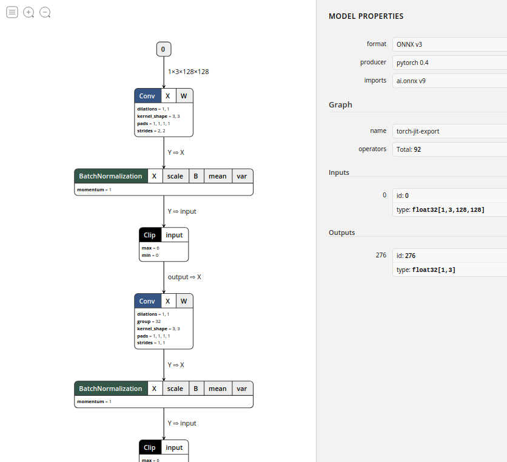
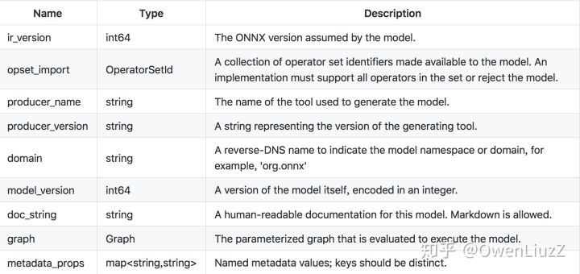
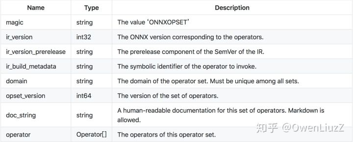
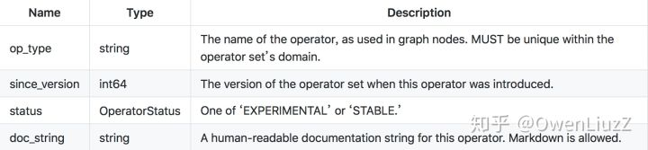
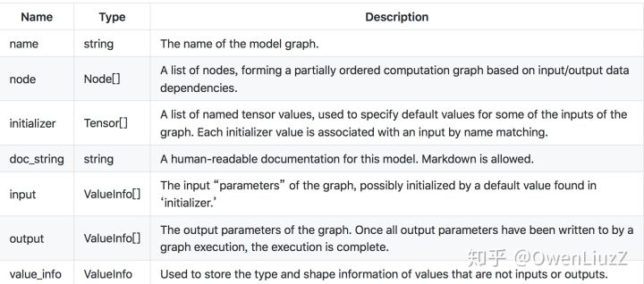
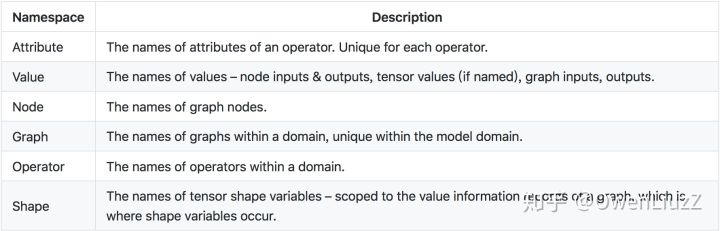
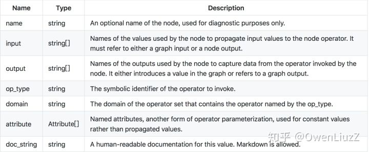
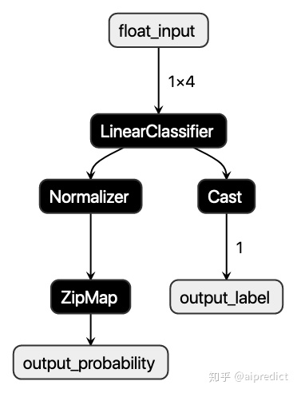

# ONNX介绍

2020年10月23日

---

## 1. ONNX简介

### 1.1 背景

现如今，各大主流深度学习框架都有着自己独有的特点与魅力，吸引着广大科研与开发人员，例如：

- [Caffe2](https://link.zhihu.com/?target=http%3A//caffe2.ai/)：方便机器学习算法和模型大规模部署在移动设备
- [PyTorch](https://link.zhihu.com/?target=http%3A//pytorch.org/)：PyTorch是一个快速便于实验深度学习框架。但是由于其高度封装，导致部分function不够灵活
- [TensorFlow](https://link.zhihu.com/?target=https%3A//www.tensorflow.org/)：TensorFlow 是一个开放源代码软件库，是很多主流框架的基础或者依赖。几乎能满足所有机器学习开发的功能，但是也有由于其功能代码过于底层，学习成本高，代码冗繁，编程逻辑与常规不同等缺点。

此外还有：[Cognitive Toolkit (CNTK)](https://link.zhihu.com/?target=https%3A//www.microsoft.com/en-us/cognitive-toolkit/)，[Apache MXNet](https://link.zhihu.com/?target=http%3A//mxnet.incubator.apache.org/)，[Chainer](https://link.zhihu.com/?target=https%3A//chainer.org/)，[Apple CoreML](https://link.zhihu.com/?target=https%3A//developer.apple.com/documentation/coreml)，[SciKit-Learn](https://link.zhihu.com/?target=http%3A//scikit-learn.org/)，[ML.NET](https://link.zhihu.com/?target=https%3A//github.com/dotnet/machinelearning/)

深度学习算法大多通过计算数据流图来完成神经网络的深度学习过程。 一些框架（例如CNTK，Caffe2，Theano和TensorFlow）使用静态图形，而其他框架（例如PyTorch和Chainer）使用动态图形。 但是这些框架都提供了接口，使开发人员可以轻松构建计算图和运行时，以优化的方式处理图。 这些图用作中间表示（IR），捕获开发人员源代码的特定意图，有助于优化和转换在特定设备（CPU，GPU，FPGA等）上运行。

假设一个场景：现在某组织因为主要开发用TensorFlow为基础的框架，现在有一个深度算法，需要将其部署在移动设备上，以观测变现。传统地我们需要用caffe2重新将模型写好，然后再训练参数；试想下这将是一个多么耗时耗力的过程。

此时，ONNX便应运而生，Caffe2，PyTorch，Microsoft Cognitive Toolkit，Apache MXNet等主流框架都对ONNX有着不同程度的支持。这就便于了我们的算法及模型在不同的框架之间的迁移。

> 典型的几个线路：
>
> - Pytorch -> ONNX -> TensorRT
> - Pytorch -> ONNX -> TVM
> - TF – ONNX – ncnn

### 1.2 ONNX出现

开放神经网络交换ONNX（Open Neural Network Exchange）是一套表示深度神经网络模型的开放格式，由微软和Facebook于2017推出，然后迅速得到了各大厂商和框架的支持。通过短短几年的发展，已经成为表示深度学习模型的实际标准，并且通过`ONNX-ML`，可以支持传统非神经网络机器学习模型，大有一统整个AI模型交换标准。

ONNX定义了一组与环境和平台无关的标准格式，为AI模型的互操作性提供了基础，使AI模型可以在不同框架和环境下交互使用。硬件和软件厂商可以基于ONNX标准优化模型性能，让所有兼容ONNX标准的框架受益。目前，ONNX主要关注在模型预测方面（inferring），使用不同框架训练的模型，转化为ONNX格式后，可以很容易的部署在兼容ONNX的运行环境中。

## 2. ONNX标准介绍

ONNX规范由以下几个部分组成： 

- 一个可扩展的**计算图模型**：定义了通用的计算图中间表示法（Intermediate Representation）。 
- 内置**操作符集**：`ai.onnx`和`ai.onnx.ml`，`ai.onnx`是默认的操作符集，主要针对神经网络模型，`ai.onnx.ml`主要适用于传统非神经网络机器学习模型。 
- **标准数据类型**。包括张量（tensors）、序列（sequences）和映射（maps）。

目前，ONNX规范有两个官方变体，主要区别在与支持的类型和默认的操作符集。ONNX神经网络变体只使用张量作为输入和输出；而作为支持传统机器学习模型的`ONNX-ML`，还可以识别序列和映射，`ONNX-ML`为支持非神经网络算法扩展了ONNX操作符集。

ONNX使用protobuf序列化AI模型，顶层是一个模型（Model）结构，主要由关联的元数据和一个图（Graph）组成；图由元数据、模型参数、输入输出、和计算节点（`Node`）序列组成，这些节点构成了一个计算无环图，每一个计算节点代表了一次操作符的调用，主要由节点名称、操作符、输入列表、输出列表和属性列表组成，属性列表主要记录了一些运行时常量，比如模型训练时生成的系数值。

好吧，如果光看前面的话，可能第一次接触ONNX的童鞋们可能会有点懵。那我们干脆直接一点。假如我们利用Pytorch训练好一个模型，然后我们将其保存为.pt文件：比如就叫做`model.pt`，这个我们应该很熟悉吧，二进制的模型权重文件，我们可以读取这个文件，相当于预加载了权重信息。

那ONNX呢，利用Pytorch我们可以将`model.pt`转化为`model.onnx`格式的权重，在这里onnx充当一个后缀名称，`model.onnx`就代表ONNX格式的权重文件，这个权重文件不仅包含了权重值，也包含了神经网络的网络流动信息以及每一层网络的输入输出信息和一些其他的辅助信息。

简单拿netron这个工具来可视化(读取ONNX文件)一下：



如图，ONNX中的一些信息都被可视化展示了出来，例如文件格式`ONNX v3`，该文件的导出方`pytorch 0.4`等等，这些信息都保存在ONNX格式的文件中。

### 2.1  **ONNX model**

The top-level ONNX construct is a ‘Model.’

模型结构的主要目的是将元数据(meta data)与图形(graph)相关联，图形包含所有可执行元素。 首先，读取模型文件时使用元数据，为实现提供所需的信息，以确定它是否能够：执行模型，生成日志消息，错误报告等功能。此外元数据对工具很有用，例如IDE和模型库，它需要它来告知用户给定模型的目的和特征。

每个model具有以下组件：



### **2.2 ONNX Operator Sets:**

每个模型必须明确命名它依赖于其功能的运算符集。 操作员集定义可用的操作符，其版本和状态。 每个模型按其域定义导入的运算符集。 所有模型都隐式导入默认的ONNX运算符集。

运算符集的属性是：



### **2.3 ONNX Operator**

图(graph)中使用的每个运算符必须由模型(model)导入的一个运算符集明确声明。

运算符定义的属性是**：**



### **2.4 ONNX Graph**

序列化图由一组元数据字段(metadata)，模型参数列表(a list of model parameters,)和计算节点列表组成(a list of computation nodes)。

每个计算数据流图被构造为拓扑排序的节点列表，这些节点形成图形，其必须没有周期。 每个节点代表对运营商的呼叫。 每个节点具有零个或多个输入以及一个或多个输出。

图表具有以下属性：



Each graph MUST define the names and types of its inputs and outputs, which are specified as ‘value info’ structures, having the following properties:


### **2.5 Names Within a Graph**

所有名称必须遵守C标识符语法规则。

节点，输入，输出，初始化器和属性的名称被组织到多个名称空间中。 在命名空间内，每个给定图形的每个名称必须是唯一的。

The namespaces are:



### **2.6 Node**

计算节点由名称，它调用的运算符的名称，命名输入列表，命名输出列表和属性列表组成。输入和输出在位置上与operator输入和输出相关联。 属性按名称与运算符属性相关联。

它们具有以下属性：



计算图中的边缘由后续节点的输入中由名称引用的一个节点的输出建立。

给定节点的输出将新名称引入图中。 节点输出的值由节点的运算符计算。 节点输入可以指定节点输出，图形输入和图形初始化器。 当节点输出的名称与图形输出的名称一致时，图形输出的值是该节点计算的相应输出值。


### 2.2 ML例子

为了更直观的了解ONNX格式内容，下面，我们训练一个简单的Logistic Regression模型，然后导出ONNX。仍然使用常用的分类数据集`iris`：

```python
from sklearn.datasets import load_iris
from sklearn.model_selection import train_test_split
from sklearn.linear_model import LogisticRegression

iris = load_iris()
X, y = iris.data, iris.target
X_train, X_test, y_train, y_test = train_test_split(X, y)

clr = LogisticRegression()
clr.fit(X_train, y_train)
```

使用`skl2onnx`把Scikit-learn模型序列化为ONNX格式：

```python
from skl2onnx import convert_sklearn
from skl2onnx.common.data_types import FloatTensorType

initial_type = [('float_input', FloatTensorType([1, 4]))]
onx = convert_sklearn(clr, initial_types=initial_type)
with open("logreg_iris.onnx", "wb") as f:
    f.write(onx.SerializeToString())
```

使用ONNX Python API查看和验证模型：

```python
import onnx

model = onnx.load('logreg_iris.onnx')
print(model)
```

输出模型信息如下：

```text
ir_version: 5
producer_name: "skl2onnx"
producer_version: "1.5.1"
domain: "ai.onnx"
model_version: 0
doc_string: ""
graph {
  node {
    input: "float_input"
    output: "label"
    output: "probability_tensor"
    name: "LinearClassifier"
    op_type: "LinearClassifier"
    attribute {
      name: "classlabels_ints"
      ints: 0
      ints: 1
      ints: 2
      type: INTS
    }
    attribute {
      name: "coefficients"
      floats: 0.375753253698349
      floats: 1.3907358646392822
      floats: -2.127762794494629
      floats: -0.9207873344421387
      floats: 0.47902926802635193
      floats: -1.5524250268936157
      floats: 0.46959221363067627
      floats: -1.2708674669265747
      floats: -1.5656673908233643
      floats: -1.256540060043335
      floats: 2.18996000289917
      floats: 2.2694246768951416
      type: FLOATS
    }
    attribute {
      name: "intercepts"
      floats: 0.24828049540519714
      floats: 0.8415762782096863
      floats: -1.0461325645446777
      type: FLOATS
    }
    attribute {
      name: "multi_class"
      i: 1
      type: INT
    }
    attribute {
      name: "post_transform"
      s: "LOGISTIC"
      type: STRING
    }
    domain: "ai.onnx.ml"
  }
  node {
    input: "probability_tensor"
    output: "probabilities"
    name: "Normalizer"
    op_type: "Normalizer"
    attribute {
      name: "norm"
      s: "L1"
      type: STRING
    }
    domain: "ai.onnx.ml"
  }
  node {
    input: "label"
    output: "output_label"
    name: "Cast"
    op_type: "Cast"
    attribute {
      name: "to"
      i: 7
      type: INT
    }
    domain: ""
  }
  node {
    input: "probabilities"
    output: "output_probability"
    name: "ZipMap"
    op_type: "ZipMap"
    attribute {
      name: "classlabels_int64s"
      ints: 0
      ints: 1
      ints: 2
      type: INTS
    }
    domain: "ai.onnx.ml"
  }
  name: "deedadd605a34d41ac95746c4feeec1f"
  input {
    name: "float_input"
    type {
      tensor_type {
        elem_type: 1
        shape {
          dim {
            dim_value: 1
          }
          dim {
            dim_value: 4
          }
        }
      }
    }
  }
  output {
    name: "output_label"
    type {
      tensor_type {
        elem_type: 7
        shape {
          dim {
            dim_value: 1
          }
        }
      }
    }
  }
  output {
    name: "output_probability"
    type {
      sequence_type {
        elem_type {
          map_type {
            key_type: 7
            value_type {
              tensor_type {
                elem_type: 1
              }
            }
          }
        }
      }
    }
  }
}
opset_import {
  domain: ""
  version: 9
}
opset_import {
  domain: "ai.onnx.ml"
  version: 1
}
```

我们可以看到顶层字段记录了一些模型的元数据信息，代表的含义都比较直观，字段详细解释可以参考文档 [Open Neural Network Exchange - ONNX](https://link.zhihu.com/?target=https%3A//github.com/onnx/onnx/blob/master/docs/IR.md)。`opset_import`记录了该模型引入的操作符集。空的`domain`操作符集表示引入ONNX默认的操作符集`ai.onnx`。`ai.onnx.ml`代表支持传统非神经网络模型操作符集，比如以上模型中的`LinearClassifier`、`Normalizer`和`ZipMap`。图（graph）中定义了以下元素：

- 四个计算节点（node）。
- 一个输入变量`float_input`，类型为1*4的张量，`elem_type`是一个DataType枚举型变量，1代表FLOAT。
- 两个输出变量`output_label`和`output_probability`，`output_label`类型为维数为1的INT64（elem_type: 7）张量，代表预测目标分类； `output_probability`类型是映射的序列，映射的键是INT64（key_type: 7），值为维数为1的FLOAT，代表每一个目标分类的概率。

可以使用[netron](https://link.zhihu.com/?target=https%3A//lutzroeder.github.io/netron/)，图像化显示ONNX模型的计算拓扑图，以上模型如下图：



下面我们使用ONNX Runtime Python API预测该ONNX模型，当前仅使用了测试数据集中的第一条数据：

```python
import onnxruntime as rt
import numpy
sess = rt.InferenceSession("logreg_iris.onnx")
input_name = sess.get_inputs()[0].name
label_name = sess.get_outputs()[0].name
probability_name = sess.get_outputs()[1].name
pred_onx = sess.run([label_name, probability_name], {input_name: X_test[0].astype(numpy.float32)})

# print info
print('input_name: ' + input_name)
print('label_name: ' + label_name)
print('probability_name: ' + probability_name)
print(X_test[0])
print(pred_onx)
```

打印的模型信息和预测值如下：

```text
input_name: float_input
label_name: output_label
probability_name: output_probability
[5.5 2.6 4.4 1.2]
[array([1], dtype=int64), [{0: 0.012208569794893265, 1: 0.5704444646835327, 2: 0.4173469841480255}]]
```

完整的程序，可以参考以下Notebook：[onnx.ipynb](https://link.zhihu.com/?target=https%3A//github.com/aipredict/ai-deployment/blob/master/deploy-ml-dl-using-onnx/onnx.ipynb)

## 3. ONNX与PMML

ONNX和PMML都是与平台和环境无关的模型表示标准，可以让模型部署脱离模型训练环境，简化了部署流程，加速模型快速上线到生产环境中。这两个标准都得到了各大厂商和框架的支持，具有广泛的应用。

- PMML是一个比较成熟的标准，在ONNX诞生之前，可以说是模型表示的实际标准，对传统数据挖掘模型有丰富的支持，最新 [PMML4.4](https://link.zhihu.com/?target=http%3A//dmg.org/pmml/v4-4/GeneralStructure.html) 可以支持多达19种模型类型。但是，目前PMML缺乏对深度学习模型的支持，下一版本5.0有可能会添加对深度神经网络的支持，但是因为PMML是基于老式的XML格式，使用文本格式来存储深度神经网络模型结构和参数会带来模型大小和性能的问题，目前该问题还没有一个完美的解决方案。关于PMML的详细介绍，可以参考文章[《使用PMML部署机器学习模型》](https://zhuanlan.zhihu.com/p/79197337)。
- ONNX作为一个新的标准，刚开始主要提供对深度神经网络模型的支持，解决模型在不同框架下互操作和交换的问题。目前通过`ONNX-ML`，ONNX已经可以支持传统非神经网络机器学习模型，但是目前模型类型还不够丰富。ONNX使用protobuf二进制格式来序列化模型，可以提供更好的传输性能。

ONNX和PMML这两种格式都有成熟的开源类库和框架支持，PMML有[JPMML](https://link.zhihu.com/?target=https%3A//github.com/jpmml)，[PMML4S](https://link.zhihu.com/?target=https%3A//github.com/autodeployai/pmml4s)，[PyPMML](https://link.zhihu.com/?target=https%3A//github.com/autodeployai/pypmml)等。ONNX有微软的[ONNX runtime](https://link.zhihu.com/?target=https%3A//github.com/microsoft/onnxruntime)，[NVIDIA TensorRT](https://link.zhihu.com/?target=https%3A//github.com/NVIDIA/TensorRT)等。用户可以根据自己的实际情况选择合适的跨平台格式来部署AI模型。


## 参考

- ONNX官网：[https://onnx.ai/](https://link.zhihu.com/?target=https%3A//onnx.ai/)
- AutoDeployAI官网：[https://www.autodeploy.ai/](https://link.zhihu.com/?target=https%3A//www.autodeploy.ai/)
- ONNX Github：[https://github.com/onnx/onnx](https://link.zhihu.com/?target=https%3A//github.com/onnx/onnx)
- ONNX Runtime：[https://github.com/microsoft/onnxruntime](https://link.zhihu.com/?target=https%3A//github.com/microsoft/onnxruntime)
- https://zhuanlan.zhihu.com/p/86867138
- https://bindog.github.io/blog/2020/03/13/deep-learning-model-convert-and-depoly/