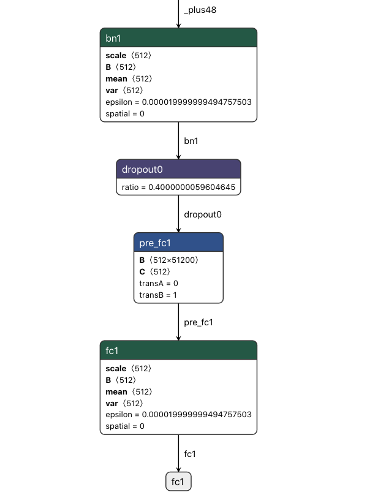
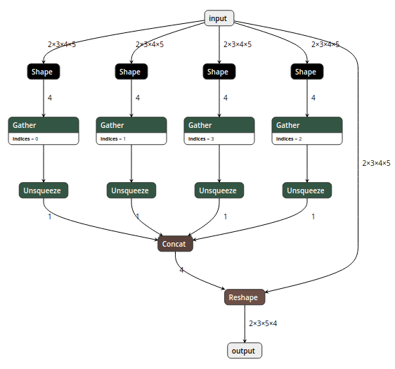

# 深度学习模型转换与部署那些事(含ONNX格式详细分析)

2020-03-13

------

## 背景

深度学习模型在训练完成之后，部署并应用在生产环境的这一步至关重要，毕竟训练出来的模型不能只接受一些公开数据集和榜单的检验，还需要在真正的业务场景下创造价值，不能只是为了PR而躺在实验机器上

在现有条件下，一般涉及到模型的部署就要涉及到模型的转换，而转换的过程也是随着对应平台的不同而不同，一般工程师接触到的平台分为GPU云平台、手机和其他嵌入式设备

对于GPU云平台来说，在上面部署本应该是最轻松的事情，但是实际情况往往比较复杂。有历史遗留问题，比如说3年前的古董级的模型因为效率和推理速度问题需要进行优化，也有算法团队使用了一些比较小众或者自定义的OP的问题。其实解决这类问题有非常直接的方式，例如直接用最新的框架重新训练，或者算法团队对模型做一些妥协，替换掉一些骚操作，那么对部署工程师来说问题就简单了很多。但是有些情况下（算法团队很忙或者必须效果优先），我们只能自己从框架的层面来解决这个问题，包括但不限于：实现新OP、修改不兼容的属性、修改不兼容的权重形状

当然这里无论是模型转换还是模型部署，我个人比较推荐的做法是都是使用ONNX作为中间媒介。所以我们有必要对ONNX做一个比较透彻的了解

## 第一部分：ONNX结构分析与修改工具

### ONNX结构分析

对于ONNX的了解，很多人可能仅仅停留在它是一个开源的深度学习模型标准，能够用于模型转换及部署但是对于其内部是如何定义这个标准，如何实现和组织的，却并不十分了解，所以在转换模型到ONNX的过程中，对于出现的不兼容不支持的问题有些茫然。

ONNX结构的定义基本都在这一个[onnx.proto](https://github.com/onnx/onnx/blob/master/onnx/onnx.proto)文件里面了，如何你对protobuf不太熟悉的话，可以先简单了解一下再回来看这个文件。当然我们也不必把这个文件每一行都看明白，只需要了解其大概组成即可，有一些部分几乎不会使用到可以忽略。

这里我把需要重点了解的对象列出来

- ModelProto
- GraphProto
- NodeProto
- AttributeProto
- ValueInfoProto
- TensorProto

我用尽可能简短的语言描述清楚上述几个Proto之间的关系：当我们将ONNX模型load进来之后，得到的是一个`ModelProto`，它包含了一些版本信息，生产者信息和一个非常重要的`GraphProto`；在`GraphProto`中包含了四个关键的repeated数组，分别是`node`(`NodeProto`类型)，`input`(`ValueInfoProto`类型)，`output`(`ValueInfoProto`类型)和`initializer`(`TensorProto`类型)，其中`node`中存放着模型中的所有计算节点，`input`中存放着模型所有的输入节点，`output`存放着模型所有的输出节点，`initializer`存放着模型所有的权重；那么节点与节点之间的拓扑是如何定义的呢？非常简单，每个计算节点都同样会有`input`和`output`这样的两个数组(不过都是普通的string类型)，通过`input`和`output`的指向关系，我们就能够利用上述信息快速构建出一个深度学习模型的拓扑图。最后每个计算节点当中还包含了一个`AttributeProto`数组，用于描述该节点的属性，例如`Conv`层的属性包含`group`，`pads`和`strides`等等，具体每个计算节点的属性、输入和输出可以参考这个[Operators.md](https://github.com/onnx/onnx/blob/master/docs/Operators.md)文档。

需要注意的是，刚才我们所说的`GraphProto`中的`input`输入数组不仅仅包含我们一般理解中的图片输入的那个节点，还包含了模型当中所有权重。举个例子，`Conv`层中的`W`权重实体是保存在`initializer`当中的，那么相应的会有一个同名的输入在`input`当中，其背后的逻辑应该是把权重也看作是模型的输入，并通过`initializer`中的权重实体来对这个输入做初始化(也就是把值填充进来)

### ONNX的兼容性问题

为什么要修改ONNX模型？因为ONNX版本迭代以及框架之间对OP定义的不兼容，导致转换出来的ONNX模型千奇百怪，会有一些莫名奇妙的错误。

比如在MXNet框架下有一个非常灵活的写法，可以在BatchNormalization后面直接跟FC层，如下图所示(请忽略其中的dropout，我也不知道算法同学是如何在inference/eval模式下把dropout层导出到ONNX模型里面来的)：



使用`onnxruntime`进行inference的时候，报错提示`FAIL : Node (pre_fc1) Op (Gemm) [ShapeInferenceError] First input does not have rank 2`，那么为什么这个在MXNet下正常的模型转换成ONNX之后就出错了呢？严格来说，BatchNormalization出来output的维度为4，而FC层所接受的输入维度是2，这两者之间差了一个Flatten操作，但是MXNet（可能不限于MXNet）隐含的帮我们完成了这个步骤，所以说灵活性背后是有代价的。

这还仅仅是冰山一角，事实上你只要翻一翻`onnxruntime`这个repo的issue，还能看到不少类似的不兼容问题，例如BatchNormalization中的spatial属性引发的问题：

- https://github.com/onnx/models/issues/156
- https://github.com/microsoft/onnxruntime/issues/2175

此外还有PyTorch模型转换到ONNX模型中非常常见的reshape的问题：



一个简单的PyTorch中的view操作，期待出来的就是一个简单的reshape操作，但是如果你的形状参数用的是形如`x.size(0)`这样的话就会出现上图的问题，必须做一个强制类型转换`int(x.size(0)`，或者用[onnx-simplifier](https://github.com/daquexian/onnx-simplifier)来处理一下模型

### 修改ONNX模型

解决问题的最好办法是从根源入手，也就是从算法同学那边的模型代码入手，我们需要告诉他们问题出在哪里，如何修改。但是也有一些情况是无法通过修改模型代码解决的，或者与其浪费那个时间，不如我们部署工程师直接在ONNX模型上动刀解决问题。

还有一种更dirty的工作是，我们需要debug原模型和转换后的ONNX模型输出结果是否一致(误差小于某个阈值)，如果不一致问题出现在哪一层，现有的深度学习框架我们有很多办法能够输出中间层的结果用于对比，而据我所知，ONNX中并没有提供这样的功能；这就导致了我们的debug工作极为繁琐

所以如果有办法能够随心所欲的修改ONNX模型就好了。要做到这一点，就需要了解上文所介绍的ONNX结构知识了。

比如说我们要在网络中添加一个节点，那么就需要先创建相应的`NodeProto`，参照文档设定其的属性，指定该节点的输入与输出，如果该节点带有权重那还需要创建相应的`ValueInfoProto`和`TensorProto`分别放入graph中的`input`和`initializer`中，以上步骤缺一不可。

经过一段时间的摸索和熟悉，我写了一个小工具[onnx-surgery](https://github.com/bindog/onnx-surgery)并集成了一些常用的功能进去，实现的逻辑非常简单，也非常容易拓展。代码比较简陋，但是足以完成一些常见的修改操作

## 第二部分：各大深度学习框架如何转换到ONNX？

（需要说明的是，由于深度学习领域发展迅速，本文提到的几个框架也在快速的迭代过程中，所以希望本文提到的一些坑和bug在未来的版本当中能够逐一解决，也希望大家永远不要踩本文所提到的那些坑）

### MXNet转换ONNX

MXNet官方文档给出了一个非常简单的例子展示如何转换

```
import mxnet as mx
import numpy as np
from mxnet.contrib import onnx as onnx_mxnet
import logging
logging.basicConfig(level=logging.INFO)

# Download pre-trained resnet model - json and params by running following code.
path='http://data.mxnet.io/models/imagenet/'
[mx.test_utils.download(path+'resnet/18-layers/resnet-18-0000.params'),
 mx.test_utils.download(path+'resnet/18-layers/resnet-18-symbol.json'),
 mx.test_utils.download(path+'synset.txt')]

# Downloaded input symbol and params files
sym = './resnet-18-symbol.json'
params = './resnet-18-0000.params'

# Standard Imagenet input - 3 channels, 224*224
input_shape = (1,3,224,224)

# Path of the output file
onnx_file = './mxnet_exported_resnet50.onnx'

# Invoke export model API. It returns path of the converted onnx model
converted_model_path = onnx_mxnet.export_model(sym, params, [input_shape], np.float32, onnx_file)
```

这个重点提一下MXNet转换ONNX模型可能会遇到的一些问题，不排除在未来版本MXNet修复了相关问题，也不排除未来ONNX版本更新又出现新的不兼容问题。

第一个问题与MXNet的BatchNorm层中的fix_gamma参数有关，当fix_gamma参数为True时，其含义是将gamma这个参数固定为1，即(x-mean)/var * gamma + beta；但是这里就出现了不兼容的问题，因为在ONNX当中是没有fix_gamma这个属性的，如果fix_gamma为False不会有问题，如果fix_gamma为True就会出现两者计算结果不一致问题。解决方法很直观，当fix_gamma参数为True时，我们必须手动将ONNX当中的gamma参数全部置为1

第二个问题与MXNet的Pooling层中的count_include_pad属性有关，这个问题应该是MXNet贡献者的疏忽，当Pooling层的类型为’avg’时，忘记了在生成ONNX节点时设置该属性。解决方法就是在_op_translation.py文件里增加一个分支，将这个遗漏属性补上。

```
count_include_pad = 1 if attrs.get("count_include_pad", "True") in ["True", "1"] else 0
# ...
# ...
# ...
elif pool_type == "avg":
  node = onnx.helper.make_node(
    pool_types[pool_type],
    input_nodes,  # input
    [name],
    count_include_pad=count_include_pad,
    kernel_shape=kernel,
    pads=pad_dims,
    strides=stride,
    name=name
  )
```

当然，如果你不想直接修改MXNet的导出代码，也可以直接修改ONNX模型达到同样的目的，方法可以参考上一篇文章中我写的小工具

### TensorFlow模型转ONNX

tf的模型转换ONNX已经有现成的转换工具，https://github.com/onnx/tensorflow-onnx，先将tf的模型freeze_graph之后得到pb文件，再利用该转换工具即可转换为onnx模型

freeze_graph的方式网上有很多版本，我这里用的是一个老版本的方法(tensorflow==1.8.0)

```
# your network def
import network

input_size = (224, 224)
ckpt_model_path = "./model.ckpt"
pb_model_path = "./model.pb"
output_node_name = "your model output name"

graph = tf.Graph()
with graph.as_default():
    placeholder = tf.placeholder(
        dtype=tf.float32, shape=[None, input_size[0], input_size[1], 3], name="pb_input"
    )
    output = network(placeholder)
		
    # your can get all the tensor names if you do not know your input and output name in your ckpt with this code
    # nl = [n.name for n in tf.get_default_graph().as_graph_def().node]
    # for n in nl:
    #     print(n)

    saver = tf.train.Saver()
    sess = tf.Session(
        config=tf.ConfigProto(
            gpu_options=tf.GPUOptions(
                allow_growth=True, per_process_gpu_memory_fraction=1.0),
            allow_soft_placement=True
        )
    )
    saver.restore(sess, ckpt_model_path)

    output_graph_def = graph_util.convert_variables_to_constants(
        sess, sess.graph_def, [output_node_name]
    )
    with tf.gfile.FastGFile(pb_model_path, mode="wb") as f:
        f.write(output_graph_def.SerializeToString())
		
    # you can get the input and output name of your model.pb file
    # maybe a "import/" is needed to append before the name if you
    # get some error
    # gf = tf.GraphDef()
    # gf.ParseFromString(open('./model.pb', 'rb').read())
    # nl2 = [n.name + '=>' +  n.op for n in gf.node if n.op in ('Softmax', 'Placeholder')]
    # for n in nl2:
    #     print(n)
```

需要指出的是大部分tf模型的输入layout都是NHWC，而ONNX模型的输入layout为NCHW，因此建议在转换的时候加上`--inputs-as-nchw`这个选项，其他选项可以参考文档，非常详细

典型的转换命令如下所示：

```
python3 -m tf2onnx.convert --input xxxx.pb --inputs pb_input:0 --inputs-as-nchw pb_input:0 --outputs resnet_v2_101/predictions/Softmax:0 --output xxxx.onnx
```

注意，由于tensorflow的模型输入一般会比较灵活，输入的batch_size可以留空，可以在运行时传入不同大小的batch_size数据。但是一般在ONNX和TensorRT这些框架中，我们习惯于指定一个固定的batch_size，那如何修改呢，可以参考上一篇文章中我写的那个小工具，有一个例子展示如何修改ONNX模型的batch_size

### PyTorch模型转ONNX

在PyTorch推出jit之后，很多情况下我们直接用torch scirpt来做inference会更加方便快捷，并不需要转换成ONNX格式了，当然如果你追求的是极致的效率，想使用TensorRT的话，那么还是建议先转换成ONNX的。

```
import torch
import torchvision

dummy_input = torch.randn(10, 3, 224, 224, device='cuda')
model = torchvision.models.alexnet(pretrained=True).cuda()

# Providing input and output names sets the display names for values
# within the model's graph. Setting these does not change the semantics
# of the graph; it is only for readability.
#
# The inputs to the network consist of the flat list of inputs (i.e.
# the values you would pass to the forward() method) followed by the
# flat list of parameters. You can partially specify names, i.e. provide
# a list here shorter than the number of inputs to the model, and we will
# only set that subset of names, starting from the beginning.
input_names = [ "actual_input_1" ] + [ "learned_%d" % i for i in range(16) ]
output_names = [ "output1" ]

torch.onnx.export(model, dummy_input, "alexnet.onnx", verbose=True, input_names=input_names, output_names=output_names)
```

注意上面的input_names和output_names不是必需的参数，省略也是可以的

## 第三部分：ONNX到目标平台

ONNX实际只是一套标准，里面只不过存储了网络的拓扑结构和权重（其实每个深度学习框架最后固化的模型都是类似的），脱离开框架是没有办法直接进行inference的。大部分框架（除了tensorflow）基本都做了ONNX模型inference的支持，这里就不进行展开了。

那么如果你想直接使用ONNX模型来做部署的话，有下列几种情况：第一种情况，目标平台是CUDA或者X86的话，又怕环境配置麻烦采坑，比较推荐使用的是微软的[onnxruntime](https://microsoft.github.io/onnxruntime/)，毕竟是微软亲儿子；第二种情况，而如果目标平台是CUDA又追求极致的效率的话，可以考虑转换成TensorRT；第三种情况，如果目标平台是ARM或者其他IoT设备，那么就要考虑使用端侧推理框架了，例如NCNN、MNN和MACE等等。

第一种情况应该是坑最少的一种了，但要注意的是官方的onnxruntime安装包只支持CUDA 10和Python 3，如果是其他环境可能需要自行编译。安装完成之后推理部署的代码可以直接参考官方文档。

第二种情况要稍微麻烦一点，你需要先搭建好TensorRT的环境，然后可以直接使用TensorRT对ONNX模型进行推理；然后更为推荐的做法是将ONNX模型转换为TensorRT的engine文件，这样可以获得最优的性能。关于ONNX parser部分的[代码](https://github.com/onnx/onnx-tensorrt)，NVIDIA是开源出来了的（当然也包括其他parser比如caffe的），不过这一块如果你所使用的模型中包括一些比较少见的OP，可能是会存在一些坑的，比如我们的模型中包含了一个IBN结构，引入了InstanceNormalization这个OP，解决的过程可谓是一波三折；好在NVIDIA有一个论坛，有什么问题或者bug可以在上面进行反馈，专门有NVIDIA的工程师在上面解决大家的问题，不过从我两次反馈bug的响应速度来看NVIDIA还是把TensorRT开源最好，这样方便大家自己去定位bug

第三种情况的话一般问题也不大，由于是在端上执行，计算力有限，所以确保你的模型是经过精简和剪枝过的能够适配移动端的。几个端侧推理框架的性能到底如何并没有定论，由于大家都是手写汇编优化，以卷积为例，有的框架针对不同尺寸的卷积都各写了一种汇编实现，因此不同的模型、不同的端侧推理框架，不同的ARM芯片都有可能导致推理的性能有好有坏，这都是正常情况。


## 参考

> https://bindog.github.io/blog/2020/03/13/deep-learning-model-convert-and-depoly/