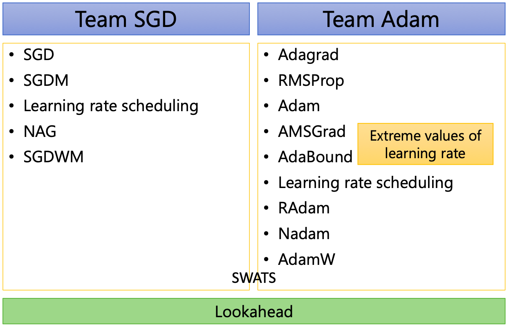
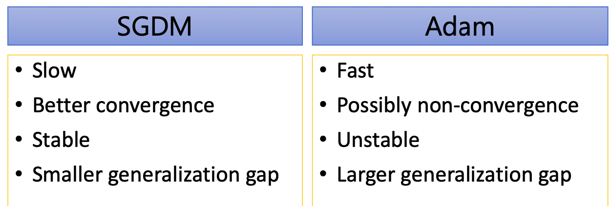
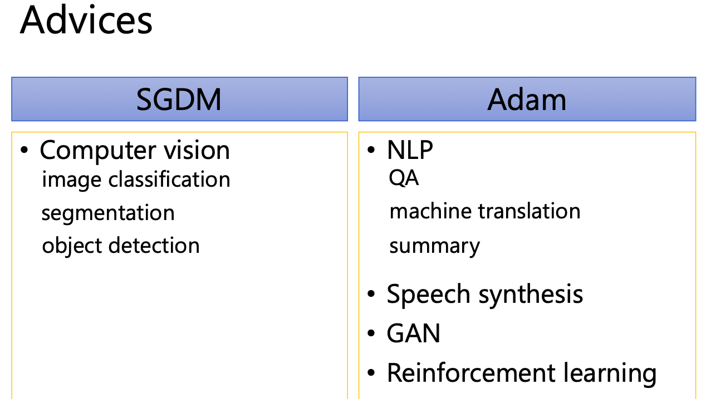

# 优化器

## 👍BP求导

🍀[矩阵向量求导](matrixg.md)

🍀[深度神经网络（DNN）模型与前向/反向传播算法](bpdnn.md)---->[DNN - 反向传播算法(特详细)](bp.md)---->[手动实现DNN](https://github.com/FelixFu520/dl-by-hand)

🍀[深度神经网络（CNN）模型与前向/反向传播算法](bpcnn_1.md)---->[CNN-反向传播算法](bpcnn.md) ---->[手动实现CNN](https://github.com/FelixFu520/dl-by-hand)

## 👍优化器

🍀[优化方法总结](opt.md)

🍀[梯度下降算法](sgd.md)

🍀[梯度衰减](../pytorch/shuaijian.md)

