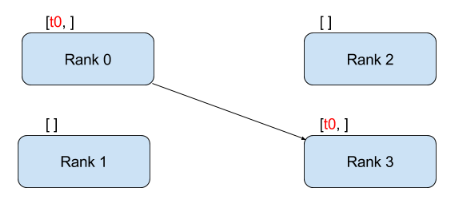
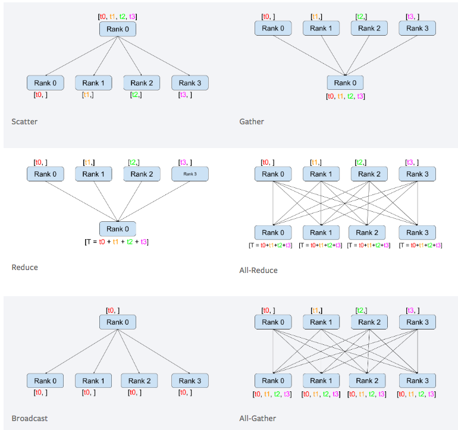

# MPI

2020年9月4日

---

## 一、MPI 基础概念

MPI是分布式计算的基础接口架构，他有很多实现，比如intelMPI openMPI等等，而这些具体实现了这些接口里面的内容，比如一些通信协议。

MPI有几个很重要的概念**rank**, **group**, **communicator**, **type**, **pack**, **spawn**, **window**, 理解了这些概念MPI就算入门了。

### 1.group

group是MPI一个很重要的概念，一台电脑可以属于多个group，group的正真强大体现在可以随时随地的组合任意group，然后利用gourp内，和group间的communicator，可以很容易实现复杂科学计算的中间过程，比如奇数rank一个group，偶数另一个group，或者拓扑结构的group，这样可以解决很多复杂问题，另外MPI还有一个默认的全局的group，他就是comm world，一般简单的应用有了这一个group已经足够了。

### 2.rank

rank就是任意group内的一个计算单元，利用rank我们可以很轻松的实现client server的架构，比如rank＝0是server其他就是client。

### 3.communicator

communicator就是各种通信，比如一对一，一对多，多对一，其中多往往代表着一个group, 在传输过程中tag还是很有用的可以用来区别不同的任务类型，一般都是先解析tag，然后再解析具体的数据内容， 这里要有一个信封和信内容的差别的概念，理解了这样的差别，可以很好的扩展程序。

### 4.type

type是MPI的自定义类型，由于通常编程的时候常用struct 数组 和离散的变量，这些东西不能直接进行通信， 然后MPI同样有一套这样的定义，我们可以转化成MPI的格式，这样就可以很自由的通信了。

### 5.pack

Pack，就是把离散的数据打包起来，方便传送，其实这个作用和type很类似，如果你不想很麻烦的定义type直接打包发送。

### 6.spawn

spawn是区分MPI一代和二代的一个重要的标志，有了spawn，就可以在运行过程中自动的改变process的数量，可能复杂的软件才有这样的需求。

### 7.window

window远程的控制同一个文件，只有在网络条件很好的时候用这个才有意义，否则会让软件效率变得很糟糕。、

最后要有一个思想就是同一份代码可能会被很多电脑同时执行到，注意区分个个部分代码的角色。

## 二、MPI 通信

### 1. MPI

MPI(Message Passing Interface)是一种消息传递接口，是一个消息传递汉书库的标准说明。在基于MPI编程模型中，计算是由一个或多个彼此通过调用库函数进行消息收、发通信的进程所组成。MPI为程序员提供一个并行环境库，程序员通过调用MPI的库程序来达到程序员所要达到的并行目的。

### 2.同步/异步

二者区别主要在于：发送操作是否要等 “接收进程接收消息完成” 才完成

同步发送操作： 只有等消息被接收进程安全接收后才算完成。（数据发出去了，而且被接收进程安全接收了，才完成）

异步发送操作：  操作完成后，消息不一定被接收进程接收。（只要把消息发出去就算完成，不管有没有接收）

### 3.阻塞/非阻塞通讯

二者区别主要在于：调用完成是否依靠某些“事件”

阻塞通讯：调用完成要依赖某些“事件”。（阻塞发送或接收的 函数内部 会等待这个“事件“：”事件“没发生，函数就阻塞在那里；”事件“发生了，函数才返回）

​       阻塞发送：数据必须成功的发送或被拷贝到系统缓冲区，使得该数据缓冲区可被重新使用。这个“事件”发生，函数才返回，发送操作才完成。          

​       阻塞接收：数据必须保证接收到本地缓冲区。这个“事件“发生，函数才返回，接收操作才完成。

非阻塞通讯：不等任何“事件”，就可完成，不保证数据已正确发送或接收。（发完或接收操作发起后，不等”事件“，直接返回。但是，如果要想知道数据有没有被正确发送或接收，要使用wait(), test()查询）

### 4.同步阻塞发送/同步无阻塞发送（异步都是非阻塞）

同步阻塞发送：发送操作要等消息被安全接收才算完成。发送操作本身使阻塞，要等某“事件”，发送操作才返回。（发送返回了，说明“事件“肯定发生了。不需要再用wait() test() 查询）

同步非阻塞发送：发送操作要等消息被安全接收才算完成。但是，要想知道数据被正确接收，要用wait()，test这些函数查询。

### 5.集合通信

通信因子包含一个相互之间通信的进程组。

集合通信是包含在通信因子中的所有进程都参加操作。

集合操作的三种类型：

- 同步：集合中所有进程都到达后，每个进程再接着运行；
- 数据传递： 广播(Broadcast),  分散(Scatter), 收集(Gather)，全部到全部(Alltoall)。
- 规约：集合中的一个进程收集说有进程的数据并计算（如：求最大值，最小值，加，乘）

集合操作是阻塞的。

(1)广播（Broadcast）
(2) 分散(Scatter)
(3) 收集(Gather)
(4)全部到全部(Alltoall)
(5)allgather
注：本文参考神威1计算机系统 MPI培训手册

#### Point-to-Point Communication

##### Collective Communication

