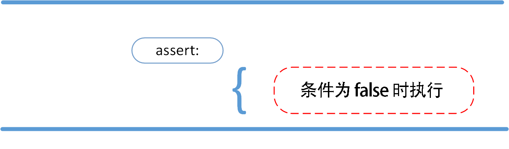

# Python3 assert（断言）

2020年10月21日

---

Python assert（断言）用于判断一个表达式，在表达式条件为 false 的时候触发异常。

断言可以在条件不满足程序运行的情况下直接返回错误，而不必等待程序运行后出现崩溃的情况，例如我们的代码只能在 Linux 系统下运行，可以先判断当前系统是否符合条件。



语法格式如下：

```
assert expression
```

等价于：

```
if not expression:
    raise AssertionError
```

assert 后面也可以紧跟参数:

```
assert expression [, arguments]
```

等价于：

```
if not expression:
    raise AssertionError(arguments)
```

以下为 assert 使用实例：

\>>> **assert** True   # 条件为 true 正常执行
\>>> **assert** False   # 条件为 false 触发异常
Traceback (most recent call last):
 File "<stdin>", line 1, **in** <module>
AssertionError
\>>> **assert** 1\=\=1   # 条件为 true 正常执行
\>>> **assert** 1\==2   # 条件为 false 触发异常
Traceback (most recent call last):
 File "<stdin>", line 1, **in** <module>
AssertionError

\>>> **assert** 1==2, '1 不等于 2'
Traceback (most recent call last):
 File "<stdin>", line 1, **in** <module>
AssertionError: 1 不等于 2
\>>> 

以下实例判断当前系统是否为 Linux，如果不满足条件则直接触发异常，不必执行接下来的代码：

## 实例

**import** sys
**assert** ('linux' **in** sys.platform), "该代码只能在 Linux 下执行"

\# 接下来要执行的代码